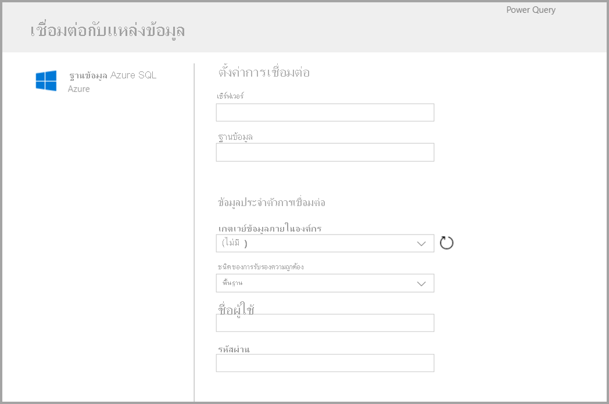
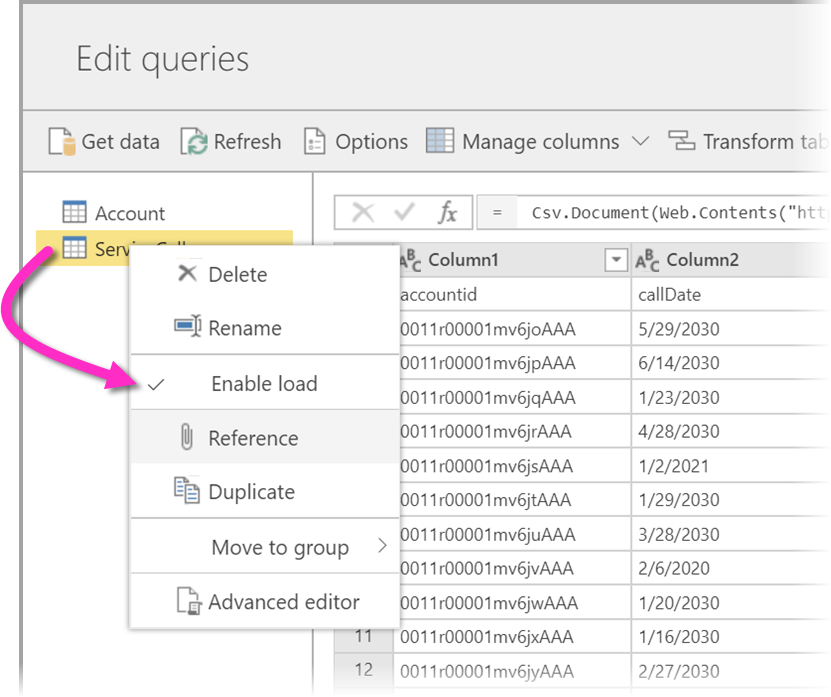
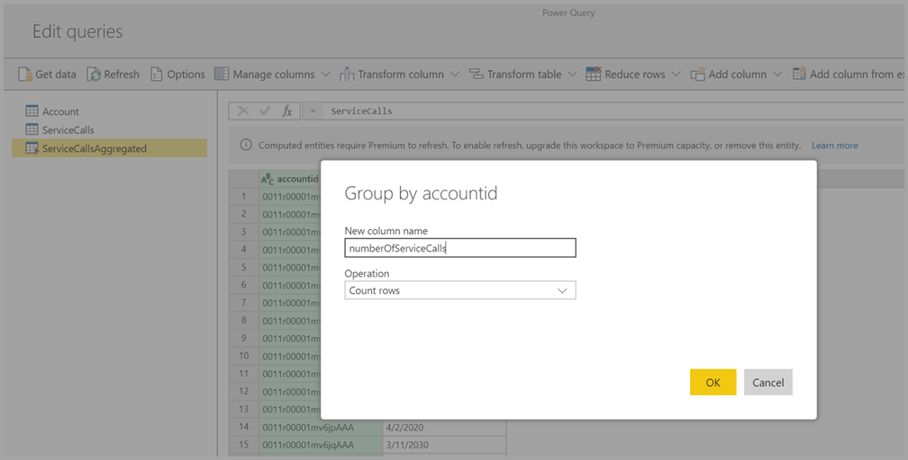
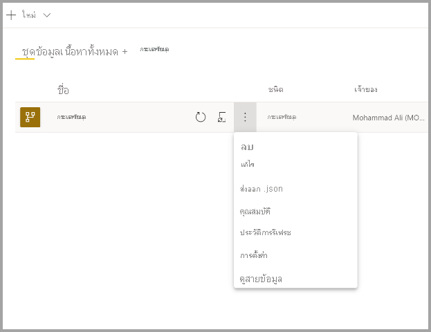

# การสร้างกระแสข้อมูลCreating a dataflow
**กระแสข้อมูล** คือคอลเลกชันของเอนทิตี (เอนทิตีนั้นคล้ายกับตาราง) ซึ่งสร้างและจัดการได้ในพื้นที่ทำงานในบริการของ Power BIA **dataflow** is a collection of entities (entities are similar to tables) that are created and managed in workspaces in the Power BI service. **เอนทิตี/ตาราง** คือชุดเขตข้อมูลที่ใช้เพื่อเก็บข้อมูล ซึ่งคล้ายคลึงกับตารางที่อยู่ภายในฐานข้อมูลAn **entity/Table** is a set of fields that are used to store data, much like a table within a database. คุณสามารถเพิ่มและแก้ไขเอนทิตี/ตารางในกระแสข้อมูลได้ และสามารถจัดการกำหนดการรีเฟรชข้อมูลได้โดยตรงจากพื้นที่ทำงานที่ใช้สร้างกระแสข้อมูลYou can add and edit entities/tables in your dataflow, as well as manage data refresh schedules, directly from the workspace in which your dataflow was created.

เมื่อต้องการสร้างกระแสข้อมูล ให้เปิดใช้บริการของ Power BI ในเบราว์เซอร์ จากนั้นเลือก **พื้นที่ทำงาน** (กระแสข้อมูลไม่พร้อมใช้งานใน *พื้นที่ทำงานของฉัน* ในบริการของ Power BI) จากบานหน้าต่างด้านซ้าย ดังที่แสดงในหน้าจอต่อไปนี้To create a dataflow, launch the Power BI service in a browser then select a **workspace** (dataflows are not available in *my-workspace* in the Power BI service) from the nav pane on the left, as shown in the following screen. คุณยังสามารถสร้างพื้นที่ทำงานใหม่ได้ ซึ่งใช้เพื่อสร้างกระแสข้อมูลชุดใหม่You can also create a new workspace in which to create your new dataflow.

มีหลายแนวทางในการสร้างหรือต่อยอดอยู่ด้านบนของกระแสข้อมูลใหม่:There are a multiple of ways to create or build on top of a new dataflow:

* [สร้างกระแสข้อมูลโดยใช้กำหนดเอนทิตีใหม่Create a dataflow using define new entities](#create-a-dataflow-using-define-new-entities)
* [สร้างกระแสข้อมูลโดยใช้เอนทิตีที่เชื่อมโยงCreate a dataflow using linked entities](#create-a-dataflow-using-linked-entities)
* [สร้างกระแสข้อมูลโดยใช้เอนทิตีที่คำนวณCreate a dataflow using a computed entity](#create-a-dataflow-using-a-computed-entity)
* [สร้างกระแสข้อมูลโดยใช้นำเข้า/ส่งออกCreate a dataflow using import/export](#create-a-dataflow-using-importexport)

ส่วนต่อไปนี้จะสำรวจแนวทางในการสร้างกระแสข้อมูลโดยละเอียดสำหรับแต่ละแต่ละวิธีThe following sections explore each of these ways to create a dataflow in detail.

## สร้างกระแสข้อมูลโดยใช้กำหนดเอนทิตีใหม่Create a dataflow using define new entities

การใช้ตัวเลือกกำหนดเอนทิตีใหม่ช่วยให้คุณสามารถกำหนดเอนทิตี/ตารางใหม่และเชื่อมต่อไปยังแหล่งข้อมูลใหม่Using the Define new entities option lets you define a new entity/table and connect to a new data source.

เมื่อคุณเลือกแหล่งข้อมูล คุณจะได้รับแจ้งเตือนให้ระบุการตั้งค่าการเชื่อมต่อ ที่รวมถึงบัญชีที่ใช้เมื่อทำการเชื่อมต่อกับแหล่งข้อมูล ดังที่แสดงในรูปต่อไปนี้When you select a data source, you're prompted to provide the connection settings, including the account to use when connecting to the data source, as shown in the following image.

เมื่อเชื่อมต่อแล้ว คุณสามารถเลือกได้ว่าจะใช้ข้อมูลใดกับเอนทิตีOnce connected, you can select which data to use for your entity. เมื่อคุณเลือกข้อมูลและแหล่งข้อมูล Power BI จะเชื่อมต่อกับแหล่งข้อมูลอีกครั้งเพื่อเก็บข้อมูลในการรีเฟรชกระแสข้อมูล ตามความถี่ที่คุณจะได้เลือกในขั้นตอนถัดไปWhen you choose data and a source, Power BI reconnects to the data source in order to keep the data in your dataflow refreshed, at the frequency you select later in the setup process.

เมื่อคุณเลือกข้อมูลเพื่อใช้กับเอนทิตี คุณสามารถใช้ตัวแก้ไขกระแสข้อมูลเพื่อปรับแต่งหรือแปลงข้อมูลนั้นให้อยู่ในรูปแบบที่ต้องใช้งานในกระแสข้อมูลได้Once you select the data for use in the entity, you can use dataflow editor to shape or transform that data into the format necessary for use in your dataflow. 

## สร้างกระแสข้อมูลโดยใช้เอนทิตีที่เชื่อมโยงCreate a dataflow using linked entities

การสร้างกระแสข้อมูลโดยใช้เอนทิตีที่เชื่อมโยงช่วยให้คุณสามารถอ้างอิงเอนทิตีที่มีอยู่ ซึ่งกำหนดไว้ในกระแสข้อมูลอื่นในรูปแบบอ่านอย่างเดียวCreating a dataflow using linked entities enables you to reference an existing entity, defined in another dataflow, in a read-only fashion. รายการต่อไปนี้อธิบายถึงเหตุผลบางประการที่คุณอาจเลือกวิธีการนี้:The following list describes some of the reasons you may choose this approach:

* ถ้าคุณต้องการใช้เอนทิตีซ้ำในหลายกระแสข้อมูล เช่น เอนทิตีวันที่หรือตารางการค้นหาแบบคงที่ คุณควรสร้างเอนทิตีหนึ่งครั้ง และจากนั้นอ้างอิงกับกระแสข้อมูลอื่น ๆIf you want to reuse an entity across multiple dataflows, such as a date entity or a static lookup table, you should create an entity once and then reference it across the other dataflows.

* หากคุณต้องการหลีกเลี่ยงการสร้างการรีเฟรชหลายครั้งในแหล่งข้อมูล คุณควรใช้เอนทิตีที่เชื่อมโยงเพื่อจัดเก็บข้อมูลและทำหน้าที่เป็นแคชIf you want to avoid creating multiple refreshes to a data source, it's better to use linked entities to store the data and act as a cache. การดำเนินการดังกล่าวจะช่วยให้ผู้บริโภคที่ตามมาทุกคนสามารถใช้ประโยชน์จากเอนทิตีนั้นได้โดยลดภาระให้กับแหล่งข้อมูลเบื้องต้นDoing so allows every subsequent consumer to leverage that entity, reducing the load to the underlying data source.

* ถ้าคุณจำเป็นต้องดำเนินการผสานระหว่างสองเอนทิตีIf you need to perform a merge between two entities.

> [!NOTE]
> เอนทิตีที่เชื่อมโยงพร้อมใช้งานเฉพาะกับ Power BI Premium เท่านั้นLinked entities are available only with Power BI Premium.

## สร้างกระแสข้อมูลโดยใช้เอนทิตีที่คำนวณCreate a dataflow using a computed entity

การสร้างกระแสข้อมูลโดยใช้เอนทิตีที่คำนวณช่วยให้คุณสามารถอ้างอิงเอนทิตีที่เชื่อมโยงและดำเนินการกับด้านบนของเอนทิตีในรูปแบบเขียนอย่างเดียวได้Creating a dataflow using a computed entity allows you to reference a linked entity and perform operations on top of it in a write-only fashion. ผลลัพธ์คือเอนทิตีใหม่ ซึ่งเป็นส่วนหนึ่งของกระแสข้อมูลThe result is a new entity, which is part of the dataflow. เมื่อต้องการแปลงเอนทิตีที่เชื่อมโยงไปเป็นเอนทิตีที่คำนวณ คุณสามารถสร้างคิวรีใหม่จากการดำเนินการผสานหรือถ้าคุณต้องการ คุณสามารถแก้ไขหรือแปลงเอนทิตีได้ ตลอดจนสร้างการอ้างอิงหรือการทำซ้ำของเอนทิตีTo convert a linked entity into a computed entity, you can either create a new query from a merge operation, or if you want to edit or transform the entity, create a reference or duplicate of the entity.

### วิธีการสร้างเอนทิตีที่คำนวณไว้How to create computed entities

เมื่อคุณมีกระแสข้อมูลพร้อมรายการเอนทิตี คุณจะสามารถทำการคำนวณเอนทิตีเหล่านั้นได้Once you have a dataflow with a list of entities, you can perform calculations on those entities.
ที่เครื่องมือการเขียนกระแสข้อมูลในบริการของ Power BI ให้คุณเลือก **แก้ไขเอนทิตี** จากนั้นคลิกขวาที่เอนทิตีที่ต้องการใช้เป็นพื้นฐานสำหรับเอนทิตีที่คำนวณและต้องการทำการคำนวณด้วยIn the dataflow authoring tool in the Power BI service, select **Edit entities**, then right-click on the entity you want to use as the basis for your computed entity and on which you want to perform calculations. ในเมนูบริบท ให้คุณเลือก **การอ้างอิง**In the context menu, choose **Reference**.
เพื่อให้สิทธิ์เอนทิตีเป็นเอนทิตีที่คำนวณ ต้องเลือกที่ตัวเลือก **เปิดใช้งานโหลด** ดังที่แสดงในภาพต่อไปนี้For the entity to be eligible as a computed entity, the **Enable load** selection must be checked, as shown in the following image. คลิกขวาที่เอนทิตีเพื่อให้แสดงเมนูบริบทนี้Right-click on the entity to display this context menu.

เมื่อเลือก **เปิดใช้งานโหลด** แล้ว คุณจะสามารถสร้างเอนทิตีใหม่ได้ ซึ่งต้นทางของมันก็คือเอนทิตีที่อ้างอิงถึงBy selecting **Enable load**, you create a new entity for which its source is the referenced entity. ไอคอนจะเปลี่ยนและแสดงไอคอน **ที่คำนวณไว้** ดังที่แสดงในภาพต่อไปนี้The icon changes, and shows the **computed** icon, as shown in the following image.

การแปลงข้อมูลใดก็ตามที่คุณดำเนินการในเอนทิตีที่สร้างใหม่นี้ จะถูกเรียกใช้ในข้อมูลที่อยู่ในที่จัดเก็บกระแสข้อมูล Power BIAny transformation you perform on this newly created entity is run on the data that already resides in Power BI dataflow storage. ซึ่งหมายความว่าคิวรีนั้นไม่ได้เรียกใช้กับแหล่งข้อมูลภายนอกที่มีการนำเข้าข้อมูลมา (เช่น ฐานข้อมูล SQL ที่มีการดึงข้อมูลมา) แต่มีการดำเนินการกับข้อมูลที่อยู่ในที่เก็บกระแสข้อมูลอยู่แล้วThat means that the query will not run against the external data source from which the data was imported (for example, the SQL database from which the data was pulled), but rather, is performed on the data that resides in the dataflow storage.

**ตัวอย่างกรณีการใช้งาน** การแปลงชนิดใดที่สามารถดำเนินการกับเอนทิตีที่คำนวณได้**Example use cases** What kind of transformations can be performed with computed entities? การแปลงใดก็ตามที่คุณมักจะระบุถึงโดยใช้อินเตอร์เฟสผู้ใช้ของการแปลงใน Power BI หรือ M Editor จะได้รับการรองรับเมื่อทำการคำนวณในที่จัดเก็บAny transformation that you usually specify using the transformation user interface in Power BI, or the M editor, are all supported when performing in-storage computation.

โปรดพิจารณาตัวเลือกต่อไปนี้: คุณมีเอนทิตี *บัญชี* ที่มีข้อมูลดิบสำหรับลูกค้าทั้งหมดจากการสมัครใช้งาน Dynamics 365Consider the following example: you have an *Account* entity that contains the raw data for all the customers from your Dynamics 365 subscription. นอกจากนี้คุณยังมีข้อมูลดิบของ *ServiceCalls* จากศูนย์บริการ โดยที่มีข้อมูลจากการโทรศัพท์สนับสนุนที่ทำจากบัญชีอื่นในแต่ละวันของทั้งปีYou also have *ServiceCalls* raw data from the Service Center, with data from the support calls that were performed from the different account in each day of the year.

ลองนึกดูว่าคุณต้องการเพิ่มข้อมูลจาก *ServiceCalls* ในเอนทิตี *บัญชี*Imagine you want to enrich the *Account* entity with data from the *ServiceCalls*.
ก่อนอื่นคุณต้องรวบรวมข้อมูลจาก *ServiceCalls* เพื่อคำนวณจำนวนของการโทรศัพท์สนับสนุนในปีก่อนที่ทำให้แต่ละบัญชีFirst you would need to aggregate the data from the *ServiceCalls* to calculate the number of support calls that were done for each account in the last year.

จากนั้น คุณต้องผสานเอนทิตี *บัญชี* กับเอนทิตี *ServiceCallsAggregated* เพื่อคำนวณตาราง *บัญชี* ที่เพิ่มข้อมูลNext, you would want to merge the *Account* entity with the *ServiceCallsAggregated* entity to calculate the enriched *Account* table.

และจากนั้นคุณจะเห็นผลลัพธ์ ดังที่แสดง *EnrichedAccount* ในภาพต่อไปนี้And then you can see the results, shown as *EnrichedAccount* in the following image.

เท่านั้นเอง การแปลงได้ดำเนินการกับข้อมูลในกระแสข้อมูลที่อยู่ในการสมัครใช้งาน Power BI Premium ไม่ใช่กับข้อมูลต้นทางAnd that's it - the transformation is performed on the data in the dataflow that resides in your Power BI Premium subscription, not on the source data.

> [!NOTE]
> เอนทิตีที่คำนวณเป็นคุณลักษณะ premium เท่านั้นComputed entities are a premium only feature

## สร้างกระแสข้อมูลโดยใช้โฟลเดอร์ CDMCreate a dataflow using a CDM folder

การสร้างกระแสข้อมูลจากโฟลเดอร์ CDM ช่วยให้คุณสามารถอ้างอิงเอนทิตีที่เขียนโดยแอปพลิเคชันอื่นในรูปแบบ Common Data Model (CDM)Creating a dataflow from a CDM folder allows you to reference an entity that has been written by another application in the Common Data Model (CDM) format. คุณได้รับพร้อมท์ให้กำหนดเส้นทางที่สมบูรณ์ไปยังไฟล์รูปแบบ CDM ที่จัดเก็บไว้ใน ADLS Gen 2You are prompted to provide the complete path to the CDM format file stored in ADLS Gen 2.

 

มีข้อกำหนดสองสามข้อสำหรับการสร้างกระแสข้อมูลจากโฟลเดอร์ CDM ตามรายการที่อธิบายต่อไปนี้:There are a few requirements for creating dataflows from CDM folders, as the following list describes:

* บัญชี ADLS Gen 2 ต้องมีการตั้งค่าสิทธิ์ที่เหมาะสมเพื่อให้ PBI เข้าถึงไฟล์ได้The ADLS Gen 2 account must have the appropriate permissions set up in order for PBI to access the file

* บัญชี ADLS Gen 2 ต้องสามารถเข้าถึงได้โดยผู้ใช้ที่พยายามสร้างกระแสข้อมูลThe ADLS Gen 2 account must be accessible by the user trying to create the dataflow

* การสร้างกระแสข้อมูลจากโฟลเดอร์ CDM สามารถใช้งานได้ในพื้นที่ทำงานใหม่เท่านั้นCreating dataflows from CDM folders is only available in the new workspace experience

* URL ต้องเป็นเส้นทางไฟล์ทางตรงไปยังไฟล์ JSON และใช้จุดสิ้นสุด ADLS Gen 2 ซึ่งไม่รองรับ blob.coreThe URL must be a direct file path to the JSON file and use the ADLS Gen 2 endpoint; blob.core is not supported

## สร้างกระแสข้อมูลโดยใช้นำเข้า/ส่งออกCreate a dataflow using import/export

การสร้างกระแสข้อมูลโดยใช้นำเข้า/ส่งออกช่วยให้คุณนำเข้ากระแสข้อมูลจากไฟล์Creating a dataflow using import/export lets you import a dataflow from a file. การดำเนินการนี้จะเป็นประโยชน์ถ้าคุณต้องการบันทึกสำเนากระแสข้อมูลแบบออฟไลน์ หรือย้ายกระแสข้อมูลจากพื้นที่ทำงานหนึ่งไปยังอีกพื้นที่ทำงานหนึ่งThis is useful if you want to save a dataflow copy offline, or move a dataflow from one workspace to another. 

เมื่อต้องการส่งออกกระแสข้อมูล ให้เลือกกระแสข้อมูลที่คุณสร้างขึ้นและเลือกรายการเมนู **เพิ่มเติม** (จุดไข่ปลา) เพื่อขยายตัวเลือกจากนั้นเลือก **ส่งออก .json**To export a dataflow, select the dataflow you created and select the **More** menu item (the ellipsis) to expand the options, and then select **export .json**. คุณได้รับพร้อมท์ให้เริ่มการดาวน์โหลดกระแสข้อมูลที่แสดงในรูปแบบ CDMYou are prompted to begin the download of the dataflow represented in CDM format.

หากต้องการนำเข้ากระแสข้อมูล ให้เลือกกล่องนำเข้าและอัปโหลดไฟล์To import a dataflow, select the import box and upload the file. Power BI สร้างกระแสข้อมูลสำหรับคุณและอนุญาตให้คุณบันทึกกระแสข้อมูลตามที่เป็นอยู่หรือเพื่อทำการแปลงเพิ่มเติมPower BI creates the dataflow for you, and allows you to save the dataflow as is, or to perform additional transformations.

## ขั้นตอนถัดไปNext steps

เมื่อคุณสร้างกระแสข้อมูล คุณอาจใช้ Power BI Desktop และ บริการของ Power BI เพื่อสร้างชุดข้อมูล รายงาน แดชบอร์ด และแอปที่ใช้ข้อมูลที่คุณป้อนเข้ากระแสข้อมูลของ Power BI ซึ่งจะช่วยให้คุณได้ข้อมูลเชิงลึกในกิจกรรมธุรกิจOnce you create a dataflow, you can use Power BI Desktop and the Power BI service to create datasets, reports, dashboards, and apps that are based on the data you put into Power BI dataflows, and thereby gain insights into your business activities. บทความต่อไปนี้จะลงรายละเอียดที่ลึกขึ้นเกี่ยวกับสถานการณ์การใช้งานทั่วไปสำหรับกระแสข้อมูล:The following articles go into more detail about common usage scenarios for dataflows:

* [ข้อมูลเบื้องต้นเกี่ยวกับกระแสข้อมูลและการเตรียมข้อมูลด้วยตนเองIntroduction to dataflows and self-service data prep](dataflows-introduction-self-service.md)
* [กำหนดค่าและใช้กระแสข้อมูลConfigure and consume a dataflow](dataflows-configure-consume.md)
* [การกำหนดค่าที่จัดเก็บกระแสข้อมูลเพื่อใช้ Azure Data Lake Gen 2Configuring Dataflow storage to use Azure Data Lake Gen 2](dataflows-azure-data-lake-storage-integration.md)
* [ฟีเจอร์พรีเมียมของกระแสข้อมูลPremium features of dataflows](dataflows-premium-features.md)
* [AI กับกระแสข้อมูลAI with dataflows](dataflows-machine-learning-integration.md)
* [ข้อจำกัดและข้อควรพิจารณาของกระแสข้อมูลDataflows limitations and considerations](dataflows-features-limitations.md)
* [แนวทางปฏิบัติที่ดีที่สุดสำหรับกระแสข้อมูลDataflows best practices](dataflows-best-practices.md)