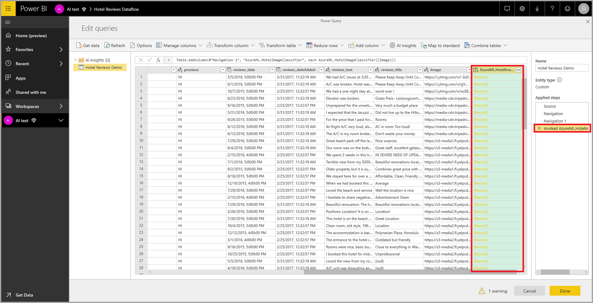

# AI กับกระแสข้อมูล

ในบทความนี้ เราจะพูดถึงวิธีการที่คุณสามารถใช้ปัญญาประดิษฐ์ (AI) กับกระแสข้อมูล เนื้อหาที่อธิบายไว้ในบทความนี้มีดังต่อไปนี้:

* บริการด้านความรู้ความเข้าใจ
* การเรียนรู้ของเครื่องอัตโนมัติ
* การบูรณาการของ Azure Machine Learning

## Cognitive Services ใน Power BI

ด้วย Cognitive Services ใน Power BI คุณสามารถใช้อัลกอริทึมต่างๆ ได้จาก [Azure Cognitive Services](https://azure.microsoft.com/services/cognitive-services/) เพื่อเติมแต่งข้อมูลของคุณในการเตรียมข้อมูลด้วยตนเองสำหรับกระแสข้อมูล

บริการที่ได้รับการรองรับประจำวันนี้ ได้แก่ [การวิเคราะห์ความคิดเห็น](/azure/cognitive-services/text-analytics/how-tos/text-analytics-how-to-sentiment-analysis)[การแยกวลีหลัก](/azure/cognitive-services/text-analytics/how-tos/text-analytics-how-to-keyword-extraction)[การตรวจหาภาษา](/azure/cognitive-services/text-analytics/how-tos/text-analytics-how-to-language-detection) และ [การแท็กรูปภาพ](/azure/cognitive-services/computer-vision/concept-tagging-images) การแปลงข้อมูลจะดำเนินการบนบริการของ Power BI และไม่จำเป็นต้องสมัครใช้งาน Azure Cognitive Services คุณลักษณะนี้ต้องใช้ Power BI Premium

### **เปิดการใช้งานคุณลักษณะ AI**

Cognitive Services ได้รับการรองรับโดยโหนดความจุพรีเมียม EM2, A2 หรือ P1 และสูงกว่านั้น โดยจะใช้ปริมาณงาน AI ที่แยกต่างหากบนความจุเพื่อเรียกใช้ Cognitive Services ในระหว่างการแสดงตัวอย่างสาธารณะ (ก่อนเดือนมิถุนายน 2019) ค่าเริ่มต้นได้ปิดการใช้งานปริมาณงาน ก่อนที่จะใช้ Cognitive Services ใน Power BI จำเป็นต้องเปิดการใช้งานปริมาณงาน AI ในการตั้งค่าความจุของพอร์ทัลผู้ดูแลระบบ คุณสามารถเปิดการใช้งานปริมาณงาน AI ในส่วนของปริมาณงาน และกำหนดจำนวนสูงสุดของหน่วยความจำที่คุณต้องการให้ปริมาณงานนี้ใช้ได้ ขีดจำกัดหน่วยความจำที่แนะนำคือ 20% หากเกินขีดจำกัดนี้จะทำให้คิวรีช้าลง

### **เริ่มต้นใช้งานด้วย Cognitive Services ใน Power BI**

การแปลงข้อมูล Cognitive Services เป็นส่วนหนึ่งของ [การเตรียมข้อมูลด้วยตนเองสำหรับกระแสข้อมูล](https://powerbi.microsoft.com/blog/introducing-power-bi-data-prep-wtih-dataflows/) เพื่อเติมแต่งข้อมูลของคุณด้วย Cognitive Services โปรดเริ่มต้น โดยแก้ไขกระแสข้อมูล

เลือกปุ่ม **ข้อมูลเชิงลึก AI** ใน Ribbon ด้านบนของตัวแก้ไข Power Query

ในหน้าต่างป็อปอัพ เลือกฟังก์ชันที่คุณต้องการใช้และข้อมูลที่ต้องการแปลง ในตัวอย่างนี้ ฉันกำลังให้คะแนนความคิดเห็นของคอลัมน์ที่มีข้อความรีวิว

**Cultureinfo** เป็นข้อมูลป้อนเข้าเพิ่มเติมเพื่อระบุภาษาของข้อความ เขตข้อมูลนี้คาดหวังรหัส ISO คุณสามารถใช้คอลัมน์เป็นข้อมูลป้อนเข้าสำหรับ Cultureinfo หรือเขตข้อมูลแบบคงที่ได้ ในตัวอย่างนี้ ภาษาที่ระบุสำหรับทั้งคอลัมน์คือภาษาอังกฤษ (en) หากคุณปล่อยให้เขตข้อมูลนี้ว่าง Power BI จะตรวจหาภาษาโดยอัตโนมัติก่อนที่จะใช้ฟังก์ชัน จากนั้นเลือก **การเรียก**

หลังจากการเรียกฟังก์ชัน ระบบจะเพิ่มผลลัพธ์เป็นคอลัมน์ใหม่ลงในตาราง และระบบจะเพิ่มการแปลงข้อมูลเป็นขั้นตอนที่นำไปใช้ในคิวรีด้วยเช่นกัน

หากฟังก์ชันส่งกลับเขตข้อมูลผลลัพธ์หลายรายการ การเรียกฟังก์ชันจะเพิ่มคอลัมน์ใหม่ที่ มีระเบียนของเขตข้อมูลผลลัพธ์หลายรายการ

ขยายคอลัมน์เพื่อใช้ตัวเลือกในการเพิ่มอย่างน้อยหนึ่งค่าเป็นคอลัมน์ในข้อมูลของคุณ

### **ฟังก์ชันที่พร้อมใช้งาน**

ส่วนนี้จะอธิบายฟังก์ชันที่พร้อมใช้งานใน Cognitive Services ใน Power BI

#### **ตรวจหาภาษา**

ฟังก์ชันตรวจหาภาษาจะประเมินข้อมูลป้อนเข้าที่เป็นข้อความ โดยแต่ละเขตข้อมูลจะส่งกลับชื่อภาษาและตัวระบุ ISO ฟังก์ชันนี้เป็นประโยชน์ต่อคอลัมน์ข้อมูลที่รวบรวมข้อความที่กำหนดเองซึ่งไม่ทราบภาษา ฟังก์ชันคาดหวังข้อมูลในรูปแบบข้อความเป็นข้อมูลป้อนเข้า

การวิเคราะห์ข้อความสามารถตรวจหาได้มากถึง 120 ภาษา โปรดดู [ภาษาที่รองรับ](/azure/cognitive-services/text-analytics/text-analytics-supported-languages) สำหรับข้อมูลเพิ่มเติม

#### **แยกวลีหลัก**

ฟังก์ชัน **การแยกวลีหลัก** จะประเมินข้อความที่ไม่มีโครงสร้าง โดยแต่ละเขตข้อมูลข้อความจะส่งกลับรายการของวลีหลัก ฟังก์ชันดังกล่าวจำเป็นต้องมีเขตข้อมูลข้อความเป็นข้อมูลป้อนเข้า และยังยอมรับข้อมูลป้อนเข้าเพิ่มเติมสำหรับ **Cultureinfo** ด้วยเช่นกัน (โปรดดูส่วน **เริ่มต้นใช้งาน** ก่อนหน้าในบทความนี้)

การแยกวลีหลักเหมาะสำหรับก้อนข้อความที่ใหญ่กว่า ซึ่งตรงข้ามกับการวิเคราะห์ความคิดเห็นที่เหมาะสำหรับก้อนข้อความที่เล็กกว่า โปรดพิจารณาการปรับโครงสร้างของข้อมูลป้อนเข้าให้สอดคล้องเพื่อให้ได้ผลลัพธ์ที่ดีที่สุดจากการดำเนินการทั้งสองรูปแบบ

#### **ให้คะแนนความคิดเห็น**

ฟังก์ชัน **ให้คะแนนความคิดเห็น** จะประเมินข้อมูลป้อนเข้าที่เป็นข้อความและส่งกลับคะแนนความคิดเห็นสำหรับแต่ละเอกสาร โดยคะแนนจะไล่เรียงจาก 0 (ลบ) ถึง 1 (บวก) ฟังก์ชันนี้เป็นประโยชน์สำหรับการตรวจจับความคิดเห็นที่เป็นบวก และลบในสื่อสังคม รีวิวจากลูกค้า และฟอรั่มการอภิปราย

การวิเคราะห์ข้อความจะใช้อัลกอริทึมการจัดประเภทการเรียนรู้เกี่ยวกับเครื่องเพื่อสร้างคะแนนความคิดเห็นระหว่าง 0 และ 1 คะแนนที่ใกล้กับ 1 แสดงถึงความคิดเห็นบวก ส่วนคะแนนที่ใกล้กับ 0 แสดงถึงความคิดเห็นลบ แบบจำลองจะได้รับการฝึกฝนด้วยเนื้อหาที่เกี่ยวข้องกับความคิดเห็นอย่างครอบคลุมไว้ล่วงหน้า ในปัจจุบัน ยังไม่สามารถให้ข้อมูลการฝึกของคุณเองได้ แบบจำลองจะใช้เทคนิคการผสมผสานระหว่างการวิเคราะห์ข้อความ รวมการประมวลผลข้อความ การวิเคราะห์ชนิดของคำ การวางตำแหน่งคำ และกลุ่มคำที่เกี่ยวข้องกัน โปรดดู [แนะนำการวิเคราะห์ข้อความ](/archive/blogs/machinelearning/machine-learning-and-text-analytics) สำหรับข้อมูลเพิ่มเติมเกี่ยวกับอัลกอริทึม

การวิเคราะห์ความคิดเห็นจะดำเนินการบนเขตข้อมูลที่ป้อนเข้าทั้งหมดซึ่งตรงข้ามกับการแยกความคิดเห็นสำหรับเอนทิตีเฉพาะในข้อความ ในทางปฏิบัติ จะมีแนวโน้มสำหรับการให้คะแนนความแม่นยำเพื่อปรับปรุงเมื่อเอกสารมีหนึ่งหรือสองประโยคมากกว่าเป็นก้อนข้อความขนาดใหญ่ ระหว่างขั้นตอนการประเมินปรวิสัย แบบจำลองจะตัดสินว่า เขตข้อมูลที่ป้อนเข้าโดยรวมเป็นข้อเท็จจริงหรือความคิดเห็น ระบบจะไม่นำเขตข้อมูลที่ป้อนเข้าที่โดยส่วนใหญ่เป็นข้อเท็จจริงไปดำเนินการต่อในขั้นตอนการตรวจหาความคิดเห็น ดังนั้นระบบจะแสดงผลคะแนน .50 โดยไม่มีการประมวลผลต่อ ส่วนเขตข้อมูลที่ป้อนเข้าที่ดำเนินการต่อในไปป์ไลน์ ขั้นตอนถัดไปจะสร้างคะแนนที่สูงหรือต่ำกว่า .50 โดยขึ้นอยู่กับระดับระดับความคิดเห็นที่ตรวจพบในเขตข้อมูลที่ป้อนเข้า

ในปัจจุบัน การวิเคราะห์ความคิดเห็นรองรับภาษาอังกฤษ ภาษาเยอรมัน ภาษาสเปน และภาษาฝรั่งเศส ส่วนภาษาอื่นๆ ยังอยู่ในช่วงตัวอย่าง โปรดดู [ภาษาที่รองรับ](/azure/cognitive-services/text-analytics/text-analytics-supported-languages) สำหรับข้อมูลเพิ่มเติม

#### **แท็กรูปภาพ**

ฟังก์ชัน **แท็กรูปภาพ** จะส่งกลับแท็กโดยยึดตามวัตถุ สิ่งมีชีวิต ทิวทัศน์ และการเคลื่อนไหวที่รู้จักมากกว่า 2,000 รายการ เมื่อแท็กไม่ชัดเจนหรือไม่ใช่ความรู้ทั่วไป ผลลัพธ์จะให้ 'ข้อมูล' เพื่ออธิบายความหมายของแท็กในบริบทของการตั้งค่าที่รู้จัก แท็กจะไม่ถูกจัดระเบียบเป็นการจัดหมวดหมู่ และจะไม่มีลำดับชั้นการสืบทอด คอลเลกชันของเนื้อหาแท็กจะสร้างพื้นฐานสำหรับ 'คำอธิบาย' รูปภาพที่แสดงเป็นภาษาที่อ่านได้ของมนุษย์ซึ่งมีรูปแบบเป็นประโยคสมบูรณ์

หลังจากอัปโหลดรูปภาพหรือระบุ URL รูปภาพแล้ว ผลลัพธ์อัลกอริทึมคอมพิวเตอร์วิทัศน์จะแท็กโดยยึดตามวัตถุ สิ่งมีชีวิต และการเคลื่อนไหวที่ระบุในรูปภาพ แท็กไม่จำกัดเฉพาะเรื่องหลักๆ เช่น บุคคลในพื้นหน้า เท่านั้นแต่ยังรวมถึง ฉาก (ในร่มหรือกลางแจ้ง) เครื่องเรือน เครื่องมือ พืช สัตว์ เครื่องประดับ เครื่องมือเบ็ดเตล็ด และอื่นๆ

ฟังก์ชันนี้ต้องเป็น URL รูปภาพหรือเขตข้อมูล abase-64 ที่เป็นข้อมูลป้อนเข้า ในขณะนี้ การแท็กรูปภาพรองรับภาษาอังกฤษ ภาษาสเปน ภาษาญี่ปุ่น ภาษาโปรตุเกส และภาษาจีนแบบย่อ โปรดดู [ภาษาที่รองรับ](/rest/api/cognitiveservices/computervision/tagimage/tagimage#uri-parameters) สำหรับข้อมูลเพิ่มเติม

## การเรียนรู้ของเครื่องอัตโนมัติใน Power BI 

การเรียนของเครื่องอัตโนมัติ (AutoML) สำหรับกระแสข้อมูลช่วยนักวิเคราะห์ทางธุรกิจในการสอน ตรวจสอบ และเรียกใช้แบบจำลอง Machine Learning (ML) โดยตรงใน Power BI ซึ่งรวมถึงประสบการณ์ง่ายๆ ในการสร้างรูปแบบ ML ใหม่ซึ่งนักวิเคราะห์สามารถใช้กระแสข้อมูลของพวกเขาเพื่อระบุข้อมูลป้อนเข้าสำหรับการฝึกแบบจำลอง บริการจะแยกคุณลักษณะที่เกี่ยวข้องมากที่สุดโดยอัตโนมัติ เลือกอัลกอริทึมและเพลงที่เหมาะสม รวมถึงตรวจสอบแบบจำลอง ML หลังจากที่แบบจำลองได้รับการสอนแล้ว Power BI จะสร้างรายงานประสิทธิภาพที่มีผลลัพธ์ของการตรวจสอบความถูกต้อง จากนั้นแบบจำลองจะถูกเรียกใช้ในข้อมูลใหม่หรืออัปเดตข้อมูลภายใน กระแสข้อมูล

การเรียนรู้เครื่องอัตโนมัติพร้อมใช้งานสำหรับกระแสข้อมูลที่โฮสต์บน Power BI Premium และความจุแบบฝังตัวเท่านั้น

### การทำงานกับ AutoML

กระแสข้อมูลนำเสนอการเตรียมข้อมูลด้วยตนเองสำหรับข้อมูลขนาดใหญ่ AutoML จะถูกรวมเข้ากับกระแสข้อมูลและช่วยให้คุณสามารถใช้ประโยชน์จากความพยายามในการเตรียมข้อมูลสำหรับการสร้างแบบจำลองการเรียนรู้ของเครื่องได้โดยตรงภายใน Power BI

AutoML ใน Power BI ช่วยนักวิเคราะห์ข้อมูลเพื่อใช้กระแสข้อมูลในการสร้างโมเดลการเรียนรู้ของเครื่องด้วยประสบการณ์การใช้งานแบบง่ายด้วยทักษะ Power BI เท่านั้น วิทยาศาสตร์ข้อมูลส่วนใหญ่ที่อยู่เบื้องหลังการสร้างแบบจำลอง ML นั้นเป็นไปโดยอัตโนมัติจาก Power BI มีตัวป้องกันเพื่อให้แน่ใจว่าแบบจำลองที่สร้างขึ้นนั้นมีคุณภาพดี และสามารถมองเห็นกระบวนการที่ใช้ในการสร้างแบบจำลอง ML ได้

AutoML สนับสนุนการสร้างแบบจำลอง **การทำนายแบบไบนารี** **การจำแนกประเภท** และ **การถดถอย** สำหรับกระแสข้อมูล แบบจำลองเหล่านี้เป็นประเภทของเทคนิคการเรียนรู้ของเครื่องแบบมีผู้สอน ซึ่งหมายความว่าแบบจำลองได้เรียนรู้จากผลลัพธ์ที่ทราบในการสังเกตการณ์ที่ผ่านมาเพื่อทำนายผลลัพธ์ของการสังเกตการณ์อื่นๆ ชุดข้อมูลป้อนเข้าสำหรับการฝึกแบบจำลอง AutoML คือชุดของระเบียนที่มี **ป้ายชื่อ** ที่มีผลลัพธ์ที่ทราบ

AutoML ใน Power BI รวม [ML อัตโนมัติ](/azure/machine-learning/service/concept-automated-ml)จาก[Azure Machine Learning service](/azure/machine-learning/service/overview-what-is-azure-ml)เพื่อสร้างรูปแบบ ML ของคุณ อย่างไรก็ตามคุณไม่จำเป็นต้องมีการสมัครใช้งาน Azure เพื่อให้ AutoML ใน Power BI กระบวนการของการฝึกและโฮสต์รูปแบบ ML ได้รับการจัดการทั้งหมดโดยบริการของ Power BI

หลังจากแบบจำลอง ML ได้รับการฝึก AutoML ให้สร้างรายงาน Power BI โดยอัตโนมัติที่อธิบายประสิทธิภาพการทำงานของรูปแบบ ML ของคุณ AutoML ให้ความสำคัญกับความสามารถในการอธิบายโดยการเน้นที่ปัจจัยหลักที่มีอิทธิพลในอินพุทของคุณที่มีผลต่อการทำนายที่ส่งคืนจากแบบจำลองของคุณ รายงานยังรวมถึงเมตริกหลักสำหรับแบบจำลองด้วย

หน้าอื่นๆ ของรายงานที่สร้างขึ้นแสดงสรุปทางสถิติของแบบจำลองและรายละเอียดการฝึกอบรม ผลสรุปทางสถิติคือความสนใจของผู้ใช้ที่ต้องการดูหน่วยวัดประสิทธิภาพของแบบจำลองตามมาตรฐานวิทยาศาสตร์ข้อมูล รายละเอียดการฝึกสรุปการเกิดซ้ำทั้งหมดที่มีการเรียกใช้เพื่อสร้างแบบจำลองของคุณด้วยพารามิเตอร์การสร้างโมเดลที่เกี่ยวข้อง นอกจากนี้ยังอธิบายวิธีการป้อนข้อมูลแต่ละครั้งที่ใช้ในการสร้างแบบจำลอง ML

จากนั้นคุณสามารถนำรูปแบบ ML ของคุณไปใช้กับข้อมูลของคุณสำหรับการให้คะแนนได้ เมื่อมีการรีเฟรชกระแสข้อมูล ข้อมูลของคุณจะได้รับการอัปเดตด้วยการทำนายจากแบบจำลอง ML Power BI ยังรวมถึงคำอธิบายเฉพาะสำหรับการทำนายแต่ละรายการที่แบบจำลอง ML สร้างขึ้น

### การสร้างแบบจำลองการเรียนรู้ของเครื่อง

ในส่วนนี้จะอธิบายวิธีการสร้างแบบจำลอง AutoML

#### การเตรียมข้อมูลสำหรับการสร้างรูปแบบ ML

เมื่อต้องการสร้างแบบจำลองการเรียนรู้ของเครื่องใน Power BI คุณต้องสร้างกระแสข้อมูลสำหรับข้อมูลที่ประกอบด้วยข้อมูลผลลัพธ์ในอดีต ซึ่งนำมาใช้สำหรับการสอนแบบจำลอง ML นอกจากนี้คุณควรเพิ่มคอลัมน์จากการคำนวณสำหรับเมตริกธุรกิจใดๆ ที่อาจมีทำนายที่แข็งแกร่งสำหรับผลลัพธ์ที่คุณกำลังพยายามคาดการณ์ สำหรับรายละเอียดเกี่ยวกับการกำหนดค่ากระแสข้อมูลของคุณ โปรดดูที่ [ กำหนดค่าและใช้กระแสข้อมูล](dataflows-configure-consume.md)

AutoML มีข้อกำหนดข้อมูลเฉพาะสำหรับการฝึกแบบจำลองการเรียนรู้ของเครื่อง ข้อกำหนดเหล่านี้จะอธิบายไว้ในส่วนด้านล่างตามชนิดแบบจำลองที่เกี่ยวข้อง

#### การกำหนดค่าอินพุทแบบจำลอง ML

เมื่อต้องการสร้างแบบจำลอง AutoML ให้เลือกไอคอน ML ในคอลัมน์ **การดำเนินการ** ของเอนทิตีกระแสข้อมูล และเลือก **เพิ่มแบบจำลองการเรียนรู้ของเครื่อง**

มีการเปิดใช้งานประสบการณ์ที่ง่ายดายซึ่งประกอบด้วยตัวช่วยสร้างที่แนะนำคุณในกระบวนการสร้างรูปแบบ ML ตัวช่วยสร้างมีขั้นตอนง่ายๆดังต่อไปนี้

**1. เลือกเอนทิตีที่มีข้อมูลในอดีตและเขตข้อมูลผลลัพธ์ที่คุณต้องการการทำนาย** 

เขตข้อมูลผลลัพธ์จะระบุแอตทริบิวต์ป้ายชื่อสำหรับการสอนแบบจำลอง ML ดังที่แสดงในรูปต่อไปนี้

**2. เลือกประเภทแบบจำลอง**

เมื่อคุณระบุเขตข้อมูลผลลัพธ์ AutoML จะวิเคราะห์ข้อมูลป้ายชื่อเพื่อแนะนำประเภทแบบจำลอง ML ที่มีความเป็นไปได้มากที่สุดที่สามารถสอนได้ คุณสามารถเลือกประเภทแบบจำลองที่แตกต่างกันดังที่แสดงด้านล่างโดยการคลิกที่ "เลือกแบบจำลองที่แตกต่างกัน"

> [!NOTE]
> แบบจำลองบางชนิดอาจไม่ได้รับการสนับสนุนสำหรับข้อมูลที่คุณเลือก และจะถูกปิดใช้งาน ในตัวอย่างข้างต้น แบบจำลองการถดถอยถูกปิดใช้งานเนื่องจากมีการเลือกคอลัมน์ข้อความเป็นเขตข้อมูลผลลัพธ์

**3. เลือกอินพุทที่คุณต้องการให้แบบจำลองใช้เป็นสัญญาณที่คาดเดาได้**

AutoML วิเคราะห์ตัวอย่างของเอนทิตีที่เลือกเพื่อแนะนำอินพุทที่สามารถนำมาใช้สำหรับการสอนแบบจำลอง ML ได้ คำอธิบายจะอยู่ถัดจากเขตข้อมูลที่ไม่ได้เลือก ถ้าเขตข้อมูลเฉพาะมีค่าที่แตกต่างกันมากเกินไป หรือมีเพียงหนึ่งค่าเท่านั้น หรือมีความสัมพันธ์ต่ำหรือสูงกับเขตข้อมูลผลลัพธ์ เราไม่ขอแนะนำเขตข้อมูลนี้

อินพุทใดก็ตามที่ขึ้นอยู่กับเขตข้อมูลผลลัพธ์ (หรือเขตข้อมูลป้ายชื่อ) ไม่ควรใช้สำหรับการสอนแบบจำลอง ML เนื่องจากจะส่งผลกระทบต่อประสิทธิภาพของแบบจำลอง เขตข้อมูลดังกล่าวจะถูกตั้งค่าสถานะว่ามี "ความสัมพันธ์สูงอย่างน่าสงสัยกับเขตข้อมูลผลลัพธ์" การใช้เขตข้อมูลเหล่านี้เป็นข้อมูลการสอนจะทำให้เกิดปัญหาการรั่วไหลของป้ายชื่อ ซึ่งแบบจำลองจะทำงานได้ดีกับการตรวจสอบความถูกต้องหรือการทดสอบข้อมูล แต่ไม่มีประสิทธิภาพเมื่อใช้ในการให้คะแนน การรั่วไหลของป้ายชื่ออาจเป็นปัญหาที่เกิดขึ้นได้กับแบบจำลอง AutoML เมื่อประสิทธิภาพของแบบจำลองการสอนดีเกินกว่าความเป็นจริง

คำแนะนำเกี่ยวกับคุณลักษณะนี้จะขึ้นอยู่กับตัวอย่างของข้อมูล ดังนั้นคุณควรตรวจสอบอินพุทที่ใช้ คุณมีตัวเลือกในการเปลี่ยนแปลงการเลือกเพื่อรวมเฉพาะเขตข้อมูลที่คุณต้องการให้แบบจำลองศึกษา นอกจากนี้ คุณยังสามารถเลือกเขตข้อมูลทั้งหมดได้โดยเลือกช่องทำเครื่องหมายถัดจากชื่อเอนทิตี

**4. ตั้งชื่อแบบจำลองและบันทึกการกำหนดค่าของคุณ**

ในขั้นตอนสุดท้าย คุณสามารถตั้งชื่อแบบจำลองและเลือกบันทึก และสอนที่เริ่มต้นการสอนแบบจำลอง ML คุณสามารถเลือกที่จะลดเวลาการสอนเพื่อดูผลลัพธ์อย่างรวดเร็ว หรือเพิ่มระยะเวลาที่ใช้ในการสอนเพื่อให้ได้แบบจำลองที่ดีที่สุด

#### การฝึกแบบจำลอง ML

การฝึกแบบจำลอง AutoML เป็นส่วนหนึ่งของรีเฟรชกระแสข้อมูล ก่อนอื่น AutoML เตรียมข้อมูลของคุณสำหรับการฝึก
AutoML จะแยกข้อมูลในอดีต ซึ่งคุณระบุไว้ในชุดข้อมูลการสอนและการทดสอบ ชุดข้อมูลทดสอบคือชุด holdout ที่ใช้สำหรับการตรวจสอบประสิทธิภาพของแบบจำลองหลังจากการฝึก สิ่งเหล่านี้จะถูกรับรู้ว่ามี **การฝึกและการทดสอบ** เอนทิตีในกระแสข้อมูล AutoML ใช้การตรวจสอบความถูกต้องข้ามสำหรับการตรวจสอบแบบจำลอง

ถัดไปแต่ละเขตข้อมูลป้อนเข้าจะได้รับการวิเคราะห์และใช้การใส่ค่า ซึ่งแทนที่ค่าที่ขาดหายไปด้วยค่าที่มีการแทนที่ มีการใช้กลยุทธ์การใส่ค่าที่แตกต่างกันสองตัวโดย AutoML สำหรับแอตทริบิวต์อินพุทที่ถือว่าเป็นคุณลักษณะตัวเลข ค่าเฉลี่ยของค่าคอลัมน์จะนำมาใช้สำหรับการแทนค่าข้อมูลที่สูญหาย สำหรับแอตทริบิวต์อินพุทที่ถือว่าเป็นคุณลักษณะจัดกลุ่ม AutoML จะใช้ฐานนิยมของค่าคอลัมน์สำหรับการแทนค่าข้อมูลที่สูญหาย ค่าเฉลี่ยและฐานนิยมของค่าที่ใช้สำหรับการแทนค่าข้อมูลที่สูญหายถูกคำนวณโดยเฟรมเวิร์ก AutoML บนชุดข้อมูลการสอนที่สุ่มย่อย

จากนั้น มีการใช้การสุ่มตัวอย่างและการปรับมาตรฐานกับข้อมูลของคุณตามที่ต้องการ สำหรับแบบจำลองการจำแนกประเภท AutoML จะเรียกใช้ข้อมูลอินพุทผ่านการสุ่มตัวอย่างแบบชั้นภูมิและทำให้คลาสสมดุลเพื่อให้แน่ใจว่าจำนวนแถวจะเท่ากันทั้งหมด

AutoML ใช้การแปลงหลายครั้งในแต่ละเขตข้อมูลอินพุทที่เลือกตามชนิดข้อมูลและคุณสมบัติทางสถิติ AutoML ใช้การแปลงข้อมูลเหล่านี้เพื่อแยกคุณลักษณะสำหรับใช้ในการฝึกแบบจำลอง ML ของคุณ

กระบวนการฝึกสำหรับแบบจำลอง AutoML ประกอบด้วยการทำซ้ำ 50 ครั้งที่มีการวนกลับกับอัลกอริทึมการสร้างโมเดลที่แตกต่างกันและการตั้งค่า hyperparameter เพื่อค้นหาแบบจำลองที่มีประสิทธิภาพที่ดีที่สุด การสอนอาจจบลงก่อนด้วยจำนวนการวนซ้ำที่น้อยลง หาก AutoML สังเกตว่าประสิทธิภาพไม่ได้ดีขึ้น ประสิทธิภาพของแต่ละโมเดลเหล่านี้จะถูกประเมินโดยการตรวจสอบความถูกต้องของชุดข้อมูลทดสอบ holdout ในระหว่างขั้นตอนการฝึกอบรมนี้ AutoML สร้างไปป์ไลน์หลายตัวสำหรับการฝึกอบรมและการตรวจสอบการเกิดซ้ำเหล่านี้ กระบวนการประเมินประสิทธิภาพของแบบจำลองอาจใช้เวลาไม่กี่นาทีไปจนถึงสองสามชั่วโมง หรือจนถึงเวลาการสอนที่กำหนดค่าในตัวช่วยสร้าง ทั้งนี้ขึ้นอยู่กับขนาดของชุดข้อมูลของคุณและทรัพยากรความจุที่พร้อมใช้งาน

ในบางกรณีแบบจำลองขั้นสุดท้ายที่สร้างขึ้นอาจใช้การเรียนรู้ในวงการที่มีการใช้หลายแบบเพื่อให้ประสิทธิภาพการทำงานที่ดีขึ้น

#### ความสามารถในการอธิบายแบบจำลอง AutoML

หลังจากที่ได้รับการฝึกแบบจำลอง AutoML วิเคราะห์ความสัมพันธ์ระหว่างคุณลักษณะการป้อนข้อมูลและการแสดงผลแบบจำลอง AutoML จะประเมินขนาดของการเปลี่ยนแปลงไปยังการแสดงผลแบบจำลองสำหรับชุดข้อมูลทดสอบ holdout สำหรับคุณลักษณะอินพุทแต่ละตัว ซึ่งเรียกว่า _ความสำคัญของคุณลักษณะ_ สิ่งนี้เกิดขึ้นเนื่องจากเป็นส่วนหนึ่งของการรีเฟรชเมื่อการสอนเสร็จสมบูรณ์ ดังนั้นการรีเฟรชของคุณอาจใช้เวลานานกว่าเวลาการสอนที่กำหนดไว้ในตัวช่วยสร้าง

#### รายงานแบบจำลอง AutoML

AutoML สร้างรายงาน Power BI ที่สรุปประสิทธิภาพการทำงานของแบบจำลองระหว่างการตรวจสอบความถูกต้องพร้อมกับความสำคัญของคุณลักษณะทั่วโลก รายงานนี้สามารถเข้าถึงได้จากแท็บแบบจำลองการเรียนรู้ของเครื่องเมื่อการรีเฟรชกระแสข้อมูลเสร็จสิ้น รายงานสรุปผลลัพธ์จากการใช้แบบจำลอง ML ไปยังข้อมูลทดสอบ holdout และเปรียบเทียบการคาดการณ์ด้วยค่าผลลัพธ์

คุณสามารถตรวจสอบรายงานแบบจำลองเพื่อทำความเข้าใจประสิทธิภาพ นอกจากนี้คุณยังสามารถตรวจสอบว่าปัจจัยหลักที่มีอิทธิพลของแบบจำลองอยู่ใกล้กับกับข้อมูลเชิงลึกทางธุรกิจเกี่ยวกับผลลัพธ์ที่รู้ผลอยู่แล้ว

แผนภูมิและหน่วยวัดที่ใช้เพื่ออธิบายประสิทธิภาพของแบบจำลองในรายงานจะขึ้นอยู่กับชนิดแบบจำลอง แผนภูมิประสิทธิภาพและหน่วยวัดเหล่านี้จะอธิบายไว้ในส่วนต่อไปนี้

หน้าเพิ่มเติมในรายงานอาจอธิบายหน่วยวัดทางสถิติเกี่ยวกับแบบจำลองจากมุมมองวิทยาศาสตร์ข้อมูล ตัวอย่างเช่นรายงาน **การคาดการณ์ไบนารี** จะมีแผนภูมิกำไรและเส้นโค้ง ROC สำหรับแบบจำลอง

รายงานยังรวมถึงหน้า **รายละเอียดการสอน** ที่มีคำอธิบายวิธีการการสอนแบบจำลอง และแผนภูมิที่อธิบายประสิทธิภาพของแบบจำลองในการวนซ้ำแต่ละครั้ง

ส่วนอื่นในหน้านี้จะอธิบายชนิดของเขตข้อมูลอินพุทที่ตรวจพบ และวิธีการแทนค่าข้อมูลที่สูญหายที่ใช้สำหรับการเติมค่าที่หายไป นอกจากนี้ยังมีพารามิเตอร์ที่ใช้โดยแบบจำลองขั้นสุดท้าย

ถ้าแบบจำลองที่สร้างขึ้นใช้การเรียนรู้แบบ Ensemble หน้า **รายละเอียดการสอน** ยังประกอบด้วยแผนภูมิที่แสดงน้ำหนักของแบบจำลองหน่วยประกอบแต่ละชุดใน Ensemble ซึ่งรวมถึงพารามิเตอร์ด้วย

### การใช้แบบจำลอง AutoML

ถ้าคุณพอใจกับประสิทธิภาพการทำงานของรูปแบบ ML ที่สร้างขึ้นคุณสามารถนำไปใช้กับข้อมูลใหม่หรืออัปเดตเมื่อมีการรีเฟรช กระแสข้อมูลของคุณ คุณสามารถดำเนินการได้จากรายงานแบบจำลองโดยการเลือกปุ่ม **นำไปใช้** ที่มุมขวาบนหรือปุ่ม ใช้แบบจำลอง ML ใต้การดำเนินการในแท็บแบบจำลองการเรียนรู้ของเครื่อง

เมื่อต้องการใช้รูปแบบจำลอง ML คุณต้องระบุชื่อของเอนทิตีที่จะต้องใช้และคำนำหน้าสำหรับคอลัมน์ที่จะถูกเพิ่มไปยังเอนทิตีนี้สำหรับการแสดงผลแบบจำลอง คำนำหน้าเริ่มต้นสำหรับชื่อคอลัมน์คือชื่อแบบจำลอง ฟังก์ชันการ _นำไปใช้_ อาจรวมพารามิเตอร์เพิ่มเติมเฉพาะสำหรับชนิดแบบจำลอง

การใช้แบบจำลอง ML จะสร้างเอนทิตีกระแสข้อมูลสองใหม่รายการ ซึ่งมีการทำนายและคำอธิบายเฉพาะสำหรับแต่ละแถวที่ให้คะแนนในเอนทิตีผลลัพธ์ ตัวอย่างเช่น ถ้าคุณนำแบบจำลอง _PurchaseIntent_  ไปใช้กับเอนทิตี _OnlineShoppers_ ผลลัพธ์จะสร้างเอนทิตี **PurchaseIntent ที่สมบูรณ์ของ OnlineShoppers** และ **คำอธิบาย PurchaseIntent ที่สมบูรณ์ของ OnlineShoppers** สำหรับแต่ละแถวในเอนทิตีที่สมบูรณ์ **คำอธิบาย** จะแบ่งย่อยเป็นหลายแถวในเอนทิตีคำอธิบายที่สมบูรณ์ตามคุณลักษณะอินพุท **ExplanationIndex** ช่วยแมปแถวจากเอนทิตีคำอธิบายที่สมบูรณ์ไปยังแถวในเอนทิตีที่สมบูรณ์

คุณยังสามารถนำแบบจำลอง Power BI AutoML ต่าง ๆ ไปใช้กับเอนทิตีในกระแสข้อมูลใด ๆ ก็ได้ในพื้นที่ทำงานเดียวกันโดยใช้ข้อมูลเชิงลึกของ AI ในเบราว์เซอร์ฟังก์ชัน PQO ด้วยวิธีนี้คุณสามารถใช้แบบจำลองที่สร้างโดยผู้อื่นในพื้นที่ทำงานเดียวกันโดยไม่จำเป็นต้องเป็นเจ้าของของกระแสข้อมูลที่มีแบบจำลองด้วย Power Query ค้นพบโมเดล Power BI ML ทั้งหมดในพื้นที่ทำงานและแสดงเป็นฟังก์ชัน Power Query แบบไดนามิก  คุณจะสามารถเรียกใช้ฟังก์ชันเหล่านั้นโดยการเข้าถึงจาก Ribbon ในตัวแก้ไข Power Query หรือโดยการเรียกฟังก์ชัน M โดยตรง ฟังก์ชันนี้จะได้รับการรองรับเฉพาะกระแสข้อมูล Power BI และ Power Query แบบออนไลน์ในบริการของ Power BI โปรดทราบว่านี่เป็นวิธีที่แตกต่างจากการใช้แบบจำลอง ML ภายในกระแสข้อมูลด้วยตัวช่วยสร้าง AutoML ไม่มีเอนทิตีคำอธิบายที่สร้างขึ้นโดยใช้วิธีนี้โดยเว้นแต่ว่าคุณเป็นเจ้าของกระแสข้อมูล คุณจะไม่สามารถเข้าถึงรายงานการฝึกอบรมของแบบจำลองหรือฝึกอบรมแบบจำลองใหม่ ถ้าแบบจำลองแหล่งข้อมูลถูกแก้ไข (เพิ่มหรือลบเขตข้อมูลที่ป้อนเข้า) แบบจำลองหรือกระแสข้อมูลแหล่งที่มาจะถูกลบออก แล้วกระแสข้อมูลที่ขึ้นอยู่กับนี้จะหยุดทำงาน

หลังจากคุณใช้แบบจำลองแล้ว AutoML จะทำให้การทำนายของคุณเป็นปัจจุบันเสมอเมื่อใดก็ตามที่มีการรีเฟรชกระแสข้อมูล

หากต้องการใช้ข้อมูลเชิงลึกและการคาดการณ์จากรูปแบบ ML ในรายงาน Power BI คุณสามารถเชื่อมต่อไปยังเอนทิตีเอาต์พุตจาก Power BI Desktop โดยใช้ตัวเชื่อมต่อ **กระแสข้อมูล**

### แบบจำลองการทำนายแบบไบนารี

แบบจำลองการคาดการณ์ไบนารีที่รู้จักกันอย่างเป็นทางการเป็น **แบบจำลองการจัดประเภทไบนารี** จะใช้เพื่อจัดประเภทชุดข้อมูลลงในสองกลุ่ม ซึ่งใช้ในการทำนายเหตุการณ์ที่อาจมีผลลัพธ์แบบไบนารีได้ ตัวอย่างเช่น โอกาสทางการขายเปลี่ยนไปเป็นการขายจริงหรือไม่ บัญชีผู้ใช้นี้จะออกไปจากระบบหรือไม่ มีการชำระเงินตามใบแจ้งนี้ตรงเวลาหรือไม่ ธุรกรรมนี้เป็นการฉ้อโกงหรือไม่ และอื่น ๆ

ผลลัพธ์ของแบบจำลองการทำนายแบบไบนารีคือคะแนนความน่าจะเป็น ซึ่งระบุความเป็นไปได้ที่จะบรรลุผลลัพธ์เป้าหมาย

#### แบบจำลองการทำนายแบบไบนารี

การเตรียมปัจจัยที่จำเป็น:

- ต้องมีข้อมูลในอดีตย่างน้อย 20 แถวสำหรับแต่ละคลาสของผลลัพธ์

กระบวนการสร้างสำหรับแบบจำลองการคาดการณ์ไบนารีจะเป็นไปตามขั้นตอนเดียวกันกับแบบจำลองAutoML อื่นๆที่อธิบายไว้ในส่วนที่ **กำหนดค่าอินพุทแบบจำลอง ML** ด้านบน ข้อแตกต่างเพียงอย่างเดียวคือในขั้นตอน “เลือกแบบจำลอง” ซึ่งคุณสามารถเลือกค่าผลลัพธ์เป้าหมายที่คุณสนใจมากที่สุดได้ คุณยังสามารถกำหนดป้ายชื่อที่เรียกง่ายสำหรับผลลัพธ์ที่จะใช้ในรายงานที่สร้างขึ้นโดยอัตโนมัติ ซึ่งจะสรุปผลลัพธ์ของการตรวจสอบแบบจำลอง

#### รายงานแบบจำลองการทำนายแบบไบนารี

แบบจำลองการทำนายแบบไบนารีจะสร้างเป็นผลลัพธ์ที่เป็นไปได้ว่าเรกคอร์ดจะบรรลุผลลัพธ์เป้าหมาย รายงานมีตัวแบ่งส่วนข้อมูลสำหรับขีดจำกัดความน่าจะเป็นซึ่งมีผลต่อวิธีการที่คะแนนด้านบนและด้านล่างของขีดจำกัดความน่าจะเป็น

รายงานอธิบายประสิทธิภาพการทำงานของแบบจำลองในแง่ของ _True Positives, False Positives, True Negatives และ False Negatives_ True Positive และ True Negative ได้รับการคาดการณ์ผลอย่างถูกต้องสำหรับสองชั้นในข้อมูลผลลัพธ์ False Positives คือเรกคอร์ดที่ทำนายว่าจะมีผลลัพธ์เป้าหมาย แต่ในความเป็นจริงไม่ใช่ ในทางกลับกัน False Negatives คือเรกคอร์ดที่มีผลลัพธ์เป้าหมาย แต่ถูกทำนายว่าไม่มี

หน่วยวัดเช่นความแม่นยำและการเรียกใช้ให้อธิบายผลกระทบของขีดจำกัดน่าจะเป็นที่มาของผลลัพธ์ที่คาดการณ์ไว้ คุณสามารถใช้ตัวแบ่งส่วนข้อมูลของขีดจำกัดความน่าจะเป็นเพื่อเลือกขีดจำกัดที่ทำให้มีความสมดุลระหว่างความแม่นยำและการเรียกคืนได้

รายงานยังมีเครื่องมือการวิเคราะห์ต้นทุนและผลประโยชน์เพื่อช่วยในการระบุส่วนย่อยของประชากรที่ควรจะเป็นเป้าหมายเพื่อให้ได้กำไรสูงสุด ด้วยต้นทุนต่อหน่วยที่กำหนดไว้โดยประมาณจากการกำหนดเป้าหมายและประโยชน์ต่อหน่วยจากการบรรลุผลลัพธ์เป้าหมาย การวิเคราะห์ต้นทุนและผลกำไรจะพยายามเพิ่มผลกำไรสูงสุด คุณสามารถใช้เครื่องมือนี้เพื่อเลือกค่าขีดจำกัดความน่าจะเป็นโดยยึดตามจุดสูงสุดในกราฟเพื่อเพิ่มผลกำไรสูงสุด นอกจากนี้ คุณยังสามารถใช้กราฟเพื่อคำนวณกำไรหรือต้นทุนสำหรับการเลือกค่าขีดจำกัดความน่าจะเป็นของคุณได้อีกด้วย

หน้า **รายงานที่แม่นยำ** ของรายงานแบบจำลองมีแผนภูมิ _กำไรสะสม_ และเส้นโค้ง ROC สำหรับแบบจำลอง รายงานเหล่านี้คือหน่วยวัดทางสถิติของประสิทธิภาพแบบจำลอง รายงานประกอบด้วยคำอธิบายของแผนภูมิที่แสดง

#### การนำแบบจำลองการทำนายแบบไบนารีไปใช้

เมื่อต้องการใช้แบบจำลองการคาดการณ์ไบนารีคุณต้องระบุเอนทิตีที่มีข้อมูลที่คุณต้องการใช้การคาดการณ์จากรูปแบบ ML พารามิเตอร์อื่นๆรวมถึงคำนำหน้าชื่อคอลัมน์ผลลัพธ์และขีดจำกัดความน่าจะเป็นสำหรับการจัดประเภทผลลัพธ์ที่คาดการณ์ไว้

เมื่อมีการใช้แบบจำลองการทำนายแบบไบนารี การดำเนินการนี้จะเพิ่มคอลัมน์ผลลัพธ์สี่คอลัมน์ไปยังเอนทิตีผลลัพธ์ที่สมบูรณ์ได้แก่ **Outcome**, **PredictionScore**, **PredictionExplanation** และ **ExplanationIndex** ชื่อคอลัมน์ในเอนทิตีมีการระบุคำนำหน้าเมื่อใช้แบบจำลอง

**PredictionScore** คือเปอร์เซ็นต์ความน่าจะเป็น ซึ่งระบุความเป็นไปได้ที่จะบรรลุผลลัพธ์เป้าหมาย

คอลัมน์ **Outcome** ประกอบด้วยป้ายชื่อผลลัพธ์ที่ทำนายไว้ เรกคอร์ดที่มีความน่าจะเป็นเกินค่าขีดจำกัดจะได้รับการทำนายว่ามีแนวโน้มที่จะทำให้เกิดผลลัพธ์เป้าหมาย และถูกติดป้ายชื่อว่าเป็นจริง เรกคอร์ดที่อยู่ต่ำกว่าค่าขีดจำกัดจะได้รับการทำนายว่าไม่น่าจะทำให้เกิดผลลัพธ์ และถูกติดป้ายชื่อว่าเป็นเท็จ

คอลัมน์ **PredictionExplanationประกอบ** ด้วยคำอธิบายที่มีผลกระทบเฉพาะที่คุณลักษณะป้อนเข้าที่มีใน **PredictionScore**

### แบบจำลองการจัดประเภท

แบบจำลองการจัดประเภทจะใช้ในการแยกประเภทชุดข้อมูลลงในกลุ่มหรือประเภทในหลายรายการ แบบจำลองนี้ใช้เพื่อทำนายเหตุการณ์ที่สามารถมีหนึ่งในผลลัพธ์ที่เป็นไปได้หลายอย่าง ตัวอย่างเช่น ลูกค้ามีแนวโน้มที่จะมีมูลค่าตลอดช่วงชีวิตสูงมาก สูง ปานกลาง หรือต่ำ ความเสี่ยงในการผิดนัดชำระหนี้เป็นสูง ปานกลาง ต่ำ หรือต่ำมาก และอื่นๆ

ผลลัพธ์ของแบบจำลองการจัดประเภทคือคะแนนความน่าจะเป็นซึ่งระบุถึงความเป็นไปได้ว่าระเบียนจะบรรลุเกณฑ์สำหรับคลาสที่กำหนด

#### การฝึกแบบจำลองการจัดประเภท

เอนทิตีอินพุทที่ประกอบด้วยข้อมูลการสอนของคุณสำหรับแบบจำลองการจำแนกประเภทจะต้องมีเขตข้อมูลสตริงหรือจำนวนเต็มเป็นเขตข้อมูลผลลัพธ์ ซึ่งระบุผลลัพธ์ที่ทราบในอดีต

การเตรียมปัจจัยที่จำเป็น:

- ต้องมีข้อมูลในอดีตย่างน้อย 20 แถวสำหรับแต่ละคลาสของผลลัพธ์

กระบวนการสร้างสำหรับแบบจำลองการคาดการณ์จะเป็นไปตามขั้นตอนเดียวกันกับแบบจำลองAutoML อื่นๆที่อธิบายไว้ในส่วนที่ **กำหนดค่าอินพุทแบบจำลอง ML** ด้านบน

#### รายงานผลลัพธ์แบบจำลองการจัดประเภท

รายงานแบบจำลองการจัดประเภทได้รับการผลิตโดยใช้รูปแบบ ML เป็นข้อมูลทดสอบ holdout และเปรียบเทียบคลาสที่คาดการณ์สำหรับระเบียนที่มีคลาสที่รู้จักจริง

รายงานแบบจำลองมีแผนภูมิที่มีการแบ่งย่อยของระเบียนที่มีการจัดประเภทอย่างถูกต้องและไม่ถูกต้องสำหรับแต่ละคลาสที่รู้จัก

การเลื่อนเฉพาะระดับชั้นเพิ่มเติมจะช่วยให้การวิเคราะห์วิธีการกระจายการคาดการณ์สำหรับคลาสที่รู้จัก ซึ่งแสดงคลาสอื่นที่เรกคอร์ดของคลาสที่ทราบนั้นมีแนวโน้มว่าจะจัดผิดประเภท

คำอธิบายแบบจำลองในรายงานซึ่งรวมไปถึงการคาดการณ์ระดับสูงสำหรับแต่ละคลาส

รายงานแบบจำลองการจัดประเภทยังรวมถึงหน้ารายละเอียดการฝึกอบรมที่คล้ายกับหน้าสำหรับชนิดแบบจำลองอื่นๆตามที่อธิบายไว้ในส่วน **รายงานแบบจำลอง AutoML** ก่อนหน้าในบทความนี้

#### การนำแบบจำลองการจัดประเภทไปใช้

เมื่อต้องการใช้แบบจำลองการจัดประเภท ML คุณต้องระบุเอนทิตีที่มีข้อมูลป้อนเข้าและคำนำหน้าชื่อคอลัมน์ผลลัพธ์

เมื่อมีการใช้แบบจำลองการจัดประเภท การดำเนินการนี้จะเพิ่มคอลัมน์ผลลัพธ์ห้าคอลัมน์ไปยังเอนทิตีผลลัพธ์ที่สมบูรณ์ได้แก่ **ClassificationScore**, **ClassificationResult**, **ClassificationExplanation**, **ClassProbabilities** และ **ExplanationIndex** ชื่อคอลัมน์ในเอนทิตีมีการระบุคำนำหน้าเมื่อใช้แบบจำลอง

คอลัมน์ **ClassProbabilities** ประกอบด้วยรายการคะแนนความน่าจะเป็นสำหรับเรกคอร์ดในแต่ละคลาสที่เป็นไปได้

**ClassificationScore** คือเปอร์เซ็นต์ความน่าจะเป็น ซึ่งระบุความเป็นไปได้ที่เรกคอร์ดจะบรรลุเกณฑ์สำหรับคลาสที่กำหนด

คอลัมน์ **ClassificationResult** ประกอบด้วยคลาสที่คาดการณ์ความเป็นไปได้มากที่สุดสำหรับเรกคอร์ด

คอลัมน์ **ClassificationExplanation** ประกอบด้วยคำอธิบายที่มีผลกระทบเฉพาะที่คุณลักษณะอินพุทมีใน **ClassificationScore**

### แบบจำลองการถดถอย

แบบจำลองการถดถอยจะใช้ในการทำนายค่าตัวเลข ตัวอย่างเช่น รายได้มีแนวโน้มที่จะมาจากข้อตกลงการขาย มูลค่าตลอดอายุการใช้งานของบัญชี ยอดเงินของใบแจ้งหนี้ที่น่าจะได้รับชำระ วันที่ที่อาจมีการชำระใบแจ้งหนี้ และอื่นๆ

ผลลัพธ์ของแบบจำลองการถดถอยคือค่าที่คาดการณ์ไว้

#### การฝึกแบบจำลองการถดถอย

เอนทิตีอินพุทที่มีข้อมูลสอนสำหรับแบบจำลองการถดถอยต้องมีเขตข้อมูลตัวเลขเป็นเขตข้อมูลผลลัพธ์ ซึ่งระบุค่าผลลัพธ์ที่ทราบแล้ว

การเตรียมปัจจัยที่จำเป็น:

- ต้องมีอย่างน้อย100 แถวของข้อมูลในอดีตสำหรับแบบจำลองการถดถอย

กระบวนการสร้างสำหรับแบบจำลองการการถดถอยจะเป็นไปตามขั้นตอนเดียวกันกับแบบจำลองAutoML อื่นๆที่อธิบายไว้ในส่วนที่ **กำหนดค่าอินพุทแบบจำลอง ML** ด้านบน

#### รายงานแบบจำลองการถดถอย

เช่นเดียวกับรายงานแบบจำลอง AutoML อื่นๆรายงานการถดถอยจะขึ้นอยู่กับผลลัพธ์จากการนำแบบจำลองไปใช้กับข้อมูลทดสอบ holdout

รายงานแบบจำลองประกอบด้วยแผนภูมิที่เปรียบเทียบค่าที่ทำนายกับค่าจริง ในแผนภูมินี้ระยะห่างจากเส้นทแยงมุมแสดงข้อผิดพลาดในการคาดการณ์

แผนภูมิข้อผิดพลาดที่เหลือแสดงการกระจายของเปอร์เซ็นต์ของข้อผิดพลาดเฉลี่ยสำหรับค่าที่แตกต่างกันในชุดข้อมูลการทดสอบ holdout แกนแนวนอนแสดงถึงค่าที่แท้จริงของกลุ่มที่มีขนาดของฟองที่แสดงความถี่หรือจำนวนของค่าในช่วงนั้น แกนแนวตั้งคือข้อผิดพลาดที่เหลือโดยเฉลี่ย

รายงานแบบจำลองการถดถอยยังรวมถึงหน้ารายละเอียดการฝึกรายงานสำหรับชนิดแบบจำลองอื่นๆตามที่อธิบายไว้ในส่วน **รายงานแบบจำลอง AutoML** ด้านบน

#### การใช้แบบจำลองการถดถอย

เมื่อต้องการใช้แบบจำลองการถดถอย ML คุณต้องระบุเอนทิตีที่มีข้อมูลป้อนเข้าและคำนำหน้าชื่อคอลัมน์ผลลัพธ์

เมื่อมีการใช้แบบจำลองการถดถอย การดำเนินการนี้จะเพิ่มคอลัมน์ผลผลลัพธ์สามคอลัมน์ลงในเอนทิตีที่สมบูรณ์ได้แก่ **RegressionResult**, **RegressionExplanation** และ **ExplanationIndex** ชื่อคอลัมน์ในเอนทิตีมีการระบุคำนำหน้าเมื่อใช้แบบจำลอง

คอลัมน์ **RegressionResult** ประกอบด้วยค่าที่ทำนายสำหรับเรกคอร์ดที่ยึดตามเขตข้อมูลอินพุท คอลัมน์ **RegressionExplanation** ประกอบด้วยคำอธิบายที่มีผลกระทบเฉพาะที่คุณลักษณะอินพุทมีอยู่ใน **RegressionResult**

## การรวม Azure Machine Learning ใน Power BI

องค์กรมากมายใช้แบบจำลอง **Machine Learning** เพื่อข้อมูลเชิงลึกและการคาดการณ์เกี่ยวกับธุรกิจของตนเองที่ดีกว่า ความสามารถในการแสดงผลด้วยภาพจากแบบจำลองเหล่านี้ในรายงานและแดชบอร์ดรวมถึงการวิเคราะห์อื่นๆ ของคุณสามารถช่วยเผยแพร่ข้อมูลเชิงลึกเหล่านี้ให้แก่ผู้ใช้ทางธุรกิจที่ต้องการมากที่สุดได้  ขณะนี้ Power BI ช่วยให้การรวมข้อมูลเชิงลึกจากแบบจำลองที่โฮสต์บน Azure Machine Learning ได้อย่างง่ายดายโดยใช้ลักษณะการชี้และคลิกโดยตรง

หากต้องการใช้ความสามารถนี้ นักวิทยาศาสตร์ข้อมูลสามารถให้สิทธิ์เข้าถึงแบบจำลอง Azure ML ไปยังนักวิเคราะห์ BI โดยใช้พอร์ทัล Azure ได้อย่างง่ายดาย  จากนั้น ณ จุดเริ่มต้นของแต่ละเซสชัน Power Query จะค้นพบแบบจำลอง Azure MLทั้งหมดที่ผู้ใช้ได้เข้าถึง และแสดงเป็นฟังก์ชัน Power Query แบบไดนามิก  จากนั้นผู้ใช้จะสามารถเรียกใช้ฟังก์ชันเหล่านั้นโดยการเข้าถึงจาก Ribbon ในตัวแก้ไข Power Query หรือโดยการเรียกฟังก์ชัน M โดยตรง นอกจากนี้ Power BI ยังรวมคำขอการเข้าถึงโดยอัตโนมัติเมื่อเรียกแบบจำลอง Azure ML สำหรับชุดของแถวเพื่อบรรลุประสิทธิภาพการทำงานที่ดีกว่า

ฟังก์ชันนี้จะได้รับการรองรับเฉพาะกระแสข้อมูล Power BI และ Power Query แบบออนไลน์ในบริการของ Power BI

หากต้องการเรียนรู้เพิ่มเติมเกี่ยวกับกระแสข้อมูล โปรดดู [ข้อมูลเบื้องต้นเกี่ยวกับกระแสข้อมูลและการเตรียมข้อมูลด้วยตนเอง](dataflows-introduction-self-service.md)

หากต้องการเรียนรู้เพิ่มเติมเกี่ยวกับ Azure Machine Learning โปรดดู:

- ภาพรวม:  [Azure Machine Learning คืออะไร](/azure/machine-learning/service/overview-what-is-azure-ml)
- เริ่มต้นใช้งานด่วนและบทช่วยสอนสำหรับ Azure Machine Learning:  [เอกสารประกอบ Azure Machine Learning](/azure/machine-learning/)

> [!NOTE]
> จำเป็นต้องมีการสมัครใช้งาน Power BI Premium ในการใช้การรวม Azure Machine Learning

### การให้สิทธิ์เข้าถึงแบบจำลอง Azure ML แก่ผู้ใช้ Power BI

หากต้องการเข้าถึงแบบจำลอง Azure ML จาก Power BI ผู้ใช้จะต้องมีการสมัครใช้งาน Azure ที่มีการเข้าถึงแบบ **อ่าน**  นอกจากนี้:

- สำหรับแบบจำลอง Machine Learning Studio (คลาสสิก) ต้องใช้การเข้าถึงแบบ **อ่าน** สำหรับบริการบนเว็บ Machine Learning Studio (คลาสสิก)
- สำหรับแบบจำลอง Machine Learning ต้องใช้การเข้าถึงแบบ **อ่าน** สำหรับพื้นที่ทำงาน Machine Learning

ขั้นตอนในบทความนี้จะอธิบายวิธีให้สิทธิ์ใช้งานแก่ผู้ใช้ Power BI ในการเข้าถึงแบบจำลองที่โฮสต์บนบริการ Azure ML เพื่อให้ผู้ใช้สามารถเข้าถึงแบบจำลองนี้เป็นฟังก์ชัน Power Query  โปรดดู [จัดการการเข้าถึง RBAC และพอร์ทัล Azure](/azure/role-based-access-control/role-assignments-portal) สำหรับรายละเอียดอื่นๆ

1. ลงชื่อเข้าใช้ไปยัง [พอร์ทัล Azure](https://portal.azure.com)

2. ไปที่หน้า **การสมัครใช้งาน** คุณสามารถค้นหาหน้า **การสมัครใช้งาน** ผ่านรายการ **บริการทั้งหมด** ในเมนูบานหน้าต่างนำทางของพอร์ทัล Azure

    

3. เลือกการสมัครใช้งานของคุณ

    

4. เลือก **ควบคุมการเข้าถึง (IAM)** แล้วเลือกปุ่ม **เพิ่ม**

    

5. เลือกบทบาทเป็น **ผู้อ่าน** เลือกผู้ใช้ Power BI ที่คุณต้องการให้สิทธิ์เข้าถึงแบบจำลอง Azure ML

    

6. เลือก **บันทึก**

7. ทำซ้ำขั้นตอนที่สามถึงหกเพื่อให้สิทธิ์การเข้าถึงแบบ **ผู้อ่าน** แก่ผู้ใช้สำหรับบริการบนเว็บ Machine Learning Studio (คลาสสิก) ที่เจาะจง *หรือ* พื้นที่ทำงาน Machine Learning ที่โฮสต์แบบจำลอง

### การค้นพบ Schema สำหรับแบบจำลอง Machine Learning

นักวิทยาศาสตร์ข้อมูลใช้ Python เป็นหลักเพื่อพัฒนาหรือแม้กระทั่งปรับใช้ แบบจำลองการเรียนรู้ของเครื่องของพวกเขาสำหรับ Machine Learning  ซึ่งต่างจาก Machine Learning Studio (คลาสสิก) ซึ่งช่วยให้งานการสร้างไฟล์ Schema สำหรับแบบจำลองเป็นไปโดยอัตโนมัติ ในกรณีของ Machine Learning นักวิทยาศาสตร์ข้อมูลต้องสร้างไฟล์ Schema อย่างชัดเจนโดยใช้ Python

ไฟล์ Schema นี้ต้องอยู่ในบริการเว็บที่ปรับใช้สำหรับแบบจำลอง Machine Learning หากต้องการสร้าง Schema สำหรับบริการเว็บโดยอัตโนมัติ คุณต้องใส่ตัวอย่างของอินพุท/เอาท์พุทในสคริปต์รายการสำหรับแบบจำลองที่ปรับใช้ โปรดดูที่หัวข้อย่อยเกี่ยวกับการสร้าง Schema ของ Swagger แบบอัตโนมัติ [(ไม่บังคับ) ในแบบจำลองการปรับใช้ด้วยเอกสารบริการ Azure Machine Learning](/azure/machine-learning/how-to-deploy-and-where#optional-define-model-web-service-schema) ลิงก์มีสคริปต์รายการตัวอย่างด้วยคำสั่งสำหรับการสร้าง Schema 

โดยเฉพาะ ฟังก์ชัน *\@input_schema* และ *\@output_schema* ในสคริปต์รายการอ้างอิงค่ารูปแบบตัวอย่างอินพุทและเอาท์พุทในตัวแปร *input_sample* และ *output_sample* และใช้ตัวอย่างเหล่านี้เพื่อสร้างข้อกำหนด OpenAPI (Swagger) สำหรับบริการเว็บในระหว่างการปรับใช้งาน

คำแนะนำเหล่านี้สำหรับการสร้าง Schema โดยการอัปเดตสคริปต์รายการจะต้องนำไปใช้กับแบบจำลองที่สร้างขึ้นโดยใช้การทดสอบการเรียนรู้ของเครื่องอัตโนมัติโดยใช้ Azure Machine Learning SDK

> [!NOTE]
> แบบจำลองที่สร้างขึ้นโดยใช้อินเทอร์เฟสการแสดงผลด้วยภาพของ Azure Machine Learning ปัจจุบันไม่รองรับการสร้าง Schema แต่จะรองรับในรุ่นต่อ ๆ มา 

### การเรียกแบบจำลอง Azure ML ใน Power BI

คุณสามารถเรียกแบบจำลอง Azure ML ใดๆ ที่คุณได้รับสิทธิ์เข้าถึงได้ โดยตรงจากตัวแก้ไข Power Query ในกระแสข้อมูลของคุณ หากต้องการเข้าถึงแบบจำลอง Azure ML ให้เลือกปุ่ม **แก้ไข** สำหรับเอนทิตีที่คุณต้องการเติมแต่งด้วยข้อมูลเชิงลึกจากแบบจำลอง Azure ML ของคุณดังที่แสดงในรูปภาพต่อไปนี้

การเลือกปุ่ม **แก้ไข** เพื่อเปิดตัวแก้ไข Power Query สำหรับเอนทิตีในกระแสข้อมูลของคุณ

เลือกปุ่ม **ข้อมูลเชิงลึกของ AI** ในริบบอน จากนั้นเลือกโฟลเดอร์ _แบบจำลอง Azure Machine Learning_ จากเมนูบานหน้าต่างนำทาง แบบจำลอง Azure ML ทั้งหมดที่คุณสามารถเข้าถึงได้จะแสดงที่นี่เป็นฟังก์ชัน Power Query นอกจากนี้ พารามิเตอร์ที่ป้อนเข้าสำหรับแบบจำลอง Azure ML จะแมปเป็นพารามิเตอร์ของฟังก์ชัน Power Query ที่สอดคล้องกันโดยอัตโนมัติ

หากต้องการเรียกแบบจำลอง Azure ML คุณสามารถระบุคอลัมน์ของเอนทิตีที่เลือกใดๆ ก็ได้ เป็นข้อมูลป้อนเข้าจากดรอปดาวน์ นอกจากนี้คุณยังสามารถระบุค่าคงที่เพื่อใช้เป็นข้อมูลป้อนเข้าได้ โดยสลับไอคอนคอลัมน์ไปทางซ้ายของกล่องโต้ตอบที่ป้อนเข้า

เลือก **การเรียก** เพื่อดูตัวอย่างผลลัพธ์ของแบบจำลอง Azure ML เป็นคอลัมน์ใหม่ในตารางเอนทิตี นอกจากนี้คุณจะเห็นการเรียกแบบจำลองเป็นขั้นตอนที่นำไปใช้สำหรับคิวรี

หากแบบจำลองส่งกลับพารามิเตอร์ผลลัพธ์หลายรายการ พารามิเตอร์เหล่านั้นจะถูกจัดกลุ่มเข้าด้วยกันเป็นระเบียนในคอลัมน์ผลลัพธ์ คุณสามารถขยายคอลัมน์เพื่อสร้างแต่ละพารามิเตอร์ผลลัพธ์ในคอลัมน์แยกต่างหากได้

เมื่อบันทึกกระแสข้อมูลของคุณแล้ว ระบบจะเรียกแบบจำลองโดยอัตโนมัติเมื่อมีการรีเฟรชกระแสข้อมูล สำหรับแถวใหม่หรือแถวที่ได้รับการอัปเดตใดๆ ในตารางเอนทิตี

## ขั้นตอนถัดไป

บทความนี้จะให้ภาพรวมของ Machine Learning อัตโนมัติสำหรับกระแสข้อมูลในบริการ Power BI บทความต่อไปนี้อาจมีประโยชน์เช่นกัน

- [บทช่วยสอน: สร้างแบบจำลองการเรียนรู้ของเครื่องใน Power BI](../../connect-data/service-tutorial-build-machine-learning-model.md)
- [บทช่วยสอน: การใช้ Cognitive Services ใน Power BI](../../connect-data/service-tutorial-use-cognitive-services.md)
- [บทช่วยสอน: ใช้แบบจำลองการเรียนรู้ของเครื่อง Azure ใน Power BI](../../connect-data/service-aml-integrate.md)

บทความต่อไปนี้ให้ข้อมูลเพิ่มเติมเกี่ยวกับกระแสข้อมูลและ Power BI:

* [ข้อมูลเบื้องต้นเกี่ยวกับกระแสข้อมูลและการเตรียมข้อมูลด้วยตนเอง](dataflows-introduction-self-service.md)
* [การสร้างกระแสข้อมูล](dataflows-create.md)
* [กำหนดค่าและใช้กระแสข้อมูล](dataflows-configure-consume.md)
* [การกำหนดค่าที่จัดเก็บกระแสข้อมูลเพื่อใช้ Azure Data Lake Gen 2](dataflows-azure-data-lake-storage-integration.md)
* [ฟีเจอร์พรีเมียมของกระแสข้อมูล](dataflows-premium-features.md)
* [ข้อจำกัดและข้อควรพิจารณาของกระแสข้อมูล](dataflows-features-limitations.md)
* [แนวทางปฏิบัติที่ดีที่สุดสำหรับกระแสข้อมูล](dataflows-best-practices.md)