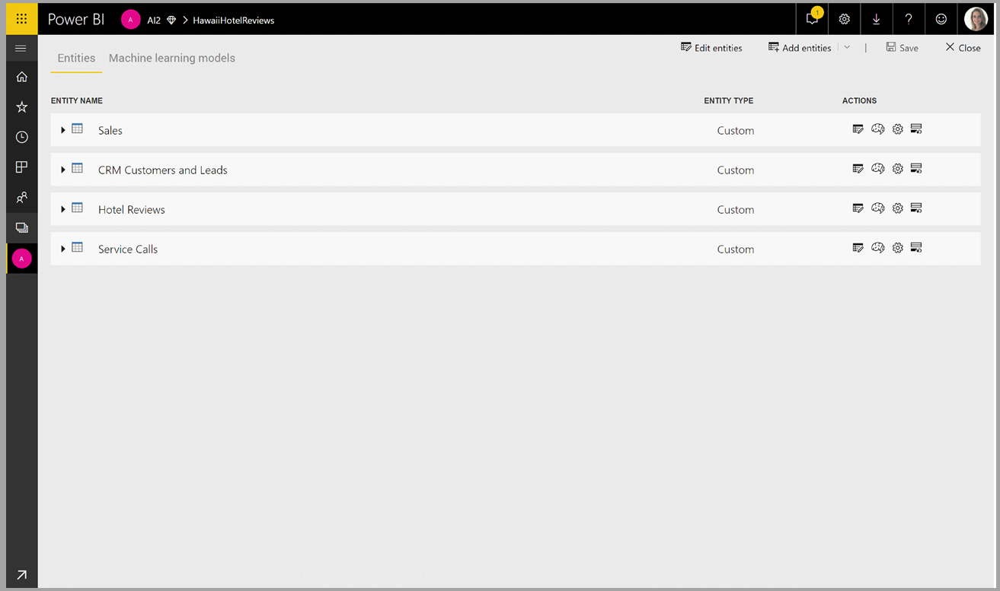
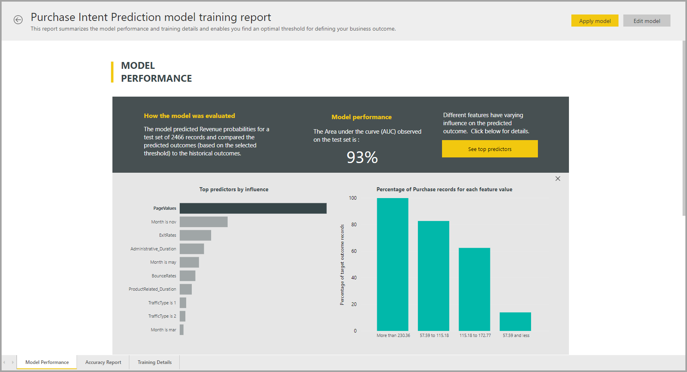
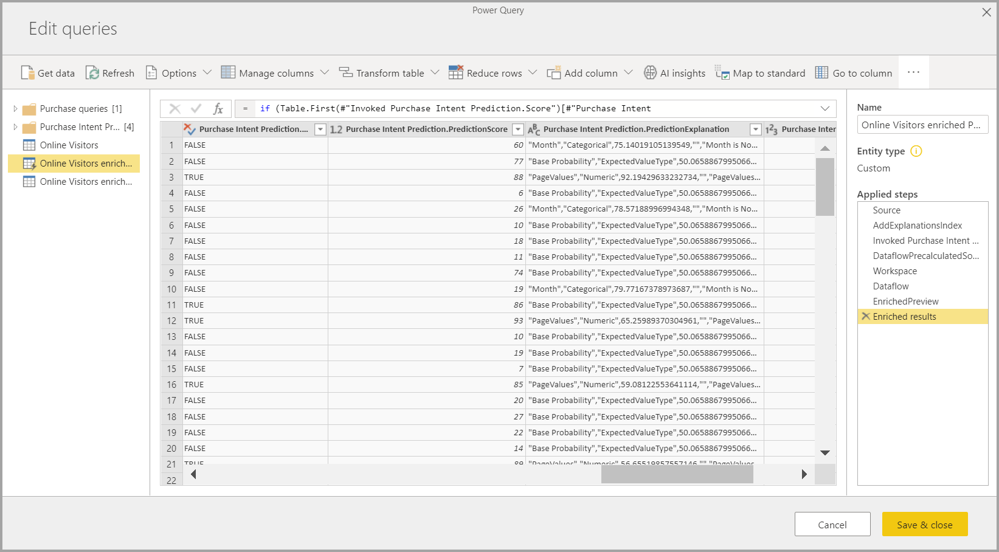

# AI กับกระแสข้อมูลAI with dataflows

ในบทความนี้ เราจะพูดถึงวิธีการที่คุณสามารถใช้ปัญญาประดิษฐ์ (AI) กับกระแสข้อมูลIn this article we discuss ways you can use artificial intelligence (AI) with dataflows. เนื้อหาที่อธิบายไว้ในบทความนี้มีดังต่อไปนี้:The areas described in this article are the following:

* บริการด้านความรู้ความเข้าใจCognitive Services
* การเรียนรู้ของเครื่องอัตโนมัติAutomated Machine Learning
* การบูรณาการของ Azure Machine LearningAzure Machine Learning Integration

## Cognitive Services ใน Power BICognitive Services in Power BI

ด้วย Cognitive Services ใน Power BI คุณสามารถใช้อัลกอริทึมต่างๆ ได้จาก [Azure Cognitive Services](https://azure.microsoft.com/services/cognitive-services/) เพื่อเติมแต่งข้อมูลของคุณในการเตรียมข้อมูลด้วยตนเองสำหรับกระแสข้อมูลWith  Cognitive Services in Power BI, you can apply different algorithms from [Azure Cognitive Services](https://azure.microsoft.com/services/cognitive-services/) to enrich your data in the self-service data prep for Dataflows.

บริการที่ได้รับการรองรับประจำวันนี้ ได้แก่ [การวิเคราะห์ความคิดเห็น](/azure/cognitive-services/text-analytics/how-tos/text-analytics-how-to-sentiment-analysis)[การแยกวลีหลัก](/azure/cognitive-services/text-analytics/how-tos/text-analytics-how-to-keyword-extraction)[การตรวจหาภาษา](/azure/cognitive-services/text-analytics/how-tos/text-analytics-how-to-language-detection) และ [การแท็กรูปภาพ](/azure/cognitive-services/computer-vision/concept-tagging-images)The services that are supported today are [Sentiment Analysis](/azure/cognitive-services/text-analytics/how-tos/text-analytics-how-to-sentiment-analysis), [Key Phrase Extraction](/azure/cognitive-services/text-analytics/how-tos/text-analytics-how-to-keyword-extraction), [Language Detection](/azure/cognitive-services/text-analytics/how-tos/text-analytics-how-to-language-detection), and [Image Tagging](/azure/cognitive-services/computer-vision/concept-tagging-images). การแปลงข้อมูลจะดำเนินการบนบริการของ Power BI และไม่จำเป็นต้องสมัครใช้งาน Azure Cognitive ServicesThe transformations are executed on the Power BI Service and do not require an Azure Cognitive Services subscription. คุณลักษณะนี้ต้องใช้ Power BI PremiumThis feature requires Power BI Premium.

### **เปิดการใช้งานคุณลักษณะ AI****Enabling AI features**

Cognitive Services ได้รับการรองรับโดยโหนดความจุพรีเมียม EM2, A2 หรือ P1 และสูงกว่านั้นCognitive services are supported for Premium capacity nodes EM2, A2, or P1 and above. โดยจะใช้ปริมาณงาน AI ที่แยกต่างหากบนความจุเพื่อเรียกใช้ Cognitive ServicesA separate AI workload on the capacity is used to run cognitive services. ในระหว่างการแสดงตัวอย่างสาธารณะ (ก่อนเดือนมิถุนายน 2019) ค่าเริ่มต้นได้ปิดการใช้งานปริมาณงานDuring public preview (prior to June 2019), this workload was disabled by default. ก่อนที่จะใช้ Cognitive Services ใน Power BI จำเป็นต้องเปิดการใช้งานปริมาณงาน AI ในการตั้งค่าความจุของพอร์ทัลผู้ดูแลระบบBefore using cognitive services in Power BI, the AI workload needs to be enabled in the capacity settings of the admin portal. คุณสามารถเปิดการใช้งานปริมาณงาน AI ในส่วนของปริมาณงาน และกำหนดจำนวนสูงสุดของหน่วยความจำที่คุณต้องการให้ปริมาณงานนี้ใช้ได้You can turn on the AI workload in the workloads section, and define the maximum amount of memory you would like this workload to consume. ขีดจำกัดหน่วยความจำที่แนะนำคือ 20%The recommended memory limit is 20%. หากเกินขีดจำกัดนี้จะทำให้คิวรีช้าลงExceeding this limit causes the query to slow down.

### **เริ่มต้นใช้งานด้วย Cognitive Services ใน Power BI****Getting started with Cognitive Services in Power BI**

การแปลงข้อมูล Cognitive Services เป็นส่วนหนึ่งของ [การเตรียมข้อมูลด้วยตนเองสำหรับกระแสข้อมูล](https://powerbi.microsoft.com/blog/introducing-power-bi-data-prep-wtih-dataflows/)Cognitive Services transforms are part of the [Self-Service Data Prep for dataflows](https://powerbi.microsoft.com/blog/introducing-power-bi-data-prep-wtih-dataflows/). เพื่อเติมแต่งข้อมูลของคุณด้วย Cognitive Services โปรดเริ่มต้น โดยแก้ไขกระแสข้อมูลTo enrich your data with Cognitive Services, start by editing a dataflow.

เลือกปุ่ม **ข้อมูลเชิงลึก AI** ใน Ribbon ด้านบนของตัวแก้ไข Power QuerySelect the **AI Insights** button in the top ribbon of Power Query Editor.

ในหน้าต่างป็อปอัพ เลือกฟังก์ชันที่คุณต้องการใช้และข้อมูลที่ต้องการแปลงIn the pop-up window, select the function you want to use and the data you want to transform. ในตัวอย่างนี้ ฉันกำลังให้คะแนนความคิดเห็นของคอลัมน์ที่มีข้อความรีวิวIn this example, I'm scoring the sentiment of a column that contains review text.

**Cultureinfo** เป็นข้อมูลป้อนเข้าเพิ่มเติมเพื่อระบุภาษาของข้อความ**Cultureinfo** is an optional input to specify the language of the text. เขตข้อมูลนี้คาดหวังรหัส ISOThis field is expecting an ISO code. คุณสามารถใช้คอลัมน์เป็นข้อมูลป้อนเข้าสำหรับ Cultureinfo หรือเขตข้อมูลแบบคงที่ได้You can use a column as input for Cultureinfo, or a static field. ในตัวอย่างนี้ ภาษาที่ระบุสำหรับทั้งคอลัมน์คือภาษาอังกฤษ (en)In this example, the language is specified as English (en) for the whole column. หากคุณปล่อยให้เขตข้อมูลนี้ว่าง Power BI จะตรวจหาภาษาโดยอัตโนมัติก่อนที่จะใช้ฟังก์ชันIf you leave this field blank, Power BI automatically detects the language before applying the function. จากนั้นเลือก **การเรียก**Next, select **Invoke.**

หลังจากการเรียกฟังก์ชัน ระบบจะเพิ่มผลลัพธ์เป็นคอลัมน์ใหม่ลงในตารางAfter invoking the function, the result is added as a new column to the table. และระบบจะเพิ่มการแปลงข้อมูลเป็นขั้นตอนที่นำไปใช้ในคิวรีด้วยเช่นกันThe transformation is also added as an applied step in the query.

หากฟังก์ชันส่งกลับเขตข้อมูลผลลัพธ์หลายรายการ การเรียกฟังก์ชันจะเพิ่มคอลัมน์ใหม่ที่ มีระเบียนของเขตข้อมูลผลลัพธ์หลายรายการIf the function returns multiple output fields, invoking the function adds a new column with a record of the multiple output fields.

ขยายคอลัมน์เพื่อใช้ตัวเลือกในการเพิ่มอย่างน้อยหนึ่งค่าเป็นคอลัมน์ในข้อมูลของคุณUse the expand option to add one or both values as columns to your data.

### **ฟังก์ชันที่พร้อมใช้งาน****Available functions**

ส่วนนี้จะอธิบายฟังก์ชันที่พร้อมใช้งานใน Cognitive Services ใน Power BIThis section describes the available functions in Cognitive Services in Power BI.

#### **ตรวจหาภาษา****Detect Language**

ฟังก์ชันตรวจหาภาษาจะประเมินข้อมูลป้อนเข้าที่เป็นข้อความ โดยแต่ละเขตข้อมูลจะส่งกลับชื่อภาษาและตัวระบุ ISOThe language detection function evaluates text input, and for each field, returns the language name and ISO identifier. ฟังก์ชันนี้เป็นประโยชน์ต่อคอลัมน์ข้อมูลที่รวบรวมข้อความที่กำหนดเองซึ่งไม่ทราบภาษาThis function is useful for data columns that collect arbitrary text, where language is unknown. ฟังก์ชันคาดหวังข้อมูลในรูปแบบข้อความเป็นข้อมูลป้อนเข้าThe function expects data in text format as input.

การวิเคราะห์ข้อความสามารถตรวจหาได้มากถึง 120 ภาษาText Analytics recognizes up to 120 languages. โปรดดู [ภาษาที่รองรับ](/azure/cognitive-services/text-analytics/text-analytics-supported-languages) สำหรับข้อมูลเพิ่มเติมFor more information, see [supported languages](/azure/cognitive-services/text-analytics/text-analytics-supported-languages).

#### **แยกวลีหลัก****Extract Key Phrases**

ฟังก์ชัน **การแยกวลีหลัก** จะประเมินข้อความที่ไม่มีโครงสร้าง โดยแต่ละเขตข้อมูลข้อความจะส่งกลับรายการของวลีหลักThe **Key Phrase Extraction** function evaluates unstructured text, and for each text field, returns a list of key phrases. ฟังก์ชันดังกล่าวจำเป็นต้องมีเขตข้อมูลข้อความเป็นข้อมูลป้อนเข้า และยังยอมรับข้อมูลป้อนเข้าเพิ่มเติมสำหรับ **Cultureinfo** ด้วยเช่นกันThe function requires a text field as input, and accepts an optional input for **Cultureinfo**. (โปรดดูส่วน **เริ่มต้นใช้งาน** ก่อนหน้าในบทความนี้)(See the **Getting Started** section earlier in this article).

การแยกวลีหลักเหมาะสำหรับก้อนข้อความที่ใหญ่กว่าKey phrase extraction works best when you give it bigger chunks of text to work on. ซึ่งตรงข้ามกับการวิเคราะห์ความคิดเห็นที่เหมาะสำหรับก้อนข้อความที่เล็กกว่าThis is opposite from sentiment analysis, which performs better on smaller blocks of text. โปรดพิจารณาการปรับโครงสร้างของข้อมูลป้อนเข้าให้สอดคล้องเพื่อให้ได้ผลลัพธ์ที่ดีที่สุดจากการดำเนินการทั้งสองรูปแบบTo get the best results from both operations, consider restructuring the inputs accordingly.

#### **ให้คะแนนความคิดเห็น****Score Sentiment**

ฟังก์ชัน **ให้คะแนนความคิดเห็น** จะประเมินข้อมูลป้อนเข้าที่เป็นข้อความและส่งกลับคะแนนความคิดเห็นสำหรับแต่ละเอกสาร โดยคะแนนจะไล่เรียงจาก 0 (ลบ) ถึง 1 (บวก)The **Score Sentiment** function evaluates text input and returns a sentiment score for each document, ranging from 0 (negative) to 1 (positive). ฟังก์ชันนี้เป็นประโยชน์สำหรับการตรวจจับความคิดเห็นที่เป็นบวก และลบในสื่อสังคม รีวิวจากลูกค้า และฟอรั่มการอภิปรายThis function is useful for detecting positive and negative sentiment in social media, customer reviews, and discussion forums.

การวิเคราะห์ข้อความจะใช้อัลกอริทึมการจัดประเภทการเรียนรู้เกี่ยวกับเครื่องเพื่อสร้างคะแนนความคิดเห็นระหว่าง 0 และ 1Text Analytics uses a machine learning classification algorithm to generate a sentiment score between 0 and 1. คะแนนที่ใกล้กับ 1 แสดงถึงความคิดเห็นบวก ส่วนคะแนนที่ใกล้กับ 0 แสดงถึงความคิดเห็นลบScores closer to 1 indicate positive sentiment, scores closer to 0 indicate negative sentiment. แบบจำลองจะได้รับการฝึกฝนด้วยเนื้อหาที่เกี่ยวข้องกับความคิดเห็นอย่างครอบคลุมไว้ล่วงหน้าThe model is pre-trained with an extensive body of text with sentiment associations. ในปัจจุบัน ยังไม่สามารถให้ข้อมูลการฝึกของคุณเองได้Currently, it's not possible to provide your own training data. แบบจำลองจะใช้เทคนิคการผสมผสานระหว่างการวิเคราะห์ข้อความ รวมการประมวลผลข้อความ การวิเคราะห์ชนิดของคำ การวางตำแหน่งคำ และกลุ่มคำที่เกี่ยวข้องกันThe model uses a combination of techniques during text analysis, including text processing, part-of-speech analysis, word placement, and word associations. โปรดดู [แนะนำการวิเคราะห์ข้อความ](/archive/blogs/machinelearning/machine-learning-and-text-analytics) สำหรับข้อมูลเพิ่มเติมเกี่ยวกับอัลกอริทึมFor more information about the algorithm, see [Introducing Text Analytics](/archive/blogs/machinelearning/machine-learning-and-text-analytics).

การวิเคราะห์ความคิดเห็นจะดำเนินการบนเขตข้อมูลที่ป้อนเข้าทั้งหมดซึ่งตรงข้ามกับการแยกความคิดเห็นสำหรับเอนทิตีเฉพาะในข้อความSentiment analysis is performed on the entire input field, as opposed to extracting sentiment for a particular entity in the text. ในทางปฏิบัติ จะมีแนวโน้มสำหรับการให้คะแนนความแม่นยำเพื่อปรับปรุงเมื่อเอกสารมีหนึ่งหรือสองประโยคมากกว่าเป็นก้อนข้อความขนาดใหญ่In practice, there's a tendency for scoring accuracy to improve when documents contain one or two sentences rather than a large block of text. ระหว่างขั้นตอนการประเมินปรวิสัย แบบจำลองจะตัดสินว่า เขตข้อมูลที่ป้อนเข้าโดยรวมเป็นข้อเท็จจริงหรือความคิดเห็นDuring an objectivity assessment phase, the model determines whether an input field as a whole is objective or contains sentiment. ระบบจะไม่นำเขตข้อมูลที่ป้อนเข้าที่โดยส่วนใหญ่เป็นข้อเท็จจริงไปดำเนินการต่อในขั้นตอนการตรวจหาความคิดเห็น ดังนั้นระบบจะแสดงผลคะแนน .50 โดยไม่มีการประมวลผลต่อAn input field that is mostly objective does not progress to the sentiment detection phrase, resulting in a .50 score, with no further processing. ส่วนเขตข้อมูลที่ป้อนเข้าที่ดำเนินการต่อในไปป์ไลน์ ขั้นตอนถัดไปจะสร้างคะแนนที่สูงหรือต่ำกว่า .50 โดยขึ้นอยู่กับระดับระดับความคิดเห็นที่ตรวจพบในเขตข้อมูลที่ป้อนเข้าFor input fields continuing in the pipeline, the next phase generates a score above or below .50, depending on the degree of sentiment detected in the input field.

ในปัจจุบัน การวิเคราะห์ความคิดเห็นรองรับภาษาอังกฤษ ภาษาเยอรมัน ภาษาสเปน และภาษาฝรั่งเศสCurrently, Sentiment Analysis supports English, German, Spanish, and French. ส่วนภาษาอื่นๆ ยังอยู่ในช่วงตัวอย่างOther languages are in preview. โปรดดู [ภาษาที่รองรับ](/azure/cognitive-services/text-analytics/text-analytics-supported-languages) สำหรับข้อมูลเพิ่มเติมFor more information, see [Supported languages](/azure/cognitive-services/text-analytics/text-analytics-supported-languages).

#### **แท็กรูปภาพ****Tag Images**

ฟังก์ชัน **แท็กรูปภาพ** จะส่งกลับแท็กโดยยึดตามวัตถุ สิ่งมีชีวิต ทิวทัศน์ และการเคลื่อนไหวที่รู้จักมากกว่า 2,000 รายการThe **Tag Images** function returns tags based on more than 2,000 recognizable objects, living beings, scenery, and actions. เมื่อแท็กไม่ชัดเจนหรือไม่ใช่ความรู้ทั่วไป ผลลัพธ์จะให้ 'ข้อมูล' เพื่ออธิบายความหมายของแท็กในบริบทของการตั้งค่าที่รู้จักWhen tags are ambiguous or not common knowledge, the output provides 'hints' to clarify the meaning of the tag in context of a known setting. แท็กจะไม่ถูกจัดระเบียบเป็นการจัดหมวดหมู่ และจะไม่มีลำดับชั้นการสืบทอดTags are not organized as a taxonomy and no inheritance hierarchies exist. คอลเลกชันของเนื้อหาแท็กจะสร้างพื้นฐานสำหรับ 'คำอธิบาย' รูปภาพที่แสดงเป็นภาษาที่อ่านได้ของมนุษย์ซึ่งมีรูปแบบเป็นประโยคสมบูรณ์A collection of content tags forms the foundation for an image 'description' displayed as human readable language formatted in complete sentences.

หลังจากอัปโหลดรูปภาพหรือระบุ URL รูปภาพแล้ว ผลลัพธ์อัลกอริทึมคอมพิวเตอร์วิทัศน์จะแท็กโดยยึดตามวัตถุ สิ่งมีชีวิต และการเคลื่อนไหวที่ระบุในรูปภาพAfter uploading an image or specifying an image URL, Computer Vision algorithms output tags based on the objects, living beings, and actions identified in the image. แท็กไม่จำกัดเฉพาะเรื่องหลักๆ เช่น บุคคลในพื้นหน้า เท่านั้นแต่ยังรวมถึง ฉาก (ในร่มหรือกลางแจ้ง) เครื่องเรือน เครื่องมือ พืช สัตว์ เครื่องประดับ เครื่องมือเบ็ดเตล็ด และอื่นๆTagging is not limited to the main subject, such as a person in the foreground, but also includes the setting (indoor or outdoor), furniture, tools, plants, animals, accessories, gadgets, and so on.

ฟังก์ชันนี้ต้องเป็น URL รูปภาพหรือเขตข้อมูล abase-64 ที่เป็นข้อมูลป้อนเข้าThis function requires an image URL or abase-64 field as input. ในขณะนี้ การแท็กรูปภาพรองรับภาษาอังกฤษ ภาษาสเปน ภาษาญี่ปุ่น ภาษาโปรตุเกส และภาษาจีนแบบย่อAt this time, image tagging supports English, Spanish, Japanese, Portuguese, and Simplified Chinese. โปรดดู [ภาษาที่รองรับ](/rest/api/cognitiveservices/computervision/tagimage/tagimage#uri-parameters) สำหรับข้อมูลเพิ่มเติมFor more information, see [Supported languages](/rest/api/cognitiveservices/computervision/tagimage/tagimage#uri-parameters).

## การเรียนรู้ของเครื่องอัตโนมัติใน Power BI Automated Machine Learning in Power BI

การเรียนของเครื่องอัตโนมัติ (AutoML) สำหรับกระแสข้อมูลช่วยนักวิเคราะห์ทางธุรกิจในการสอน ตรวจสอบ และเรียกใช้แบบจำลอง Machine Learning (ML) โดยตรงใน Power BIAutomated machine learning (AutoML) for dataflows enables business analysts to train, validate, and invoke Machine Learning (ML) models directly in Power BI. ซึ่งรวมถึงประสบการณ์ง่ายๆ ในการสร้างรูปแบบ ML ใหม่ซึ่งนักวิเคราะห์สามารถใช้กระแสข้อมูลของพวกเขาเพื่อระบุข้อมูลป้อนเข้าสำหรับการฝึกแบบจำลองIt includes a simple experience for creating a new ML model where analysts can use their dataflows to specify the input data for training the model. บริการจะแยกคุณลักษณะที่เกี่ยวข้องมากที่สุดโดยอัตโนมัติ เลือกอัลกอริทึมและเพลงที่เหมาะสม รวมถึงตรวจสอบแบบจำลอง MLThe service automatically extracts the most relevant features, selects an appropriate algorithm, and tunes and validates the ML model. หลังจากที่แบบจำลองได้รับการสอนแล้ว Power BI จะสร้างรายงานประสิทธิภาพที่มีผลลัพธ์ของการตรวจสอบความถูกต้องAfter a model is trained, Power BI automatically generates a performance report that includes the results of the validation. จากนั้นแบบจำลองจะถูกเรียกใช้ในข้อมูลใหม่หรืออัปเดตข้อมูลภายใน กระแสข้อมูลThe model can then be invoked on any new or updated data within the dataflow.

การเรียนรู้เครื่องอัตโนมัติพร้อมใช้งานสำหรับกระแสข้อมูลที่โฮสต์บน Power BI Premium และความจุแบบฝังตัวเท่านั้นAutomated machine learning is available for dataflows that are hosted on Power BI Premium and Embedded capacities only.

### การทำงานกับ AutoMLWorking with AutoML

กระแสข้อมูลนำเสนอการเตรียมข้อมูลด้วยตนเองสำหรับข้อมูลขนาดใหญ่Dataflows offer self-serve data prep for big data. AutoML จะถูกรวมเข้ากับกระแสข้อมูลและช่วยให้คุณสามารถใช้ประโยชน์จากความพยายามในการเตรียมข้อมูลสำหรับการสร้างแบบจำลองการเรียนรู้ของเครื่องได้โดยตรงภายใน Power BIAutoML is integrated into dataflows and enables you to leverage your data prep effort for building machine learning models, right within Power BI.

AutoML ใน Power BI ช่วยนักวิเคราะห์ข้อมูลเพื่อใช้กระแสข้อมูลในการสร้างโมเดลการเรียนรู้ของเครื่องด้วยประสบการณ์การใช้งานแบบง่ายด้วยทักษะ Power BI เท่านั้นAutoML in Power BI enables data analysts to use dataflows to build machine learning models with a simplified experience, using just Power BI skills. วิทยาศาสตร์ข้อมูลส่วนใหญ่ที่อยู่เบื้องหลังการสร้างแบบจำลอง ML นั้นเป็นไปโดยอัตโนมัติจาก Power BIMost of the data science behind the creation of the ML models is automated by Power BI. มีตัวป้องกันเพื่อให้แน่ใจว่าแบบจำลองที่สร้างขึ้นนั้นมีคุณภาพดี และสามารถมองเห็นกระบวนการที่ใช้ในการสร้างแบบจำลอง ML ได้It has guardrails to ensure that the model produced has good quality and provides visibility into the process used to create your ML model.

AutoML สนับสนุนการสร้างแบบจำลอง **การทำนายแบบไบนารี** **การจำแนกประเภท** และ **การถดถอย** สำหรับกระแสข้อมูลAutoML supports the creation of **Binary Prediction**, **Classification**, and **Regression Models** for dataflows. แบบจำลองเหล่านี้เป็นประเภทของเทคนิคการเรียนรู้ของเครื่องแบบมีผู้สอน ซึ่งหมายความว่าแบบจำลองได้เรียนรู้จากผลลัพธ์ที่ทราบในการสังเกตการณ์ที่ผ่านมาเพื่อทำนายผลลัพธ์ของการสังเกตการณ์อื่นๆThese are types of supervised machine learning techniques, which means that they learn from the known outcomes of past observations to predict the outcomes of other observations. ชุดข้อมูลป้อนเข้าสำหรับการฝึกแบบจำลอง AutoML คือชุดของระเบียนที่มี **ป้ายชื่อ** ที่มีผลลัพธ์ที่ทราบThe input dataset for training an AutoML model is a set of records that are **labeled** with the known outcomes.

AutoML ใน Power BI รวม [ML อัตโนมัติ](/azure/machine-learning/service/concept-automated-ml)จาก[Azure Machine Learning service](/azure/machine-learning/service/overview-what-is-azure-ml)เพื่อสร้างรูปแบบ ML ของคุณAutoML in Power BI integrates [automated ML](/azure/machine-learning/service/concept-automated-ml) from [Azure Machine Learning](/azure/machine-learning/service/overview-what-is-azure-ml) to create your ML models. อย่างไรก็ตามคุณไม่จำเป็นต้องมีการสมัครใช้งาน Azure เพื่อให้ AutoML ใน Power BIHowever, you don't need an Azure subscription to use AutoML in Power BI. กระบวนการของการฝึกและโฮสต์รูปแบบ ML ได้รับการจัดการทั้งหมดโดยบริการของ Power BIThe process of training and hosting the ML models is managed entirely by the Power BI service.

หลังจากแบบจำลอง ML ได้รับการฝึก AutoML ให้สร้างรายงาน Power BI โดยอัตโนมัติที่อธิบายประสิทธิภาพการทำงานของรูปแบบ ML ของคุณAfter an ML model is trained, AutoML automatically generates a Power BI report that explains the likely performance of your ML model. AutoML ให้ความสำคัญกับความสามารถในการอธิบายโดยการเน้นที่ปัจจัยหลักที่มีอิทธิพลในอินพุทของคุณที่มีผลต่อการทำนายที่ส่งคืนจากแบบจำลองของคุณAutoML emphasizes explainability by highlighting the key influencers among your inputs that influence the predictions returned by your model. รายงานยังรวมถึงเมตริกหลักสำหรับแบบจำลองด้วยThe report also includes key metrics for the model.

หน้าอื่นๆ ของรายงานที่สร้างขึ้นแสดงสรุปทางสถิติของแบบจำลองและรายละเอียดการฝึกอบรมOther pages of the generated report show the statistical summary of the model and the training details. ผลสรุปทางสถิติคือความสนใจของผู้ใช้ที่ต้องการดูหน่วยวัดประสิทธิภาพของแบบจำลองตามมาตรฐานวิทยาศาสตร์ข้อมูลThe statistical summary is of interest to users who would like to see the standard data science measures of model performance. รายละเอียดการฝึกสรุปการเกิดซ้ำทั้งหมดที่มีการเรียกใช้เพื่อสร้างแบบจำลองของคุณด้วยพารามิเตอร์การสร้างโมเดลที่เกี่ยวข้องThe training details summarize all the iterations that were run to create your model, with the associated modeling parameters. นอกจากนี้ยังอธิบายวิธีการป้อนข้อมูลแต่ละครั้งที่ใช้ในการสร้างแบบจำลอง MLIt also describes how each input was used to create the ML model.

จากนั้นคุณสามารถนำรูปแบบ ML ของคุณไปใช้กับข้อมูลของคุณสำหรับการให้คะแนนได้You can then apply your ML model to your data for scoring. เมื่อมีการรีเฟรชกระแสข้อมูล ข้อมูลของคุณจะได้รับการอัปเดตด้วยการทำนายจากแบบจำลอง MLWhen the dataflow is refreshed, your data is updated with predictions from your ML model. Power BI ยังรวมถึงคำอธิบายเฉพาะสำหรับการทำนายแต่ละรายการที่แบบจำลอง ML สร้างขึ้นPower BI also includes an individualized explanation for each specific prediction that the ML model produces.

### การสร้างแบบจำลองการเรียนรู้ของเครื่องCreating a machine learning model

ในส่วนนี้จะอธิบายวิธีการสร้างแบบจำลอง AutoMLThis section describes how to create an AutoML model.

#### การเตรียมข้อมูลสำหรับการสร้างรูปแบบ MLData prep for creating an ML model

เมื่อต้องการสร้างแบบจำลองการเรียนรู้ของเครื่องใน Power BI คุณต้องสร้างกระแสข้อมูลสำหรับข้อมูลที่ประกอบด้วยข้อมูลผลลัพธ์ในอดีต ซึ่งนำมาใช้สำหรับการสอนแบบจำลอง MLTo create a machine learning model in Power BI, you must first create a dataflow for the data containing the historical outcome information, which is used for training the ML model. นอกจากนี้คุณควรเพิ่มคอลัมน์จากการคำนวณสำหรับเมตริกธุรกิจใดๆ ที่อาจมีทำนายที่แข็งแกร่งสำหรับผลลัพธ์ที่คุณกำลังพยายามคาดการณ์You should also add calculated columns for any business metrics that may be strong predictors for the outcome you're trying to predict. สำหรับรายละเอียดเกี่ยวกับการกำหนดค่ากระแสข้อมูลของคุณ โปรดดูที่ [ กำหนดค่าและใช้กระแสข้อมูล](dataflows-configure-consume.md)For details on configuring your dataflow, see [configure and consume a dataflow](dataflows-configure-consume.md).

AutoML มีข้อกำหนดข้อมูลเฉพาะสำหรับการฝึกแบบจำลองการเรียนรู้ของเครื่องAutoML has specific data requirements for training a machine learning model. ข้อกำหนดเหล่านี้จะอธิบายไว้ในส่วนด้านล่างตามชนิดแบบจำลองที่เกี่ยวข้องThese requirements are described in sections below, based on respective model types.

#### การกำหนดค่าอินพุทแบบจำลอง MLConfiguring the ML model inputs

เมื่อต้องการสร้างแบบจำลอง AutoML ให้เลือกไอคอน ML ในคอลัมน์ **การดำเนินการ** ของเอนทิตีกระแสข้อมูล และเลือก **เพิ่มแบบจำลองการเรียนรู้ของเครื่อง**To create an AutoML model, select the ML icon in the **Actions** column of the dataflow entity, and select **Add a machine learning model**.

มีการเปิดใช้งานประสบการณ์ที่ง่ายดายซึ่งประกอบด้วยตัวช่วยสร้างที่แนะนำคุณในกระบวนการสร้างรูปแบบ MLA simplified experience is launched, consisting of a wizard that guides you through the process of creating the ML model. ตัวช่วยสร้างมีขั้นตอนง่ายๆดังต่อไปนี้The wizard includes the following simple steps.

**1. เลือกเอนทิตีที่มีข้อมูลในอดีตและเขตข้อมูลผลลัพธ์ที่คุณต้องการการทำนาย** **1. Select the entity with the historical data, and the outcome field for which you want a prediction**

เขตข้อมูลผลลัพธ์จะระบุแอตทริบิวต์ป้ายชื่อสำหรับการสอนแบบจำลอง ML ดังที่แสดงในรูปต่อไปนี้The outcome field identifies the label attribute for training the ML model, shown in the following image.

**2. เลือกประเภทแบบจำลอง****2. Choose a model type**

เมื่อคุณระบุเขตข้อมูลผลลัพธ์ AutoML จะวิเคราะห์ข้อมูลป้ายชื่อเพื่อแนะนำประเภทแบบจำลอง ML ที่มีความเป็นไปได้มากที่สุดที่สามารถสอนได้When you specify the outcome field, AutoML analyzes the label data to recommend the most likely ML model type that can be trained. คุณสามารถเลือกประเภทแบบจำลองที่แตกต่างกันดังที่แสดงด้านล่างโดยการคลิกที่ "เลือกแบบจำลองที่แตกต่างกัน"You can pick a different model type as shown below by clicking on “Select a different model”.

> [!NOTE]
> แบบจำลองบางชนิดอาจไม่ได้รับการสนับสนุนสำหรับข้อมูลที่คุณเลือก และจะถูกปิดใช้งานSome model types may not be supported for the data that you have selected and hence would be disabled. ในตัวอย่างข้างต้น แบบจำลองการถดถอยถูกปิดใช้งานเนื่องจากมีการเลือกคอลัมน์ข้อความเป็นเขตข้อมูลผลลัพธ์In the above example, Regression is disabled, as a text column is selected as outcome field.

**3. เลือกอินพุทที่คุณต้องการให้แบบจำลองใช้เป็นสัญญาณที่คาดเดาได้****3. Select the inputs you want the model to use as predictive signals**

AutoML วิเคราะห์ตัวอย่างของเอนทิตีที่เลือกเพื่อแนะนำอินพุทที่สามารถนำมาใช้สำหรับการสอนแบบจำลอง ML ได้AutoML analyzes a sample of the selected entity to suggest the inputs that can be used for training the ML model. คำอธิบายจะอยู่ถัดจากเขตข้อมูลที่ไม่ได้เลือกExplanations would be provided next to fields that are not selected. ถ้าเขตข้อมูลเฉพาะมีค่าที่แตกต่างกันมากเกินไป หรือมีเพียงหนึ่งค่าเท่านั้น หรือมีความสัมพันธ์ต่ำหรือสูงกับเขตข้อมูลผลลัพธ์ เราไม่ขอแนะนำเขตข้อมูลนี้If a particular field has too many distinct values or only one value, or low or high correlation with the output field, it would not be recommended.

อินพุทใดก็ตามที่ขึ้นอยู่กับเขตข้อมูลผลลัพธ์ (หรือเขตข้อมูลป้ายชื่อ) ไม่ควรใช้สำหรับการสอนแบบจำลอง ML เนื่องจากจะส่งผลกระทบต่อประสิทธิภาพของแบบจำลองAny inputs that are dependent on the outcome field (or the label field) should not be used for training the ML model, since they will affect its performance. เขตข้อมูลดังกล่าวจะถูกตั้งค่าสถานะว่ามี "ความสัมพันธ์สูงอย่างน่าสงสัยกับเขตข้อมูลผลลัพธ์"Such fields would be flagged as having “suspiciously high correlation with output field”. การใช้เขตข้อมูลเหล่านี้เป็นข้อมูลการสอนจะทำให้เกิดปัญหาการรั่วไหลของป้ายชื่อ ซึ่งแบบจำลองจะทำงานได้ดีกับการตรวจสอบความถูกต้องหรือการทดสอบข้อมูล แต่ไม่มีประสิทธิภาพเมื่อใช้ในการให้คะแนนIntroducing these fields into the training data causes label leakage, where the model performs well on the validation or test data but cannot match that performance when used in production for scoring. การรั่วไหลของป้ายชื่ออาจเป็นปัญหาที่เกิดขึ้นได้กับแบบจำลอง AutoML เมื่อประสิทธิภาพของแบบจำลองการสอนดีเกินกว่าความเป็นจริงLabel leakage could be a possible concern in AutoML models, when training model performance is too good to be true.

คำแนะนำเกี่ยวกับคุณลักษณะนี้จะขึ้นอยู่กับตัวอย่างของข้อมูล ดังนั้นคุณควรตรวจสอบอินพุทที่ใช้This feature recommendation is based on a sample of a data, so you should review the inputs used. คุณมีตัวเลือกในการเปลี่ยนแปลงการเลือกเพื่อรวมเฉพาะเขตข้อมูลที่คุณต้องการให้แบบจำลองศึกษาYou have the option to change the selections to include only the fields you want the model to study. นอกจากนี้ คุณยังสามารถเลือกเขตข้อมูลทั้งหมดได้โดยเลือกช่องทำเครื่องหมายถัดจากชื่อเอนทิตีYou can also select all the fields by selecting the checkbox next to the entity name.

**4. ตั้งชื่อแบบจำลองและบันทึกการกำหนดค่าของคุณ****4. Name your model and save your configuration**

ในขั้นตอนสุดท้าย คุณสามารถตั้งชื่อแบบจำลองและเลือกบันทึก และสอนที่เริ่มต้นการสอนแบบจำลอง MLIn the final step, you can name the model and select Save and train which begins training the ML model. คุณสามารถเลือกที่จะลดเวลาการสอนเพื่อดูผลลัพธ์อย่างรวดเร็ว หรือเพิ่มระยะเวลาที่ใช้ในการสอนเพื่อให้ได้แบบจำลองที่ดีที่สุดYou can choose to reduce the training time to see quick results or increase the amount of time spent in training to get the best model.

#### การฝึกแบบจำลอง MLML model training

การฝึกแบบจำลอง AutoML เป็นส่วนหนึ่งของรีเฟรชกระแสข้อมูลTraining of AutoML models is a part of the dataflow refresh. ก่อนอื่น AutoML เตรียมข้อมูลของคุณสำหรับการฝึกAutoML first prepares your data for training.
AutoML จะแยกข้อมูลในอดีต ซึ่งคุณระบุไว้ในชุดข้อมูลการสอนและการทดสอบAutoML splits the historical data you provide into training and testing datasets. ชุดข้อมูลทดสอบคือชุด holdout ที่ใช้สำหรับการตรวจสอบประสิทธิภาพของแบบจำลองหลังจากการฝึกThe test dataset is a holdout set that is used for validating the model performance after training. สิ่งเหล่านี้จะถูกรับรู้ว่ามี **การฝึกและการทดสอบ** เอนทิตีในกระแสข้อมูลThese are realized as **Training and Testing** entities in the dataflow. AutoML ใช้การตรวจสอบความถูกต้องข้ามสำหรับการตรวจสอบแบบจำลองAutoML uses cross-validation for the model validation.

ถัดไปแต่ละเขตข้อมูลป้อนเข้าจะได้รับการวิเคราะห์และใช้การใส่ค่า ซึ่งแทนที่ค่าที่ขาดหายไปด้วยค่าที่มีการแทนที่Next, each input field is analyzed and imputation is applied, which replaces any missing values with substituted values. มีการใช้กลยุทธ์การใส่ค่าที่แตกต่างกันสองตัวโดย AutoMLA couple of different imputation strategies are used by AutoML. สำหรับแอตทริบิวต์อินพุทที่ถือว่าเป็นคุณลักษณะตัวเลข ค่าเฉลี่ยของค่าคอลัมน์จะนำมาใช้สำหรับการแทนค่าข้อมูลที่สูญหายFor input attributes treated as numeric features, the mean of the column values is used for imputation. สำหรับแอตทริบิวต์อินพุทที่ถือว่าเป็นคุณลักษณะจัดกลุ่ม AutoML จะใช้ฐานนิยมของค่าคอลัมน์สำหรับการแทนค่าข้อมูลที่สูญหายFor input attributes treated as categorical features, AutoML uses the mode of the column values for imputation. ค่าเฉลี่ยและฐานนิยมของค่าที่ใช้สำหรับการแทนค่าข้อมูลที่สูญหายถูกคำนวณโดยเฟรมเวิร์ก AutoML บนชุดข้อมูลการสอนที่สุ่มย่อยThe mean and mode of values used for imputation are calculated by the AutoML framework on the subsampled training dataset.

จากนั้น มีการใช้การสุ่มตัวอย่างและการปรับมาตรฐานกับข้อมูลของคุณตามที่ต้องการThen, sampling and normalization are applied to your data as required. สำหรับแบบจำลองการจำแนกประเภท AutoML จะเรียกใช้ข้อมูลอินพุทผ่านการสุ่มตัวอย่างแบบชั้นภูมิและทำให้คลาสสมดุลเพื่อให้แน่ใจว่าจำนวนแถวจะเท่ากันทั้งหมดFor classification models, AutoML runs the input data through stratified sampling and balances the classes to ensure the row counts are equal for all.

AutoML ใช้การแปลงหลายครั้งในแต่ละเขตข้อมูลอินพุทที่เลือกตามชนิดข้อมูลและคุณสมบัติทางสถิติAutoML applies several transformations on each selected input field based on its data type, and its statistical properties. AutoML ใช้การแปลงข้อมูลเหล่านี้เพื่อแยกคุณลักษณะสำหรับใช้ในการฝึกแบบจำลอง ML ของคุณAutoML uses these transformations to extract features for use in training your ML model.

กระบวนการฝึกสำหรับแบบจำลอง AutoML ประกอบด้วยการทำซ้ำ 50 ครั้งที่มีการวนกลับกับอัลกอริทึมการสร้างโมเดลที่แตกต่างกันและการตั้งค่า hyperparameter เพื่อค้นหาแบบจำลองที่มีประสิทธิภาพที่ดีที่สุดThe training process for AutoML models consists of up to 50 iterations with different modeling algorithms and hyperparameter settings to find the model with the best performance. การสอนอาจจบลงก่อนด้วยจำนวนการวนซ้ำที่น้อยลง หาก AutoML สังเกตว่าประสิทธิภาพไม่ได้ดีขึ้นTraining can end early with lesser iterations if AutoML notices that there is no performance improvement being observed. ประสิทธิภาพของแต่ละโมเดลเหล่านี้จะถูกประเมินโดยการตรวจสอบความถูกต้องของชุดข้อมูลทดสอบ holdoutThe performance of each of these models is assessed by validation with the holdout test dataset. ในระหว่างขั้นตอนการฝึกอบรมนี้ AutoML สร้างไปป์ไลน์หลายตัวสำหรับการฝึกอบรมและการตรวจสอบการเกิดซ้ำเหล่านี้During this training step, AutoML creates several pipelines for training and validation of these iterations. กระบวนการประเมินประสิทธิภาพของแบบจำลองอาจใช้เวลาไม่กี่นาทีไปจนถึงสองสามชั่วโมง หรือจนถึงเวลาการสอนที่กำหนดค่าในตัวช่วยสร้าง ทั้งนี้ขึ้นอยู่กับขนาดของชุดข้อมูลของคุณและทรัพยากรความจุที่พร้อมใช้งานThe process of assessing the performance of the models can take time, anywhere from several minutes to a couple of hours up-to the training time configured in the wizard, depending on the size of your dataset and the capacity resources available.

ในบางกรณีแบบจำลองขั้นสุดท้ายที่สร้างขึ้นอาจใช้การเรียนรู้ในวงการที่มีการใช้หลายแบบเพื่อให้ประสิทธิภาพการทำงานที่ดีขึ้นIn some cases, the final model generated may use ensemble learning, where multiple models are used to deliver better predictive performance.

#### ความสามารถในการอธิบายแบบจำลอง AutoMLAutoML model explainability

หลังจากที่ได้รับการฝึกแบบจำลอง AutoML วิเคราะห์ความสัมพันธ์ระหว่างคุณลักษณะการป้อนข้อมูลและการแสดงผลแบบจำลองAfter the model has been trained, AutoML analyzes the relationship between the input features and the model output. AutoML จะประเมินขนาดของการเปลี่ยนแปลงไปยังการแสดงผลแบบจำลองสำหรับชุดข้อมูลทดสอบ holdout สำหรับคุณลักษณะอินพุทแต่ละตัวIt assesses the magnitude of change to the model output for the holdout test dataset for each input feature. ซึ่งเรียกว่า _ความสำคัญของคุณลักษณะ_This is known as the _feature importance_. สิ่งนี้เกิดขึ้นเนื่องจากเป็นส่วนหนึ่งของการรีเฟรชเมื่อการสอนเสร็จสมบูรณ์This happens as a part of the refresh once training is complete. ดังนั้นการรีเฟรชของคุณอาจใช้เวลานานกว่าเวลาการสอนที่กำหนดไว้ในตัวช่วยสร้างHence your refresh may take longer than the training time configured in the wizard.

#### รายงานแบบจำลอง AutoMLAutoML model report

AutoML สร้างรายงาน Power BI ที่สรุปประสิทธิภาพการทำงานของแบบจำลองระหว่างการตรวจสอบความถูกต้องพร้อมกับความสำคัญของคุณลักษณะทั่วโลกAutoML generates a Power BI report that summarizes the performance of the model during validation, along with the global feature importance. รายงานนี้สามารถเข้าถึงได้จากแท็บแบบจำลองการเรียนรู้ของเครื่องเมื่อการรีเฟรชกระแสข้อมูลเสร็จสิ้นThis report can be accessed from the Machine Learning Model tab once the dataflow refresh is successful. รายงานสรุปผลลัพธ์จากการใช้แบบจำลอง ML ไปยังข้อมูลทดสอบ holdout และเปรียบเทียบการคาดการณ์ด้วยค่าผลลัพธ์The report summarizes the results from applying the ML model to the holdout test data and comparing the predictions with the known outcome values.

คุณสามารถตรวจสอบรายงานแบบจำลองเพื่อทำความเข้าใจประสิทธิภาพYou can review the model report to understand its performance. นอกจากนี้คุณยังสามารถตรวจสอบว่าปัจจัยหลักที่มีอิทธิพลของแบบจำลองอยู่ใกล้กับกับข้อมูลเชิงลึกทางธุรกิจเกี่ยวกับผลลัพธ์ที่รู้ผลอยู่แล้วYou can also validate that the key influencers of the model align with the business insights about the known outcomes.

แผนภูมิและหน่วยวัดที่ใช้เพื่ออธิบายประสิทธิภาพของแบบจำลองในรายงานจะขึ้นอยู่กับชนิดแบบจำลองThe charts and measures used to describe the model performance in the report depend on the model type. แผนภูมิประสิทธิภาพและหน่วยวัดเหล่านี้จะอธิบายไว้ในส่วนต่อไปนี้These performance charts and measures are described in the following sections.

หน้าเพิ่มเติมในรายงานอาจอธิบายหน่วยวัดทางสถิติเกี่ยวกับแบบจำลองจากมุมมองวิทยาศาสตร์ข้อมูลAdditional pages in the report may describe statistical measures about the model from a data science perspective. ตัวอย่างเช่นรายงาน **การคาดการณ์ไบนารี** จะมีแผนภูมิกำไรและเส้นโค้ง ROC สำหรับแบบจำลองFor instance, the **Binary Prediction** report includes a gain chart and the ROC curve for the model.

รายงานยังรวมถึงหน้า **รายละเอียดการสอน** ที่มีคำอธิบายวิธีการการสอนแบบจำลอง และแผนภูมิที่อธิบายประสิทธิภาพของแบบจำลองในการวนซ้ำแต่ละครั้งThe reports also include a **Training Details** page that includes a description of how the model was trained, and a chart describing the model performance over each of the iterations run.

ส่วนอื่นในหน้านี้จะอธิบายชนิดของเขตข้อมูลอินพุทที่ตรวจพบ และวิธีการแทนค่าข้อมูลที่สูญหายที่ใช้สำหรับการเติมค่าที่หายไปAnother section on this page describes the detected type of the input field and imputation method used for filling missing values. นอกจากนี้ยังมีพารามิเตอร์ที่ใช้โดยแบบจำลองขั้นสุดท้ายIt also includes the parameters used by the final model.

ถ้าแบบจำลองที่สร้างขึ้นใช้การเรียนรู้แบบ Ensemble หน้า **รายละเอียดการสอน** ยังประกอบด้วยแผนภูมิที่แสดงน้ำหนักของแบบจำลองหน่วยประกอบแต่ละชุดใน Ensemble ซึ่งรวมถึงพารามิเตอร์ด้วยIf the model produced uses ensemble learning, then the **Training Details** page also includes a chart showing the weight of each constituent model in the ensemble, as well as its parameters.

### การใช้แบบจำลอง AutoMLApplying the AutoML model

ถ้าคุณพอใจกับประสิทธิภาพการทำงานของรูปแบบ ML ที่สร้างขึ้นคุณสามารถนำไปใช้กับข้อมูลใหม่หรืออัปเดตเมื่อมีการรีเฟรช กระแสข้อมูลของคุณIf you're satisfied with the performance of the ML model created, you can apply it to new or updated data when your dataflow is refreshed. คุณสามารถดำเนินการได้จากรายงานแบบจำลองโดยการเลือกปุ่ม **นำไปใช้** ที่มุมขวาบนหรือปุ่ม ใช้แบบจำลอง ML ใต้การดำเนินการในแท็บแบบจำลองการเรียนรู้ของเครื่องYou can do this from the model report, by selecting the **Apply** button in the top-right corner or the Apply ML Model button under actions in the Machine Learning Models tab.

เมื่อต้องการใช้รูปแบบจำลอง ML คุณต้องระบุชื่อของเอนทิตีที่จะต้องใช้และคำนำหน้าสำหรับคอลัมน์ที่จะถูกเพิ่มไปยังเอนทิตีนี้สำหรับการแสดงผลแบบจำลองTo apply the ML model, you must specify the name of the entity to which it must be applied, and a prefix for the columns that will be added to this entity for the model output. คำนำหน้าเริ่มต้นสำหรับชื่อคอลัมน์คือชื่อแบบจำลองThe default prefix for the column names is the model name. ฟังก์ชันการ _นำไปใช้_ อาจรวมพารามิเตอร์เพิ่มเติมเฉพาะสำหรับชนิดแบบจำลองThe _Apply_ function may include additional parameters specific to the model type.

การใช้แบบจำลอง ML จะสร้างเอนทิตีกระแสข้อมูลสองใหม่รายการ ซึ่งมีการทำนายและคำอธิบายเฉพาะสำหรับแต่ละแถวที่ให้คะแนนในเอนทิตีผลลัพธ์Applying the ML model creates two new dataflow entities which contains the predictions and individualized explanations for each row that it scores in the output entity. ตัวอย่างเช่น ถ้าคุณนำแบบจำลอง _PurchaseIntent_  ไปใช้กับเอนทิตี _OnlineShoppers_ ผลลัพธ์จะสร้างเอนทิตี **PurchaseIntent ที่สมบูรณ์ของ OnlineShoppers** และ **คำอธิบาย PurchaseIntent ที่สมบูรณ์ของ OnlineShoppers**For instance, if you apply the _PurchaseIntent_ model to the _OnlineShoppers_ entity, the output will generate the **OnlineShoppers enriched PurchaseIntent** and **OnlineShoppers enriched PurchaseIntent explanations** entities. สำหรับแต่ละแถวในเอนทิตีที่สมบูรณ์ **คำอธิบาย** จะแบ่งย่อยเป็นหลายแถวในเอนทิตีคำอธิบายที่สมบูรณ์ตามคุณลักษณะอินพุทFor each row in the enriched entity, The **Explanations** is broken down into multiple rows in the enriched explanations entity based on the input feature. **ExplanationIndex** ช่วยแมปแถวจากเอนทิตีคำอธิบายที่สมบูรณ์ไปยังแถวในเอนทิตีที่สมบูรณ์An **ExplanationIndex** helps map the rows from the enriched explanations entity to the row in enriched entity.

คุณยังสามารถนำแบบจำลอง Power BI AutoML ต่าง ๆ ไปใช้กับเอนทิตีในกระแสข้อมูลใด ๆ ก็ได้ในพื้นที่ทำงานเดียวกันโดยใช้ข้อมูลเชิงลึกของ AI ในเบราว์เซอร์ฟังก์ชัน PQOYou can also apply any Power BI AutoML model to entities in any dataflow in the same workspace using AI Insights in PQO function browser. ด้วยวิธีนี้คุณสามารถใช้แบบจำลองที่สร้างโดยผู้อื่นในพื้นที่ทำงานเดียวกันโดยไม่จำเป็นต้องเป็นเจ้าของของกระแสข้อมูลที่มีแบบจำลองด้วยThis way, you can use models created by others in the same workspace without necessarily being an owner of the dataflow that has the model. Power Query ค้นพบโมเดล Power BI ML ทั้งหมดในพื้นที่ทำงานและแสดงเป็นฟังก์ชัน Power Query แบบไดนามิกPower Query discovers all the Power BI ML models in the workspace and exposes them as dynamic Power Query functions.  คุณจะสามารถเรียกใช้ฟังก์ชันเหล่านั้นโดยการเข้าถึงจาก Ribbon ในตัวแก้ไข Power Query หรือโดยการเรียกฟังก์ชัน M โดยตรงYou can invoke those functions by accessing them from the ribbon in Power Query Editor, or by invoking the M function directly. ฟังก์ชันนี้จะได้รับการรองรับเฉพาะกระแสข้อมูล Power BI และ Power Query แบบออนไลน์ในบริการของ Power BIThis functionality is currently only supported for Power BI dataflows, and for Power Query Online in the Power BI service. โปรดทราบว่านี่เป็นวิธีที่แตกต่างจากการใช้แบบจำลอง ML ภายในกระแสข้อมูลด้วยตัวช่วยสร้าง AutoMLNote that this is very different from applying ML models within a dataflow using the AutoML wizard. ไม่มีเอนทิตีคำอธิบายที่สร้างขึ้นโดยใช้วิธีนี้โดยเว้นแต่ว่าคุณเป็นเจ้าของกระแสข้อมูล คุณจะไม่สามารถเข้าถึงรายงานการฝึกอบรมของแบบจำลองหรือฝึกอบรมแบบจำลองใหม่There is no explanations entity created using this method and unless you are the owner of the dataflow, you cannot access model training reports or retrain the model. ถ้าแบบจำลองแหล่งข้อมูลถูกแก้ไข (เพิ่มหรือลบเขตข้อมูลที่ป้อนเข้า) แบบจำลองหรือกระแสข้อมูลแหล่งที่มาจะถูกลบออก แล้วกระแสข้อมูลที่ขึ้นอยู่กับนี้จะหยุดทำงานIf the source model is edited (adding or removing  input fields) or, the model or source dataflow is deleted, then this dependent dataflow would break.

หลังจากคุณใช้แบบจำลองแล้ว AutoML จะทำให้การทำนายของคุณเป็นปัจจุบันเสมอเมื่อใดก็ตามที่มีการรีเฟรชกระแสข้อมูลAfter you apply the model, AutoML always keeps your predictions up-to-date whenever the dataflow is refreshed.

หากต้องการใช้ข้อมูลเชิงลึกและการคาดการณ์จากรูปแบบ ML ในรายงาน Power BI คุณสามารถเชื่อมต่อไปยังเอนทิตีเอาต์พุตจาก Power BI Desktop โดยใช้ตัวเชื่อมต่อ **กระแสข้อมูล**To use the insights and predictions from the ML model in a Power BI report, you can connect to the output entity from Power BI Desktop using the **dataflows** connector.

### แบบจำลองการทำนายแบบไบนารีBinary Prediction models

แบบจำลองการคาดการณ์ไบนารีที่รู้จักกันอย่างเป็นทางการเป็น **แบบจำลองการจัดประเภทไบนารี** จะใช้เพื่อจัดประเภทชุดข้อมูลลงในสองกลุ่มBinary Prediction models, more formally known as **binary classification models**, are used to classify a dataset into two groups. ซึ่งใช้ในการทำนายเหตุการณ์ที่อาจมีผลลัพธ์แบบไบนารีได้They're used to predict events that can have a binary outcome. ตัวอย่างเช่น โอกาสทางการขายเปลี่ยนไปเป็นการขายจริงหรือไม่ บัญชีผู้ใช้นี้จะออกไปจากระบบหรือไม่ มีการชำระเงินตามใบแจ้งนี้ตรงเวลาหรือไม่ ธุรกรรมนี้เป็นการฉ้อโกงหรือไม่ และอื่น ๆFor instance, whether a sales opportunity will convert, whether an account will churn, whether an invoice will be paid on time, whether a transaction is fraudulent, and so on.

ผลลัพธ์ของแบบจำลองการทำนายแบบไบนารีคือคะแนนความน่าจะเป็น ซึ่งระบุความเป็นไปได้ที่จะบรรลุผลลัพธ์เป้าหมายThe output of a Binary Prediction model is a probability score, which identifies the likelihood that the target outcome will be achieved.

#### แบบจำลองการทำนายแบบไบนารีTraining a Binary Prediction model

การเตรียมปัจจัยที่จำเป็น:Pre-requisites:

- ต้องมีข้อมูลในอดีตย่างน้อย 20 แถวสำหรับแต่ละคลาสของผลลัพธ์A minimum of 20 rows of historical data is required for each class of outcomes

กระบวนการสร้างสำหรับแบบจำลองการคาดการณ์ไบนารีจะเป็นไปตามขั้นตอนเดียวกันกับแบบจำลองAutoML อื่นๆที่อธิบายไว้ในส่วนที่ **กำหนดค่าอินพุทแบบจำลอง ML** ด้านบนThe process of creation for a Binary Prediction model follows the same steps as other AutoML models, described in the section **Configuring the ML model inputs** above. ข้อแตกต่างเพียงอย่างเดียวคือในขั้นตอน “เลือกแบบจำลอง” ซึ่งคุณสามารถเลือกค่าผลลัพธ์เป้าหมายที่คุณสนใจมากที่สุดได้The only difference is in the “Choose a model” step where you can select the target outcome value that you’re most interested in. คุณยังสามารถกำหนดป้ายชื่อที่เรียกง่ายสำหรับผลลัพธ์ที่จะใช้ในรายงานที่สร้างขึ้นโดยอัตโนมัติ ซึ่งจะสรุปผลลัพธ์ของการตรวจสอบแบบจำลองYou can also provide friendly labels for the outcomes to be used in the automatically generated report that will summarize the results of the model validation.

#### รายงานแบบจำลองการทำนายแบบไบนารีBinary Prediction model report

แบบจำลองการทำนายแบบไบนารีจะสร้างเป็นผลลัพธ์ที่เป็นไปได้ว่าเรกคอร์ดจะบรรลุผลลัพธ์เป้าหมายThe Binary Prediction model produces as an output a probability that a record will achieve the target outcome. รายงานมีตัวแบ่งส่วนข้อมูลสำหรับขีดจำกัดความน่าจะเป็นซึ่งมีผลต่อวิธีการที่คะแนนด้านบนและด้านล่างของขีดจำกัดความน่าจะเป็นThe report includes a slicer for the probability threshold, which influences how the scores above and below the probability threshold are interpreted.

รายงานอธิบายประสิทธิภาพการทำงานของแบบจำลองในแง่ของ _True Positives, False Positives, True Negatives และ False Negatives_The report describes the performance of the model in terms of _True Positives, False Positives, True Negatives, and False Negatives_. True Positive และ True Negative ได้รับการคาดการณ์ผลอย่างถูกต้องสำหรับสองชั้นในข้อมูลผลลัพธ์True Positives and True Negatives are correctly predicted outcomes for the two classes in the outcome data. False Positives คือเรกคอร์ดที่ทำนายว่าจะมีผลลัพธ์เป้าหมาย แต่ในความเป็นจริงไม่ใช่False Positives are records that were predicted to have Target outcome but actually did not. ในทางกลับกัน False Negatives คือเรกคอร์ดที่มีผลลัพธ์เป้าหมาย แต่ถูกทำนายว่าไม่มีConversely, False Negatives are records that had Target outcome but were predicted as not having it.

หน่วยวัดเช่นความแม่นยำและการเรียกใช้ให้อธิบายผลกระทบของขีดจำกัดน่าจะเป็นที่มาของผลลัพธ์ที่คาดการณ์ไว้Measures, such as Precision and Recall, describe the effect of the probability threshold on the predicted outcomes. คุณสามารถใช้ตัวแบ่งส่วนข้อมูลของขีดจำกัดความน่าจะเป็นเพื่อเลือกขีดจำกัดที่ทำให้มีความสมดุลระหว่างความแม่นยำและการเรียกคืนได้You can use the probability threshold slicer to select a threshold that achieves a balanced compromise between Precision and Recall.

รายงานยังมีเครื่องมือการวิเคราะห์ต้นทุนและผลประโยชน์เพื่อช่วยในการระบุส่วนย่อยของประชากรที่ควรจะเป็นเป้าหมายเพื่อให้ได้กำไรสูงสุดThe report also includes a Cost-Benefit analysis tool to help identify the subset of the population that should be targeted to yield the highest profit. ด้วยต้นทุนต่อหน่วยที่กำหนดไว้โดยประมาณจากการกำหนดเป้าหมายและประโยชน์ต่อหน่วยจากการบรรลุผลลัพธ์เป้าหมาย การวิเคราะห์ต้นทุนและผลกำไรจะพยายามเพิ่มผลกำไรสูงสุดGiven an estimated unit cost of targeting and a unit benefit from achieving a target outcome, Cost-Benefit analysis attempts to maximize profit. คุณสามารถใช้เครื่องมือนี้เพื่อเลือกค่าขีดจำกัดความน่าจะเป็นโดยยึดตามจุดสูงสุดในกราฟเพื่อเพิ่มผลกำไรสูงสุดYou can use this tool to pick your probability threshold based on the maximum point in the graph to maximize profit. นอกจากนี้ คุณยังสามารถใช้กราฟเพื่อคำนวณกำไรหรือต้นทุนสำหรับการเลือกค่าขีดจำกัดความน่าจะเป็นของคุณได้อีกด้วยYou can also use the graph to compute the profit or cost for your choice of probability threshold.

หน้า **รายงานที่แม่นยำ** ของรายงานแบบจำลองมีแผนภูมิ _กำไรสะสม_ และเส้นโค้ง ROC สำหรับแบบจำลองThe **Accuracy Report** page of the model report includes the _Cumulative Gains_ chart and the ROC curve for the model. รายงานเหล่านี้คือหน่วยวัดทางสถิติของประสิทธิภาพแบบจำลองThese are statistical measures of model performance. รายงานประกอบด้วยคำอธิบายของแผนภูมิที่แสดงThe reports include descriptions of the charts shown.

#### การนำแบบจำลองการทำนายแบบไบนารีไปใช้Applying a Binary Prediction model

เมื่อต้องการใช้แบบจำลองการคาดการณ์ไบนารีคุณต้องระบุเอนทิตีที่มีข้อมูลที่คุณต้องการใช้การคาดการณ์จากรูปแบบ MLTo apply a Binary Prediction model, you must specify the entity with the data to which you want to apply the predictions from the ML model. พารามิเตอร์อื่นๆรวมถึงคำนำหน้าชื่อคอลัมน์ผลลัพธ์และขีดจำกัดความน่าจะเป็นสำหรับการจัดประเภทผลลัพธ์ที่คาดการณ์ไว้Other parameters include the output column name prefix and the probability threshold for classifying the predicted outcome.

เมื่อมีการใช้แบบจำลองการทำนายแบบไบนารี การดำเนินการนี้จะเพิ่มคอลัมน์ผลลัพธ์สี่คอลัมน์ไปยังเอนทิตีผลลัพธ์ที่สมบูรณ์ได้แก่ **Outcome**, **PredictionScore**, **PredictionExplanation** และ **ExplanationIndex**When a Binary Prediction model is applied, it adds four output columns to the enriched output entity: **Outcome**, **PredictionScore**, **PredictionExplanation**, and **ExplanationIndex**. ชื่อคอลัมน์ในเอนทิตีมีการระบุคำนำหน้าเมื่อใช้แบบจำลองThe column names in the entity have the prefix specified when the model is applied.

**PredictionScore** คือเปอร์เซ็นต์ความน่าจะเป็น ซึ่งระบุความเป็นไปได้ที่จะบรรลุผลลัพธ์เป้าหมาย**PredictionScore** is a percentage probability, which identifies the likelihood that the target outcome will be achieved.

คอลัมน์ **Outcome** ประกอบด้วยป้ายชื่อผลลัพธ์ที่ทำนายไว้The **Outcome** column contains the predicted outcome label. เรกคอร์ดที่มีความน่าจะเป็นเกินค่าขีดจำกัดจะได้รับการทำนายว่ามีแนวโน้มที่จะทำให้เกิดผลลัพธ์เป้าหมาย และถูกติดป้ายชื่อว่าเป็นจริงRecords with probabilities exceeding the threshold are predicted as likely to achieve the target outcome and are labeled as True. เรกคอร์ดที่อยู่ต่ำกว่าค่าขีดจำกัดจะได้รับการทำนายว่าไม่น่าจะทำให้เกิดผลลัพธ์ และถูกติดป้ายชื่อว่าเป็นเท็จRecords below the threshold are predicted as unlikely to achieve the outcome and are labeled as False.

คอลัมน์ **PredictionExplanationประกอบ** ด้วยคำอธิบายที่มีผลกระทบเฉพาะที่คุณลักษณะป้อนเข้าที่มีใน **PredictionScore**The **PredictionExplanation** column contains an explanation with the specific influence that the input features had on the **PredictionScore**.

### แบบจำลองการจัดประเภทClassification models

แบบจำลองการจัดประเภทจะใช้ในการแยกประเภทชุดข้อมูลลงในกลุ่มหรือประเภทในหลายรายการClassification models are used to classify a dataset into multiple groups or classes. แบบจำลองนี้ใช้เพื่อทำนายเหตุการณ์ที่สามารถมีหนึ่งในผลลัพธ์ที่เป็นไปได้หลายอย่างThey're used to predict events that can have one of the multiple possible outcomes. ตัวอย่างเช่น ลูกค้ามีแนวโน้มที่จะมีมูลค่าตลอดช่วงชีวิตสูงมาก สูง ปานกลาง หรือต่ำ ความเสี่ยงในการผิดนัดชำระหนี้เป็นสูง ปานกลาง ต่ำ หรือต่ำมาก และอื่นๆFor instance, whether a customer is likely to have a very high, high, medium, or low Lifetime Value, whether the risk of default is High, Moderate, Low, or Very Low; and so on.

ผลลัพธ์ของแบบจำลองการจัดประเภทคือคะแนนความน่าจะเป็นซึ่งระบุถึงความเป็นไปได้ว่าระเบียนจะบรรลุเกณฑ์สำหรับคลาสที่กำหนดThe output of a Classification model is a probability score, which identifies the likelihood that a record will achieve the criteria for a given class.

#### การฝึกแบบจำลองการจัดประเภทTraining a Classification model

เอนทิตีอินพุทที่ประกอบด้วยข้อมูลการสอนของคุณสำหรับแบบจำลองการจำแนกประเภทจะต้องมีเขตข้อมูลสตริงหรือจำนวนเต็มเป็นเขตข้อมูลผลลัพธ์ ซึ่งระบุผลลัพธ์ที่ทราบในอดีตThe input entity containing your training data for a Classification model must have a string or whole number field as the outcome field, which identifies the past known outcomes.

การเตรียมปัจจัยที่จำเป็น:Pre-requisites:

- ต้องมีข้อมูลในอดีตย่างน้อย 20 แถวสำหรับแต่ละคลาสของผลลัพธ์A minimum of 20 rows of historical data is required for each class of outcomes

กระบวนการสร้างสำหรับแบบจำลองการคาดการณ์จะเป็นไปตามขั้นตอนเดียวกันกับแบบจำลองAutoML อื่นๆที่อธิบายไว้ในส่วนที่ **กำหนดค่าอินพุทแบบจำลอง ML** ด้านบนThe process of creation for a Classification model follows the same steps as other AutoML models, described in the section **Configuring the ML model inputs** above.

#### รายงานผลลัพธ์แบบจำลองการจัดประเภทClassification model report

รายงานแบบจำลองการจัดประเภทได้รับการผลิตโดยใช้รูปแบบ ML เป็นข้อมูลทดสอบ holdout และเปรียบเทียบคลาสที่คาดการณ์สำหรับระเบียนที่มีคลาสที่รู้จักจริงThe Classification model report is produced by applying the ML model to the holdout test data and comparing the predicted class for a record with the actual known class.

รายงานแบบจำลองมีแผนภูมิที่มีการแบ่งย่อยของระเบียนที่มีการจัดประเภทอย่างถูกต้องและไม่ถูกต้องสำหรับแต่ละคลาสที่รู้จักThe model report includes a chart that includes the breakdown of the correctly and incorrectly classified records for each known class.

การเลื่อนเฉพาะระดับชั้นเพิ่มเติมจะช่วยให้การวิเคราะห์วิธีการกระจายการคาดการณ์สำหรับคลาสที่รู้จักA further class-specific drilldown enables an analysis of how the predictions for a known class are distributed. ซึ่งแสดงคลาสอื่นที่เรกคอร์ดของคลาสที่ทราบนั้นมีแนวโน้มว่าจะจัดผิดประเภทThis shows the other classes in which records of that known class are likely to be misclassified.

คำอธิบายแบบจำลองในรายงานซึ่งรวมไปถึงการคาดการณ์ระดับสูงสำหรับแต่ละคลาสThe model explanation in the report also includes the top predictors for each class.

รายงานแบบจำลองการจัดประเภทยังรวมถึงหน้ารายละเอียดการฝึกอบรมที่คล้ายกับหน้าสำหรับชนิดแบบจำลองอื่นๆตามที่อธิบายไว้ในส่วน **รายงานแบบจำลอง AutoML** ก่อนหน้าในบทความนี้The Classification model report also includes a Training Details page similar to the pages for other model types, as described in the section **AutoML model report** earlier in this article.

#### การนำแบบจำลองการจัดประเภทไปใช้Applying a classification model

เมื่อต้องการใช้แบบจำลองการจัดประเภท ML คุณต้องระบุเอนทิตีที่มีข้อมูลป้อนเข้าและคำนำหน้าชื่อคอลัมน์ผลลัพธ์To apply a Classification ML model, you must specify the entity with the input data and the output column name prefix.

เมื่อมีการใช้แบบจำลองการจัดประเภท การดำเนินการนี้จะเพิ่มคอลัมน์ผลลัพธ์ห้าคอลัมน์ไปยังเอนทิตีผลลัพธ์ที่สมบูรณ์ได้แก่ **ClassificationScore**, **ClassificationResult**, **ClassificationExplanation**, **ClassProbabilities** และ **ExplanationIndex**When a Classification model is applied, it adds five output columns to the enriched output entity: **ClassificationScore**, **ClassificationResult**, **ClassificationExplanation**, **ClassProbabilities**, and **ExplanationIndex**. ชื่อคอลัมน์ในเอนทิตีมีการระบุคำนำหน้าเมื่อใช้แบบจำลองThe column names in the entity have the prefix specified when the model is applied.

คอลัมน์ **ClassProbabilities** ประกอบด้วยรายการคะแนนความน่าจะเป็นสำหรับเรกคอร์ดในแต่ละคลาสที่เป็นไปได้The **ClassProbabilities** column contains the list of probability scores for the record for each possible class.

**ClassificationScore** คือเปอร์เซ็นต์ความน่าจะเป็น ซึ่งระบุความเป็นไปได้ที่เรกคอร์ดจะบรรลุเกณฑ์สำหรับคลาสที่กำหนดThe **ClassificationScore** is the percentage probability, which identifies the likelihood that a record will achieve the criteria for a given class.

คอลัมน์ **ClassificationResult** ประกอบด้วยคลาสที่คาดการณ์ความเป็นไปได้มากที่สุดสำหรับเรกคอร์ดThe **ClassificationResult** column contains the most likely predicted class for the record.

คอลัมน์ **ClassificationExplanation** ประกอบด้วยคำอธิบายที่มีผลกระทบเฉพาะที่คุณลักษณะอินพุทมีใน **ClassificationScore**The **ClassificationExplanation** column contains an explanation with the specific influence that the input features had on the **ClassificationScore**.

### แบบจำลองการถดถอยRegression models

แบบจำลองการถดถอยจะใช้ในการทำนายค่าตัวเลขRegression models are used to predict a numeric value. ตัวอย่างเช่น รายได้มีแนวโน้มที่จะมาจากข้อตกลงการขาย มูลค่าตลอดอายุการใช้งานของบัญชี ยอดเงินของใบแจ้งหนี้ที่น่าจะได้รับชำระ วันที่ที่อาจมีการชำระใบแจ้งหนี้ และอื่นๆFor instance: the revenue likely to be realized from a sales deal, the lifetime value of an account, the amount of a receivable invoice that is likely to be paid, the date on which an invoice may be paid, and so on.

ผลลัพธ์ของแบบจำลองการถดถอยคือค่าที่คาดการณ์ไว้The output of a Regression model is the predicted value.

#### การฝึกแบบจำลองการถดถอยTraining a Regression model

เอนทิตีอินพุทที่มีข้อมูลสอนสำหรับแบบจำลองการถดถอยต้องมีเขตข้อมูลตัวเลขเป็นเขตข้อมูลผลลัพธ์ ซึ่งระบุค่าผลลัพธ์ที่ทราบแล้วThe input entity containing the training data for a Regression model must have a numeric field as the outcome field, which identifies the known outcome values.

การเตรียมปัจจัยที่จำเป็น:Pre-requisites:

- ต้องมีอย่างน้อย100 แถวของข้อมูลในอดีตสำหรับแบบจำลองการถดถอยA minimum of 100 rows of historical data is required for a Regression model

กระบวนการสร้างสำหรับแบบจำลองการการถดถอยจะเป็นไปตามขั้นตอนเดียวกันกับแบบจำลองAutoML อื่นๆที่อธิบายไว้ในส่วนที่ **กำหนดค่าอินพุทแบบจำลอง ML** ด้านบนThe process of creation for a Regression model follows the same steps as other AutoML models, described in the section **Configuring the ML model inputs** above.

#### รายงานแบบจำลองการถดถอยRegression model report

เช่นเดียวกับรายงานแบบจำลอง AutoML อื่นๆรายงานการถดถอยจะขึ้นอยู่กับผลลัพธ์จากการนำแบบจำลองไปใช้กับข้อมูลทดสอบ holdoutLike the other AutoML model reports, the Regression report is based on the results from applying the model to the holdout test data.

รายงานแบบจำลองประกอบด้วยแผนภูมิที่เปรียบเทียบค่าที่ทำนายกับค่าจริงThe model report includes a chart that compares the predicted values to the actual values. ในแผนภูมินี้ระยะห่างจากเส้นทแยงมุมแสดงข้อผิดพลาดในการคาดการณ์In this chart, the distance from the diagonal indicates the error in the prediction.

แผนภูมิข้อผิดพลาดที่เหลือแสดงการกระจายของเปอร์เซ็นต์ของข้อผิดพลาดเฉลี่ยสำหรับค่าที่แตกต่างกันในชุดข้อมูลการทดสอบ holdoutThe residual error chart shows the distribution of the percentage of average error for different values in the holdout test dataset. แกนแนวนอนแสดงถึงค่าที่แท้จริงของกลุ่มที่มีขนาดของฟองที่แสดงความถี่หรือจำนวนของค่าในช่วงนั้นThe horizontal axis represents the mean of the actual value for the group, with the size of the bubble showing the frequency or count of values in that range. แกนแนวตั้งคือข้อผิดพลาดที่เหลือโดยเฉลี่ยThe vertical axis is the average residual error.

รายงานแบบจำลองการถดถอยยังรวมถึงหน้ารายละเอียดการฝึกรายงานสำหรับชนิดแบบจำลองอื่นๆตามที่อธิบายไว้ในส่วน **รายงานแบบจำลอง AutoML** ด้านบนThe Regression model report also includes a Training Details page like the reports for other model types, as described in the section **AutoML model report** above.

#### การใช้แบบจำลองการถดถอยApplying a regression model

เมื่อต้องการใช้แบบจำลองการถดถอย ML คุณต้องระบุเอนทิตีที่มีข้อมูลป้อนเข้าและคำนำหน้าชื่อคอลัมน์ผลลัพธ์To apply a Regression ML model, you must specify the entity with the input data and the output column name prefix.

เมื่อมีการใช้แบบจำลองการถดถอย การดำเนินการนี้จะเพิ่มคอลัมน์ผลผลลัพธ์สามคอลัมน์ลงในเอนทิตีที่สมบูรณ์ได้แก่ **RegressionResult**, **RegressionExplanation** และ **ExplanationIndex**When a Regression model is applied, it adds three output columns to the enriched output entity: **RegressionResult**, **RegressionExplanation**, and **ExplanationIndex**. ชื่อคอลัมน์ในเอนทิตีมีการระบุคำนำหน้าเมื่อใช้แบบจำลองThe column names in the entity have the prefix specified when the model is applied.

คอลัมน์ **RegressionResult** ประกอบด้วยค่าที่ทำนายสำหรับเรกคอร์ดที่ยึดตามเขตข้อมูลอินพุทThe **RegressionResult** column contains the predicted value for the record based on the input fields. คอลัมน์ **RegressionExplanation** ประกอบด้วยคำอธิบายที่มีผลกระทบเฉพาะที่คุณลักษณะอินพุทมีอยู่ใน **RegressionResult**The **RegressionExplanation** column contains an explanation with the specific influence that the input features had on the **RegressionResult**.

## การรวม Azure Machine Learning ใน Power BIAzure Machine Learning integration in Power BI

องค์กรมากมายใช้แบบจำลอง **Machine Learning** เพื่อข้อมูลเชิงลึกและการคาดการณ์เกี่ยวกับธุรกิจของตนเองที่ดีกว่าNumerous organizations use **Machine Learning** models for better insights and predictions about their business. ความสามารถในการแสดงผลด้วยภาพจากแบบจำลองเหล่านี้ในรายงานและแดชบอร์ดรวมถึงการวิเคราะห์อื่นๆ ของคุณสามารถช่วยเผยแพร่ข้อมูลเชิงลึกเหล่านี้ให้แก่ผู้ใช้ทางธุรกิจที่ต้องการมากที่สุดได้The ability to visualize and invoke insights from these models, in your reports and dashboards and other analytics, can help disseminate these insights to the business users who need it the most.  ขณะนี้ Power BI ช่วยให้การรวมข้อมูลเชิงลึกจากแบบจำลองที่โฮสต์บน Azure Machine Learning ได้อย่างง่ายดายโดยใช้ลักษณะการชี้และคลิกโดยตรงPower BI now makes it simple to incorporate the insights from models hosted on Azure Machine Learning, using straightforward point-and-click gestures.

หากต้องการใช้ความสามารถนี้ นักวิทยาศาสตร์ข้อมูลสามารถให้สิทธิ์เข้าถึงแบบจำลอง Azure ML ไปยังนักวิเคราะห์ BI โดยใช้พอร์ทัล Azure ได้อย่างง่ายดายTo use this capability, a data scientist can simply grant access to the Azure ML model to the BI analyst using the Azure portal.  จากนั้น ณ จุดเริ่มต้นของแต่ละเซสชัน Power Query จะค้นพบแบบจำลอง Azure MLทั้งหมดที่ผู้ใช้ได้เข้าถึง และแสดงเป็นฟังก์ชัน Power Query แบบไดนามิกThen, at the start of each session, Power Query discovers all the Azure ML models to which the user has access and exposes them as dynamic Power Query functions.  จากนั้นผู้ใช้จะสามารถเรียกใช้ฟังก์ชันเหล่านั้นโดยการเข้าถึงจาก Ribbon ในตัวแก้ไข Power Query หรือโดยการเรียกฟังก์ชัน M โดยตรงThe user can then invoke those functions by accessing them from the ribbon in Power Query Editor, or by invoking the M function directly. นอกจากนี้ Power BI ยังรวมคำขอการเข้าถึงโดยอัตโนมัติเมื่อเรียกแบบจำลอง Azure ML สำหรับชุดของแถวเพื่อบรรลุประสิทธิภาพการทำงานที่ดีกว่าPower BI also automatically batches the access requests when invoking the Azure ML model for a set of rows to achieve better performance.

ฟังก์ชันนี้จะได้รับการรองรับเฉพาะกระแสข้อมูล Power BI และ Power Query แบบออนไลน์ในบริการของ Power BIThis functionality is currently only supported for Power BI dataflows, and for Power Query online in the Power BI service.

หากต้องการเรียนรู้เพิ่มเติมเกี่ยวกับกระแสข้อมูล โปรดดู [ข้อมูลเบื้องต้นเกี่ยวกับกระแสข้อมูลและการเตรียมข้อมูลด้วยตนเอง](dataflows-introduction-self-service.md)To learn more about dataflows, see [Introduction to dataflows and self-service data prep](dataflows-introduction-self-service.md).

หากต้องการเรียนรู้เพิ่มเติมเกี่ยวกับ Azure Machine Learning โปรดดู:To learn more about Azure Machine Learning, please see:

- ภาพรวม:  [Azure Machine Learning คืออะไร](/azure/machine-learning/service/overview-what-is-azure-ml)Overview:  [What is Azure Machine Learning?](/azure/machine-learning/service/overview-what-is-azure-ml)
- เริ่มต้นใช้งานด่วนและบทช่วยสอนสำหรับ Azure Machine Learning:  [เอกสารประกอบ Azure Machine Learning](/azure/machine-learning/)Quick Starts and Tutorials for Azure Machine Learning:  [Azure Machine Learning Documentation](/azure/machine-learning/)

> [!NOTE]
> จำเป็นต้องมีการสมัครใช้งาน Power BI Premium ในการใช้การรวม Azure Machine LearningA Power BI Premium subscription is required to use Azure Machine learning integration.

### การให้สิทธิ์เข้าถึงแบบจำลอง Azure ML แก่ผู้ใช้ Power BIGranting access to the Azure ML model to a Power BI user

หากต้องการเข้าถึงแบบจำลอง Azure ML จาก Power BI ผู้ใช้จะต้องมีการสมัครใช้งาน Azure ที่มีการเข้าถึงแบบ **อ่าน**To access an Azure ML model from Power BI, the user must have **Read** access to the Azure subscription.  นอกจากนี้:In addition:

- สำหรับแบบจำลอง Machine Learning Studio (คลาสสิก) ต้องใช้การเข้าถึงแบบ **อ่าน** สำหรับบริการบนเว็บ Machine Learning Studio (คลาสสิก)For Machine Learning Studio (classic) models, **Read** access to Machine Learning Studio (classic) web service
- สำหรับแบบจำลอง Machine Learning ต้องใช้การเข้าถึงแบบ **อ่าน** สำหรับพื้นที่ทำงาน Machine LearningFor Machine Learning models, **Read** access to the Machine Learning workspace

ขั้นตอนในบทความนี้จะอธิบายวิธีให้สิทธิ์ใช้งานแก่ผู้ใช้ Power BI ในการเข้าถึงแบบจำลองที่โฮสต์บนบริการ Azure ML เพื่อให้ผู้ใช้สามารถเข้าถึงแบบจำลองนี้เป็นฟังก์ชัน Power QueryThe steps in this article describe how to grant a Power BI user access to a model hosted on the Azure ML service, so they can access this model as a Power Query function.  โปรดดู [จัดการการเข้าถึง RBAC และพอร์ทัล Azure](/azure/role-based-access-control/role-assignments-portal) สำหรับรายละเอียดอื่นๆFor further details, please see [Manage access using RBAC and the Azure portal](/azure/role-based-access-control/role-assignments-portal).

1. ลงชื่อเข้าใช้ไปยัง [พอร์ทัล Azure](https://portal.azure.com)Sign in to the [Azure portal](https://portal.azure.com).

2. ไปที่หน้า **การสมัครใช้งาน**Go to the **Subscriptions** page. คุณสามารถค้นหาหน้า **การสมัครใช้งาน** ผ่านรายการ **บริการทั้งหมด** ในเมนูบานหน้าต่างนำทางของพอร์ทัล AzureYou can find the **Subscriptions** page through the **All Services** list in the nav pane menu of the Azure portal.

    

3. เลือกการสมัครใช้งานของคุณSelect your subscription.

    

4. เลือก **ควบคุมการเข้าถึง (IAM)** แล้วเลือกปุ่ม **เพิ่ม**Select **Access Control (IAM)**, and then select the **Add** button.

    

5. เลือกบทบาทเป็น **ผู้อ่าน**Select **Reader** as the Role. เลือกผู้ใช้ Power BI ที่คุณต้องการให้สิทธิ์เข้าถึงแบบจำลอง Azure MLSelect the Power BI user to whom you wish to grant access to the Azure ML model.

    

6. เลือก **บันทึก**Select **Save**.

7. ทำซ้ำขั้นตอนที่สามถึงหกเพื่อให้สิทธิ์การเข้าถึงแบบ **ผู้อ่าน** แก่ผู้ใช้สำหรับบริการบนเว็บ Machine Learning Studio (คลาสสิก) ที่เจาะจง *หรือ* พื้นที่ทำงาน Machine Learning ที่โฮสต์แบบจำลองRepeat steps three through six to grant **Reader** access to the user for the specific Machine Learning Studio (classic) web service, *or* the Machine Learning workspace hosting the model.

### การค้นพบ Schema สำหรับแบบจำลอง Machine LearningSchema discovery for Machine Learning models

นักวิทยาศาสตร์ข้อมูลใช้ Python เป็นหลักเพื่อพัฒนาหรือแม้กระทั่งปรับใช้ แบบจำลองการเรียนรู้ของเครื่องของพวกเขาสำหรับ Machine LearningData scientists primarily use Python to develop, and even deploy, their machine learning models for Machine Learning.  ซึ่งต่างจาก Machine Learning Studio (คลาสสิก) ซึ่งช่วยให้งานการสร้างไฟล์ Schema สำหรับแบบจำลองเป็นไปโดยอัตโนมัติ ในกรณีของ Machine Learning นักวิทยาศาสตร์ข้อมูลต้องสร้างไฟล์ Schema อย่างชัดเจนโดยใช้ PythonUnlike the Machine Learning Studio (classic), which helps automate the task of creating a schema file for the model, in the case of Machine Learning, the data scientist must explicitly generate the schema file using Python.

ไฟล์ Schema นี้ต้องอยู่ในบริการเว็บที่ปรับใช้สำหรับแบบจำลอง Machine LearningThis schema file must be included in the deployed web service for Machine Learning models. หากต้องการสร้าง Schema สำหรับบริการเว็บโดยอัตโนมัติ คุณต้องใส่ตัวอย่างของอินพุท/เอาท์พุทในสคริปต์รายการสำหรับแบบจำลองที่ปรับใช้To automatically generate the schema for web service, you must provide a sample of the input/output in the entry script for the deployed model. โปรดดูที่หัวข้อย่อยเกี่ยวกับการสร้าง Schema ของ Swagger แบบอัตโนมัติ [(ไม่บังคับ) ในแบบจำลองการปรับใช้ด้วยเอกสารบริการ Azure Machine Learning](/azure/machine-learning/how-to-deploy-and-where#optional-define-model-web-service-schema)Please see the subsection on [(Optional) Automatic Swagger schema generation in the Deploy models with the Azure Machine Learning](/azure/machine-learning/how-to-deploy-and-where#optional-define-model-web-service-schema) service documentation. ลิงก์มีสคริปต์รายการตัวอย่างด้วยคำสั่งสำหรับการสร้าง SchemaThe link includes the example entry script with the statements for the schema generation. 

โดยเฉพาะ ฟังก์ชัน *\@input_schema* และ *\@output_schema* ในสคริปต์รายการอ้างอิงค่ารูปแบบตัวอย่างอินพุทและเอาท์พุทในตัวแปร *input_sample* และ *output_sample* และใช้ตัวอย่างเหล่านี้เพื่อสร้างข้อกำหนด OpenAPI (Swagger) สำหรับบริการเว็บในระหว่างการปรับใช้งานSpecifically, the *\@input_schema* and *\@output_schema* functions in the entry script reference the input and output sample formats in the *input_sample* and *output_sample* variables, and use these samples to generate an OpenAPI (Swagger) specification for the web service during deployment.

คำแนะนำเหล่านี้สำหรับการสร้าง Schema โดยการอัปเดตสคริปต์รายการจะต้องนำไปใช้กับแบบจำลองที่สร้างขึ้นโดยใช้การทดสอบการเรียนรู้ของเครื่องอัตโนมัติโดยใช้ Azure Machine Learning SDKThese instructions for schema generation by updating the entry script must also be applied to models created using automated machine learning experiments using the Azure Machine Learning SDK.

> [!NOTE]
> แบบจำลองที่สร้างขึ้นโดยใช้อินเทอร์เฟสการแสดงผลด้วยภาพของ Azure Machine Learning ปัจจุบันไม่รองรับการสร้าง Schema แต่จะรองรับในรุ่นต่อ ๆ มาModels created using the Azure Machine Learning visual interface do not currently support schema generation, but will in subsequent releases. 

### การเรียกแบบจำลอง Azure ML ใน Power BIInvoking the Azure ML model in Power BI

คุณสามารถเรียกแบบจำลอง Azure ML ใดๆ ที่คุณได้รับสิทธิ์เข้าถึงได้ โดยตรงจากตัวแก้ไข Power Query ในกระแสข้อมูลของคุณYou can invoke any Azure ML model to which you have been granted access, directly from the Power Query Editor in your dataflow. หากต้องการเข้าถึงแบบจำลอง Azure ML ให้เลือกปุ่ม **แก้ไข** สำหรับเอนทิตีที่คุณต้องการเติมแต่งด้วยข้อมูลเชิงลึกจากแบบจำลอง Azure ML ของคุณดังที่แสดงในรูปภาพต่อไปนี้To access the Azure ML models, select the **Edit** button for the entity that you want to enrich with insights from your Azure ML model, as shown in the following image.

การเลือกปุ่ม **แก้ไข** เพื่อเปิดตัวแก้ไข Power Query สำหรับเอนทิตีในกระแสข้อมูลของคุณSelecting the **Edit** button opens the Power Query Editor for the entities in your dataflow.

เลือกปุ่ม **ข้อมูลเชิงลึกของ AI** ในริบบอน จากนั้นเลือกโฟลเดอร์ _แบบจำลอง Azure Machine Learning_ จากเมนูบานหน้าต่างนำทางSelect the **AI Insights** button in the ribbon, and then select the _Azure Machine Learning Models_ folder from the nav pane menu. แบบจำลอง Azure ML ทั้งหมดที่คุณสามารถเข้าถึงได้จะแสดงที่นี่เป็นฟังก์ชัน Power QueryAll the Azure ML models to which you have access are listed here as Power Query functions. นอกจากนี้ พารามิเตอร์ที่ป้อนเข้าสำหรับแบบจำลอง Azure ML จะแมปเป็นพารามิเตอร์ของฟังก์ชัน Power Query ที่สอดคล้องกันโดยอัตโนมัติAlso, the input parameters for the Azure ML model are automatically mapped as parameters of the corresponding Power Query function.

หากต้องการเรียกแบบจำลอง Azure ML คุณสามารถระบุคอลัมน์ของเอนทิตีที่เลือกใดๆ ก็ได้ เป็นข้อมูลป้อนเข้าจากดรอปดาวน์To invoke an Azure ML model, you can specify any of the selected entity's columns as an input from the drop-down. นอกจากนี้คุณยังสามารถระบุค่าคงที่เพื่อใช้เป็นข้อมูลป้อนเข้าได้ โดยสลับไอคอนคอลัมน์ไปทางซ้ายของกล่องโต้ตอบที่ป้อนเข้าYou can also specify a constant value to be used as an input by toggling the column icon to the left of the input dialog.

เลือก **การเรียก** เพื่อดูตัวอย่างผลลัพธ์ของแบบจำลอง Azure ML เป็นคอลัมน์ใหม่ในตารางเอนทิตีSelect **Invoke** to view the preview of the Azure ML model's output as a new column in the entity table. นอกจากนี้คุณจะเห็นการเรียกแบบจำลองเป็นขั้นตอนที่นำไปใช้สำหรับคิวรีYou will also see the model invocation as an applied step for the query.

หากแบบจำลองส่งกลับพารามิเตอร์ผลลัพธ์หลายรายการ พารามิเตอร์เหล่านั้นจะถูกจัดกลุ่มเข้าด้วยกันเป็นระเบียนในคอลัมน์ผลลัพธ์If the model returns multiple output parameters, they are grouped together as a record in the output column. คุณสามารถขยายคอลัมน์เพื่อสร้างแต่ละพารามิเตอร์ผลลัพธ์ในคอลัมน์แยกต่างหากได้You can expand the column to produce individual output parameters in separate columns.

เมื่อบันทึกกระแสข้อมูลของคุณแล้ว ระบบจะเรียกแบบจำลองโดยอัตโนมัติเมื่อมีการรีเฟรชกระแสข้อมูล สำหรับแถวใหม่หรือแถวที่ได้รับการอัปเดตใดๆ ในตารางเอนทิตีOnce you save your dataflow, the model is automatically invoked when the dataflow is refreshed, for any new or updated rows in the entity table.

## ขั้นตอนถัดไปNext steps

บทความนี้จะให้ภาพรวมของ Machine Learning อัตโนมัติสำหรับกระแสข้อมูลในบริการ Power BIThis article provided an overview of Automated Machine Learning for Dataflows in the Power BI service. บทความต่อไปนี้อาจมีประโยชน์เช่นกันThe following articles may also be useful.

- [บทช่วยสอน: สร้างแบบจำลองการเรียนรู้ของเครื่องใน Power BITutorial: Build a Machine Learning model in Power BI](../../connect-data/service-tutorial-build-machine-learning-model.md)
- [บทช่วยสอน: การใช้ Cognitive Services ใน Power BITutorial: Using Cognitive Services in Power BI](../../connect-data/service-tutorial-use-cognitive-services.md)
- [บทช่วยสอน: ใช้แบบจำลองการเรียนรู้ของเครื่อง Azure ใน Power BITutorial: Consume Azure Machine Learning models in Power BI](../../connect-data/service-aml-integrate.md)

บทความต่อไปนี้ให้ข้อมูลเพิ่มเติมเกี่ยวกับกระแสข้อมูลและ Power BI:The following articles provide more information about dataflows and Power BI:

* [ข้อมูลเบื้องต้นเกี่ยวกับกระแสข้อมูลและการเตรียมข้อมูลด้วยตนเองIntroduction to dataflows and self-service data prep](dataflows-introduction-self-service.md)
* [การสร้างกระแสข้อมูลCreating a dataflow](dataflows-create.md)
* [กำหนดค่าและใช้กระแสข้อมูลConfigure and consume a dataflow](dataflows-configure-consume.md)
* [การกำหนดค่าที่จัดเก็บกระแสข้อมูลเพื่อใช้ Azure Data Lake Gen 2Configuring Dataflow storage to use Azure Data Lake Gen 2](dataflows-azure-data-lake-storage-integration.md)
* [ฟีเจอร์พรีเมียมของกระแสข้อมูลPremium features of dataflows](dataflows-premium-features.md)
* [ข้อจำกัดและข้อควรพิจารณาของกระแสข้อมูลDataflows limitations and considerations](dataflows-features-limitations.md)
* [แนวทางปฏิบัติที่ดีที่สุดสำหรับกระแสข้อมูลDataflows best practices](dataflows-best-practices.md)