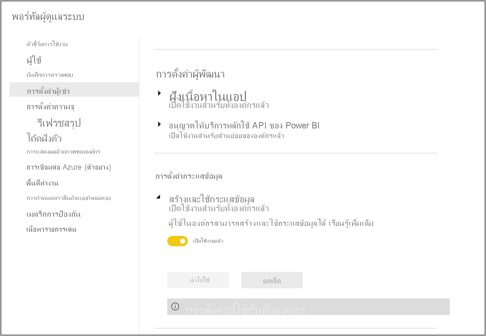
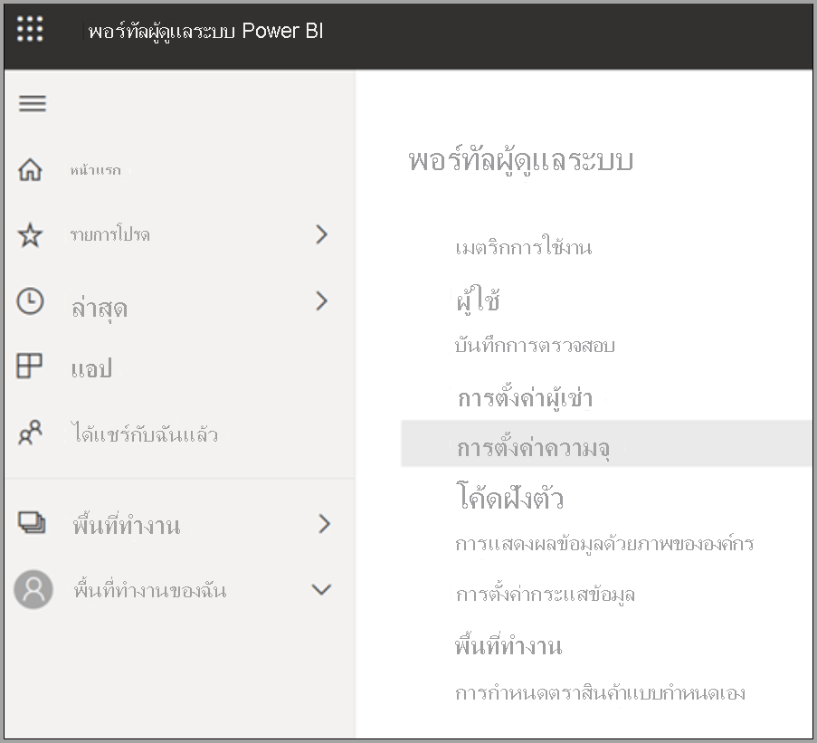
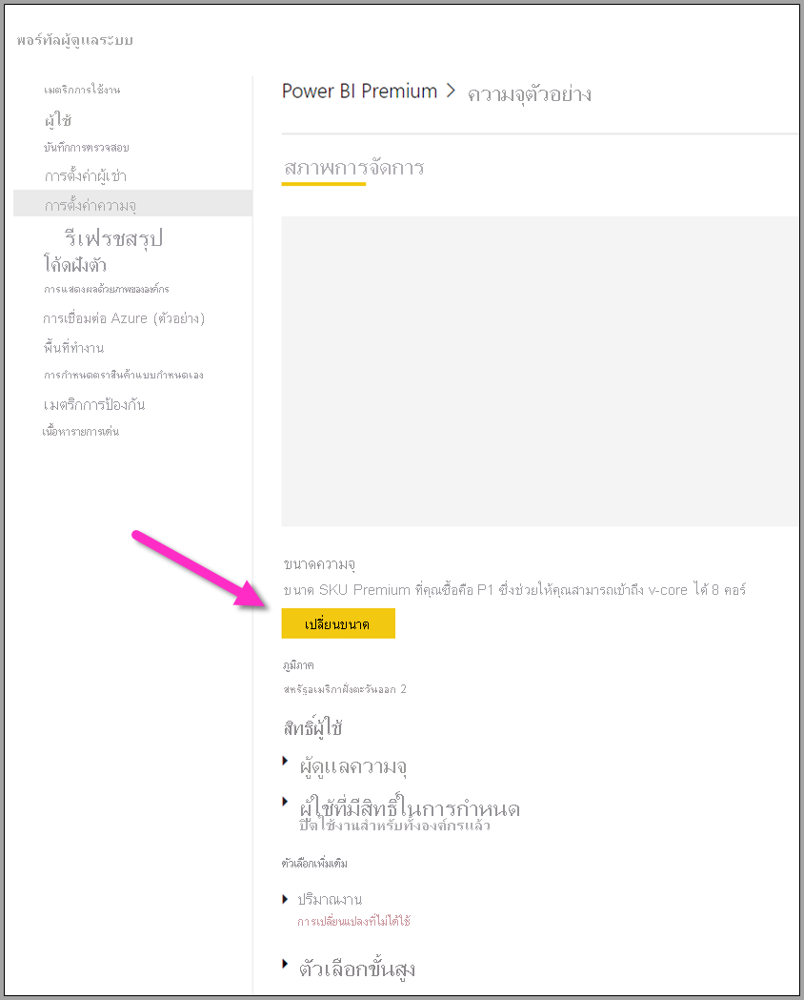

# กำหนดค่าปริมาณงานกระแสข้อมูลของ Power BI PremiumConfigure Power BI Premium dataflow workloads

คุณสามารถกำหนดปริมาณงานของกระแสข้อมูลในการสมัครใช้งาน Power BI Premium ได้You can create dataflow workloads in your Power BI Premium subscription. Power BI ใช้แนวคิดของ *ปริมาณงาน* เพื่ออธิบายเนื้อหาพรีเมียมPower BI uses the concept of *workloads* to describe Premium content. ปริมาณงานรวมถึง ชุดข้อมูล รายงานที่มีการแบ่งหน้า กระแสข้อมูลและ AIWorkloads include Datasets, Paginated Reports, Dataflows, and AI. ปริมาณงานของ *กระแสข้อมูล* ช่วยให้คุณใช้การเตรียมข้อมูลแบบบริการตนเองของกระแสข้อมูลเพื่อนำเข้า แปลง รวม และเพิ่มข้อมูลThe *dataflows* workload lets you use dataflows self-service data preparation to ingest, transform, integrate, and enrich data. กระแสข้อมูลของ Power BI Premium ถูกจัดการใน **พอร์ทัลผู้ดูแลระบบ**Power BI Premium dataflows are managed in the **Admin portal**.

ส่วนต่อไปนี้อธิบายวิธีการเปิดใช้งานกระแสข้อมูลในองค์กรของคุณ วิธีการปรับปรุงการตั้งค่าในความจุพรีเมียมของคุณและคำแนะนำสำหรับการใช้งานทั่วไปThe following sections describe how to enable dataflows in your organization, how to refine their settings in your Premium capacity, and guidance for common usage.

## เปิดใช้งานกระแสข้อมูลใน Power BI premiumEnabling dataflows in Power BI premium

ข้อกำหนดแรกสำหรับการใช้กระแสข้อมูลในการสมัครใช้งาน Power BI premium ของคุณคือเปิดการสร้างและการใช้กระแสข้อมูลสำหรับองค์กรของคุณThe first requirement for using dataflows in your Power BI premium subscription is to enable the creation and use of dataflows for your organization. ใน **พอร์ทัลผู้ดูแลระบบ** เลือก **การตั้งค่าผู้เช่า** และสลับแถบเลื่อนภายใต้ **การตั้งค่า กระแสข้อมูล** เพื่อ **เปิดใช้งาน** ดังที่แสดงในรูปต่อไปนี้In the **Admin portal**, select **Tenant Settings** and switch the slider under **Dataflow settings** to **Enabled**, as shown in the following image.

หลังจากเปิดใช้งานปริมาณงานกระแสข้อมูลจะมีการกำหนดค่าด้วยการตั้งค่าเริ่มต้นAfter enabling the Dataflows workload, it is configured with default settings. คุณอาจต้องการปรับแต่งการตั้งค่าเหล่านี้ตามที่คุณเห็นว่าเหมาะสมYou might want to tweak these settings as you see fit. ถัดไปเราจะอธิบายว่าการตั้งค่าเหล่านี้แสดงอยู่ที่ใดและจะช่วยให้คุณเข้าใจว่าเมื่อใดคุณอาจต้องการเปลี่ยนแปลงค่าเพื่อปรับปรุงประสิทธิภาพการทำงานของกระแสข้อมูลให้เหมาะสมNext, we'll describe where these settings live, describe each, and help you understand when you might want to change the values to optimize your dataflow performance.

## ปรับแต่งการตั้งค่ากระแสข้อมูลRefining dataflow settings

เมื่อเปิดใช้งานกระแสข้อมูลคุณสามารถใช้ **พอร์ทัลผู้ดูแลระบบ** เพื่อเปลี่ยนแปลงหรือปรับแต่งวิธีการสร้างกระแสข้อมูลและวิธีการใช้ทรัพยากรในการสมัครใช้งาน Power BI Premium ของคุณOnce dataflows are enabled, you can use the **Admin portal** to change, or refine, how dataflows are created and how they use resources in your Power BI Premium subscription. ขั้นตอนต่อไปนี้แสดงวิธีการปรับการตั้งค่ากระแสข้อมูลของคุณThe following steps show how to adjust your dataflow settings.

1. ใน **พอร์ทัลผู้ดูแลระบบ** เลือก **การตั้งค่าผู้เช่า** เพื่อแสดงรายการความจุทั้งหมดที่ถูกสร้างขึ้นIn the **Admin portal**, select **Tenant settings** to list all capacities that have been created. เลือกความจุเพื่อจัดการการตั้งค่านั้นSelect a capacity to manage its settings.

    

2. ความจุ Power BI Premium ของคุณสะท้อนให้เห็นถึงทรัพยากรที่พร้อมใช้งานสำหรับกระแสข้อมูลของคุณYour Power BI Premium capacity reflects the resources available for your dataflows. คุณสามารถเปลี่ยนขนาดความจุของคุณได้โดยการเลือกปุ่ม **เปลี่ยนขนาด** ดังที่แสดงในรูปต่อไปนี้You can change your capacity's size by selecting the **Change size** button, as shown in the following image.

    

3. ในการตั้งค่าความจุคุณสามารถกำหนดค่าการตั้งค่ากระแสข้อมูลได้โดยการขยาย **ปริมาณงาน**In Capacity settings, you can configure dataflow settings by expanding **Workloads**.

    

4. ในส่วน **ปริมาณงาน** เลื่อนไปยังบริเวณ **กระแสข้อมูล**In the **Workloads** section, scroll to the **Dataflows** area. รูปภาพต่อไปนี้แสดงการตั้งค่าที่คุณสามารถใช้เพื่อควบคุมหรือปรับแต่งพฤติกรรมของปริมาณงานกระแสข้อมูลสำหรับความจุของคุณThe following image shows the settings you can use to control or refine the dataflow workload's behavior for your capacity.

    

ตารางต่อไปนี้แสดงคำอธิบายพื้นฐานของการตั้งค่ากระแสข้อมูลThe following table provides a basic description of the dataflows settings.

| **ส่วนของผู้ดูแลระบบ****Admin section** | **การตั้งค่าชื่อ****Setting name** | **คำอธิบาย****Description** |
|---------|---------|---------|
| **ขนาดความจุ****Capacity Size** | **เปลี่ยนแปลงขนาด****Change Size** | ความจุที่เลือกใช้ในปัจจุบันจะแสดงอยู่ พร้อมด้วยตัวเลือกเพื่อเปลี่ยนความจุThe current selected capacity is listed, with options to change the capacity. การเปลี่ยนการตั้งค่านี้จะช่วยให้สามารถปรับขนาดเพิ่มหรือลดขนาดของความจุได้Changing this setting allows for scale up or scale down of the capacity. |
| **ปริมาณงาน****Workload** | **หน่วยความจำสูงสุด (%)****Max Memory (%)** | เปอร์เซ็นต์สูงสุดของหน่วยความจำที่พร้อมใช้งานซึ่งกระแสข้อมูลสามารถใช้ความจุนี้ได้The maximum percentage of available memory that dataflows can use in a capacity. |
| **ปริมาณงาน****Workload** | **เพิ่มประสิทธิภาพของเครื่องคำนวณกระแสข้อมูล****Enhanced Dataflows Compute Engine** | เปิดใช้งานตัวเลือกนี้เพื่อให้การคำนวณเอนทิตี่มีการคำนวณเร็วขึ้นถึง 20 เท่า เมื่อทำงานกับข้อมูลจำนวนมากEnable this option for up to 20x faster calculation of computed entities when working with large-scale data volumes.  **คุณต้องรีสตาร์ทความจุเพื่อเปิดใช้งานเครื่องใหม่****You must restart the capacity to activate the new engine.**  กรุณาดูข้อมูลเพิ่มเติมที่ [ปรับปรุงเครื่องคำนวณกระแสข้อมูลให้มีประสิทธิภาพมากขึ้น](../../admin/service-admin-premium-workloads.md#enhanced-dataflows-compute-engine)For more information, see [Enhanced dataflows compute engine](../../admin/service-admin-premium-workloads.md#enhanced-dataflows-compute-engine). |
| **ปริมาณงาน****Workload** | **ขนาดคอนเทนเนอร์****Container Size** | ขนาดสูงสุดของคอนเทนเนอร์ที่กระแสข้อมูลใช้สำหรับเอนทิตีแต่ละรายการในกระแสข้อมูลThe maximum size of the container that dataflows use for each entity in the dataflow. ค่าเริ่มต้นคือ 700 MBThe default value is 700 MB. กรุณาดูข้อมูลเพิ่มเติมที่ [ขนาดคอนเทนเนอร์](../../admin/service-admin-premium-workloads.md#container-size)For more information, see [Container size](../../admin/service-admin-premium-workloads.md#container-size). |
| **ปริมาณงาน****Workload** | **คำนวณหน่วยความจำเครื่อง (%)****Compute engine memory (%)** | เปอร์เซ็นต์สูงสุดของหน่วยความจำที่ปันส่วนไปยังเครื่องคำนวณThe maximum percentage of memory allocated to the compute engine. ค่าเริ่มต้นคือ 30%The default value is 30% |

ในส่วนต่อไปนี้เราจะไปยังรายละเอียดเกี่ยวกับการตั้งค่าแต่ละรายการและวิธีการส่งผลกระทบต่อปริมาณงานกระแสข้อมูลของคุณIn the following sections, we go into detail about each of the settings and how they affect your dataflow workload.

### การทำความเข้าใจตัวเลือกปริมาณงานกระแสข้อมูลUnderstanding dataflow workload options

วิธีง่าย ๆ ในการคิดเกี่ยวกับตัวเลือกปริมาณงานกระแสข้อมูลคือการใช้การเปรียบเทียบA simple way to think about dataflow workload options is to use an analogy. *ขนาดความจุ* หรือชนิดของอินสแตนซ์ Power BI Premium ที่คุณมีให้คิดว่าเป็น *ร้านอาหาร* ของคุณThe *Capacity size*, or the type of Power BI Premium Instance you have, can be thought of as your *restaurant*. ภายในร้านอาหารของคุณ จะมี *หน่วยความจำปริมาณงาน* ซึ่งก็คือ *ครัว* ของคุณWithin your restaurant, you have your *workload memory*, which is your *kitchen*. *เครื่องคำนวณข้อมูล* เป็น *เตาอบ* ของคุณThe *compute engine* is your *oven*. และสุดท้าย *คอนเทนเนอร์* คือการจัดเรียงของคุณภาพของ *พ่อครัว* ของคุณAnd lastly, the *container* is the sort of quality of your *chef*. ในการประเมินตัวเลือกปริมาณงานกระแสข้อมูลของคุณให้นึกภาพการเตรียมอาหารสำหรับอาหารค่ำขนาดใหญ่หรืออย่างมีนัยสำคัญมากTo evaluate your dataflow workload options, imagine preparing a meal for a large, or very significant dinner. คุณมีแขกที่สำคัญมากกำลังมาและคุณต้องมีอาหารค่ำพร้อมให้บริการโดยเวลาที่พวกเขามาถึงYou have important guests coming over and you must have dinner ready to be served by the time they arrive.

เราจะใช้การเปรียบเทียบร้านอาหารนี้ เพื่ออธิบายและให้คำแนะนำเกี่ยวกับการตั้งค่าแต่ละรายการWe'll use this restaurant analogy as we explain and provide guidance on each of the setting. เราจะเริ่มต้นที่ระดับบนสุด - ความจุพรีเมียมของคุณ - เนื่องจากนี่คือตัวเลือกแรกที่คุณทำเมื่อใช้ Power BI PremiumWe'll start at the top level - your Premium Capacity - as this is the first choice you make when using Power BI Premium.

#### ความจุพรีเมียม Sku - ขยายฮาร์ดแวร์Premium capacity SKUs - scale up the hardware

ปริมาณงาน Power BI Premium ใช้การผสมผสานแกนประมวลผลด้านหน้าและด้านหลังเพื่อให้บริการคิวรีอย่างรวดเร็วระหว่างปริมาณงานชนิดต่าง ๆPower BI Premium workloads use a combination of front-end and backend cores to serve fast queries across the various workload types. [โหนดความจุ](../../admin/service-premium-what-is.md#capacity-nodes) บทความรวมแผนภูมิที่แสดงข้อมูลจำเพาะปัจจุบันของแต่ละข้อเสนอปริมาณงานThe [capacity nodes](../../admin/service-premium-what-is.md#capacity-nodes) article includes a chart that illustrates the current specifications across each of the available workload offerings. ความจุ A3 และที่สูงกว่าจะสามารถใช้ประโยชน์จากเครื่องมือคำนวณ ดังนั้นเมื่อคุณต้องการใช้เครื่องคำนวณขั้นสูงให้เริ่มต้นที่ – [โหนดความจุ](../../admin/service-premium-what-is.md#capacity-nodes)Capacities of A3 and greater can take advantage of the compute engine, so when you want to use the enhanced compute engine, start there – [Capacity nodes](../../admin/service-premium-what-is.md#capacity-nodes). 

ในการเปรียบเทียบกับร้านอาหารของเรา การเลือกความจุเหมือนกับการเลือกร้านอาหารที่มีคุณภาพสูงIn our restaurant analogy, choosing a capacity is like choosing a higher-quality restaurant. แม้ว่าค่าใช้จ่ายสูงกว่าคุณสามารถคาดหวังประสิทธิภาพการทำงานที่สูงขึ้นเนื่องจากการเพิ่มขึ้นในแกนประมวลผลด้านหน้าแกนประมวลผลด้านหลังและหน่วยความจำเพิ่มเติมThough a higher cost, you can expect a higher level of performance due to the increase in front-end cores, backend cores, and more memory. เมื่อคุณไปสู่ร้านอาหารที่ใหญ่กว่าเดิม คุณจะได้รับห้องครัวที่ใหญ่กว่าและพ่อครัวที่ดีกว่าซึ่งจะเหมือนกับการปรับรุ่นเป็น SKU ที่สูงขึ้นใน Power BI Premium ช่วยให้คุณได้รับประโยชน์จากการเพิ่มความเร็ว CPU เพิ่มหน่วยความจำต่อการดำเนินการและการเพิ่มความขนานกันมากขึ้นWhen you go to a bigger restaurant, you get a bigger kitchen, and better chefs, which are akin to upgrading to a higher SKU in Power BI Premium, giving you the benefit of increasing CPU speed, increasing memory per operation and adding more parallelism.

#### หน่วยความจำสูงสุด - ทุ่มเทความจุสำหรับกระแสข้อมูลMax memory - dedicating a capacity for dataflows 

การตั้งค่า **หน่วยความจำสูงสุด %** เป็นเปอร์เซ็นต์ของหน่วยความจำจากหน่วยความจำกายภาพที่พร้อมใช้งานสำหรับความจุพรีเมียมที่ให้ไว้สำหรับปริมาณงานกระแสข้อมูลThe **Max Memory %** setting is the percentage of memory, out of the physical memory available to the Premium capacity, provided for dataflows workloads. คุณสามารถทุ่มเทให้กับความจุทั้งหมดได้อย่างมีประสิทธิภาพสำหรับปริมาณงานกระแสข้อมูลและความจุจะปรับขนาดแบบไดนามิกตามที่จำเป็นสำหรับการจัดสรรที่คุณตั้งค่าไว้You can effectively dedicate up to the full capacity for a dataflows workload, and the capacity will scale up dynamically as needed to the allocation you set. ในการเปรียบเทียบของเราถ้าคุณทำให้ครัวของคุณใหญกว่าเดิม คุณสามารถปรุงอาหารได้มากขึ้น - เช่นเดียวกับที่คุณสามารถเพิ่มขนาดปริมาณงานของความจุสำหรับกระแสข้อมูลและให้กระแสข้อมูลได้มากขึ้นIn our analogy, if you make your kitchen bigger you can cook more meals – similarly, you can increase your capacity's workload size for dataflows and allow more dataflows. ในขณะที่มีการกำกับดูแลทรัพยากรแบบไดนามิกในสถานที่่ตัวเลือกการกำหนดค่า *หน่วยความจำสูงสุด %* ช่วยให้คุณสามารถทุ่มเท 100% ของหน่วยความจำสำหรับปริมาณงานกระแสข้อมูลWhile there is dynamic resource governance in place, the *Max Memory %* configuration option lets you dedicate 100% of the memory for the dataflows workload. สิ่งนี้ใช้สำหรับสถานการณ์ที่หายากเมื่อคุณต้องการตรวจสอบให้แน่ใจว่าหน่วยความจำของความจุสามารถใช้ได้สำหรับปริมาณงานกระแสข้อมูลของคุณแทนที่จะพึ่งพาการกำกับดูแลทรัพยากรThis is for the rare situation when you want to ensure the capacity's memory is available for your dataflow workload, rather than relying on the Resource Governance. ด้วยการเปรียบเทียบ นี่จะเหมือนกับการตรวจสอบให้แน่ใจว่าห้องครัวของคุณมุ่งเน้นไปที่การเตรียมอาหารที่เฉพาะเจาะจงสำหรับแขก โดยทุ่มเทครัวเต็มรูปแบบไปยังงานนั้นUsing our analogy, this would be like making sure your kitchen is focusing on preparing a specific meal for a guest, dedicating the full kitchen to the task(s). แน่นอน ความสามารถในการทุ่มเทที่มากขึ้นไม่ได้หมายถึงอาหารที่ดีขึ้นหรือเวลาที่เร็วขึ้นไปยังตาราง – ในส่วนถัดไปจะอธิบายOf course, the ability to dedicate more doesn't mean better food, or faster time to table – as the next section explains.

#### ขนาดคอนเทนเนอร์ - รีเฟรชหรือปัญหาหน่วยความจำไม่เพียงพอContainer size - refresh or out of memory issues

ถัดไป เราลองพูดคุยเกี่ยวกับการตั้งค่า **ขนาดของคอนเทนเนอร์ (Mb)**Next let's discuss the **Container Size (Mb)** setting. ภายใน กระแสข้อมูลใช้กระบวนการที่เรียกว่า *แมชอัปคอนเทนเนอร์* เพื่อประเมินกระบวนการ ETL ของคุณInternally, dataflows use a process called *mashup containers* to evaluate your ETL processes. กลไกจัดการแยกตรรกะคิวรีของคุณลงในคอนเทนเนอร์เหล่านี้และสามารถดำเนินการควบคู่กันได้The engine splits your query logic into these containers and they can process in parallel. จำนวนของคอนเทนเนอร์ทำให้ประมวลผลพร้อมกันอย่างมีประสิทธิภาพและเพิ่มประสิทธิภาพการทำงานได้The number of containers effectively provides concurrent processing and increases performance. คอนเทนเนอร์เหล่านี้จะถูกจำกัดโดย **ความจุ** เป็นลำดับแรก การตั้งค่า **หน่วยความจำสูงสุด %** เป็นลำดับสอง จากนั้นจำนวนหน่วยความจำที่คุณจัดสรรโดยเฉพาะในการตั้งค่าคอนเทนเนอร์ซึ่งเป็นค่าเริ่มต้นคือ 700MbThese containers are constrained by the **Capacity** first, the **Max Memory %** setting second, and then the amount of memory you specifically allocate to them in the container setting, which by default is 700Mb. ดังนั้นจึงเป็นไปได้ที่จะเพิ่มปริมาณของหน่วยความจำฮาร์ดแวร์และเพิ่มขนาดคอนเทนเนอร์ แต่การทำเช่นนั้นจะลดการดำเนินการแบบขนานในขณะทีเพิ่มหน่วยความจำมากขึ้นสำหรับกระบวนการ ETL เฉพาะภายในคอนเทนเนอร์ของคุณSo it's possible to increase the amount of hardware memory, and increase the container size, but doing so will decrease the parallel operations while dedicating more memory for specific ETL process within your containers. จำนวนของคอนเทนเนอร์ได้รับการปรับให้เหมาะสมที่สุดสามเท่าของจำนวนแกนประมวลผลด้านหลังซึ่งเป็นสิ่งสำคัญเนื่องจากคุณไม่สามารถทำให้คอนเทนเนอร์มีขนาดเล็กมากและมีคอนเทนเนอร์ขนานมากเกินกว่าจุดนั้นThe number of containers is capped at three times the number of backend cores, which is important because you can't make the container very small, and have a lot of parallel containers beyond that point. ขนาดต่ำสุดที่คุณสามารถทำคอนเทนเนอร์คือ 200MbThe minimum size you can make a container is 200Mb. ขนาดคอนเทนเนอร์ยังคลุมไปยังระดับคิวรีซึ่งหมายความว่าแต่ละคิวรีได้รับการดำเนินการในคอนเทนเนอร์ของตนเองยกเว้นเมื่อคิวรีจะอ้างอิงคิวรีอื่น ๆ ในกรณีที่มีการรีเฟรชเป็นส่วนหนึ่งของคอนเทนเนอร์เดียวกันThe container size is also scoped to a query level, which means each query gets executed in its own container except when queries are referencing other queries, in which case they are refreshed as part of the same container.

ย้อนกลับไปยังการเปรียบเทียบของเรา การมีจำนวนพ่อครัวที่น้อยลงแต่มุ่งเน้นมากขึ้นในครัวช่วยให้คุณสามารถปรุงอาหารได้รวดเร็วขึ้นอยู่กับชนิดของคำสั่งอาหารที่วางไว้และความซับซ้อนของอาหารGoing back to our analogy, having fewer but more focused cooks in the kitchen enables you to cook a meal much faster, depending on the types of orders that are placed and the complexity of the meal. สิ่งที่ต้องแลกเปลี่ยนในที่นี้คือการมีพ่อครัวน้อยลงแต่มีเวลาที่มุ่งเน้นมากขึ้นสำหรับการเตรียมการThe tradeoff here is having fewer chefs, but more focused time for preparation. ในทำนองเดียวกันการเพิ่มหน่วยวัดขนาดคอนเทนเนอร์ไปที่ 1200-1500 MB สามารถหมายถึงจำนวนงาน ETL ที่น้อยลงแต่ซับซ้อนมากขึ้น – กิจกรรมเช่นการรวม การสร้าง ไพวอท การจัดการแถวหรือคอลัมน์ - สามารถมองเห็นการเพิ่มประสิทธิภาพในขณะที่เรามีหน่วยความจำเพิ่มเติมสำหรับแต่ละคอนเทนเนอร์ แต่ในการดำเนินการดังกล่าวลดจำนวนคอนเทนเนอร์ลงSimilarly, increasing the container size measure to 1200-1500 MB can mean that a smaller number of more complex ETL jobs – activities such as aggregations, joins, pivots, row or column manipulations - can see a performance increase as we provide more memory for each container, but in doing so, reduce the number of containers. เช่นเดียวกับการเปรียบเทียบบ่งบอกว่าคำสั่งอาหารจำนวนมากเกินไปสามารถลดความเร็วในการออกผลผลิตจากห้องครัว ซึ่งเป็นวิธีที่คุณสามารถคิดเกี่ยวกับขนาดคอนเทนเนอร์ – ใช้สิ่งนี้เมื่อคุณจำเป็นต้องมีการดำเนินการเอนทิตีที่ซับซ้อนเพื่อให้เสร็จสมบูรณ์และคุณยินดีที่จะแลกเปลี่ยนแบบขนานเพื่อประสิทธิภาพการทำงานเนื่องจากการเพิ่มทรัพยากรนี้แบ่งหน่วยความจำที่จัดสรรให้คอนเทนเนอร์น้อยลงJust as the analogy implies, too many orders can actually slow down the kitchen output, which is how you can think about container size – use this when you need complex entity operations to complete, and you're willing to trade parallelism for performance, since increasing this resource divides the memory allocated to fewer containers.

โดยสรุป คุณต้องการปรับขนาดคอนเทนเนอร์ของคุณให้เหมาะสมตามคิวรีที่ใช้To summarize, you want to optimize your container size based on the queries being used. ตัวอย่างเช่น เพียงแค่โหลดข้อมูลจากแหล่งที่มาลงในเอนทิตี โดยไม่จำเป็นต้องดึงข้อมูลและดำเนินการใด ๆ เพียงแค่โหลดข้อมูลไปยังที่เก็บข้อมูลเท่านั้นFor example, simply loading data from a source into an entity does not need to pull in data and perform any operations and just loads the data to storage. คุณต้องการความขนานมากที่สุดเท่าที่เป็นไปได้สำหรับสถานการณ์น ี้ตามที่คุณต้องการเพิ่มความเร็วในการโหลดและการรีเฟรชYou want as much parallelism as possible for this situation, as you want to increase the speed of the load and refresh operations. ตรงกันข้ามเมื่อคุณเพิ่มการดำเนินการแปลงเพิ่มเติม – ตัวกรองที่ซับซ้อน การรวม การรวมหน่วยความจำอาจสูงกว่าที่เราอาจจำเป็นต้องดำเนินการบางอย่างของการดำเนินการแปลงเหล่านี้ในหน่วยความจำConversely, when you add more transformation operations – complex filters, joins, aggregations, the memory may be much higher as we may need to process some of these transformation operations in memory. โปรดระวังว่าถ้าคุณมีการดำเนินการกระแสข้อมูลอื่น ๆ ที่ทำงานอยู่บนความจุนั้น การดำเนินการเหล่านั้นจะช้าลงและบังคับให้เข้าคิวเพื่อให้มีสล็อตการดำเนินการBe aware that if you have other dataflow operations running on the capacity, it can slow those operations and force them to queue up to have an execution slot. ในการสิ้นสุดการตรวจสอบและการจัดการของกระแสข้อมูล การรีเฟรชประสิทธิภาพการทำงานและความจุทั้งหมดได้รับการช่วยเหลือจากเมตริกความจุของแอป **Power BI Premium**To this end, monitoring and management of dataflows, refresh performance, and the entire capacity is aided by the **Power BI Premium Capacity Metrics** app. คุณสามารถใช้แอป[เมตริกความจุ Power BI Premium](../../admin/service-premium-capacity-optimize.md#what-content-is-using-up-my-capacity)เพื่อกรองตามความจุ และตรวจสอบเมตริกประสิทธิภาพการทำงานสำหรับเนื้อหาของพื้นที่ทำงานได้You can use the [Power BI Premium Capacity Metrics](../../admin/service-premium-capacity-optimize.md#what-content-is-using-up-my-capacity) app to filter by capacity, and review performance metrics for workspace content. คุณสามารถตรวจสอบเมตริกประสิทธิภาพการทำงานและการใช้งานทรัพยากรเป็นชั่วโมงในช่วงเจ็ดวันที่ผ่านมาสำหรับเนื้อหาทั้งหมดที่จัดเก็บไว้ภายในความจุแบบพรีเมียม - เพื่อตรวจสอบประสิทธิภาพการทำงานของกระแสข้อมูล จึงขอแนะนำให้เริ่มต้นด้วยแอปIt's possible to review the performance metrics and resource usage by hour, for the past seven days, for all content stored within a Premium capacity – so for investigating dataflow performance, it's recommended to start with the app.

#### เพิ่มกลไกการคำนวณ - โอกาสในการปรับปรุงประสิทธิภาพการทำงานEnhanced compute engine - an opportunity to improve performance

ในการเปรียบเทียบของเรา [กลไกการคำนวณขั้นสูง](dataflows-premium-features.md#the-enhanced-compute-engine) เหมือนกับเตาอบIn our analogy, the [enhanced compute engine](dataflows-premium-features.md#the-enhanced-compute-engine) is like an oven. Power BI ใช้เครื่องมือคำนวณเพื่อประมวลผลคิวรีและการรีเฟรชของคุณPower BI uses a compute engine to process your queries and refresh operations. กลไกการคำนวณขั้นสูงคือการพัฒนากลไกมาตรฐานและทำงานโดยการโหลดข้อมูลไปยังแคช SQL และใช้ SQL เพื่อเร่งการแปลงเอนทิตี การดำเนินการรีเฟรชและเปิดใช้งานการเชื่อมต่อ DirectQueryThe enhanced compute engine is an improvement over the standard engine, and works by loading data to a SQL Cache and uses SQL to accelerate entity transformation, refresh operations and enables DirectQuery connectivity. ถ้าเราเปรียบเทียบกลไกกับเตาอบ ขณะที่คุณใช้ประโยชน์จากเตาอบขั้นสูงคุณอาจสามารถปรุงอาหารได้รวดเร็วและมีประสิทธิภาพมากขึ้นIf we compare the engines to ovens, as you leverage the enhanced oven, you may be able to cook meals faster and more effectively. เมื่อกำหนดค่าให้ **เปิด** หรือ **ปรับให้เหมาะสม** สำหรับเอนทิตีที่มีการคำนวณถ้าตรรกะทางธุรกิจของคุณอนุญาตให้ Power BI ใช้ SQL เร่งประสิทธิภาพการทำงานWhen configured to **On** or **Optimized** for computed entities, if your business logic allows for it, Power BI uses SQL speed up the performance. กลไกยังมีการ **เปิด** สำหรับการเชื่อมต่อ DirectQueryHaving the engine **On** also provides for DirectQuery connectivity. อาจเปรียบเทียบได้กับ – อาหารบางอย่างอาจไม่จำเป็นต้องมีเตาอบหรือใช้ประโยชน์จากเตาอบAs the analogy suggests – certain meals might not need an oven, nor take advantage of the oven. กลไกการคำนวณขั้นสูงสามารถคิดได้ในลักษณะที่คล้ายกัน – ตรวจสอบให้แน่ใจว่าการใช้งานกระแสข้อมูลของคุณเป็นไปตามกลไกการคำนวณที่ได้รับการปรับปรุงอย่างถูกต้องThe enhanced compute engine can be thought of in a similar manner – make sure your dataflow usage is leveraging the enhanced compute engine properly.

> [!NOTE]
> กลไกการคำนวณขั้นสูงยังไม่พร้อมใช้งานในทุกภูมิภาคThe enhanced compute engine is not yet available in all regions.

## คำแนะนำสำหรับสถานการณ์ทั่วไปGuidance for common scenarios

ส่วนนี้จะให้คำแนะนำสำหรับสถานการณ์ทั่วไปเมื่อใช้ปริมาณงานกระแสข้อมูลด้วย Power BI PremiumThis section provides guidance for common scenarios when using dataflow workloads with Power BI Premium.

### เวลารีเฟรชช้าSlow refresh times

เวลาการรีเฟรชช้ามักจะเป็นปัญหาแบบขนานSlow refresh times are usually a parallelism issue. คุณควรตรวจทานตัวเลือกดังต่อไปนี้ตามลำดับ:You should review the following options, in order:

1. แนวคิดหลักสำหรับเวลาการรีเฟรชช้าคือลักษณะของการเตรียมข้อมูลของคุณA key concept for slow refresh times is the nature of your data preparation. ในการเปรียบเทียบกับร้านอาหารของเราซึ่งมีการอธิบายไว้ในบทความก่อนหน้านี้ ลองนึกภาพอาหารที่เตรียมไว้แล้วรอให้ใช้งานIn our restaurant analogy explained earlier in this article, imagine having prepared food already, waiting to be used. ในสถานการณ์นี้อาหารสามารถปรุงได้เร็วขึ้นเนื่องจากเวลาการเตรียมงานน้อยที่สุดIn this scenario, the food can be cooked much faster due to minimal prep time. ในทำนองเดียวกันเมื่อใดก็ตามที่คุณสามารถปรับเวลาการรีเฟรชช้าของคุณโดยการใช้ประโยชน์จากแหล่งข้อมูลของคุณ เพื่อเตรียมการและการดำเนินการตรรกะคิวรีล่วงหน้าคุณควรทำเช่นนั้นSimilarly, whenever you can optimize your slow refresh times by taking advantage of your data source actually doing the preparation and performing upfront query logic, you should do s. โดยเฉพาะเมื่อใช้ฐานข้อมูลเชิงสัมพันธ์เช่น SQL เป็นแหล่งข้อมูลของคุณควรดูว่าสามารถเรียกใช้คิวรีเริ่มต้นบนแหล่งข้อมูลและใช้คิวรีต้นทางดังกล่าวสำหรับการแยกกระแสข้อมูลสำหรับแหล่งข้อมูลได้หรือไม่Specifically, when using a relational database such as SQL as your source, see if the initial query can be run on the source, and use that source query for your initial extraction dataflow for the data source. ถ้าคุณไม่สามารถใช้คิวรีดั้งเดิมในระบบต้นทางให้ดำเนินการที่เครื่องมือ [กระแสข้อมูลสามารถพับไปยังแหล่งข้อมูล](/power-query/power-query-folding)ได้If you cannot use a native query in the source system, perform operations that the dataflows [engine can fold to the data source](/power-query/power-query-folding).

2. ประเมินการเผยแพร่เวลารีเฟรชในความจุเดียวกันEvaluate spreading out refresh times on the same capacity. การดำเนินการรีเฟรชคือกระบวนการที่จำเป็นต้องมีการคำนวณที่สำคัญRefresh operations are a process that requires significant compute. เมื่อใช้การเปรียบเทียบร้านอาหารของเรา การขยายเวลาการรีเฟรชจะเหมือนกับการจำกัดจำนวนแขกในร้านอาหารของคุณUsing our restaurant analogy, spreading out refresh times is akin to limiting the number of guests in your restaurant. เช่นเดียวกับที่ร้านอาหารจะกำหนดตารางเวลาของแขกและวางแผนสำหรับความจุ คุณยังต้องการพิจารณาการดำเนินการรีเฟรชในช่วงเวลาที่การใช้งานไม่ได้อยู่ในจุดสูงสุดทั้งหมดJust as restaurants will schedule guests and plan for capacity, you also want to consider refresh operations during times when usage is not at its full peak. ซึ่งสามารถใช้วิธีนี้บรรเทาไม่ให้ความจุทำงานหนักเกินไปได้อย่างยาวนานThis can go a long way toward alleviating strain on the capacity.

3. เพิ่มจำนวนหน่วยความจำโดยรวมที่มอบให้กับปริมาณงานIncrease the overall amount of memory given to the workload. ลองนึกถึงขนาดของห้องครัวThink of this as the size of kitchen. การปรับแต่งทรัพยากรนี้จะคล้ายกับการปรับจำนวนพ่อครัวที่คุณสามารถใส่ไว้ในครัวได้Refining this resource is similar to adjusting how many chefs can you fit in the kitchen. การดำเนินการนี้จะทำได้โดยการปรับการตั้งค่า **หน่วยความจำสูงสุด %** และเพิ่มสูงสุดถึง 100%This is done by adjusting the **Max Memory %** setting, and increasing it up to 100%.

4. ลดจำนวนหน่วยความจำลงในคอนเทนเนอร์ซึ่งช่วยให้สามารถใช้คอนเทนเนอร์ได้มากขึ้นDecrease the amount of memory to the container, which allows for more containers. คุณสามารถคิดแบบนี้: แทนที่จะจ้างพ่อครัวที่มีชื่อเสียงเช่นกอร์ดอน แรมซีย์ ให้จ้างพ่อครัวที่มีความสามารถหลายคนแต่จ่ายน้อยกว่าYou can think of this as: instead of hiring a famously capable chef like Gordon Ramsey, hire many competent but less expensive chefs. ดังนั้นคุณจึงมีพ่อครัวมากขึ้นในครัวแต่พ่อครัวเหล่านั้นสามารถทำงานที่มีขนาดเล็กได้เท่านั้นSo you have more cooks in the kitchen, but those chefs can only perform smaller tasks. จากนั้นคุณมีคอนเทนเนอร์มากขึ้นแต่หน่วยความจำน้อยลงThen you have more containers, but less memory.

5. ทำตามขั้นตอนก่อนหน้านี้เพื่อให้ได้ระดับความขนานสูงขึ้นเนื่องจากคุณได้รับพ่อครัวมากขึ้นและครัวใหญ่ขึ้นDo both of the previous steps, allowing for an even higher degree of parallelism, because you get more cooks and a bigger kitchen.
    
6. ถ้าขั้นตอนในส่วนนี้ไม่มีระดับความขนานที่ต้องการให้พิจารณาการปรับรุ่นความจุของคุณเป็น SKU ที่สูงขึ้นIf the steps in this section don't provide the desired degree of parallelism, consider upgrading your capacity to a higher SKU. จากนั้นทำตามขั้นตอนก่อนหน้าในส่วนนี้อีกครั้งThen follow steps the previous steps in this section again.

### ข้อยกเว้นหน่วยความจำไม่เพียงพอOut of memory exceptions

เมื่อคุณพบ **ข้อยกเว้นหน่วยความจำไม่เพียงพอ** คุณจำเป็นต้องเพิ่มประสิทธิภาพการทำงานของคอนเทนเนอร์และหน่วยความจำWhen you experience **out of memory exceptions**, you need to increase performance of the containers and memory. ทำตามขั้นตอนต่อไปนี้:Take the following steps.

1. เพิ่มหน่วยความจำบนคอนเทนเนอร์Increase memory on the container. ซึ่งคล้ายกับการมีพ่อครัวหนึ่งดาวกับพ่อครัวหลายคนดังที่อธิบายไว้ในส่วนก่อนหน้านี้This is similar to having one star chef versus many chefs, as described in the previous section.

2. เพิ่มหน่วยความจำไปยังปริมาณงานและหน่วยความจำเพิ่มเติมไปยังคอนเทนเนอร์Increase memory to workload and more memory to container. ในการเปรียบเทียบของเราคือการสร้างห้องครัวขนาดใหญ่และมีพ่อครัวคุณภาพสูงIn our analogy, it creates a bigger kitchen and higher-quality chefs.

3. ถ้าการเปลี่ยนแปลงเหล่านี้ไม่ทำให้ได้ระดับความขนานที่คุณต้องการให้พิจารณา Power BI Premium SKU ที่สูงขั้นIf these changes don't give you the desired degree of parallelism, consider a higher Power BI Premium SKU.

### การใช้เครื่องคำนวณเพื่อปรับปรุงประสิทธิภาพการทำงานUsing the compute engine to improve performance

ทำตามขั้นตอนต่อไปนี้เพื่อเปิดใช้งานทริกเกอร์เครื่องคำนวณและปรับปรุงประสิทธิภาพการทำงานเสมอ:Take the following steps to enable workloads trigger the compute engine, and always improve performance:

**สำหรับเอนทิตีที่มีการคำนวณและเชื่อมโยงในพื้นที่ทำงานเดียวกัน:****For computed and linked entities in the same workspace:**

1. สำหรับ *การนำเข้า* มุ่งเน้นไปที่การรับข้อมูลลงในที่เก็บได้อย่างรวดเร็วที่สุดเท่าที่เป็นไปได้โดยใช้ตัวกรองเฉพาะเมื่อพวกเขาลดขนาดชุดข้อมูลโดยรวมFor *ingestion* focus on getting the data into the storage as fast as possible, using filters only if they reduce the overall dataset size. ซึ่งเป็นแนวทางปฏิบัติที่ดีที่สุดในการเก็บตรรกะการแปลงของคุณแยกต่างหากจากขั้นตอนนี้และอนุญาตให้เครื่องมือรวบรวมส่วนประกอบเริ่มต้นIt's best practice to keep your transformation logic separate from this step, and allow the engine to focus on the initial gathering of ingredients. ถัดไปแยกการแปลงและตรรกะทางธุรกิจของคุณลงในกระแสข้อมูลที่แยกต่างหากในพื้นที่ทำงานเดียวกันโดยใช้เอนทิตีที่เชื่อมโยงหรือคำนวณ การดำเนินการดังกล่าวจะช่วยให้กลไกจัดการเปิดใช้งานและเร่งความเร็วคำนวณของคุณNext, separate your transformation and business logic into a separate dataflow in the same workspace, using linked or computed entities; doing so allows for the engine to activate and accelerate your computations. ในการเปรียบเทียบของเรา เช่นเดียวกับการเตรียมอาหารในครัว: การเตรียมอาหารมักจะเป็นขั้นตอนที่แยกต่างหากและแตกต่างจากการรวบรวมวัตถุดิบของคุณและจำเป็นต้องมีก่อนการใส่อาหารในเตาอบIn our analogy, it's like food preparation in the kitchen: food preparation is typically a separate and distinct step from gathering your raw ingredients, and a pre-requisite for putting the food in the oven. ในทำนองเดียวกันตรรกะของคุณจำเป็นต้องได้รับการเตรียมแยกต่างหากก่อนจึงจะสามารถใช้ประโยชน์จากเครื่องคำนวณได้Similarly, your logic needs to be prepared separately before it can take advantage of the compute engine.

2. ตรวจสอบให้แน่ใจว่าคุณทำการดำเนินการที่พับรวม เช่น ผสาน รวม แปลง และ [อื่น ๆ](/power-query/power-query-folding#transformations-that-can-achieve-folding)Ensure you perform the operations that fold, such as merges, joins, conversion, and [others](/power-query/power-query-folding#transformations-that-can-achieve-folding).

3. การสร้างกระแสข้อมูล [ภายในแนวทางที่เผยแพร่และข้อจำกัด](dataflows-features-limitations.md#dataflows-in-premium)Building dataflows [within published guidelines and limitations](dataflows-features-limitations.md#dataflows-in-premium).

คุณยังสามารถใช้ DirectQuery ได้You can also use DirectQuery.

### เครื่องคำนวณเปิดใช้อยู่แต่ประสิทธิภาพการทำงานช้าลงCompute engine is on but performance is slow

ทำตามขั้นตอนต่อไปนี้เมื่อตรวจสอบสถานการณ์ทีเครื่องคำนวณเปิดอยู่แต่คุณพบว่าประสิทธิภาพการทำงานช้าลง:Take the following steps when investigating scenarios where the Compute engine is on, but you're seeing slower performance:

1. จำกัดการคำนวณและเอนทิตีที่เชื่อมโยงที่ข้ามพื้นที่ทำงานอยู่Limit computed and linked entities that exist cross workspace.

2. ถ้าการรีเฟรชเริ่มต้นเปิดใช้เครื่องคำนวณแล้วจากนั้นข้อมูลจะได้รับการเขียนในเลคและในแคชIf your initial refresh with the compute engine turned on, then data gets written in the lake and in the cache. การเขียนสองชั้นนี้หมายความว่าการรีเฟรชเหล่านี้จะทำงานช้าลงThis double write means these refreshes will be slower.

3. ถ้าคุณมีการเชื่อมโยงกระแสข้อมูลไปยังกระแสข้อมูลหลายแห่ง ตรวจสอบให้แน่ใจว่าคุณกำหนดตารางเวลาการรีเฟรชกระแสข้อมูลของแหล่งข้อมูลเพื่อให้ไม่ทำงานในเวลาเดียวกันทั้งหมดIf you have a dataflow linking to multiple dataflows, make sure you schedule refreshes of the source dataflows so that they do not all refresh at the same time.

## ขั้นตอนถัดไปNext steps
บทความต่อไปนี้ให้ข้อมูลเพิ่มเติมเกี่ยวกับกระแสข้อมูลและ Power BI:The following articles provide more information about dataflows and Power BI:

* [ข้อมูลเบื้องต้นเกี่ยวกับกระแสข้อมูลและการเตรียมข้อมูลด้วยตนเองIntroduction to dataflows and self-service data prep](dataflows-introduction-self-service.md)
* [การสร้างกระแสข้อมูลCreating a dataflow](dataflows-create.md)
* [กำหนดค่าและใช้กระแสข้อมูลConfigure and consume a dataflow](dataflows-configure-consume.md)
* [การกำหนดค่าที่จัดเก็บกระแสข้อมูลเพื่อใช้ Azure Data Lake Gen 2Configuring Dataflow storage to use Azure Data Lake Gen 2](dataflows-azure-data-lake-storage-integration.md)
* [AI กับกระแสข้อมูลAI with dataflows](dataflows-machine-learning-integration.md)
* [ข้อจำกัดและข้อควรพิจารณาของกระแสข้อมูลDataflows limitations and considerations](dataflows-features-limitations.md)