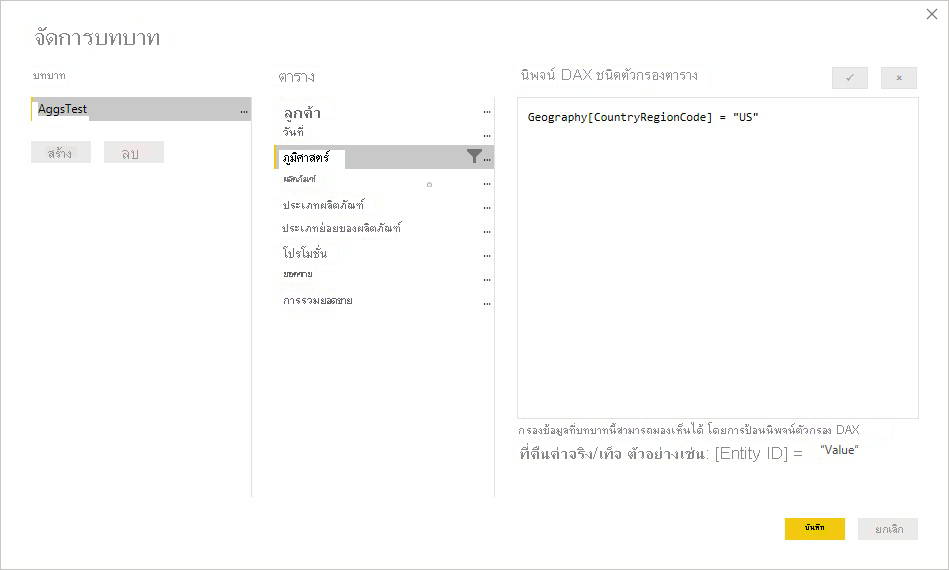
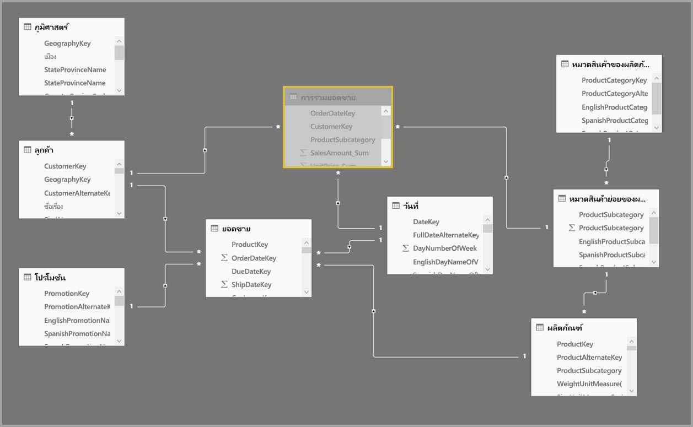
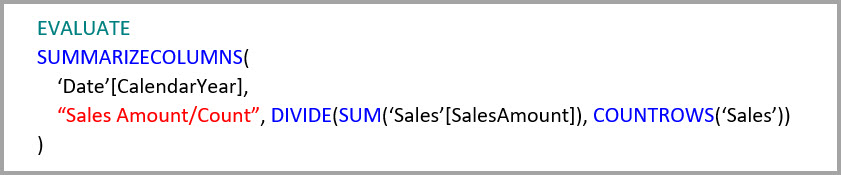
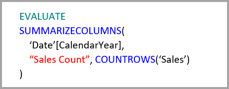
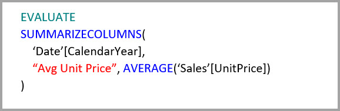
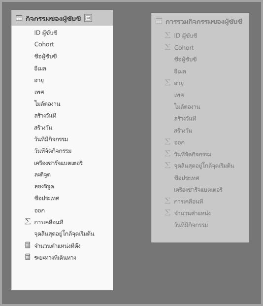
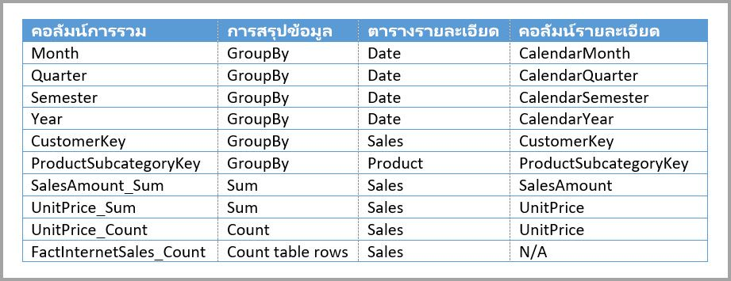
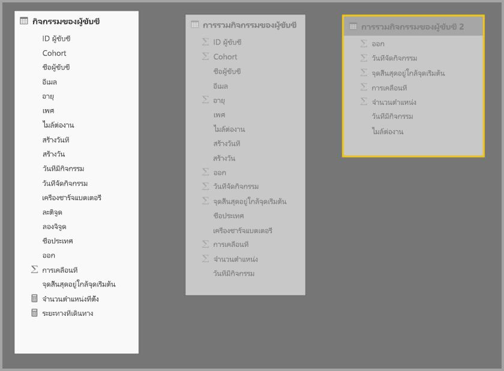

# ใช้การรวมข้อมูลใน Power BI DesktopUse aggregations in Power BI Desktop

*การรวมข้อมูล* ใน Power BI ช่วยคุณลดขนาดตารางเพื่อให้คุณสามารถเน้นข้อมูลที่สำคัญและปรับปรุงประสิทธิภาพของคิวรีได้*Aggregations* in Power BI let you reduce table sizes so you can focus on important data and improve query performance. การรวมข้อมูลเปิดใช้งานการวิเคราะห์แบบโต้ตอบกับข้อมูลขนาดใหญ่ในรูปแบบที่วิธีการอื่นไม่สามารถทำได้ และสามารถลดค่าใช้จ่ายในการปลดล็อกชุดข้อมูลขนาดใหญ่สำหรับการตัดสินใจได้อย่างมากAggregations enable interactive analysis over big data in ways that aren't possible otherwise, and can dramatically reduce the cost of unlocking large datasets for decision making.

ประโยชน์บางอย่างของการใช้การรวมข้อมูล ได้แก่:Some advantages of using aggregations include:

- **ประสิทธิภาพของคิวรีกับข้อมูลขนาดใหญ่ดียิ่งขึ้น****Better query performance over big data**. ทุกการโต้ตอบกับวิชวล Power BI จะส่งคิวรี DAX ไปยังชุดข้อมูลEvery interaction with Power BI visuals submits DAX queries to the dataset. ข้อมูลรวมที่เก็บไว้ในแคชใช้ทรัพยากรเพียงส่วนน้อย ซึ่งจำเป็นสำหรับข้อมูลรายละเอียดเพื่อให้คุณสามารถปลดล็อกข้อมูลขนาดใหญ่ที่จะไม่สามารถเข้าถึงได้Cached aggregated data uses a fraction of the resources required for detail data, so you can unlock big data that would otherwise be inaccessible.
- **การรีเฟรชข้อมูลที่เหมาะสม****Optimized data refresh**. ขนาดแคชที่เล็กลงช่วยลดเวลาในการรีเฟรช ดังนั้นข้อมูลจะเข้าถึงผู้ใช้เร็วขึ้นSmaller cache sizes reduce refresh times, so data gets to users faster.
- **สถาปัตยกรรมที่สมดุล****Balanced architectures**. แคช Power BI ในหน่วยความจำสามารถจัดการคิวรีรวม จำกัดคิวรีที่ส่งในโหมด DirectQuery และและช่วยให้คุณตอบสนองขีดจำกัดการทำงานพร้อมกันThe Power BI in-memory cache can handle aggregated queries, limiting queries sent in DirectQuery mode and helping you meet concurrency limits. คิวรีระดับรายละเอียดที่เหลืออยู่มีแนวโน้มที่จะถูกกรอง คิวรีระดับทรานแซคชัน ซึ่งโดยปกติคลังข้อมูลและระบบข้อมูลขนาดใหญ่จะจัดการได้ดีThe remaining detail-level queries tend to be filtered, transactional-level queries, which data warehouses and big-data systems normally handle well.

แหล่งข้อมูลแบบมิติ เช่น คลังข้อมูลและตลาดข้อมูล สามารถใช้[การรวมอิงตามความสัมพันธ์](#aggregation-based-on-relationships)ได้Dimensional data sources, like data warehouses and data marts, can use [relationship-based aggregations](#aggregation-based-on-relationships). แหล่งข้อมูลขนาดใหญ่ที่ใช้ Hadoop มัก[มาจากฐานการรวมข้อมูลบนคอลัมน์ GroupBy](#aggregation-based-on-groupby-columns)Hadoop-based big-data sources often [base aggregations on GroupBy columns](#aggregation-based-on-groupby-columns). บทความนี้จะอธิบายเกี่ยวกับความแตกต่างของการสร้างแบบจำลอง Power BI ทั่วไปสำหรับแต่ละชนิดของแหล่งข้อมูลThis article describes typical Power BI modeling differences for each type of data source.

## สร้างตารางรวมCreate an aggregated table

เพื่อสร้างตารางรวม:To create an aggregated table:
1. ตั้งค่าตารางใหม่ด้วยเขตข้อมูลที่คุณต้องการ โดยขึ้นอยู่กับแหล่งข้อมูลและแบบจำลองของคุณSet up a new table with the fields you want, depending on your data source and model. 
1. กำหนดการรวมข้อมูลโดยใช้กล่องโต้ตอบ **จัดการการรวมข้อมูล**Define the aggregations by using the **Manage aggregations** dialog.
1. หากเป็นไปได้ ให้เปลี่ยน[โหมดที่เก็บข้อมูล](#storage-modes) สำหรับตารางรวมIf applicable, change the [storage mode](#storage-modes) for the aggregated table. 

### จัดการการรวมManage aggregations

หลังจากที่คุณสร้างตารางใหม่ที่มีเขตข้อมูลที่คุณต้องการแล้ว ในบานหน้าต่าง **เขตข้อมูล** ของมุมมอง Power BI Desktop ให้คลิกขวาที่ตาราง และเลือก **จัดการการรวมข้อมูล**After you create the new table that has the fields you want, in the **Fields** pane of any Power BI Desktop view, right-click the table, and select **Manage aggregations**.

กล่องโต้ตอบ **จัดการการรวมข้อมูล** แสดงแถวของแต่ละคอลัมน์ในตาราง ซึ่งคุณสามารถระบุลักษณะการทำงานของการรวมข้อมูลได้The **Manage aggregations** dialog shows a row for each column in the table, where you can specify the aggregation behavior. ในตัวอย่างต่อไปนี้ การคิวรีไปยังตารางรายละเอียด **Sales** จะถูกเปลี่ยนเส้นทางภายในไปยังตารางการรวม **Sales Agg**In the following example, queries to the **Sales** detail table are internally redirected to the **Sales Agg** aggregation table. 

เมนูดรอปดาวน์ **การสรุป** ในกล่องโต้ตอบ **จัดการการรวมข้อมูล** มีค่าต่อไปนี้:The **Summarization** drop-down in the **Manage aggregations** dialog offers the following values:
- CountCount
- จัดกลุ่มตามGroupBy
- ค่าสูงสุดMax
- ค่าต่ำสุดMin
- SumSum
- นับแถวของตารางCount table rows

ในตัวอย่างการรวมอิงตามความสัมพันธ์นี้ รายการ GroupBy เป็นทางเลือกIn this relationship-based aggregation example, the GroupBy entries are optional. ยกเว้นสำหรับ DISTINCTCOUNT วิธีการนี้จะไม่ส่งผลกระทบต่อลักษณะการทำงานของการรวมข้อมูล และเพื่อความสามารถในการอ่านเป็นหลักExcept for DISTINCTCOUNT, they don't affect aggregation behavior, and are primarily for readability. หากไม่มีรายการ GroupBy การรวมจะยังคงเกิดขึ้นตามความสัมพันธ์Without the GroupBy entries, the aggregations would still get hit, based on the relationships. ซึ่งจะแตกต่างจากตัวอย่าง [ตัวอย่างข้อมูลขนาดใหญ่](#aggregation-based-on-groupby-columns) ในภายหลังของบทความนี้ ซึ่งจะต้องมีรายการ GroupByThis is different from the [big data example](#aggregation-based-on-groupby-columns) later in this article, where the GroupBy entries are required.

หลังจากกำหนดการรวมข้อมูลที่คุณต้องการแล้ว ให้เลือก **นำไปใช้กับทั้งหมด**After defining the aggregations you want, select **Apply All**. 

### การตรวจสอบความถูกต้องValidations

กล่องโต้ตอบ **จัดการการรวมข้อมูล** จะบังคับใช้การตรวจสอบที่โดดเด่นดังต่อไปนี้:The **Manage aggregations** dialog enforces the following notable validations:

- **คอลัมน์รายละเอียด** ต้องมีข้อมูลประเภทเดียวกันกับ **คอลัมน์การวมข้อมูล** ยกเว้นฟังก์ชัน **การสรุป** ของการรวมแบบ Count และ Count table rowsThe **Detail Column** must have the same datatype as the **Aggregation Column**, except for the Count and Count table rows **Summarization** functions. การรวมแบบ Count และ Count table rows จะมีเฉพาะสำหรับคอลัมน์การรวมจำนวนเต็ม และไม่ต้องการหมวดหมู่ข้อมูลที่ตรงกันCount and Count table rows are only available for integer aggregation columns, and don't require a matching datatype.
- ไม่อนุญาตให้มีการรวมแบบสายโซ่ที่ครอบคลุมสามตารางขึ้นไปChained aggregations covering three or more tables aren't allowed. ตัวอย่างเช่น การรวมใน **Table A** ไม่สามารถอ้างอิงถึง **Table B** ที่มีการรวมที่อ้างอิงถึง **Table C** ได้For example, aggregations on **Table A** can't refer to a **Table B** that has aggregations referring to a **Table C**.
- ไม่อนุญาตสำหรับการรวมแบบซ้ำ ที่สองรายการใช้ฟังก์ชัน **การสรุป** เดียวกัน และอ้างถึง **ตารางรายละเอียด** และ **คอลัมน์รายละเอียด**Duplicate aggregations, where two entries use the same **Summarization** function and refer to the same **Detail Table** and **Detail Column**, aren't allowed.
- **ตารางรายละเอียด** ต้องใช้โหมดที่เก็บข้อมูล DirectQuery ไม่ใช่นำเข้าThe **Detail Table** must use DirectQuery storage mode, not Import.
- การจัดกลุ่มตามคอลัมน์ Foreign Key ที่ใช้โดยความสัมพันธ์ที่ไม่ได้ใช้งานและการใช้ฟังก์ชัน USERELATIONSHIP สำหรับการรวมผู้เยี่ยมชมไม่ได้รับการสนับสนุนGrouping by a foreign key column used by an inactive relationship, and relying on the USERELATIONSHIP function for aggregation hits, isn't supported.

การตรวจสอบความถูกต้องส่วนใหญ่มีผลบังคับใช้โดยการปิดใช้งานค่าแบบเลื่อนลงและแสดงข้อความอธิบายในเคล็ดลับเครื่องมือ ดังแสดงในรูปต่อไปนี้Most of the validations are enforced by disabling dropdown values and showing explanatory text in the tooltip, as shown in the following image.

### ตารางการรวมถูกซ่อนไว้Aggregation tables are hidden

ผู้ใช้ที่มีการเข้าถึงชุดข้อมูลแบบอ่านอย่างเดียวไม่สามารถคิวรีตารางการรวมได้Users with read-only access to the dataset can't query aggregation tables. ซึ่งเป็นการหลีกเลี่ยงข้อกังวลด้านความปลอดภัยเมื่อใช้กับ *การรักษาความปลอดภัยระดับแถว (RLS)*This avoids security concerns when used with *row-level security (RLS)*. ผู้บริโภคและคิวรีอ้างอิงถึงตารางรายละเอียด ไม่ใช่ตารางรวม และไม่จำเป็นต้องรู้เกี่ยวกับตารางรวมConsumers and queries refer to the detail table, not the aggregation table, and don't need to know about the aggregation table.

ด้วยเหตุนี้ ตารางรวมจะถูกซ่อนจากมุมมอง **รายงาน**For this reason, aggregation tables are hidden from **Report** view. ถ้าตารางยังไม่ได้ถูกซ่อน กล่องโต้ตอบ **จัดการการรวมข้อมูล** จะตั้งค่าเป็นซ่อนเมื่อคุณเลือก **นำไปใช้กับทั้งหมด**If the table isn't already hidden, the **Manage aggregations** dialog will set it to hidden when you select **Apply all**.

### โหมดที่เก็บข้อมูลStorage modes
คุณลักษณะการรวมข้อมูลโต้ตอบกับโหมดที่เก็บข้อมูลระดับตารางThe aggregation feature interacts with table-level storage modes. ตาราง Power BI สามารถใช้โหมดที่เก็บข้อมูล *DirectQuery*, *Import* หรือ *Dual*Power BI tables can use *DirectQuery*, *Import*, or *Dual* storage modes. DirectQuery คิวรีแบ็กเอนด์โดยตรง ในขณะที่นำเข้าแคชข้อมูลในหน่วยความจำและส่งคิวรีไปยังข้อมูลที่เก็บไว้ในแคชDirectQuery queries the backend directly, while Import caches data in memory and sends queries to the cached data. การนำเข้า Power BI และแหล่งข้อมูล DirectQuery ที่ไม่ใช่แบบหลายมิติทั้งหมดสามารถทำงานร่วมกับการรวมข้อมูลได้All Power BI Import and non-multidimensional DirectQuery data sources can work with aggregations. 

เมื่อต้องการตั้งค่าโหมดที่เก็บข้อมูลของตารางรวมเป็นนำเข้าเพื่อเพิ่มความเร็วคิวรี ให้เลือกตารางรวมในมุมมอง **แบบจำลอง** Power BI DesktopTo set the storage mode of an aggregated table to Import to speed up queries, select the aggregated table in Power BI Desktop **Model** view. ในบานหน้าต่าง **คุณสมบัติ** ให้ขยาย **ขั้นสูง** ดึงเมนูการเลือกลงภายใต้ **โหมดที่เก็บข้อมูล** และเลือก **นำเข้า**In the **Properties** pane, expand **Advanced**, drop down the selection under **Storage mode**, and select **Import**. โปรดทราบว่าการดำเนินการนี้จะไม่สามารถย้อนกลับได้Note that this action is irreversible. 

สำหรับข้อมูลเพิ่มเติมเกี่ยวกับโหมดที่เก็บข้อมูลของตาราง โปรดดู [จัดการโหมดที่เก็บข้อมูลใน Power BI Desktop](desktop-storage-mode.md)For more information about table storage modes, see [Manage storage mode in Power BI Desktop](desktop-storage-mode.md).

### RLS สำหรับการรวมRLS for aggregations

เพื่อให้การรวมทำงานได้อย่างถูกต้อง RLS ควรกรองทั้งตารางการรวมและตารางรายละเอียดTo work correctly for aggregations, RLS expressions should filter both the aggregation table and the detail table. 

ในตัวอย่างต่อไปนี้ นิพจน์ RLS บนตาราง **Geography** ใช้สำหรับการรวมเนื่องจากภูมิศาสตร์อยู่ทางด้านการกรองของความสัมพันธ์กับทั้งตาราง **Sales** และตาราง **Sales Agg**In the following example, the RLS expression on the **Geography** table works for aggregations, because Geography is on the filtering side of relationships to both the **Sales** table and the **Sales Agg** table. ทั้งคิวรีที่ใช้งานและไม่ใช้งานตารางการรวมจะปรับใช้ RLS ได้สำเร็จQueries that hit the aggregation table and those that don't will both have RLS successfully applied.

นิพจน์ RLS บนตาราง **Product** จะกรองเฉพาะตาราง **Sales** รายละเอียด ไม่ใช่ตาราง **Sales Agg** รวมAn RLS expression on the **Product** table filters only the detail **Sales** table, not the aggregated **Sales Agg** table. เนื่องจากตารางการรวมเป็นการแสดงข้อมูลในตารางรายละเอียด ดังนั้นจึงไม่ปลอดภัยที่จะตอบคิวรีจากตารางการรวมถ้าไม่สามารถใช้ตัวกรอง RLS ได้Since the aggregation table is another representation of the data in the detail table, it would be insecure to answer queries from the aggregation table if the RLS filter can't be applied. ไม่แนะนำให้กรองเฉพาะตารางรายละเอียด เนื่องจากคิวรีของผู้ใช้จากบทบาทนี้จะไม่ได้รับประโยชน์จากการรวมข้อมูลFiltering only the detail table isn't recommended, because user queries from this role won't benefit from aggregation hits. 

นิพจน์ RLS ที่กรองเฉพาะตารางการรวม **Sales Agg** และไม่อนุญาตที่ไม่ใช่ตารางรายละเอียด **Sales**An RLS expression that filters only the **Sales Agg** aggregation table and not the **Sales** detail table isn't allowed.

สำหรับ[การรวมข้อมูลที่อ้างอิงตามคอลัมน์ GroupBy](#aggregation-based-on-groupby-columns) นิพจน์ RLS ที่นำไปใช้กับตารางรายละเอียดสามารถใช้เพื่อกรองตารางการรวมได้ เนื่องจากตารางรายละเอียดครอบคลุมคอลัมน์ GroupBy ทั้งหมดในตารางการรวมFor [aggregations based on GroupBy columns](#aggregation-based-on-groupby-columns), an RLS expression applied to the detail table can be used to filter the aggregation table, because all the GroupBy columns in the aggregation table are covered by the detail table. ในทางกลับกัน ตัวกรอง RLS บนตารางการรวมไม่สามารถนำไปใช้กับตารางรายละเอียด ดังนั้นจึงไม่ได้รับอนุญาตOn the other hand, an RLS filter on the aggregation table can't be applied to the detail table, so is disallowed.

## การรวมอิงตามความสัมพันธ์Aggregation based on relationships

โดยทั่วไปแบบจำลองมิติใช้ *การรวมอิงตามความสัมพันธ์*Dimensional models typically use *aggregations based on relationships*. ชุดข้อมูล Power BI จากคลังข้อมูลและตลาดข้อมูลคล้ายคลึงกับแผนผังแบบผลึกหิมะ/แบบดาวที่มีความสัมพันธ์ระหว่างตารางมิติและตารางหลักPower BI datasets from data warehouses and data marts resemble star/snowflake schemas, with relationships between dimension tables and fact tables.

ในแบบจำลองต่อไปนี้จากแหล่งข้อมูลเดียว ตารางกำลังใช้โหมดที่เก็บข้อมูล DirectQueryIn the following model from a single data source, the tables are using DirectQuery storage mode. ตารางหลัก **ยอดขาย** มีหลายพันล้านแถวThe **Sales** fact table contains billions of rows. การตั้งค่าโหมดพื้นที่เก็บข้อมูล **ยอดขาย** เป็นนำเข้า สำหรับการแคชจะใช้หน่วยความจำและค่าใช้จ่ายในการจัดการที่มากSetting the storage mode of **Sales** to Import for caching would consume considerable memory and management overhead.

แต่เราจะสร้างตารางการรวม **Sales Agg**Instead, create the **Sales Agg** aggregation table. ในตาราง **Sales Agg** จำนวนแถวควรเท่ากับยอดรวม **SalesAmount (ปริมาณการขาย)** ที่จัดกลุ่มตาม **CustomerKey(คีย์ข้อมูลลูกค้า)** , **DateKey(คีย์ข้อมูลวันที่)** และ **ProductSubcategoryKey(คีย์ข้อมูลหมวดหมู่ย่อยของผลิตภัณฑ์)**In the **Sales Agg** table, the number of rows equals the sum of **SalesAmount** grouped by **CustomerKey**, **DateKey**, and **ProductSubcategoryKey**. ตาราง **Sales Agg** อยู่ใน ระดับการปิดกั้น (Granularity) ที่สูงกว่า **Sales** ดังนั้นแทนที่จะเป็นพันล้าน ตารางอาจมีหลายล้านแถวซึ่งง่ายต่อการจัดการThe **Sales Agg** table is at a higher granularity than **Sales**, so instead of billions, it might contain millions of rows, which are much easier to manage.

หากตารางมิติข้อมูลต่อไปนี้ถูกใช้บ่อยที่สุดสำหรับคิวรีที่มีมูลค่าธุรกิจสูง พวกเขาสามารถกรอง **Sales Agg** โดยใช้ความสัมพันธ์แบบ *หนึ่งต่อกลุ่ม* หรือ *กลุ่มต่อหนึ่ง*If the following dimension tables are the most commonly used for the queries with high business value, they can filter **Sales Agg**, using *one-to-many* or *many-to-one* relationships.

- ภูมิศาสตร์Geography
- ลูกค้าCustomer
- วันDate
- หมวดสินค้าย่อยของผลิตภัณฑ์Product Subcategory
- หมวดสินค้าของผลิตภัณฑ์Product Category

รูปภาพต่อไปนี้แสดงแบบจำลองนี้The following image shows this model.

ตารางต่อไปนี้แสดงการรวมสำหรับตาราง **Sales Agg**The following table shows the aggregations for the **Sales Agg** table.

> [!NOTE]
> ตาราง **Sales Agg** เหมือนกับตารางอื่นใดก็ตาม ดังนั้นจึงมีความยืดหยุ่นในการโหลดด้วยวิธีการต่างๆThe **Sales Agg** table, like any table, has the flexibility of being loaded in a variety of ways. การรวมสามารถทำได้ในฐานข้อมูลต้นทางโดยใช้กระบวนการ ETL/ELT หรือโดย [นิพจน์ M](/powerquery-m/power-query-m-function-reference) สำหรับตารางThe aggregation can be performed in the source database using ETL/ELT processes, or by the [M expression](/powerquery-m/power-query-m-function-reference) for the table. ตารางรวมสามารถใช้โหมดพื้นที่เก็บข้อมูลการนำเข้าที่มีหรือไม่มี [การรีเฟรชแบบเพิ่มหน่วยในบริการ Power BI Premium](../admin/service-premium-incremental-refresh.md) หรือสามารถใช้ DirectQuery และเพิ่มประสิทธิภาพสำหรับการคิวรีอย่างรวดเร็วโดยใช้ [ดัชนี columnstore](/sql/relational-databases/indexes/columnstore-indexes-overview)The aggregated table can use Import storage mode, with or without [incremental refresh in Power BI Premium](../admin/service-premium-incremental-refresh.md), or it can use DirectQuery and be optimized for fast queries using [columnstore indexes](/sql/relational-databases/indexes/columnstore-indexes-overview). ความยืดหยุ่นนี้จะช่วยให้สถาปัตยกรรมที่สมดุลสามารถกระจายโหลดคิวรีเพื่อหลีกเลี่ยงปัญหาคอขวดได้This flexibility enables balanced architectures that can spread query load to avoid bottlenecks.

การเปลี่ยนแปลงโหมดที่เก็บข้อมูลของตารางการ **Sales Agg** รวมไปเป็น **นำเข้า** เปิดกล่องโต้ตอบที่บอกว่าตารางมิติที่เกี่ยวข้องสามารถตั้งค่าเป็นโหมดที่เก็บข้อมูล *Dual*Changing the storage mode of the aggregated **Sales Agg** table to **Import** opens a dialog box saying that the related dimension tables can be set to storage mode *Dual*. 

การตั้งค่าตารางมิติข้อมูลที่เกี่ยวข้องให้เป็น Dual ช่วยให้สามารถทำหน้าที่เป็นการนำเข้าหรือ DirectQuery ขึ้นอยู่กับคิวรีย่อยSetting the related dimension tables to Dual lets them act as either Import or DirectQuery, depending on the subquery. ในตัวอย่าง:In the example:

- คิวรีที่รวมเมตริกจากตาราง **Sales Agg** ด้วยโหมดนำเข้า และจัดกลุ่มตามแอตทริบิวต์จากตารางคู่ที่เกี่ยวข้องสามารถได้รับคืนจากแคชในหน่วยความจำQueries that aggregate metrics from the Import-mode **Sales Agg** table, and group by attribute(s) from the related Dual tables, can be returned from the in-memory cache.
- คิวรีที่รวมเมตริกจากตาราง **Sales** ด้วยโหมด DirectQuery และจัดกลุ่มตามแอตทริบิวต์จากตารางคู่ที่เกี่ยวข้องสามารถได้รับคืนจากโหมด DirectQueryQueries that aggregate metrics from the DirectQuery **Sales** table, and group by attribute(s) from the related Dual tables, can be returned in DirectQuery mode. ตรรกะคิวรีที่ประกอบด้วยการดำเนินการ GroupBy จะถูกส่งลงไปยังฐานข้อมูลต้นทางThe query logic, including the GroupBy operation, is passed down to the source database.

สำหรับข้อมูลเพิ่มเติมเกี่ยวกับโหมดที่เก็บข้อมูล Dual โปรดดู [จัดการโหมดที่เก็บข้อมูลใน Power BI Desktop](desktop-storage-mode.md)For more information about Dual storage mode, see [Manage storage mode in Power BI Desktop](desktop-storage-mode.md).

### ความสัมพันธ์แบบปกติเทียบกับแบบจำกัดRegular vs. limited relationships

การรวมอิงที่ตามความสัมพันธ์จำเป็นต้องมีความสัมพันธ์แบบปกติAggregation hits based on relationships require regular relationships.

ความสัมพันธ์แบบปกติประกอบด้วยการผสมรวมโหมดที่เก็บข้อมูลดังต่อไปนี้ ที่ซึ่งตารางทั้งสองมาจากแหล่งข้อมูลเดียว:Regular relationships include the following storage mode combinations, where both tables are from a single source:

| ตารางที่ด้าน *กลุ่ม*Table on the *many* sides | ตาราง *1* ด้านTable on the *1* side |
| ------------- |----------------------| 
| คู่Dual          | คู่Dual                 | 
| นำเข้าImport        | นำเข้า หรือ คู่Import or Dual       | 
| DirectQueryDirectQuery   | DirectQuery หรือ คู่DirectQuery or Dual  | 

กรณีเดียวที่ถือว่าความสัมพันธ์ *ข้ามแหล่งข้อมูล* เป็นแบบปกติ คือตารางทั้งสองถูกตั้งค่าเป็นโหมดนำเข้าThe only case where a *cross-source* relationship is considered regular is if both tables are set to Import. ความสัมพันธ์แบบกลุ่มต่อกลุ่มนั้นถือว่าเป็นแบบจำกัดเสมอMany-to-many relationships are always considered limited.

สำหรับการรวมแบบ *ข้ามแหล่งข้อมูล* ที่ไม่อิงตามความสัมพันธ์ โปรดดู [การรวมที่อิงตามคอลัมน์ GroupBy](#aggregation-based-on-groupby-columns)For *cross-source* aggregation hits that don't depend on relationships, see [Aggregations based on GroupBy columns](#aggregation-based-on-groupby-columns). 

### ตัวอย่างคิวรีการรวมอิงตามความสัมพันธ์Relationship-based aggregation query examples

คิวรี่ต่อไปนี้จะทำให้เกิดการรวม เนื่องจากคอลัมน์ในตาราง **วันที่** มีความละเอียดที่สามารถรวมได้The following query hits the aggregation, because columns in the **Date** table are at the granularity that can hit the aggregation. คอลัมน์ **SalesAmount** ใช้การรวมข้อมูลแบบ **Sum**The **SalesAmount** column uses the **Sum** aggregation.

คิวรี่ต่อไปนี้จะไม่เกิดการรวมThe following query doesn't hit the aggregation. แม้จะร้องขอยอดรวมของ **SalesAmount** แต่คิวรีก็ดำเนินการ GroupBy บนคอลัมน์ในตาราง **Product** ซึ่งไม่มีระดับการปิดกั้นที่สามารถรวมข้อมูลได้Despite requesting the sum of **SalesAmount**, the query is performing a GroupBy operation on a column in the **Product** table, which isn't at the granularity that can hit the aggregation. ถ้าคุณสังเกตความสัมพันธ์ในแบบจำลอง หมวดหมู่ย่อยของผลิตภัณฑ์สามารถมีแถวในคอลัมน์ **Product** ได้หลายแถวIf you observe the relationships in the model, a product subcategory can have multiple **Product** rows. คิวรีจะไม่สามารถระบุได้ว่าจะรวมผลิตภัณฑ์ใดเข้าด้วยกันThe query wouldn't be able to determine which product to aggregate to. ในกรณีนี้คิวรี่จะย้อนกลับไปยัง DirectQuery และส่งคิวรี่ SQL ไปยังแหล่งข้อมูลIn this case, the query reverts to DirectQuery and submits a SQL query to the data source.

การรวมไม่ใช่แค่การคำนวณแบบง่ายที่สร้างผลรวมแบบตรงไปตรงมาเท่านั้นAggregations aren't just for simple calculations that perform a straightforward sum. แต่ยังได้รับประโยชน์จากการคำนวณที่ซับซ้อนอีกด้วยComplex calculations can also benefit. ตามแนวคิดแล้ว การคำนวณที่ซับซ้อนจะแบ่งย่อยเป็นคิวรีย่อยสำหรับแต่ละ SUM, MIN, MAX และ COUNT และแต่ละคิวรีย่อยจะได้รับการประเมินเพื่อกำหนดว่าจะสามารถดำเนินการรวมได้หรือไม่Conceptually, a complex calculation is broken down into subqueries for each SUM, MIN, MAX, and COUNT, and each subquery is evaluated to determine if it can hit the aggregation. ตรรกะนี้ไม่ถือเป็นจริงในทุกกรณีเนื่องจากการเพิ่มประสิทธิภาพแผนคิวรี่ แต่โดยทั่วไปควรใช้ตรรกะนี้This logic doesn't hold true in all cases due to query-plan optimization, but in general it should apply. ตัวอย่างต่อไปนี้จะทำให้เกิดการรวม:The following example hits the aggregation:

ฟังก์ชั่น COUNTROWS จะได้ประโยชน์จากการรวมThe COUNTROWS function can benefit from aggregations. คิวรีต่อไปนี้จะทำให้เกิดการรวมเนื่องจากมีการรวมแบบ **Count table rows** ที่กำหนดไว้สำหรับตาราง **Sales**The following query hits the aggregation because there is a **Count table rows** aggregation defined for the **Sales** table.

ฟังก์ชั่น AVERAGE จะได้ประโยชน์จากการรวมข้อมูลThe AVERAGE function can benefit from aggregations. คิวรี่ต่อไปนี้จะทำให้เกิดการรวมเนื่องจาก AVERAGE จะถูกห่อหุ้มด้วย SUM ภายในซึ่งถูกหารด้วย COUNTThe following query hits the aggregation because AVERAGE internally gets folded to a SUM divided by a COUNT. เนื่องจากคอลัมน์ **UnitPrice** มีการรวมข้อมูลที่กำหนดไว้สำหรับทั้ง SUM และ COUNT ดังนั้นการรวมจึงเกิดขึ้นSince the **UnitPrice** column has aggregations defined for both SUM and COUNT, the aggregation is hit.

ในบางกรณี ฟังก์ชั่น DISTINCTCOUNT จะได้ประโยชน์จากการรวมIn some cases, the DISTINCTCOUNT function can benefit from aggregations. คิวรี่ต่อไปนี้จะเกิดการรวมเนื่องจากมีรายการ GroupBy สำหรับ **CustomerKey** ซึ่งจะรักษาความแตกต่างของ **CustomerKey** ในตารางรวมThe following query hits the aggregation because there is a GroupBy entry for **CustomerKey**, which maintains the distinctness of **CustomerKey** in the aggregation table. เทคนิคนี้อาจยังอยู่ภายใต้เกณฑ์ประสิทธิภาพที่มีค่ามากกว่าสองถึงห้าล้านค่าที่ส่งผลต่อประสิทธิภาพการคิวรีThis technique might still hit the performance threshold where more than two to five million distinct values can affect query performance. อย่างไรก็ตาม อาจเป็นประโยชน์ในสถานการณ์ที่มีตารางนับพันล้านแถว แต่มีค่าที่แตกต่างกันสองถึงห้าล้านค่าในคอลัมน์However, it can be useful in scenarios where there are billions of rows in the detail table, but two to five million distinct values in the column. ในกรณีนี้ DISTINCTCOUNT สามารถทำได้เร็วกว่าการสแกนตารางที่มีแถวหลายพันล้านแถว แม้ว่าจะถูกแคชไว้ในหน่วยความจำก็ตามIn this case, the DISTINCTCOUNT can perform faster than scanning the table with billions of rows, even if it were cached into memory.

ฟังก์ชันตัวแสดงเวลาของ DAX เป็นการตระหนักรู้การรวมDAX time-intelligence functions are aggregation aware. คิวรี่ต่อไปนี้จะทำให้เกิดการรวม เนื่องจากฟังก์ชัน DATESYTD สร้างตารางของค่า **CalendarDay** และตารางการรวมจะอยู่ในระดับการปิดกั้นที่ครอบคลุมสำหรับคอลัมน์ group-by ในตาราง **Date**The following query hits the aggregation because the DATESYTD function generates a table of **CalendarDay** values, and the aggregation table is at a granularity that is covered for group-by columns in the **Date** table. นี่คือตัวอย่างของตัวกรองค่าตารางไปยังฟังก์ชัน CALCULATE ซึ่งสามารถทำงานกับการรวมได้This is an example of a table-valued filter to the CALCULATE function, which can work with aggregations.

## การรวมที่อิงตามคอลัมน์ GroupByAggregation based on GroupBy columns 

แบบจำลองข้อมูลขนาดใหญ่ที่ใช้ Hadoop มีลักษณะที่แตกต่างจากแบบจำลองมิติHadoop-based big data models have different characteristics than dimensional models. เพื่อหลีกเลี่ยงการต่อรวมระหว่างตารางขนาดใหญ่ แบบจำลองข้อมูลขนาดใหญ่มักจะไม่ใช้ความสัมพันธ์ แต่จะดีนอร์มอลไลแอตทริบิวต์มิติไปเป็นตารางเท็จจริงTo avoid joins between large tables, big data models often don't use relationships, but denormalize dimension attributes to fact tables. คุณสามารถปลดล็อกแบบจำลองข้อมูลขนาดใหญ่ดังกล่าวสำหรับการวิเคราะห์แบบโต้ตอบโดยใช้ *การรวมที่อิงตามคอลัมน์ GroupBy*You can unlock such big data models for interactive analysis by using *aggregations based on GroupBy columns*.

ตารางต่อไปนี้ประกอบด้วยคอลัมน์ตัวเลขที่ **การเคลื่อนไหว** ที่ถูกรวมThe following table contains the **Movement** numeric column to be aggregated. คอลัมน์อื่นทั้งหมดเป็นแอตทริบิวต์ในการจัดกลุ่มตาม (group by)All the other columns are attributes to group by. ตารางประกอบด้วยข้อมูล IoT และแถวจำนวนมากThe table contains IoT data and a massive number of rows. โหมดพื้นที่เก็บข้อมูลคือ DirectQueryThe storage mode is DirectQuery. คิวรี่ในแหล่งข้อมูลที่รวมทั่วทั้งชุดข้อมูลทั้งหมดทำงานช้าเนื่องจากมีปริมาณข้อมูลเต็มที่Queries on the data source that aggregate across the whole dataset are slow because of the sheer volume. 

เพื่อเปิดใช้งานการวิเคราะห์แบบโต้ตอบกับชุดข้อมูลนี้ คุณสามารถเพิ่มตารางการรวมที่จัดกลุ่มตามแอตทริบิวต์ส่วนใหญ่ แต่ยกเว้นแอตทริบิวต์คาร์ดินอลลิตี้ (cardinality) ที่มีค่าสูง เช่น ลองจิจูดและละติจูดTo enable interactive analysis on this dataset, you can add an aggregation table that groups by most of the attributes, but excludes the high-cardinality attributes like longitude and latitude. ซึ่งช่วยลดจำนวนแถวได้อย่างมากและมีขนาดเล็กพอที่จะพอดีกับแคชในหน่วยความจำได้อย่างสบายThis dramatically reduces the number of rows, and is small enough to comfortably fit into an in-memory cache. 

คุณกำหนดการแมปการรวมสำหรับตาราง **Driver Activity Agg** ในกล่องโต้ตอบ **จัดการการรวมข้อมูล**You define the aggregation mappings for the **Driver Activity Agg** table in the **Manage aggregations** dialog. 

ในการรวมที่อิงตามคอลัมน์ GroupBy รายการ **GroupBy** จะไม่เป็นทางเลือกIn aggregations based on GroupBy columns, the **GroupBy** entries aren't optional. หากไม่มีรายการดังกล่าว การรวมข้อมูลจะไม่เกิดขึ้นWithout them, the aggregations won't get hit. ซึ่งจะแตกต่างจากการใช้การรวมอิงตามความสัมพันธ์ ที่ซึ่งรายการ GroupBy เป็นตัวเลือกThis is different from using aggregations based on relationships, where the GroupBy entries are optional.

ตารางต่อไปนี้จะแสดงการรวมตาราง **Driver Activity Agg**The following table shows the aggregations for the **Driver Activity Agg** table.

คุณสามารถตั้งค่าโหมดที่เก็บข้อมูลของตาราง **Driver Activity Agg** รวมไปเป็นโหมดนำเข้าได้You can set the storage mode of the aggregated **Driver Activity Agg** table to Import.

### ตัวอย่างคิวรีการรวม GroupByGroupBy aggregation query example

คิวรีต่อไปนี้จะเกิดการรวมข้อมูล เนื่องจากตารางการรวมครอบคลุมคอลัมน์ **Activity Date(วันกิจกรรม)**The following query hits the aggregation, because the **Activity Date** column is covered by the aggregation table. ฟังก์ชัน COUNTROWS ใช้การรวมแบบ **Count table rows**The COUNTROWS function uses the **Count table rows** aggregation.

โดยเฉพาะอย่างยิ่งสำหรับแบบจำลองที่มีแอตทริบิวต์ตัวกรองในตารางเท็จจริง คุณควรใช้การรวมแบบ **Count table rows**Especially for models that contain filter attributes in fact tables, it's a good idea to use **Count table rows** aggregations. Power BI สามารถส่งคิวรี่ไปยังชุดข้อมูลโดยใช้ COUNTROWS ในกรณีที่ผู้ใช้ไม่ได้ร้องขออย่างชัดแจ้งPower BI may submit queries to the dataset using COUNTROWS in cases where it is not explicitly requested by the user. ตัวอย่างเช่น กล่องโต้ตอบตัวกรองจะแสดงจำนวนแถวสำหรับแต่ละค่าFor example, the filter dialog shows the count of rows for each value.

## เทคนิคการรวมที่ผสมผสานCombined aggregation techniques

คุณสามารถผสมผสานเทคนิคของความสัมพันธ์และคอลัมน์ GroupBy สำหรับการรวมข้อมูลได้You can combine the relationships and GroupBy columns techniques for aggregations. การรวมที่อิงตามความสัมพันธ์อาจต้องมีการแบ่งแยกตารางมิติข้อมูลที่ผ่านการดีนอร์มอลไลเซชั่นไปเป็นตารางหลายรายการAggregations based on relationships may require the denormalized dimension tables to be split into multiple tables. หากเป็นค่าใช้จ่ายหรือไม่เป็นประโยชน์สำหรับตารางมิติข้อมูลบางตาราง คุณสามารถทำซ้ำแอตทริบิวต์ที่จำเป็นในตารางการรวมสำหรับมิติข้อมูลบางมิติ และใช้ความสัมพันธ์สำหรับอันอื่นได้If this is costly or impractical for certain dimension tables, you can replicate the necessary attributes in the aggregation table for those dimensions, and use relationships for others.

ตัวอย่างเช่น แบบจำลองต่อไปนี้ทำซ้ำ **Month(เดือน)** , **Quarter(ไตรมาส)** , **Semester(เทอม)** และ **Year(ปี)** ในตาราง **Sales Agg**For example, the following model replicates **Month**, **Quarter**, **Semester**, and **Year** in the **Sales Agg** table. ไม่มีความสัมพันธ์ระหว่างตาราง **Sales Agg** และตาราง **Date** แต่มีความสัมพันธ์กับ **Customer** และ **Product Subcategory**There is no relationship between **Sales Agg** and the **Date** table, but there are relationships to **Customer** and **Product Subcategory**. โหมดพื้นที่เก็บข้อมูลของ **Sales Agg** คือ Import(การส่งออก)The storage mode of **Sales Agg** is Import.

ตารางต่อไปนี้แสดงรายการที่ตั้งค่าไว้ในกล่องโต้ตอบ **Manage aggregations** สำหรับตาราง **Sales Agg{**The following table shows the entries set in the **Manage aggregations** dialog for the **Sales Agg** table. รายการ GroupBy ที่ **Date** เป็นตารางรายละเอียดมีผลบังคับให้เกิดการรวมสำหรับคิวรีที่จัดกลุ่มตามแอตทริบิวต์ **Date**The GroupBy entries where **Date** is the detail table are mandatory, to hit aggregations for queries that group by the **Date** attributes. ดังในตัวอย่างก่อนหน้า รายการ **GroupBy** สำหรับ **CustomerKey** และ **ProductSubcategoryKey** ไม่ส่งผลกระทบต่อการทำให้เกิดการรวม ยกเว้น DISTINCTCOUNT เนื่องจากการมีอยู่ของความสัมพันธ์As in the previous example, the **GroupBy** entries for **CustomerKey** and **ProductSubcategoryKey** don't affect aggregation hits, except for DISTINCTCOUNT, because of the presence of relationships.

### ตัวอย่างคิวรีการรวมที่ผสมผสานCombined aggregation query examples

คิวรีต่อไปนี้ทำให้เกิดการรวม เนื่องจากตารางการรวมครอบคลุม **CalendarMonth** และ **CategoryName** ได้ผ่านทางความสัมพันธ์แบบหนึ่งต่อกลุ่มThe following query hits the aggregation, because the aggregation table covers **CalendarMonth**, and **CategoryName** is accessible via one-to-many relationships. **SalesAmount** ใช้การรวมข้อมูลแบบ **Sum****SalesAmount** uses the **SUM** aggregation.

คิวรีต่อไปนี้จะไม่ทำให้เกิดการรวมเนื่องจากตารางการรวม CalendarDay ไม่ครอบคลุม **CalendarDay**The following query doesn't hit the aggregation, because the aggregation table doesn't cover **CalendarDay**.

คิวรีเวลาอัจฉริยะต่อไปนี้จะไม่เกิดการรวมเนื่องจากฟังก์ชัน DATESYTD สร้างตารางค่า **CalendarDay** และตารางการรวมไม่ครอบคลุม **CalendarDay**The following time-intelligence query doesn't hit the aggregation, because the DATESYTD function generates a table of **CalendarDay** values, and the aggregation table doesn't cover **CalendarDay**.

## ลำดับความสำคัญของการรวมAggregation precedence

ลำดับความสำคัญของการรวมช่วยให้สามารถสรุปตารางการรวมหลายรายการโดยใช้คิวรี่ย่อยรายการเดียวAggregation precedence allows multiple aggregation tables to be considered by a single subquery.

ตัวอย่างต่อไปนี้เป็น [แบบจำลองผสมผสาน](desktop-composite-models.md) ที่ประกอบด้วยหลายแห่งข้อมูล:The following example is a [composite model](desktop-composite-models.md) containing multiple sources:

- ตาราง **Driver Activity** ของ DirectQuery ประกอบด้วยข้อมูล IoT มากกว่าหนึ่งพันล้านแถวที่มาจากระบบข้อมูลขนาดใหญ่The **Driver Activity** DirectQuery table contains over a trillion rows of IoT data sourced from a big-data system. ใช้สำหรับการคิวรี่แบบเจาะลึกเพื่อดูการอ่าน IoT แต่ละตัวในบริบทของตัวกรองที่มีการควบคุมIt serves drillthrough queries to view individual IoT readings in controlled filter contexts.
- ตาราง **Driver Activity Agg** เป็นตารางรวมระดับกลางในโหมด DirectQueryThe **Driver Activity Agg** table is an intermediate aggregation table in DirectQuery mode. มีแถวมากกว่าหนึ่งพันล้านแถวในคลังข้อมูล Azure SQL และได้รับการปรับให้เหมาะกับแหล่งที่มาโดยใช้ดัชนี columnstoreIt contains over a billion rows in Azure SQL Data Warehouse and is optimized at the source using columnstore indexes.
- ตารางนำเข้า **Driver Activity Agg2** มีระดับการปิดกั้นสูงเนื่องจากแอตทริบิวต์ group-by มีจำนวนคาร์ดินอลลิตี้ (Cardinality) น้อยและต่ำThe **Driver Activity Agg2** Import table is at a high granularity, because the group-by attributes are few and low cardinality. จำนวนแถวอาจต่ำถึงหนึ่งพันดังนั้นจึงสามารถใส่ลงในแคชในหน่วยความจำได้อย่างง่ายดายThe number of rows could be as low as thousands, so it can easily fit into an in-memory cache. แอตทริบิวต์เหล่านี้ถูกนำไปใช้กับแดชบอร์ดของผู้บริหารที่มีตำแหน่งสูง ดังนั้นคิวรี่ที่อ้างถึงแอตทริบิวต์ดังกล่าวควรเกิดขึ้นโดยเร็วที่สุดThese attributes happen to be used by a high-profile executive dashboard, so queries referring to them should be as fast as possible.

> [!NOTE]
> ตารางการรวม DirectQuery ที่ใช้แหล่งข้อมูลที่แตกต่างกันกับตารางรายละเอียดจะได้รับการสนับสนุนเฉพาะเมื่อตารางการรวมมาจาก SQL Server, Azure SQL หรือแหล่งที่มาของคลังข้อมูล Azure SQLDirectQuery aggregation tables that use a different data source from the detail table are only supported if the aggregation table is from a SQL Server, Azure SQL, or Azure SQL Data Warehouse source.

ฟุตปริ้นท์ของหน่วยความจำของแบบจำลองนี้มีขนาดค่อนข้างเล็ก แต่จะปลดล็อกชุดข้อมูลขนาดใหญ่The memory footprint of this model is relatively small, but it unlocks a huge dataset. แสดงถึงสถาปัตยกรรมที่สมดุลเนื่องจากกระจายโหลดคิวรีผ่านส่วนประกอบของสถาปัตยกรรมที่ใช้ประโยชน์จากจุดแข็งของพวกเขาIt represents a balanced architecture because it spreads the query load across components of the architecture, utilizing them based on their strengths.

กล่องโต้ตอบ **จัดการการรวมข้อมูล** สำหรับ **Driver Activity Agg2** ตั้งค่าเขตข้อมูล **Precedence** เป็น *10* ซึ่งสูงกว่าสำหรับ **Driver Activity Agg**The **Manage aggregations** dialog for **Driver Activity Agg2** sets the **Precedence** field to *10*, which is higher than for **Driver Activity Agg**. การตั้งค่าความสำคัญสูงยิ่งขึ้นหมายความว่าคิวรีที่ใช้การรวมจะพิจารณา **Driver Activity Agg2** ก่อนThe higher precedence setting means queries that use aggregations will consider **Driver Activity Agg2** first. ซึ่งสามารถตอบคิวรีย่อยที่ไม่ระดับการปิดกั้นสูงได้โดย **Driver Activity Agg2** จะพิจารณา **Driver Activity Agg** แทนSubqueries that aren't at the granularity that can be answered by **Driver Activity Agg2** will consider **Driver Activity Agg** instead. คิวรี่รายละเอียดที่ไม่สามารถตอบได้จากตารางรวมแต่ละตารางจะถูกนำไปที่ **Driver Activity**Detail queries that cannot be answered by either aggregation table will be directed to **Driver Activity**.

ตารางที่ระบุไว้ในคอลัมน์ **ตารางรายละเอียด** คือ **Driver Activity** ไม่ใช่ **Driver Activity Agg** เนื่องจากไม่ได้รับอนุญาตให้ใช้การรวมแบบสายโซ่The table specified in the **Detail Table** column is **Driver Activity**, not **Driver Activity Agg**, because chained aggregations are not allowed.

ตารางต่อไปนี้จะแสดงการรวมตาราง **Driver Activity Agg2**The following table shows the aggregations for the **Driver Activity Agg2** table.

## ตรวจสอบว่าคิวรีที่ทำให้เกิดหรือไม่ทำให้เกิดการรวมข้อมูลDetect whether queries hit or miss aggregations

SQL Profiler สามารถตรวจสอบว่าคิวรีจะถูกส่งกลับจากเอ็นจินที่จัดเก็บแคชในหน่วยความจำหรือถูกผลักไปยังแหล่งข้อมูลโดย DirectQuerySQL Profiler can detect whether queries are returned from the in-memory cache storage engine, or pushed to the data source by DirectQuery. คุณสามารถใช้กระบวนการนี้เพื่อตรวจสอบว่ามีการรวมเกิดขึ้นหรือไม่อีกด้วยYou can use the same process to detect whether aggregations are being hit. สำหรับข้อมูลเพิ่มเติม โปรดดู [คิวรีที่ทำให้เกิดหรือไม่ทำให้เกิดแคช](desktop-storage-mode.md#queries-that-hit-or-miss-the-cache)For more information, see [Queries that hit or miss the cache](desktop-storage-mode.md#queries-that-hit-or-miss-the-cache). 

นอกจากนี้ SQL Profiler ยังมีเหตุการณ์ที่ขยาย `Query Processing\Aggregate Table Rewrite Query` อีกด้วยSQL Profiler also provides the `Query Processing\Aggregate Table Rewrite Query` extended event.

JSON snippet ต่อไปนี้แสดงตัวอย่างของผลลัพธ์ของเหตุการณ์เมื่อใช้การรวมThe following JSON snippet shows an example of the output of the event when an aggregation is used.

- **matchingResult** แสดงว่าคิวรี่ย่อยใช้การรวมข้อมูล**matchingResult** shows that the subquery used an aggregation.
- **dataRequest** แสดงคอลัมน์ GroupBy และคอลัมน์รวมที่ใช้คิวรีย่อย**dataRequest** shows the GroupBy column(s) and aggregated column(s) the subquery used.
- **การแม็ปปิ้ง** แสดงคอลัมน์ในตารางรวมที่ถูกแมปไป**mapping** shows the columns in the aggregation table that were mapped to.

## เก็บแคชให้ตรงกันKeep caches in sync

การรวมข้อมูลที่รวมโหมดที่จัดเก็บแบบ DirectQuery, Import และ/หรือ Dual อาจส่งคืนข้อมูลที่แตกต่างกัน เว้นเสียว่าแคชในหน่วยความจำถูกซิงค์กับข้อมูลต้นทางAggregations that combine DirectQuery, Import, and/or Dual storage modes may return different data unless the in-memory cache is kept in sync with the source data. ตัวอย่างเช่น การดำเนินการคิวรีจะไม่ซ่อนปัญหาของข้อมูลโดยวิธีการกรองผลลัพธ์ DirectQuery ให้ตรงกับค่าที่เก็บไว้ในแคชFor example, query execution won't attempt to mask data issues by filtering DirectQuery results to match cached values. มีการกำหนดเทคนิคเพื่อจัดการปัญหาดังกล่าว ณ แหล่งที่มา หากจำเป็นThere are established techniques to handle such issues at the source, if necessary. การเพิ่มประสิทธิภาพให้เหมาะสมควรใช้เฉพาะในรูปแบบที่ไม่กระทบต่อความสามารถในการตอบสนองความต้องการทางธุรกิจของคุณPerformance optimizations should be used only in ways that don't compromise your ability to meet business requirements. เป็นความรับผิดชอบของคุณในการทราบกระแสข้อมูลของคุณ และโปรดออกแบบมาให้เหมาะสมIt's your responsibility to know your data flows and design accordingly. 

## ขั้นตอนถัดไปNext steps

สำหรับข้อมูลเพิ่มเติมเกี่ยวกับแบบจำลองผสมผสาน โปรดดู:For more information about composite models, see:

- [ใช้แบบจำลองแบบรวมใน Power BI DesktopUse composite models in Power BI Desktop](desktop-composite-models.md)
- [ใช้ความสัมพันธ์แบบกลุ่มต่อกลุ่มใน Power BI DesktopApply many-to-many relationships in Power BI Desktop](desktop-many-to-many-relationships.md)
- [จัดการโหมดที่เก็บข้อมูลใน Power BI DesktopManage storage mode in Power BI Desktop](desktop-storage-mode.md)

สำหรับข้อมูลเพิ่มเติมเกี่ยวกับ DirectQuery โปรดดู:For more information about DirectQuery, see:

- [เกี่ยวกับการใช้ DirectQuery ใน Power BIAbout using DirectQuery in Power BI](../connect-data/desktop-directquery-about.md)
- [แหล่งข้อมูล Power BIPower BI data sources](../connect-data/power-bi-data-sources.md)
