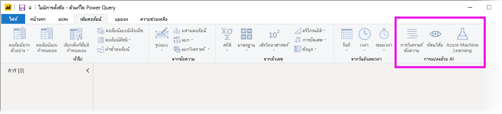

# ใช้ข้อมูลเชิงลึกของ AI ใน Power BI DesktopUse AI Insights in Power BI Desktop

ใน Power BI คุณสามารถใช้ข้อมูลเชิงลึกของ AI  เพื่อเข้าถึงชุดการเรียนรู้ของเครื่องที่ผ่านการฝึกอบรมมาก่อนซึ่งจะช่วยในการเตรียมข้อมูลของคุณให้ดีขึ้นIn Power BI, you can use AI Insights to gain access to a collection of pre-trained machine learning models that enhance your data preparation efforts. มีการเข้าถึงข้อมูลเชิงลึกของ AI ใน **ตัวแก้ไข Power Query** และฟีเจอร์และฟังก์ชันที่เกี่ยวข้องจะได้รับการเข้าถึงผ่านทาง **หน้าแรก** และ **เพิ่มคอลัมน์** ใน **ตัวแก้ไข Power Query**AI Insights is accessed in the **Power Query editor**, and its associated features and functions are accessed through the **Home** and **Add Column** tabs in **Power Query editor**. 

บทความนี้อธิบายฟังก์ชันสำหรับฟังก์ชันการวิเคราะห์ข้อความและการมองเห็นทั้งจากบริการทั้งคู่ของ  AzureThis article describes functions for Text Analytics and Vision functions, both from Azure Cognitive Services. นอกจากนี้ในบทความนี้เป็นส่วนที่อธิบายถึงฟังก์ชั่นที่กำหนดเองที่มีอยู่ใน Power BI จาก Azure Machine LearningAlso in this article is a section that describes the custom functions available in Power BI from Azure Machine Learning.

## วิธีเปิดใช้มูลเชิงลึกของ AIHow to enable AI Insights

โดยทั่วไปแล้วข้อมูลเชิงลึกของ AI ได้รับการเผยแพร่ในเดือนมิถุนายน 2020 ของ Power BI DesktopAI insights was made generally available in the June 2020 release of Power BI Desktop. สำหรับเวอร์ชันก่อนหน้าของ Power BI Desktop ข้อมูลเชิงลึกของ AI ใน Power BI จะต้องเปิดใช้งานโดยการเลือกตัวเลือก **ไฟล์ > ตัวเลือกและการตั้งค่า > ตัวเลือก** จากนั้น **แสดงตัวอย่างฟีเจอร์** จากคอลัมน์ด้านซ้ายFor earlier versions of Power BI Desktop, AI insights in Power BI must be enabled by selecting **File > Options and settings > Options**, then **Preview features** from the left column. ในหน้าต่างทางขวาคือการเลือก **เบราว์เซอร์การทำงานสำหรับข้อมูลเชิงลึกของ AI**In the right pane is an **AI Insights function browser** selection. ทำเครื่องหมายในช่องข้าง **เบราว์เซอร์การทำงานสำหรับข้อมูลเชิงลึกของ  AI** เพื่อเปิดใช้ฟีเจอร์แสดงตัวอย่างCheck the box beside **AI Insights function browser** to enable the preview feature. คุณจะต้องรีสตาร์ท Power BI Desktop เพื่อให้การเปลี่ยนแปลงฟีเจอร์แสดงตัวอย่างมีผลYou'll need to restart Power BI Desktop for the preview feature change to take effect.

> [!NOTE]
> โดยทั่วไปแล้วข้อมูลเชิงลึกของ AI จะพร้อมใช้งานสำหรับเวอร์ชันทั้งหมดของ Power BI Desktop เริ่มต้นด้วยการเผยแพร่ในเดือนมิถุนายน 2020 และสำหรับรุ่นเหล่านั้นไม่จำเป็นต้องเปิดใช้งานเป็นคุณฟีเจอร์ตัวอย่างAI insights is generally available for all versions of Power BI Desktop beginning with June 2020 release, and for those versions, does not need to be enabled as a preview feature.

## การใช้การวิเคราะห์ข้อความและการมองเห็นUsing Text Analytics and Vision

ด้วยการวิเคราะห์ข้อความและการมองเห็นใน Power BI คุณสามารถใช้อัลกอริทึมต่างๆ ได้จาก [Azure Cognitive Services](https://azure.microsoft.com/services/cognitive-services/) เพื่อเติมแต่งข้อมูลของคุณในการเตรียมข้อมูลด้วยตนเองสำหรับกระแสข้อมูลWith Text Analytics and Vision in Power BI, you can apply different algorithms from [Azure Cognitive Services](https://azure.microsoft.com/services/cognitive-services/) to enrich your data in Power Query.

บริการที่ได้รับการสนับสนุนมีดังต่อไปนี้:The services that are supported today are the following:

* [การวิเคราะห์ความคิดเห็นSentiment Analysis](/azure/cognitive-services/text-analytics/how-tos/text-analytics-how-to-sentiment-analysis)
* [การแยกวลีที่สำคัญKey Phrase Extraction](/azure/cognitive-services/text-analytics/how-tos/text-analytics-how-to-keyword-extraction)
* [การตรวจหาภาษาLanguage Detection](/azure/cognitive-services/text-analytics/how-tos/text-analytics-how-to-language-detection)
* [การแท็กรูปภาพ](/azure/cognitive-services/computer-vision/concept-tagging-images)[Image Tagging](/azure/cognitive-services/computer-vision/concept-tagging-images). 

การแปลงข้อมูลจะดำเนินการบนบริการของ Power BI และไม่จำเป็นต้องมีการสมัครใช้งาน Azure Cognitive ServicesThe transformations are executed on the Power BI service and do not require an Azure Cognitive Services subscription. 

> [!IMPORTANT]
> 
> การใช้ฟีเจอร์การวิเคราะห์ข้อความหรือการมองเห็นจำเป็นต้องใช้ Power BI PremiumUsing the Text Analytics or Vision features requires Power BI Premium.

### การเปิดใช้งานการวิเคราะห์ข้อความและการมองเห็นบนกำลังการผลิตพรีเมียมEnabling Text Analytics and Vision on Premium capacities

Cognitive Services ได้รับการรองรับโดยโหนดความจุพรีเมียม EM2, A2 หรือ P1 และสูงกว่านั้นCognitive Services are supported for Premium capacity nodes EM2, A2, or P1 and above. โดยจะใช้ปริมาณงาน AI ที่แยกต่างหากบนความจุเพื่อเรียกใช้ Cognitive ServicesA separate AI workload on the capacity is used to run Cognitive Services. ในระหว่างการแสดงตัวอย่างสาธารณะ (ก่อนเดือนมิถุนายน 2019) ค่าเริ่มต้นได้ปิดการใช้งานปริมาณงานDuring public preview of these features (prior to June 2019), this workload was disabled by default. ก่อนที่จะใช้ Cognitive Services ใน Power BI จำเป็นต้องเปิดการใช้งานปริมาณงาน  AI ใน **การตั้งค่าความจุ** ของพอร์ทัลผู้ดูแลระบบBefore using Cognitive Services in Power BI, the AI workload must be enabled in the **capacity settings** of the admin portal. คุณสามารถเปิดการใช้งาน **ปริมาณงาน  AI** ในส่วนของ **ปริมาณงาน** และกำหนดจำนวนสูงสุดของหน่วยความจำที่คุณต้องการให้ปริมาณงานนี้ใช้ได้You can turn on the **AI workload** in the **workloads** section and define the maximum amount of memory you would like this workload to consume. ขีดจำกัดหน่วยความจำที่แนะนำคือ 20%The recommended memory limit is 20%. หากเกินขีดจำกัดนี้จะทำให้คิวรีช้าลงExceeding this limit causes the query to slow down.

### ฟังก์ชันที่พร้อมใช้งานAvailable functions

ส่วนนี้จะอธิบายฟังก์ชันที่พร้อมใช้งานใน Cognitive Services ใน Power BIThis section describes the available functions in Cognitive Services in Power BI.

#### ตรวจหาภาษาDetect language

ฟังก์ชันตรวจหาภาษาจะประเมินข้อมูลป้อนเข้าที่เป็นข้อความ โดยแต่ละเขตข้อมูลจะส่งกลับชื่อภาษาและตัวระบุ ISOThe language detection function evaluates text input, and for each field, returns the language name and ISO identifier. ฟังก์ชันนี้เป็นประโยชน์ต่อคอลัมน์ข้อมูลที่รวบรวมข้อความที่กำหนดเองซึ่งไม่ทราบภาษาThis function is useful for data columns that collect arbitrary text, where language is unknown. ฟังก์ชันคาดหวังข้อมูลในรูปแบบข้อความเป็นข้อมูลป้อนเข้าThe function expects data in text format as input.

การวิเคราะห์ข้อความสามารถตรวจหาได้มากถึง 120 ภาษาText Analytics recognizes up to 120 languages. โปรดดู [ภาษาที่รองรับ](/azure/cognitive-services/text-analytics/text-analytics-supported-languages) สำหรับข้อมูลเพิ่มเติมFor more information, see [supported languages](/azure/cognitive-services/text-analytics/text-analytics-supported-languages).

#### แยกวลีหลักExtract key phrases

ฟังก์ชัน **การแยกวลีหลัก** จะประเมินข้อความที่ไม่มีโครงสร้าง โดยแต่ละเขตข้อมูลข้อความจะส่งกลับรายการของวลีหลักThe **Key Phrase Extraction** function evaluates unstructured text, and for each text field, returns a list of key phrases. ฟังก์ชันดังกล่าวจำเป็นต้องมีเขตข้อมูลข้อความเป็นข้อมูลป้อนเข้า และยังยอมรับข้อมูลป้อนเข้าเพิ่มเติมสำหรับ **Cultureinfo** ด้วยเช่นกันThe function requires a text field as input, and accepts an optional input for **Culture info**.

การแยกวลีหลักเหมาะสำหรับก้อนข้อความที่ใหญ่กว่าKey phrase extraction works best when you give it bigger chunks of text to work on. ซึ่งตรงข้ามกับการวิเคราะห์ความคิดเห็นที่เหมาะสำหรับก้อนข้อความที่เล็กกว่าThis is opposite from sentiment analysis, which performs better on smaller blocks of text. โปรดพิจารณาการปรับโครงสร้างของข้อมูลป้อนเข้าให้สอดคล้องเพื่อให้ได้ผลลัพธ์ที่ดีที่สุดจากการดำเนินการทั้งสองรูปแบบTo get the best results from both operations, consider restructuring the inputs accordingly.

#### ให้คะแนนความคิดเห็นScore sentiment

ฟังก์ชัน **ให้คะแนนความคิดเห็น** จะประเมินข้อมูลป้อนเข้าที่เป็นข้อความและส่งกลับคะแนนความคิดเห็นสำหรับแต่ละเอกสาร โดยคะแนนจะไล่เรียงจาก 0 (ลบ) ถึง 1 (บวก)The **Score Sentiment** function evaluates text input and returns a sentiment score for each document, ranging from 0 (negative) to 1 (positive). ฟังก์ชันนี้เป็นประโยชน์สำหรับการตรวจจับความคิดเห็นที่เป็นบวก และลบในสื่อสังคม รีวิวจากลูกค้า และฟอรั่มการอภิปรายThis function is useful for detecting positive and negative sentiment in social media, customer reviews, and discussion forums.

การวิเคราะห์ข้อความจะใช้อัลกอริทึมการจัดประเภทการเรียนรู้เกี่ยวกับเครื่องเพื่อสร้างคะแนนความคิดเห็นระหว่าง 0 และ 1Text Analytics uses a machine learning classification algorithm to generate a sentiment score between 0 and 1. คะแนนที่ใกล้กับ 1 แสดงถึงความคิดเห็นบวก ส่วนคะแนนที่ใกล้กับ 0 แสดงถึงความคิดเห็นลบScores closer to 1 indicate positive sentiment, scores closer to 0 indicate negative sentiment. แบบจำลองจะได้รับการฝึกฝนด้วยเนื้อหาที่เกี่ยวข้องกับความคิดเห็นอย่างครอบคลุมไว้ล่วงหน้าThe model is pre-trained with an extensive body of text with sentiment associations. ในปัจจุบัน ยังไม่สามารถให้ข้อมูลการฝึกของคุณเองได้Currently, it's not possible to provide your own training data. แบบจำลองจะใช้เทคนิคการผสมผสานระหว่างการวิเคราะห์ข้อความ รวมการประมวลผลข้อความ การวิเคราะห์ชนิดของคำ การวางตำแหน่งคำ และกลุ่มคำที่เกี่ยวข้องกันThe model uses a combination of techniques during text analysis, including text processing, part-of-speech analysis, word placement, and word associations. โปรดดู [แนะนำการวิเคราะห์ข้อความ](/archive/blogs/machinelearning/machine-learning-and-text-analytics) สำหรับข้อมูลเพิ่มเติมเกี่ยวกับอัลกอริทึมFor more information about the algorithm, see [Introducing Text Analytics](/archive/blogs/machinelearning/machine-learning-and-text-analytics).

การวิเคราะห์ความคิดเห็นจะดำเนินการบนเขตข้อมูลที่ป้อนเข้าทั้งหมดซึ่งตรงข้ามกับการแยกความคิดเห็นสำหรับเอนทิตีเฉพาะในข้อความSentiment analysis is performed on the entire input field, as opposed to extracting sentiment for a particular entity in the text. ในทางปฏิบัติ จะมีแนวโน้มสำหรับการให้คะแนนความแม่นยำเพื่อปรับปรุงเมื่อเอกสารมีหนึ่งหรือสองประโยคมากกว่าเป็นก้อนข้อความขนาดใหญ่In practice, there's a tendency for scoring accuracy to improve when documents contain one or two sentences rather than a large block of text. ระหว่างขั้นตอนการประเมินปรวิสัย แบบจำลองจะตัดสินว่า เขตข้อมูลที่ป้อนเข้าโดยรวมเป็นข้อเท็จจริงหรือความคิดเห็นDuring an objectivity assessment phase, the model determines whether an input field as a whole is objective or contains sentiment. ระบบจะไม่นำเขตข้อมูลที่ป้อนเข้าที่โดยส่วนใหญ่เป็นข้อเท็จจริงไปดำเนินการต่อในขั้นตอนการตรวจหาความคิดเห็น ดังนั้นระบบจะแสดงผลคะแนน .50 โดยไม่มีการประมวลผลต่อAn input field that is mostly objective does not progress to the sentiment detection phrase, resulting in a .50 score, with no further processing. ส่วนเขตข้อมูลที่ป้อนเข้าที่ดำเนินการต่อในไปป์ไลน์ ขั้นตอนถัดไปจะสร้างคะแนนที่สูงหรือต่ำกว่า .50 โดยขึ้นอยู่กับระดับระดับความคิดเห็นที่ตรวจพบในเขตข้อมูลที่ป้อนเข้าFor input fields continuing in the pipeline, the next phase generates a score above or below .50, depending on the degree of sentiment detected in the input field.

ในปัจจุบัน การวิเคราะห์ความคิดเห็นรองรับภาษาอังกฤษ ภาษาเยอรมัน ภาษาสเปน และภาษาฝรั่งเศสCurrently, Sentiment Analysis supports English, German, Spanish, and French. ส่วนภาษาอื่นๆ ยังอยู่ในช่วงตัวอย่างOther languages are in preview. โปรดดู [ภาษาที่รองรับ](/azure/cognitive-services/text-analytics/text-analytics-supported-languages) สำหรับข้อมูลเพิ่มเติมFor more information, see [supported languages](/azure/cognitive-services/text-analytics/text-analytics-supported-languages).

#### แท็กรูปภาพTag images

ฟังก์ชัน **แท็กรูปภาพ** จะส่งกลับแท็กโดยยึดตามวัตถุ สิ่งมีชีวิต ทิวทัศน์ และการเคลื่อนไหวที่รู้จักมากกว่า 2,000 รายการThe **Tag Images** function returns tags based on more than two thousand recognizable objects, living beings, scenery, and actions. เมื่อแท็กไม่ชัดเจนหรือไม่ใช่ความรู้ทั่วไป ผลลัพธ์จะให้ *ข้อมูล* เพื่ออธิบายความหมายของแท็กในบริบทของการตั้งค่าที่รู้จักWhen tags are ambiguous or not common knowledge, the output provides *hints* to clarify the meaning of the tag in context of a known setting. แท็กจะไม่ถูกจัดระเบียบเป็นการจัดหมวดหมู่ และจะไม่มีลำดับชั้นการสืบทอดTags are not organized as a taxonomy and no inheritance hierarchies exist. คอลเลกชันของเนื้อหาแท็กจะสร้างพื้นฐานสำหรับ *คำอธิบาย* รูปภาพที่แสดงเป็นภาษาที่อ่านได้ของมนุษย์ซึ่งมีรูปแบบเป็นประโยคสมบูรณ์A collection of content tags forms the foundation for an image *description* displayed as human readable language formatted in complete sentences.

หลังจากอัปโหลดรูปภาพหรือระบุ URL รูปภาพแล้ว ผลลัพธ์อัลกอริทึมคอมพิวเตอร์วิทัศน์จะแท็กโดยยึดตามวัตถุ สิ่งมีชีวิต และการเคลื่อนไหวที่ระบุในรูปภาพAfter uploading an image or specifying an image URL, Computer Vision algorithms output tags based on the objects, living beings, and actions identified in the image. แท็กไม่จำกัดเฉพาะเรื่องหลักๆ เช่น บุคคลในพื้นหน้า เท่านั้นแต่ยังรวมถึง ฉาก (ในร่มหรือกลางแจ้ง) เครื่องเรือน เครื่องมือ พืช สัตว์ เครื่องประดับ เครื่องมือเบ็ดเตล็ด และอื่นๆTagging is not limited to the main subject, such as a person in the foreground, but also includes the setting (indoor or outdoor), furniture, tools, plants, animals, accessories, gadgets, and so on.

ฟังก์ชันนี้ต้องเป็น URL รูปภาพหรือเขตข้อมูล abase-64 ที่เป็นข้อมูลป้อนเข้าThis function requires an image URL or a base-64 field as input. ในขณะนี้ การแท็กรูปภาพรองรับภาษาอังกฤษ ภาษาสเปน ภาษาญี่ปุ่น ภาษาโปรตุเกส และภาษาจีนแบบย่อAt this time, image tagging supports English, Spanish, Japanese, Portuguese, and Simplified Chinese. โปรดดู [ภาษาที่รองรับ](/rest/api/cognitiveservices/computervision/tagimage/tagimage#uri-parameters) สำหรับข้อมูลเพิ่มเติมFor more information, see [supported languages](/rest/api/cognitiveservices/computervision/tagimage/tagimage#uri-parameters).

### ฟังก์ชันการวิเคราะห์ข้อความเรียกหรือการมองเห็นใน Power QueryInvoking Text Analytics or Vision functions in Power Query

เพื่อเสริมสร้างข้อมูลของคุณด้วยฟังก์ชันการวิเคราะห์ข้อความหรือการมองเห็นของคุณ ให้เปิด **ตัวแก้ไข Power Query**To enrich your data with Text Analytics or Vision functions, open **Power Query editor**. ตัวอย่างนี้จะแสดงการให้คะแนนความคิดเห็นของข้อความThis example walks through scoring the sentiment of a text. คุณสามารถใช้ขั้นตอนเดียวกันในการแยกวลีหลัก ตรวจหาภาษา และแท็กรูปได้The same steps can be used to extract key phrases, detect language, and tag images.

เลือกปุ่ม **การวิเคราะห์ข้อความ** ใน **หน้าหลัก** หรือ **เพิ่ม คอลัมน์ริบบิ้น**Select the **Text analytics** button in the **Home** or **Add column** ribbon. คุณจะได้รับแจ้งให้ลงชื่อเข้าใช้You'll be prompted to sign in.

หลังจากลงชื่อเข้าใช้แล้วให้เลือกฟังก์ชันที่คุณต้องการนำเข้าและคอลัมน์ข้อมูลที่คุณต้องการแปลงในหน้าต่างแบบป๊อปอัพAfter signing in, select the function you want to use and the data column you want to transform in the pop-up window.

Power BI เลือกความจุพรีเมียมในการเรียกใช้ฟังก์ชันและส่งผลลัพธ์กลับไปยัง Power BI DesktopPower BI selects a Premium capacity to run the function on and send the results back to Power BI Desktop. กำลังการผลิตจะใช้สำหรับฟังก์ชันการวิเคราะห์ข้อความและการมองเห็นในระหว่างแอปพลิเคชันและการรีเฟรชใน Power BI Desktop เท่านั้นThe selected capacity is only used for Text Analytics and Vision function during application and refreshes in Power BI Desktop. เมื่อมีการเผยแพร่รายงาน ให้รีเฟรชการทำงานบนความจุ Premium ของพื้นที่ทำงานที่มีการเผยแพร่รายงานOnce the report is published, refreshes run on the Premium capacity of the workspace the report is published to. คุณสามารถเปลี่ยนความจุที่ใช้สำหรับบริการด้านความรู้ทั้งหมดในดร็อปดาวน์ในมุมล่างซ้ายของหน้าต่างป๊อปอัพYou can change the capacity used for all Cognitive Services in the dropdown in the lower left corner of the popup window.

**Cultureinfo** เป็นข้อมูลป้อนเข้าเพิ่มเติมเพื่อระบุภาษาของข้อความ**Cultureinfo** is an optional input to specify the language of the text. เขตข้อมูลนี้คือรหัส ISOThis field is an ISO code. คุณสามารถใช้คอลัมน์เป็นข้อมูลป้อนเข้าสำหรับ Cultureinfo หรือเขตข้อมูลแบบคงที่ได้You can use a column as input for Cultureinfo, or a static field. ในตัวอย่างนี้ ภาษาที่ระบุสำหรับทั้งคอลัมน์คือภาษาอังกฤษ (en)In this example, the language is specified as English (en) for the whole column. หากคุณปล่อยให้เขตข้อมูลนี้ว่าง Power BI จะตรวจหาภาษาโดยอัตโนมัติก่อนที่จะใช้ฟังก์ชันIf you leave this field blank, Power BI automatically detects the language before applying the function. จากนั้นเลือก **นำไปใช้**Next, select **Apply.**

ในครั้งแรกที่คุณใช้ข้อมูลเชิงลึกของ AI ในแหล่งข้อมูลใหม่คุณจะได้รับการแจ้งเตือนให้ตั้งค่าระดับความเป็นส่วนตัวของข้อมูลของคุณThe first time you use AI Insights on a new data source, you're prompted to set the privacy level of your data.

> [!NOTE]
> การรีเฟรชชุดข้อมูลใน Power BI จะทำงานกับแหล่งข้อมูลที่มีการตั้งค่าระดับความเป็นส่วนตัวเป็นสาธารณะหรือองค์กรเท่านั้นRefreshes of the dataset in Power BI will only work for data sources where the privacy level is set to public or organizational.

หลังจากการเรียกฟังก์ชัน ระบบจะเพิ่มผลลัพธ์เป็นคอลัมน์ใหม่ลงในตารางAfter invoking the function, the result is added as a new column to the table. และระบบจะเพิ่มการแปลงข้อมูลเป็นขั้นตอนที่นำไปใช้ในคิวรีด้วยเช่นกันThe transformation is also added as an applied step in the query.

ในกรณีที่มีการแท็กรูปภาพและการแยกวลี คีย์ผลลัพธ์สามารถส่งกลับค่าหลายค่าได้In the cases of image tagging and key phrase extraction, the results can return multiple values. ผลลัพธ์แต่ละรายการจะถูกส่งคืนด้วยซ้ำของแถวเดิมEach individual result is returned on a duplicate of the original row.

### การเผยแพร่รายงานที่มีฟังก์ชันการวิเคราะห์ข้อความหรือการมองเห็นPublishing a report with Text Analytics or Vision functions

166/5000
ในขณะที่แก้ไขใน Power Query และดำเนินการรีเฟรชใน Power BI Desktop การวิเคราะห์ข้อความและการมองเห็นใช้ความจุพรีเมียมที่ถูกเลือกในเครื่องมือแก้ไข Power QueryWhile editing in Power Query and performing refreshes in Power BI Desktop, Text Analytics and Vision use the Premium capacity that was selected in Power Query editor. หลังจากเผยแพร่รายงานไปยัง Power BI แล้วจะใช้ความจุแบบพรีเมียมของพื้นที่ทำงานที่มีการเผยแพร่After publishing the report to Power BI, it uses the Premium capacity of the workspace into which it was published.

รายงานที่มีฟังก์ชั่นการวิเคราะห์ข้อความและการมองเห็นควรได้รับการเผยแพร่ไปยังพื้นที่ทำงานที่ไม่ได้อยู่ในความสามารถระดับพรีเมียมมิ ฉะนั้นการรีเฟรชชุดข้อมูลจะล้มเหลวReports with applied Text Analytics and Vision functions should be published to a workspace that is not on a Premium capacity, otherwise refreshing the dataset will fail.

### การจัดการผลกระทบจากความจุพรีเมียมManaging impact on a Premium capacity

ส่วนต่อไปนี้อธิบายวิธีที่คุณสามารถจัดการผลกระทบของการวิเคราะห์ข้อความและการมองเห็นในความจุThe following sections describe how you can manage the impacts of Text Analytics and Vision on capacity.

#### การเลือกความจุSelecting a capacity

ผู้เขียนรายงานสามารถเลือกความจุพรีเมียมที่จะเรียกใช้ข้อมูลเชิงลึกของ AI ได้Report authors can select which Premium capacity on which to run AI Insights. ตามค่าเริ่มต้น Power BI จะเลือกความจุที่สร้างขึ้นครั้งแรกที่ผู้ใช้มีสิทธิ์เข้าถึงBy default, Power BI selects the first created capacity to which the user has access.

#### การตรวจสอบด้วยแอปการวัดความจุMonitoring with the Capacity Metrics app

เจ้าของความจุพรีเมียมสามารถตรวจสอบผลกระทบของฟังก์ชันการวิเคราะห์ข้อความและการมองเห็นในความจุด้วยแอปเมตริกความจุของ [Power BI Premium](../admin/service-admin-premium-monitor-capacity.md) ได้Premium capacity owners can monitor the impact of Text Analytics and Vision functions on a capacity with the [Power BI Premium Capacity Metrics app](../admin/service-admin-premium-monitor-capacity.md). แอปจะแสดงรายละเอียดการวัดสถานภาพของชุดข้อมูลภายในความจุของคุณThe app provides detailed metrics on the health of the AI workloads within your capacity. แผนภูมิด้านบนแสดงปริมาณการใช้หน่วยความจำตามปริมาณงาน  AIThe top chart shows the memory consumption by AI workloads. ผู้ดูแลความจุ Premium สามารถตั้งค่าขีดจำกัดหน่วยความจำสำหรับปริมาณงาน  AI ต่อความจุได้Premium capacity admins can set the memory limit for the AI workload per capacity. เมื่อการใช้งานหน่วยความจำถึงขีดจำกัดหน่วยความจำ คุณสามารถพิจารณาเพิ่มขีดจำกัดของหน่วยความจำหรือย้ายพื้นที่ทำงานบางอย่างไปยังความจุอื่นได้When memory usage reaches the memory limit, you can consider increasing the memory limit or moving some workspaces to a different capacity.

### กำลังเปรียบเทียบ Power Query และ Power Query ออนไลน์Comparing Power Query and Power Query Online

ฟังก์ชันการวิเคราะห์ข้อความและการมองเห็นที่ใช้ใน Power Query และ Power Query ออนไลน์เหมือนกันThe Text Analytics and Vision functions used in Power Query and Power Query Online are the same. ความแตกต่างระหว่างประสบการณ์มีดังต่อไปนี้:The only differences between the experiences are the following:

* Power Query มีปุ่มแยกต่างหากสำหรับการวิเคราะห์ข้อความวิสัยทัศน์และ Azure Machine LearningPower Query has separate buttons for Text Analytics, Vision, and Azure Machine Learning. ใน Power Query ออนไลน์ รายการเหล่านี้จะถูกรวมอยู่ในหนึ่งเมนูIn Power Query Online, these are combined in one menu.
* ใน Power Query ผู้สร้างรายงานสามารถเลือกความจุพรีเมียมที่ใช้ในการเรียกใช้ฟังก์ชันได้In Power Query, the report author can select the Premium capacity that is used to run the functions. ไม่จำเป็นต้องใช้ใน Power Query ออนไลน์เนื่องจาก dataflow มีอยู่บนความจุที่ระบุอยู่แล้วThis is not required in Power Query Online, since a dataflow is already on a specific capacity.

### ข้อควรพิจารณาและข้อจำกัดของบการวิเคราะห์ข้อความConsiderations and limitations of Text Analytics

มีข้อควรพิจารณาและข้อจำกัดสองสามข้อที่ควรทราบเมื่อใช้การวิเคราะห์ข้อความ:There are a few considerations and limitations to keep in mind when using Text Analytics.

* การรีเฟรชแบบเพิ่มหน่วยได้รับการสนับสนุน แต่สามารถทำให้เกิดปัญหาด้านประสิทธิภาพเมื่อใช้กับแบบสอบถามที่มีข้อมูลเชิงลึก AIIncremental refresh is supported but can cause performance issues when used on queries with AI insights.
* ไม่สนับสนุน Direct QueryDirect Query is not supported.

## การใช้  Azure  MLUsing Azure ML

องค์กรมากมายใช้แบบจำลอง **Machine Learning** เพื่อข้อมูลเชิงลึกและการคาดการณ์เกี่ยวกับธุรกิจของตนเองที่ดีกว่าNumerous organizations use **Machine Learning** models for better insights and predictions about their business. ความสามารถในการแสดงผลด้วยภาพจากแบบจำลองเหล่านี้ในรายงานและแดชบอร์ดรวมถึงการวิเคราะห์อื่นๆ ของคุณสามารถช่วยเผยแพร่ข้อมูลเชิงลึกเหล่านี้ให้แก่ผู้ใช้ทางธุรกิจที่ต้องการมากที่สุดได้The ability to visualize and invoke insights from these models, in your reports and dashboards and other analytics, can help disseminate these insights to the business users who need it the most. Power BI ช่วยให้การรวมข้อมูลเชิงลึกจากแบบจำลองที่โฮสต์บน Azure Machine Learning ได้อย่างง่ายดายโดยใช้ลักษณะการชี้และคลิกโดยตรงPower BI makes it simple to incorporate the insights from models hosted on Azure Machine Learning, using straightforward point-and-click gestures.

หากต้องการใช้ความสามารถนี้ นักวิทยาศาสตร์ข้อมูลสามารถให้สิทธิ์เข้าถึงแบบจำลอง Azure ML ไปยังนักวิเคราะห์ BI โดยใช้พอร์ทัล Azure ได้อย่างง่ายดายTo use this capability, a data scientist can simply grant access to the Azure ML model to the BI analyst using the Azure portal. จากนั้น ณ จุดเริ่มต้นของแต่ละเซสชัน Power Query จะค้นพบแบบจำลอง Azure MLทั้งหมดที่ผู้ใช้ได้เข้าถึง และแสดงเป็นฟังก์ชัน Power Query แบบไดนามิกThen, at the start of each session, Power Query discovers all the Azure ML models to which the user has access and exposes them as dynamic Power Query functions. จากนั้นผู้ใช้จะสามารถเรียกใช้ฟังก์ชันเหล่านั้นโดยการเข้าถึงจาก Ribbon ในตัวแก้ไข Power Query หรือโดยการเรียกฟังก์ชัน M โดยตรงThe user can then invoke those functions by accessing them from the ribbon in Power Query editor, or by invoking the M function directly. นอกจากนี้ Power BI ยังรวมคำขอการเข้าถึงโดยอัตโนมัติเมื่อเรียกแบบจำลอง Azure ML สำหรับชุดของแถวเพื่อบรรลุประสิทธิภาพการทำงานที่ดีกว่าPower BI also automatically batches the access requests when invoking the Azure ML model for a set of rows to achieve better performance.

ฟังก์ชันนี้จะได้รับการรองรับเฉพาะกระแสข้อมูล Power BI และ Power Query แบบออนไลน์ในบริการของ Power BIThis functionality is supported in Power BI Desktop, Power BI dataflows, and for Power Query Online in the Power BI service.

หากต้องการเรียนรู้เพิ่มเติมเกี่ยวกับกระแสข้อมูล โปรดดู [การเตรียมข้อมูลด้วยตนเองใน Power BI](./dataflows/dataflows-introduction-self-service.md)To learn more about dataflows, see [Self-service data prep in Power BI](./dataflows/dataflows-introduction-self-service.md).

หากต้องการเรียนรู้เพิ่มเติมเกี่ยวกับ Azure Machine Learning โปรดดูบทความต่อไปนี้:To learn more about Azure Machine Learning, see the following articles:

- ภาพรวม: [Azure Machine Learning คืออะไร](/azure/machine-learning/service/overview-what-is-azure-ml)Overview: [What is Azure Machine Learning?](/azure/machine-learning/service/overview-what-is-azure-ml)
- เริ่มต้นใช้งานด่วนและบทช่วยสอนสำหรับ Azure Machine Learning: [เอกสารประกอบ Azure Machine Learning](/azure/machine-learning/)Quick Starts and Tutorials for Azure Machine Learning: [Azure Machine Learning Documentation](/azure/machine-learning/)

### ให้สิทธิ์การเข้าถึงแบบจำลอง Azure  MLGranting access to an Azure ML model

หากต้องการเข้าถึงแบบจำลอง Azure ML จาก Power BI ผู้ใช้จะต้องมีการสมัครใช้งาน Azure ที่มีการเข้าถึงแบบ **อ่าน**To access an Azure ML model from Power BI, the user must have **Read** access to the Azure subscription. นอกจากนี้พวกเขาจะต้องมีสิ่งต่อไปนี้:In addition, they must have the following:

- สำหรับแบบจำลอง Machine Learning Studio (คลาสสิก) ต้องใช้การเข้าถึงแบบ **อ่าน** สำหรับบริการบนเว็บ Machine Learning Studio (คลาสสิก)For Machine Learning Studio (classic) models, **Read** access to Machine Learning Studio (classic) web service
- สำหรับแบบจำลอง Machine Learning ต้องใช้การเข้าถึงแบบ **อ่าน** สำหรับพื้นที่ทำงาน Machine LearningFor Machine Learning models, **Read** access to the Machine Learning workspace

ขั้นตอนในบทความนี้จะอธิบายวิธีให้สิทธิ์ใช้งานแก่ผู้ใช้ Power BI ในการเข้าถึงแบบจำลองที่โฮสต์บนบริการ Azure ML เพื่อให้ผู้ใช้สามารถเข้าถึงแบบจำลองนี้เป็นฟังก์ชัน Power QueryThe steps in this section describe how to grant a Power BI user access to a model hosted on the Azure ML service, so they can access this model as a Power Query function. โปรดดู [จัดการการเข้าถึง RBAC และพอร์ทัล Azure](/azure/role-based-access-control/role-assignments-portal) สำหรับรายละเอียดอื่นๆFor further details, please see [Manage access using RBAC and the Azure portal](/azure/role-based-access-control/role-assignments-portal).

1. ลงชื่อเข้าใช้ไปยัง [พอร์ทัล Azure](https://portal.azure.com/)Sign in to the [Azure portal](https://portal.azure.com/).
2. ไปที่หน้า **การสมัครใช้งาน**Go to the **Subscriptions** page. คุณสามารถค้นหาหน้า **การสมัครใช้งาน** ผ่านรายการ **บริการทั้งหมด** ในเมนูนำทางด้านซ้ายของพอร์ทัล AzureYou can find the **Subscriptions** page through the **All Services** list in the left navigation menu of the Azure portal.
3. เลือกการสมัครใช้งานของคุณSelect your subscription
4. เลือก **ควบคุมการเข้าถึง (IAM)** แล้วเลือกปุ่ม **เพิ่ม**Select **Access control (IAM)**, and then select the **Add** button.
5. เลือกบทบาทเป็น **ผู้อ่าน**Select **Reader** as the Role. เลือกผู้ใช้ Power BI ที่คุณต้องการให้สิทธิ์เข้าถึงแบบจำลอง Azure MLSelect the Power BI user to whom you wish to grant access to the Azure ML model.
6. เลือก **บันทึก**Select **Save**
7. ทำซ้ำขั้นตอนที่สามถึงหกเพื่อให้สิทธิ์การเข้าถึงแบบ **ผู้อ่าน** แก่ผู้ใช้สำหรับบริการบนเว็บ Machine Learning Studio (คลาสสิก) ที่เจาะจง *หรือ* พื้นที่ทำงาน Machine Learning ที่โฮสต์แบบจำลองRepeat steps three through six to grant **Reader** access to the user for the specific Machine Learning Studio (classic) web service, *or* the Machine Learning workspace hosting the model.

### การค้นพบ Schema สำหรับแบบจำลอง Machine LearningSchema discovery for Machine Learning models

นักวิทยาศาสตร์ข้อมูลใช้ Python เป็นหลักเพื่อพัฒนาหรือแม้กระทั่งปรับใช้ แบบจำลองการเรียนรู้ของเครื่องของพวกเขาสำหรับ Machine LearningData scientists primarily use Python to develop, and even deploy, their machine learning models for Machine Learning. ซึ่งต่างจาก Machine Learning Studio (คลาสสิก) ซึ่งช่วยให้งานการสร้างไฟล์ Schema สำหรับแบบจำลองเป็นไปโดยอัตโนมัติ ในกรณีของ Machine Learning นักวิทยาศาสตร์ข้อมูลต้องสร้างไฟล์ Schema อย่างชัดเจนโดยใช้ PythonUnlike the Machine Learning Studio (classic), which helps automate the task of creating a schema file for the model, in the case of Machine Learning, the data scientist must explicitly generate the schema file using Python.

ไฟล์ Schema นี้ต้องอยู่ในบริการเว็บที่ปรับใช้สำหรับแบบจำลอง Machine LearningThis schema file must be included in the deployed web service for Machine Learning models. หากต้องการสร้าง Schema สำหรับบริการเว็บโดยอัตโนมัติ คุณต้องใส่ตัวอย่างของอินพุท/เอาท์พุทในสคริปต์รายการสำหรับแบบจำลองที่ปรับใช้To automatically generate the schema for web service, you must provide a sample of the input/output in the entry script for the deployed model. โปรดดูที่หัวข้อย่อยเกี่ยวกับการสร้าง Schema ของ Swagger แบบอัตโนมัติ [(ไม่บังคับ) ในแบบจำลองการปรับใช้ด้วยเอกสารบริการ Azure Machine Learning](/azure/machine-learning/how-to-deploy-and-where#optional-define-model-web-service-schema)Please see the subsection on [(Optional) Automatic Swagger schema generation in the Deploy models with the Azure Machine Learning](/azure/machine-learning/how-to-deploy-and-where#optional-define-model-web-service-schema) service documentation. ลิงก์มีสคริปต์รายการตัวอย่างด้วยคำสั่งสำหรับการสร้าง SchemaThe link includes the example entry script with the statements for the schema generation.

โดยเฉพาะ _@input\_schema_ และ _@output\_schema_ ฟังก์ชันในสคริปต์รายการการอ้างอิงรูปแบบตัวอย่างการป้อนข้อมูลและเอาท์พุทในการ ป้อนข้อมูล _ตัวอย่าง\_และ_ การแสดงผลลัพธ _ตัวอย่าง\_และใช้ตัว_ อย่างเหล่านี้เพื่อสร้างข้อมูลจำเพาะ OpenAPI (Swagger) สำหรับบริการเว็บในระหว่างการปรับใช้Specifically, the _@input\_schema_ and _@output\_schema_ functions in the entry script reference the input and output sample formats in the _input\_sample_ and _output\_sample_ variables, and use these samples to generate an OpenAPI (Swagger) specification for the web service during deployment.

คำแนะนำเหล่านี้สำหรับการสร้าง Schema โดยการอัปเดตสคริปต์รายการจะต้องนำไปใช้กับแบบจำลองที่สร้างขึ้นโดยใช้การทดสอบการเรียนรู้ของเครื่องอัตโนมัติโดยใช้ Azure Machine Learning SDKThese instructions for schema generation by updating the entry script must also be applied to models created using automated machine learning experiments using the Azure Machine Learning SDK.

> [!NOTE]
> แบบจำลองที่สร้างขึ้นโดยใช้อินเทอร์เฟสการแสดงผลด้วยภาพของ Azure Machine Learning ปัจจุบันไม่รองรับการสร้าง Schema แต่จะรองรับในรุ่นต่อ ๆ มาModels created using the Azure Machine Learning visual interface do not currently support schema generation, but will in subsequent releases.
> 
### การเรียกแบบจำลอง Azure  ML ใน Power BIInvoking an Azure ML model in Power Query

คุณสามารถเรียกแบบจำลอง Azure ML ใดๆ ที่คุณได้รับสิทธิ์เข้าถึงได้ โดยตรงจากตัวแก้ไข Power QueryYou can invoke any Azure ML model to which you have been granted access, directly from the Power Query Editor. ในการเข้าถึงแบบจำลอง Azure ML ให้เลือกปุ่ม **Azure Machine Learning** ใน **หน้าแรก** หรือ **เพิ่มคอลัมน์** ริบบิ้นในตัวแก้ไข Power QueryTo access the Azure ML models, select **Azure Machine Learning** button in the **Home** or **Add Column** ribbon in the Power Query editor.

แบบจำลอง  Azure  ML ทั้งหมดที่คุณสามารถเข้าถึงได้จะแสดงที่นี่เป็นฟังก์ชัน Power QueryAll Azure ML models to which you have access are listed here as Power Query functions. นอกจากนี้ พารามิเตอร์ที่ป้อนเข้าสำหรับแบบจำลอง Azure ML จะแมปเป็นพารามิเตอร์ของฟังก์ชัน Power Query ที่สอดคล้องกันโดยอัตโนมัติAlso, the input parameters for the Azure ML model are automatically mapped as parameters of the corresponding Power Query function.

หากต้องการเรียกแบบจำลอง Azure ML คุณสามารถระบุคอลัมน์ของเอนทิตีที่เลือกใดๆ ก็ได้ เป็นข้อมูลป้อนเข้าจากดรอปดาวน์To invoke an Azure ML model, you can specify any of the selected entity's columns as an input from the drop-down. นอกจากนี้คุณยังสามารถระบุค่าคงที่เพื่อใช้เป็นข้อมูลป้อนเข้าได้ โดยสลับไอคอนคอลัมน์ไปทางซ้ายของกล่องโต้ตอบที่ป้อนเข้าYou can also specify a constant value to be used as an input by toggling the column icon to the left of the input dialog.

เลือก **ตกลง** เพื่อดูตัวอย่างผลลัพธ์ของแบบจำลอง Azure  ML เป็นคอลัมน์ใหม่ในตารางเอนทิตีSelect **OK** to view the preview of the Azure ML model's output as a new column in the entity table. นอกจากนี้คุณจะเห็นการเรียกแบบจำลองเป็นขั้นตอนที่นำไปใช้สำหรับคิวรีYou will also see the model invocation as an applied step for the query.

หากแบบจำลองส่งกลับพารามิเตอร์ผลลัพธ์หลายรายการ พารามิเตอร์เหล่านั้นจะถูกจัดกลุ่มเข้าด้วยกันเป็นระเบียนในคอลัมน์ผลลัพธ์If the model returns multiple output parameters, they are grouped together as a record in the output column. คุณสามารถขยายคอลัมน์เพื่อสร้างแต่ละพารามิเตอร์ผลลัพธ์ในคอลัมน์แยกต่างหากได้You can expand the column to produce individual output parameters in separate columns.

### ข้อควรพิจารณาและข้อจำกัด Azure  MLConsiderations and limitations of Azure ML

ข้อควรพิจารณาและขีดจำกัดต่อไปนี้นำไปใช้กับ Azure ML ใน Power BI DesktopThe following considerations and limitations apply to Azure ML in Power BI Desktop.

* แบบจำลองที่สร้างขึ้นโดยใช้อินเทอร์เฟสการแสดงผลด้วยภาพของ Azure Machine Learning ปัจจุบันไม่รองรับการสร้าง SchemaModels created using the Azure Machine Learning visual interface do not currently support schema generation. คาดการณ์การสนับสนุนในรุ่นต่อๆ ไปSupport is anticipated in subsequent releases.
* การรีเฟรชแบบเพิ่มหน่วยได้รับการสนับสนุน แต่สามารถทำให้เกิดปัญหาด้านประสิทธิภาพเมื่อใช้กับแบบสอบถามที่มีข้อมูลเชิงลึก AIIncremental refresh is supported but can cause performance issues when used on queries with AI insights.
* ไม่สนับสนุน Direct QueryDirect Query is not supported.

## ขั้นตอนถัดไปNext steps

บทความนี้จะให้ภาพรวมของการรวม  Machine Learning ลงในบริการ Power BI DesktopThis article provided an overview of integrating Machine Learning into Power BI Desktop. บทความต่อไปนี้อาจน่าสนใจและเป็นประโยชน์สำหรับคุณThe following articles might also be interesting and useful.

- [บทช่วยสอน: ใช้แบบจำลองการเรียนรู้ของเครื่อง Azure ใน Power BITutorial: Consume Azure Machine Learning models in Power BI](../connect-data/service-aml-integrate.md)
- [บทช่วยสอน: การใช้ Cognitive Services ใน Power BITutorial: Using Cognitive Services in Power BI](../connect-data/service-tutorial-use-cognitive-services.md)
- [Cognitive Services ใน Power BICognitive Services in Power BI](./dataflows/dataflows-machine-learning-integration.md)
- [การรวม Azure Machine Learning ใน Power BIAzure Machine Learning integration in Power BI](./dataflows/dataflows-machine-learning-integration.md)
- [ตรวจสอบความจุพรีเมียมด้วยแอปMonitoring Premium capacities with the app](../admin/service-admin-premium-monitor-capacity.md)
- [เมตริก AI ที่พร้อมใช้งานในแอปเมตริกความจุพรีเมียมAI metrics in the Premium capacity metrics app](https://powerbi.microsoft.com/blog/ai-metrics-now-available-in-power-bi-premium-capacity-metrics-app/)