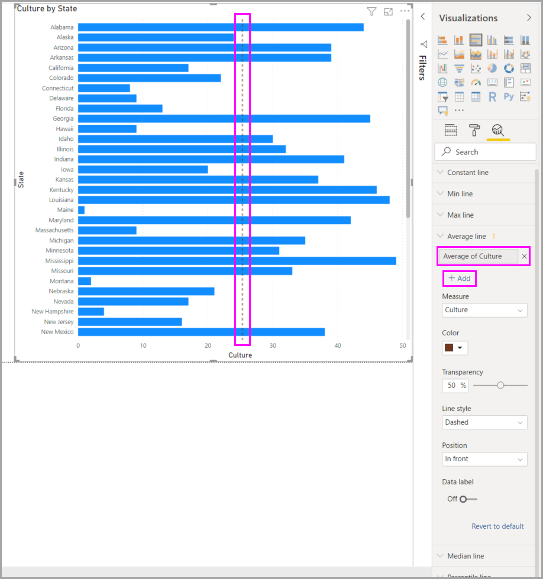

# ใช้บานหน้าต่างการวิเคราะห์ใน Power BI DesktopUse the Analytics pane in Power BI Desktop

ด้วยแผง **การวิเคราะห์** ใน Power BI Desktop คุณสามารถเพิ่ม *สายการอ้างอิง* แบบไดนามิกกับวิชวล และเน้นให้เห็นแนวโน้มที่สำคัญหรือข้อมูลเชิงลึกได้With the **Analytics** pane in Power BI Desktop, you can add dynamic *reference lines* to visuals, and provide focus for important trends or insights. ไอคอนและแผง **การวิเคราะห์** จะอยู่ในพื้นที่ของ **การแสดงผลด้วยภาพ** ของ Power BI DesktopThe **Analytics** icon and pane is found in the **Visualizations** area of Power BI Desktop.

> [!NOTE]
> บานหน้าต่าง **การวิเคราะห์** จะปรากฏเฉพาะเมื่อคุณเลือกวิชวลบนพื้นที่ทำงานของ Power BI DesktopThe **Analytics** pane only appears when you select a visual on the Power BI Desktop canvas.

## ค้นหาภายในบานหน้าต่างการวิเคราะห์Search within the Analytics pane

เริ่มตั้งแต่การเผยแพร่เดือนกุมภาพันธ์ 2018 ของ **Power BI Desktop** (เวอร์ชั่น 2.55.5010.201 หรือใหม่กว่า) คุณสามารถค้นหาภายในแผง **การวิเคราะห์** ซึ่งเป็นส่วนย่อยของแผงการแสดงผลด้วยภาพBeginning with the February 2018 release of Power BI Desktop (version 2.55.5010.201 or later), you can search within the **Analytics** pane, which is a subsection of the **Visualizations** pane. กล่องค้นหาจะปรากฏขึ้นเมื่อคุณเลือกไอคอน **การวิเคราะห์**The search box appears when you select the **Analytics** icon.

## การใช้บานหน้าต่างการวิเคราะห์Use the Analytics pane

ด้วยแผง **การวิเคราะห์** คุณสามารถสร้างสายการอ้างอิงแบบไดนามิกชนิดต่างๆ :With the **Analytics** pane, you can create the following types of dynamic reference lines:

* เส้นคงที่แกน XX-Axis constant line
* เส้นคงที่แกน YY-Axis constant line
* เส้นต่ำสุดMin line
* เส้นสูงสุดMax line
* เส้นเฉลี่ยAverage line
* เส้นกึ่งกลางMedian line
* เส้นเปอร์เซ็นต์ไทล์Percentile line
* แรเงาสมมาตรSymmetry shading

> [!NOTE]
> บางบรรทัดไม่พร้อมใช้งานสำหรับทุกชนิดของวิชวลNot all lines are available for all visual types.

ส่วนต่อไปนี้แสดงให้เห็นว่า คุณสามารถใช้บานหน้าต่าง **การวิเคราะห์** และสายการอ้างอิงแบบไดนามิกในการแสดงภาพของคุณได้อย่างไรThe following sections show how you can use the **Analytics** pane and dynamic reference lines in your visualizations.

เพื่อดูรายการ สายการอ้างอิงแบบไดนามิก ที่มีสำหรับแต่ละวิชาล ทำตามขั้นตอนต่อไปนี้:To view the available dynamic reference lines for a visual, follow these steps:

1. เลือกหรือสร้างวิชวล จากนั้นเลือกไอคอน **การวิเคราะห์** จากส่วน **การจัดรูปแบบการแสดงข้อมูล**Select or create a visual, then select the **Analytics** icon from the **Visualizations** section.

    

2. เลือกชนิดของเส้นที่คุณต้องการสร้าง เพื่อขยายตัวเลือกSelect the type of line you want to create to expand its options. ในกรณีนี้ เราจะเลือก **เส้นเฉลี่ย**In this case, we'll select **Average line**.

    

3. เมื่อต้องการสร้างเส้นใหม่ เลือก **+&nbsp;เพิ่ม**To create a new line, select **+&nbsp;Add**. จากนั้นคุณสามารถตั้งชื่อบรรทัดได้Then you can name the line. คลิกสองครั้งที่กล่องข้อความและใส่ชื่อของคุณDouble-click the text box and enter your name.

    ในตอนนี้คุณมีตัวเลือกสำหรับเส้นของคุณทั้งหมดแล้วNow you have all sorts of options for your line. คุณสามารถระบุ **สี**,เปอร์เซ็นต์ **ความโปร่งใส** **ลักษณะเส้น** และ **ตำแหน่ง** (เทียบกับองค์ประกอบข้อมูลของภาพ)You can specify its **Color**, **Transparency** percentage, **Line style**, and **Position** (compared to the visual's data elements). คุณยังสามารถเลือกว่าจะรวม  **ป้ายชื่อข้อมูล**You may also choose whether to include the **Data label**. เมื่อต้องการระบุการวัดผลด้วยภาพที่จะยึดตามเส้นของคุณ ให้เลือกรายการ **หน่วยวัด** ข้างล่าง ซึ่งจะถูกเติมโดยอัตโนมัติด้วยองค์ประกอบข้อมูลจากวิชวลTo specify the visual measure to base your line upon, select the **Measure** dropdown list, which is automatically populated with data elements from the visual. เราจะเลือก **วัฒนธรรม** เป็นหน่วยวัด และตั้งชื่อว่า *วัฒนธรรมเฉลี่ย* และกำหนดตัวเลือกอื่นๆ สองสามตัวเลือกHere we'll select **Culture** as the measure, label it *Average of Culture*, and customize a few of the other options.

    

4. ถ้าคุณต้องการให้ป้ายชื่อข้อมูลปรากฏ เปลี่ยน **ป้ายชื่อข้อมูล** จาก **ปิด** เป็น **เปิด**If you want to have a data label appear, change **Data label** from **Off** to **On**. เมื่อคุณทำเช่นนั้น คุณจะมีตัวเลือกสำหรับป้ายชื่อข้อมูลเพิ่มขึ้นอีก สำหรับป้ายชื่อข้อมุลของคุณWhen you do so, you get a whole host of additional options for your data label.

    

5. สังเกตว่ามีตัวเลขปรากฏถัดจากรายการ **เส้นเฉลี่ย** ในบานหน้าต่าง **การวิเคราะห์**Notice the number that appears next to the **Average line** item in the **Analytics** pane. ซึ่งบอกคุณว่ามีเส้นแบบไดนามิกแล้วกี่เส้นในวิชวลของคุณ และเป็นชนิดใดบ้างThat tells you how many dynamic lines you currently have on your visual, and of which type. ถ้าเราเพิ่ม **เส้นสูงสุด** สำหรับ **ค่าใช้จ่ายการดำรงชีพ** แผง **การวิเคราะห์** แสดงว่า ตอนนี้เรายังมี **เส้นสูงสุด** แบบไดนามิกอีกหนึ่งเส้นที่ใช้ในวิชวลนี้If we add a **Max line** for **Affordability**, the **Analytics** pane shows that we now also have a **Max line** dynamic reference line applied to this visual.

    

ถ้าวิชวลที่คุณเลือกไม่สามารถมีสายการการอ้างอิงแบบไดนามิกที่ใช้กับ (ในกรณีนี้ วิชวล **แผนที่**) คุณจะเห็นข้อความต่อไปนี้เมื่อคุณเลือแผง **การวิเคราะห์**If the visual you've selected can't have dynamic reference lines applied to it (in this case, a **Map** visual), you'll see the following message when you select the **Analytics** pane.

คุณสามารถเน้นได้โดยการสร้างสายการอ้างอิงแบบไดนามิก ด้วแผง **การวิเคราะห์**You can highlight many interesting insights by creating dynamic reference lines with the **Analytics** pane.

เรากำลังวางแผนคุณลักษณะและความสามารถเพิ่มเติม รวมถึงขยายวิชวลที่สามารถมีสายการการอ้างอิงแบบไดนามิกได้We're planning more features and capabilities, including expanding which visuals can have dynamic reference lines applied to them. ตรวจสอบย้อนกลับบ่อยครั้งเพื่อดูว่ามีอะไรใหม่Check back often to see what's new.

## การใช้การพยากรณ์Apply forecasting

ถ้าคุณมีข้อมูลเวลาในแหล่งข้อมูลของคุณ คุณสามารถใช้ฟีเจอร์ *การคาดการณ์* ได้If you have time data in your data source, you can use the *forecasting* feature. เพียงแค่เลือกวิชวล จากนั้นขยายส่วน **การคาดการณ์** ของแผง  **การวิเคราะห์**Just select a visual, then expand the **Forecast** section of the **Analytics** pane. คุณสามารถระบุค่ามากมายเพื่อปรับเปลี่ยนการพยากรณ์ เช่น **คาดการณ์ความยาว** หรือ **ช่วงความเชื่อมั่น**You may specify many inputs to modify the forecast, such as the **Forecast length** or the **Confidence interval**. รูปภาพต่อไปนี้แสดงวิชวลของเส้นที่ใช้การคาดการณ์The following image shows a basic line visual with forecasting applied. ใช้จินตนาการของคุณ (และเล่นกับการคาดการณ์) เพื่อดูว่าอาจนำไปใช้กับโมเดลของคุณได้อย่างไรUse your imagination (and play around with forecasting) to see how it may apply to your models.

> [!NOTE]
> ฟีเจอร์การคาดการณ์จะพร้อมใช้งานสำหรับวิชวลแผนภูมิเส้นเท่านั้นThe forecasting feature is only available for line chart visuals.

## ข้อจำกัดLimitations

ความสามารถในการใช้สายการอ้างอิงแบบไดนามิก จะขึ้นกับชนิดของวิชวลที่ใช้The ability to use dynamic reference lines is based on the type of visual being used. รายการต่อไปนี้อธิบายข้อจำกัดเหล่านี้โดยเฉพาะThe following lists describe these limitations more specifically.

คุณอาจใช้ *เส้นคงที่แกน x* *เส้นคงที่แกน  y* และ *แรเงาแบบสมมาตร* บนวิชวลต่อไปนี้:You may use *x-axis constant line*, *y-axis constant line*, and *symmetry shading* on the following visual:

* แผนภูมิกระจายScatter chart

การใช้ *เส้นคงที่* *เส้นต่ำสุด* *เส้นสูงสุด* *เส้นเฉลี่ย* *เส้นตรงกลาง* และ *เส้นเปอร์เซ็นต์ไทล์* พร้อมใช้งานบนวิชวลเหล่านี้:Use of *constant line*, *min line*, *max line*, *average line*, *median line*, and *percentile line* is available on these visuals:

* แผนภูมิพื้นที่Area chart
* แผนภูมิแท่งแบบกลุ่มClustered bar chart
* แผนภูมิคอลัมน์แบบกลุ่มClustered column chart
* แผนภูมิเส้นLine chart
* แผนภูมิกระจายScatter chart

วิชวลต่อไปนี้สามารถใช้เฉพาะ *เส้นคงที่* จากบานหน้าต่าง **การวิเคราะห์**:The following visuals can use only a *constant line* from the **Analytics** pane:

* แผนภูมิพื้นที่แบบเรียงซ้อนStacked area chart
* แผนภูมิแท่งแบบเรียงซ้อนStacked bar chart
* แผนภูมิคอลัมน์แบบเรียงซ้อนStacked column chart
* แผนภูมิน้ำตกWaterfall chart
* แผนภูมิแท่งแบบเรียงซ้อน 100%100% Stacked bar chart
* แผนภูมิคอลัมน์แบบเรียงซ้อน 100%100% Stacked column chart

วิชวลต่อไปนี้สามารถใช้  *เส้นแนวโน้ม* ถ้ามีข้อมูลเวลา:The following visuals can use a *trend line* if there's time data:

* แผนภูมิพื้นที่Area chart
* แผนภูมิคอลัมน์แบบกลุ่มClustered column chart
* แผนภูมิเส้นLine chart
* เส้นและแผนภูมิคอลัมน์แบบกลุ่มLine and clustered column chart

ในที่สุด คุณไม่สามารถนำเส้นแบบไดนามิกใดๆ ไปใช้กับวิชวลจำนวนมากได้ ในขณะนี้รวมถึง (แต่ไม่จำกัดเพียง):Lastly, you can't currently apply any dynamic lines to many visuals, including (but not limited to):

* แผนภูมิกรวยFunnel
* เส้นและแผนภูมิคอลัมน์แบบกลุ่มLine and clustered column chart
* เส้นและแผนภูมิคอลัมน์แบบเรียงซ้อนLine and stacked column chart
* แผนภูมิริบบอนRibbon chart
* วิชวลที่ไม่ใช่คาร์ทีเซียน เช่น แผนภูมิโดนัท เครื่องวัด เมทริกซ์ แผนภูมิวงกลมและตารางNon-Cartesian visuals, such as Donut chart, Gauge, Matrix, Pie chart, and Table

*เส้นเปอร์เซ็นต์ไทล์* มีใช้งานเฉพาะเมื่อใช้ข้อมูลนำเข้าใน Power BI Desktop หรือเมื่อเชื่อมต่อสดไปยังโมเดลเซิร์ฟเวอร์ที่ดำเนินการ  **Analysis Service 2016** หรือภายหลัง **Azure Analysis Services** หรือชุดข้อมูลบนบริการของ Power BIThe *percentile line* is only available when using imported data in Power BI Desktop or when connected live to a model on a server that's running **Analysis Service 2016** or later, **Azure Analysis Services**, or a dataset on the Power BI service.

## ขั้นตอนถัดไปNext steps

คุณสามารถทำการเรียงลำดับของของต่างๆ ด้วย Power BI DesktopYou can do all sorts of things with Power BI Desktop. สำหรับข้อมูลเพิ่มเติมเกี่ยวกับขีดความสามารถ กรุณาดูแหล่งทรัพยากรต่อไปนี้:For more information on its capabilities, check out the following resources:

* [มีอะไรใหม่ใน Power BI DesktopWhat's new in Power BI Desktop](../fundamentals/desktop-latest-update.md)
* [รับ Power BI DesktopGet Power BI Desktop](../fundamentals/desktop-get-the-desktop.md)
* [Power BI Desktop คืออะไรWhat is Power BI Desktop?](../fundamentals/desktop-what-is-desktop.md)
* [ภาพรวมคำถามด้วย Power BI DesktopQuery overview with Power BI Desktop](desktop-query-overview.md)
* [ชนิดข้อมูลใน Power BI DesktopData types in Power BI Desktop](../connect-data/desktop-data-types.md)
* [จัดรูปร่างและรวมข้อมูลด้วย Power BI DesktopShape and combine data with Power BI Desktop](../connect-data/desktop-shape-and-combine-data.md)
* [ใช้งานทั่วไปใน Power BI DesktopPerform common tasks in Power BI Desktop](desktop-common-query-tasks.md)
