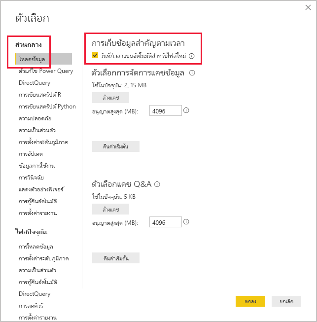

# <a name="apply-auto-datetime-in-power-bi-desktop"></a><span data-ttu-id="94caa-103">ใช้วันที่/เวลาอัตโนมัติใน Power BI Desktop</span><span class="sxs-lookup"><span data-stu-id="94caa-103">Apply auto date/time in Power BI Desktop</span></span>

<span data-ttu-id="94caa-104">บทความนี้มุ่งเป้าหมายไปที่เรื่อง ตัวสร้างแบบจำลองข้อมูลที่พัฒนามาจากแบบจำลองนำเข้าหรือแบบจำลองผสมใน Power BI Desktop</span><span class="sxs-lookup"><span data-stu-id="94caa-104">This article targets data modelers developing Import or Composite models in Power BI Desktop.</span></span> <span data-ttu-id="94caa-105">ซึ่งจะแนะนำและอธิบายตัวเลือก _วันที่/เวลาอัตโนมัติ_</span><span class="sxs-lookup"><span data-stu-id="94caa-105">It introduces and describes the _Auto date/time_ option.</span></span>

<span data-ttu-id="94caa-106">วันที่/เวลาอัตโนมัติ เป็นตัวเลือกการโหลดข้อมูลใน Power BI Desktop</span><span class="sxs-lookup"><span data-stu-id="94caa-106">The Auto date/time is a data load option in Power BI Desktop.</span></span> <span data-ttu-id="94caa-107">วัตถุประสงค์ของตัวเลือกนี้คือ การสนับสนุนการรายงานตัวแสดงเวลาที่สะดวกโดยยึดตามคอลัมน์วันที่ที่โหลดลงในแบบจำลอง</span><span class="sxs-lookup"><span data-stu-id="94caa-107">The purpose of this option is to support convenient time intelligence reporting based on date columns loaded into a model.</span></span> <span data-ttu-id="94caa-108">โดยเฉพาะจะช่วยให้ผู้สร้างรายงานใช้แบบจำลองข้อมูลของคุณเพื่อกรองจัดกลุ่มและเจาะรายละเอียดแนวลึกโดยใช้ช่วงเวลาในปฏิทิน (ปี ไตรมาส เดือน และวัน)</span><span class="sxs-lookup"><span data-stu-id="94caa-108">Specifically, it allows report authors using your data model to filter, group, and drill down by using calendar time periods (years, quarters, months, and days).</span></span> <span data-ttu-id="94caa-109">สิ่งสำคัญคืออะไรที่คุณไม่จำเป็นต้องพัฒนาความสามารถตัวแสดงเวลาเหล่านี้อย่างชัดเจน</span><span class="sxs-lookup"><span data-stu-id="94caa-109">What's important is that you don't need to explicitly develop these time intelligence capabilities.</span></span>

<span data-ttu-id="94caa-110">เมื่อเปิดใช้งานตัวเลือกนี้แล้ว Power BI Desktop สร้างตารางวันที่/เวลาอัตโนมัติที่ซ่อนอยู่สำหรับแต่ละคอลัมน์วันที่ โดยมีเงื่อนไขดังต่อไปนี้เป็นจริงทั้งหมด:</span><span class="sxs-lookup"><span data-stu-id="94caa-110">When the option is enabled, Power BI Desktop creates a hidden auto date/time table for each date column, providing all of the following conditions are true:</span></span>

- <span data-ttu-id="94caa-111">โหมดที่เก็บข้อมูลของตารางคือ นำเข้า</span><span class="sxs-lookup"><span data-stu-id="94caa-111">The table storage mode is Import</span></span>
- <span data-ttu-id="94caa-112">ชนิดข้อมูลของคอลัมน์คือ วันที่ หรือวันที่/เวลา</span><span class="sxs-lookup"><span data-stu-id="94caa-112">The column data type is date or date/time</span></span>
- <span data-ttu-id="94caa-113">คอลัมน์ไม่ได้อยู่ในด้าน "กลุ่ม" ของความสัมพันธ์ในแบบจำลอง</span><span class="sxs-lookup"><span data-stu-id="94caa-113">The column isn't the "many" side of a model relationship</span></span>

## <a name="how-it-works"></a><span data-ttu-id="94caa-114">วิธีการทำงาน</span><span class="sxs-lookup"><span data-stu-id="94caa-114">How it works</span></span>

<span data-ttu-id="94caa-115">อันที่จริงแล้ว ตารางวันที่/เวลาอัตโนมัติเป็น [ตารางจากการคำนวณ](desktop-calculated-tables.md) ที่สร้างแถวของข้อมูลโดยใช้ฟังก์ชัน [CALENDAR](/dax/calendar-function-dax) DAX</span><span class="sxs-lookup"><span data-stu-id="94caa-115">Each auto date/time table is in fact a [calculated table](desktop-calculated-tables.md) that generates rows of data by using the DAX [CALENDAR](/dax/calendar-function-dax) function.</span></span> <span data-ttu-id="94caa-116">แต่ละตารางประกอบด้วยคอลัมน์จากการคำนวณ 6 คอลัมน์: **Day**, **MonthNo**, **Month**, **QuarterNo**, **Quarter** และ **Year**</span><span class="sxs-lookup"><span data-stu-id="94caa-116">Each table also includes six calculated columns: **Day**, **MonthNo**, **Month**, **QuarterNo**, **Quarter**, and **Year**.</span></span>

> [!NOTE]
> <span data-ttu-id="94caa-117">Power BI แปลและจัดรูปแบบชื่อคอลัมน์และค่าต่าง ๆ ตาม[ภาษาของแบบจำลอง](../fundamentals/supported-languages-countries-regions.md#choose-the-language-for-the-model-in-power-bi-desktop)</span><span class="sxs-lookup"><span data-stu-id="94caa-117">Power BI translates and formats column names and values according to the [model language](../fundamentals/supported-languages-countries-regions.md#choose-the-language-for-the-model-in-power-bi-desktop).</span></span> <span data-ttu-id="94caa-118">ตัวอย่างเช่น หากแบบจำลองถูกสร้างขึ้นโดยใช้ภาษาอังกฤษ แบบจำลองดังกล่าวจะยังคงแสดงชื่อเดือนและอื่น ๆ ในภาษาอังกฤษ แม้ว่าจะดูด้วยไคลเอ็นต์ภาษาเกาหลีก็ตาม</span><span class="sxs-lookup"><span data-stu-id="94caa-118">For example, if the model was created by using English, it will still show month names, and so on, in English, even if viewed with a Korean client.</span></span>

<span data-ttu-id="94caa-119">นอกจากนี้ Power BI Desktop ยังสร้างความสัมพันธ์ระหว่างคอลัมน์ **วันที่** ของตารางวันที่/เวลาอัตโนมัติ และคอลัมน์วันที่ของแบบจำลองด้วย</span><span class="sxs-lookup"><span data-stu-id="94caa-119">Power BI Desktop also creates a relationship between the auto date/time table's **Date** column and the model date column.</span></span>

<span data-ttu-id="94caa-120">ตารางวันที่/เวลาอัตโนมัติประกอบด้วยปีปฏิทินที่ครอบคลุมค่าวันที่ทั้งหมดที่ถูกเก็บไว้ในคอลัมน์วันที่ของแบบจำลอง</span><span class="sxs-lookup"><span data-stu-id="94caa-120">The auto date/time table contains full calendar years encompassing all date values stored in the model date column.</span></span> <span data-ttu-id="94caa-121">ตัวอย่างเช่น หากค่าแรกเริ่มในคอลัมน์วันที่คือ 20 มีนาคม 2016 และค่าล่าสุดคือ 23 ตุลาคม 2019 ตารางจะประกอบด้วย 1,461 แถว</span><span class="sxs-lookup"><span data-stu-id="94caa-121">For example, if the earliest value in a date column is March 20, 2016 and the latest value is October 23, 2019, the table will contain 1,461 rows.</span></span> <span data-ttu-id="94caa-122">ซึ่งแสดงให้เห็นว่า หนึ่งแถวสำหรับหนึ่งวันในสี่ปีปฏิทินตั้งแต่ 2016 ถึง 2019</span><span class="sxs-lookup"><span data-stu-id="94caa-122">It represents one row for each date in the four calendar years 2016 to 2019.</span></span> <span data-ttu-id="94caa-123">เมื่อ Power BI รีเฟรชแบบจำลอง ตารางวันที่/เวลาแต่ละอันจะถูกรีเฟรชโดยอัตโนมัติไปด้วย</span><span class="sxs-lookup"><span data-stu-id="94caa-123">When Power BI refreshes the model, each auto date/time table is also refreshed.</span></span> <span data-ttu-id="94caa-124">ด้วยวิธีนี้ แบบจำลองจะมีวันที่ที่ตามวันที่ของค่าคอลัมน์เสมอ</span><span class="sxs-lookup"><span data-stu-id="94caa-124">This way, the model always contains dates that encompass the date column values.</span></span>

<span data-ttu-id="94caa-125">หากคุณสามารถมองเห็นแถวของตารางวันที่/เวลาอัตโนมัติได้ แถวดังกล่าวจะมีลักษณะดังนี้:</span><span class="sxs-lookup"><span data-stu-id="94caa-125">If it were possible to see the rows of an auto date/time table, they would look like this:</span></span>


> [!NOTE]
> <span data-ttu-id="94caa-129">ตารางวันที่/เวลาอัตโนมัติถูกซ่อนอย่างถาวร แม้ว่าจะมาจากตัวสร้างแบบจำลองก็ตาม</span><span class="sxs-lookup"><span data-stu-id="94caa-129">Auto date/time tables are permanently hidden, even from modelers.</span></span> <span data-ttu-id="94caa-130">ซึ่งคุณจะไม่สามารถเห็นตารางดังกล่าวได้ในบานหน้าต่าง **เขตข้อมูล** หรือไดอะแกรมมุมมองแบบจำลอง และไม่สามารถมองเห็นแถวของตารางในมุมมองข้อมูลอีกด้วย</span><span class="sxs-lookup"><span data-stu-id="94caa-130">They cannot be seen in the **Fields** pane or the Model view diagram, and its rows cannot be seen in Data view.</span></span> <span data-ttu-id="94caa-131">นอกจากนี้ ตารางและคอลัมน์ของตารางไม่สามารถอ้างอิงโดยตรงด้วยนิพจน์ DAX</span><span class="sxs-lookup"><span data-stu-id="94caa-131">Also, the table and its column cannot be directly referenced by DAX expressions.</span></span>
>
> <span data-ttu-id="94caa-132">นอกจากนี้ คุณยังไม่สามารถทำงานกับไฟล์เหล่านั้นได้เมื่อใช้ [วิเคราะห์ใน Excel](../collaborate-share/service-analyze-in-excel.md)หรือเชื่อมต่อกับแบบจำลองโดยใช้ตัวดีไซเนอร์รายงานที่ไม่ใช่ Power BI</span><span class="sxs-lookup"><span data-stu-id="94caa-132">Further, it's not possible to work with them when using [Analyze in Excel](../collaborate-share/service-analyze-in-excel.md), or connecting to the model using non-Power BI report designers.</span></span>

<span data-ttu-id="94caa-133">ตารางนี้ยังกำหนดลำดับชั้นโดยจัดทำวิชวลเส้นทางที่มีการเจาะลึกลงไปตามระดับปี ไตรมาส เดือน และวัน</span><span class="sxs-lookup"><span data-stu-id="94caa-133">The table also defines a hierarchy, providing visuals with a drill down path through year, quarter, month, and day levels.</span></span>

<span data-ttu-id="94caa-134">หากคุณสามารถมองเห็นตารางวันที่/เวลาอัตโนมัติในแผนภาพมุมมองแบบจำลองได้ ตารางดังกล่าวจะมีลักษณะดังนี้ (คอลัมน์ที่เกี่ยวข้องจะถูกไฮไลท์):</span><span class="sxs-lookup"><span data-stu-id="94caa-134">If it were possible to see an auto date/time table in the Model view diagram, it would look like this (related columns are highlighted):</span></span>


## <a name="work-with-auto-datetime"></a><span data-ttu-id="94caa-140">การทำงานกับวันที่/เวลาอัตโนมัติ</span><span class="sxs-lookup"><span data-stu-id="94caa-140">Work with auto date/time</span></span>

<span data-ttu-id="94caa-141">เมื่อมีตารางวันที่/เวลาอัตโนมัติสำหรับคอลัมน์วันที่ (และคอลัมน์นั้นปรากฏให้เห็น) ผู้เขียนรายงานจะไม่พบคอลัมน์นั้นเป็นเขตข้อมูลในบานหน้าต่าง **เขตข้อมูล**</span><span class="sxs-lookup"><span data-stu-id="94caa-141">When an auto date/time table exists for a date column (and that column is visible), report authors won't find that column as a field in the **Fields** pane.</span></span> <span data-ttu-id="94caa-142">แต่ผู้เขียนรายงานจะค้นพบออบเจ็กต์ที่สามารถขยายได้ที่มีชื่อคอลัมน์วันที่</span><span class="sxs-lookup"><span data-stu-id="94caa-142">Instead, they find an expandable object that has the name of the date column.</span></span> <span data-ttu-id="94caa-143">คุณสามารถระบุได้อย่างง่ายดายเพราะมีการประดับด้วยไอคอนปฏิทิน</span><span class="sxs-lookup"><span data-stu-id="94caa-143">You can easily identify it because it's adorned with a calendar icon.</span></span> <span data-ttu-id="94caa-144">เมื่อผู้สร้างรายงานขยายออบเจ็กต์ปฏิทิน พวกเขาจะพบลำดับชั้นที่ชื่อว่า **ลำดับชั้นวันที่**</span><span class="sxs-lookup"><span data-stu-id="94caa-144">When report authors expand the calendar object, they find a hierarchy named **Date Hierarchy**.</span></span> <span data-ttu-id="94caa-145">หลังจากที่พวกเขาขยายลำดับชั้นแล้ว พวกเขาจะพบสี่ระดับ: **ปี**, **ไตรมาส**, **เดือน** และ **วัน**</span><span class="sxs-lookup"><span data-stu-id="94caa-145">After they expand the hierarchy, they find four levels: **Year**, **Quarter**, **Month**, and **Day**.</span></span>


<span data-ttu-id="94caa-150">ลำดับชั้นที่สร้างโดยวันที่/เวลาอัตโนมัติสามารถใช้เพื่อกำหนดค่าวิชวลในลักษณะเดียวกับที่สามารถใช้กับลำดับชั้นปกติได้</span><span class="sxs-lookup"><span data-stu-id="94caa-150">The auto date/time generated hierarchy can be used to configure a visual in exactly the same way that regular hierarchies can be used.</span></span> <span data-ttu-id="94caa-151">คุณสามารถกำหนดค่าวิชวลได้โดยใช้ลำดับชั้นที่ชื่อว่า **ลำดับชั้นวันที่** ทุกระดับ หรือระดับเฉพาะเจาะจงในลำดับชั้น</span><span class="sxs-lookup"><span data-stu-id="94caa-151">Visuals can be configured by using the entire **Date Hierarchy** hierarchy, or specific levels of the hierarchy.</span></span>

<span data-ttu-id="94caa-152">อย่างไรก็ตาม มีอีกหนึ่งความสามารถที่เพิ่มเข้ามาซึ่งไม่ได้รับการสนับสนุนโดยลำดับชั้นปกติ</span><span class="sxs-lookup"><span data-stu-id="94caa-152">There is, however, one added capability not supported by regular hierarchies.</span></span> <span data-ttu-id="94caa-153">เมื่อมีการเพิ่มลำดับชั้นของวันที่/เวลาอัตโนมัติ—หรือเพิ่มระดับหนึ่งจากลำดับชั้น—ไปยังพื้นที่วิชวล ผู้เขียนรายงานสามารถสลับระหว่างการใช้ลำดับชั้นหรือคอลัมน์วันที่ได้</span><span class="sxs-lookup"><span data-stu-id="94caa-153">When the auto date/time hierarchy—or a level from the hierarchy—is added to a visual well, report authors can toggle between using the hierarchy or the date column.</span></span> <span data-ttu-id="94caa-154">วิธีการนี้เหมาะสมสำหรับวิชวลบางวิชวล เมื่อพวกเขาต้องการเพียงคอลัมน์วันที่ ไม่ใช่ลำดับชั้นและระดับของลำดับชั้น</span><span class="sxs-lookup"><span data-stu-id="94caa-154">This approach makes sense for some visuals, when all they require is the date column, not the hierarchy and its levels.</span></span> <span data-ttu-id="94caa-155">พวกเขาเริ่มต้นด้วยการกำหนดค่าเขตข้อมูลวิชวล (คลิกขวาที่เขตข้อมูลวิชวลหรือคลิกลูกศรชี้ลง) จากนั้นใช้เมนูบริบทเพื่อสลับระหว่างคอลัมน์วันที่หรือลำดับชั้นวันที่</span><span class="sxs-lookup"><span data-stu-id="94caa-155">They start by configuring the visual field (right-click the visual field, or click the down-arrow), and then using the context menu to switch between the date column or the date hierarchy.</span></span>


<span data-ttu-id="94caa-158">สุดท้าย การคำนวณแบบจำลองที่เขียนด้วย DAX สามารถอ้างอิงคอลัมน์วันที่ _โดยตรง_ หรือคอลัมน์ในตารางวันที่/เวลาอัตโนมัติที่ซ่อนอยู่ _โดยทางอ้อม_</span><span class="sxs-lookup"><span data-stu-id="94caa-158">Lastly, model calculations, written in DAX, can reference a date column _directly_, or the hidden auto date/time table columns _indirectly_.</span></span>

<span data-ttu-id="94caa-159">สูตรที่เขียนใน Power BI Desktop สามารถอ้างอิงคอลัมน์วันที่ได้ตามปกติ</span><span class="sxs-lookup"><span data-stu-id="94caa-159">Formula written in Power BI Desktop can reference a date column in the usual way.</span></span> <span data-ttu-id="94caa-160">อย่างไรก็ตาม ต้องมีการอ้างอิงคอลัมน์ของตารางวันที่/เวลาอัตโนมัติโดยใช้ไวยากรณ์เพิ่มเติมแบบพิเศษ</span><span class="sxs-lookup"><span data-stu-id="94caa-160">The auto date/time table columns, however, must be referenced by using a special extended syntax.</span></span> <span data-ttu-id="94caa-161">คุณเริ่มต้นด้วยการอ้างอิงถึงคอลัมน์วันที่ก่อน แล้วตามด้วยจุด (.)</span><span class="sxs-lookup"><span data-stu-id="94caa-161">You start by first referencing the date column, and then following it by a period (.).</span></span> <span data-ttu-id="94caa-162">จากนั้น คุณลักษณะเติมแถบสูตรอัตโนมัติจะช่วยให้คุณสามารถเลือกคอลัมน์จากตารางวันที่/เวลาอัตโนมัติได้</span><span class="sxs-lookup"><span data-stu-id="94caa-162">The formula bar auto complete will then allow you to select a column from the auto date/time table.</span></span>


<span data-ttu-id="94caa-167">ใน Power BI Desktop นิพจน์การวัดที่ถูกต้องสามารถอ่านได้:</span><span class="sxs-lookup"><span data-stu-id="94caa-167">In Power BI Desktop, a valid measure expression could read:</span></span>

```dax
Date Count = COUNT(Sales[OrderDate].[Date])
```

> [!NOTE]
> <span data-ttu-id="94caa-168">แม้ว่านิพจน์การวัดนี้จะใช้ได้ใน Power BI Desktop แต่ก็ไม่ถูกต้องตามหลักไวยากรณ์ของ DAX</span><span class="sxs-lookup"><span data-stu-id="94caa-168">While this measure expression is valid in Power BI Desktop, it's not correct DAX syntax.</span></span> <span data-ttu-id="94caa-169">ภายใน Power BI Desktop สลับเปลี่ยนแถวกับคอลัมน์นิพจน์ของคุณเพื่ออ้างอิงคอลัมน์วันที่/เวลาอัตโนมัติจริง (ซ่อนอยู่)</span><span class="sxs-lookup"><span data-stu-id="94caa-169">Internally, Power BI Desktop transposes your expression to reference the true (hidden) auto date/time table column.</span></span>

## <a name="configure-auto-datetime-option"></a><span data-ttu-id="94caa-170">กำหนดค่าตัวเลือกวันที่/เวลาอัตโนมัติ</span><span class="sxs-lookup"><span data-stu-id="94caa-170">Configure auto date/time option</span></span>

<span data-ttu-id="94caa-171">วันที่/เวลาอัตโนมัติสามารถกำหนดค่า _ส่วนกลาง_ หรือสำหรับ _ไฟล์ปัจจุบัน_</span><span class="sxs-lookup"><span data-stu-id="94caa-171">Auto date/time can be configured _globally_ or for the _current file_.</span></span> <span data-ttu-id="94caa-172">ตัวเลือกส่วนกลางจะนำไปใช้กับไฟล์ Power BI Desktop ใหม่ และสามารถเปิดหรือปิดตัวเลือกนี้ได้ทุกเมื่อ</span><span class="sxs-lookup"><span data-stu-id="94caa-172">The global option applies to new Power BI Desktop files, and it can be turned on or off at any time.</span></span> <span data-ttu-id="94caa-173">สำหรับการติดตั้ง Power BI Desktop ใหม่ ค่าเริ่มต้นของตัวเลือกทั้งสองคือ เปิด</span><span class="sxs-lookup"><span data-stu-id="94caa-173">For a new installation of Power BI Desktop, both options default to on.</span></span>

<span data-ttu-id="94caa-174">นอกจากนี้ ตัวเลือกไฟล์ปัจจุบันยังสามารถเปิดหรือปิดได้ทุกเมื่ออีกด้วย</span><span class="sxs-lookup"><span data-stu-id="94caa-174">The current file option, too, can also be turned on or off at any time.</span></span> <span data-ttu-id="94caa-175">เมื่อเปิดอยู่ ตารางวันที่/เวลาอัตโนมัติจะถูกสร้างขึ้น</span><span class="sxs-lookup"><span data-stu-id="94caa-175">When turned on, auto date/time tables are created.</span></span> <span data-ttu-id="94caa-176">เมื่อปิดอยู่ ตารางวันที่/เวลาอัตโนมัติใดก็ตามจะถูกลบออกจากแบบจำลอง</span><span class="sxs-lookup"><span data-stu-id="94caa-176">When turned off, any auto date/time tables are removed from the model.</span></span>

> [!CAUTION]
> <span data-ttu-id="94caa-177">โปรดระวังเมื่อคุณปิดตัวเลือกไฟล์ปัจจุบันเนื่องจากจะเป็นการลบตารางวันที่/เวลาอัตโนมัติ</span><span class="sxs-lookup"><span data-stu-id="94caa-177">Take care when you turn the current file option off, as this will remove the auto date/time tables.</span></span> <span data-ttu-id="94caa-178">ตรวจสอบให้แน่ใจว่าได้มีการแก้ไขตัวกรองรายงานที่เสียหาย หรือวิชวลที่ได้รับการกำหนดค่าแล้วให้ใช้งานได้</span><span class="sxs-lookup"><span data-stu-id="94caa-178">Be sure to fix any broken report filters or visuals that had been configured to use them.</span></span>

<span data-ttu-id="94caa-179">ใน Power BI Desktop ให้คุณเลือก _ไฟล์ > ตัวเลือกและการตั้งค่า > ตัวเลือก_ จากนั้นเลือกหน้า **ส่วนกลาง** หรือ **ไฟล์ปัจจุบัน**</span><span class="sxs-lookup"><span data-stu-id="94caa-179">In Power BI Desktop, you select _File > Options and settings > Options_, and then select either the **Global** or **Current File** page.</span></span> <span data-ttu-id="94caa-180">ในหน้าใดหน้าหนึ่ง ตัวเลือกนี้มีอยู่ในส่วน **ตัวแสดงเวลา**</span><span class="sxs-lookup"><span data-stu-id="94caa-180">On either page, the option exists in the **Time intelligence** section.</span></span>



## <a name="next-steps"></a><span data-ttu-id="94caa-184">ขั้นตอนถัดไป</span><span class="sxs-lookup"><span data-stu-id="94caa-184">Next steps</span></span>

<span data-ttu-id="94caa-185">สำหรับข้อมูลเพิ่มเติมที่เกี่ยวข้องกับบทความนี้ โปรดดูทรัพยากรต่อไปนี้:</span><span class="sxs-lookup"><span data-stu-id="94caa-185">For more information related to this article, check out the following resources:</span></span>

- [<span data-ttu-id="94caa-186">คำแนะนำวันที่/เวลาอัตโนมัติใน Power BI Desktop</span><span class="sxs-lookup"><span data-stu-id="94caa-186">Auto date/time guidance in Power BI Desktop</span></span>](../guidance/auto-date-time.md)
- [<span data-ttu-id="94caa-187">สร้างตารางวันที่ใน Power BI Desktop</span><span class="sxs-lookup"><span data-stu-id="94caa-187">Create date tables in Power BI Desktop</span></span>](../guidance/model-date-tables.md)
- [<span data-ttu-id="94caa-188">ตั้งค่า และใช้งานตารางวันที่ใน Power BI Desktop</span><span class="sxs-lookup"><span data-stu-id="94caa-188">Set and use date tables in Power BI Desktop</span></span>](desktop-date-tables.md)
- <span data-ttu-id="94caa-189">มีคำถามหรือไม่</span><span class="sxs-lookup"><span data-stu-id="94caa-189">Questions?</span></span> [<span data-ttu-id="94caa-190">ลองถามชุมชน Power BI</span><span class="sxs-lookup"><span data-stu-id="94caa-190">Try asking the Power BI Community</span></span>](https://community.powerbi.com/)
- <span data-ttu-id="94caa-191">มีข้อเสนอแนะไหม</span><span class="sxs-lookup"><span data-stu-id="94caa-191">Suggestions?</span></span> [<span data-ttu-id="94caa-192">สนับสนุนแนวคิดในการปรับปรุง Power BI</span><span class="sxs-lookup"><span data-stu-id="94caa-192">Contribute ideas to improve Power BI</span></span>](https://ideas.powerbi.com/)
