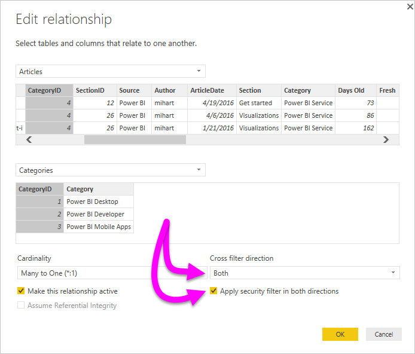

# เปิดใช้การกรองข้ามแบบสองทิศทางสำหรับ DirectQuery ใน Power BI DesktopEnable bidirectional cross-filtering for DirectQuery in Power BI Desktop

ขณะกรองตารางเพื่อสร้างมุมมองข้อมูลที่เหมาะสม ผู้สร้างรายงานและผู้จัดรูปแบบข้อมูลจะพบกับความท้าทายในการกำหนดวิธีการใช้ตัวกรองต่างๆ กับรายงานWhen filtering tables to create the appropriate view of data, report creators and data modelers face challenges determining how to apply filters to a report. ก่อนหน้านี้ บริบทของตัวกรองตารางจะขึ้นอยู่กับด้านหนึ่งของความสัมพันธ์ ไม่ใช่อีกด้านหนึ่งPreviously, the table's filter context was held on one side of the relationship, but not the other. การจัดการนี้มักจะต้องใช้สูตร DAX ที่ซับซ้อนเพื่อให้ได้ผลลัพธ์ที่ต้องการThis arrangement often required complex DAX formula to get the wanted results.

ด้วยการกรองแบบไขว้สองทิศทาง ทำให้ขณะนี้ ผู้สร้างรายงานและผู้จัดรูปแบบข้อมูลสามารถควบคุมลักษณะการใช้ฟิลเตอร์ต่าง ๆ ขณะทำงานกับตารางที่เกี่ยวข้องได้แล้วWith bidirectional cross-filtering, report creators and data modelers now have more control over how they can apply filters when working with related tables. การกรองแบบไขว้สองทิศทางจะทำให้พวกเขาสามารถใช้ตัวกรองกับความสัมพันธ์ของตารางได้ทั้ง *สอง* ด้านBidirectional cross-filtering enables them to apply filters on *both* sides of a table relationship. คุณสามารถปรับใช้ตัวกรองต่าง ๆ โดยการเผยแพร่บริบทตัวกรองไปยังตารางที่เกี่ยวข้องลำดับที่สอง ที่อีกด้านหนึ่งของความสัมพันธ์ของตารางYou can apply the filters by propagating the filter context to a second related table on the other side of a table relationship.

## เปิดใช้การกรองแบบไขว้สองทิศทางสำหรับ DirectQueryEnable bidirectional cross-filtering for DirectQuery

คุณสามารถเปิดใช้การกรองแบบไขว้ในกล่องโต้ตอบ **แก้ไขความสัมพันธ์**You can enable cross-filtering in the **Edit relationship** dialog box. เพื่อเปิดใช้การกรองแบบไขว้สำหรับความสัมพันธ์ คุณจะต้องกำหนดค่าตัวเลือกต่อไปนี้:To enable cross-filtering for a relationship, you must configure the following options:

* ตั้งค่า **ทิศทางตัวกรองแบบไขว้** เป็น **ทั้งคู่**Set **Cross filter direction** to **Both**.
* เลือก **ปรับใช้ตัวกรองด้านความปลอดภัยทั้งสองทิศทาง**Select **Apply security filter in both directions**.

  

> [!NOTE]
> ขณะสร้างสูตร DAX สำหรับการกรองแบบไขว้ใน Power BI Desktop ให้ใช้ *UserPrincipalName*When creating cross filtering DAX formulas in Power BI Desktop, use *UserPrincipalName*. เขตข้อมูลนี้มักจะเป็นข้อมูลเดียวกับการเข้าสู่ระบบของผู้ใช้ ตัวอย่างเช่น <em>joe@contoso.com</em> แทนที่จะเป็น *UserName*This field is often the same as a user's login, for example <em>joe@contoso.com</em>, instead of *UserName*. ด้วยเหตุนี้ คุณจึงอาจจำเป็นต้องสร้างตารางที่เกี่ยวข้องที่แมป *UserName* หรือ *EmployeeID* ไปยัง *UserPrincipalName*As such, you may need to create a related table that maps *UserName* or *EmployeeID* to *UserPrincipalName*.

สำหรับข้อมูลเพิ่มเติม และตัวอย่างลักษณะการกรองแบบไขว้สองทิศทาง โปรดตรวจสอบ [การกรองไขว้แบบสองทิศทางสำหรับเอกสารทางเทคนิคเกี่ยวกับ Power BI Desktop](https://download.microsoft.com/download/2/7/8/2782DF95-3E0D-40CD-BFC8-749A2882E109/Bidirectional%20cross-filtering%20in%20Analysis%20Services%202016%20and%20Power%20BI.docx)For more information and for examples of how bidirectional cross-filtering works, check out the [Bidirectional cross-filtering for Power BI Desktop whitepaper](https://download.microsoft.com/download/2/7/8/2782DF95-3E0D-40CD-BFC8-749A2882E109/Bidirectional%20cross-filtering%20in%20Analysis%20Services%202016%20and%20Power%20BI.docx).

