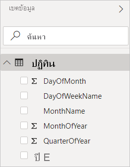
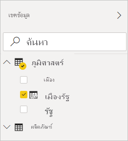

# สร้างคอลัมน์จากการคำนวณใน Power BI DesktopCreate calculated columns in Power BI Desktop
คุณสามารถใช้คอลัมน์จากการคำนวณเพื่อเพิ่มข้อมูลใหม่ลงในตารางที่มีอยู่แล้วในแบบจำลองของคุณWith calculated columns, you can add new data to a table already in your model. แต่แทนที่จะจัดทำคิวรีและโหลดค่าจากแหล่งข้อมูลลงในคอลัมน์ใหม่ของคุณ คุณสามารถสร้างสูตรนิพจน์การวิเคราะห์ข้อมูล (DAX) ที่กำหนดค่าของคอลัมน์ได้But instead of querying and loading values into your new column from a data source, you create a Data Analysis Expressions (DAX) formula that defines the column's values. ใน Power BI Desktop คอลัมน์จากการคำนวณถูกสร้างขึ้นโดยใช้คุณลักษณะคอลัมน์ใหม่ในมุมมอง **รายงาน**In Power BI Desktop, calculated columns are created by using the new column feature in **Report** view.

ซึ่งต่างจากคอลัมน์แบบกำหนดเองที่สร้างขึ้นเป็นส่วนหนึ่งของการคิวรีโดย **เพิ่มคอลัมน์แบบกำหนดเอง** ในเครื่องมือแก้ไขคิวรี คอลัมน์จากการคำนวณที่สร้างขึ้นในมุมมอง **รายงาน** หรือมุมมอง **ข้อมูล** จะอ้างอิงตามข้อมูลที่คุณได้โหลดลงในแบบจำลองแล้วUnlike custom columns that are created as part of a query by using **Add Custom Column** in Query Editor, calculated columns that are created in **Report** view or **Data** view are based on data you've already loaded into the model. ตัวอย่างเช่น คุณอาจเลือกเชื่อมค่าจากคอลัมน์ที่แตกต่างกันสองคอลัมน์ในตารางที่เกี่ยวข้องเข้าด้วยกันในตารางสองตารางที่แตกต่างกันแต่เกี่ยวข้องกัน ทำการบวกเพิ่มหรือแยกสตริงย่อยFor example, you might choose to concatenate values from two different columns in two different but related tables, do addition, or extract substrings.

คอลัมน์จากการคำนวณที่คุณสร้างขึ้นปรากฏในรายการ **เขตข้อมูล** เช่นเดียวกับเขตข้อมูลอื่น ๆ แต่คอลัมน์เหล่านี้จะมีไอคอนพิเศษที่แสดงว่าค่านั้นเป็นผลลัพธ์ของสูตรCalculated columns you create appear in the **Fields** list just like any other field, but they'll have a special icon showing its values are the result of a formula. คุณสามารถตั้งชื่อคอลัมน์ของคุณได้ตามต้องการ และเพิ่มคอลัมน์เหล่านั้นลงในการจัดรูปแบบการแสดงข้อมูลในรายงานเช่นเดียวกับเขตข้อมูลอื่น ๆYou can name your columns whatever you want, and add them to a report visualization just like other fields.

 
คอลัมน์จากการคำนวณจะคำนวณผลลัพธ์โดยใช้ DAX ซึ่งเป็นภาษาสูตรที่มีไว้เพื่อทำงานกับข้อมูลเชิงสัมพันธ์อย่างเช่นใน Power BI DesktopCalculated columns calculate results by using DAX, a formula language meant to work with relational data like in Power BI Desktop. DAX มีไลบรารีของฟังก์ชัน ตัวดำเนินการ และโครงสร้างมากกว่า 200DAX includes a library of over 200 functions, operators, and constructs. ซึ่งมีความยืดหยุ่นมากในการสร้างสูตรเพื่อคำนวณผลลัพธ์สำหรับการวิเคราะห์ข้อมูลใด ๆ ที่ต้องการIt provides immense flexibility in creating formulas to calculate results for just about any data analysis need. เมื่อต้องการเรียนรู้เพิ่มเติมเกี่ยวกับ DAX โปรดดูที่ [พื้นฐาน DAX ใน Power BI Desktop](desktop-quickstart-learn-dax-basics.md)To learn more about DAX, see [DAX basics in Power BI Desktop](desktop-quickstart-learn-dax-basics.md).

สูตร DAX จะคล้ายกับสูตร ExcelDAX formulas are similar to Excel formulas. อันที่จริงแล้ว DAX มีหลายฟังก์ชันที่เหมือนกันกับ ExcelIn fact, DAX has many of the same functions as Excel. อย่างไรก็ตาม ฟังก์ชัน DAX มีไว้เพื่อทำงานบนข้อมูลที่แบ่งเป็นส่วนๆ หรือกรองแบบมีการโต้ตอบในรายงาน เช่น ใน Power BI DesktopDAX functions, however, are meant to work over data interactively sliced or filtered in a report, like in Power BI Desktop. ใน Excel คุณสามารถมีสูตรที่แตกต่างกันสำหรับแต่ละแถวในตารางIn Excel, you can have a different formula for each row in a table. ใน Power BI เมื่อคุณสร้างสูตร DAX สำหรับคอลัมน์ใหม่ จะมีการคำนวณผลลัพธ์สำหรับทุกแถวในตารางIn Power BI, when you create a DAX formula for a new column, it will calculate a result for every row in the table. ค่าของคอลัมน์จะถูกคำนวณใหม่ตามที่จำเป็น เช่น เมื่อมีการรีเฟรชข้อมูลเบื้องต้นและมีการเปลี่ยนแปลงค่าColumn values are recalculated as necessary, like when the underlying data is refreshed and values have changed.

## มาลองดูตัวอย่างกันLet's look at an example
Jeff เป็นผู้จัดการฝ่ายจัดส่งสินค้าที่ Contoso และต้องการสร้างรายงานที่แสดงจำนวนการจัดส่งสินค้าไปที่เมืองต่าง ๆJeff is a shipping manager at Contoso, and wants to create a report showing the number of shipments to different cities. Jeff มีตาราง **ภูมิศาสตร์** ที่มีเขตข้อมูลแยกต่างหากสำหรับเมืองและรัฐJeff has a **Geography** table with separate fields for city and state. แต่ Jeff ต้องการให้รายงานของตนแสดงค่าเมืองและรัฐเป็นค่าเดียวบนแถวเดียวกันBut, Jeff wants their reports to show the city and state values as a single value on the same row. ในตอนนี้ ตาราง **ภูมิศาสตร์** ของเจฟฟ์ไม่มีเขตข้อมูลที่ต้องการRight now, Jeff's **Geography** table doesn't have the wanted field.

แต่ด้วยคอลัมน์จากการคำนวณ Jeff จึงสามารถเชื่อมข้อมูลเมืองจากคอลัมน์ **City** เข้ามาไว้ด้วยกันกับรัฐจากคอลัมน์ **State** ได้But with a calculated column, Jeff can put together the cities from the **City** column with the states from the **State** column.

Jeff คลิกขวาที่ตาราง **ภูมิศาสตร์** และจากนั้นก็คลิกที่ **คอลัมน์ใหม่**Jeff right clicks on the **Geography** table and then selects **New Column**. แล้ว Jeff จึงใส่สูตร DAX ดังต่อไปนี้ลงในแถบสูตร:Jeff then enters the following DAX formula into the formula bar:

สูตรนี้เพียงแค่สร้างคอลัมน์ใหม่ที่ชื่อว่า **CityState**This formula simply creates a new column named **CityState**. สำหรับแต่ละแถวในตาราง **ภูมิศาสตร์** ก็จะใช้ค่าจากคอลัมน์ **City** เพิ่มเครื่องหมายจุลภาคและช่องว่าง แล้วจึงเชื่อมค่าจากคอลัมน์ **State** เข้าไว้ด้วยกันFor each row in the **Geography** table, it takes values from the **City** column, adds a comma and a space, and then concatenates values from the **State** column.

ในตอนนี้ Jeff มีเขตข้อมูลที่ต้องการแล้วNow Jeff has the wanted field.

ตอนนี้ Jeff สามารถเพิ่มเขตข้อมูลในพื้นที่รายงานพร้อมกับจำนวนการจัดส่งสินค้าJeff can now add it to the report canvas along with the number of shipments. ด้วยความพยายามที่น้อยที่สุด ตอนนี้ Jeff มีเขตข้อมูล **CityState** ที่สามารถเพิ่มเพื่อจัดรูปแบบการแสดงข้อมูลไม่ว่าชนิดใดก็ตามได้With minimal effort, Jeff now has a **CityState** field that can be added to just about any type of visualization. เมื่อ Jeff สร้างแผนที่ใหม่ Power BI Desktop ก็จะทราบวิธีการอ่านค่าเมืองและรัฐในคอลัมน์ใหม่แล้วWhen Jeff creates a new map, Power BI Desktop already knows how to read the city and state values in the new column.

## ขั้นตอนถัดไปNext steps
ในส่วนนี้ เราจะแนะนำเกี่ยวกับคอลัมน์จากการคำนวณอย่างคร่าว ๆ เท่านั้นWe've only provided a quick introduction to calculated columns here. สำหรับข้อมูลเพิ่มเติม โปรดดูทรัพยากรต่อไปนี้:For more information, check out the following resources:

* หากต้องการดาวน์โหลดไฟล์ตัวอย่าง และดูบทเรียนทีละขั้นตอนเกี่ยวกับวิธีการสร้างคอลัมน์เพิ่มเติม โปรดดู[บทช่วยสอน สร้างคอลัมน์จากการคำนวณใน Power BI Desktop](desktop-tutorial-create-calculated-columns.md)To download a sample file and get step-by-step lessons on how to create more columns, see [Tutorial: Create calculated columns in Power BI Desktop](desktop-tutorial-create-calculated-columns.md)

* เมื่อต้องการเรียนรู้เพิ่มเติมเกี่ยวกับ DAX โปรดดูที่ [พื้นฐาน DAX ใน Power BI Desktop](desktop-quickstart-learn-dax-basics.md)To learn more about DAX, see [DAX basics in Power BI Desktop](desktop-quickstart-learn-dax-basics.md).

* เมื่อต้องการเรียนรู้เพิ่มเติมเกี่ยวกับคอลัมน์ที่คุณสร้างขึ้นเป็นส่วนหนึ่งของการคิวรี โปรดดูที่หัวข้อ **สร้างคอลัมน์แบบกำหนดเอง** ใน [งานการคิวรีทั่วไปใน Power BI Desktop](desktop-common-query-tasks.md)To learn more about columns you create as part of a query, see the **Create custom columns** section in [Common query tasks in Power BI Desktop.](desktop-common-query-tasks.md)  

