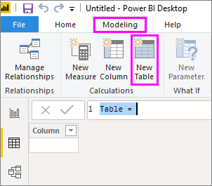

# <a name="create-calculated-tables-in-power-bi-desktop"></a><span data-ttu-id="67fd7-103">สร้างตารางจากการคำนวณใน Power BI Desktop</span><span class="sxs-lookup"><span data-stu-id="67fd7-103">Create calculated tables in Power BI Desktop</span></span>
<span data-ttu-id="67fd7-104">โดยส่วนใหญ่แล้ว คุณจะสร้างตารางโดยการนำเข้าข้อมูลไปยังแบบจำลองของคุณจากแหล่งข้อมูลภายนอก</span><span class="sxs-lookup"><span data-stu-id="67fd7-104">Most of the time, you create tables by importing data into your model from an external data source.</span></span> <span data-ttu-id="67fd7-105">แต่ *ตารางจากการคำนวณ* ช่วยให้คุณสามารถเพิ่มตารางใหม่โดยยึดตามข้อมูลที่คุณได้โหลดลงไปยังแบบจำลองแล้ว</span><span class="sxs-lookup"><span data-stu-id="67fd7-105">But *calculated tables* let you add new tables based on data you've already loaded into the model.</span></span> <span data-ttu-id="67fd7-106">แทนที่จะคิวรีและโหลดค่าจากแหล่งข้อมูลลงไปยังคอลัมน์ใหม่ในตาราง คุณสามารถสร้างสูตร [Data Analysis Expressions (DAX)](/dax/index) ที่ใช้กำหนดค่าของตารางได้</span><span class="sxs-lookup"><span data-stu-id="67fd7-106">Instead of querying and loading values into your new table's columns from a data source, you create a [Data Analysis Expressions (DAX)](/dax/index) formula to define the table's values.</span></span>

<span data-ttu-id="67fd7-107">DAX เป็นภาษาสูตรสำหรับการทำงานกับข้อมูลเชิงสัมพันธ์เช่นเดียวกับใน Power BI Desktop</span><span class="sxs-lookup"><span data-stu-id="67fd7-107">DAX is a formula language for working with relational data, like in Power BI Desktop.</span></span> <span data-ttu-id="67fd7-108">DAX มีไลบรารีที่มีมากกว่า 200 ฟังก์ชัน ตัวดำเนินการ และรหัสโครง สร้างที่ทำให้มีความยืดหยุ่นมากในการสร้างสูตรเพื่อคำนวณผลลัพธ์เฉพาะสำหรับความต้องการที่เกี่ยวกับการวิเคราะห์ข้อมูลใดๆ</span><span class="sxs-lookup"><span data-stu-id="67fd7-108">DAX includes a library of over 200 functions, operators, and constructs, providing immense flexibility in creating formulas to calculate results for just about any data analysis need.</span></span> <span data-ttu-id="67fd7-109">ตารางจากการคำนวณเป็นตัวเลือกที่ดีที่สุดสำหรับการคำนวณระดับกลาง และข้อมูลที่คุณต้องการจัดเก็บไว้เป็นส่วนหนึ่งของแบบจำลอง แทนที่จะคำนวณใหม่ตลอดหรือเป็นผลลัพธ์ของคิวรี</span><span class="sxs-lookup"><span data-stu-id="67fd7-109">Calculated tables are best for intermediate calculations and data you want to store as part of the model, rather than calculating on the fly or as query results.</span></span> <span data-ttu-id="67fd7-110">ตัวอย่างเช่น คุณอาจเลือก *ยูเนียน* หรือ *cross join* ตารางสองตารางที่มีอยู่</span><span class="sxs-lookup"><span data-stu-id="67fd7-110">For example, you might choose to *union* or *cross join* two existing tables.</span></span>

<span data-ttu-id="67fd7-111">เช่นเดียวกับตาราง Power BI Desktop อื่น ๆ ตารางจากการคำนวณสามารถมีความสัมพันธ์กับตารางอื่นได้</span><span class="sxs-lookup"><span data-stu-id="67fd7-111">Just like other Power BI Desktop tables, calculated tables can have relationships with other tables.</span></span> <span data-ttu-id="67fd7-112">คอลัมน์ของตารางจากการคำนวณมีชนิดของข้อมูล การจัดรูปแบบ และสามารถจัดประเภทข้อมูลได้</span><span class="sxs-lookup"><span data-stu-id="67fd7-112">Calculated table columns have data types, formatting, and can belong to a data category.</span></span> <span data-ttu-id="67fd7-113">คุณสามารถตั้งชื่อคอลัมน์ของคุณได้ตามต้องการ และเพิ่มคอลัมน์เหล่านั้นลงในการจัดรูปแบบการแสดงข้อมูลในรายงานเช่นเดียวกับเขตข้อมูลอื่น ๆ</span><span class="sxs-lookup"><span data-stu-id="67fd7-113">You can name your columns whatever you want, and add them to report visualizations just like other fields.</span></span> <span data-ttu-id="67fd7-114">ตารางจากการคำนวณได้จะรับการคำนวณใหม่หากมีตารางใดที่ถูกดึงข้อมูลออกมาได้รับการรีเฟรชหรืออัปเดต เว้นแต่ว่าตารางจะใช้ข้อมูลจากตารางที่ใช้ DirectQuery ในกรณีที่มี DirectQuery ตารางจะแสดงการเปลี่ยนแปลงเมื่อมีการรีเฟรชชุดข้อมูลเท่านั้น</span><span class="sxs-lookup"><span data-stu-id="67fd7-114">Calculated tables are recalculated if any of the tables they pull data from are refreshed or updated, unless the table uses data from a table that uses DirectQuery; in the case with DirectQuery, the table will only reflect the changes once the dataset has been refreshed.</span></span> <span data-ttu-id="67fd7-115">ถ้าตารางจำเป็นต้องใช้ DirectQuery จะเป็นการดีที่สุดที่จะมีตารางจากการคำนวณใน DirectQuery ด้วย</span><span class="sxs-lookup"><span data-stu-id="67fd7-115">If a table needs to use DirectQuery, it's best to have the calculated table in DirectQuery as well.</span></span>

## <a name="create-a-calculated-table"></a><span data-ttu-id="67fd7-116">สร้างตารางจากการคำนวณ</span><span class="sxs-lookup"><span data-stu-id="67fd7-116">Create a calculated table</span></span>

<span data-ttu-id="67fd7-117">คุณสร้างตารางจากการคำนวณโดยใช้คุณลักษณะ **ตารางใหม่** ในมุมมองรายงานหรือมุมมองข้อมูลของ Power BI Desktop</span><span class="sxs-lookup"><span data-stu-id="67fd7-117">You create calculated tables by using the **New Table** feature in Report View or Data View of Power BI Desktop.</span></span>

<span data-ttu-id="67fd7-118">ตัวอย่างเช่น สมมติว่าคุณเป็นผู้จัดการฝ่ายบุคคลที่มีตารางของ **พนักงานในภาคตะวันตกเฉียงเหนือ** และตารางอื่นของ **พนักงานในภาคตะวันตกเฉียงใต้**</span><span class="sxs-lookup"><span data-stu-id="67fd7-118">For example, imagine you're a personnel manager who has a table of **Northwest Employees** and another table of **Southwest Employees**.</span></span> <span data-ttu-id="67fd7-119">คุณต้องการรวมสองตารางเป็นตารางเดียวที่ชื่อว่า **พนักงานในภูมิภาคตะวันตก**</span><span class="sxs-lookup"><span data-stu-id="67fd7-119">You want to combine the two tables into a single table called **Western Region Employees**.</span></span>

<span data-ttu-id="67fd7-120">**พนักงานในภาคตะวันตกเฉียงเหนือ**</span><span class="sxs-lookup"><span data-stu-id="67fd7-120">**Northwest Employees**</span></span>

 

<span data-ttu-id="67fd7-122">**พนักงานในภาคตะวันตกเฉียงใต้**</span><span class="sxs-lookup"><span data-stu-id="67fd7-122">**Southwest Employees**</span></span>

 

<span data-ttu-id="67fd7-124">ในมุมมองรายงานหรือมุมมองข้อมูลของ Power BI Desktop ในกลุ่ม **การคำนวณ** ของแท็บ **การสร้างแบบจำลอง** เลือก **ตารางใหม่**</span><span class="sxs-lookup"><span data-stu-id="67fd7-124">In Report View or Data View of Power BI Desktop, in the **Calculations** group of the **Modeling** tab, select **New Table**.</span></span> <span data-ttu-id="67fd7-125">ซึ่งสามารถทำได้ง่ายขึ้นเล็กน้อยเนื่องจากว่าคุณสามารถดูตารางจากการคำนวณใหม่ของคุณได้ทันที</span><span class="sxs-lookup"><span data-stu-id="67fd7-125">It's a bit easier to do in Data View, because then you can immediately see your new calculated table.</span></span>

 

<span data-ttu-id="67fd7-127">ใส่สูตรต่อไปนี้ในแถบสูตร:</span><span class="sxs-lookup"><span data-stu-id="67fd7-127">Enter the following formula in the formula bar:</span></span>

```dax
Western Region Employees = UNION('Northwest Employees', 'Southwest Employees')
```

<span data-ttu-id="67fd7-128">ตารางใหม่ที่ชื่อว่า **พนักงานในภูมิภาคตะวันตก** ถูกสร้างขึ้นและปรากฏขึ้นเหมือนกับตารางอื่น ๆ ในบานหน้าต่าง **เขตข้อมูล**</span><span class="sxs-lookup"><span data-stu-id="67fd7-128">A new table named **Western Region Employees** is created, and appears just like any other table in the **Fields** pane.</span></span> <span data-ttu-id="67fd7-129">คุณสามารถสร้างความสัมพันธ์กับตารางอื่น เพิ่มหน่วยวัดและคอลัมน์จากการคำนวณ และเพิ่มเขตข้อมูลลงในรายงานได้เช่นเดียวกับตารางอื่น</span><span class="sxs-lookup"><span data-stu-id="67fd7-129">You can create relationships to other tables, add measures and calculated columns, and add the fields to reports just like with any other table.</span></span>

 

 

## <a name="functions-for-calculated-tables"></a><span data-ttu-id="67fd7-132">ฟังก์ชันสำหรับตารางที่มีการคำนวณ</span><span class="sxs-lookup"><span data-stu-id="67fd7-132">Functions for calculated tables</span></span>

<span data-ttu-id="67fd7-133">คุณสามารถกำหนดตารางจากการคำนวณโดยนิพจน์ DAX ใดก็ได้ที่แสดงค่าเป็นตาราง รวมถึงการอ้างอิงแบบง่ายไปยังตารางอื่น</span><span class="sxs-lookup"><span data-stu-id="67fd7-133">You can define a calculated table by any DAX expression that returns a table, including a simple reference to another table.</span></span> <span data-ttu-id="67fd7-134">ตัวอย่างเช่น:</span><span class="sxs-lookup"><span data-stu-id="67fd7-134">For example:</span></span>

```dax
New Western Region Employees = 'Western Region Employees'
```

<span data-ttu-id="67fd7-135">บทความนี้มีเพียงคำแนะนำเบื้องต้นเกี่ยวกับตารางจากการคำนวณเท่านั้น</span><span class="sxs-lookup"><span data-stu-id="67fd7-135">This article provides only a quick introduction to calculated tables.</span></span> <span data-ttu-id="67fd7-136">คุณสามารถใช้ตารางที่มีการคำนวณ ด้วย DAX เพื่อแก้ปัญหาการวิเคราะห์ได้มากมาย</span><span class="sxs-lookup"><span data-stu-id="67fd7-136">You can use calculated tables with DAX to solve many analytical problems.</span></span> <span data-ttu-id="67fd7-137">ฟังก์ชันต่อไปนี้เป็นฟังก์ชันของตาราง DAX ทั่วไปที่คุณอาจใช้:</span><span class="sxs-lookup"><span data-stu-id="67fd7-137">Here are some of the more common DAX table functions you might use:</span></span>

* <span data-ttu-id="67fd7-138">DISTINCT</span><span class="sxs-lookup"><span data-stu-id="67fd7-138">DISTINCT</span></span>
* <span data-ttu-id="67fd7-139">VALUES</span><span class="sxs-lookup"><span data-stu-id="67fd7-139">VALUES</span></span>
* <span data-ttu-id="67fd7-140">CROSSJOIN</span><span class="sxs-lookup"><span data-stu-id="67fd7-140">CROSSJOIN</span></span>
* <span data-ttu-id="67fd7-141">UNION</span><span class="sxs-lookup"><span data-stu-id="67fd7-141">UNION</span></span>
* <span data-ttu-id="67fd7-142">NATURALINNERJOIN</span><span class="sxs-lookup"><span data-stu-id="67fd7-142">NATURALINNERJOIN</span></span>
* <span data-ttu-id="67fd7-143">NATURALLEFTOUTERJOIN</span><span class="sxs-lookup"><span data-stu-id="67fd7-143">NATURALLEFTOUTERJOIN</span></span>
* <span data-ttu-id="67fd7-144">INTERSECT</span><span class="sxs-lookup"><span data-stu-id="67fd7-144">INTERSECT</span></span>
* <span data-ttu-id="67fd7-145">CALENDAR</span><span class="sxs-lookup"><span data-stu-id="67fd7-145">CALENDAR</span></span>
* <span data-ttu-id="67fd7-146">CALENDARAUTO</span><span class="sxs-lookup"><span data-stu-id="67fd7-146">CALENDARAUTO</span></span>

<span data-ttu-id="67fd7-147">ดู[การอ้างอิงฟังก์ชัน DAX](/dax/dax-function-reference) สำหรับฟังก์ชันเหล่านี้และฟังก์ชันอื่น ๆ ของ DAX ที่แสดงค่าเป็นตาราง</span><span class="sxs-lookup"><span data-stu-id="67fd7-147">See the [DAX Function Reference](/dax/dax-function-reference) for these and other DAX functions that return tables.</span></span>

