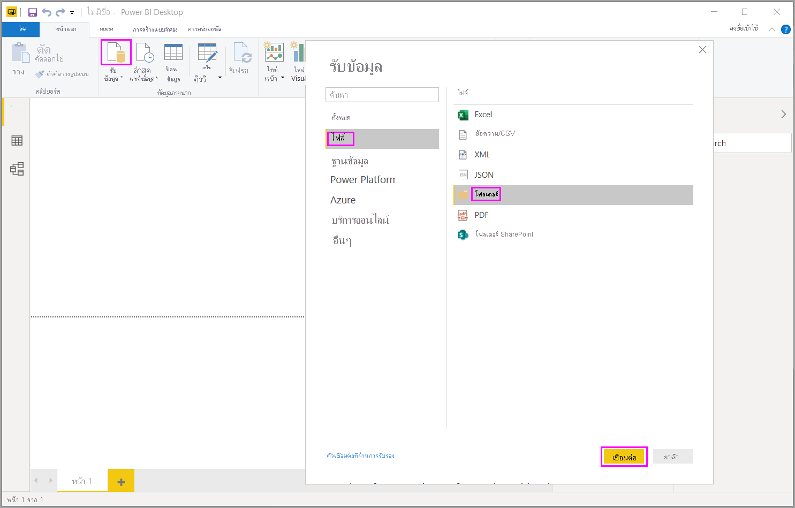
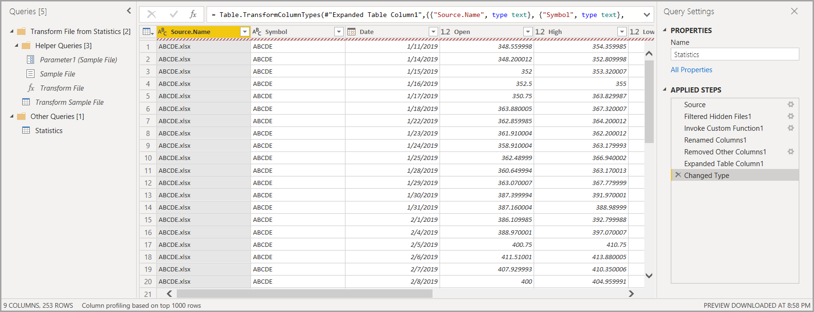

# รวมไฟล์ (ไบนารี) ใน Power BI DesktopCombine files (binaries) in Power BI Desktop

นี่เป็นวิธีการทรงพลังในการนำเข้าข้อมูลสู่ **Power BI Desktop**: ถ้าคุณมีไฟล์หลายไฟล์ที่มีเค้าร่างเดียวกัน ให้รวมไฟล์เหล่านั้นลงในตารางแบบลอจิคัลเดียวHere's a powerful approach to importing data into **Power BI Desktop**: If you have multiple files that have the same schema, combine them into a single logical table. วิธีการยอดนิยมนี้ได้รับการปรับให้มีความสะดวกสบาย และใช้ได้อย่างกว้างขว้างมากขึ้นThis popular technique has been made more convenient and more expansive.

เพื่อเริ่มขั้นตอนการรวมไฟล์จากโฟลเดอร์เดียวกัน ให้เลือก **รับข้อมูล** และเลือก **ไฟล์** > **โฟลเดอร์** แล้วจึงเลือก **เชื่อมต่อ**To start the process of combining files from the same folder, select **Get Data**, choose **File** > **Folder**, and then select **Connect**.

ใส่เส้นทางของโฟลเดอร์ เลือก **ตกลง** จากนั้นเลือก **แปลงข้อมูล** เพื่อดูไฟล์ของโฟลเดอร์ในตัวแก้ไข Power QueryEnter the folder path, select **OK**, and then select **Transform Data** to see the folder's files in Power Query Editor.

## รูปแบบการรวมไฟล์Combine files behavior

เมื่อต้องการรวมไฟล์ไบนารีในตัวแก้ไข Power Query ให้เลือก **เนื้อหา** (ป้ายชื่อคอลัมน์แรก) และเลือก **หน้าแรก** > **รวมไฟล์**To combine binary files in Power Query Editor, select **Content** (the first column label) and select **Home** > **Combine Files**. หรือเพียงคุณเลือกไอคอน **รวมไฟล์** ที่อยู่ข้าง **เนื้อหา**Or you can just select the **Combine Files** icon next to **Content**.

*รวมไฟล์* จะมีการดำเนินการดังนี้:The *combine files* transform behaves as follows:

* การแปลงไฟล์รวมจะวิเคราะห์แต่ละไฟล์ที่นำเข้าเพื่อพิจารณารูปแบบไฟล์ที่ถูกต้องในการใช้งาน เช่น *ข้อความ* *เวิร์กบุ๊ก Excel* หรือ *ไฟล์ JSON*The combine files transform analyzes each input file to determine the correct file format to use, such as *text*, *Excel workbook*, or *JSON file*.
* การแปลงจะให้คุณเลือกวัตถุที่ระบุจากไฟล์แรก เช่น เวิร์กบุ๊ก Excel ที่จะดึงข้อมูลThe transform allows you to select a specific object from the first file, such as an Excel workbook, to extract.
  
  
* จากนั้นการแปลงไฟล์รวมจะใช้การดำเนินการเหล่านี้โดยอัตโนมัติ:The combine files transform then automatically takes these actions:
  
  * สร้างคิวรีต้นแบบที่ดำเนินการกับข้อมูลทุกขั้นตอนกับไฟล์เดียวCreates an example query that performs all the required extraction steps in a single file.
  * สร้างการ *การสอบถามฟังก์ชัน* ที่มีไฟล์ไบนารีเป็นพารามิเตอร์ไปยัง *คิวรีต้นแบบ*Creates a *function query* that parameterizes the file/binary input to the *exemplar query*. คิวรีต้นแบบและการสอบถามฟังก์ชัน มีการเชื่อมโยงกัน เพื่อให้เปลี่ยนแปลงในคิวรีต้นแบบ สะท้อนมาในแบบสอบถามฟังก์ชันThe exemplar query and the function query are linked, so that changes to the exemplar query are reflected in the function query.
  * ใช้  *ฟังก์ชันคิวรี* กับคิวรีเดิมที่มีการป้อนข้อมูลไบนารี เช่น คิวรี *โฟลเดอร์* Applies the *function query* to the original query with input binaries, such as the *Folder* query. ซึ่งจะใช้ฟังก์ชันคิวรีสำหรับการนำเข้าข้อมูลไบนารีในแต่ละแถว จากนั้นจะขยายการแยกข้อมูลที่เป็นผลลัพธ์เป็นคอลัมน์ระดับบนสุดIt applies the function query for binary inputs on each row, then expands the resulting data extraction as top-level columns.

    

> [!NOTE]
> ขอบเขตรายการที่เลือกของคุณในเวิร์กบุ๊ก Excel จะมีผลต่อรูปแบบของการรวมไบนารี่The scope of your selection in an Excel workbook will affect the behavior of combine binaries. เช่น คุณสามารถเลือกเวิร์กชีตเพื่อรวมเวิร์กชีตดังกล่าว หรือเลือกรากเพื่อรวมไฟล์ทั้งหมดFor example, you can select a specific worksheet to combine that worksheet, or select the root to combine the full file. การเลือกโฟลเดอร์เป็นการรวมไฟล์ที่พบในโฟลเดอร์ดังกล่าวSelecting a folder combines the files found in that folder. 

ด้วยการทำงานของการรวมไฟล์ คุณสามารถรวมไฟล์ทั้งหมดภายในโฟลเดอร์ที่ระบุได้อย่างง่ายดาย ตราบใดที่มีชนิดไฟล์และโครงสร้าง (เช่นมีคอลัมน์เดียวกัน) เดียวกันWith the behavior of combine files, you can easily combine all files within a given folder if they have the same file type and structure (such as the same columns).

นอกจากนี้ คุณสามารถใช้ขั้นตอนการแปลงหรือดึงข้อมูลเพิ่มเติม ได้โดยปรับเปลี่ยนคิวรีต้นแบบที่สร้างขึ้นโดยอัตโนมัติ โดยไม่ต้องกังวลเกี่ยวกับขั้นตอนการแก้ไขหรือการสร้างฟังก์ชันคิวรีเพิ่มเติมIn addition, you can easily apply additional transformation or extraction steps by modifying the automatically created exemplar query, without having to worry about modifying or creating additional function query steps. การเปลี่ยนแปลงใดๆ กับคิวรีต้นแบบ จะถูกสร้างขึ้นในฟังก์ชันคิวรีที่เชื่อมโยงกันโดยอัตโนมัติAny changes to the exemplar query are automatically generated in the linked function query.

## ขั้นตอนถัดไปNext steps

คุณสามารถเชื่อมต่อข้อมูลทุกรูปแบบได้โดยใช้ Power BI DesktopYou can connect to all sorts of data using Power BI Desktop. สำหรับข้อมูลเพิ่มเติมเกี่ยวกับแหล่งที่มาข้อมูล โปรดดูทรัพยากรต่อไปนี้:For more information on data sources, see the following resources:

* [Power BI Desktop คืออะไรWhat is Power BI Desktop?](../fundamentals/desktop-what-is-desktop.md)
* [แหล่งข้อมูลใน Power BI DesktopData sources in Power BI Desktop](../connect-data/desktop-data-sources.md)
* [จัดรูปร่างและรวมข้อมูลด้วย Power BI DesktopShape and combine data with Power BI Desktop](../connect-data/desktop-shape-and-combine-data.md)
* [เชื่อมต่อกับไฟล์ CSV ใน Power BI DesktopConnect to CSV files in Power BI Desktop](../connect-data/desktop-connect-csv.md)
* [ใส่ข้อมูลลงใน Power BI Desktop โดยตรงEnter data directly into Power BI Desktop](../connect-data/desktop-enter-data-directly-into-desktop.md)
