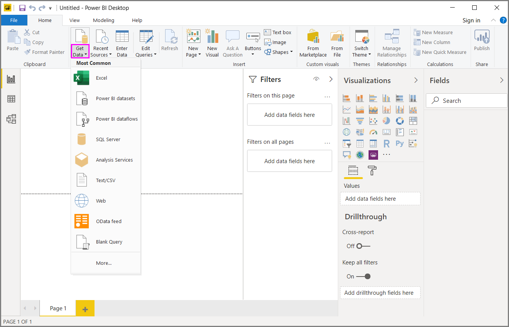
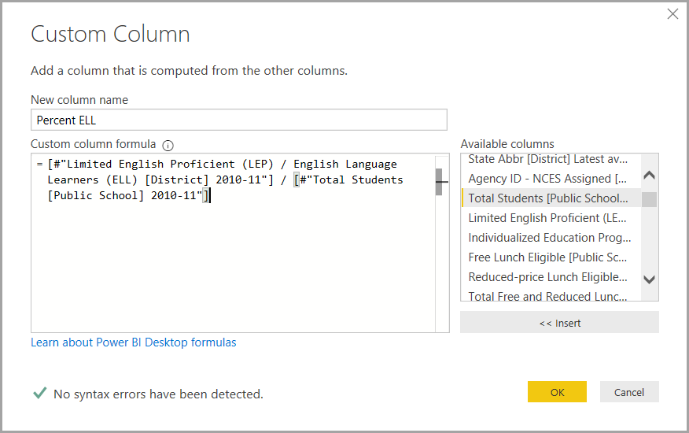

# ใช้งานคิวรีที่ใช้บ่อยใน Power BI DesktopPerform common query tasks in Power BI Desktop

ในหน้าต่างตัวแก้ไข  Power Query ของ Power BI Desktop มีงานที่ใช้บ่อยอยู่จำนวนหนึ่งIn the Power Query Editor window of Power BI Desktop, there are a handful of commonly used tasks. บทความนี้จะสาธิตงานที่ใช้บ่อยเหล่านั้น และให้ลิงก์สำหรับข้อมูลเพิ่มเติมThis article demonstrates those common tasks and provides links for additional information.

งานคิวรีที่ใช้บ่อยซึ่งจะสาธิตที่นี่ คือ:The common query tasks demonstrated here are:

* เชื่อมต่อกับข้อมูลConnect to data
* จัดรูปร่างและรวมข้อมูลShape and combine data
* จัดกลุ่มแถวGroup rows
* Pivot คอลัมน์Pivot columns
* สร้างคอลัมน์แบบกำหนดเองCreate custom columns
* คิวรีสูตรQuery formulas

เราจะใช้การเชื่อมต่อข้อมูลบางตัวเพื่อทำงานเหล่านี้ให้สำเร็จWe’ll use a few data connections to complete these tasks. เรามีข้อมูลให้คุณดาวน์โหลดหรือการเชื่อมต่อ กรณีที่คุณต้องการลองขั้นตอนเหล่านี้ด้วยตนเองThe data is available for you to download or connect to, in case you want to step through these tasks yourself.

การเชื่อมต่อข้อมูลแรก คือ [เวิร์กบุ๊ก Excel](https://download.microsoft.com/download/5/7/0/5701F78F-C3C2-450C-BCCE-AAB60C31051D/PBI_Edu_ELSi_Enrollment_v2.xlsx) ซึ่งสามารถดาวน์โหลดและบันทึกลงในเครื่องของคุณได้The first data connection is [an Excel workbook](https://download.microsoft.com/download/5/7/0/5701F78F-C3C2-450C-BCCE-AAB60C31051D/PBI_Edu_ELSi_Enrollment_v2.xlsx), which you can download and save locally. นอกจากนี้ยังมีแหล่งข้อมูลเว็บที่ใช้ในบทความ Power BI Desktop อื่นๆ:The other is a Web resource that's also used in other Power BI Desktop articles:

<https://www.bankrate.com/retirement/best-and-worst-states-for-retirement/>

งานคิวรีที่ใช้บ่อยเริ่มต้นที่ขั้นตอนที่จำเป็นสำหรับการเชื่อมต่อแหล่งข้อมูลทั้งสองนั้นCommon query tasks begin at the steps necessary to connect to both of those data sources.

## เชื่อมต่อกับข้อมูลConnect to data

เพื่อเชื่อมต่อกับข้อมูลใน Power BI Desktop ให้เลือก **หน้าหลัก** จากนั้น **รับข้อมูล**To connect to data in Power BI Desktop, select **Home** and then **Get Data**. Power BI Desktop จะแสดงเมนูให้เห็นแหล่งข้อมูลที่ใช้บ่อยที่สุดPower BI Desktop presents a menu with the most common data sources. สำหรับรายการทั้งหมดของแหล่งข้อมูลซึ่ง Power BI Desktopสามารถเชื่อมต่อได้  เลือก **เพิ่มเติม** ที่ท้ายสุดของเมนูFor a complete list of data sources to which Power BI Desktop can connect, select **More** at the end of the menu. สำหรับข้อมูลเพิ่มเติม ดู [แหล่งข้อมูลใน Power BI Desktop](../connect-data/desktop-data-sources.md)For more information, see [Data sources in Power BI Desktop](../connect-data/desktop-data-sources.md).

เพื่อเริ่มต้น เลือก **Excel** จากนั้นระบุเวิร์กบุ๊ก Excel ที่กล่าวถึงไปก่อนหน้า แล้วจึงเลือก **เปิด**To start, select **Excel**, specify the Excel workbook mentioned earlier, and then select **Open**. คิวรีจะตรวจสอบเวิร์กบุ๊ก แล้วแสดงข้อมูลที่พบในกล่องโต้ตอบ **ตัวนำทาง** หลังจากที่คุณเลือกตารางQuery inspects the workbook, then presents the data it found in the **Navigator** dialog box after you select a table.

คุณสามารถเลือก **แปลงข้อมูล** เพื่อแก้ไข ปรับเปลี่ยน  หรือ *จัดรูปร่าง* ข้อมูลก่อนที่จะโหลดลงใน Power BI Desktop ได้You can select **Transform Data** to edit, adjust, or *shape*, the data before you load it into Power BI Desktop. การแก้ไขจะมีประโยชน์โดยเฉพาะอย่างยิ่งเมื่อคุณทำงานกับชุดข้อมูลขนาดใหญ่ที่คุณต้องการตัดออกก่อนการโหลดEditing is especially useful when you work with large datasets that you want to pare down before loading.

การเชื่อมต่อกับข้อมูลชนิดอื่นๆ เป็นเรื่องง่ายพอกันConnecting to different types of data is as easy. คุณยังต้องการเชื่อมต่อไปยังแหล่งข้อมูลเว็บYou also want to connect to a Web resource. เลือก **รับข้อมูล** > **เพิ่มเติม** จากนั้นเลือก **อื่นๆ** > **เว็บ** > **เชื่อมต่อ**Choose **Get Data** > **More**, and then select **Other** > **Web** > **Connect**.

กล่องโต้ตอบ **จากเว็บ** จะปรากฏขึ้น ซึ่งคุณสามารถกรอก URL ของหน้าเว็บลงไปได้The **From Web** dialog box appears, where you can type in the URL of the Web page.

เลือก **ตกลง**Select **OK**. เช่นเดียวกัน Power BI Desktop จะตรวจสอบข้อมูลหน้าเว็บและแสดงตัวเลือกการแสดงตัวอย่างในกล่องโต้ตอบ **ตัวนำทาง**Like before, Power BI Desktop inspects the Web page data and shows preview options in the **Navigator** dialog box. เมื่อคุณเลือกตาราง จะแสดงตัวอย่างของข้อมูลWhen you select a table, it displays a preview of the data.

การเชื่อมต่อข้อมูลอื่น ๆ ก็ทำงานคล้ายกันOther data connections are similar. ถ้าจำเป็นต้องรับรองความถูกต้องเพื่อทำการเชื่อมต่อข้อมูล Power BI Desktop จะถามให้คุณใส่ข้อมูลประจำตัวIf authentication is required to make a data connection, Power BI Desktop prompts you for the appropriate credentials.

สำหรับการสาธิตแต่ละขั้นตอนของการเชื่อมต่อข้อมูลใน Power BI Desktop ดู [เชื่อมต่อข้อมูลใน Power BI Desktop](../connect-data/desktop-connect-to-data.md)For a step-by-step demonstration of connecting to data in Power BI Desktop, see [Connect to data in Power BI Desktop](../connect-data/desktop-connect-to-data.md).

## จัดรูปร่างและรวมข้อมูลShape and combine data

คุณสามารถจัดรูปร่างและรวมข้อมูลได้อย่างง่ายดายด้วยตัวแก้ไข Power QueryYou can easily shape and combine data with Power Query Editor. ส่วนนี้จะให้ตัวอย่างสองสามตัวว่าคุณจะจัดรูปร่างข้อมูลได้อย่างไรThis section includes a few examples of how you can shape data. สำหรับการสาธิตแบบครบถ้วนเพิ่มเติมของการจัดรูปร่างและรวมข้อมูล ดู [จัดรูปร่างและรวมข้อมูลด้วย Power BI Desktop](../connect-data/desktop-shape-and-combine-data.md)For a more complete demonstration of shaping and combining data, see [Shape and combine Data with Power BI Desktop](../connect-data/desktop-shape-and-combine-data.md).

ในส่วนก่อนหน้านี้ คุณได้เชื่อมต่อชุดข้อมูลสองชุด: เวิร์กบุ๊ก Excel และแหล่งข้อมูลเว็บIn the previous section, you connected to two sets of data: an Excel workbook and a Web resource. หลังจากที่มีการโหลดข้อมูลไปในตัวแก้ไข Power Query แล้ว ให้เลือกคิวรีหน้าเว็บจากคิวรีที่พร้อมใช้งานในบานหน้าต่าง **คิวรี** ดังแสดงไว้ที่นี่:After the data is loaded in Power Query Editor, select the Web page query from the available queries in the **Queries** pane, as shown here:

การจัดรูปร่างข้อมูล หมายถึงการแปลงแหล่งข้อมูลให้อยู่ในฟอร์มและรูปแบบที่ตรงตามความต้องการของคุณWhen you shape data, you transform a data source into the form and format that meets your needs.

ในตัวแก้ไข Power Query สามารถพบหลายคำสั่ง ribbon และในเมนูบริบทIn Power Query Editor, many commands can be found in the ribbon, and in context menus. ตัวอย่างเช่น เมื่อคุณคลิกขวาที่คอลัมน์ เมนูบริบทจะให้คุณลบคอลัมน์ออกได้For example, when you right-click a column, the context menu lets you remove the column. นอกจากนี้คุณยังสามารถเลือกคอลัมน์จากนั้นเลือกปุ่ม **ลบคอลัมน์** จากแท็บ **หน้าแรก** ใน RibbonYou may also select a column and then select the **Remove Columns** button from the **Home** tab in the ribbon.

คุณสามารถจัดรูปร่างข้อมูลในหลากหลายวิธีในคิวรีนี้ได้You can shape the data in many other ways in this query. คุณอาจลบจำนวนแถวจากด้านบนหรือด้านล่างYou may remove any number of rows from the top or bottom. หรือคุณอาจเพิ่มคอลัมน์ แยกคอลัมน์ แทนที่ค่า และการจัดรูปร่างอื่นๆ ได้Or you may add columns, split columns, replace values, and do other shaping tasks. ด้วยคุณลักษณะเหล่านี้ คุณสามารถจัดการตัวแก้ไข Power Query เพื่อรับข้อมูลในแบบคุณต้องการWith these features, you can direct Power Query Editor to get the data how you want it.

## จัดกลุ่มแถวGroup rows

ในตัวแก้ไข Power Query คุณสามารถจัดกลุ่มค่าจากแถวจำนวนมากรวมเป็นค่าเดียวได้In Power Query Editor, you can group the values from many rows into a single value. คุณลักษณะนี้จะเป็นประโยชน์เมื่อทำการสรุปจำนวนผลิตภัณฑ์ที่เสนอ ยอดขายทั้งหมด หรือการนับจำนวนนักเรียนThis feature can be useful when summarizing the number of products offered, the total sales, or the count of students.

ในตัวอย่างนี้ คุณจะจัดกลุ่มในชุดข้อมูลการลงทะเบียนการศึกษาIn this example, you group rows in an education enrollment dataset. ข้อมูลมาจากเวิร์กบุ๊ก ExcelThe data is from the Excel workbook. มีการจัดรูปร่างในตัวแก้ไข Power Query เพื่อให้ได้เฉพาะคอลัมน์ที่คุณต้องการ เปลี่ยนชื่อตาราง และทำการแปลงอื่นๆIt's been shaped in Power Query Editor to get just the columns you need, rename the table, and make a few other transforms.

มาหาคำตอบกันว่าแต่ละรัฐมีหน่วยงานมากเท่าใดLet’s find out how many Agencies each state has. (หน่วยงานสามารถรวมถึงเขตโรงเรียน หน่วยงานการศึกษาอื่นๆ เช่น เขตพื้นที่บริการภูมิภาค และอีกมากมาย) เลือกคอลัมน์ **ID ของหน่วยงาน - NCES ที่ได้รับมอบหมาย \[เขต\]ปีล่าสุดที่มี** จากนั้นเลือกปุ่ม **จัดกลุ่มตาม** ในแท็บ **การแปลง** หรือแท็บ **หน้าแรก** ของ ribbon(Agencies can include school districts, other education agencies such as regional service districts, and more.) Select the **Agency ID - NCES Assigned \[District\] Latest available year** column, then select the **Group By** button in the **Transform** tab or the **Home** tab of the ribbon. (**จัดกลุ่มตาม** พร้อมใช้งานในทั้งสองแท็บ)(**Group By** is available in both tabs.)

กล่องโต้ตอบ **จัดกลุ่มตาม** จะปรากฏขึ้นThe **Group By** dialog box appears. เมื่อตัวแก้ไข Power Query จัดกลุ่มแถว จะมีการสร้างคอลัมน์ใหม่เพื่อวางผลลัพธ์จากการ **จัดกลุ่มตาม** When Power Query Editor groups rows, it creates a new column into which it places the **Group By** results. คุณสามารถปรับเปลี่ยนการดำเนินการของ **จัดกลุ่มตาม** ดังต่อไปนี้:You can adjust the **Group By** operation in the following ways:

1. รายการแบบดรอปดาวน์ที่ไม่มีป้ายชื่อจะระบุคอลัมน์ที่จะจัดกลุ่มThe unlabeled dropdown list specifies the column to be grouped. ตัวแก้ไข Power Query ตั้งค่าเริ่มต้นนี้ไปยังคอลัมน์ที่เลือกไว้ แต่คุณสามารถเปลี่ยนเป็นคอลัมน์ใดก็ได้ในตารางPower Query Editor defaults this value to the selected column, but you can change it to be any column in the table.
2. **ชื่อคอลัมน์ใหม่**: ตัวแก้ไข Power Query จะแนะนำชื่อสำหรับคอลัมน์ใหม่ ตามการดำเนินการที่จะใช้จัดกลุ่มคอลัมน์ **New column name**: Power Query Editor suggests a name for the new column, based on the operation it applies to the column being grouped. แต่คุณก็สามารถตั้งชื่อคอลัมน์ใหม่เป็นอะไรก็ได้ตามที่คุณต้องการYou can name the new column anything you want, though.
3. **การดำเนินการ**: คุณอาจเลือกการดำเนินการที่ตัวแก้ไข Power Query เช่น **ผลรวม** **ค่าเฉลี่ย** หรือ **นับจำนวนแถวที่แตกต่างกัน****Operation**: You may choose the operation that Power Query Editor applies, such as **Sum**, **Median**, or **Count Distinct Rows**. ค่าเริ่มต้นคือ **นับจำนวนแถว**The default value is **Count Rows**.
4. **เพิ่มการจัดกลุ่ม** และ **เพิ่มการรวมกลุ่ม**: ปุ่มเหล่านี้จะพร้อมใช้งานเฉพาะเมื่อคุณเลือกตัวเลือก **ขั้นสูง****Add grouping** and **Add aggregation**: These buttons are available only if you select the **Advanced** option. ในการดำเนินการเดียว คุณสามารถสร้างการดำเนินการจัดกลุ่ม (การดำเนินการ **จัดกลุ่มตาม**) ในหลายคอลัมน์และสร้างการรวมหลายรายการโดยใช้ปุ่มเหล่านี้In a single operation, you can make grouping operations (**Group By** actions) on many columns and create several aggregations using these buttons.  ตัวแก้ไข Power Query จะสร้างคอลัมน์ใหม่ที่ดำเนินการบนหลายๆ คอลัมน์ โดยอิงตามที่คุณได้เลือกไว้ในกล่องโต้ตอบนี้Based on your selections in this dialog box, Power Query Editor creates a new column that operates on multiple columns.

เลือก **เพิ่มการจัดกลุ่ม** หรือ **เพิ่มการรวมกลุ่ม** เพื่อเพิ่มการจัดกลุ่มหรือการรวมกลุ่มไปยังการดำเนินการใน **จัดกลุ่มตาม**Select **Add grouping** or **Add aggregation** to add more groupings or aggregations to a **Group By** operation. ในการลบการจัดกลุ่มหรือการรวมกลุ่มออก ให้เลือกไอคอนจุดไข่ปลา ( **...** ) ทางด้านขวาของแถว จากนั้น **ลบ**To remove a grouping or aggregation, select the ellipsis icon (**...**) to the right of the row, and then **Delete**. เอาเลย ลองใช้การดำเนินการ **จัดกลุ่มตาม** โดยใช้ค่าเริ่มต้นเพื่อดูว่าจะเกิดอะไรขึ้นGo ahead and try the **Group By** operation using the default values to see what occurs.

เมื่อคุณเลือก **ตกลง** คิวรีจะดำเนินการ **จัดกลุ่มตาม** และส่งผลลัพธ์กลับมาWhen you select **OK**, Query does the **Group By** operation and returns the results. ว้าว ดูนั่นสิ – รัฐ โอไฮโอ เท็กซัส อิลลินอยส์ และแคลิฟอร์เนีย ตอนนี้แต่ละรัฐมีหน่วยงานมากกว่าหนึ่งพันหน่วยงานWhew, look at that – Ohio, Illinois, Texas, and California now each have over a thousand agencies!

และด้วยตัวแก้ไข Power Query คุณสามารถลบการดำเนินการปรับแต่งครั้งล่าสุดได้เสมอAnd with Power Query Editor, you can always remove the last shaping operation. ในบานหน้าต่าง **การตั้งค่าคิวรี** ภายใต้ขั้นตอน **ที่ใช้** เพียงแค่เลือก **X** ถัดจากขั้นตอนล่าสุดที่เสร็จสิ้นไปIn the **Query Settings** pane, under **Applied Steps**, just select the **X** next to the step recently completed. เอาเลย ลองทำดูSo go ahead and experiment. ถ้าคุณยังไม่ถูกใจกับผลลัพธ์ ให้ทำซ้ำขั้นตอน จนกว่าตัวแก้ไข Power Query จะจัดรูปร่างข้อมูลในแบบที่คุณต้องการIf you don’t like the results, redo the step until Power Query Editor shapes your data the way you want.

## Pivot คอลัมน์Pivot columns

คุณสามารถ pivot คอลัมน์และสร้างตารางที่มีค่าที่รวมกลุ่มแล้ว สำหรับค่าเฉพาะแต่ละค่าในคอลัมน์You can pivot columns and create a table that contains aggregated values for each unique value in a column. ตัวอย่างเช่น เพื่อหาว่ามีจำนวนสินค้าที่แตกต่างกันเท่าใดในแต่ละประเภทของสินค้า คุณสามารถสร้างตารางเพื่อหาคำตอบได้อย่างรวดเร็วFor example, to find out how many different products are in each product category, you can quickly create a table to do that.

มาลองดูตัวอย่างกันLet’s look at an example. ตาราง **Products_by_Categories** ต่อไปนี้ ได้รับการจัดรูปร่าง เพื่อแสดงเฉพาะผลิตภัณฑ์ที่มีเอกลักษณ์แต่ละผลิตภัณฑ์ (ตามชื่อ) และประเภทที่ผลิตภัณฑ์ถูกจัดเอาไว้The following **Products_by_Categories** table has been shaped to only show each unique product (by name), and which category each product falls under. เพื่อสร้างตารางใหม่ที่แสดงการนับจำนวนผลิตภัณฑ์ในแต่ละประเภท (ตามคอลัมน์ **CategoryName**) เลือกคอลัมน์นั้น แล้วเลือก **แปลง** > **คอลัมน์ Pivot**To create a new table that shows a count of products for each category (based on the **CategoryName** column), select the column, then select **Transform** > **Pivot Column**.

กล่องโต้ตอบ **Pivot คอลัมน์** จะปรากฏขึ้น เพื่อให้คุณทราบว่าค่าของคอลัมน์ใดที่จะนำไปใช้สร้างคอลัมน์ใหม่ (1)The **Pivot Column** dialog box appears, letting you know which column’s values will be used to create new columns (1). (หากชื่อคอลัมน์ **CategoryName** ที่คุณต้องการไม่ปรากฏขึ้น ให้เลือกจากรายการดรอปดาวน์ เมื่อคุณขยาย **ตัวเลือกขั้นสูง** (2) คุณสามารถเลือกฟังก์ชันที่จะนำไปใช้กับค่าที่รวมกลุ่มได้ (3)(If the wanted column name of **CategoryName** isn't shown, select it from the dropdown list.) When you expand **Advanced options** (2), you can select the function that will be applied to the aggregated values (3).

เมื่อคุณเลือก **ตกลง** คิวรีจะแสดงตารางตามคำสั่งการแปลงที่ให้ไว้ในกล่องโต้ตอบ **คอลัมน์ Pivot**When you select **OK**, Query displays the table according to the transform instructions provided in the **Pivot Column** dialog box.

## สร้างคอลัมน์แบบกำหนดเองCreate custom columns

ในตัวแก้ไข Power Query คุณสามารถสร้างสูตรแบบกำหนดเองที่ทำงานได้ในหลายคอลัมน์ในตารางของคุณIn Power Query Editor, you can create custom formulas that operate on multiple columns in your table. จากนั้นคุณจึงวางผลลัพธ์จากสูตรเหล่านั้นลงในคอลัมน์ (แบบกำหนดเอง) ใหม่Then you may place the results of such formulas into a new (custom) column. ตัวแก้ไข Power Query ทำให้การสร้างคอลัมน์แบบกำหนดเองเป็นไปได้ง่ายขึ้นPower Query Editor makes it easy to create custom columns.

ด้วยข้อมูลในเวิร์กบุ๊ก Excel ในตัวแก้ไข Power Query ไปที่แท็บ **เพิ่มคอลัมน์** บน ribbon แล้วเลือก **คอลัมน์แบบกำหนดเอง**With the Excel workbook data in Power Query Editor, go to the **Add Column** tab on the ribbon, and then select **Custom Column**.

กล่องโต้ตอบต่อไปนี้จะปรากฏขึ้น:The following dialog box appears. ในตัวอย่างนี้ เราจะสร้างคอลัมน์แบบกำหนดเองชื่อว่า *Percent ELL* ที่คำนวณเปอร์เซ็นต์ของนักเรียนทั้งหมดที่เป็นผู้เรียนภาษาอังกฤษ (English Language Learners, ELL)In this example, create a custom column called *Percent ELL* that calculates the percentage of total students that are English Language Learners (ELL).

เช่นเดียวกับขั้นตอนอื่นๆ ที่ใช้ในตัวแก้ไข Power Query ถ้าคอลัมน์แบบกำหนดเองใหม่นั้นไม่ได้ให้ข้อมูลที่คุณกำลังค้นหา คุณสามารถลบขั้นตอนออกได้As with any other applied step in Power Query Editor, if the new custom column doesn’t provide the data you’re looking for, you can delete the step. ในบานหน้าต่าง **การตั้งค่าคิวรี** ภายใต้ **ขั้นตอนที่ใช้** เพียงแค่เลือก **X** ถัดจากขั้นตอน **แบบกำหนดเองที่เพิ่ม**In the **Query Settings** pane, under **Applied Steps**, just select the **X** next to the **Added Custom** step.

## คิวรีสูตรQuery formulas

คุณสามารถแก้ไขขั้นตอนที่ตัวแก้ไข Power Query สร้างขึ้นได้You can edit the steps that Power Query Editor generates. คุณยังสามารถสร้างสูตรแบบกำหนดเองซึ่งช่วยให้คุณเชื่อมต่อและจัดรูปร่างข้อมูลของคุณได้แม่นยำยิ่งขึ้นYou can also create custom formulas, which let you connect to and shape your data more precisely. เมื่อใดก็ตามที่ตัวแก้ไข Power Query มีการดำเนินการกับข้อมูล สูตรที่เกี่ยวข้องกับการดำเนินการนั้นจะแสดงอยู่ในแถบสูตรWhenever Power Query Editor does an action on data, the formula associated with the action is displayed in the formula bar. เมื่อต้องการดูแถบสูตร ไปที่แท็บ **มุมมอง** ของ ribbon จากนั้นเลือก **แถบสูตร**To view the formula bar, go to the **View** tab of the ribbon, and then select **Formula Bar**.

ตัวแก้ไข Power Query จะเก็บขั้นตอนที่นำไปใช้แล้ว ในแต่ละคิวรีให้อยู่ในรูปข้อความที่คุณสามารถดูหรือแก้ไขได้Power Query Editor keeps all applied steps for each query as text that you can view or modify. คุณสามารถดูหรือแก้ไขข้อความสำหรับคิวรีใดๆ ได้โดยใช้ **เครื่องมือแก้ไขขั้นสูง**You can view or modify the text for any query using the **Advanced Editor**. เพียงเลือก **มุมมอง** จากนั้น **เครื่องมือแก้ไขขั้นสูง**Just select **View** and then **Advanced Editor**.

นี่คือตัวอย่างของ **ตัวแก้ไขขั้นสูง** ที่แสดงขั้นตอนคิวรีที่ใช้กับ **USA\_StudentEnrollment**Here's a look at the **Advanced Editor**, with the query steps associated with the **USA\_StudentEnrollment** query displayed. ขั้นตอนเหล่านี้จะถูกสร้างขึ้นในภาษา Power Query Formula Language ซึ่งมักเรียกว่า *M* สำหรับข้อมูล ดูที่ [เรียนรู้เกี่ยวกับสูตร Power Query](https://support.office.com/article/learn-about-power-query-formulas-6bc50988-022b-4799-a709-f8aafdee2b2f)These steps are created in the Power Query Formula Language, often referred to as *M*. For more information, see [Learn about Power Query formulas](https://support.office.com/article/learn-about-power-query-formulas-6bc50988-022b-4799-a709-f8aafdee2b2f). เมื่อต้องการดูข้อมูลจำเพาะของภาษาเอง ดูที่ [ข้อมูลจำเพาะของภาษา Power Query M](/powerquery-m/power-query-m-language-specification)To view the language specification itself, see [Power Query M language specification](/powerquery-m/power-query-m-language-specification).

Power BI Desktop มีสูตรคำนวนครอบคลุมหลากหลายประเภทPower BI Desktop provides an extensive set of formula categories. สำหรับข้อมูลเพิ่มเติม และแหล่งอ้างอิงแบบสมบูรณ์ของสูตรในตัวแก้ไข Power Query ทั้งหมด ดูที่ [การอ้างอิงฟังก์ชัน Power Query M](/powerquery-m/power-query-m-function-reference)For more information, and a complete reference of all Power Query Editor formulas, see [Power Query M function reference](/powerquery-m/power-query-m-function-reference).

## ขั้นตอนถัดไปNext steps

คุณสามารถทำสิ่งต่างๆ ได้มากมายด้วย Power BI DesktopYou can do all sorts of things with Power BI Desktop. สำหรับข้อมูลเพิ่มเติมเกี่ยวกับขีดความสามารถ โปรดดูแหล่งข้อมูลต่อไปนี้:For more information on its capabilities, see the following resources:

* [Power BI Desktop คืออะไรWhat is Power BI Desktop?](../fundamentals/desktop-what-is-desktop.md)
* [ภาพรวมคิวรีกับ Power BI DesktopQuery overview with Power BI Desktop](desktop-query-overview.md)
* [แหล่งข้อมูลใน Power BI DesktopData sources in Power BI Desktop](../connect-data/desktop-data-sources.md)
* [เชื่อมต่อกับข้อมูลใน Power BI DesktopConnect to data in Power BI Desktop](../connect-data/desktop-connect-to-data.md)
* [จัดรูปร่างและรวมข้อมูลด้วย Power BI DesktopShape and combine data with Power BI Desktop](../connect-data/desktop-shape-and-combine-data.md)
