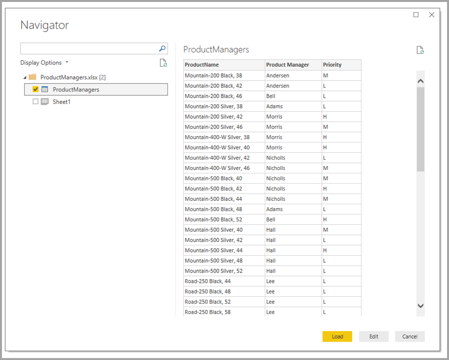
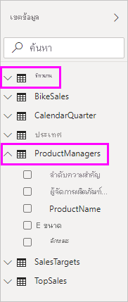
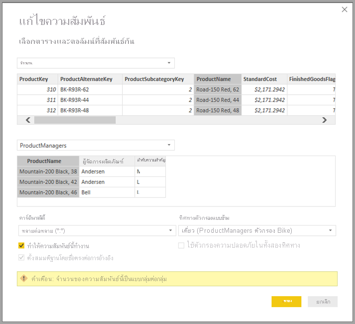
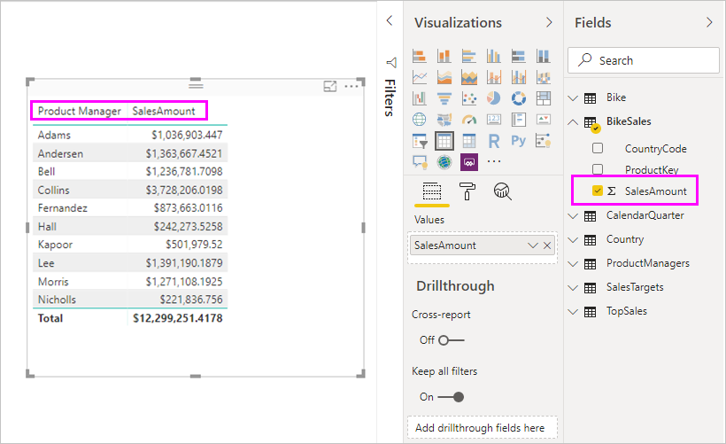
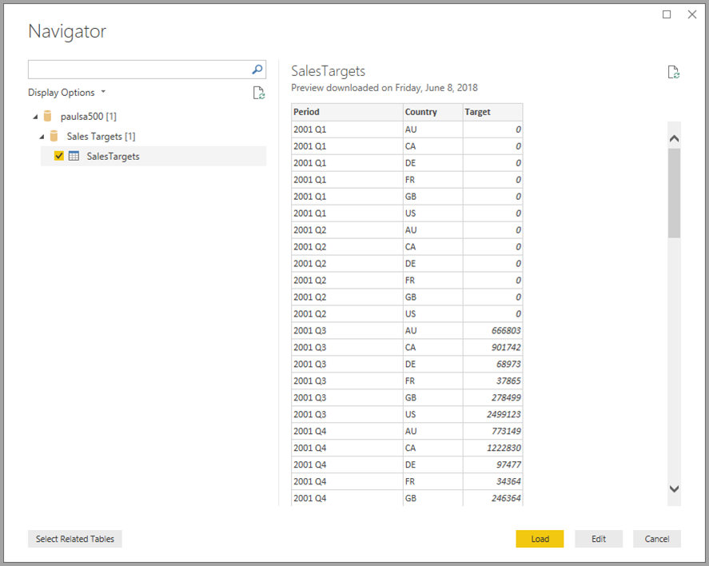
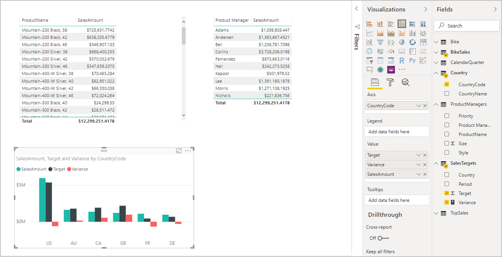
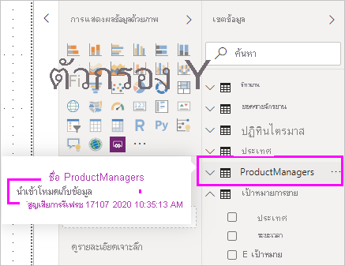

# ใช้แบบจำลองแบบรวมใน Power BI DesktopUse composite models in Power BI Desktop

ก่อนหน้านี้ในเดสก์ทอป Power BI Desktop เมื่อคุณใช้ DirectQuery ในรายงาน ไม่มีการเชื่อมต่อข้อมูลอื่น ไม่ว่าจะ DirectQuery หรือการนำเข้าถูกอนุญาตให้สำหรับรายงานนั้นPreviously in Power BI Desktop, when you used a DirectQuery in a report, no other data connections, whether DirectQuery or import, were allowed for that report. ด้วยโมเดลแบบรวม ข้อกำจัดจะหายไปWith composite models, that restriction is removed. รายงานสามารถรวมกับการเชื่อมต่อข้อมูลอย่างแนบเนียนจากมากว่าหนึ่ง DirectQuery หรือการเชื่อมต่อการนำเข้าข้อมูลในทุกการผสมที่คุณเลือกA report can seamlessly include data connections from more than one DirectQuery or import data connection, in any combination you choose.

ความสามารถโมเดลแบบรวมใน Power BI Desktop ประกอบด้วยคุณลักษณะสามอย่างที่เกี่ยวข้องกัน:The composite models capability in Power BI Desktop consists of three related features:

* **โมเดลแบบรวม**: อนุญาตรายงานให้มีการเชื่อมต่อข้อมูลที่หลากหลาย รวมทั้งการเชื่อมต่อ DirectQuery หรือการนำเข้าในทุกการผสม**Composite models**: Allows a report to have multiple data connections, including DirectQuery connections or import, in any combination. บทความนี้จะอธิบายโมเดลแบบรวมโดยละเอียดThis article describes composite models in detail.

* **ความสัมพันธ์แบบกลุ่มต่อกลุ่ม**: ด้วยโมเดลแบบรวม คุณสามารถตั้ง *ความสัมพันธ์ มาก-ไป-มาก* ระหว่างตาราง**Many-to-many relationships**: With composite models, you can establish *many-to-many relationships* between tables. วิธีการนี้จะลบขอคำสำหรับค่าเฉพาะในตารางThis approach removes requirements for unique values in tables. นอกจากนี้ยังลบการแก้ปัญหาชั่วคราวก่อนหน้า เช่น การเริ่มตารางใหม่เพื่อสร้างความสัมพันธ์เท่านั้นIt also removes previous workarounds, such as introducing new tables only to establish relationships. สำหรับข้อมูลเพิ่มเติม ดู [ใช้ความสัมพันธ์ มาก-มาก ใน Power BI Desktop](desktop-many-to-many-relationships.md)For more information, see [Apply many-many relationships in Power BI Desktop](desktop-many-to-many-relationships.md).

* **โหมดการจัดเก็บข้อมูล**: คุณสามารถระบุเฉพาะว่าวิชวลไหนสอบถามแหล่งข้อมูลส่วนหลัง**Storage mode**: You can now specify which visuals query back-end data sources. วิชวลที่ไม่ต้องใช้คิวรีจะถูกนำเข้าแม้ว่าจะมาจาก DirectQueryVisuals that don't require a query are imported even if they're based on DirectQuery. คุณลักษณะนี้จะช่วยปรับปรุงประสิทธิภาพ และลดการโหลดระบบ Back-endThis feature helps improve performance and reduce back-end load. ก่อนหน้านี้ทุกวิชวลเบื้องต้น เช่น ที่หั่น การสอบถามเริ่มต้นไปยังแหล่งข้อมูลส่วนหลังPreviously, even simple visuals, such as slicers, initiated queries to back-end sources. สำหรับข้อมูล ดู [จัดการโหมดที่เก็บข้อมูลในเดสก์ทอป Power BI](desktop-storage-mode.md).For more information, see [Manage storage mode in Power BI Desktop](desktop-storage-mode.md).

## ใช้โมเดลแบบรวมUse composite models

ด้วยโมเดลแบบรวม คุณสามารถเชื่อมต่อแหล่งข้อมูลประเภทที่แตกต่างกันเมื่อคุณใช้เดสก์ทอป Power BI หรือการบริการ Power BIWith composite models, you can connect to different kinds of data sources when you use Power BI Desktop or the Power BI service. คุณสามารถสร้างการเชื่อมต่อข้อมูลเหล่านี้ได้สองวิธี:You can make those data connections in a couple of ways:

* โดยการนำเข้าข้อมูลไปยัง Power BI ซึ่งเป็นวิธีทั่วไปในการรับข้อมูลBy importing data to Power BI, which is the most common way to get data.
* โดยการเชื่อมต่อโดยตรงไปยังข้อมูลในคลังแหล่งข้อมูลเดิมโดยการใช้ DirectQueryBy connecting directly to data in its original source repository by using DirectQuery. หากต้องการเรียนรู้เพิ่มเติมเกี่ยวกับ DirectQuery โปรดดู [ใช้ DirectQuery ใน Power BI](../connect-data/desktop-directquery-about.md)To learn more about DirectQuery, see [Use DirectQuery in Power BI](../connect-data/desktop-directquery-about.md).

เมื่อคุณใช้ DirectQuery โมเดลแบบรวมทำให้เป็นไปได้ที่จะสร้างโมเดล Power BI เช่น ไฟล์เดี่ยว *.pbix* ของ Power BI Desktop ที่ทั้งหนึ่งหรือสองอย่างของการดำเนินการต่อไปนี้:When you use DirectQuery, composite models make it possible to create a Power BI model, such as a single *.pbix* Power BI Desktop file, that does either or both of the following actions:

* รวมข้อมูลจากแหล่งที่มา DirectQuery หนึ่งแห่งขึ้นไปCombines data from one or more DirectQuery sources.
* การวมกันของข้อมูลจากแหล่ง DirectQuery และการนำเข้าข้อมูลCombines data from DirectQuery sources and import data.

ตัวอย่างเช่น โดยการใช้โมเดลแบบรวม คุณสามารถสร้างโมเดลที่รวมประเภทของข้อมูลดังต่อไปนี้:For example, by using composite models, you can build a model that combines the following types of data:

* ข้อมูลการขายจากคลังข้อมูลวิสาหกิจSales data from an enterprise data warehouse.
* ข้อมูลเป้าหมายการขายจากฐานข้อมูลแผนก SQL ServerSales-target data from a departmental SQL Server database.
* ข้อมูลที่นำเข้าจากสเปรดชีตData that's imported from a spreadsheet.

โมเดลที่รวมข้อมูลจากแหล่งข้อมูล DirectQuery ที่มากกว่าหนึ่งหรือรวม DirectQuery กับการนำเข้าข้อมูลที่เรียกใช้โมเดลแบบรวมA model that combines data from more than one DirectQuery source or that combines DirectQuery with import data is called a composite model.

คุณสามารถสร้างความสัมพันธ์ระหว่างตารางได้ในขณะที่คุณมีอยู่เสมอแม้ว่าตารางเหล่านั้นมาจากแหล่งข้อมูลที่แตกต่างกันYou can create relationships between tables as you always have, even when those tables come from different sources. ทุกความสัมพันธ์ที่ผสมข้ามแหล่งได้ถูกสร้างด้วยจำนวนของมาก-ไป-มาก ไม่ว่าจะเป็นจำนวนที่แท้จริงก็ตามAny relationships that are cross-source are created with a cardinality of many-to-many, regardless of their actual cardinality. คุณสามารถเปลี่ยนเป็นแบบหนึ่งต่อกลุ่ม, กลุ่มต่อหนึ่ง หรือหนึ่งต่อหนึ่งได้You can change them to one-to-many, many-to-one, or one-to-one. ไม่ว่าจำนวนไหนก็ตามที่คุณตั้งค่าวามสัมพันธ์ที่ผสมข้ามแหล่งมี	พฤติกรรมที่แตกต่างกันWhichever cardinality you set, cross-source relationships have different behavior. คุณไม่สามารถใช้ฟังก์ชัน Data Analysis Expressions (DAX) กับการเรียกคืนค่า `one`จากด้านสู่อีกด้าน `many`You can't use Data Analysis Expressions (DAX) functions to retrieve values on the `one` side from the `many` side. นอกจากนี้ คุณอาจเห็นผลกระทบต่อประสิทธิภาพการทำงานเทียบกับความสัมพันธ์แบบกลุ่มต่อกลุ่มภายในแหล่งข้อมูลเดียวกันYou may also see a performance impact versus many-to-many relationships within the same source.

> [!NOTE]
> ด้วยบริบทของโมเดลแบบรวม ตารางที่นำเข้าทั้งหมดเป็นแหล่งเดียวที่ใช้ได้ผลไม่ว่าจะเป็นแหล่งข้อมูลเบื้องต้นที่แท้จริงWithin the context of composite models, all imported tables are effectively a single source, regardless of the actual underlying data sources.

## ตัวอย่างของโมเดลแบบรวมExample of a composite model

สำหรับตัวอย่างของโมเดลแบบรวม พิจารณาจากรายงานที่ได้เชื่อมต่อไปยังแหล่งเก็บข้อมูลที่ใช้ร่วมกันในSQL Server โดยการใช้ DirectQueryFor an example of a composite model, consider a report that has connected to a corporate data warehouse in SQL Server by using DirectQuery. ในตัวอย่างนี้ คลังข้อมูลบรรจุข้อมูล **การขายตามประเทศ**, **ไตรมาส** และ **จักรยาน (ผลิตภัณฑ์)** ดังแสดงในภาพต่อไปนี้:In this instance, the data warehouse contains **Sales by Country**, **Quarter**, and **Bike (Product)** data, as shown in the following image:

ณ จุดนี้คุณสามารถสร้างภาพง่ายๆ โดยการใช้เขตข้อมูลจากแหล่งที่มานี้At this point, you could build simple visuals by using fields from this source. รูปภาพดังต่อไปนี้แสดงการขายทั้งหมดโดย *ชื่อผลิตภัณฑ์* สำหรับไตรมาสที่เลือกThe following image shows total sales by *ProductName*, for a selected quarter.

แต่หากคุณมีข้อมูลในสเปรดชีตของ Office Excel เกี่ยวกับผู้จัดการผลิตภัณฑ์ที่กำหนดแต่ละผลิตภัณฑ์พร้อมกับลำดับความสำคัญทางการตลาดล่ะ?But what if you have data in an Office Excel spreadsheet about the product manager who's assigned to each product, along with the marketing priority? หากคุณต้องการดู **จำนวนการขาย** โดย **ผู้จัดการผลิตภัณฑ์** อาจไม่มีความเป็นไปได้ที่จะเพิ่มข้อมูท้องถิ่นนี้ไปยังคลังข้อมูลบริษัทIf you want to view **Sales Amount** by **Product Manager**, it might not be possible to add this local data to the corporate data warehouse. หรืออาจใช้เวลาอย่างน้อยเป็นเดือนOr it might take months at best.

อาจไม่มีความเป็นไปได้ในการนำเข้าข้อมูลการขายจากคลังข้อมูลแทนการใช้ DirectQueryIt might be possible to import that sales data from the data warehouse, instead of using DirectQuery. และข้อมูลการขายอาจถูกรวมกับข้อมูลที่คุณนำเข้าจากสเปรดชีตAnd the sales data could then be combined with the data that you imported from the spreadsheet. อย่างไรก็ตาม วิธีการนี้ไม่สมเหตุสมผลสำหรับสาเหตุที่นำไปสู่การใช้ DirectQuery ตั้งแต่แรกHowever, that approach is unreasonable, for the reasons that lead to using DirectQuery in the first place. สาเหตุอาจรวมถึง:The reasons could include:

* บางการรวมของกฎความปลอดภัยบังคับใช้ในแหล่งข้อมูลเบื้องต้นSome combination of the security rules enforced in the underlying source.
* ความจำเป็นเพื่อที่จะสามารถดูข้อมูลล่าสุดThe need to be able to view the latest data.
* ขนาดจำนวนมากของข้อมูลThe sheer scale of the data.

และนี่คือจุดที่ โมเดลแบบรวม เข้ามาช่วยHere's where composite models come in. โมเดลแบบรวมส่วนให้คุณเชื่อมต่อแหล่งเก็บข้อมูลโดยการใช้ DirectQuery และต่อมาใช้ **รับข้อมูล** สำหรับแหล่งข้อมูลเพิ่มเติมComposite models let you connect to the data warehouse by using DirectQuery and then use **Get data** for additional sources. ในตัวอย่างนี้ เราจะสร้างการเชื่อต่อ DirectQuery ไปยังคลังข้อมูลบริษัทเป็นอันดับแรกIn this example, we first establish the DirectQuery connection to the corporate data warehouse. เราใช้ **รับข้อมูล** เลือก **Excel** และต่อมานำทางไปยังสเปรดชีตที่ประกอบด้วยข้อมูลท้องถื่นของเราWe use **Get data**, choose **Excel**, and then navigate to the spreadsheet that contains our local data. สุดท้ายนำเข้าสเปรดชีตที่มี *ชื่อผลิตภัณฑ์*, **ผู้จัดการการขาย** ที่กำหนด และ **ลำดับความสำคัญ**Finally, we import the spreadsheet that contains the *Product Names*, the assigned **Sales Manager**, and the **Priority**.  

ในรายการ **เขตข้อมูล** คุณจะเห็นสองตาราง: ตาราง **จักรยาน** เดิมจาก SQL Server และตาราง **ProductManagers**In the **Fields** list, you can see two tables: the original **Bike** table from SQL Server and a new **ProductManagers** table. ตารางใหม่จะมีข้อมูลที่นำเข้าจาก ExcelThe new table contains the data that's imported from Excel.

ในทำนองเดียวกัน ในมุมมอง **ความสัมพันธ์** ใน Power BI Desktop เราจะเห็นตารางเพิ่มเติมที่มีชื่อว่า **ProductManagers**Similarly, in the **Relationship** view in Power BI Desktop, we now see an additional table called **ProductManagers**.

เราต้องการเชื่อมตารางเหล่านี้ไปยังตารางอื่นๆ ในโมเดลWe now need to relate these tables to the other tables in the model. เช่นเคย เราสร้างความสัมพันธ์ระหว่างตาราง **จักรยาน** จาก SQL Server และตารางนำเข้า **ProductManagers**As always, we create a relationship between the **Bike** table from SQL Server and the imported **ProductManagers** table. กล่าวคือ จะเป็นความสัมพันธ์ระหว่าง **จักรยาน[ProductName]** และ **ProductManagers[ProductName]**That is, the relationship is between **Bike[ProductName]** and **ProductManagers[ProductName]**. ตามที่กล่าวมาก่อนหน้านี้ ทุกความสัมพันธ์ที่ไปผ่านแหล่งข้อมูลที่ตั้งค่าไว้จากจำนวนมาก-ไป-มากAs discussed earlier, all relationships that go across source default to many-to-many cardinality.

หลังจากที่สร้างความสัมพันธ์นี้แล้ว ความสัมพันธ์จะแสดงในมุมมอง **ความสัมพันธ์** ใน Power BI DesktopNow that we've established this relationship, it's displayed in the **Relationship** view in Power BI Desktop, as we would expect.

เราสามารถสร้างวิชวลโดยการใช้ช่องใดๆ ในรายการ **เขตข้อมูล** ได้แล้วWe can now create visuals by using any of the fields in the **Fields** list. วิธีการนี้จะผสมข้อมูลจากหลายๆ แหล่งเข้าด้วยกันThis approach seamlessly blends data from multiple sources. เช่น *SalesAmount* ทั้งหมดสำหรับแต่ละ *ผู้จัดการผลิตภัณฑ์* จะแสดงในภาพต่อไปนี้:For example, the total *SalesAmount* for each *Product Manager* is displayed in the following image:

การแสดงตัวอย่างกรณีดังต่อไปนี้ของ *ขนาด* ตารางเช่น **ผลิตภัณฑ์** หรือ **ลูกค้า** ที่ขยายด้วยบางข้อมูลที่เข้าพิเศษจากที่อื่นThe following example displays a common case of a *dimension* table, such as **Product** or **Customer**, that's extended with some extra data imported from somewhere else. นอกจากนี้ยังสามารถมีตารางใช้ DirectQuery เพื่อเชื่อมต่อแหล่งข้อมูลหลากหลายIt's also possible to have tables use DirectQuery to connect to various sources. ในตัวอย่างเดียวกัน สมมติว่า **เป้าหมายการขาย** ต่อ **ประเทศ** และ **ช่วงเวลา** ถูกจัดเก็บไว้ในแผนกฐานข้อมูลที่แยกกันTo continue with our example, imagine that **Sales Targets** per **Country** and **Period** are stored in a separate departmental database. โดยทั่วไป คุณสามารถใช้ **รับข้อมูล** เพื่อเชื่อมต่อไปยังข้อมูลนั้น ตามที่แสดงในรูปภาพดังต่อไปนี้:As usual, you can use **Get data** to connect to that data, as shown in the following image:

ดังที่ทำก่อนหน้านี้ เราสามารถสร้างความสัมพันธ์ระหว่างตารางใหม่และตารางอื่นๆ ในโมเดล จากนั้นสร้างวิชวลที่รวมข้อมูลตารางAs we did earlier, we can create relationships between the new table and other tables in the model and then create visuals that combine the table data. มาดูมุมมอง **ความสัมพันธ์** ที่สร้างความสัมพันธ์ใหม่เอาไว้อีกครั้ง:Let's look again at the **Relationships** view, where we've established the new relationships:

ภาพถัดไปอิงจากข้อมูลใหม่และความสัมพันธ์ที่ได้สร้างไว้The next image is based on the new data and relationships we created. วิชวลด้านล่างซ้ายแสดง *จำนวนการขาย* เทียบกับ *เป้าหมาย* และการคำนวณความแปรปรวนแสดงความแตกต่างThe visual at the lower left shows total *Sales Amount* versus *Target*, and the variance calculation shows the difference. ข้อมูล **จำนวนการขาย** และ **เป้าหมาย** มาจากสองฐานข้อมูลของ SQL Server ที่แตกต่างกันThe **Sales Amount** and **Target** data come from two different SQL Server databases.

## ตั้งค่าโหมดที่เก็บข้อมูลSet the storage mode

แต่ละตารางในโมเดลแบบรวมมีโหมดที่เก็บข้อมูลที่แสดงตารางที่ขึ้นอยู่กับ DirectQuery หรือการนำเข้าEach table in a composite model has a storage mode that indicates whether the table is based on DirectQuery or import. สามารถดูและแก้ไขโหมดที่เก็บข้อมูลได้ในบานหน้าต่าง **คุณสมบัติ**The storage mode can be viewed and modified in the **Property** pane. หากต้องการแสดงโหมดที่เก็บข้อมูล ให้คลิกขวาที่ตารางในรายการ **เขตข้อมูล** จากนั้นเลือก **คุณสมบัติ**To display the storage mode, right-click a table in the **Fields** list, and then select **Properties**. ภาพต่อไปนี้แสดงโหมดที่เก็บข้อมูลสำหรับตาราง **เป้าหมายการขาย**The following image shows the storage mode for the **SalesTargets** table.

สามารถดูโหมดที่เก็บข้อมูลได้จากคำแนะนำเครื่องมือสำหรับแต่ละตารางThe storage mode can also be viewed on the tooltip for each table.

สำหรับทุกไฟล์ Power BI Desktop (ไฟล์ *.pbix*) ที่ประกอบด้วยบางตารางจาก DirectQuery และบางตารางที่นำเข้า แท่งสถานะแสดงโหมดที่เก็บข้อมูลที่เรียกใช้ **ผสม**For any Power BI Desktop file (a *.pbix* file) that contains some tables from DirectQuery and some import tables, the status bar displays a storage mode called **Mixed**. คุณสามารถคลิกที่ระยะเวลาในแท่งสถานะและเปลี่ยนตารางทั้งหมดเพื่อนำเข้าได้อย่างง่ายดายYou can click that term in the status bar and easily switch all tables to import.

สำหรับข้อมูลเพิ่มเติมเกี่ยวกับโหมดที่เก็บข้อมูล ดู [จัดการโหมดที่เก็บข้อมูลใน Power BI Desktop](desktop-storage-mode.md)For more information about storage mode, see [Manage storage mode in Power BI Desktop](desktop-storage-mode.md).  

> [!NOTE]
> คุณสามารถใช้โหมดที่เก็บข้อมูล *ผสม* ใน Power BI Desktop และในบริการของ Power BI ได้You can use *Mixed* storage mode in Power BI Desktop and in the Power BI service.

## ตารางที่ได้รับการคำนวณCalculated tables

คุณสามารถเพิ่มตารางคำนวณไปยังโมเดลที่ใช้ DirectQuery ได้You can add calculated tables to a model that uses DirectQuery. Data Analysis Expressions (DAX) ที่กำหนดตารางคำนวณสามารถอ้างอิงได้ทั้งตารางนำเข้าและตาราง DirectQuery หรือผสมทั้งสองตารางก็ได้The Data Analysis Expressions (DAX) that define the calculated table can reference either imported or DirectQuery tables or a combination of the two.

ตารางคำนวณจะถูกนำเข้าเสมอ และข้อมูลจะถูกรีเฟรชเมื่อคุณรีเฟรชตารางCalculated tables are always imported, and their data is refreshed when you refresh the tables. หากตารางคำนวณอ้างอิงถึงตาราง DirectQuery วิชวลที่อ้างถึงตาราง DirectQuery จะแสดงค่าล่าสุดในแหล่งข้อมูลเบื้องต้นเสมอIf a calculated table refers to a DirectQuery table, visuals that refer to the DirectQuery table always show the latest values in the underlying source. อีกทางหนึ่งคือ วิชวลที่อ้างอิงถึงตารางคำนวณจะแสดงค่าตามเวลาที่ตารางคำนวณรีเฟรชครั้งสุดท้ายAlternatively, visuals that refer to the calculated table show the values at the time when the calculated table was last refreshed.

## ความหมายโดยนัยของความปลอดภัยSecurity implications

โมเดลแบบรวมมีความหมายโดยนัยของความปลอดภัยบางอย่างComposite models have some security implications. คิวรีที่ส่งไปที่แหล่งข้อมูลหนึ่งแหล่งสามารถรวมค่าข้อมูลที่ได้รับจากแหล่งอื่นได้A query sent to one data source can include data values that have been retrieved from another source. ในตัวอย่างก่อนหน้านี้ วิชวลได้แสดง **(จำนวนการขาย)** โดย **การจัดการผลิตภัณฑ์** ส่งคำถาม SQL ไปยังฐานข้อมูลเชิงสัมพันธ์ของการขายIn the earlier example, the visual that shows **(Sales Amount)** by **Product Manager** sends an SQL query to the Sales relational database. คำถาม SQL นั้นอาจประกอบด้วยชื่อของการจัดการผลิตภัณฑ์และผลิตภัณฑ์ที่เกี่ยวข้องของพวกเขาThat SQL query might contain the names of Product Managers and their associated Products.

ดังนั้นข้อมูลที่เก็บไว้ในสเปรดชีตจะถูกรวมอยู่ในคิวรีที่ส่งไปยังฐานข้อมูลเชิงสัมพันธ์Consequently, information that's stored in the spreadsheet is now included in a query that's sent to the relational database. หากข้อมูลนี้เป็นความลับ คุณควรพิจารณาความหมายโดยนัยของความปลอดภัยIf this information is confidential, you should consider the security implications. โดยเฉพาะ ให้พิจารณาประเด็นต่อไปนี้:In particular, consider the following points:

* ผู้ดูแลฐานข้อมูลคนใดก็ตามที่สามารถตรวจสอบร่องรอยหรือบันทึกการตรวจสอบ จะสามารถดูข้อมูลนี้แม้จะไม่มีสิทธิ์การใช้งานข้อมูลของแหล่งเดิมAny administrator of the database who can view traces or audit logs could view this information, even without permissions to the data in its original source. ในตัวอย่างนี้ ผู้ดูแลจำเป็นต้องได้สิทธิ์ไปยังไฟล์ ExcelIn this example, the administrator would need permissions to the Excel file.

* ควรพิจารณาการตั้งค่าการเข้ารหัสลับสำหรับแต่ละแหล่งข้อมูลThe encryption settings for each source should be considered. คุณต้องการที่จะหลีกเลี่ยงข้อมูลที่เรียกกลับคืนมาจากหนึ่งแหล่งโดยการเชื่อมต่อที่เข้ารหัสและต่อมาโดยที่ไม่ตั้งใจ รวมถึงในคำถามด้วย ซึ่งได้ส่งไปยังแหล่งอื่นโดยการเชื่อมต่อที่ไม่เข้ารหัสYou want to avoid retrieving information from one source by an encrypted connection and then inadvertently including it in a query that's sent to another source by an unencrypted connection.

ในการทำตามคำยืนยันที่คุณพิจารณาความเกี่ยวข้องที่มั่นคงใดๆ แล้ว Power BI Desktop แสดงข้อความเตือนเมื่อคุณสร้างโมเดลแบบรวมTo allow confirmation that you've considered any security implications, Power BI Desktop displays a warning message when you create a composite model.  

ด้วยเหตุเดียวกันนี้ ขอให้ระวังการเปิดไฟล์ Power BI Desktop ที่ส่งมาจากแหล่งที่ไม่น่าเชื่อถือFor similar reasons, be careful when you open a Power BI Desktop file that's sent from an untrusted source. หากไฟล์มีโมเดลแบบรวม ข้อมูลที่มีใครบางคนเรียกดูจากแหล่งหนึ่งโดยการใช้ข้อมูลประจำตัวของผู้ใช้ที่เปิดไฟล์จะถูกส่งไปยังแหล่งข้อมูลอื่นถือเป็นส่วนหนึ่งของคิวรีIf the file contains composite models, information that someone retrieves from one source by using the credentials of the user who opens the file would be sent to another data source as part of the query. ข้อมูลอาจได้ถูกดูจากผู้เขียนที่ประสงค์ร้ายต่อไฟล์ Power BI DesktopThe information could be viewed by the malicious author of the Power BI Desktop file. เมื่อคุณเปิดไฟล์ Power BI Desktop ในขั้นต้นที่ประกอบด้วยแหล่งที่หลากหลาย Power BI Desktop จะแสดงคำเตือนWhen you initially open a Power BI Desktop file that contains multiple sources, Power BI Desktop displays a warning. การเตือนนี้จะคล้ายกับการเตือนที่แสดงขึ้นเมื่อคุณเปิดไฟล์ที่มีคิวรี SQL ดั้งเดิมThe warning is similar to the one that's displayed when you open a file that contains native SQL queries.  

## ความหมายโดยนัยของประสิทธิภาพPerformance implications  

เมื่อใช้ DirectQuery ประสิทธิภาพควรจะได้รับการพิจารณาทุกครั้ง หลักๆ เพื่อทำให้แน่ใจว่าแหล่งที่มา Back-end มีทรัพยากรที่เพียงพอในการมอบประสบการณ์ที่ดีสำหรับผู้ใช้When you use DirectQuery, you should always consider performance, primarily to ensure that the back-end source has sufficient resources to provide a good experience for users. ประสบการณ์ที่ดี หมายถึง วิชวลรีเฟรชในห้าวินาทีหรือน้อยกว่านั้นA good experience means that the visuals refresh in five seconds or less. สำหรับคำแนะนำปฏิบัติการเพิ่มเติม ดู [เกี่ยวกับการใช้ DirectQuery ใน Power BI](../connect-data/desktop-directquery-about.md)For more performance advice, see [About using DirectQuery in Power BI](../connect-data/desktop-directquery-about.md).

การใช้โมเดลแบบรวมเพิ่มข้อควรพิจารณาด้านสมรรถภาพเพิ่มเติมUsing composite models adds additional performance considerations. การแสดงผลด้วยภาพเดี่ยวสามารถส่งผลให้เกิดการส่งแบบสอบถามไปยังหลายแหล่งข้อมูลได้ ซึ่งมักจะส่งผ่านผลลัพธ์จากแบบสอบถามหนึ่งไปยังแหล่งที่สองA single visual can result in sending queries to multiple sources, which often pass the results from one query across to a second source. สถานการณ์นี้สามารถทำให้เกิดการดำเนินการต่อไปนี้:This situation can result in the following forms of execution:

* **คำถาม SQL ที่รวมถึงจำนวนมากของค่าที่เป็นจริง**: เช่น วิชวลที่ต้องการ **จำนวนการขาย** ทั้งหมดสำหรับชุด **ผู้จัดการผลิตภัณฑ์** ที่เลือกจะต้องค้นหาว่า **ผลิตภัณฑ์** ใดที่ผู้จัดการผลิตภัณฑ์จัดการ**An SQL query that includes a large number of literal values**: For example, a visual that requests total **Sales Amount** for a set of selected **Product Managers** would first need to find which **Products** were managed by those product managers. เหตุการณ์นี้จะต้องเกิดก่อนที่วิชวลส่งคำถาม SQL ที่รวม ID ผลิตภัณฑ์ทั้งหมดในข้อความ `WHERE`This sequence must happen before the visual sends an SQL query that includes all of the product IDs in a `WHERE` clause.

* **คำถาม SQL ที่ถามไปที่ระดับที่ต่ำกว่าของส่วนประกอบ ด้วยข้อมูลภายหลังที่ถูกรวบรวมแบบท้องถิ่น**: ตัวเลขของ **ผลิตภัณฑ์** ที่พอดีกับเกณฑ์ตัวกรอง **การจัดการผลิตภัณฑ์** เติบโตบใหญ่ขึ้น มันสามารถไร้ประสิทธิภาพหรือไม่เหมาะสมที่จะรวมผลิตภัณฑ์ทั้งหมดในข้อความ `WHERE`**An SQL query that queries at a lower level of granularity, with the data later being aggregated locally**: As the number of **Products** that meet the filter criteria on **Product Manager** grows large, it can become inefficient or unfeasible to include all products in a `WHERE` clause. แทนที่ คุณจะสามารถส่งคำถามแหล่งข้อมูลเชิงสัมพันธ์ไปยังระดับที่ต่ำกว่าของ **ผลิตภัณฑ์** แล้วรวบรวมผลแบบท้องถิ่นInstead, you can query the relational source at the lower level of **Products** and then aggregate the results locally. หากคาร์ดินาลลิตี้ของ **ผลิตภัณฑ์** เกินขีดจำกัด 1 ล้าน คิวรีจะล้มเหลวIf the cardinality of **Products** exceeds a limit of 1 million, the query fails.

* **คิวรี SQL หลายคิวรี หนึ่งคิวรีต่อกลุ่มตามค่า**: เมื่อการรวบรวมใช้ **การนับที่แยกกัน** และจัดกลุ่มโดยแถวจากแหล่งอื่นและหากแหล่งภายนอกไม่สนับสนุนการส่งที่มีประสิทธิภาพของค่าที่แท้จริงหลายค่าที่อธิบายการจัดกลุ่ม มันจำเป็นที่จะส่งหนึ่งคำถาม SQL ต่อกลุ่มโดยค่านั้น**Multiple SQL queries, one per group by value**: When the aggregation uses **DistinctCount** and is grouped by a column from another source, and if the external source doesn't support efficient passing of many literal values that define the grouping, it's necessary to send one SQL query per group by value.

   วิชวลร้องขอการนับที่แยกกันของ **ตัวเลขบัญชีลูกค้า** จากตารางเซิร์ฟเวอร์ SQL โดย **การจัดการผลิตภัณฑ์** ที่นำเข้าจากสเปรดชีตที่ต้องการส่งผ่านในรายละเอียดจากตาราง **การจัดการผลิตภัณฑ์** ในคำถามที่ส่งไปยังเซิร์ฟเวอร์ SQLA visual that requests a distinct count of **CustomerAccountNumber** from the SQL Server table by **Product Managers** imported from the spreadsheet would need to pass in the details from the **Product Managers** table in the query that's sent to SQL Server. นอกเหนือแหล่งอื่น Redshift สำหรับตัวอย่าง การดำเนินนี้ไม่เหมาะสมOver other sources, Redshift, for example, this action is unfeasible. แทนที่ จะมีหนึ่งคำถาม SQL ที่ส่งไปแต่ละ **การจัดการการขาย** ขึ้นอยู่กับบางขีดจำกัดที่ใช้ได้จริงซึ่งทำให้คำถามล้มเหลวInstead, there would be one SQL query sent per **Sales Manager**, up to some practical limit, at which point the query would fail.

ในแต่ละกรณีดังกล่าวมีความหมายโดยนัยของตัวเองในเรื่องประสิทธิภาพและมีรายละเอียดที่แน่นอนต่างกันไปสำหรับแต่ละแหล่งที่มาEach of these cases has its own implications on performance, and the exact details vary for each data source. ถึงแม้ว่าจำนวนของแถวที่ใช้ในความสัมพันธ์ที่ร่วมกันกับสองแหล่งที่เหลือน้อยไม่กี่พัน การปฏิบัติการไม่ควรได้รับผลAlthough the cardinality of the columns used in the relationship that joins the two sources remains low, a few thousand, performance shouldn't be affected. ขณะที่นี้ดินาลลิตี้ขยาย คุณควรให้ความสำคัญไปยังผลกระทบของผลประสิทธิภาพมากขึ้นAs this cardinality grows, you should pay more attention to the impact on the resulting performance.

นอกจากนี้ การใช้ความสัมพันธ์มาก-ไป-มากหมายความว่าคำถามที่แยกกันจะต้องส่งไปยังแหล่งที่อยู่ใต้กว่าสำหรับแต่ละผลรวมหรือระดับยอดรวมของส่วนหนึ่ง มากกว่าการรวบรวมค่ารายละเอียดแบบท้องถิ่นAdditionally, the use of many-to-many relationships means that separate queries must be sent to the underlying source for each total or subtotal level, rather than aggregating the detailed values locally. ภาพตารางง่าย ๆ พร้อมจำนวนทั้งหมดจะส่งคิวรี SQL สองคิวรี แทนที่จะเป็นคิวรีเดียวA simple table visual with totals would send two SQL queries, rather than one.

## ข้อจำกัดและข้อควรพิจารณาLimitations and considerations

รุ่นของแบบจำลองแบบรวมนี้มีข้อจำกัดเล็กน้อยThis release of composite models presents a few limitations:

ในปัจจุบัน โมเดลแบบรวมที่เชื่อมต่อกับ SQL, Oracle และแหล่งข้อมูล Teradata เท่านั้นที่รองรับ[การรีเฟรชแบบเพิ่ม](../admin/service-premium-incremental-refresh.md)Currently, [incremental refresh](../admin/service-premium-incremental-refresh.md) is supported for composite models connecting to SQL, Oracle, and Teradata data sources only.

แหล่งขนาดที่หลากหลายของ Live Connect ดังต่อไปนี้ไม่สามารถใช้กับโมเดลแบบรวม:The following Live Connect multi-dimensional sources can't be used with composite models:

* SAP HANASAP HANA
* SAP Business WarehouseSAP Business Warehouse
* SQL Server Analysis ServicesSQL Server Analysis Services
* ชุดข้อมูล Power BIPower BI datasets
* Azure Analysis ServicesAzure Analysis Services

เมื่อคุณเชื่อมต่อไปยังแหล่งขนาดที่หลากหลายเหล่านี้โดยการใช้ DirectQuery คุณไม่สามารถเชื่อมต่อแหล่ง DirectQuery อื่นๆ หรือรวมกับการนำเข้าข้อมูลWhen you connect to these multi-dimensional sources by using DirectQuery, you can't connect to another DirectQuery source or combine it with import data.

ข้อจำกัดของ DirectQuery ที่มีอยู่ยังคงมีผลเมื่อใช้โมเดลแบบรวมThe existing limitations of DirectQuery still apply when you use composite models. ข้อจำกัดจำนวนมากเหล่านี้เป็นข้อจำกัดต่อตาราง โดยขึ้นอยู่กับโหมดที่เก็บข้อมูลของตารางMany of these limitations are now per table, depending upon the storage mode of the table. สำหรับตัวอย่าง แถวที่ถูกคำนวณในตารางที่นำเข้าสามารถอ้างถึงตารางอื่นๆ แต่แถวที่ถูกคำนวณในตาราง DirectQuery สามารถยังคงอ้างถึงเพียงแถวในตารางเดียวกันFor example, a calculated column on an import table can refer to other tables, but a calculated column on a DirectQuery table can still refer only to columns on the same table. ข้อจำกัดอื่น ๆ มีผลกับโมเดลทั้งหมด หากมีตารางใดภายในโมเดลที่เป็น DirectQueryOther limitations apply to the model as a whole, if any of the tables within the model are DirectQuery. ตัวอย่างเช่น คุณลักษณะ QuickInsights และ Q&A จะไม่สามารถใช้งานได้บนโมเดลหากมีตารางใดภายในโมเดลมีโหมดที่เก็บข้อมูลของ DirectQueryFor example, the QuickInsights and Q&A features aren't available on a model if any of the tables within it has a storage mode of DirectQuery.

## ขั้นตอนถัดไปNext steps

สำหรับข้อมูลเพิ่มเติมเกี่ยวกับโมเดลแบบรวมและ DirectQuery โปรดดูบทความต่อไปนี้:For more information about composite models and DirectQuery, see the following articles:

* [ความสัมพันธ์แบบกลุ่มต่อกลุ่มใน Power BI DesktopMany-to-many relationships in Power BI Desktop](desktop-many-to-many-relationships.md)
* [โหมดที่เก็บข้อมูลใน Power BI DesktopStorage mode in Power BI Desktop](desktop-storage-mode.md)
* [ใช้ DirectQuery ใน Power BIUse DirectQuery in Power BI](../connect-data/desktop-directquery-about.md)
* [แหล่งข้อมูลที่ได้รับการรองรับโดย DirectQuery ใน Power BIData sources supported by DirectQuery in Power BI](../connect-data/power-bi-data-sources.md)
* [การใช้ DirectQuery สำหรับชุดข้อมูล Power BI และ Azure Analysis Services (ตัวอย่าง)Using DirectQuery for Power BI datasets and Azure Analysis Services (preview)](../connect-data/desktop-directquery-datasets-azure-analysis-services.md)
