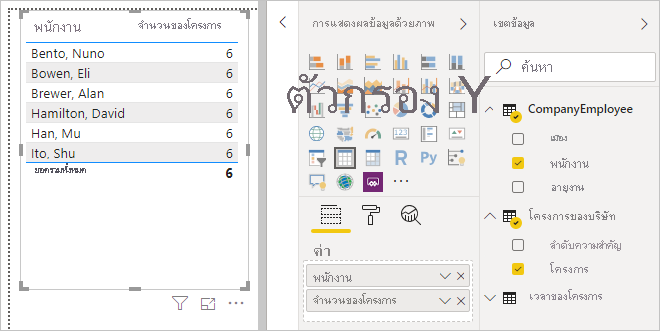
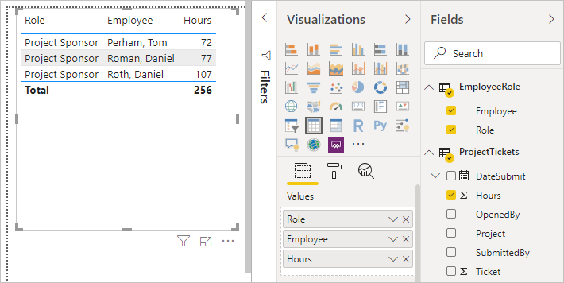

# สร้างและจัดการความสัมพันธ์ใน Power BI DesktopCreate and manage relationships in Power BI Desktop
เมื่อคุณนำเข้าหลายตาราง มีโอกาสที่คุณจะต้องทำการวิเคราะห์โดยใช้ข้อมูลจากตารางเหล่านั้นทั้งหมดWhen you import multiple tables, chances are you'll do some analysis using data from all those tables. ความสัมพันธ์ระหว่างตารางเหล่านั้นเป็นสิ่งจำเป็นสำหรับการคำนวณผลลัพธ์อย่างถูกต้อง และแสดงข้อมูลในรายงานของคุณอย่างถูกต้องRelationships between those tables are necessary to accurately calculate results and display the correct information in your reports. Power BI Desktop ทำให้สร้างความสัมพันธ์ดังกล่าวได้ง่ายขึ้นPower BI Desktop makes creating those relationships easy. ในความเป็นจริง ในกรณีส่วนใหญ่คุณไม่จำเป็นต้องทำอะไร คุณลักษณะการตรวจหาอัตโนมัติทำได้สำหรับคุณIn fact, in most cases you won’t have to do anything, the autodetect feature does it for you. อย่างไรก็ตาม ในบางกรณีคุณอาจต้องสร้างความสัมพันธ์ด้วยตนเอง หรือคุจำเป็นต้องทำการเปลี่ยนแปลงบางอย่างสำหรับความสัมพันธ์นั้นHowever, sometimes you might have to create relationships yourself, or need to make changes to a relationship. ไม่ว่าด้วยใช้วิธีใด จำเป็นต้องทำความเข้าใจความสัมพันธ์ใน Power BI Desktop วิธีการสร้างและวิธีการแก้ไขใจความสัมพันธ์เหล่านี้Either way, it’s important to understand relationships in Power BI Desktop and how to create and edit them.

## ตรวจหาอัตโนมัติระหว่างการโหลดAutodetect during load
ถ้าคุณสร้างแบบสอบถามสองตารางหรือมากกว่าในเวลาเดียวกัน เมื่อข้อมูลถูกโหลด Power BI Desktop พยายามทำการค้นหาและสร้างความสัมพันธ์สำหรับคุณIf you query two or more tables at the same time, when the data is loaded, Power BI Desktop attempts to find and create relationships for you. ตัวเลือกความสัมพันธ์ **คาร์ดินาลลิตี้** **ทิศทางตัวกรองข้าม** และ **ทำให้ความสัมพันธ์นี้ใช้งานได้** มีการตั้งค่าโดยอัตโนมัติThe relationship options **Cardinality**, **Cross filter direction**, and **Make this relationship active** are automatically set. ลักษณะของ Power BI Desktop ที่ชื่อคอลัมน์ในตารางที่คุณกำลังสอบถามเพื่อดูว่ามีความสัมพันธ์ใดที่อาจเกิดขึ้นได้บ้างPower BI Desktop looks at column names in the tables you're querying to determine if there are any potential relationships. ถ้าไม่มี ความสัมพันธ์ดังกล่าวจะถูกสร้างขึ้นโดยอัตโนมัติIf there are, those relationships are created automatically. ถ้า Power BI Desktop ไม่สามารถกำหนดได้ด้วยความน่าเชื่อมั่นในระดับสูงว่ามีค่าที่ตรงกัน Power BI Desktop ไม่สร้างความสัมพันธ์ขึ้นIf Power BI Desktop can't determine with a high level of confidence there's a match, it doesn't create the relationship. อย่างไรก็ตาม คุณยังคงสามารถใช้กล่องโต้ตอบ **การจัดการความสัมพันธ์** เพื่อสร้างหรือแก้ไขความสัมพันธ์ได้ด้วยตนเองHowever, you can still use the **Manage relationships** dialog box to manually create or edit relationships.

## สร้างความสัมพันธ์ที่มีการตรวจหาอัตโนมัติCreate a relationship with autodetect
ที่แท็บ **หน้าแรก** ให้เลือก **จัดการความสัมพันธ์** \> **ตรวจหาอัตโนมัติ**On the **Home** tab, select **Manage Relationships** \> **Autodetect**.

## สร้างความสัมพันธ์ด้วยตนเองCreate a relationship manually
1. ที่แท็บ **หน้าแรก** ให้เลือก **จัดการความสัมพันธ์** \> **ใหม่**On the **Home** tab, select **Manage Relationships** \> **New**.

2. ในกล่องโต้ตอบ **สร้างความสัมพันธ์** ในรายการดรอปดาวน์ของตารางแรก ให้เลือกตารางIn the **Create relationship** dialog box, in the first table drop-down list, select a table. เลือกคอลัมน์ที่คุณต้องการใช้ในความสัมพันธ์Select the column you want to use in the relationship.

3. ในรายการดรอปดาวน์ของตารางที่สอง ให้เลือกตารางอื่นๆ ที่คุณต้องการในความสัมพันธ์In the second table drop-down list, select the other table you want in the relationship. เลือกคอลัมน์อื่นๆ ที่คุณต้องการใช้ แล้วแตะเลือก **ตกลง**Select the other column you want to use, and then elect **OK**.

   

โดยค่าเริ่มต้น Power BI Desktop จะกำหนดค่าตัวเลือก **คาร์ดินาลลิตี้** (ทิศทาง) **ทิศทางการกรองข้าม** และ **ทำให้ความสัมพันธ์นี้ใช้งานได้** สำหรับความสัมพันธ์ใหม่ของคุณBy default, Power BI Desktop automatically configures the options **Cardinality** (direction), **Cross filter direction**, and **Make this relationship active** for your new relationship. อย่างไรก็ตาม คุณสามารถเปลี่ยนการตั้งค่าเหล่านี้ได้ถ้าจำเป็นHowever, you can change these settings if necessary. สำหรับข้อมูลเพิ่มเติม โปรดดู [ทำความเข้าใจตัวเลือกเพิ่มเติม](#understanding-additional-options)For more information, see [Understanding additional options](#understanding-additional-options).

หากไม่มีตารางใดที่เลือกไว้สำหรับความสัมพันธ์มีค่าที่ไม่ซ้ำกัน คุณจะเห็นข้อผิดพลาดต่อไปนี้: *หนึ่งในคอลัมน์ต้องมีค่าที่ไม่ซ้ำกัน*If none of the tables selected for the relationship has unique values, you'll see the following error: *One of the columns must have unique values*. อย่างน้อยหนึ่งตารางในความสัมพันธ์ *ต้อง* มีรายการที่แตกต่างและไม่ซ้ำกันของค่าคีย์ ซึ่งเป็นข้อกำหนดทั่วไปสำหรับเทคโนโลยีฐานข้อมูลเชิงสัมพันธ์ทั้งหมดAt least one table in a relationship *must* have a distinct, unique list of key values, which is a common requirement for all relational database technologies. 

ถ้าคุณพบข้อผิดพลาดนั้น มีสองสามวิธีในการแก้ไขปัญหา:If you encounter that error, there are a couple ways to fix the issue:

* ใช้ **ลบรายการซ้ำ** เพื่อสร้างคอลัมน์ที่มีค่าไม่ซ้ำกันUse **Remove Duplicates** to create a column with unique values. ข้อด้อยของวิธีการนี้คือ คุณจะสูญเสียข้อมูลเมื่อแถวที่ซ้ำกันถูกลบออกไป; โดยมากแล้วคีย์ (แถว) ถูกทำซ้ำด้วยเหตุผลที่ดีเสมอThe drawback to this approach is that you might lose information when duplicate rows are removed; often a key (row) is duplicated for good reason.
* เพิ่มตารางที่มีตัวกลางประกอบด้วยรายการของค่าคีย์ที่แตกต่างกันไปยังแบบจำลอง ซึ่งจากนั้นจะถูกเชื่อมโยงไปยังทั้งสองคอลัมน์ต้นฉบับในความสัมพันธ์ดังกล่าวAdd an intermediary table made of the list of distinct key values to the model, which will then be linked to both original columns in the relationship.

สำหรับข้อมูลเพิ่มเติม โปรดดูที่[บล็อกโพสต์](/archive/blogs/cansql/relationships-in-power-bi-fixing-one-of-the-columns-must-have-unique-values-error-message)For more information, see this [blog post](/archive/blogs/cansql/relationships-in-power-bi-fixing-one-of-the-columns-must-have-unique-values-error-message).

## แก้ไขความสัมพันธ์Edit a relationship
1. ที่แท็บ **หน้าแรก** ให้เลือก **จัดการความสัมพันธ์**On the **Home** tab, select **Manage Relationships**.

2. ที่กล่องโต้ตอบ **จัดการความสัมพันธ์** เลือกความสัมพันธ์ จากนั้นเลือก **แก้ไข**In the **Manage relationships** dialog box, select the relationship, then select **Edit**.

## ตัวเลือกเพิ่มเติมสำหรับการกำหนดค่าConfigure additional options
เมื่อคุณสร้างหรือแก้ไขความสัมพันธ์ คุณสามารถกำหนดค่าตัวเลือกเพิ่มเติมได้When you create or edit a relationship, you can configure additional options. ตามค่าเริ่มต้น Power BI Desktop กำหนดค่าตัวเลือกเพิ่มเติมโดยอัตโนมัติตามการคาดเดาที่ดีที่สุดซึ่งอาจแตกต่างกันสำหรับแต่ละความสัมพันธ์ที่ยึดตามข้อมูลในคอลัมน์By default, Power BI Desktop automatically configures additional options based on its best guess, which can be different for each relationship based on the data in the columns.

### คาร์ดินาลลิตี้Cardinality
ตัวเลือก **คาร์ดินาลลิตี้** สามารถมีการตั้งค่าหนึ่งรายการต่อไปนี้:The **Cardinality** option can have one of the following settings:

**กลุ่มต่อหนึ่ง (\*:1)** : ความสัมพันธ์แบบหนึ่งต่อหนึ่งคือความสัมพันธ์ที่พบบ่อยและเป็นค่าเริ่มต้น**Many to one (\*:1)**: A many-to-one relationship is the most common, default type of realtionship. ซึ่งหมายความว่าคอลัมน์ในตารางที่กำหนดสามารถมีมากกว่าหนึ่งค่าตัวอย่าง และตารางอื่นที่เกี่ยวข้องที่รู้จักกันว่าเป็นตารางการค้นหา มักจะมีเพียงหนึ่งค่าตัวอย่างIt means the column in a given table can have more than one instance of a value, and the other related table, often know as the lookup table, has only one instance of a value.

**หนึ่งต่อหนึ่ง (1: 1)** : ในความสัมพันธ์แบบหนึ่งต่อหนึ่ง คอลัมน์ในตารางหนึ่งมีเพียงหนึ่งค่าตัวอย่างของค่าใดค่าหนึ่ง และตารางอื่นที่เกี่ยวข้องมีเพียงหนึ่งค่าตัวอย่างของค่าใดค่าหนึ่ง**One to one (1:1)**: In a one-to-one relationship, the column in one table has only one instance of a particular value, and the other related table has only one instance of a particular value.

**หนึ่งต่อกลุ่ม (1:\*)** : ในความสัมพันธ์แบบหนึ่งต่อกลุ่ม คอลัมน์ในตารางหนึ่งมีเพียงหนึ่งค่าตัวอย่างของค่าใดค่าหนึ่ง และตารางอื่นที่เกี่ยวข้องสามารถมีอินสแตนซ์ของค่าได้มากกว่าหนึ่ง**One to many (1:\*)**: In a one-to-many relationship, the column in one table has only one instance of a particular value, and the other related table can have more than one instance of a value.

**กลุ่มต่อกลุ่ม (\*:\*)** : ด้วยโมเดลแบบรวมคุณสามารถสร้างความสัมพันธ์แบบกลุ่มต่อกลุ่มระหว่างตารางซึ่งจะลบข้อกำหนดสำหรับค่าที่ไม่ซ้ำกันในตาราง**Many to many (\*:\*)**: With composite models, you can establish a many-to-many relationship between tables, which removes requirements for unique values in tables. นอกจากนี้ยังลบการแก้ปัญหาชั่วคราวก่อนหน้า เช่น การเริ่มตารางใหม่เพื่อสร้างความสัมพันธ์เท่านั้นIt also removes previous workarounds, such as introducing new tables only to establish relationships. สำหรับข้อมูลเพิ่มเติม โปรดดู[ความสัมพันธแบบที่มีคาร์ดินาลลิตี้แบบกลุ่มกลุ่ม](./desktop-many-to-many-relationships.md)For more information, see [Relationships with a many-many cardinality](./desktop-many-to-many-relationships.md). 

สำหรับข้อมูลเพิ่มเติมเกี่ยวกับเวลาที่จะเปลี่ยนแปลงคาร์ดินาลลิตี้ โปรดดู [ทำความเข้าใจตัวเลือกเพิ่มเติม](#understanding-additional-options)For more information about when to change cardinality, see [Understanding additional options](#understanding-additional-options).

### ทิศทางตัวกรองข้ามCross filter direction
ตัวเลือก **ทิศทางตัวกรองข้าม** สามารถมีการตั้งค่าหนึ่งรายการต่อไปนี้:The **Cross filter direction** option can have one the following settings:

**ทั้งสอง**: สำหรับวัตถุประสงค์ในการกรอง จะมีการใช้งานทั้งสองตารางเหมือนกับว่าเป็นตารางเดียว**Both**: For filtering purposes, both tables are treated as if they're a single table. การตั้งค่า **ทั้งสอง** ใช้งานได้ดีกับตารางเดียวที่มีหมายเลขของตารางการค้นหาที่ล้อมรอบอยู่The **Both** setting works well with a single table that has a number of lookup tables that surround it. ตัวอย่างคือตารางขายจริงที่มีตารางการค้นหาสำหรับแผนกAn example is a sales actuals table with a lookup table for its department. การกำหนดค่านี้จะเรียกว่าการกำหนดค่าโครงสร้างแบบดาว (จากตารางศูนย์กลางที่มีตารางการค้นหาหลายครั้ง)This configuration is often called a star schema configuration (a central table with several lookup tables). อย่างไรก็ตาม ถ้าคุณมีอย่างน้อยสองตารางที่มีตารางการค้นหาด้วย (มีบางตารางที่เหมือนกัน) คุณไม่ต้องใช้การตั้งค่าแบบ **ทั้งสอง**However, if you have two or more tables that also have lookup tables (with some in common) then you wouldn't want to use the **Both** setting. เมื่อต้องการใช้ตัวอย่างก่อนหน้าต่อไป ในกรณีนี้ คุณจะมีตารางงบประมาณการขายที่จะบันทึกงบประมาณเป้าหมายสำหรับแต่ละแผนกด้วยTo continue the previous example, in this case, you also have a budget sales table that records target budget for each department. และตารางแผนกจะเชื่อมต่อกับทั้งตารางการขายและตารางงบประมาณAnd, the department table is connected to both the sales and the budget table. หลีกเลี่ยงการตั้งค่า **ทั้งสอง** สำหรับการกำหนดค่าชนิดนี้Avoid the **Both** setting for this kind of configuration.

**เดียว**: ทิศทางเริ่มต้นที่พบบ่อยที่สุด ซึ่งหมายถึงตัวเลือกในการกรองในตารางการที่เชื่อมต่อทำงานบนตารางที่จะมีการรวมค่า**Single**: The most common, default direction, which means filtering choices in connected tables work on the table where values are being aggregated. ถ้าคุณนำเข้า Power Pivot ใน Excel 2013 หรือแบบจำลองข้อมูลก่อนหน้า ความสัมพันธ์ทั้งหมดจะมีทิศทางเดียวIf you import a Power Pivot in Excel 2013 or earlier data model, all relationships will have a single direction. 

สำหรับข้อมูลเพิ่มเติมเกี่ยวกับเวลาที่จะเปลี่ยนแปลงทิศทางตัวกรองข้าม โปรดดู [ทำความเข้าใจตัวเลือกเพิ่มเติม](#understanding-additional-options)For more information about when to change cross filter direction, see [Understanding additional options](#understanding-additional-options).

### เปิดใช้งานความสัมพันธ์นี้Make this relationship active
เมื่อเลือกส่วนนี้ ความสัมพันธ์ทำหน้าที่เป็นการเปิดใช้งาน เป็นความสัมพันธ์เริ่มต้นWhen checked, the relationship serves as the active, default relationship. ในกรณีไม่มีมากกว่าหนึ่งความสัมพันธ์ระหว่างตารางสองตาราง ความสัมพันธ์ที่ใช้งานอยู่มีวิธีสำหรับ Power BI Desktop เพื่อสร้างการแสดงภาพที่มีทั้งสองตารางโดยอัตโนมัติIn cases where there is more than one relationship between two tables, the active relationship provides a way for Power BI Desktop to automatically create visualizations that include both tables.

สำหรับข้อมูลเพิ่มเติมเกี่ยวกับเวลาเมื่อต้องเปิดใช้งานความสัมพันธ์ใดความสัมพันธ์หนึ่ง โปรดดู [ทำความเข้าใจตัวเลือกเพิ่มเติม](#understanding-additional-options)For more information about when to make a particular relationship active, see [Understanding additional options](#understanding-additional-options).

## ทำความเข้าใจความสัมพันธ์Understanding relationships
เมื่อคุณเชื่อมต่อสองตารางเข้ากับความสัมพันธ์ หนึ่ง คุณสามารถทำงานกับข้อมูลในทั้งสองตารางได้ในตารางเดียว ทำให้คุณไม่ต้องกังวลเกี่ยวกับรายละเอียดความสัมพันธ์หรือบีบตารางเหล่านั้นลงในตารางเดียวก่อนที่นำเข้าOnce you've connected two tables together with a relationship, you can work with the data in both tables as if they were a single table, freeing you from having to worry about relationship details, or flattening those tables into a single table before importing them. ในหลากหลายสถานการณ์ Power BI Desktop สามารถสร้างความสัมพันธ์สำหรับคุณได้โดยอัตโนมัติIn many situations, Power BI Desktop can automatically create relationships for you. อย่างไรก็ตาม ถ้า Power BI Desktop ไม่สามารถกำหนดได้ด้วยความแน่นอนระดับสูงว่าความสัมพันธ์ระหว่างตารางสองตารางนนั้นควรมีอยู่ Power BI Desktop ไม่สร้างความสัมพันธ์โดยอัตโนมัติHowever, if Power BI Desktop can’t determine with a high-degree of certainty that a relationship between two tables should exist, it doesn't automatically create the relationship. ในกรณีนี้ คุณต้องทำเช่นนั้นIn that case, you must do so. 

เรามาเรียนรู้ในบทช่วยสอนฉบับย่อเพื่อแสดงให้คุณเห็นว่าความสัมพันธ์ทำงานอย่างไรใน Power BI DesktopLet’s go through a quick tutorial, to better show you how relationships work in Power BI Desktop.

>[!TIP]
>คุณสามารถเรียนรู้บทเรียนนี้ให้เสร็จสมบูรณ์ได้ด้วยตัวเองYou can complete this lesson yourself: 
>
> 1. คัดลอกตาราง **ProjectHours** ต่อไปนี้ลงในแผ่นงาน Excel (ไม่รวมชื่อคอลัมน์) เลือกเซลล์ทั้งหมดแล้วเลือก **แทรก** \> **ตาราง**Copy the following **ProjectHours** table into an Excel worksheet (excluding the title), select all of the cells, and then select **Insert** \> **Table**. 
> 2. ในกล่องโต้ตอบ **สร้างตาราง** ให้เลือก **ตกลง**In the **Create Table** dialog box, select **OK**. 
> 3. เลือกเซลล์ของตารางใดก็ตาม เลือก **การออกแบบตาราง** \> **ชื่อตาราง** และจากนั้นป้อน *ProjectHours*Select any table cell, select **Table Design** \> **Table Name**, and then enter *ProjectHours*. 
> 4. ทำเหมือนกันสำหรับตาราง **CompanyProject**Do the same for the **CompanyProject** table. 
> 5. นำเข้าข้อมูลนั้น โดยใช้ **รับข้อมูล** ใน Power BI Desktop ได้Import the data by using **Get Data** in Power BI Desktop. เลือกสองตารางเป็นแหล่งข้อมูล จากนั้นเลือก **โหลด**Select the two tables as a data source, and then select **Load**.

ตารางแรกนี้ คือ **ProjectHours** เป็นบันทึกของตั๋วงานที่บันทึกจำนวนชั่วโมงที่บุคคลหนึ่งทำงานในโครงการใดโครงการหนึ่งThe first table, **ProjectHours**, is a record of work tickets that record the number of hours a person has worked on a particular project. 

**ProjectHours****ProjectHours**

| **ตั๋ว****Ticket** | **SubmittedBy****SubmittedBy** | **ชั่วโมง****Hours** | **โครงการ****Project** | **DateSubmit****DateSubmit** |
| ---:|:--- | ---:|:--- | ---:|
| 10011001 |Brewer, AlanBrewer, Alan |2222 |สีฟ้าBlue |1/1/20131/1/2013 |
| 10021002 |Brewer, AlanBrewer, Alan |2626 |สีแดงRed |2/1/20132/1/2013 |
| 10031003 |Ito, ShuIto, Shu |3434 |เหลืองYellow |12/4/201212/4/2012 |
| 10041004 |Brewer, AlanBrewer, Alan |1313 |ส้มOrange |1/2/20121/2/2012 |
| 10051005 |Bowen, EliBowen, Eli |2929 |ม่วงPurple |10/1/201310/1/2013 |
| 10061006 |Bento, NunoBento, Nuno |3535 |เขียวGreen |2/1/20132/1/2013 |
| 10071007 |Hamilton, DavidHamilton, David |1010 |เหลืองYellow |10/1/201310/1/2013 |
| 10081008 |Han, MuHan, Mu |2828 |ส้มOrange |1/2/20121/2/2012 |
| 10091009 |Ito, ShuIto, Shu |2222 |ม่วงPurple |2/1/20132/1/2013 |
| 10101010 |Bowen, EliBowen, Eli |2828 |เขียวGreen |10/1/201310/1/2013 |
| 10111011 |Bowen, EliBowen, Eli |99 |สีฟ้าBlue |10/15/201310/15/2013 |

ตารางที่สองนี้ คือ **CompanyProject** เป็นรายการของโครงการที่มีการกำหนดลำดับความสำคัญเป็น: A, B หรือ CThis second table, **CompanyProject**, is a list of projects with an assigned priority: A, B, or C. 

**CompanyProject****CompanyProject**

| **ProjName****ProjName** | **ลำดับความสำคัญ****Priority** |
| --- | --- |
| สีฟ้าBlue |AA |
| สีแดงRed |BB |
| เขียวGreen |CC |
| เหลืองYellow |CC |
| ม่วงPurple |BB |
| ส้มOrange |CC |

โปรดสังเกตว่าแต่ละตารางมีหนึ่งคอลัมน์โครงการNotice that each table has a project column. แต่ละรายการจะมีชื่อต่างกันเล็กน้อย แต่ดูเหมือนว่ามีค่าเดียวกันEach is named slightly different, but the values look like they’re the same. ซึ่งนั่นเป็นสิ่งสำคัญ แล้วเราจะกลับมาดูอีกครั้งในอีกสักครู่That’s important, and we’ll get back to it in soon.

หลังจากที่เรามีสองตารางที่นำเข้ามาในหนึ่งแบบจำลอง เราลองสร้างรายงานกันNow that we have our two tables imported into a model, let’s create a report. สิ่งแรกที่เราต้องการสร้างคือ จำนวนชั่วโมงที่ยื่นตามลำดับความสำคัญโครงการ ดังนั้นเราเลือก **ลำดับความสำคัญ** และ **ชั่วโมง** จากบานหน้าต่าง **เขตข้อมูล**The first thing we want to get is the number of hours submitted by project priority, so we select **Priority** and **Hours** from the **Fields** pane.

ถ้าเราดูที่ตารางของเราในพื้นที่รายงาน คุณจะเห็นจำนวนชั่วโมงเป็น 256 สำหรับแต่ละโครงการ ซึ่งเป็นผลรวมด้วยIf we look at our table in the report canvas, you’ll see the number of hours is 256 for each project, which is also the total. เห็นได้ชัดเจนว่าตัวเลขไม่ถูกต้องClearly this number isn’t correct. ทำไม?Why? เนื่องจากเราไม่สามารถคำนวณผลรวมของค่าจากหนึ่งตารางได้ (**Hours** ในตาราง **Project**) แบ่งส่วนโดยค่าในตารางอื่น (**ลำดับความสำคัญ** ในตาราง **CompanyProject**) โดยไม่มีความสัมพันธ์ระหว่างตารางสองตารางIt’s because we can’t calculate a sum total of values from one table (**Hours** in the **Project** table), sliced by values in another table (**Priority** in the **CompanyProject** table) without a relationship between these two tables.

ดังนั้น เรามาลองสร้างความสัมพันธ์ระหว่างสองตารางเหล่านี้So, let’s create a relationship between these two tables.

คุณจำคอลัมน์ที่เราเห็นในทั้งสองตารางที่มีหนึ่งชื่อโครงการแต่มีค่าที่มีลักษณะเหมือนกันได้หรือไม่?Remember those columns we saw in both tables with a project name, but with values that look alike? เราจะใช้สองคอลัมน์เหล่านี้ในการสร้างความสัมพันธ์ระหว่างตารางของเราWe'll use these two columns to create a relationship between our tables.

ทำไมใช้คอลัมน์เหล่านี้?Why these columns? ถ้าเราดูที่คอลัมน์ **Project** ในตาราง **ProjectHours** เราจะเห็นค่า เช่น สีฟ้า สีแดง สีเหลือง สีส้ม และอื่น ๆWell, if we look at the **Project** column in the **ProjectHours** table, we see values like Blue, Red, Yellow, Orange, and so on. ที่จริงแล้วเราเห็นแถวหลายแถวที่มีค่าเดียวกันIn fact, we see several rows that have the same value. ผลคือ เรามีค่าสีมากมายสำหรับ **Project**In effect, we have many color values for **Project**.

ถ้าเราดูที่คอลัมน์ **ProjName** ในตาราง **CompanyProject** เราจะเห็นว่ามีเพียงหนึ่งค่าสีสำหรับแต่ละค่าสำหรับชื่อโครงการIf we look at the **ProjName** column in the **CompanyProject** table, we see there’s only one of each of the color values for the project name. แต่ละค่าสีในตารางนี้เป็นค่าเฉพาะและมีความสำคัญ เนื่องจากเราสามารถสร้างความสัมพันธ์ระหว่างตารางสองตารางนี้ได้Each color value in this table is unique, and that’s important, because we can create a relationship between these two tables. ในกรณีนี้เป็นความสัมพันธ์แบบกลุ่มต่อหนึ่งIn this case, a many-to-one relationship. ในความสัมพันธ์แบบกลุ่มต่อกลุ่ม-ต่อ-หนึ่ง อย่างน้อยหนึ่งคอลัมน์ในหนึ่งตารางต้องประกอบด้วยค่าที่ไม่ซ้ำIn a many-to-one relationship, at least one column in one of the tables must contain unique values. มีตัวเลือกเพิ่มเติมเล็กน้อยสำหรับความสัมพันธ์บางอย่างซึ่งเราจะดูในภายหลังThere are some additional options for some relationships, which we'll look at later. ในตอนนี้เรามาสร้างความสัมพันธ์ระหว่างคอลัมน์ project ในสองตารางของเรากันเถอะFor now, let’s create a relationship between the project columns in each of our two tables.

### การสร้างความสัมพันธ์ใหม่To create the new relationship
1. ให้เลือก **จัดการความสัมพันธ์** จากแท็บ **หน้าแรก**Select **Manage Relationships** from the **Home** tab.
2. ใน **ตัวจัดการความสัมพันธ์** ให้เลือก **ใหม่** เพื่อเปิดกล่องโต้ตอบ **สร้างความสัมพันธ์** ที่เราสามารถเลือกตาราง คอลัมน์ และการตั้งค่าเพิ่มเติมที่เราต้องการสำหรับความสัมพันธ์ของเราได้In **Manage relationships**, select **New** to open the **Create relationship** dialog box, where we can select the tables, columns, and any additional settings we want for our relationship.
3. ในรายการดรอปดาวน์แรก ให้เลือก **ProjectHours** เป็นตารางแรก และจากนั้นคอลัมน์ **Project**In the first drop-down list, select **ProjectHours** as the first table, then select the **Project** column. ด้านนี้เป็นด้าน *กลุ่ม* ของความสัมพันธ์ของเราThis side is the *many* side of our relationship.
4. ในรายการดรอปดาวน์ที่สอง **CompanyProject** จะถูกเลือกไว้ล่วงหน้าเป็นตารางที่สองIn the second drop-down list, **CompanyProject** is preselected as the second table. เลือกคอลัมน์ **ProjName**Select the **ProjName** column. ด้านนี้เป็นด้าน *หนึ่ง* ของความสัมพันธ์ของเราThis side is the *one* side of our relationship. 
5. ยอมรับค่าเริ่มต้นสำหรับตัวเลือกความสัมพันธ์ จากนั้นเลือก **ตกลง**Accept the defaults for the relationship options, and then select **OK**.

   

6. ในกล่องโต้ตอบ **จัดการความสัมพันธ์** เลือก **ปิด**In the **Manage relationships** dialog box, select **Close**.

เพื่อให้สามารถเปิดเผยได้เต็มรูปแบบ คุณต้องสร้างความสัมพันธ์นี้ด้วยวิธีที่ยากIn the interest of full disclosure, you just created this relationship the hard way. คุณสามารถเลือกได้เพียง **ตรวจหาอัตโนมัติ** ในกล่องโต้ตอบ **จัดการความสัมพันธ์**You could have just selected **Autodetect** in the **Manage relationships** dialog box. อันที่จริง การตรวจจับอัตโนมัติจะสร้างความสัมพันธ์สำหรับคุณโดยอัตโนมัติเมื่อคุณโหลดข้อมูลหากทั้งสองคอลัมน์ที่มีชื่อเดียวกันIn fact, autodetect would have automatically created the relationship for you when you loaded the data if both columns had the same name. แต่ความท้าทายในที่ีนี้คืออะไร?But, what’s the challenge in that?

ตอนนี้ เรามาดูที่ตารางในพื้นที่รายงานของเราอีกครั้งNow, let’s look at the table in our report canvas again.

มันดูดีขึ้นเยอะเลย ใช่ไหม?That looks a whole lot better, doesn’t it?

เมื่อเราหาผลรวมของค่าชั่วโมงตาม **ลำดับความสำคัญ** Power BI Desktop ค้นหาทุก ๆ ค่าสีตัวอย่างที่ไม่ซ้ำกันในตารางการค้นหา **CompanyProject** จากนั้นจะมองหาสำหรับทุก ๆ ตัวอย่างที่มีอยู่สำหรับแต่ละค่าในตาราง **ProjectHours** และคำนวณผลรวมทั้งหมดสำหรับแต่ละค่าที่ไม่ซ้ำกันWhen we sum up hours by **Priority**, Power BI Desktop looks for every instance of the unique color values in the **CompanyProject** lookup table, looks for every instance of each of those values in the **ProjectHours** table, and then calculates a sum total for each unique value.

นั่นเป็นเรื่องง่ายThat was easy. อันที่จริงแล้วด้วยการตรวจจับอัตโนมัติ คุณอาจไม่ต้องทำอะไรมากเลยIn fact, with autodetect, you might not even have to do that much.

## การทำความเข้าใจตัวเลือกเพิ่มเติมUnderstanding additional options
เมื่อมีการสร้างความสัมพันธ์ไม่ว่าด้วยตรวจหาอัตโนมัติหรือ่คุณสร้างขึ้นด้วยตนเอง Power BI Desktop กำหนดค่าตัวเลือกเพิ่มเติมที่ยึดตามข้อมูลในตารางของคุณโดยอัตโนมัติWhen a relationship is created, either with autodetect or one you create manually, Power BI Desktop automatically configures additional options based on the data in your tables. ตัวเลือกความสัมพันธ์เพิ่มเติมเหล่านี้จะอยู่ในส่วนล่างของกล่องโต้ตอบ **สร้างความสัมพันธ์** และ **แก้ไขความสัมพันธ์**These additional relationship options are located in the lower portion of the **Create relationship** and **Edit relationship** dialog boxes.

 

โดยทั่วไป Power BI จะตั้งค่าตัวเลือกเหล่านี้โดยอัตโนมัติและคุณไม่จำเป็นต้องปรับค่าเหล่านี้ อย่างไรก็ตาม มีหลายสถานการณ์ที่คุณอาจต้องการกำหนดค่าตัวเลือกเหล่านี้ด้วยตัวคุณเองPower BI typically sets these options automatically and you won’t need to adjust them; however, there are several situations where you might want to configure these options yourself.

## อัปเดตความสัมพันธ์อัตโนมัติAutomatic relationship updates

คุณสามารถจัดการวิธีที่ทำให้ Power BI ดำเนินการ และปรับความสัมพันธ์ในรายงานและแบบจำลองของคุณโดยอัตโนมัติYou can manage how Power BI treats and automatically adjusts relationships in your reports and models. หากต้องการระบุวิธีที่ Power BI จัดการความสัมพันธ์ ให้เลือก **ไฟล์** > **ตัวเลือกและการตั้งค่า** > **ตัวเลือก** จาก Power BI Desktop จากนั้นเลือก **การโหลดข้อมูล** ในบานหน้าต่างด้านซ้ายTo specify how Power BI handles relationships options, select **File** > **Options and settings** > **Options** from Power BI Desktop, and then select **Data Load** in the left pane. ตัวเลือกสำหรับ **ความสัมพันธ์** ปรากฏขึ้นThe options for **Relationships** appear.

   

มีสามตัวเลือกที่สามารถเลือกและเปิดใช้งานได้:There are three options that can be selected and enabled: 

- **นำเข้าความสัมพันธ์จากแหล่งข้อมูลในการโหลดครั้งแรก**: ตัวเลือกนี้จะถูกเลือกโดยค่าเริ่มต้น**Import relationships from data sources on first load**: This option is selected by default. เมื่อเลือกแล้ว Power BI ให้ตรวจสอบความสัมพันธ์ที่กำหนดในแหล่งข้อมูลของคุณเช่น ความสัมพันธ์ของ foreign key/primary key ในคลังข้อมูลของคุณWhen it's selected, Power BI checks for relationships defined in your data source, such as foreign key/primary key relationships in your data warehouse. ถ้ามีความสัมพันธ์ดังกล่าวอยู่จะมีข้อมูลเหมือนในแบบจำลองข้อมูล Power BI เมื่อคุณโหลดข้อมูลเริ่มต้นIf such relationships exist, they're mirrored into the Power BI data model when you initially load data. ตัวเลือกนี้ช่วยให้คุณสามารถเริ่มต้นทำงานกับแบบจำลองของคุณได้อย่างรวดเร็วแทนที่จะให้คุณค้นหาหรือกำหนดความสัมพันธ์เหล่านั้นด้วยตัวคุณเองThis option enables you to quickly begin working with your model, rather than requiring you find or define those relationships yourself.

- **อัปเดตหรือลบความสัมพันธ์เมื่อรีเฟรชข้อมูล**: ตัวเลือกนี้ไม่ได้ถูกเลือกไว้เป็นค่าเริ่มต้น**Update or delete relationships when refreshing data**: This option is unselected by default. หากคุณเลือก Power BI จะตรวจสอบการเปลี่ยนแปลงในความสัมพันธ์ของแหล่งข้อมูลเมื่อมีการรีเฟรชชุดข้อมูลของคุณIf you select it, Power BI checks for changes in data source relationships when your dataset is refreshed. ถ้าความสัมพันธ์เหล่านั้นเปลี่ยนแปลงหรือลบออก Power BI จะสะท้อนการเปลี่ยนแปลงเหล่านั้นในรูปแบบข้อมูลของตนเองอัปเดตหรือลบรายการเหล่านั้นให้ตรงกันIf those relationships changed or are removed, Power BI mirrors those changes in its own data model, updating or deleting them to match.

   > [!WARNING]
   > หากคุณใช้การรักษาความปลอดภัยระดับแถวที่ขึ้นอยู่กับความสัมพันธ์ที่กำหนดไว้ เราไม่แนะนำให้เลือกตัวเลือกนี้If you're using row-level security that relies on the defined relationships, we don't recommend selecting this option. ถ้าคุณลบความสัมพันธ์ที่การตั้งค่า RLS ของคุณขึ้นอยู่กับรูปแบบของคุณอาจมีความปลอดภัยน้อยลงIf you remove a relationship that your RLS settings rely on, your model might become less secure. 

- **ตรวจหาความสัมพันธ์ใหม่โดยอัตโนมัติ หลังโหลดข้อมูลแล้ว**: ตัวเลือกนี้ได้อธิบายไว้ใน [ตรวจหาอัตโนมัติในระหว่างการโหลด](#autodetect-during-load)**Autodetect new relationships after data is loaded**: This option is described in [Autodetect during load](#autodetect-during-load). 

## การอัปเดตในอนาคตไปยังข้อมูลที่จำเป็นสำหรับจำนวนสมาชิกในเซ็ตต่าง ๆFuture updates to the data require a different cardinality
โดยปกติแล่ว Power BI Desktop สามารถกำหนดจำนวนสมาชิกในเซ็ตที่ดีที่สุดสำหรับความสัมพันธ์ได้โดยอัตโนมัติNormally, Power BI Desktop can automatically determine the best cardinality for the relationship. ถ้าคุณต้องการแทนที่การตั้งค่าโดยอัตโนมัติเนื่องจากคุณทราบว่าข้อมูลจะเปลี่ยนแปลงในอนาคต คุณสามารถเปลี่ยนได้ด้วยการควบคุม **คาร์ดินาลลิตี้**If you do need to override the automatic setting, because you know the data will change in the future, you can change it with the **Cardinality** control. มาดูตัวอย่างที่เราจำเป็นต้องเลือกจำนวนสมาชิกในเซ็ตที่แตกต่างกันLet’s look at an example where we need to select a different cardinality.

ตาราง **CompanyProjectPriority** คือ รายการและลำดับความสำคัญของโครงการทั้งหมดของบริษัทThe **CompanyProjectPriority** table is a list of all company projects and their priority. ตาราง **ProjectBudget** คือ ชุดของโครงการที่ได้รับอนุมัติงบประมาณThe **ProjectBudget** table is the set of projects for which a budget has been approved.

**CompanyProjectPriority****CompanyProjectPriority**

| **ProjName****ProjName** | **ลำดับความสำคัญ****Priority** |
| --- | --- |
| สีฟ้าBlue |AA |
| สีแดงRed |BB |
| เขียวGreen |CC |
| เหลืองYellow |CC |
| ม่วงPurple |BB |
| ส้มOrange |CC |

**ProjectBudget****ProjectBudget**

| **โครงการที่อนุมัติ****Approved Projects** | **BudgetAllocation****BudgetAllocation** | **AllocationDate****AllocationDate** |
|:--- | ---:| ---:|
| สีฟ้าBlue |40,00040,000 |12/1/201212/1/2012 |
| สีแดงRed |100,000100,000 |12/1/201212/1/2012 |
| เขียวGreen |50,00050,000 |12/1/201212/1/2012 |

ถ้าเราสร้างความสัมพันธ์ระหว่างคอลัมน์ **โครงการที่อนุมัติ** ในตาราง **ProjectBudget** และคอลัมน์ **ProjectName** ในตาราง **CompanyProjectPriority** Power BI จะตั้งค่า **คาร์ดินาลลิตี้** ไปเป็น **หนึ่งถึงหนึ่ง (1: 1)** และ **ทิศทางการกรองข้าม** ไปเป็น **ทั้งสอง** โดยอัตโนมัติIf we create a relationship between the **Approved Projects** column in the **ProjectBudget** table and the **ProjectName** column in the **CompanyProjectPriority** table, Power BI automatically sets **Cardinality** to **One to one (1:1)** and **Cross filter direction** to **Both**. 

 

เหตุผลที่ Power BI ต้องมีการตั้งค่าแบบนี้เป็นเพราะสำหรับ Power BI Desktop การผสมผสานที่ดีที่สุดของทั้งสองตารางมีดังนี้:The reason Power BI makes these settings is because, to Power BI Desktop, the best combination of the two tables is as follows:

| **ProjName****ProjName** | **ลำดับความสำคัญ****Priority** | **BudgetAllocation****BudgetAllocation** | **AllocationDate****AllocationDate** |
|:--- | --- | ---:| ---:|
| สีฟ้าBlue |AA |40,00040,000 |12/1/201212/1/2012 |
| สีแดงRed |BB |100,000100,000 |12/1/201212/1/2012 |
| เขียวGreen |CC |50,00050,000 |12/1/201212/1/2012 |
| เหลืองYellow |CC |  |  |
| ม่วงPurple |BB |  |  |
| ส้มOrange |CC |  |  |

มีความสัมพันธ์แบบหนึ่งต่อหนึ่งระหว่างสองตารางของเราเนื่องจากไม่มีค่าที่ไม่ซ้ำกันในคอลัมน์ **ProjName** ของตารางรวมThere's a one-to-one relationship between our two tables because there are no repeating values in the combined table’s **ProjName** column. คอลัมน์ **ProjName** จะไม่ซ้ำกันเนื่องจากแต่ละค่าเกิดขึ้นเพียงครั้งเดียว ดังนั้นเราสามารถรวมแถวต่าง ๆ จากสองตารางโดยตรงโดยไม่ต้องทำซ้ำได้The **ProjName** column is unique, because each value occurs only once; therefore, the rows from the two tables can be combined directly without any duplication.

แต่สมมติว่าคุณทราบว่าข้อมูลจะเปลี่ยนในครั้งถัดไปที่คุณทำการรีเฟรชBut, let’s say you know the data will change the next time you refresh it. ในขณะนี้ ตาราง **ProjectBudget** เวอร์ชันรีเฟรชมีแถวเพิ่มเติมสำหรับโครงการสีฟ้าและสีแดง:A refreshed version of the **ProjectBudget** table now has additional rows for the Blue and Red projects:

**ProjectBudget****ProjectBudget**

| **โครงการที่อนุมัติ****Approved Projects** | **BudgetAllocation****BudgetAllocation** | **AllocationDate****AllocationDate** |
| --- | ---:| ---:|
| สีฟ้าBlue |40,00040,000 |12/1/201212/1/2012 |
| สีแดงRed |100,000100,000 |12/1/201212/1/2012 |
| เขียวGreen |50,00050,000 |12/1/201212/1/2012 |
| สีฟ้าBlue |80,00080,000 |6/1/20136/1/2013 |
| สีแดงRed |90,00090,000 |6/1/20136/1/2013 |

 แถวเพิ่มเติมเหล่านี้ การรวมกันที่ดีที่สุดของทั้งสองตารางในขณะนี้มีลักษณะดังนี้:These additional rows mean the best combination of the two tables now looks like this: 

| **ProjName****ProjName** | **ลำดับความสำคัญ****Priority** | **BudgetAllocation****BudgetAllocation** | **AllocationDate****AllocationDate** |
| --- | --- | ---:| ---:|
| สีฟ้าBlue |AA |40,00040,000 |12/1/201212/1/2012 |
| สีแดงRed |BB |100,000100,000 |12/1/201212/1/2012 |
| เขียวGreen |CC |50,00050,000 |12/1/201212/1/2012 |
| เหลืองYellow |CC |  |  |
| ม่วงPurple |BB |  |  |
| ส้มOrange |CC |  |  |
| สีฟ้าBlue |AA |8000080000 |6/1/20136/1/2013 |
| สีแดงRed |BB |9000090000 |6/1/20136/1/2013 |

ในตารางรวมใหม่นี้ คอลัมน์ **ProjName** จะมีค่าที่ซ้ำกันIn this new combined table, the **ProjName** column has repeating values. ทั้งสองตารางต้นฉบับจะไม่มีความสัมพันธ์แบบหนึ่งต่อหนึ่งเมื่อมีการรีเฟรชตารางThe two original tables won’t have a one-to-one relationship once the table is refreshed. ในกรณีนี้ เนื่องจากเราทราบว่าการอัปเดตในอนาคตเหล่านั้นจะทำให้คอลัมน์ **ProjName** ซ้ำกัน เราต้องการตั้งค่า **คาร์ดินาลลิตี้** เป็น **กลุ่มต่อหนึ่ง (\*: 1)** โดยมีด้าน *กลุ่ม* เป็น **ProjectBudget** และด้าน *หนึ่ง* เป็น **CompanyProjectPriority**In this case, because we know those future updates will cause the **ProjName** column to have duplicates, we want to set the **Cardinality** to be **Many to one (\*:1)**, with the *many* side on **ProjectBudget** and the *one* side on **CompanyProjectPriority**.

## ปรับทิศทางตัวกรองข้ามสำหรับชุดที่ซับซ้อนของตารางและความสัมพันธ์ต่าง ๆAdjusting Cross filter direction for a complex set of tables and relationships
สำหรับความสัมพันธ์ส่วนใหญ่ ทิศทางตัวกรองข้ามถูกตั้งค่าเป็น **ทั้งสอง**For most relationships, the cross filter direction is set to **Both**. อย่างไรก็ตาม มีบางสถานการณ์ที่คุณอาจจำเป็นต้องตั้งค่าตัวเลือกนี้แตกต่างจากค่าเริ่มต้น เช่น ถ้าคุณกำลังนำเข้าแบบจำลองจาก Power Pivot จากเวอร์ชั่นที่เก่ากว่า โดยที่ทุกความสัมพันธ์ถูกตั้งค่าเป็นทิศทางเดียวThere are, however, some more uncommon circumstances where you might need to set this option differently from the default, like if you’re importing a model from an older version of Power Pivot, where every relationship is set to a single direction. 

ในการตั้งค่าแบบ **ทั้งสอง** จะเปิดใช้งาน Power BI Desktop เพื่อจัดการกับข้อมูลทั้งหมดของตารางที่เชื่อมต่อกันในแบบเป็นตารางเดียวThe **Both** setting enables Power BI Desktop to treat all aspects of connected tables as if they're a single table. อย่างไรก็ตาม มีบางสถานการณ์ที่ Power BI Desktop ไม่สามารถตั้งค่าทิศทางตัวกรองข้ามของความสัมพันธ์เป็น **ทั้งสอง** ได้ และยังทำให้ชุดของค่าเริ่มต้นที่ชัดเจนพร้อมใช้งานสำหรับการรายงานThere are some situations, however, where Power BI Desktop can't set a relationship’s cross filter direction to **Both** and also keep an unambiguous set of defaults available for reporting purposes. ถ้าทิศทางตัวกรองข้ามของความสัมพันธ์ไม่ได้ตั้งค่าเป็นแบบ **ทั้งสอง** โดยปกติแล้วจะเป็นเพราะระบบสร้างค่าที่ไม่ชัดเจนIf a relationship cross filter direction isn't set to **Both**, then it’s usually because it would create ambiguity. ถ้าการตั้งค่าตัวกรองข้ามที่เป็นค่าเริ่มต้นใช้ไม่ได้สำหรับคุณ ลองตั้งค่าไปเป็นตารางเฉพาะหรือเป็น **ทั้งสอง**If the default cross filter setting isn’t working for you, try setting it to a particular table or to **Both**.

การกรองไขว้ทิศทางเดียวใช้งานได้สำหรับหลายสถานการณ์Single direction cross filtering works for many situations. อันที่จริงแล้ว ถ้าคุณได้นำเข้าแบบจำลองจาก Power Pivot ใน Excel 2013 หรือเวอร์ชันก่อนหน้า ความสัมพันธ์ทั้งหมดจะถูกตั้งค่าเป็นทิศทางเดียวIn fact, if you’ve imported a model from Power Pivot in Excel 2013 or earlier, all of the relationships will be set to single direction. ทิศทางเดียวหมายความว่า ตัวเลือกการกรองข้อมูลที่เชื่อมต่อตารางทำงานบนตารางที่เกิดการรวมกันขึ้นSingle direction means that filtering choices in connected tables work on the table where aggregation work is happening. บางครั้ง การทำความเข้าใจเกี่ยวกับการกรองไขว้อาจเป็นเรื่องยากเล็กน้อย ดังนั้นให้ลองดูที่ตัวอย่างSometimes, understanding cross filtering can be a little difficult, so let’s look at an example.

ด้วยการกรองข้ามทิศทางเดียว หากคุณสร้างรายงานที่สรุปจำนวนชั่วโมงของโครงการ คุณจะสามารถเลือกที่จะสรุป (หรือตัวกรอง) ตามตาราง **CompanyProject** และคอลัมน์ **Priority** ของตารางข้างต้น หรือตาราง **CompanyEmployee**  และคอลัมน์ **City** ของตารางข้างต้นWith single direction cross filtering, if you create a report that summarizes the project hours, you can then choose to summarize (or filter) by the **CompanyProject** table and its **Priority** column or the **CompanyEmployee** table and its **City** column. ถ้าอย่างไรก็ตาม คุณต้องการนับจำนวนพนักงานต่อโครงการ (คำถามที่พบน้อย) จะไม่สามารถทำได้If however, you want to count the number of employees per projects (a less common question), it won’t work. คุณจะได้รับเป็นคอลัมน์ที่มีค่าที่เหมือนกันทั้งหมดYou’ll get a column of values that are all the same. ในตัวอย่างต่อไปนี้ ความสัมพันธ์ทั้งสองของทิศทางการกรองข้ามถูกตั้งค่าเป็นทิศทางเดียวไปทางตาราง **ProjectHours**In the following example, both relationship's cross filtering direction is set to a single direction: towards the **ProjectHours** table. ใน **Values** เขตข้อมูล **Project** ถูกตั้งค่าเป็น **Count**:In the **Values** well, the **Project** field is set to **Count**:

 

ข้อกำหนดตัวกรองจะจัดเรียงต่อเนื่องจาก **CompanyProject** ไปยัง **ProjectHours** (ตามที่แสดงในรูปด้านล่าง) แต่ข้อกำหนดตัวกรองดังกล่าวจะไม่จัดเรียงไปถึง **CompanyEmployee**Filter specification will flow from **CompanyProject** to **ProjectHours** (as shown in the following image), but it won’t flow up to **CompanyEmployee**. 

 

อย่างไรก็ตาม ถ้าคุณตั้งค่าทิศทางการกรองข้ามเป็น **ทั้งสอง** คุณจะสามารถใช้งานได้However, if you set the cross filtering direction to **Both**, it will work. การตั้งค่า **ทั้งสอง** อนุญาตให้ตัวกรองข้อมูลจำเพาะไหลไปยัง **CompanyEmployee**The **Both** setting allows the filter specification to flow up to **CompanyEmployee**.

 

ด้วยทิศทางตัวกรองข้ามที่ตั้งค่าเป็นแบบ **ทั้งสอง** ตอนนี้รายงานของเราจะปรากฏขึ้นอย่างถูกต้อง:With the cross filtering direction set to **Both**, our report now appears correct:

 

ทิศทางการกรองไขว้แบบ ทั้งสอง ใช้ได้ดีีกับรูปแบบของความสัมพันธ์ของตาราง ตัวอย่างเช่น รูปแบบด้านบนCross filtering both directions works well for a pattern of table relationships such as the pattern above. โครงสร้างสคีมาแบบนี้มักเรียกว่า โครงสร้างแบบดาว เช่นนี้:This schema is most commonly called a star schema, like this:

 

ทิศทางการกรองไขว้ไม่ทำงานได้ดีกับรูปแบบที่พบเห็นได้ทั่วไปมากกว่า ซึ่งมักจะพบในฐานข้อมูลเช่นในไดอะแกรมนี้:Cross filtering direction does not work well with a more general pattern often found in databases, like in this diagram:

 

ถ้าคุณมีรูปแบบตารางดังนี้ นั่นคือเป็นการวนรอบ การกรองไขว้จะอาจสร้างชุดที่ไม่ชัดเจนของความสัมพันธ์ได้If you have a table pattern like this, with loops, then cross filtering can create an ambiguous set of relationships. เช่น ถ้าคุณหาผลรวมของค่าช่องข้อมูลจาก ตาราง X จากนั้นเลือกการกรองตามช่องข้อมูลบน ตาราง Y ดังนั้นจะไม่ชัดเจนว่าตัวกรองควรเดินทาง ผ่านตารางด้านบนหรือด้านล่างตารางFor instance, if you sum up a field from TableX and then choose to filter by a field on TableY, then it’s not clear how the filter should travel, through the top table or the bottom table. ตัวอย่างทั่วไปของรูปแบบชนิดนี้จะมีตาราง X เป็นตารางยอดขายที่มีข้อมูลจริง และตาราง Y เป็นข้อมูลงบประมาณA common example of this kind of pattern is with TableX as a sales table with actuals data and for TableY to be budget data. ดังนั้น ตารางตรงกลางเป็นตารางการค้นหาที่ทั้งสองตารางใช้ เช่น แผนกหรือภูมิภาคThen, the tables in the middle are lookup tables that both tables use, such as division or region. 

เช่นเดียวกับความสัมพันธ์ที่ใช้งานอยู่/ไม่ได้ใช้งาน Power BI Desktop จะไม่อนุญาตให้ความสัมพันธ์กับการตั้งค่าเป็นแบบ **ทั้งสอง** หากมีการสร้างความไม่ชัดเจนในรายงานAs with active/inactive relationships, Power BI Desktop won’t allow a relationship to be set to **Both** if it will create ambiguity in reports. มีหลายวิธีที่คุณสามารถจัดการกับสถานการณ์นี้ได้There are several different ways you can handle this situation. ต่อไปนี้คือสองสถานการณ์ที่พบบ่อยที่สุด:Here are the two most common:

* ลบหรือทำเครื่องหมายความสัมพันธ์เป็น ไม่ได้ใช้งาน เพื่อลดความไม่ชัดเจนDelete or mark relationships as inactive to reduce ambiguity. จากนั้นคุณอาจสามารถตั้งค่าความสัมพันธ์ระหว่างการกรองไขว้เป็นแบบ **ทั้งสอง** ได้Then, you might be able to set a relationship cross filtering as **Both**.
* นำเข้าหนึ่งตารางสองครั้ง (โดยที่ครั้งที่สองเป็นชื่ออื่น) เพื่อกำจัดการวนรอบBring in a table twice (with a different name the second time) to eliminate loops. การทำเช่นนั้นจะทำให้รูปแบบของความสัมพันธ์เป็นโครงสร้างแบบดาวDoing so makes the pattern of relationships like a star schema. ด้วยโครงสร้างแบบดาว ความสัมพันธ์ทั้งหมดสามารถตั้งค่าเป็นแบบ **ทั้งสอง** ได้With a star schema, all of the relationships can be set to **Both**.

## ความสัมพันธ์ที่ใช้งานอยู่ไม่ถูกต้องWrong active relationship
เมื่อ Power BI Desktop สร้างความสัมพันธ์โดยอัตโนมัติ ในบางครั้งจะพบมากกว่าหนึ่งความสัมพันธ์ระหว่างตารางสองตารางWhen Power BI Desktop automatically creates relationships, it sometimes encounters more than one relationship between two tables. เมื่อเกิดสถานการณ์นี้ขึ้น มีเพียงหนึ่งความสัมพันธ์เท่านั้นที่จะมีการตั้งค่าเป็น ใช้งานอยู่When this situation happens, only one of the relationships is set to be active. ความสัมพันธ์ที่ใช้งานอยู่ทำหน้าที่เป็นความสัมพันธ์เริ่มต้นเพื่อให้เมื่อคุณเลือกช่องข้อมูลจากสองตารางที่แตกต่างกันได้ Power BI Desktop สามารถสร้างภาพโดยอัตโนมัติสำหรับคุณได้The active relationship serves as the default relationship, so that when you choose fields from two different tables, Power BI Desktop can automatically create a visualization for you. อย่างไรก็ตาม ในบางกรณี ความสัมพันธ์ที่เลือกโดยอัตโนมัติอาจไม่ถูกต้องHowever, in some cases the automatically selected relationship can be wrong. ใช้กล่องโต้ตอบ **การจัดการความสัมพันธ์** เพื่อตั้งค่าความสัมพันธ์เป็นใช้งานอยู่ หรือไม่ได้ใช้งาน หรือตั้งค่าความสัมพันธ์ที่ใช้งานอยู่ในกล่องโต้ตอบ **การแก้ไขความสัมพันธ์**Use the **Manage relationships** dialog box to set a relationship as active or inactive, or set the active relationship in the **Edit relationship** dialog box. 

เพื่อให้แน่ใจว่ามีความสัมพันธ์ที่เป็นค่าเริ่มต้น Power BI Desktop อนุญาตเฉพาะความสัมพันธ์ที่ใช้งานอยู่ความสัมพันธ์เดียวระหว่างสองตารางในเวลาที่กำหนดTo ensure there’s a default relationship, Power BI Desktop allows only a single active relationship between two tables at a given time. ดังนั้น คุณต้องตั้งค่าความสัมพันธ์ปัจจุบันเป็น ไม่ได้ใช้งาน ก่อน และจากนั้น ตั้งค่าความสัมพันธ์ที่คุณต้องการให้เป็น ทำงานอยู่Therefore, you must first set the current relationship as inactive and then set the relationship you want to be active.

มาลองดูตัวอย่างกันLet’s look at an example. ตารางแรกนี้เป็น **ProjectTickets** และตารางที่สองเป็น **EmployeeRole**The first table is **ProjectTickets**, and the second table is **EmployeeRole**.

**ProjectTickets****ProjectTickets**

| **ตั๋ว****Ticket** | **OpenedBy****OpenedBy** | **SubmittedBy****SubmittedBy** | **ชั่วโมง****Hours** | **โครงการ****Project** | **DateSubmit****DateSubmit** |
| ---:|:--- |:--- | ---:|:--- | ---:|
| 10011001 |Perham, TomPerham, Tom |Brewer, AlanBrewer, Alan |2222 |สีฟ้าBlue |1/1/20131/1/2013 |
| 10021002 |Roman, DanielRoman, Daniel |Brewer, AlanBrewer, Alan |2626 |สีแดงRed |2/1/20132/1/2013 |
| 10031003 |Roth, DanielRoth, Daniel |Ito, ShuIto, Shu |3434 |เหลืองYellow |12/4/201212/4/2012 |
| 10041004 |Perham, TomPerham, Tom |Brewer, AlanBrewer, Alan |1313 |ส้มOrange |1/2/20121/2/2012 |
| 10051005 |Roman, DanielRoman, Daniel |Bowen, EliBowen, Eli |2929 |ม่วงPurple |10/1/201310/1/2013 |
| 10061006 |Roth, DanielRoth, Daniel |Bento, NunoBento, Nuno |3535 |เขียวGreen |2/1/20132/1/2013 |
| 10071007 |Roth, DanielRoth, Daniel |Hamilton, DavidHamilton, David |1010 |เหลืองYellow |10/1/201310/1/2013 |
| 10081008 |Perham, TomPerham, Tom |Han, MuHan, Mu |2828 |ส้มOrange |1/2/20121/2/2012 |
| 10091009 |Roman, DanielRoman, Daniel |Ito, ShuIto, Shu |2222 |ม่วงPurple |2/1/20132/1/2013 |
| 10101010 |Roth, DanielRoth, Daniel |Bowen, EliBowen, Eli |2828 |เขียวGreen |10/1/201310/1/2013 |
| 10111011 |Perham, TomPerham, Tom |Bowen, EliBowen, Eli |99 |สีฟ้าBlue |10/15/201310/15/2013 |

**EmployeeRole****EmployeeRole**

| **พนักงาน****Employee** | **บทบาท****Role** |
| --- | --- |
| Bento, NunoBento, Nuno |ผู้จัดการโครงการProject Manager |
| Bowen, EliBowen, Eli |ลูกค้าเป้าหมายของโครงการProject Lead |
| Brewer, AlanBrewer, Alan |ผู้จัดการโครงการProject Manager |
| Hamilton, DavidHamilton, David |ลูกค้าเป้าหมายของโครงการProject Lead |
| Han, MuHan, Mu |ลูกค้าเป้าหมายของโครงการProject Lead |
| Ito, ShuIto, Shu |ลูกค้าเป้าหมายของโครงการProject Lead |
| Perham, TomPerham, Tom |ผู้สนับสนุนโครงการProject Sponsor |
| Roman, DanielRoman, Daniel |ผู้สนับสนุนโครงการProject Sponsor |
| Roth, DanielRoth, Daniel |ผู้สนับสนุนโครงการProject Sponsor |

จริง ๆ แล้วมีความสัมพันธ์อยู่สองความสัมพันธ์ในนี้:There are actually two relationships here:
- ระหว่าง **Employee** ในตาราง **EmployeeRole** และ **SubmittedBy** ในตาราง **ProjectTickets**Between **Employee** in the **EmployeeRole** table and **SubmittedBy** in the **ProjectTickets** table.
- ระหว่าง **OpenedBy** ในตาราง **ProjectTickets** และ **Employee** ในตาราง **EmployeeRole**Between **OpenedBy** in the **ProjectTickets** table and **Employee** in the **EmployeeRole** table.

 

ถ้าเราเพิ่มความสัมพันธ์ทั้งสองไปยังรูปแบบ (โดยเพิ่ม **OpenedBy** ก่อน) จากนั้นกล่องโต้ตอบ **จัดการความสัมพันธ์** จะแสดงว่า **OpenedBy** กำลังใช้งานอยู่:If we add both relationships to the model (**OpenedBy** first), then the **Manage relationships** dialog box shows that **OpenedBy** is active:

 

ตอนนี้ ถ้าเราสร้างรายงานที่ใช้เขตข้อมูล **บทบาท** และ **พนักงาน** จาก **EmployeeRole** และเขตข้อมูล **ชั่วโมง** จาก **ProjectTickets** ในการแสดงภาพของตารางในพื้นที่รายงาน เราจะเห็นเฉพาะผู้สนับสนุนโครงการเท่านั้น เนื่องจากมีเพียงพวกเขาเท่านั้นที่เปิดตั๋วโครงการNow, if we create a report that uses **Role** and **Employee** fields from **EmployeeRole**, and the **Hours** field from **ProjectTickets** in a table visualization in the report canvas, we see only project sponsors because they’re the only ones that opened a project ticket.

 

เราสามารถเปลี่ยนความสัมพันธ์ที่กำลังใช้งาน และได้รับ **SubmittedBy** แทนที่จะเป็น **OpenedBy**We can change the active relationship and get **SubmittedBy** instead of **OpenedBy**. ใน **จัดการความสัมพันธ์** เรายกเลิกการทำเครื่องหมายที่ความสัมพันธ์ **ProjectTickets(OpenedBy)** ไปยัง **EmployeeRole(Employee)** และจากนั้นตรวจสอบความสัมพันธ์ **EmployeeRole(Employee)** ไปยัง **Project Tickets(SubmittedBy)**In **Manage relationships**, uncheck the **ProjectTickets(OpenedBy)** to **EmployeeRole(Employee)** relationship, and then check the **EmployeeRole(Employee)** to **Project Tickets(SubmittedBy)** relationship.

## ดูความสัมพันธ์ทั้งหมดของคุณในมุมมองความสัมพันธ์See all of your relationships in Relationship view
บางครั้ง รูปแบบของคุณมีหลายตารางและมีความสัมพันธ์ระหว่างกันที่ซับซ้อนSometimes your model has multiple tables and complex relationships between them. มุมมอง **ความสัมพันธ์** ใน Power BI Desktop แสดงความสัมพันธ์ทั้งหมดในรูปแบบของคุณ ทิศทางของความสัมพันธ์นั้น และจำนวนนับ ในไดอะแกรมที่ง่ายต่อความเข้าใจและสามารถกำหนดเองได้**Relationship** view in Power BI Desktop shows all of the relationships in your model, their direction, and cardinality in an easy to understand and customizable diagram. 

เมื่อต้องการเรียนรู้เพิ่มเติม โปรดดู [ทำงานกับมุมมองความสัมพันธ์ใน Power BI Desktop](desktop-relationship-view.md)To learn more, see [Work with Relationship view in Power BI Desktop](desktop-relationship-view.md).