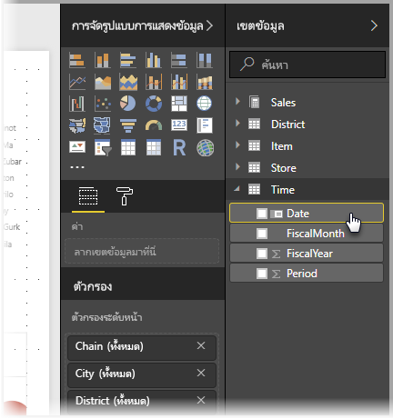

# ตั้งค่า และใช้งานตารางวันที่ใน Power BI DesktopSet and use date tables in Power BI Desktop

**Power BI Desktop** กำหนดคอลัมน์ที่แสดงวันที่อยู่เบื้องหลัง แล้วสร้างลำดับชั้นของวันที่ และเปิดให้ใช้เมตาดาต้าสำหรับรูปแบบข้อมูลของคุณ โดยอัตโนมัติ**Power BI Desktop** works behind the scenes to automatically identify columns that represent dates, and then creates date hierarchies and other enabling metadata for your model, on your behalf. คุณสามารถใช้ลำดับชั้นที่มีอยู่แล้วเหล่านี้ตอนสร้างรายงาน เช่นวิชวล ตาราง การวัดผลด่วน ตัวแบ่งส่วนข้อมูล และอื่น ๆYou can then use those built-in hierarchies when creating report features like visuals, tables, quick measures, slicers, and so on. Power BI Desktop ทำงานโดยการสร้างตารางที่ซ่อนอยู่ภายในให้กับคุณ ที่คุณสามารถนำไปใช้ต่อในรายงานและนิพจน์ DAX ของคุณPower BI Desktop does this by creating hidden tables on your behalf, which you can then use for your reports and DAX expressions.

สำหรับข้อมูลเพิ่มเติมเกี่ยวกับลักษณะการทำงานอัตโนมัตินี้ ให้อ่านบทความ [วันที่/เวลาอัตโนมัติใน Power BI Desktop](desktop-auto-date-time.md)For more information about this automatic behavior, read the [Auto date/time in Power BI Desktop](desktop-auto-date-time.md) article.

นักวิเคราะห์ข้อมูลหลายคนต้องการสร้างตารางวันที่ของพวกเขาเองมากกว่า ซึ่งก็สามารถทำได้Many data analysts prefer to create their own date tables, which is fine. ใน **Power BI Desktop** คุณสามารถระบุตารางที่คุณต้องการใช้เป็น **ตารางวันที่** และสร้างวิชวล ตาราง การวัดผลด่วน ฯลฯ ที่เกี่ยวกับวันที่ โดยใช้ข้อมูลของตารางดังกล่าวIn **Power BI Desktop**, you can specify the table you want your model to use as its **date table**, and subsequently create date-related visuals, tables, quick measures, and so on, using that table's date data. เมื่อคุณระบุตารางวันที่ของคุณเอง คุณควบคุมลำดับชั้นของวันที่ ที่สร้างขึ้นในรูปแบบของคุณ และใช้งานใน **การวัดผลด่วน** และการดำเนินการอื่น ๆ ที่ใช้ตารางวันที่ของรูปแบบคุณWhen you specify your own date table, you control the date hierarchies created in your model, and use them in **quick measures** and other operations that use your model's date table.

## การตั้งค่าตารางวันของคุณเองSetting your own date table

เมื่อต้องการตั้งค่า **ตารางวันที่** เลือกตารางคุณต้องการใช้เป็นตารางวันที่ในบานหน้าต่าง **เขตข้อมูล** จากนั้นคลิกขวาที่ตารางแล้วเลือก **ทำเครื่องหมายเป็นตารางวันที่ > ทำเครื่องหมายเป็นตารางวันที่** ในเมนูที่ปรากฏขึ้น ดังแสดงในรูปต่อไปนี้To set a **date table** select the table you want to use as a date table in the **Fields** pane, then right-click the table and select **Mark as date table > Mark as date table** in the menu that appears, as shown in the following image.

คุณยังสามารถเลือกตาราง แล้วเลือก **ทำเครื่องหมายเป็นตารางวันที่** จาก ribbon **การวางรูปแบบ** ดังแสดงในที่นี้You can also select the table and then select **Mark as Date Table** from the **Modeling** ribbon, shown here.

เมื่อคุณระบุ **ตารางวันที่** ด้วยตนเอง Power BI Desktop จะทำการตรวจสอบคอลัมน์และข้อมูลของมัน เพื่อให้แน่ใจว่าข้อมูลดังกล่าว:When you specify your own **date table**, Power BI Desktop performs the following validations of that column and its data, to ensure that the data:

* มีค่าที่ไม่ซ้ำกันcontains unique values
* ไม่มีค่า nullcontains no null values
* มีวันที่ต่อเนื่องกัน (จากเริ่มต้นถึงสิ้นสุด)contains contiguous date values (from beginning to end)
* ถ้าเป็นชนิดข้อมูล **วันที่/เวลา** แต่ละค่าจะต้องประทับเวลาเดียวกันif it is a **Date/Time** data type, it has the same timestamp across each value

มีสองสถานการณ์ที่คุณน่าจะได้การสร้างตารางวันที่ของคุณเอง ซึ่งล้วนสมเหตุสมผล:There are two likely scenarios for creating your own date table, either of which is a reasonable approach:

* สถานการณ์แรกคือ เมื่อคุณใช้ตารางวันที่และลำดับชั้น มาตรฐานหรือพื้นฐานThe first scenario is when you use a canonical, or basic date table and hierarchy. ซึ่งก็คือตารางในข้อมูลคุณ ที่ผ่านเกณฑ์การตรวจสอบตารางวันที่ ที่ได้อธิบายไว้ก่อนหน้านี้This is a table in your data that meets the previously described validation criteria for a date table. 

* สถานการณ์ที่สองคือ เมื่อคุณใช้ตารางจาก Analysis Services ที่มีเขตข้อมูล *dim date* ที่คุณต้องการใช้เป็นตารางวันที่ของคุณ เป็นต้นThe second scenario is where you use a table from Analysis Services, for example, with a *dim date* field that you want to use as your date table. 

หลังจากที่คุณระบุตารางวันที่แล้ว คุณสามารถเลือกคอลัมน์ในตารางที่จะเป็นคอลัมน์วันที่Once you specify a date table, you can select which column in that table is the date column. คุณสามารถระบุคอลัมน์ที่จะใช้ โดยการเลือกตารางในบานหน้าต่าง **เขตข้อมูล** จากนั้นคลิกขวาที่ตาราง แล้วเลือก **ทำเครื่องหมายเป็นตารางวันที่ > การตั้งค่าตารางวันที่**You can specify which column to use by selecting the table in the **Fields** pane, then right-click the table and select **Mark as date table > Date table settings**. หน้าต่างต่อไปนี้จะปรากฏขึ้นมา ซึ่งคุณสามารถเลือกคอลัมน์ที่จะใช้เป็นตารางวันที่จากกล่องรายการดรอปดาวน์The following window appears, where you can select the column to use as the date table from the drop-down box.

สิ่งสำคัญที่ต้องทราบคือ เมื่อคุณระบุตารางวันที่ของคุณเอง **Power BI Desktop** จะไม่สร้างลำดับชั้นโดยอัตโนมัติลงในรูปแบบของคุณIt's important to note that when you specify your own date table, **Power BI Desktop** does not auto-create the hierarchies that it would otherwise build into your model on your behalf. ถ้าคุณยกเลิกเลือกตารางวันที่ของคุณในภายหลัง (และไม่มีตารางวันที่ที่กำหนดด้วยตนเองอีก) Power BI Desktop จะสร้างตารางวันที่ใหม่ให้โดยอัตโนัติ สำหรับคอลัมน์วันที่ในตารางIf you later deselect your date table (and no longer have a manually set date table), Power BI Desktop recreates the automatically created built-in date tables for you, for the date columns in the table.

อีกสิ่งสำคัญที่ต้องทราบคือ เมื่อคุณกำหนดตารางให้เป็นตารางวันที่ ตารางวันที่ภายในที่ Power BI Desktop สร้างขึ้นโดยอัตโนมัติ จะถูกเอาออก และวิชวลหรือนิพจน์ DAX ที่คุณสร้างไว้ก่อนหน้านี้โดยใช้ตารางดังกล่าวจะไม่ทำงานอีกต่อไปAlso important to note is that when you mark a table as a date table, the built-in (automatically created) date table that Power BI Desktop created is removed, and any visuals or DAX expressions you previously created based on those built-in tables will no longer work properly. 

## การกำหนดชนิดข้อมูลของตารางวันที่ให้เหมาะสมMarking your date table as the appropriate data type

เมื่อคุณระบุ **ตารางวันที่** ของตัวเอง คุณจะต้องแน่ใจว่า ชนิดข้อมูลถูกตั้งค่าอย่างเหมาะสมWhen you specify your own **date table**, you need to make sure the data type is properly set. คุณจะต้องการตั้งค่า **ชนิดข้อมูล** ไปเป็น **วันที่/เวลา** หรือ **วันที่**You want to set the **Data type** to **Date/Time** or **Date**. ให้ทำตามขั้นตอนต่อไปนี้:Take the following steps to do so:

1. เลือก **ตารางวันที่** ของคุณจากบานหน้าต่าง **เขตข้อมูล** ขยายมันถ้าจำเป็น จากนั้นเลือกคอลัมน์ที่จะใช้เป็นวันที่Select your **date table** from the **Fields** pane, expand it if necessary, and then select the column to be used as the date.
   
     

2. บนแท็บ **การวางรูปแบบ** เลือก **ชนิดข้อมูล:** แล้วคลิกลูกศรดรอปดาวน์เพื่อแสดงชนิดข้อมูลที่มีให้On the **Modeling** tab, select **Data type:** and then click the drop-down arrow to show available data types.

    

3. ระบุชนิดข้อมูลสำหรับคอลัมน์ของคุณSpecify the data type for your column. 

## ขั้นตอนถัดไปNext steps

สำหรับข้อมูลเพิ่มเติมที่เกี่ยวข้องกับบทความนี้ โปรดดูทรัพยากรต่อไปนี้:For more information related to this article, check out the following resources:

* [วันที่/เวลาอัตโนมัติใน Power BI DesktopAuto date/time in Power BI Desktop](desktop-auto-date-time.md)
* [สร้างตารางวันที่ใน Power BI DesktopCreate date tables in Power BI Desktop](../guidance/model-date-tables.md)
* [ชนิดข้อมูลใน Power BI DesktopData types in Power BI Desktop](../connect-data/desktop-data-types.md)
* มีคำถามหรือไม่Questions? [ลองถามชุมชน Power BITry asking the Power BI Community](https://community.powerbi.com/)
* มีข้อเสนอแนะไหมSuggestions? [สนับสนุนแนวคิดในการปรับปรุง Power BIContribute ideas to improve Power BI](https://ideas.powerbi.com/)
