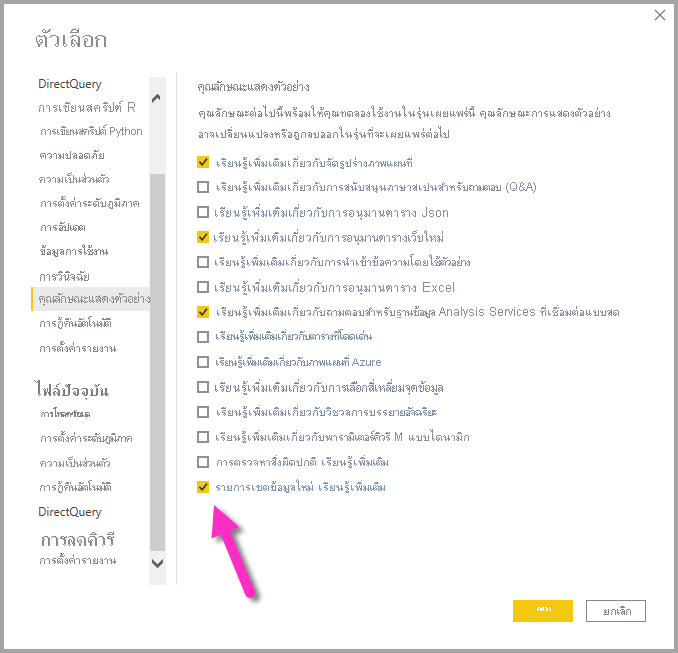
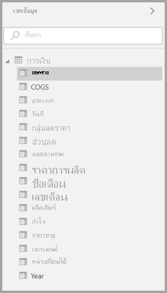
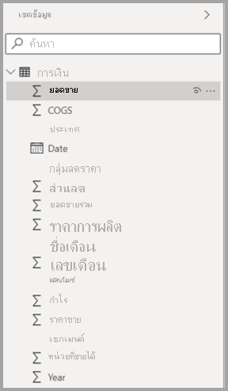
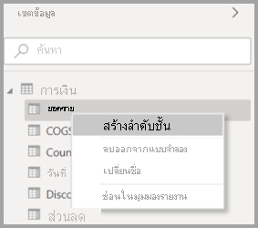
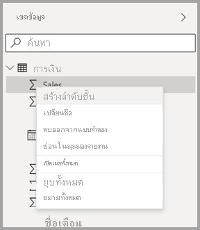
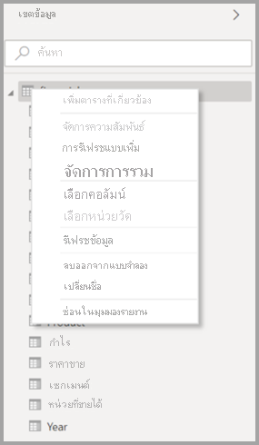
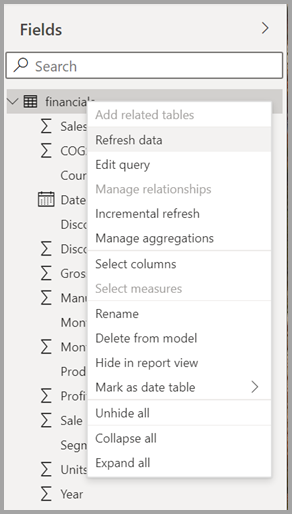
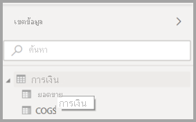
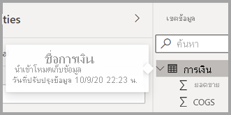

# การใช้รายการเขตข้อมูลใน Power BI Desktop (ตัวอย่าง)Using the Field list in Power BI Desktop (preview)

เริ่มต้นด้วยการอัปเดตประจำเดือนพฤศจิกายน 2020 เรากำลังรวมรายการ **เขตข้อมูล** เข้าด้วยกันในมุมมองแบบจำลอง มุมมองข้อมูล และมุมมองรายงานใน Power BI DesktopBeginning with the November 2020 update, we are unifying the **Field** lists across Model view, Data view and Report view in Power BI Desktop. การรวมมุมมองเหล่านี้เข้าด้วยกันจะสร้างความสอดคล้องสำหรับฟังก์ชันการทำงานและอินเทอร์เฟซผู้ใช้ (UI) ในมุมมอง และตอบสนองคำติชมองลูกค้าUnifying these views will create consistency for functionality and the user interface (UI) across views, and addresses customer feedback.

การเปลี่ยนแปลงที่คุณจะสังเกตเห็นในมุมมองมีดังต่อไปนี้:Changes you’ll notice across views include the following:

* การเขียนรูปลักษณ์Iconography
* ฟังก์ชันการค้นหาSearch functionality
* รายการเมนูบริบทContext menu items
* ลักษณะการลากวางที่คล้ายกันSimilar drag-drop behavior
* คำแนะนำเครื่องมือTooltips
* การปรับปรุงการช่วยสำหรับการเข้าถึงAccessibility improvements

เจตนาคือการปรับปรุงความสามารถในการใช้งาน Power BI DesktopThe intent is to improve Power BI Desktop usability. การเปลี่ยนแปลงควรมีผลกระทบน้อยที่สุดกับเวิร์กโฟลว์ข้อมูลทั่วไปของคุณThe changes should have minimal impact on your typical data workflow.

## การเปิดใช้งานรายการเขตข้อมูลใหม่ (ตัวอย่าง)Enabling the new Field list (preview)

รายการเขตข้อมูลแบบรวมเริ่มต้นด้วยมุมมอง **แบบจำลอง** จากนั้นจะเปิดใช้งานสำหรับมุมมองอื่น ๆThe unified Field list begins with **Model** view, and subsequently will be enabled for other views. เพื่อเปิดใช้งานมุมมองเขตข้อมูลแบบรวม ใน Power BI Desktop ให้นำทางไปที่ **ไฟล์ > ตัวเลือกและการตั้งค่า > ตัวเลือก** แล้วเลือก **คุณลักษณะการแสดงตัวอย่าง** จากบานหน้าต่างด้านซ้ายTo enable the unified Field view, in Power BI Desktop navigate to **File > Options and settings > Options** and then select **Preview features** from the left pane. ในส่วนคุณลักษณะการแสดงตัวอย่าง ให้เลือกกล่องกาเครื่องหมายด้านข้าง **รายการเขตข้อมูลใหม่**In the Preview features section, select the checkbox beside **New field list**.

คุณจะได้รับพร้อมท์แจ้งให้รีสตาร์ท Power BI Desktop เพื่อให้การเลือกมีผลYou'll be prompted to restart Power BI Desktop for the selection to take effect.

## การเปลี่ยนแปลงรายการเขตข้อมูลField list changes

ตารางต่อไปนี้แสดงการอัปเดตรายการเขตข้อมูลThe following tables show the field list updates. 

|**รายการเขตข้อมูลเดิม (มุมมองแบบจำลอง)****Original field list (Model view)**  | **รายการเขตข้อมูลใหม่ (มุมมองแบบจำลอง)****New field list (Model view)**  |
|:---------:|:---------:|
|**เดิม****Original** |**สร้าง****New** |
|**ไอคอนและ UI****Icons and UI**       ||
|     |    |
|**เมนูบริบท - เขตข้อมูล****Context menu - Field**       ||
|     |    |
|**เมนูบริบท - ตาราง****Context menu - Table**       ||
|     |    |
|**คำแนะนำเครื่องมือ****Tooltips**       ||
|     |    |

## ไอคอนรายการเขตข้อมูลField list icons

มีไอคอนรายการเขตข้อมูลใหม่เช่นกันThere are new Field list icons as well. ตารางต่อไปนี้แสดงไอคอนเดิมและไอคอนแบบใหม่ที่เทียบเท่า และให้คำอธิบายสั้น ๆ ของแต่ละไอคอนThe following table shows the original icons and their new equivalent, and provides a brief description of each. 

|ไอคอนแบบดั้งเดิมOriginal icon  |ไอคอนใหม่New icon  |คำอธิบายDescription  |
|:---------:|:---------:|:---------|
|     |           |โฟลเดอร์ในรายการเขตข้อมูลFolder in the Fields list         |
|     |         |เขตข้อมูลตัวเลข: เขตข้อมูลตัวเลขคือ ผลรวมที่สามารถบวกหรือเฉลี่ยได้ เป็นต้นNumeric field: Numeric fields are aggregates that can be summed or averaged, for example. ผลรวมเป็นการนำเข้าข้อมูลและถูกกำหนดในแบบจำลองข้อมูลที่เป็นไปตามรายงานของคุณ)Aggregates are imported with the data and defined in the data model your report is based on. สำหรับข้อมูลเพิ่มเติม ดู[ผลรวมในรายงาน Power BI](../create-reports/service-aggregates.md)For more information, see [Aggregates in Power BI reports](../create-reports/service-aggregates.md).         |
|     |         |คอลัมน์จากการคำนวณที่มีชนิดข้อมูลที่ไม่ใช่ตัวเลข: คอลัมน์ที่ไม่ใช่ตัวเลขใหม่ที่คุณสร้างขึ้นด้วยสูตร Data Analysis Expressions (DAX) ที่กำหนดค่าของคอลัมน์Calculated column with a non-numeric data type: A new non-numeric column you create with a Data Analysis Expressions (DAX) formula that defines the column’s values. อ่านเพิ่มเติมเกี่ยวกับ [คอลัมน์จากการคำนวณ](desktop-calculated-columns.md)Read more about [calculated columns](desktop-calculated-columns.md).        |
|     |          |คอลัมน์จากการคำนวณที่เป็นตัวเลข: คอลัมน์ใหม่ที่คุณสร้างขึ้นด้วยสูตร Data Analysis Expressions (DAX) ที่กำหนดค่าของคอลัมน์Numeric calculated column: A new column you create with a Data Analysis Expressions (DAX) formula that defines the column’s values. อ่านเพิ่มเติมเกี่ยวกับ [คอลัมน์จากการคำนวณ](desktop-calculated-columns.md)Read more about [calculated columns](desktop-calculated-columns.md).         |
|     |          |หน่วยวัด: แต่ละหน่วยวัดมีสูตรคำนวณที่ตายตัวMeasure: A measure has its own hard-coded formula. ผู้ดูรายงานไม่สามารถเปลี่ยนการคำนวณได้ ตัวอย่างเช่น ถ้านั่นเป็นผลรวม ค่านั้นจะสามารถเป็นผลรวมได้เท่านั้นReport viewers can’t change the calculation, for example, if it’s a sum, it can only be a sum. ไม่มีการจัดเก็บค่าในคอลัมน์The values aren't stored in a column. ค่าถูกคำนวณเพื่อให้ได้ผลลัพธ์อย่างรวดเร็ว ซึ่งขึ้นอยู่กับตำแหน่งที่ตั้งของค่าเหล่านั้นในวิชวลเท่านั้นThey're calculated on the fly, depending solely on their location in a visual. สำหรับข้อมูลเพิ่มเติม อ่าน [การทำความเข้าใจเกี่ยวกับหน่วยวัด](desktop-measures.md)For more information, read [Understanding measures](desktop-measures.md).         |
|     |         |กลุ่มหน่วยวัดMeasure group.         |
|     |         |KPI: เป็นภาพสัญลักษณ์ที่แสดงปริมาณความก้าวหน้าของงานที่ทำเพื่อมุ่งไปยังเป้าหมายที่วัดผลได้KPI: A visual cue that communicates the amount of progress made toward a measurable goal. อ่านเพิ่มเติมเกี่ยวกับวิชวล[ตัวบ่งชี้ประสิทธิภาพหลัก (KPI)](../visuals/power-bi-visualization-kpi.md)Read more about [Key Performance Indicator (KPI)](../visuals/power-bi-visualization-kpi.md) visuals.         |
|     |           |ลำดับชั้นของเขตข้อมูล: เลือกลูกศรเพื่อดูเขตข้อมูลที่ประกอบเป็นค่าลำดับชั้นHierarchy of fields: Select the arrow to see the fields that make up the hierarchy. ดูวิดีโอ Power BI นี้บน YouTube เกี่ยวกับ[การสร้างและการทำงานกับค่าลำดับชั้น](https://www.youtube.com/watch?v=q8WDUAiTGeU) สำหรับข้อมูลเพิ่มเติมWatch this Power BI video on YouTube about [Creating and working with hierarchies](https://www.youtube.com/watch?v=q8WDUAiTGeU) for more information.         |
|     |         |ข้อมูลทางภูมิศาสตร์: สามารถใช้เขตข้อมูลตำแหน่งที่ตั้งเพื่อสร้างการแสดงภาพของแผนที่ได้Geo data: These location fields can be used to create map visualizations.         |
|     |          |เขตข้อมูลข้อมูลประจำตัว: เขตข้อมูลที่มีไอคอนคือเขตข้อมูลที่ไม่ซ้ำกัน มีการตั้งค่าให้แสดงค่าทั้งหมด แม้ว่าเป็นค่าที่ซ้ำกันก็ตามIdentity field: Fields with this icon are unique fields, set to show all values, even if they have duplicates. ตัวอย่างเช่น ข้อมูลของคุณอาจมีบันทึกสำหรับผู้ที่มีชื่อ 'Robin Smith' สองคนที่แตกต่างกัน และแต่ละรายการจะถือว่าไม่ซ้ำกันFor example, your data might have records for two different people named 'Robin Smith', and each will be treated as unique. และจะไม่นำมารวมกันThey won't be summed.         |
|     |          |พารามิเตอร์... ตั้งค่าพารามิเตอร์เพื่อสร้างส่วนของรายงานและแบบจำลองข้อมูลของคุณ (เช่น ตัวกรองคิวรี การอ้างอิงแหล่งข้อมูล ข้อกำหนดหน่วยวัด ฯลฯ) จะขึ้นอยู่กับค่าพารามิเตอร์อย่างน้อยหนึ่งรายการParameter: Set parameters to make parts of your reports and data models (such as a query filter, a data source reference, a measure definition, etc.) depend on one or more parameter values. ดูบล็อก Power BI นี้โพสต์เกี่ยวกับ[พารามิเตอร์คิวรี](https://powerbi.microsoft.com/blog/deep-dive-into-query-parameters-and-power-bi-templates/) สำหรับข้อมูลเพิ่มเติมSee this Power BI blog post about [query parameters](https://powerbi.microsoft.com/blog/deep-dive-into-query-parameters-and-power-bi-templates/) for more information.         |
|     |         |เขตข้อมูลวันที่ปฏิทินที่มีตารางวันที่อยู่แล้วในตัวCalendar date field with a built-in date table.         |
|     |          |ตารางจากการคำนวณ: ตารางที่สร้างด้วยสูตรนิพจน์การวิเคราะห์ข้อมูล (DAX) ที่ยึดตามข้อมูลที่โหลดลงในแบบจำลองอยู่แล้วCalculated table: A table created with a Data Analysis Expressions (DAX) formula based on data already loaded into the model. สิ่งเหล่านี้เหมาะที่สุดสำหรับการคำนวณระดับกลางและคุณต้องการเก็บไว้เป็นส่วนหนึ่งของแบบจำลองThese are best used for intermediate calculations and you want to store as part of the model.         |
|     |         |คำเตือน: เขตข้อมูลจากการคำนวณที่มีข้อผิดพลาดWarning: A calculated field with an error. ตัวอย่างเช่น ไวยากรณ์ของนิพจน์ DAX อาจไม่ถูกต้องFor example, the syntax of the DAX expression might be incorrect.         |
|     |         |กลุ่ม: ค่าในคอลัมน์นี้ขึ้นอยู่กับการจัดกลุ่มค่าจากคอลัมน์อื่นโดยใช้คุณลักษณะกลุ่มและช่องเก็บGroup: Values in this column are based on grouping values from another column, by using the groups and bins feature. คุณสามารถอ่านวิธีการ[ใช้การจัดกลุ่มและการใช้ช่องเก็บ](../create-reports/desktop-grouping-and-binning.md)You can read how to [Use grouping and binning](../create-reports/desktop-grouping-and-binning.md).         |
| ไม่มีไอคอนแบบดั้งเดิมno original icon    |          |หน่วยวัดตรวจจับการเปลี่ยนแปลง: เมื่อคุณกำหนดค่าหน้าสำหรับการรีเฟรชหน้าอัตโนมัติ คุณสามารถกำหนดค่า[หน่วยวัดตรวจจับการเปลี่ยนแปลง](../create-reports/desktop-grouping-and-binning.md)ที่ถูกคิวรีเพื่อกำหนดว่าควรอัปเดตวิชวลที่เหลือของหน้าหรือไม่Change detection measure: When you configure a page for automatic page refresh, you can configure a [change detection measure](../create-reports/desktop-grouping-and-binning.md) that is queried to determine if the rest of a page’s visuals should be updated.         |

## ขั้นตอนถัดไปNext steps

คุณอาจสนใจบทความต่อไปนี้:You might also be interested in the following articles:

* [สร้างคอลัมน์จากการคำนวณใน Power BI DesktopCreate calculated columns in Power BI Desktop](desktop-calculated-columns.md)
* [ใช้การจัดกลุ่ม และจัดช่องเก็บใน Power BI DesktopUse grouping and binning in Power BI Desktop](../create-reports/desktop-grouping-and-binning.md)
* [ใช้เส้นตารางและจัดชิดกับเส้นตารางในรายงาน Power BI DesktopUse gridlines and snap-to-grid in Power BI Desktop reports](../create-reports/desktop-gridlines-snap-to-grid.md)

