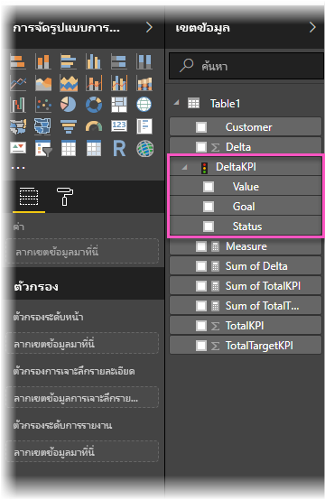
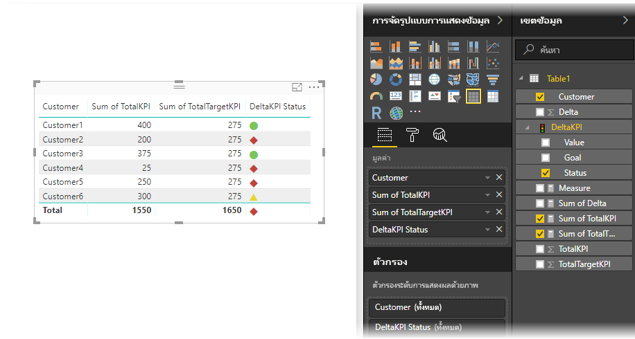

# นำเข้า และแสดง KPI ใน Power BIImport and display KPIs in Power BI
ด้วย **Power BI Desktop** คุณสามารถนำเข้าและแสดง KPI ในตาราง, เมทริกซ์ และการ์ดได้With **Power BI Desktop**, you can import and display KPIs in tables, matrices, and cards.

ทำตามขั้นตอนเหล่านี้ เมื่อต้องการนำเข้า และแสดง KPIFollow these steps to import and display KPIs.

1. เริ่มต้นด้วยเวิร์กบุ๊ก Excel ที่มีแบบจำลอง Power Pivot และ KPIStart with an Excel workbook that has a Power Pivot model and KPIs. แบบทดสอบนี้ใช้ชื่อเวิร์กบุ๊กว่า *KPI*This exercise uses a workbook named *KPIs*.

1. นำเข้าเวิร์กบุ๊ก Excel ลงใน Power BI โดยใช้ **ไฟล์ -> นำเข้า -> เนื้อหาเวิร์กบุ๊ก Excel**Import the Excel workbook into Power BI, using **File -> Import -> Excel workbook contents**. คุณยังสามารถ[เรียนรู้วิธีการนำเข้าเวิร์กบุ๊ก](../connect-data/desktop-import-excel-workbooks.md)ได้อีกด้วยYou can also [learn how to import workbooks](../connect-data/desktop-import-excel-workbooks.md). 

1. หลังจากนำเข้าลงใน Power BI, KPI ของคุณจะปรากฏขึ้นในบานหน้าต่าง **เขตข้อมูล** ที่ทำเครื่องหมายด้วยไอคอนAfter import into Power BI, your KPI will appear in the **Fields** pane, marked with the  icon. เพื่อใช้ KPI ในรายงานของคุณ ตรวจสอบให้แน่ใจว่าได้ขยายเนื้อหา ให้แสดงเขตข้อมูล **Value**, **Goal** และ **Status**To use a KPI in your report, be sure to expand its contents, exposing the **Value**, **Goal**, and **Status** fields.

    
 
1. KPI ที่นำเข้า เหมาะที่สุดสำหรับการแสดงภาพชนิดมาตรฐาน เช่น ชนิด **ตาราง**Imported KPIs are best used in standard visualization types, such as the **Table** type. Power BI ยังมีการแสดงภาพชนิด **KPI** ซึ่งควรใช้เพื่อสร้าง KPI ใหม่เท่านั้นPower BI also includes the **KPI** visualization type, which should only be used to create new KPIs.
   
    

ขั้นตอนทั้งหมดก็มีเพียงเท่านี้That's all there is to it. คุณสามารถใช้ KPI เพื่อเน้นแนวโน้มที่สำคัญ, ความคืบหน้า หรือตัวบ่งชี้ที่สำคัญอื่นๆYou can use KPIs to highlight trends, progress, or other important indicators.
