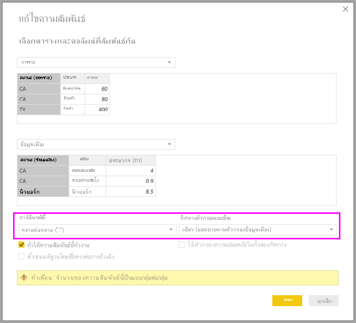
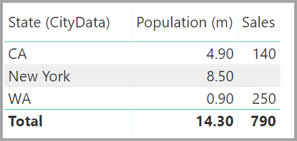

# ใช้ความสัมพันธ์แบบกลุ่ม-ต่อ-กลุ่มใน Power BI DesktopApply many-many relationships in Power BI Desktop

ด้วย *คาร์ดินาลลิตี้ความสัมพันธ์แบบกลุ่ม-ต่อ-กลุ่ม* ใน Power BI Desktop คุณสามารถเข้าร่วมตารางที่ใช้คาร์ดินาลลิตี้ของ *กลุ่ม-ต่อ-กลุ่ม*With *relationships with a many-many cardinality* in Power BI Desktop, you can join tables that use a cardinality of *many-to-many*. คุณสามารถสร้างโมเดลข้อมูลที่มีสองแหล่งข้อมูลหรือมากกว่าได้อย่างง่ายดายYou can more easily and intuitively create data models that contain two or more data sources. *คาร์ดินาลลิตี้ความสัมพันธ์แบบกลุ่ม-ต่อ-กลุ่ม* คือหนึ่งในความสามารถของ *โมเดลแบบรวม* ที่ใหญ่ขึ้นใน Power BI Desktop*Relationships with a many-many cardinality* are part of the larger *composite models* capabilities in Power BI Desktop.

*คาร์ดินาลลิตี้ความสัมพันธ์แบบกลุ่ม-ต่อ-กลุ่ม* ใน Power BI Desktop ประกอบด้วยหนึ่งใน 3 คุณลักษณะที่เกี่ยวข้อง:A *relationship with a many-many cardinality* in Power BI Desktop is composed of one of three related features:

* **โมเดลแบบรวม**: *โมเดลแบบรวม* อนุญาตให้รายงานมีการเชื่อมต่อข้อมูลตั้งแต่สองแบบขึ้นไป รวมถึงการเชื่อมต่อ DirectQuery หรือการนำเข้าในรูปแบบใด ๆ ก็ตาม**Composite models**: A *composite model* allows a report to have two or more data connections, including DirectQuery connections or Import, in any combo. สำหรับข้อมูลเพิ่มเติม โปรดดูการ[ใช้โมเดลแบบรวมใน Power BI Desktop](desktop-composite-models.md)For more information, see [Use composite models in Power BI Desktop](desktop-composite-models.md).

* **ความสัมพันธ์แบบกลุ่ม-กลุ่มคาร์ดิลิตี้**: ด้วยโมเดลแบบรวม คุณสามารถสร้าง *คาร์ดินาลลิตี้ความสัมพันธ์แบบกลุ่ม-ต่อ-กลุ่ม* ระหว่างตารางได้**Relationships with a many-many cardinality**: With composite models, you can establish *relationships with a many-many cardinality* between tables. วิธีการนี้จะลบขอคำสำหรับค่าเฉพาะในตารางThis approach removes requirements for unique values in tables. นอกจากนี้ยังลบการแก้ปัญหาชั่วคราวก่อนหน้า เช่น การเริ่มตารางใหม่เพียงเพื่อสร้างความสัมพันธ์It also removes previous workarounds, such as introducing new tables only to establish relationships. จะอธิบายคุณลักษณะต่อไปในบทความนี้The feature is described further in this article.

* **โหมดการจัดเก็บข้อมูล**: คุณสามารถระบุวิชวลที่ต้องการคิวรีไปยังแหล่งข้อมูลระบบ Back-end ได้**Storage mode**: You can now specify which visuals require a query to back-end data sources. วิชวลที่ไม่ต้องใช้คิวรีจะถูกนำเข้าแม้ว่าจะมาจาก DirectQueryVisuals that don't require a query are imported even if they're based on DirectQuery. คุณลักษณะนี้จะช่วยปรับปรุงประสิทธิภาพ และลดการโหลดระบบ Back-endThis feature helps improve performance and reduce back-end load. ก่อนหน้านี้ แม้กระทั่งวิชวลพื้นฐานอย่าง Slicers ก็เริ่มคิวรีที่ถูกส่งไปยังแหล่งระบบ Back-endPreviously, even simple visuals, such as slicers, began queries that were sent to back-end sources. สำหรับข้อมูลเพิ่มเติม โปรดดู [โหมดการจัดเก็บข้อมูลใน Power BI Desktop](desktop-storage-mode.md)For more information, see [Storage mode in Power BI Desktop](desktop-storage-mode.md).

## การแก้ไขปัญหาของคาร์ดินาลลิตี้ความสัมพันธ์แบบกลุ่ม-ต่อ-กลุ่มWhat a relationship with a many-many cardinality solves

ก่อนที่จะมี *คาร์ดินาลลิตี้ความสัมพันธ์แบบกลุ่ม-ต่อ-กลุ่ม* ความสัมพันธ์ระหว่างสองตารางถูกกำหนดไว้ใน Power BIBefore *relationships with a many-many cardinality* became available, the relationship between two tables was defined in Power BI. อย่างน้อยหนึ่งในคอลัมน์ของตารางที่อยู่ในความสัมพันธ์ต้องมีค่าเฉพาะAt least one of the table columns involved in the relationship had to contain unique values. แต่บ่อยครั้งที่ไม่มีคอลัมน์ที่มีค่าเฉพาะOften, though, no columns contained unique values.

ตัวอย่างเช่น สองตารางอาจมีคอลัมน์ที่มีชื่อว่า Country For example, two tables might have had a column labeled Country. ค่าของ Country ไม่ได้เฉพาะเจาะจงในตารางแต่อย่างใดThe values of Country weren't unique in either table, though. ในการรวมตารางดังกล่าว คุณจะต้องสร้างการแก้ปัญหาชั่วคราวTo join such tables, you had to create a workaround. การแก้ปัญหาชั่วคราวอย่างหนึ่งอาจจะเป็นการแนะนำตารางเพิ่มเติมที่มีค่าที่ไม่ซ้ำกันที่จำเป็นOne workaround might be to introduce extra tables with the needed unique values. ด้วย *คาร์ดินาลลิตี้ความสัมพันธ์แบบกลุ่ม-ต่อ-กลุ่ม* คุณสามารถรวมตารางดังกล่าวได้โดยตรงได้หากคุณใช้คาร์ดินาลลิตี้ความสัมพันธ์ของ *กลุ่ม-ต่อ-กลุ่ม*With *relationships with a many-many cardinality*, you can join such tables directly, if you use a relationship with a cardinality of *many-to-many*.

## ใช้คาร์ดินาลลิตี้ความสัมพันธ์แบบกลุ่ม-ต่อ-กลุ่มUse relationships with a many-many cardinality

เมื่อทำการกำหนดความสัมพันธ์ระหว่างตารางสองตารางใน Power BI คุณจะต้องกำหนดคาร์ดินาลลิตี้ของความสัมพันธ์When you define a relationship between two tables in Power BI, you must define the cardinality of the relationship. ตัวอย่างเช่น ความสัมพันธ์ระหว่าง ProductSales และ Product&mdash;โดยใช้คอลัมน์ ProductSales[ProductCode] และ Product[ProductCode]&mdash;จะได้รับการกำหนดเป็น *Many-1*For example, the relationship between ProductSales and Product&mdash;using columns ProductSales[ProductCode] and Product[ProductCode]&mdash;would be defined as *Many-1*. เรากำหนดความสัมพันธ์ด้วยวิธีนี้เพราะแต่ละผลิตภัณฑ์มียอดขายจำนวนมาก และคอลัมน์ในตารางผลิตภัณฑ์ (ProductCode) เป็นคอลัมน์เฉพาะWe define the relationship in this way, because each product has many sales, and the column in the Product table (ProductCode) is unique. เมื่อคุณกำหนดคาร์ดินาลลิตี้ความสัมพันธ์เป็น *Many-1*, *1-Many* หรือ *1-1* Power BI จะตรวจสอบ ดังนั้นคาร์ดินาลลิตี้ที่คุณเลือกจะตรงกับข้อมูลจริงWhen you define a relationship cardinality as *Many-1*, *1-Many*, or *1-1*, Power BI validates it, so the cardinality that you select matches the actual data.

ตัวอย่างเช่น ลองดูโมเดลง่าย ๆ ในภาพนี้:For example, take a look at the simple model in this image:

สมมติว่าตาราง **ผลิตภัณฑ์** แสดงเพียงสองแถวดังภาพ:Now, imagine that the **Product** table displays just two rows, as shown:

และสมมติว่าตารางยอดขายมีเพียงสี่แถว ซึ่งรวมถึงแถวสำหรับผลิตภัณฑ์ C เนื่องจากข้อผิดพลาดของ Referential Integrity จึงไม่มีแถวของผลิตภัณฑ์ C ในตาราง **ผลิตภัณฑ์**Also imagine that the Sales table has just four rows, including a row for a product C. Because of a referential integrity error, the product C row doesn't exist in the **Product** table.

**ProductName** และ **ราคา** (จากตาราง **ผลิตภัณฑ์**) พร้อมกับ **จำนวน** รวมสำหรับแต่ละผลิตภัณฑ์ (จากตาราง ProductSales) จะแสดงดังภาพ:The **ProductName** and **Price** (from the **Product** table), along with the total **Qty** for each product (from the ProductSales table), would be displayed as shown:

ดังที่เห็นในภาพก่อน แถว **ProductName** ที่ว่างจะสัมพันธ์กับยอดขายสำหรับผลิตภัณฑ์ C แถวว่างนี้สามารถอธิบายได้ดังต่อไปนี้:As you can see in the preceding image, a blank **ProductName** row is associated with sales for product C. This blank row accounts for the following:

* แถวใดๆ ในตาราง **ProductSales** ที่ไม่สอดคล้องกับแถวอยู่ในตาราง **ผลิตภัณฑ์**Any rows in the **ProductSales** table for which no corresponding row exists in the **Product** table. มีปัญหา Referential Integrity ตามที่เราเห็นสำหรับผลิตภัณฑ์ C ในตัวอย่างนี้There's a referential integrity issue, as we see for product C in this example.

* แถวใดๆ ในตาราง **ProductSales** ที่คอลัมน์คีย์นอกเป็น NullAny rows in the **ProductSales** table for which the foreign key column is null.

เนื่องด้วยเหตุผลดังกล่าว ในทั้งสองกรณีแถวที่เว้นว่างมีสาเหตุมาจากการขายที่ไม่ทราบ **ProductName** และ **ราคา**For these reasons, the blank row in both cases accounts for sales where the **ProductName** and **Price** are unknown.

บางครั้งที่ตารางถูกรวมเข้าด้วยกันโดยคอลัมน์สองคอลัมน์ แต่ไม่มีคอลมน์ใดที่เป็นค่าเฉพาะเลยSometimes the tables are joined by two columns, yet neither column is unique. ตัวอย่างเช่น ลองพิจารณาตารางสองตารางเหล่านี้:For example, consider these two tables:

* ตาราง **การขาย** แสดงข้อมูลการขายตาม **รัฐ** และแต่ละแถวมีจำนวนการขายของประเภทการขายในรัฐนั้นๆThe **Sales** table displays sales data by **State**, and each row contains the sales amount for the type of sale in that state. รัฐรวมถึง CA, WA และ TXThe states include CA, WA, and TX.

    

* ตาราง **CityData** แสดงข้อมูลเกี่ยวกับเมืองต่าง ๆ รวมทั้งประชากรและรัฐ (เช่น CA, WA และนิวยอร์ก)The **CityData** table displays data on cities, including the population and state (such as CA, WA, and New York).

    

ตอนนี้คอลัมน์สำหรับ **รัฐ** มีอยู่ทั้งสองตารางA column for **State** is now in both tables. ซึ่งเหมาะสมที่จะต้องการรายงานทั้งยอดขายรวมตามรัฐและจำนวนประชากรทั้งหมดของแต่ละรัฐIt's reasonable to want to report on both total sales by state and total population of each state. อย่างไรก็ตาม มีปัญหา: คอลัมน์ **รัฐ** ไม่มีค่าเฉพาะในตารางทั้งสองHowever, a problem exists: the **State** column isn't unique in either table.

## การแก้ปัญหาชั่วคราวก่อนหน้านี้The previous workaround

ก่อนหน้าเวอร์ชัน Power BI Desktop ที่เปิดตัวในเดือนกรกฎาคม 2018 คุณไม่สามารถสร้างความสัมพันธ์โดยตรงระหว่างตารางเหล่านี้ได้Before the July 2018 release of Power BI Desktop, you couldn't create a direct relationship between these tables. การแก้ปัญหาชั่วคราวทั่วไปคือ:A common workaround was to:

* สร้างตารางที่สามที่มีเพียง ID รัฐเฉพาะเท่านั้นCreate a third table that contains only the unique State IDs. อาจเป็นตารางทั้งหมดหรือตารางใดตารางหนึ่งจาก:The table could be any or all of:
  * ตารางการคำนวณ (กำหนดโดยการใช้ Data Analysis Expressions [DAX])A calculated table (defined by using Data Analysis Expressions [DAX]).
  * ตารางจากคิวรีที่ถูกกำหนดในตัวแก้ไขคิวรี ซึ่งอาจแสดง ID เฉพาะที่ดึงมาจากตารางใดตารางหนึ่งA table based on a query that's defined in Query Editor, which could display the unique IDs drawn from one of the tables.
  * ชุดรวมต็มรูปแบบThe combined full set.

* จากนั้นเชื่อมโยงสองตารางเดิมเข้ากับตารางใหม่ โดยใช้ความสัมพันธ์แบบ *Many-1* ทั่วไปThen relate the two original tables to that new table by using common *Many-1* relationships.

คุณสามารถแสดงตารางการแก้ปัญหาชั่วคราวYou could leave the workaround table visible. หรือคุณอาจซ่อนตารางการแก้ปัญหาชั่วคราว ดังนั้นจึงไม่ปรากฏในรายการ **เขตข้อมูล**Or you may hide the workaround table, so it doesn't appear in the **Fields** list. หากคุณซ่อนตาราง ความสัมพันธ์ *Many-1* จะถูกตั้งค่าสำหรับตัวกรองในสองทิศทาง และคุณสามารถใช้เขตข้อมูลรัฐจากทั้งสองตารางได้If you hide the table, the *Many-1* relationships would commonly be set to filter in both directions, and you could use the State field from either table. การกรองข้ามที่ตามมาจะเผยแพร่ไปยังตารางอื่นThe later cross filtering would propagate to the other table. วิธีการนี้แสดงตามภาพต่อไปนี้:That approach is shown in the following image:

วิชวลที่แสดง **รัฐ** (จากตาราง **CityData**) กับจำนวน **ประชากร** ทั้งหมด และ **การขาย** ทั้งหมด จะปรากฏดังนี้:A visual that displays **State** (from the **CityData** table), along with total **Population** and total **Sales**, would then appear as follows:

> [!NOTE]
> เนื่องจากรัฐจากตาราง **CityData** ถูกใช้ในการแก้ปัญหาชั่วคราว จึงมีเพียงรัฐในตารางนั้นเท่านั้นที่แสดงในรายการ เพราะฉะนั้นจะไม่มี TXBecause the state from the **CityData** table is used in this workaround, only the states in that table are listed, so TX is excluded. นอกจากนี้ สิ่งที่ไม่เหมือนกับความสัมพันธ์แบบ *Many-1* ก็คือในขณะที่แถวทั้งหมดประกอบด้วย **ยอดขาย** รวม (รวมถึงของ TX) รายละเอียดจะไม่รวมแถวที่เว้นว่าง ซึ่งครอบคลุมแถวที่ไม่ตรงกันดังกล่าวAlso, unlike *Many-1* relationships, while the total row includes all **Sales** (including those of TX), the details don't include a blank row covering such mismatched rows. เช่นเดียวกัน จะไม่มีแถวที่เว้นว่างที่ครอบคลุม **ยอดขาย** ใดๆ ซึ่งมีค่า Null สำหรับ **รัฐ**Similarly, no blank row would cover **Sales** for which there's a null value for the **State**.

สมมติว่าคุณยังเพิ่มเมืองลงในวิชวลนั้นด้วยSuppose you also add City to that visual. แม้ว่าจะทราบจำนวนประชากรต่อเมือง **ยอดขาย** ที่แสดงสำหรับเมืองจะเพียงแค่ทำซ้ำ **ยอดขาย** สำหรับ **รัฐ** ที่สอดคล้องกันAlthough the population per City is known, the **Sales** shown for City simply repeats the **Sales** for the corresponding **State**. สถานการณ์นี้มักจะเกิดขึ้นเมื่อการจัดกลุ่มคอลัมน์ไม่เกี่ยวข้องกับหน่วยวัดการรวมบางรายการดังที่แสดงไว้ที่นี่:This scenario normally occurs when the column grouping is unrelated to some aggregate measure, as shown here:

สมมติว่าคุณได้กำหนดตารางยอดขายใหม่เป็นการรวมกันของรัฐทั้งหมดที่นี่ และเราแสดงตารางดังกล่าวในรายการ **เขตข้อมูล**Let's say you define the new Sales table as the combination of all States here, and we make it visible in the **Fields** list. วิชวลเดียวกันจะแสดง **รัฐ** (ในตารางใหม่) **จำนวนประชากร** รวม และ **ยอดขาย** รวม:The same visual would display **State** (on the new table), the total **Population**, and total **Sales**:

ดังที่เห็น &mdash;TX **ที่มีข้อมูล** ยอดขาย แต่ไม่ทราบข้อมูล *ประชากร*&mdash;และนิวยอร์ก&mdash;ที่มีข้อมูล **ประชากร** ที่ทราบแต่ไม่มีข้อมูล **ยอดขาย**&mdash;จะรวมอยู่ด้วยAs you can see, TX&mdash;with **Sales** data but unknown *Population* data&mdash;and New York&mdash;with known **Population** data but no **Sales** data&mdash;would be included. การแก้ปัญหาชั่วคราวนี้ไม่เหมาะสม และมีหลายปัญหาThis workaround isn't optimal, and it has many issues. สำหรับคาร์ดินาลลิตี้ความสัมพันธ์แบบกลุ่ม-ต่อ-กลุ่ม ปัญหาที่เกิดขึ้นได้รับการแก้ไขดังที่อธิบายในส่วนถัดไปFor relationships with a many-many cardinality, the resulting issues are addressed, as described in the next section.

## ใช้คาร์ดินาลลิตี้ความสัมพันธ์แบบกลุ่ม-ต่อ-กลุ่มแทนการแก้ปัญหาชั่วคราวUse a relationship with a many-many cardinality instead of the workaround

ด้วย Power BI Desktop เวอร์ชันเดือนกรกฎาคม 2018 คุณสามารถเชื่อมตารางได้โดยตรงดังเช่นที่อธิบายไว้ข้างต้น โดยไม่ต้องพึ่งการแก้ปัญหาชั่วคราวที่คล้ายกันWith the July 2018 version of Power BI Desktop, you can directly relate tables, such as the ones we described earlier, without having to resort to similar workarounds. สามารถตั้งค่าคาร์ดินาลลิตี้ความสัมพันธ์เป็นแบบ *กลุ่ม-ต่อ-กลุ่ม* ได้แล้วIt's now possible to set the relationship cardinality to *many-to-many*. การตั้งค่านี้บ่งบอกว่าไม่มีตารางใดที่มีค่าเฉพาะThis setting indicates that neither table contains unique values. สำหรับความสัมพันธ์ดังกล่าว คุณยังสามารถควบคุมว่าตารางใดที่จะกรองตารางอื่นFor such relationships, you may still control which table filters the other table. หรือคุณสามารถใช้การกรองแบบสองทิศทางที่แต่ละตารางจะกรองตารางอื่นOr you can apply bidirectional filtering, where each table filters the other.

ใน Power BI Desktop คาร์ดินาลลิตี้จะใช้ *กลุ่ม-ต่อ-กลุ่ม* เป็นค่าเริ่มต้น เมื่อพบว่าไม่มีตารางใดที่มีค่าเฉพาะสำหรับคอลัมน์ความสัมพันธ์In Power BI Desktop, the cardinality defaults to *many-to-many* when it determines neither table contains unique values for the relationship columns. ในกรณีเช่นนี้ ข้อความการแจ้งเตือนยืนยันว่าคุณต้องการตั้งค่าความสัมพันธ์และการเปลี่ยนแปลงไม่ใช่ผลที่เกิดขึ้นโดยไม่ตั้งใจจากปัญหาข้อมูลIn such cases, a warning message confirms you want to set a relationship, and the change isn't the unintended effect of a data issue.

ตัวอย่างเช่น เมื่อคุณสร้างความสัมพันธ์โดยตรงระหว่าง CityData และยอดขาย &mdash;ซึ่งตัวกรองควรโฟลว์จาก CityData ไปยังยอดขาย&mdash; Power BI Desktop จะแสดงกล่องโต้ตอบ **แก้ไขความสัมพันธ์** ดังภาพต่อไปนี้:For example, when you create a relationship directly between CityData and Sales&mdash;where filters should flow from CityData to Sales&mdash;Power BI Desktop displays the **Edit relationship** dialog box:

**มุมมองความสัมพันธ์** ที่ปรากฏจะแสดงความสัมพันธ์แบบกลุ่มต่อกลุ่มโดยตรงระหว่างสองตารางThe resulting **Relationship** view would then display the direct, many-to-many relationship between the two tables. ลักษณะของตารางในรายการ **เขตข้อมูล** และการทำงานที่ตามมาเมื่อสร้างวิชวลจะคล้ายกับเมื่อใช้การแก้ปัญหาชั่วคราวThe tables' appearance in the **Fields** list, and their later behavior when the visuals are created, are similar to when we applied the workaround. ในการแก้ปัญหาชั่วคราว จะมองไม่เห็นตารางพิเศษที่แสดงข้อมูลรัฐที่แตกต่างชัดเจนIn the workaround, the extra table that displays the distinct State data isn't made visible. ดังที่อธิบายไว้ก่อนหน้านี้ วิชวลที่แสดงข้อมูล **รัฐ** **ประชากร** และ **ยอดขาย** จะแสดงขึ้นมา:As described earlier, a visual that shows **State**, **Population**, and **Sales** data would be displayed:

ความแตกต่างที่สำคัญระหว่างความสัมพันธ์แบบ *กลุ่มต่อกลุ่มคาร์ดินัลลิตี้* กับความสัมพันธ์แบบ *Many-1* ทั่วไปมีดังนี้:The major differences between *relationships with a many-many cardinality* and the more typical *Many-1* relationships are as follows:

* ค่าที่แสดงไม่รวมแถวว่างที่เป็นเหตุของแถวที่ไม่ตรงในตารางอื่นThe values shown don't include a blank row that accounts for mismatched rows in the other table. นอกจากนี้ ค่าที่ไม่สามารถอธิบายแถวที่คอลัมน์ถูกใช้ในความสัมพันธ์ในตารางอื่นจะเป็น NullAlso, the values don't account for rows where the column used in the relationship in the other table is null.
* คุณไม่สามารถใช้ฟังก์ชัน `RELATED()`ได้เนื่องจากมีแถวมากกว่าหนึ่งแถวที่อาจเกี่ยวข้องYou can't use the `RELATED()` function, because more than one row could be related.
* การใช้ `ALL()` ฟังก์ชันบนตารางไม่ได้เป็นการลบตัวกรองที่ใช้กับตารางอื่นๆ ที่เชื่อมโยงโดยความสัมพันธ์แบบกลุ่ม-ต่อ-กลุ่มUsing the `ALL()` function on a table doesn't remove filters that are applied to other, related tables by a many-to-many relationship. ในตัวอย่างก่อนหน้า หน่วยวัดที่กำหนดดังแสดงในที่นี่จะไม่ลบตัวกรองบนคอลัมน์ในตาราง CityData ที่เชื่อมโยง:In the preceding example, a measure that's defined as shown here wouldn't remove filters on columns in the related CityData table:

    

    วิชวลที่แสดงข้อมูล **รัฐ** **ยอดขาย** และ **ยอดขายรวม** จะเป็นดังภาพนี้:A visual showing **State**, **Sales**, and **Sales total** data would result in this graphic:

    

ด้วยการคำนึงถึงความแตกต่างก่อนหน้านี้ ตรวจสอบให้แน่ใจว่าการคำนวณที่ใช้ `ALL(<Table>)` เช่น *% ของยอดรวม* จะแสดงค่าผลลัพธ์ที่เจาะจงWith the preceding differences in mind, make sure the calculations that use `ALL(<Table>)`, such as *% of grand total*, are returning the intended results.

## ข้อจำกัดและข้อควรพิจารณาLimitations and considerations

มีข้อจำกัดบางอย่างสำหรับการวางจำหน่าย *ความสัมพันธ์กับจำนวนนับแบบกลุ่มคาร์ดินัลลิตี้* และโมเดลแบบรวมThere are a few limitations for this release of *relationships with a many-many cardinality* and composite models.

แหล่งที่มา Live Connect (หลายมิติ) ดังต่อไปนี้ไม่สามารถใช้กับโมเดลแบบรวมได้:The following Live Connect (multidimensional) sources can't be used with composite models:

* SAP HANASAP HANA
* SAP Business WarehouseSAP Business Warehouse
* SQL Server Analysis ServicesSQL Server Analysis Services
* ชุดข้อมูล Power BIPower BI datasets
* Azure Analysis ServicesAzure Analysis Services

เมื่อทำการเชื่อมต่อกับแหล่งที่มาหลายมิติเหล่านี้โดยใช้ DirectQuery คุณจะไม่สามารถเชื่อมต่อกับแหล่งที่มา DirectQuery อีกแห่ง หรือรวมเข้ากับข้อมูลที่นำเข้าได้When you connect to these multidimensional sources by using DirectQuery, you can't connect to another DirectQuery source or combine it with imported data.

ข้อจำกัดในการใช้ DirectQuery ที่ยังมีอยู่จะยังคงมีผลเมื่อใช้ *ความสัมพันธ์แบบกลุ่ม-ต่อ-กลุ่มคาร์ดินัลลิตี้* The existing limitations of using DirectQuery still apply when you use *relationships with a many-many cardinality*. ข้อจำกัดจำนวนมากเป็นข้อจำกัดต่อตาราง โดยขึ้นอยู่กับโหมดที่เก็บข้อมูลของตารางMany limitations are now per table, depending upon the storage mode of the table. ตัวอย่างเช่น คอลัมน์ที่ได้รับการคำนวณบนตารางที่นำเข้าสามารถอ้างอิงไปยังตารางอื่น แต่คอลัมน์ที่ได้รับการคำนวณบนตาราง DirectQuery จะยังคงถูกอ้างอิงไปยังคอลัมน์บนตารางเดียวกันเท่านั้นFor example, a calculated column on an imported table can refer to other tables, but a calculated column on a DirectQuery table can still refer only to columns on the same table. ข้อจำกัดอื่น ๆ มีผลกับโมเดลทั้งหมดหากมีตารางใดภายในโมเดลที่เป็น DirectQueryOther limitations apply to the whole model if any tables within the model are DirectQuery. ตัวอย่างเช่น คุณลักษณะ QuickInsights และถามตอบจะไม่สามารถใช้งานได้บนโมเดลหากมีตารางใดภายในโมเดลมีโหมดที่เก็บข้อมูลของ DirectQueryFor example, the QuickInsights and Q&A features are unavailable on a model if any table within it has a storage mode of DirectQuery.

## ขั้นตอนถัดไปNext steps

สำหรับข้อมูลเพิ่มเติมเกี่ยวกับโมเดลแบบรวมและ DirectQuery โปรดดูบทความต่อไปนี้:For more information about composite models and DirectQuery, see the following articles:
* [ใช้แบบจำลองแบบรวมใน Power BI DesktopUse composite models in Power BI Desktop](desktop-composite-models.md)
* [โหมดที่เก็บข้อมูลใน Power BI DesktopStorage mode in Power BI Desktop](desktop-storage-mode.md)
* [ใช้ DirectQuery ใน Power BIUse DirectQuery in Power BI](../connect-data/desktop-directquery-about.md)
* [แหล่งข้อมูล Power BIPower BI data sources](../connect-data/power-bi-data-sources.md)
