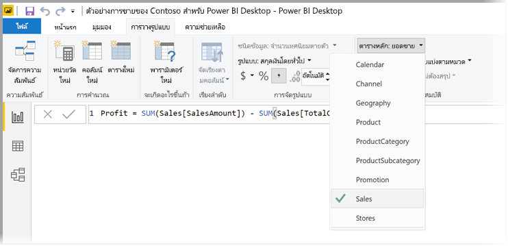
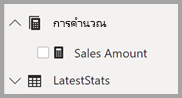

# <a name="create-measures-for-data-analysis-in-power-bi-desktop"></a><span data-ttu-id="e97e4-103">สร้างหน่วยวัดสำหรับการวิเคราะห์ข้อมูลใน Power BI Desktop</span><span class="sxs-lookup"><span data-stu-id="e97e4-103">Create measures for data analysis in Power BI Desktop</span></span>

<span data-ttu-id="e97e4-104">Power BI Desktop ช่วยให้คุณสร้างข้อมูลเชิงลึกในข้อมูลของคุณ ด้วยการคลิกเมาส์เพียงไม่กี่ครั้ง</span><span class="sxs-lookup"><span data-stu-id="e97e4-104">Power BI Desktop helps you create insights into your data with just a few clicks.</span></span> <span data-ttu-id="e97e4-105">แต่ในบางครั้ง ข้อมูลดังกล่าวยังไม่รวมทุกอย่างที่คุณต้องใช้ตอบคำถาม บางคำถามที่สำคัญที่สุดของคุณ</span><span class="sxs-lookup"><span data-stu-id="e97e4-105">But sometimes that data just doesn’t include everything you need to answer some of your most important questions.</span></span> <span data-ttu-id="e97e4-106">หน่วยวัดสามารถช่วยให้คุณไปถึงที่นั่น</span><span class="sxs-lookup"><span data-stu-id="e97e4-106">Measures can help you get there.</span></span>

<span data-ttu-id="e97e4-107">หน่วยวัดจะใช้ในการวิเคราะห์ข้อมูลทั่วไปบางส่วน</span><span class="sxs-lookup"><span data-stu-id="e97e4-107">Measures are used in some of the most common data analyses.</span></span> <span data-ttu-id="e97e4-108">คุณสามารถตั้งค่าการสรุปอย่างง่าย เช่น ผลรวม ค่าเฉลี่ย ค่าต่ำสุด ค่าสูงสุด และจำนวนได้ผ่าน **เขตข้อมูล**</span><span class="sxs-lookup"><span data-stu-id="e97e4-108">Simple summarizations such as sums, averages, minimum, maximum and counts can be set through the **Fields** well.</span></span> <span data-ttu-id="e97e4-109">ผลลัพธ์จากการคำนวณของหน่วยวัด จะเปลี่ยนแปลงตามการโต้ตอบกับรายงานของคุณ ช่วยให้คุณได้สำรวจข้อมูลเฉพาะกิจได้อย่างรวดเร็วและมีชีวิตชีวา</span><span class="sxs-lookup"><span data-stu-id="e97e4-109">The calculated results of measures are always changing in response to your interaction with your reports, allowing for fast and dynamic ad-hoc data exploration.</span></span> <span data-ttu-id="e97e4-110">ลองมาดูรายละเอียดกัน</span><span class="sxs-lookup"><span data-stu-id="e97e4-110">Let’s take a closer look.</span></span> <span data-ttu-id="e97e4-111">สำหรับข้อมูลเพิ่มเติม ดูที่ [สร้างหน่วยวัด](/learn/modules/model-data-power-bi/4b-create-calculated-measures)</span><span class="sxs-lookup"><span data-stu-id="e97e4-111">For more information, see [Create measures](/learn/modules/model-data-power-bi/4b-create-calculated-measures).</span></span>

## <a name="understanding-measures"></a><span data-ttu-id="e97e4-112">ทำความเข้าใจกับหน่วยวัด</span><span class="sxs-lookup"><span data-stu-id="e97e4-112">Understanding measures</span></span>

<span data-ttu-id="e97e4-113">ใน Power BI Desktop หน่วยวัดจะถูกสร้างและแสดงใน *มุมมองรายงาน* หรือ *มุมมองข้อมูล*</span><span class="sxs-lookup"><span data-stu-id="e97e4-113">In Power BI Desktop, measures are created and displayed in *Report View* or *Data View*.</span></span> <span data-ttu-id="e97e4-114">หน่วยวัดที่คุณสร้างจะปรากฏในรายการ **เขตข้อมูล** พร้อมไอคอนรูปเครื่องคิดเลข</span><span class="sxs-lookup"><span data-stu-id="e97e4-114">Measures you create yourself appear in the **Fields** list with a calculator icon.</span></span> <span data-ttu-id="e97e4-115">คุณสามารถตั้งชื่อหน่วยวัดเป็นอะไรก็ได้ที่คุณต้องการ และเพิ่มลงในการแสดงภาพใหม่หรือที่มีอยู่แล้ว เช่นเดียวกับเขตข้อมูลอื่น ๆ</span><span class="sxs-lookup"><span data-stu-id="e97e4-115">You can name measures whatever you want, and add them to a new or existing visualization just like any other field.</span></span>


> [!NOTE]
> <span data-ttu-id="e97e4-117">นอกจากนี้คุณอาจจะสนใจ *การวัดผลด่วน* ซึ่งเป็นหน่วยวัดที่สร้างให้แล้ว ที่คุณสามารถเลือกใช้ได้ทันทีจากกล่องโต้ตอบ</span><span class="sxs-lookup"><span data-stu-id="e97e4-117">You might also be interested in *quick measures*, which are ready-made measures you can select from dialog boxes.</span></span> <span data-ttu-id="e97e4-118">ซึ่งเป็นวิธีสร้างหน่วยวัดที่รวดเร็ว และยังเป็นวิธีที่ดีที่จะเรียนรู้ไวยากรณ์ Data Analysis Expressions (DAX) เนื่องจากสามารถดูสูตร DAX ที่สร้างขึ้นโดยอัตโนมัติได้</span><span class="sxs-lookup"><span data-stu-id="e97e4-118">They're a good way to quickly create measures, and also a good way to learn Data Analysis Expressions (DAX) syntax, since they're automatically created DAX formulas are available to review.</span></span> <span data-ttu-id="e97e4-119">สำหรับข้อมูลเพิ่มเติม โปรดดู [หน่วยวัดด่วน](desktop-quick-measures.md)</span><span class="sxs-lookup"><span data-stu-id="e97e4-119">For more information, see [quick measures](desktop-quick-measures.md).</span></span>
> 
> 

## <a name="data-analysis-expressions"></a><span data-ttu-id="e97e4-120">Data Analysis Expressions</span><span class="sxs-lookup"><span data-stu-id="e97e4-120">Data Analysis Expressions</span></span>

<span data-ttu-id="e97e4-121">หน่วยวัดคำนวณผลลัพธ์จากสูตรคำนวน</span><span class="sxs-lookup"><span data-stu-id="e97e4-121">Measures calculate a result from an expression formula.</span></span> <span data-ttu-id="e97e4-122">เมื่อคุณสร้างหน่วยวัดของคุณเอง คุณจะใช้ภาษาสูตร [Data Analysis Expressions](/dax/) (DAX)</span><span class="sxs-lookup"><span data-stu-id="e97e4-122">When you create your own measures, you’ll use the [Data Analysis Expressions](/dax/) (DAX) formula language.</span></span> <span data-ttu-id="e97e4-123">DAX มีไลบรารีของฟังก์ชัน ตัวดำเนินการ และโครงสร้างมากกว่า 200</span><span class="sxs-lookup"><span data-stu-id="e97e4-123">DAX includes a library of over 200 functions, operators, and constructs.</span></span> <span data-ttu-id="e97e4-124">ไลบรารีมีความยืดหยุ่นมากในการสร้างหน่วยวัดเพื่อคำนวณผลลัพธ์สำหรับการวิเคราะห์ข้อมูลใด ๆ ที่ต้องการ</span><span class="sxs-lookup"><span data-stu-id="e97e4-124">Its library provides immense flexibility in creating measures to calculate results for just about any data analysis need.</span></span>

<span data-ttu-id="e97e4-125">สูตร DAX จะคล้ายกับสูตร Excel มาก</span><span class="sxs-lookup"><span data-stu-id="e97e4-125">DAX formulas are a lot like Excel formulas.</span></span> <span data-ttu-id="e97e4-126">DAX ยังมีหลายฟังก์ชันเหมือนกับ Excel เช่น `DATE`, `SUM`, และ `LEFT`</span><span class="sxs-lookup"><span data-stu-id="e97e4-126">DAX even has many of the same functions as Excel, such like `DATE`, `SUM`, and `LEFT`.</span></span> <span data-ttu-id="e97e4-127">แต่ฟังก์ชัน DAX มีไว้เพื่อทำงานกับข้อมูลเชิงสัมพันธ์เช่นที่เรามีใน Power BI Desktop</span><span class="sxs-lookup"><span data-stu-id="e97e4-127">But the DAX functions are meant to work with relational data like we have in Power BI Desktop.</span></span>

## <a name="lets-look-at-an-example"></a><span data-ttu-id="e97e4-128">เรามาดูตัวอย่างกัน</span><span class="sxs-lookup"><span data-stu-id="e97e4-128">Let’s look at an example</span></span>

<span data-ttu-id="e97e4-129">Jan เป็นผู้จัดการฝ่ายขายที่ Contoso</span><span class="sxs-lookup"><span data-stu-id="e97e4-129">Jan is a sales manager at Contoso.</span></span> <span data-ttu-id="e97e4-130">Jan ถูกขอให้ทำการเลือกเฉพาะส่วนยอดขายผู้จำหน่ายในปีบัญชีถัดไป</span><span class="sxs-lookup"><span data-stu-id="e97e4-130">Jan has been asked to provide reseller sales projections over the next fiscal year.</span></span> <span data-ttu-id="e97e4-131">Jan ตัดสินใจที่จะประมาณจากยอดขายของปีที่แล้วเป็นฐาน แล้วบวกเพิ่มอีกหกเปอร์เซ็นต์จากการส่งเสริมการขายต่าง ๆ ที่จะจัดในอีกหกเดือนข้างหน้า</span><span class="sxs-lookup"><span data-stu-id="e97e4-131">Jan decides to base the estimates on last year's sales amounts, with a six percent annual increase resulting from various promotions that are scheduled over the next six months.</span></span>

<span data-ttu-id="e97e4-132">เมื่อต้องรายงานการประมาณ Jan นำเข้าข้อมูลยอดขายของปีที่แล้วลงใน Power BI Desktop</span><span class="sxs-lookup"><span data-stu-id="e97e4-132">To report the estimates, Jan imports last year's sales data into Power BI Desktop.</span></span> <span data-ttu-id="e97e4-133">Jan ค้นหาเขตข้อมูล **SalesAmount** ในตาราง **Reseller Sales**</span><span class="sxs-lookup"><span data-stu-id="e97e4-133">Jan finds the **SalesAmount** field in the **Reseller Sales** table.</span></span> <span data-ttu-id="e97e4-134">เนื่องจากข้อมูลที่นำเข้ามีเฉพาะยอดขายสำหรับปีที่แล้วเท่านั้น Jan จึงเปลี่ยนชื่อเขตข้อมูล **SalesAmount** เป็น *Last Years Sales*</span><span class="sxs-lookup"><span data-stu-id="e97e4-134">Because the imported data only contains sales amounts for last year, Jan renames the **SalesAmount** field to *Last Years Sales*.</span></span> <span data-ttu-id="e97e4-135">จากนั้น Jan ลาก **Last Years Sales** ไปยังพื้นที่รายงาน</span><span class="sxs-lookup"><span data-stu-id="e97e4-135">Jan then drags **Last Years Sales** onto the report canvas.</span></span> <span data-ttu-id="e97e4-136">จะปรากฏขึ้นเป็นค่าเดียวในแผนภูมิ โดยเป็นค่าผลรวมของยอดขายของทุกตัวแทนจำหน่ายจากปีที่แล้ว</span><span class="sxs-lookup"><span data-stu-id="e97e4-136">It appears in a chart visualization as single value that is the sum of all reseller sales from last year.</span></span>

<span data-ttu-id="e97e4-137">Jan สังเกตว่าถึงแม้ว่าจะไม่ได้ระบุการคำนวณเอง แต่ก็มีการระบุโดยอัตโนมัติ</span><span class="sxs-lookup"><span data-stu-id="e97e4-137">Jan notices that even without specifying a calculation, one has been provided automatically.</span></span> <span data-ttu-id="e97e4-138">Power BI Desktop สร้างหน่วยวัดของตนเองโดยการรวมค่าทั้งหมดใน **Last Years Sales**</span><span class="sxs-lookup"><span data-stu-id="e97e4-138">Power BI Desktop created its own measure by summing up all of the values in **Last Years Sales**.</span></span>

<span data-ttu-id="e97e4-139">แต่ Jan ต้องการหน่วยวัดเพื่อคำนวณประมาณการสำหรับปีหน้า ซึ่งจะอาศัยยอดขายของปีที่แล้วคูณด้วย 1.06 สำหรับความคาดหวังว่าธุรกิจจะเติบโต 6 เปอร์เซ็นต์</span><span class="sxs-lookup"><span data-stu-id="e97e4-139">But Jan needs a measure to calculate sales projections for the coming year, which will be based on last year's sales multiplied by 1.06 to account for the expected 6 percent increase in business.</span></span> <span data-ttu-id="e97e4-140">สำหรับการคำนวณนี้ Jan จะสร้างหน่วยวัดหน่วยหนึ่ง</span><span class="sxs-lookup"><span data-stu-id="e97e4-140">For this calculation, Jan will create a measure.</span></span> <span data-ttu-id="e97e4-141">โดยใช้คุณลักษณะ *หน่วยวัดใหม่* Jan จึงสร้างหน่วยวัดใหม่ จากนั้นใส่สูตร DAX ต่อไปนี้:</span><span class="sxs-lookup"><span data-stu-id="e97e4-141">Using the *New Measure* feature, Jan creates a new measure, then enters the following DAX formula:</span></span>

```dax
    Projected Sales = SUM('Sales'[Last Years Sales])*1.06
```

<span data-ttu-id="e97e4-142">จากนั้น Jan ลากหน่วยวัดใหม่ที่ชื่อ Projected Sales ไปยังแผนภูมิ</span><span class="sxs-lookup"><span data-stu-id="e97e4-142">Jan then drags the new Projected Sales measure into the chart.</span></span>


<span data-ttu-id="e97e4-144">Jan ตอนนี้มีหน่วยวัดที่ใช้คำนวณประมาณการยอดขายได้อย่างรวดเร็วและไม่ต้องใช้ความพยายามมากนัก</span><span class="sxs-lookup"><span data-stu-id="e97e4-144">Quickly and with minimal effort, Jan now has a measure to calculate projected sales.</span></span> <span data-ttu-id="e97e4-145">Jan สามารถวิเคราะห์การคาดการณ์ของเธอต่อ โดยการกรองเฉพาะผู้จำหน่าย หรือโดยการเพิ่มเขตข้อมูลอื่นลงในรายงาน</span><span class="sxs-lookup"><span data-stu-id="e97e4-145">Jan can further analyze the projections by filtering on specific resellers or by adding other fields to the report.</span></span>

## <a name="data-categories-for-measures"></a><span data-ttu-id="e97e4-146">ประเภทข้อมูลสำหรับหน่วยวัด</span><span class="sxs-lookup"><span data-stu-id="e97e4-146">Data categories for measures</span></span>

<span data-ttu-id="e97e4-147">คุณยังสามารถเลือกประเภทข้อมูลสำหรับหน่วยวัด</span><span class="sxs-lookup"><span data-stu-id="e97e4-147">You can also pick data categories for measures.</span></span>

<span data-ttu-id="e97e4-148">เหนือสิ่งอื่นใด ประเภทข้อมูลจะช่วยให้คุณสามารถใช้หน่วยวัดเพื่อสร้าง URL แบบไดนามิก และทำเครื่องหมายประเภทข้อมูลเป็น URL เว็บ</span><span class="sxs-lookup"><span data-stu-id="e97e4-148">Among other things, data categories allow you to use measures to dynamically create URLs, and mark the data category as a Web URL.</span></span>

<span data-ttu-id="e97e4-149">คุณสามารถสร้างตารางที่แสดงการวัดเป็น URL เว็บ และสามารถคลิกที่ URL ที่ถูกสร้างขึ้นตามการเลือกของคุณ</span><span class="sxs-lookup"><span data-stu-id="e97e4-149">You could create tables that display the measures as Web URLs, and be able to click on the URL that's created based on your selection.</span></span> <span data-ttu-id="e97e4-150">วิธีการนี้จะเป็นประโยชน์โดยเฉพาะอย่างยิ่งเมื่อคุณต้องการเชื่อมโยงกับรายงาน Power BI อื่น ๆ ด้วย[พารามิเตอร์ตัวกรอง URL](../collaborate-share/service-url-filters.md)</span><span class="sxs-lookup"><span data-stu-id="e97e4-150">This approach is especially useful when you want to link to other Power BI reports with [URL filter parameters](../collaborate-share/service-url-filters.md).</span></span>

## <a name="organizing-your-measures"></a><span data-ttu-id="e97e4-151">การจัดระเบียบหน่วยวัดของคุณ</span><span class="sxs-lookup"><span data-stu-id="e97e4-151">Organizing your measures</span></span>

<span data-ttu-id="e97e4-152">หน่วยวัดมีตาราง *หลัก* ซึ่งจะกำหนดตำแหน่งที่พบในรายการเขตข้อมูล</span><span class="sxs-lookup"><span data-stu-id="e97e4-152">Measures have a *Home* table that defines where they're found in the field list.</span></span> <span data-ttu-id="e97e4-153">คุณสามารถเปลี่ยนตำแหน่งที่ตั้งได้โดยการเลือกตำแหน่งที่ตั้งจากตารางในแบบจำลองของคุณ</span><span class="sxs-lookup"><span data-stu-id="e97e4-153">You can change their location by choosing a location from the tables in your model.</span></span>



<span data-ttu-id="e97e4-155">คุณยังสามารถจัดระเบียบเขตข้อมูลในตารางลงใน *โฟลเดอร์การแสดงผล* ได้</span><span class="sxs-lookup"><span data-stu-id="e97e4-155">You can also organize fields in a table into *Display Folders*.</span></span> <span data-ttu-id="e97e4-156">เลือก **แบบจำลอง** จากขอบด้านซ้ายของ Power BI Desktop</span><span class="sxs-lookup"><span data-stu-id="e97e4-156">Select **Model** from the left edge of the Power BI Desktop.</span></span> <span data-ttu-id="e97e4-157">ในบานหน้าต่าง **คุณสมบัติ** เลือกเขตข้อมูลที่คุณต้องการย้ายจากรายการของเขตข้อมูลที่พร้อมใช้งาน</span><span class="sxs-lookup"><span data-stu-id="e97e4-157">In the **Properties** pane, select the field you want to move from the list of available fields.</span></span> <span data-ttu-id="e97e4-158">ใส่ชื่อสำหรับโฟลเดอร์ใหม่ใน **โฟลเดอร์การแสดงผล** เพื่อสร้างโฟลเดอร์</span><span class="sxs-lookup"><span data-stu-id="e97e4-158">Enter a name for a new folder in **Display folder** to create a folder.</span></span> <span data-ttu-id="e97e4-159">การสร้างโฟลเดอร์จะย้ายเขตข้อมูลที่เลือกไปยังโฟลเดอร์นั้น</span><span class="sxs-lookup"><span data-stu-id="e97e4-159">Creating a folder moves the selected field into that folder.</span></span>


<span data-ttu-id="e97e4-161">คุณสามารถสร้างโฟลเดอร์ย่อยได้โดยใช้อักขระเครื่องหมายทับขวา</span><span class="sxs-lookup"><span data-stu-id="e97e4-161">You can create subfolders by using a backslash character.</span></span> <span data-ttu-id="e97e4-162">ตัวอย่างเช่น *Finance\Currencies* จะสร้างโฟลเดอร์ *Finance* และภายในประกอบด้วยโฟลเดอร์ *Currencies*</span><span class="sxs-lookup"><span data-stu-id="e97e4-162">For example, *Finance\Currencies* creates a *Finance* folder and within it, a *Currencies* folder.</span></span>

<span data-ttu-id="e97e4-163">คุณสามารถทำให้เขตข้อมลปรากฏในหลายโฟลเดอร์ได้โดยใช้เครื่องหมายอัฒภาคเพื่อแยกชื่อโฟลเดอร์</span><span class="sxs-lookup"><span data-stu-id="e97e4-163">You can make a field appear in multiple folders by using a semicolon to separate the folder names.</span></span> <span data-ttu-id="e97e4-164">ตัวอย่างเช่น *ผลิตภัณฑ์\ชื่อ; แผนก* จะส่งผลให้เกิดเขตข้อมูลที่ปรากฏในโฟลเดอร์ *แผนก* เช่นเดียวกับโฟลเดอร์ *ชื่อ* ที่ปรากฏภายใน *ผลิตภัณฑโฟลเดอร์*</span><span class="sxs-lookup"><span data-stu-id="e97e4-164">For example, *Products\Names;Departments* results in the field appearing in a *Departments* folder as well as a *Names* folder inside a *Products* folder.</span></span>

<span data-ttu-id="e97e4-165">คุณสามารถสร้างตารางพิเศษที่ประกอบด้วยหน่วยวัดเท่านั้น</span><span class="sxs-lookup"><span data-stu-id="e97e4-165">You can create a special table that contains only measures.</span></span> <span data-ttu-id="e97e4-166">ตารางนั้นจะปรากฏที่ด้านบนสุดของ **เขตข้อมูล**</span><span class="sxs-lookup"><span data-stu-id="e97e4-166">That table always appears at the top of the **Fields**.</span></span> <span data-ttu-id="e97e4-167">เมื่อต้องการทำเช่นนั้น ให้สร้างตารางที่มีเพียงหนึ่งคอลัมน์</span><span class="sxs-lookup"><span data-stu-id="e97e4-167">To do so, create a table with just one column.</span></span> <span data-ttu-id="e97e4-168">คุณสามารถใช้ **ป้อนข้อมูล** เพื่อสร้างตารางนั้นได้</span><span class="sxs-lookup"><span data-stu-id="e97e4-168">You can use **Enter Data** to create that table.</span></span> <span data-ttu-id="e97e4-169">จากนั้นย้ายหน่วยวัดของคุณไปยังตารางนั้น</span><span class="sxs-lookup"><span data-stu-id="e97e4-169">Then move your measures to that table.</span></span> <span data-ttu-id="e97e4-170">สุดท้าย ให้ซ่อนคอลัมน์ แต่ไม่ใช่ตารางที่คุณสร้างขึ้น</span><span class="sxs-lookup"><span data-stu-id="e97e4-170">Finally, hide the column, but not the table, that you created.</span></span> <span data-ttu-id="e97e4-171">เลือกลูกศรที่ด้านบนของ **เขตข้อมูล** เพื่อปิดและเปิดรายการเขตข้อมูลใหม่เพื่อดูการเปลี่ยนแปลงของคุณ</span><span class="sxs-lookup"><span data-stu-id="e97e4-171">Select the arrow at the top of **Fields** to close and reopen the fields list to see your changes.</span></span>



## <a name="learn-more"></a><span data-ttu-id="e97e4-173">เรียนรู้เพิ่มเติม</span><span class="sxs-lookup"><span data-stu-id="e97e4-173">Learn more</span></span>

<span data-ttu-id="e97e4-174">เรามีเพียงแค่คำแนะนำเบื้องต้นเกี่ยวกับหน่วยวัดสำหรับคุณในที่นี่</span><span class="sxs-lookup"><span data-stu-id="e97e4-174">We’ve only provided you with a quick introduction to measures here.</span></span> <span data-ttu-id="e97e4-175">มีคำแนะนำเพิ่มเติมที่จะช่วยคุณในการเรียนรู้วิธีการสร้างหน่วยวัดของคุณเอง</span><span class="sxs-lookup"><span data-stu-id="e97e4-175">There’s a lot more to help you learn how to create your own.</span></span> <span data-ttu-id="e97e4-176">สำหรับข้อมูลเพิ่มเติม โปรดดูบทช่วยสอน [:  สร้างหน่วยวัดของคุณเองใน Power BI Desktop ](desktop-tutorial-create-measures.md)</span><span class="sxs-lookup"><span data-stu-id="e97e4-176">For more information, see [Tutorial: Create your own measures in Power BI Desktop](desktop-tutorial-create-measures.md).</span></span> <span data-ttu-id="e97e4-177">คุณสามารถดาวน์โหลดไฟล์ตัวอย่าง และได้รับบทเรียนทีละขั้นตอนเกี่ยวกับวิธีการสร้างหน่วยวัดเพิ่มเติมได้</span><span class="sxs-lookup"><span data-stu-id="e97e4-177">You can download a sample file and get step-by-step lessons on how to create more measures.</span></span>  

<span data-ttu-id="e97e4-178">ถ้าต้องการเจาะลึกลงไปใน DAX อีก โปรดดูที่[พื้นฐาน DAX ใน Power BI Desktop](desktop-quickstart-learn-dax-basics.md)</span><span class="sxs-lookup"><span data-stu-id="e97e4-178">To dive a little deeper into DAX, see [DAX basics in Power BI Desktop](desktop-quickstart-learn-dax-basics.md).</span></span> <span data-ttu-id="e97e4-179">[อ้างอิง Data Analysis Expressions](/dax/) ให้บทความที่ละเอียดของแต่ละ ฟังก์ชัน ไวยากรณ์ ตัวดำเนินการ และข้อกำหนดการตั้งชื่อ</span><span class="sxs-lookup"><span data-stu-id="e97e4-179">The [Data Analysis Expressions Reference](/dax/) provides detailed articles on each of the functions, syntax, operators, and naming conventions.</span></span> <span data-ttu-id="e97e4-180">DAX มีอยู่แล้วใน Power Pivot ใน Excel และ SQL Server Analysis Services มาหลายปี</span><span class="sxs-lookup"><span data-stu-id="e97e4-180">DAX has been around for several years in Power Pivot in Excel and SQL Server Analysis Services.</span></span> <span data-ttu-id="e97e4-181">มีแหล่งข้อมูลที่ดีอื่น ๆ อีกมากมายที่สามารถใช้งานได้เช่นกัน</span><span class="sxs-lookup"><span data-stu-id="e97e4-181">There are many other great resources available, too.</span></span> <span data-ttu-id="e97e4-182">อย่าลืมดู [Wiki DAX Resource Center](https://social.technet.microsoft.com/wiki/contents/articles/1088.dax-resource-center.aspx) ที่มีสมาชิกที่มีชื่อเสียงของชุมชน BI แชร์ความรู้ DAX ของพวกเขา</span><span class="sxs-lookup"><span data-stu-id="e97e4-182">Be sure to check out the [DAX Resource Center Wiki](https://social.technet.microsoft.com/wiki/contents/articles/1088.dax-resource-center.aspx), where influential members of the BI community share their knowledge of DAX.</span></span>
