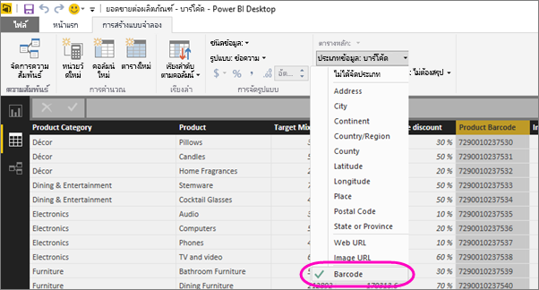

# แท็กเขตข้อมูลบาร์โค้ดใน Power BI Desktop เพื่อเปิดใช้งานการกรองบาร์โค้ดในแอปสำหรับอุปกรณ์เคลื่อนที่

ใน Power BI Desktop คุณสามารถ [จัดประเภทข้อมูล](desktop-data-categorization.md) ในคอลัมน์ ดังนั้น Power BI Desktop จึงทราบวิธีการนำค่ามาใช้ในการแสดงผลด้วยภาพในรายงานได้ นอกจากนี้ คุณยังสามารถจัดประเภทคอลัมน์เป็น **บาร์โค้ด** ได้ จากนั้นเมื่อมีคนในบริษัทหรือองค์กรของคุณ [สแกนบาร์โค้ด](../consumer/mobile/mobile-apps-scan-barcode-iphone.md) บนผลิตภัณฑ์โดยใช้แอป Power BI สำหรับอุปกรณ์เคลื่อนที่บนอุปกรณ์ IOS หรือ Android หรือแท็บเล็ตของพวกเขาจะเห็นรายงานใดๆที่มีบาร์โค้ดนั้น เมื่อพวกเขาเปิดรายงานจะมีการกรองโดยอัตโนมัติไปยังข้อมูลที่เกี่ยวข้องกับบาร์โค้ดนั้น

## จัดประเภทข้อมูลบาร์โค้ด

สมมติว่าคุณมีรายงานที่มีบาร์โค้ด: 

1. ใน Power BI Desktop ให้สลับไปยังมุมมองข้อมูล
2. เลือกคอลัมน์ที่มีข้อมูลบาร์โค้ด ดูรายการของ [รูปแบบบาร์โค้ดที่สนับสนุน](#supported-barcode-formats) ด้านล่าง
3. บนแท็บ **เครื่องมือคอลัมน์** เลือก  >  **บาร์โค้ด** ประเภทข้อมูล
   
    

    >[!WARNING]
    >อย่าจัดประเภทมากกว่าหนึ่งคอลัมน์ในตารางข้อมูลทั้งหมดในรายงานเป็น **บาร์โค้ด** แอปสำหรับอุปกรณ์เคลื่อนที่สนับสนุนการกรองบาร์โค้ดเฉพาะสำหรับรายงานที่มีคอลัมน์บาร์โค้ดเดียวเท่านั้นในตารางข้อมูลรายงานทั้งหมด ถ้ารายงานมีมากกว่าหนึ่งคอลัมน์บาร์โค้ดไม่มีการกรองที่เกิดขึ้น

4. ในมุมมองรายงานเพิ่มเขตข้อมูลบาร์โค้ดไปยังวิชวลที่คุณต้องการกรองด้วยบาร์โค้ด
5. บันทึกรายงานและเผยแพร่ไปยังบริการ Power BI

ตอนนี้เมื่อคุณเปิดสแกนเนอร์บนแอป Power BI สำหรับ iOS และ Android โทรศัพท์และแท็บเล็ตและสแกนบาร์โค้ดคุณจะเห็นรายงานนี้ในรายการของรายงานที่มีบาร์โค้ด เมื่อคุณเปิดรายงานภาพจะถูกกรองด้วยบาร์โค้ดของผลิตภัณฑ์ที่คุณสแกน

## รูปแบบบาร์โค้ดที่สนับสนุน
เหล่านี้คือรูปแบบบาร์โค้ด Power BI รู้ว่าคุณสามารถแท็กได้ในรายงาน Power BI: 

* UPCECode 
* Code39Code  
* A39Mod43Code 
* EAN13Code 
* EAN8Code  
* 93Code  
* 128Code 
* PDF417Code 
* Interleaved2of5Code 
* ITF14Code 

## ขั้นตอนถัดไป
* [สแกนบาร์โค้ดจากแอป Power BI บนโทรศัพท์ iOS หรือ Android แท็บเล็ตของคุณ](../consumer/mobile/mobile-apps-scan-barcode-iphone.md)
* [ปัญหาเกี่ยวกับการสแกนบาร์โค้ด](../consumer/mobile/mobile-apps-scan-barcode-iphone.md#issues-with-scanning-a-barcode)
* [การจัดประเภทข้อมูลใน Power BI Desktop](desktop-data-categorization.md)  
* มีคำถามหรือไม่ [ลองถามชุมชน Power BI](https://community.powerbi.com/)
