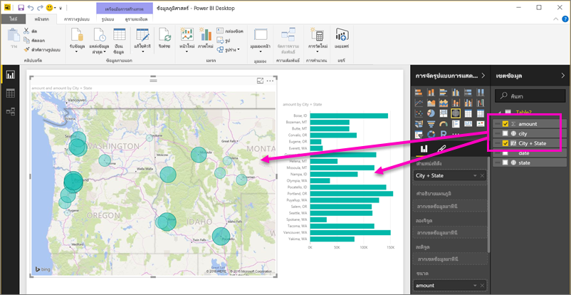
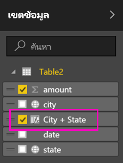

# ตั้งค่าตัวกรองทางภูมิศาสตร์ใน Power BI Desktop สำหรับใช้ในแอปบนอุปกรณ์เคลื่อนที่Set geographic filters in Power BI Desktop for use in the mobile app
ใน Power BI Desktop คุณสามารถ[จัดประเภทข้อมูลทางภูมิศาสตร์](desktop-data-categorization.md)สำหรับคอลัมน์ เพื่อให้ Power BI Desktop ทราบว่าควรทำอย่างไรกับค่าในวิชวลในรายงานได้In Power BI Desktop, you can [categorize geographical data](desktop-data-categorization.md) for a column, so Power BI Desktop knows how to treat values in visuals in a report. ประโยชน์เพิ่มเติมคือ เมื่อคุณหรือเพื่อนร่วมงานของคุณดูรายงานนั้นในแอป Power BI สำหรับอุปกรณ์เคลื่อนที่ Power BI ใช้ตัวกรองทางภูมิศาสตร์ที่ตรงกับตำแหน่งของคุณโดยอัตโนมัติAs an added benefit, when you or your colleagues view that report in the Power BI mobile apps, Power BI automatically provides geographical filters that match where you are. 

ตัวอย่างเช่น คุณเป็นผู้จัดการฝ่ายขาย และกำลังเดินทางไปพบลูกค้า และคุณต้องการจะกรองยอดขายและรายได้สำหรับลูกค้าที่คุณกำลังจะไปพบอย่างรวดเร็วFor example, say you're a sales manager traveling to meet customers, and you'd like to quickly filter the total sales and revenue for the specific customer you're planning to visit. คุณต้องการแยกดูเฉพาะข้อมูลสำหรับตำแหน่งปัจจุบันของคุณ ไม่ว่า จะเป็น รัฐ เมือง หรือที่อยู่You want to break out the data for your current location, whether by state, city, or an actual address. ต่อไป ถ้าคุณมีเวลาเหลือ คุณอยากจะไปเยี่ยมลูกค้ารายอื่น ๆ อยู่ที่ใกล้Later, if you have time left, you'd like to visit other customers located nearby. คุณสามารถ[กรองรายงานตามตำแหน่งของคุณเพื่อค้นหาลูกค้าเหล่านั้น](../consumer/mobile/mobile-apps-geographic-filtering.md)ได้You can [filter the report by your location to find those customers](../consumer/mobile/mobile-apps-geographic-filtering.md).

> [!NOTE]
> คุณสามารถกรองข้อมูลตามตำแหน่งที่ตั้งในแอปสำหรับอุปกรณ์เคลื่อนที่ ก็ต่อเมื่อชื่อภูมิศาสตร์ในรายงานเป็นภาษาอังกฤษเท่านั้น &#150; เช่น "New York" หรือ "Germany"You can only filter by location in the mobile app if the geographic names in the report are in English &#150; for example, "New York City" or "Germany".
> 
> 

## ระบุข้อมูลทางภูมิศาสตร์ในรายงานของคุณIdentify geographic data in your report
1. ใน Power BI Desktop สลับไปยังมุมมองข้อมูลIn Power BI Desktop, switch to Data View ..
2. เลือกคอลัมน์ที่เป็นข้อมูลทางภูมิศาสตร์ &#151; ตัวอย่างเช่น คอลัมน์เมืองSelect a column with geographic data &#151; for example, a City column.
   
    
3. บนแท็บ **การวางรูปแบบ** เลือก **ประเภทข้อมูล** จากนั้นเลือกประเภทที่ถูกต้อง &#151; ในตัวอย่างนี้คือ **เมือง**On the **Modeling** tab, select **Data Category**, then the correct category &#151; in this example, **City**.
   
    
4. ตั้งค่าประเภทข้อมูลทางภูมิศาสตร์สำหรับเขตข้อมูลอื่น ๆ ในรูปแบบข้อมูลต่อContinue setting geographic data categories for any other fields in the model. 
   
   > [!NOTE]
   > คุณสามารถตั้งค่าหลายคอลัมน์ สำหรับแต่ละประเภทข้อมูลในรูปแบบ แต่ถ้าคุณทำแบบนั้น แอป Power BI สำหรับอุปกรณ์เคลื่อนที่ จะไม่สามารถกรองรูปแบบตามภูมิศาสตร์ได้You can set multiple columns for each data category in a model, but if you do the model can't filter for geography in the Power BI mobile app. เพื่อใช้การกรองทางภูมิศาสตร์ในแอปสำหรับอุปกรณ์เคลื่อนที่ ตั้งค่าแค่คอลัมน์เดียวเท่านั้นสำหรับแต่ละประเภทข้อมูล &#151; เช่น มีคอลัมน์ **เมือง** แค่คอลัมน์เดียว คอลัมน์ **รัฐหรือจังหวัด** คอลัมน์เดียว และคอลัมน์ **ประเทศ** คอลัมน์เดียวTo use geographic filtering in the mobile apps, set only one column for each data category &#151; for example, only one **City** column, one **State or Province** column, and one **Country** column. 
   > 
   > 

## สร้างวิชวลด้วยข้อมูลทางภูมิศาสตร์ของคุณCreate visuals with your geographic data
1. สลับไปยังมุมมองรายงานSwitch to Report view และสร้างวิชวลที่ใช้เขตข้อมูลทางภูมิศาสตร์ในข้อมูลของคุณ, and create visuals that use the geographic fields in your data. 
   
    
   
    ในตัวอย่างนี้ รูปแบบข้อมูลยังประกอบด้วยคอลัมน์จากการคำนวณ ที่รวมเมืองและรัฐเข้าด้วยกันเป็นหนึ่งคอลัมน์In this example, the model also contains a calculated column that brings city and state together in one column. อ่านเกี่ยวกับ[สร้างคอลัมน์จากการคำนวณใน Power BI Desktop](desktop-calculated-columns.md)Read about [creating calculated columns in Power BI Desktop](desktop-calculated-columns.md).
   
    
2. เผยแพร่รายงานไปยังบริการ Power BIPublish the report to the Power BI service.

## ดูรายงานในแอป Power BI สำหรับอุปกรณ์เคลื่อนที่View the report in Power BI mobile app
1. เปิดรายงานในใด ๆ ใน[แอป Power BI สำหรับอุปกรณ์เคลื่อนที่](../consumer/mobile/mobile-apps-for-mobile-devices.md)Open the report in any of the [Power BI mobile apps](../consumer/mobile/mobile-apps-for-mobile-devices.md).
2. ถ้าคุณอยู่ในตำแหน่งทางภูมิศาสตร์ที่มีข้อมูลในรายงาน คุณสามารถกรองข้อมูลนั้นด้วยตำแหน่งของคุณโดยอัตโนมัติIf you're in a geographic location with data in the report, you can filter it automatically to your location.
   
    

อ่านเพิ่มเติมเกี่ยวกับ[การกรองรายงานตามตำแหน่งในแอป Power BI สำหรับอุปกรณ์เคลื่อนที่](../consumer/mobile/mobile-apps-geographic-filtering.md)Read more about [filtering a report by location in the Power BI mobile apps](../consumer/mobile/mobile-apps-geographic-filtering.md).

## ขั้นตอนถัดไปNext steps
* [จัดประเภทข้อมูลใน Power BI DesktopData categorization in Power BI Desktop](desktop-data-categorization.md)  
* มีคำถามหรือไม่Questions? [ลองถามชุมชน Power BITry asking the Power BI Community](https://community.powerbi.com/)
