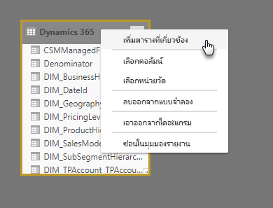

# ทำงานร่วมกับมุมมองแบบจำลองใน Power BI DesktopWork with Modeling view in Power BI Desktop

ด้วย **มุมมองแบบจำลอง** ใน **Power BI Desktop** คุณสามารถดู และทำงานกับชุดข้อมูลที่ซับซ้อนที่ประกอบด้วยหลายตารางได้With **Modeling view** in **Power BI Desktop**, you can view and work with complex datasets that contain many tables.

## ใช้มุมมองแบบจำลองUsing Modeling view

เมื่อต้องการเข้าถึงมุมมองแบบจำลอง ให้เลือกไอคอนมุมมองแบบจำลองที่ด้านบนซ้ายของ **Power BI Desktop** ดังที่แสดงในรูปต่อไปนี้To access Modeling view, select the Modeling view icon found on the left side of **Power BI Desktop**, as shown in the following image.

## สร้างไดอะแกรมที่แยกต่างหากCreating separate diagrams

ด้วยมุมมองแบบจำลอง คุณสามารถสร้างไดอะแกรมแบบจำลองของคุณที่ประกอบด้วยชุดย่อยของตารางในแบบจำลองของคุณโดยเฉพาะWith Modeling view, you can create diagrams of your model that contain only a subset of the tables in your model. สิ่งนี้จะช่วยให้มุมมองชัดเจนยิ่งขึ้นในตารางที่คุณต้องการใช้งาน และให้การทำงานกับชุดข้อมูลที่ซับซ้อนThis can help provide a clearer view into the tables you want to work with, and make working with complex datasets easier. เมื่อต้องการสร้างไดอะแกรมที่มีเฉพาะชุดย่อยของตาราง ให้คลิก **+** ลงชื่อเข้าใช้ถัดจากแท็บ **ตารางทั้งหมด** ที่ด้านล่างของบานหน้าต่าง Power BI DesktopTo create a new diagram with only a subset of the tables, click the **+** sign next to the **All tables** tab along the bottom of the Power BI Desktop window.

คุณยังสามารถลากตารางจากรายการ **เขตข้อมูล** ไปยังพื้นผิวไดอะแกรมได้You can then drag a table from the **Fields** list onto the diagram surface. คลิกขวาที่ตาราง จากนั้น **เพิ่มตารางที่เกี่ยวข้อง** จากเมนูที่ปรากฏขึ้นRight click the table, and then select **Add related tables** from the menu that appears.

เมื่อคุณทำตาม ตารางที่เกี่ยวข้องกับตารางต้นฉบับจะแสดงในไดอะแกรมใหม่When you do, tables that are related to the original table are displayed in the new diagram. รูปต่อไปนี้แสดงตารางที่เกี่ยวข้องวิธีแสดงหลังจากเลือกตัว **เพิ่มตารางที่เกี่ยวข้อง** ตัวเลือกเมนูThe following image shows how related tables are displayed after selecting the **Add related tables** menu option.

## ตั้งค่าคุณสมบัติทั่วไปSetting common properties

คุณสามารถเลือกวัตถุหลายวัตถุพร้อมกันในมุมมองแบบจำลองได้โดยกดปุ่ม **CTRL** ค้างไว้และคลิกที่ตารางหลายๆ ตารางพร้อมกันYou can select multiple objects at once in Modeling view by holding down the **CTRL** key and clicking multiple tables. เมื่อคุณเลือกตารางหลายตาราง ตารางจะถูกเน้นไว้ในมุมมองแบบจำลองWhen you select multiple tables they become highlighted in Modeling view. เมื่อตารางหลายตารางถูกเน้น การเปลี่ยนแปลงได้ถูกนำไปใช้ในบานหน้าต่าง **คุณสมบัติ** กับตารางที่เลือกทั้งหมดWhen multiple tables are highlighted, changes applied in the **Properties** pane apply to all selected tables.

ตัวอย่าง คุณสามารถเปลี่ยน [โหมดที่เก็บ](desktop-storage-mode.md)สำหรับตารางหลายตารางในมุมมองไดอะแกรมของคุณได้โดยกดปุ่ม **CTRL** ค้าง เลือกตาราง จาก นั้นเปลี่ยนการตั้งค่าโหมดที่เก็บข้อมูลในบานหน้าต่าง **คุณสมบัติ**For example, you could change the [storage mode](desktop-storage-mode.md) for multiple tables in your diagram view by holding down the **CTRL** key, selecting tables, then changing the storage mode setting in the **Properties** pane.

## ขั้นตอนถัดไปNext steps

บทความต่อไปนี้อธิบายเพิ่มเติมเกี่ยวกับแบบจำลองข้อมูล และยังอธิบายเกี่ยวกับ DirectQuery อย่างละเอียดThe following articles describe more about data models, and also describe DirectQuery in detail.

* [รวมข้อมูลใน Power BI Desktop (ตัวอย่าง)Aggregations in Power BI Desktop (Preview)](desktop-aggregations.md)
* [โมเดลแบบรวมใน Power BI DesktopComposite models in Power BI Desktop](desktop-composite-models.md)
* [โหมดที่เก็บข้อมูล ใน Power BI Desktop (ตัวอย่าง)Storage Mode in Power BI Desktop (Preview)](desktop-storage-mode.md)
* [ความสัมพันธ์แบบกลุ่มต่อกลุ่มใน Power BI DesktopMany-to-many relationships in Power BI Desktop](desktop-many-to-many-relationships.md)

บทความ DirectQuery:DirectQuery articles:

* [การใช้ DirectQuery ใน Power BIUsing DirectQuery in Power BI](../connect-data/desktop-directquery-about.md)
* [แหล่งข้อมูลที่ได้รับการรองรับโดย DirectQuery ใน Power BIData sources supported by DirectQuery in Power BI](../connect-data/power-bi-data-sources.md)
