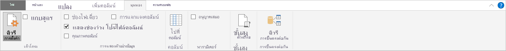
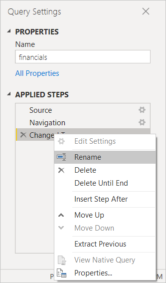
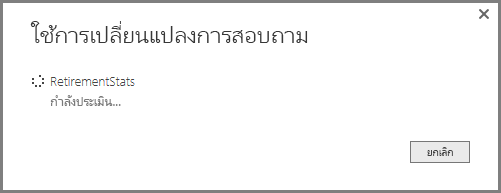

# ภาพรวมคิวรีใน Power BI DesktopQuery overview in Power BI Desktop
ด้วย Power BI Desktop คุณสามารถเชื่อมต่อกับโลกของข้อมูล สร้างรายงานที่น่าสนใจ และแชร์ความพยายามของคุณกับผู้อื่น – ที่สามารถสร้างผลงานต่อจากงานของคุณ และขยายความพยายามอันชาญฉลาดทางธุรกิจของพวกเขาWith Power BI Desktop you can connect to the world of data, create compelling and foundational reports, and share your efforts with others – who can then build on your work, and expand their business intelligence efforts.

Power BI Desktop มีสามมุมมอง:Power BI Desktop has three views:

* มุมมอง **รายงาน** – เป็นที่ที่คุณใช้คิวรีที่คุณสร้างภาพที่แสดงข้อมูลที่ดึงดูดความสนใจ จัดเรียงการแสดงผลตามที่คุณต้องการให้ปรากฏในหลายหน้าที่คุณสามารถแบ่งปันกับผู้อื่น**Report** view – where you use queries you create to build compelling visualizations, arranged as you want them to appear, and with multiple pages, that you can share with others
* มุมมอง **ข้อมูล** ู – เป็นที่ที่ดูข้อมูลในรายงานของคุณในรูปแบบจำลองข้อมูล เป็นที่ที่ี่คุณสามารถเพิ่มการวัด สร้างคอลัมน์ใหม่ และจัดการความสัมพันธ์**Data** view – see the data in your report in data model format, where you can add measures, create new columns, and manage relationships
* มุมมอง **ความสัมพันธ์** ู – เป็นที่แสดงภาพกราฟิกของความสัมพันธ้ในแบบจำลองข้อมูลของคุณ และจัดการ หรือปรับเปลี่ยนความสัมพันธ์นั้นได้ตามต้องการ**Relationships** view – get a graphical representation of the relationships that have been established in your data model, and manage or modify them as needed.

เข้าถึงมุมมองเหล่านี้โดยการเลือกไอคอนหนึ่งในสามทางด้านซ้ายของ Power BI DesktopAccess these views by selecting one of the three icons along the left side of Power BI Desktop. ในรูปต่อไปนี้ มุมมอง **รายงาน** ถูกเลือก ที่บ่งชี้ด้วยแถบสีเหลืองที่อยู่ด้านข้างไอคอนIn the following image, **Report** view is selected, indicated by the yellow band beside the icon.  

 
Power BI Desktop ยังมาพร้อมกับ Power Query EditorPower BI Desktop also comes with Power Query Editor. ใช้ Power Query Editor เพื่อเชื่อมต่อกับแหล่งข้อมูลหนึ่งหรือหลายแหล่ง จัดรูปร่างและแปลงข้อมูลตามความต้องการของคุณ จากนั้นโหลดแบบจำลองดังกล่าวเข้าไปใน Power BI DesktopUse Power Query Editor to connect to one or many data sources, shape and transform the data to meet your needs, then load that model into Power BI Desktop.

เอกสารนี้ให้ภาพรวมของการทำงานกับข้อมูลใน Power Query Editor แต่ยังมีอีกมากมายให้เรียนรู้This document provides an overview of the work with data in the Power Query Editor, but there's more to learn. ในตอนท้ายของเอกสารนี้ คุณจะพบลิงก์ไปยังคำแนะนำโดยละเอียดเกี่ยวกับชนิดข้อมูลที่ได้รับการสนับสนุนAt the end of this document, you'll find links to detailed guidance about supported data types. นอกจากนี้คุณยังจะได้พบกับคำแนะนำเกี่ยวกับการเชื่อมต่อกับข้อมูล การจัดรูปร่างข้อมูล การสร้างความสัมพันธ์ และวิธีการเริ่มต้นใช้งานYou'll also find guidance about connecting to data, shaping data, creating relationships, and how to get started.

แต่คุณต้องทำความคุ้นเคยกับ Power Query Editor ก่อนBut first, let's see get acquainted with Power Query Editor.

## ตัวแก้ไข Power QueryPower Query Editor
เมื่อต้องการใช้ Power Query Editor ให้เลือก **แก้ไขคิวรี** จากแท็บ **หน้าแรก** ของ Power BI DesktopTo get to Power Query Editor, select **Edit Queries** from the **Home** tab of Power BI Desktop.  

เมื่อไม่มีการเชื่อมต่อข้อมูล Power Query Editor จะปรากฏเป็นบานหน้าต่างว่างที่พร้อมสำหรับข้อมูลWith no data connections, Power Query Editor appears as a blank pane, ready for data.  

เมื่อคิวรีถูกโหลด มุมมอง Power Query Editor จะกลายเป็นเรื่องน่าสนใจมากขึ้นOnce a query is loaded, Power Query Editor view becomes more interesting. ถ้าเราเชื่อมต่อกับแหล่งข้อมูลต่อไปนี้ของเว็บ Power Query Editor จะโหลดข้อมูลเกี่ยวกับข้อมูลที่คุณสามารถเริ่มต้นจัดรูปร่างIf we connect to the following Web data source, Power Query Editor loads information about the data, which you can then begin to shape:

[*https://www.bankrate.com/retirement/best-and-worst-states-for-retirement/*](https://www.bankrate.com/retirement/best-and-worst-states-for-retirement/)

นี่คือวิธีที่ Power Query Editor ปรากฏเมื่อมีการเชื่อมต่อข้อมูล:Here's how Power Query Editor appears once a data connection is established:

1. ในริบบอน มีปุ่มจำนวนมากพร้อมใช้งานเพื่อโต้ตอบกับข้อมูลในคิวรีIn the ribbon, many buttons are now active to interact with the data in the query.
2. ในบานหน้าต่างด้านซ้าย รายการคิวรี (สำหรับแต่ละตารางหรือรายการ) จะแสดงอยู่และพร้อมให้เลือก ดู และจัดรูปร่างIn the left pane, queries are listed and available for selection, viewing, and shaping.
3. ในบานหน้าต่างตรงกลาง ข้อมูลจากคิวรีที่เลือกจะแสดงและพร้อมให้จัดรูปร่างIn the center pane, data from the selected query is displayed and available for shaping.
4. บานหน้าต่าง **การตั้งค่าคิวรี** จะปรากฏ โดยแสดงรายการคุณสมบัติของคิวรีและขั้นตอนที่ใช้The **Query Settings** pane appears, listing the query's properties and applied steps.  
   
   

เราจะเรียนรู้เกี่ยวกับแต่ละด้านทั้งสี่เหล่านี้: แถบเครื่องมือริบบอน บานหน้าต่างคิวรี มุมมองข้อมูล และบานหน้าต่างการตั้งค่าคิวรีWe'll look at each of these four areas: the ribbon, the Queries pane, the Data view, and the Query Settings pane.

## Ribbon คิวรีThe query ribbon
รอบบอนใน Power Query Editor ประกอบด้วยสี่แท็บ: **หน้าหลัก** **แปลง** **เพิ่มคอลัมน์** และ **ดู**The ribbon in Power Query Editor consists of four tabs: **Home**, **Transform**, **Add Column**, and **View**.

แท็บ **หน้าหลัก** ประกอบด้วยงานคิวรีทั่วไปThe **Home** tab contains the common query tasks.

เมื่อต้องการเชื่อมต่อกับข้อมูล และเริ่มขบวนการสร้างคิวรีเลือกปุ่ม **แหล่งใหม่ (New Source)**To connect to data and begin the query building process, select **New Source**. เมนูจะปรากฏ และให้แหล่งข้อมูลที่พบบ่อยที่สุดA menu appears, providing the most common data sources.  

สำหรับข้อมูลเพิ่มเติมเกี่ยวกับแหล่งข้อมูลที่พร้อมใช้งาน ดู **แหล่งข้อมูล**For more information about available data sources, see **Data Sources**. สำหรับข้อมูลเกี่ยวกับการเชื่อมต่อกับข้อมูล ที่รวมถึงตัวอย่างและขั้นตอน ดู **เชื่อมต่อกับข้อมูล**For information about connecting to data, including examples and steps, see **Connect to Data**.

แท็บ **แปลง** จัดเตรียมการเข้าถึงงานการแปลงข้อมูลทั่วไปเช่น:The **Transform** tab provides access to common data transformation tasks, such as:

* การเพิ่มและการลบคอลัมน์ออกAdding or removing columns
* การเปลี่ยนชนิดข้อมูลChanging data types 
* การแยกคอลัมน์Splitting columns 
* งานที่มีการควบคุมข้อมูลอื่นๆOther data-driven tasks

สำหรับข้อมูลเพิ่มเติมเกี่ยวกับการแปลงข้อมูล ที่รวมถึงตัวอย่าง ดูที่บทช่วยสอน [: จัดรูปร่างและรวมข้อมูลใน Power BI Desktop](../connect-data/desktop-shape-and-combine-data.md)For more information about transforming data, including examples, see [Tutorial: Shape and combine data in Power BI Desktop](../connect-data/desktop-shape-and-combine-data.md).

แท็บ **เพิ่มคอลัมน์** เป็นการเพิ่มคอลัมน์ จัดรูปแบบข้อมูลคอลัมน์ และการเพิ่มคอลัมน์แบบกำหนดเองรวมทั้งงานอื่นๆที่เกี่ยวข้องThe **Add Column** tab provides additional tasks associated with adding a column, formatting column data, and adding custom columns. รูปภาพต่อไปนี้แสดง แท็บ **เพิ่มคอลัมน์**The following image shows the **Add Column** tab.  

แท็บ **มุมมอง** บน ribbon ถูกใช้เพื่อสลับว่าจะแสดงบานหน้าต่าง หรือ windowsThe **View** tab on the ribbon is used to toggle whether certain panes or windows are displayed. นอกจากนี้ยังใช้เพื่อแสดงเครื่องมือแก้ไขขั้นสูงด้วยIt's also used to display the Advanced Editor. รูปภาพต่อไปนี้แสดง แท็บ **มุมมอง**The following image shows the **View** tab.  

และคุณควรทราบว่างานต่าง ๆ มากมายที่สามารถใช้งานได้จากแถบเครื่องมือริบบอนนั้นยังสามารถเรียกใช้ได้โดยการคลิกขวาที่คอลัมน์ หรือข้อมูลอื่น ๆ ในบานหน้าต่างตรงกลางด้วยIt's useful to know that many of the tasks available from the ribbon are also available by right-clicking a column, or other data, in the center pane.

## บานหน้าต่างด้านซ้าย (คิวรี)The left (Queries) pane
บานหน้าต่างด้านซ้าย หรือบานหน้าต่าง **Queries** แสดงจำนวนของคิวรีที่ใช้งานอยู่ และชื่อของคิวรีThe left pane, or **Queries** pane, displays the number of active queries and the name of the query. เมื่อคุณเลือกคิวรีจากบานหน้าต่างด้านซ้าย ข้อมูลของคิวรีจะแสดงในบานหน้าต่างตรงกลาง ซึ่งคุณสามารถจัดรูปแบบ และแปลงข้อมูลนี้ตามความต้องการของคุณWhen you select a query from the left pane, its data is displayed in the center pane, where you can shape and transform the data to meet your needs. รูปต่อไปนี้แสดงบานหน้าต่างด้านซ้ายที่มีคิวรีThe following image shows the left pane with a query.  

## บานหน้าต่างตรงกลาง (ข้อมูล)The center (Data) pane
บานหน้าต่างตรงกลาง หรือบานหน้าต่าง **ข้อมูล** จะแสดงข้อมูลจากคิวรีที่เลือกIn the center pane, or **Data** pane, data from the selected query is displayed. บานหน้าต่างนี้คือตำแหน่งที่เห็นการทำงานของ **คิวรี**This pane is where much of the work of the **Query** view is accomplished.

ในรูปต่อไปนี้แสดงการเชื่อมต่อข้อมูลเว็บที่สร้างไว้ก่อนหน้านี้In the following image shows the Web data connection established earlier. คอลัมน์ **Product** ถูกเลือก และคลิกขวาที่ส่วนหัวเพื่อแสดงรายการเมนูที่พร้อมใช้งานThe **Product** column is selected, and its header is right-clicked to show the available menu items. โปรดสังเกตว่า รายการเมนูคลิกขวาเหล่านี้หลายรายการจะเหมือนกับปุ่มในแท็บ ribbonNotice that many of these right-click menu items are the same as buttons in the ribbon tabs.  

เมื่อคุณเลือกรายการเมนูคลิกขวา (หรือปุ่ม ribbon) คิวรีจะทำงานตามขั้นตอนกัับข้อมูลWhen you select a right-click menu item (or a ribbon button), the query applies the step to the data. นอกจากนี้ยังบันทึกขั้นตอนเป็นส่วนหนึ่งของคิวรีนั้นด้วยIt also saves step as part of the query itself. ขั้นตอนเหล่านี้จะถูกบันทึกในบานหน้าต่าง **การตั้งค่าคิวรี** อย่างเป็นลำดับ ตามที่อธิบายไว้ในหัวข้อถัดไปThe steps are recorded in the **Query Settings** pane in sequential order, as described in the next section.  

## บานหน้าต่างด้านขวา (การตั้งค่าคิวรี)The right (Query Settings) pane
บานหน้าต่างด้านขวา หรือบานหน้าต่าง **การตั้งค่าคิวรี** แสดงขั้นตอนทั้งหมดที่เกี่ยวข้องกับคิวรีThe right pane, or **Query Settings** pane, is where all steps associated with a query are displayed. ตัวอย่างเช่น ในรูปต่อไปนี้ หัวข้อ **ขั้นตอนที่นำไปใช้** ของบานหน้าต่าง **การตั้งค่าคิวรี** แสดงว่าเราเพิ่งเปลี่ยนชนิดของคอลัมน์ **คะแนนโดยรวม**For example, in the following image, the **Applied Steps** section of the **Query Settings** pane reflects the fact that we just changed the type of the **Overall score** column.

ขั้นตอนการจัดรูปทรงจะอยู่ในหัวข้อ **ขั้นตอนที่นำไปใช้**As additional shaping steps are applied to the query, they're captured in the **Applied Steps** section.

สิ่งสำคัญคือต้องทราบว่าข้อมูลเบื้องต้น *ไม่* เปลี่ยนแปลงIt's important to know that the underlying data *isn't* changed. แต่ Power Query Editor จะปรับและจัดรูปร่างมุมมองของข้อมูลRather, Power Query Editor adjusts and shapes its view of the data. นอกจากนี้ยังจัดรูปร่างและปรับมุมมองของการโต้ตอบใด ๆ ด้วยข้อมูลเบื้องต้นที่เกิดขึ้นตามมุมมองของข้อมูลดังกล่าวที่มีการจัดรูปร่างและแก้ไขแล้วของ Power Query EditorIt also shapes and adjusts the view of any interaction with the underlying data that occurs based on Power Query Editor's shaped and modified view of that data.

ในบานหน้าต่าง **การตั้งค่าคิวรี** บานหน้าต่าง คุณสามารถเปลี่ยนชื่อขั้นตอน ลบขั้นตอน หรือจัดลำดับขั้นตอน ตามที่คุณเห็นว่าเหมาะสมได้In the **Query Settings** pane, you can rename steps, delete steps, or reorder the steps as you see fit. เมื่อต้องการทำเช่นนั้น คลิกขวาที่ขั้นตอนในหัวข้อ **ขั้นตอนท่่ีนำไปใช้** และเลือกจากเมนูที่ปรากฏTo do so, right-click the step in the **Applied Steps** section, and choose from the menu that appears. ขั้นตอนคิวรีทั้งหมดจะดำเนินการตามลำดับที่ปรากฏในบานหน้าต่าง **ขั้นตอนที่นำไปใช้**All query steps are carried out in the order they appear in the **Applied Steps** pane.

## เครื่องมือแก้ไขขั้นสูงAdvanced Editor
**เครื่องมือแก้ไขขั้นสูง** ช่วยให้คุณเห็นโค้ดที่ Power Query Editor กำลังสร้างขึ้นในแต่ละขั้นตอนThe **Advanced Editor** lets you see the code that Power Query Editor is creating with each step. นอกจากนี้ยังช่วยให้คุณสามารถสร้างโค้ดการจัดรูปร่างของคุณเองได้ด้วยIt also lets you create your own shaping code. เมื่อต้องการเปิดใช้ตัวแก้ไขขั้นสูง เลือก **มุมมอง** จาก ribbon แล้วเลือก **ตัวแก้ไขขั้นสูง**To launch the advanced editor, select **View** from the ribbon, then select **Advanced Editor**. หน้าต่างจะปรากฏขึ้น แสดงรหัสคิวรีที่่มีอยู่A window appears, showing the existing query code.  

คุณสามารถแก้ไขรหัสในหน้าต่าง **ตัวแก้ไขขั้นสูง** ได้โดยตรงYou can directly edit the code in the **Advanced Editor** window. เมื่อต้องการปิดหน้าต่าง เลือกปุ่ม **เสร็จสิ้น** หรือ **ยกเลิก**To close the window, select the **Done** or **Cancel** button.  

## บันทึกงานของคุณSaving your work
เมื่อคิวรีของคุณอยู่ในตำแหน่งที่คุณต้องการ ให้เลือก **ปิด & ใช้** จากเมนู **ไฟล์** ของ Power Query EditorWhen your query is where you want it, select **Close & Apply** from Power Query Editor's **File** menu. การดำเนินการนี้จะนำการเปลี่ยนแปลงไปใช้และปิดตัวแก้ไขThis action applies the changes and closes the editor.  

เมื่อเกิดความคืบหน้า Power BI Desktop จะแสดงกล่องโต้ตอบเพื่อแสดงสถานะAs progress is made, Power BI Desktop provides a dialog to display its status.  

เมื่อคุณพร้อมแล้ว Power BI Desktop สามารถบันทึกงานของคุณในรูปแบบของไฟล์ *.pbix* ได้When you're ready, Power BI Desktop can save your work in the form of a *.pbix* file.

เมื่อต้องการบันทึกงานของคุณ ให้เลือก **ไฟล์** \> **บันทึก** (หรือ **ไฟล์** \> **บันทึกเป็น**) ดังที่แสดงในรูปต่อไปนี้To save your work, select **File** \> **Save** (or **File** \> **Save As**), as shown in the following image.  

## ขั้นตอนถัดไปNext steps
มีมากมายหลากหลายสิ่งที่คุณสามารถทำได้ด้วย Power BI DesktopThere are all sorts of things you can do with Power BI Desktop. สำหรับข้อมูลเพิ่มเติมเกี่ยวกับขีดความสามารถ กรุณาดูแหล่งทรัพยากรต่อไปนี้:For more information on its capabilities, check out the following resources:

* [Power BI Desktop คืออะไรWhat is Power BI Desktop?](../fundamentals/desktop-what-is-desktop.md)
* [แหล่งข้อมูลใน Power BI DesktopData sources in Power BI Desktop](../connect-data/desktop-data-sources.md)
* [เชื่อมต่อกับข้อมูลใน Power BI DesktopConnect to data in Power BI Desktop](../connect-data/desktop-connect-to-data.md)
* [บทช่วยสอน: จัดรูปร่างและรวมข้อมูลด้วย Power BI DesktopTutorial: Shape and combine data with Power BI Desktop](../connect-data/desktop-shape-and-combine-data.md)
* [ใช้งานคิวรีที่ใช้บ่อยใน Power BI DesktopPerform common query tasks in Power BI Desktop](desktop-common-query-tasks.md)