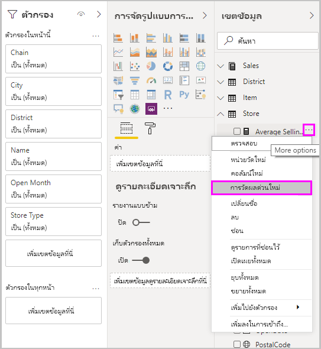
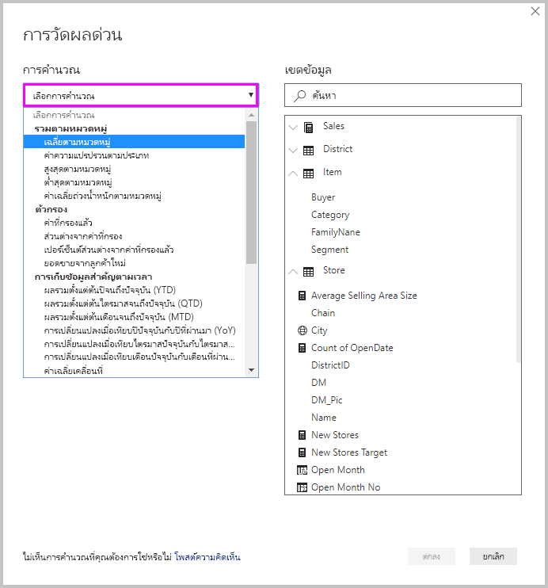
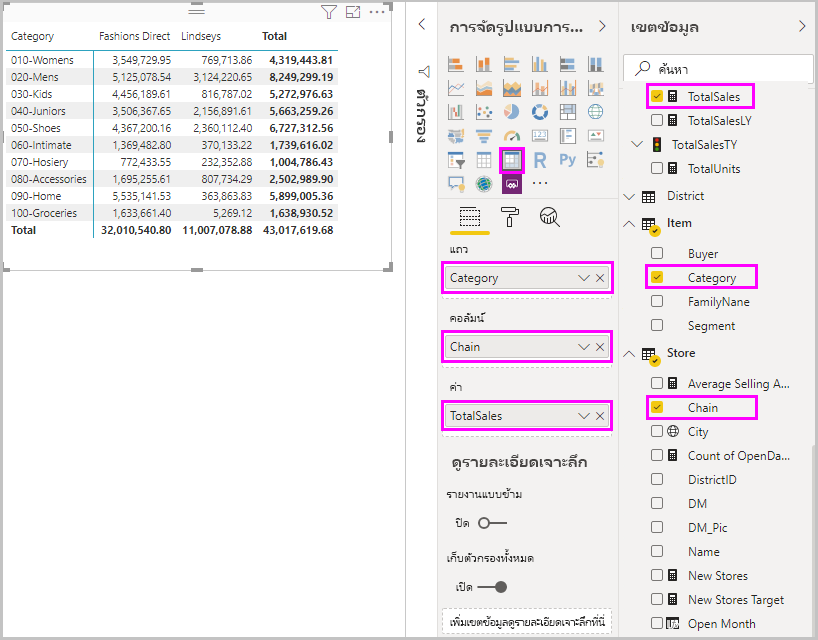
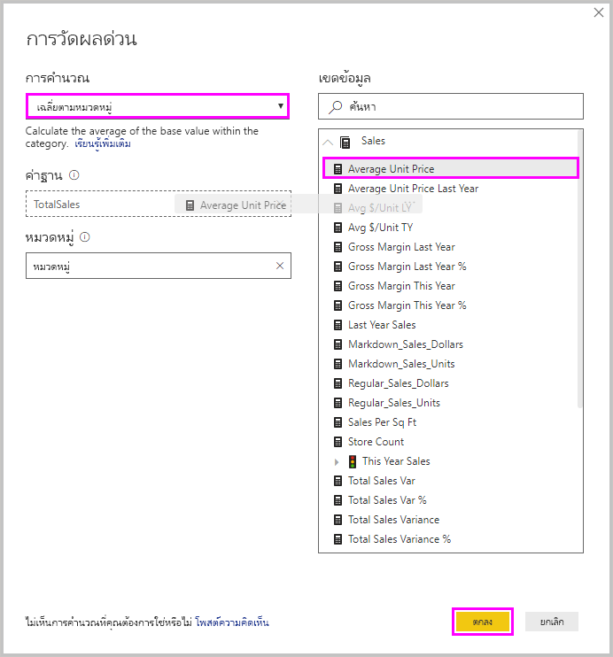
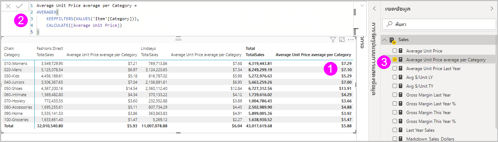
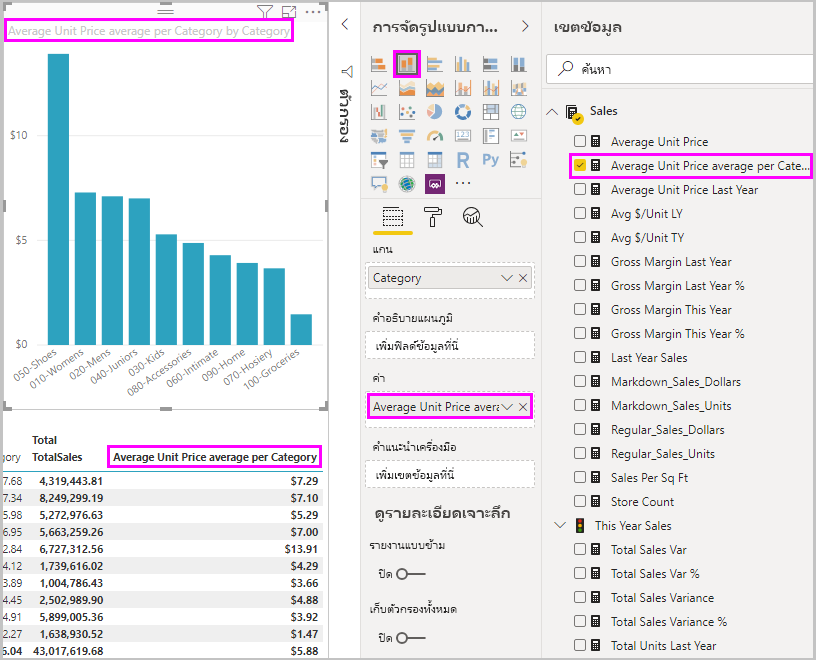
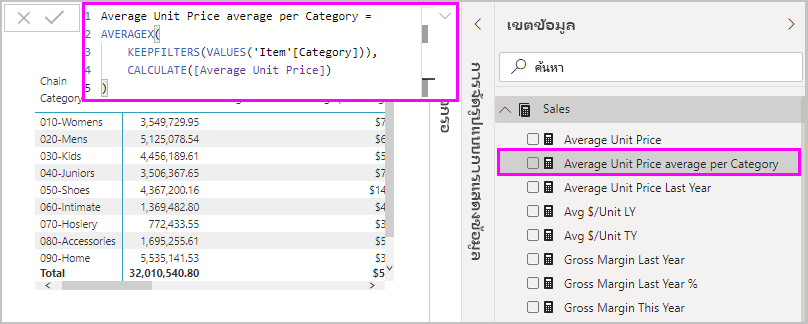
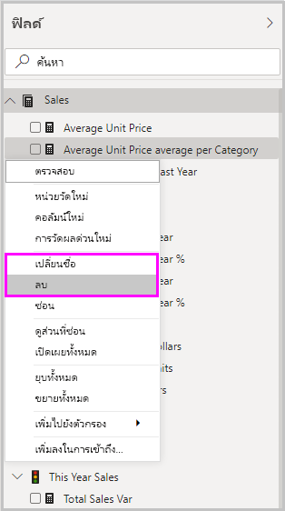

# ใช้การวัดผลด่วนสำหรับการคำนวณทั่วไปUse quick measures for common calculations
คุณสามารถใช้ *การวัดผลด่วน* สำหรับการคำนวณทั่วไปและมีประสิทธิภาพได้อย่างรวดเร็วและง่ายดายYou can use *quick measures* to quickly and easily perform common, powerful calculations. การวัดผลด่วนเรียกใช้ชุดของคำสั่งนิพจน์การวิเคราะห์ข้อมูล (DAX) ที่อยู่เบื้องหลังฉากดังกล่าว จากนั้นแสดงผลลัพธ์ให้แก่คุณในรายงานของคุณA quick measure runs a set of Data Analysis Expressions (DAX) commands behind the scenes, then presents the results for you to use in your report. คุณไม่จำเป็นต้องเขียน DAX ซึ่งจะทำให้คุณยึดตามข้อมูลที่คุณใส่ไว้ในกล่องโต้ตอบYou don't have to write the DAX, it's done for you based on input you provide in a dialog box. มีการคำนวนอยู่มากมายหลายประเภท และวิธีการปรับเปลี่ยนแต่ละการคำนวณให้ตรงกับความต้องการของคุณThere are many available categories of calculations and ways to modify each calculation to fit your needs. ยิ่งไปกว่านั้น คุณสามารถดู DAX ที่ดำเนินการโดยการวัดผลด่วน และเริ่มต้นหรือขยายความรู้ DAX ของคุณเองPerhaps best of all, you can see the DAX that's executed by the quick measure and jump-start or expand your own DAX knowledge.

## สร้างการวัดผลด่วนCreate a quick measure

หากต้องการสร้างการวัดผลด่วนใน Power BI Desktop ให้คลิกขวาหรือเลือกจุดไข่ปลา **...** ที่อยู่ถัดจากรายการใด ๆ ในบานหน้าต่าง **เขตข้อมูล** และเลือก **การวัดผลวัดด่วนใหม่** จากเมนูที่ปรากฏขึ้นTo create a quick measure in Power BI Desktop, right-click or select the ellipsis **...** next to any item in the **Fields** pane, and select **New quick measure** from the menu that appears. 

คุณยังสามารถคลิกขวาหรือเลือกลูกศรดรอปดาวน์ที่อยู่ถัดจากค่าใด ๆ ใน **ค่า** ที่เหมาะสำหรับวิชวลที่มีอยู่ และเลือก **การวัดผลด่วนใหม่** จากเมนูYou can also right-click or select the drop-down arrow next to any value in the **Values** well for an existing visual, and select **New quick measure** from the menu. 

เมื่อคุณเลือก **การวัดผลด่วนใหม่** หน้าต่าง **การวัดผลด่วน** จะปรากฏขึ้น ให้คุณเลือกการคำนวณที่คุณต้องการและเขตข้อมูลเพื่อเรียกใช้การคำนวณWhen you select **New quick measure**, the **Quick measures** window appears, letting you select the calculation you want and the fields to run the calculation against. 

เลือกเขตข้อมูล **เลือกการคำนวณ** เพื่อดูรายการของการวัดผลด่วนที่พร้อมใช้งานแบบยาวSelect the **Select a calculation** field to see a long list of available quick measures. 

การวัดผลด่วนห้าชนิดที่มีการคำนวณของตนเองคือ:The five quick measure calculation types, with their calculations, are:

* **ค่ารวมตามประเภท****Aggregate per category**
  * เฉลี่ยตามหมวดหมู่Average per category
  * ค่าความแปรปรวนตามประเภทVariance per category
  * สูงสุดตามหมวดหมู่Max per category
  * ต่ำสุดตามหมวดหมู่Min per category
  * ค่าเฉลี่ยถ่วงน้ำหนักตามหมวดหมู่Weighted average per category
* **ตัวกรอง****Filters**
  * ค่าที่กรองแล้วFiltered value
  * ส่วนต่างจากค่าที่กรองDifference from filtered value
  * เปอร์เซ็นต์ส่วนต่างจากค่าที่กรองแล้วPercentage difference from filtered value
  * ยอดขายจากลูกค้าใหม่Sales from new customers
* **ตัวแสดงเวลา****Time intelligence**
  * ผลรวมตั้งแต่ต้นปีจนถึงปัจจุบัน (YTD)Year-to-date total
  * ผลรวมตั้งแต่ต้นไตรมาสจนถึงปัจจุบัน (QTD)Quarter-to-date total
  * ผลรวมตั้งแต่ต้นเดือนจนถึงปัจจุบัน (MTD)Month-to-date total
  * การเปลี่ยนแปลงเมื่อเทียบปีปัจจุบันกับปีที่ผ่านมา (YoY)Year-over-year change
  * การเปลี่ยนแปลงเมื่อเทียบไตรมาสปัจจุบันกับไตรมาสที่ผ่านมา (QoQ)Quarter-over-quarter change
  * การเปลี่ยนแปลงเมื่อเทียบเดือนปัจจุบันกับเดือนที่ผ่านมา (MoM)Month-over-month change
  * ค่าเฉลี่ยเคลื่อนที่Rolling average
* **ทั้งหมด****Totals**
  * การรันทั้งหมดRunning total
  * ยอดรวมของประเภท (ใช้ตัวกรอง)Total for category (filters applied)
  * ยอดรวมของประเภท (ไม่ใช้ตัวกรอง)Total for category (filters not applied)
* **การดำเนินการทางคณิตศาสตร์****Mathematical operations**
  * การบวกAddition
  * การลบSubtraction
  * การคูณMultiplication
  * การหารDivision
  * เปอร์เซ็นต์ผลต่างPercentage difference
  * สัมประสิทธิ์สหสัมพันธ์Correlation coefficient
* **ข้อความ****Text**
  * การจัดอันดับด้วยดาวStar rating
  * รายการค่าแบบเชื่อมเข้าด้วยกันConcatenated list of values

หากต้องการส่งแนวคิดของคุณเกี่ยวกับการวัดผลด่วนใหม่ที่คุณต้องการดู สูตร DAX ต้นแบบหรือแนวคิดการวัดผลด่วนอื่น ๆ เพื่อพิจารณา โปรดดูที่ตอนท้ายของบทความนี้To submit your ideas about new quick measures you'd like to see, underlying DAX formulas, or other quick measures ideas for consideration, see the end of this article.

> [!NOTE]
> เมื่อใช้การเชื่อมต่อสดของ SQL Server Analysis Services (SSAS) มีการวัดผลด่วนให้ใช้งานบางตัวWhen using SQL Server Analysis Services (SSAS) live connections, some quick measures are available. Power BI Desktop จะแสดงเฉพาะชุดของการวัดผลด่วนที่ได้รับการสนับสนุนสำหรับรุ่นของ SSAS ที่คุณกำลังเชื่อมต่อไปยังPower BI Desktop displays only the quick measures that are supported for the version of SSAS you're connecting to. ถ้าคุณเชื่อมต่อกับแหล่งข้อมูลสด SSAS และคุณไม่เห็นการวัดผลด่วนบางตัวในรายการ อาจเป็นเพราะเวอร์ชัน SSAS ที่คุณเชื่อมต่อไม่สนับสนุนคำสั่ง DAX ที่ใช้โดยการวัดผลด่วนเหล่านั้นIf you're connected to a SSAS live data source and don't see certain quick measures in the list, it's because the SSAS version you're connected to doesn't support the DAX commands used to implement those quick measures.

หลังจากเลือกการคำนวณและเขตข้อมูลที่คุณต้องการสำหรับการวัดผลด่วน เลือก **ตกลง**After you select the calculations and fields you want for your quick measure, select **OK**. การวัดผลด่วนใหม่จะปรากฎในบานหน้าต่าง **เขตข้อมูล** และสูตร DAX ต้นแบบจะปรากฎในแถบสูตรThe new quick measure appears in the **Fields** pane, and the underlying DAX formula appears in the formula bar. 

## ตัวอย่างการวัดผลด่วนQuick measure example
ลองมาดูที่การวัดผลด่วนในการดำเนินการLet's take a look at a quick measure in action.

วิชวลเมทริกซ์ต่อไปนี้แสดงตารางยอดขายสำหรับผลิตภัณฑ์ต่าง ๆThe following matrix visual shows a sales table for various products. ตารางนี้เป็นตารางพื้นฐานที่มีผลรวมยอดขายสำหรับผลิตภัณฑ์แต่ละประเภทIt's a basic table that includes the sales totals for each category.

ด้วยวิชวลเมทริกซ์ที่เลือกไว้ เลือกลูกศรดรอปดาวน์ที่อยู่ถัดจาก **TotalSales** ใน **ค่า** และเลือก **การวัดผลด่วนใหม่**With the matrix visual selected, select the drop-down arrow next to **TotalSales** in the **Values** well, and select **New quick measure**. 

ในหน้าต่าง **การวัดผลด่วน** ภายใต้ **การคำนวณ** ให้เลือก **ค่าเฉลี่ยต่อประเภท**In the **Quick measures** window, under **Calculation**, select **Average per category**. 

ลาก **ราคาต่อหน่วยโดยเฉลี่ย** จากบานหน้าต่าง **เขตข้อมูล** ไปยังเขตข้อมูล **ค่าฐาน**Drag **Average Unit Price** from the **Fields** pane into the **Base value** field. เว้น **ประเภท** ในเขตข้อมูล **ประเภท** และเลือก **ตกลง**Leave **Category** in the **Category** field, and select **OK**. 

เมื่อคุณเลือก **ตกลง** มีสิ่งที่น่าสนใจหลายอย่างเกิดขึ้นWhen you select **OK**, several interesting things happen.

1. วิชวลเมทริกซ์มีคอลัมน์ใหม่ที่แสดง **ค่าเฉลี่ยของราคาต่อหน่วยเฉลี่ยตามประเภท** จากการคำนวณThe matrix visual has a new column that shows the calculated **Average Unit Price average per Category**.
   
2. สูตร DAX สำหรับการวัดผลด่วนใหม่จะปรากฏขึ้นในแถบสูตรThe DAX formula for the new quick measure appears in the formula bar. ดู[ส่วนถัดไป](#learn-dax-by-using-quick-measures)สำหรับข้อมูลเพิ่มเติมเกี่ยวกับสูตร DAXSee the [next section](#learn-dax-by-using-quick-measures) for more about the DAX formula.
   
3. การวัดผลด่วนใหม่จะปรากฏขึ้นตามที่เลือกและเน้นในบานหน้าต่าง **เขตข้อมูล**The new quick measure appears selected and highlighted in the **Fields** pane. 

การวัดผลด่วนใหม่จะพร้อมใช้งานสำหรับวิชวลใด ๆ ในรายงาน ไม่ใช่เฉพาะวิชวลที่คุณสร้างขึ้นเท่านั้นThe new quick measure is available to any visual in the report, not just the visual you created it for. รูปภาพต่อไปนี้แสดงวิชวลแผนภูมิคอลัมน์ด่วนที่สร้างขึ้นโดยใช้เขตข้อมูลการวัดผลด่วนใหม่The following image shows a quick column chart visual created by using the new quick measure field.

## เรียนรู้ DAX โดยใช้การวัดผลด่วนLearn DAX by using quick measures
ข้อได้เปรียบอย่างมากของการวัดผลด่วนคือการแสดงสูตร DAX ที่ใช้หน่วยวัดA great advantage of quick measures is that they show you the DAX formula that implements the measure. เมื่อคุณเลือกการวัดผลด่วนในบานหน้าต่าง **เขตข้อมูล** **แถบสูตร** จะปรากฏขึ้น โดยแสดงสูตร DAX ที่ Power BI สร้างขึ้นเพื่อใช้หน่วยวัดWhen you select a quick measure in the **Fields** pane, the **Formula bar** appears, showing the DAX formula that Power BI created to implement the measure.

แถบสูตรไม่ได้แสดงเฉพาะสูตรที่อยู่เบื้องหลังหน่วยวัดเท่านั้น แต่อาจมีความสำคัญมากขึ้น โดยช่วยให้คุณเห็นวิธีการสร้างการวัดผลด่วนต้นแบบของสูตร DAXThe formula bar not only shows you the formula behind the measure, but perhaps more importantly, lets you see how to create the DAX formulas underlying quick measures.

สมมติว่าคุณต้องคำนวณการเปลี่ยนแปลงปีต่อปี แต่คุณไม่แน่ใจว่าจะจัดโครงสร้างสูตร DAX อย่างไร หรือคุณยังไม่รู้ว่าจะเริ่มต้นอย่างไรImagine you need to do a year-over-year calculation, but you're not sure how to structure the DAX formula, or you have no idea where to start. คุณสามารถสร้างการวัดผลด่วนโดยใช้การคำนวณ **การเปลี่ยนแปลงเมื่อเทียบปีปัจจุบันกับปีที่ผ่านมา** และดูว่าวิธีการที่จะปรากฏในวิชวลของคุณ และวิธีการทำงานของสูตร DAXInstead of banging your head on the desk, you can create a quick measure using the **Year-over-year change** calculation, and see how it appears in your visual and how the DAX formula works. จากนั้นคุณสามารถทำการเปลี่ยนแปลงในสูตร DAX โดยตรง หรือสร้างหน่วยวัดที่คล้ายกันที่ตรงตามความต้องการและการคาดหวังของคุณThen you can either make changes directly to the DAX formula, or create a similar measure that meets your needs and expectations. เหมือนกับมีครูผู้สอนที่ตอบคำถามคุณแบบ what-if ในทันที โดยการคลิกไม่กี่ครั้งIt's like having a teacher that immediately responds to what-if questions you ask with a few clicks. 

คุณสามารถลบการวัดผลด่วนออกจากแบบจำลองของคุณได้เสมอหากคุณไม่ชอบYou can always delete quick measures from your model if you don't like them. ด้วยการคลิกขวาหรือเลือก **...** ถัดจากหน่วยวัดและการเลือก **ลบ**That's as easy as right-clicking or selecting the **...** next to the measure and selecting **Delete**. นอกจากนี้ คุณยังสามารถเปลี่ยนชื่อการวัดผลด่วนสิ่งที่คุณต้องการโดยการเลือก **เปลี่ยนชื่อ** จากเมนูYou can also rename a quick measure whatever you like by selecting **Rename** from the menu. 

## ข้อจำกัดและข้อควรพิจารณาLimitations and considerations
มีข้อจำกัดและข้อควรพิจารณาบางข้อที่คุณควรทราบThere are a few limitations and considerations to keep in mind.

- คุณสามารถใช้การวัดผลด่วนที่เพิ่มลงในบานหน้าต่าง **เขตข้อมูล** ด้วยวิชวลต่าง ๆ ในรายงานYou can use quick measures added to the **Fields** pane with any visual in the report.
- คุณสามารถดู DAX ที่เชื่อมโยงกับการวัดผลด่วนได้ตลอดเวลาโดยการเลือกหน่วยวัดในรายการ **เขตข้อมูล** จากนั้นดูสูตรในแถบสูตรYou can always see the DAX associated with a quick measure by selecting the measure in the **Fields** list and looking at the formula in the formula bar.
- การวัดผลด่วนจะพร้อมใช้งานเฉพาะเมื่อคุณสามารถปรับเปลี่ยนแบบจำลองได้Quick measures are only available if you can modify the model. ซึ่งไม่ใช่กรณีเมื่อคุณกำลังทำงานกับการเชื่อมต่อสดบางอย่างThat isn't the case when you're working with some Live connections. การเชื่อมต่อสดของตาราง SSAS ได้รับการสนับสนุนตามที่ได้อธิบายไว้ก่อนหน้านี้SSAS tabular live connections are supported, as previously described.
- คุณไม่สามารถสร้างการวัดผลด่วนตัวแสดงเวลา เมื่อทำงานในโหมด DirectQueryYou can't create time intelligence quick measures when working in DirectQuery mode. ฟังก์ชัน DAX ที่ใช้ในการวัดผลด่วนเหล่านี้มีผลต่อประสิทธิภาพการทำงาน เมื่อแปลเป็นคำสั่ง T-SQL ที่ส่งไปยังแหล่งข้อมูลของคุณThe DAX functions used in these quick measures have performance implications when translated into the T-SQL statements that are sent to your data source.

> [!IMPORTANT]
> คำสั่ง DAX สำหรับการวัดผลด่วนใช้เครื่องหมายจุลภาคสำหรับตัวคั่นอาร์กิวเมนต์เท่านั้นDAX statements for quick measures use only commas for argument separators. ถ้าเวอร์ชัน Power BI Desktop อยู่ในภาษาที่ใช้เครื่องหมายจุลภาคเป็นตัวคั่นทศนิยม การวัดผลด่วนจะทำงานไม่ถูกต้องIf your version of Power BI Desktop is in a language that uses commas as decimal separators, quick measures will not work properly.

### ตัวแสดงเวลาและการวัดผลด่วนTime intelligence and quick measures
คุณสามารถใช้ตารางวันที่แบบกำหนดเองของคุณเองด้วยหน่วยวัดด่วนของตัวแสดงเวลาYou can use your own custom date tables with time intelligence quick measures. ถ้าคุณกำลังใช้รูปแบบตารางจากภายนอก คุณต้องแน่ใจว่าเมื่อสร้างแบบจำลองขึ้นมา คอลัมน์วันที่หลักในตารางต้องถูกทำเครื่องหมายว่าเป็นตารางวันที่ ตามที่อธิบายไว้ใน[ระบุเครื่องหมายเป็นตารางวันที่สำหรับใช้กับตัวแสดงเวลา](/sql/analysis-services/tabular-models/specify-mark-as-date-table-for-use-with-time-intelligence-ssas-tabular)If you're using an external tabular model, make sure that when the model was built, the primary date column in the table was marked as a date table, as described in [Specify Mark as Date Table for use with time-intelligence](/sql/analysis-services/tabular-models/specify-mark-as-date-table-for-use-with-time-intelligence-ssas-tabular). ถ้าคุณกำลังนำเข้าตารางวันที่ของคุณเอง ตรวจสอบให้แน่ใจว่าได้ทำเครื่องหมายเป็นตารางวันที่ ตามที่อธิบายไว้ใน[ ตั้งค่าและใช้ตารางวันที่ใน Power BI Desktop](desktop-date-tables.md)If you're importing your own date table, make sure to mark it as a date table, as described in [Set and use date tables in Power BI Desktop](desktop-date-tables.md).

### ข้อมูลเพิ่มเติมและตัวอย่างAdditional information and examples
มีแนวคิดสำหรับการวัดผลด่วนที่ยังไม่มีหรือไม่Have an idea for a quick measure that isn't already provided? ดีเยี่ยม!Great! ลองดูหน้า[ Power BI Ideas](https://go.microsoft.com/fwlink/?linkid=842906) และส่งแนวคิดและสูตร DAX ของคุณสำหรับการวัดผลด่วนที่คุณต้องการดูใน Power BI DesktopCheck out the [Power BI Ideas](https://go.microsoft.com/fwlink/?linkid=842906) page, and submit your ideas and DAX formulas for quick measures you'd like to see in Power BI Desktop. เราจะพิจารณาการเพิ่มแนวคิดเหล่านี้ลงในรายการการวัดผลด่วนที่จะเผยแพร่ในอนาคตWe'll consider adding them to the quick measures list in a future release.