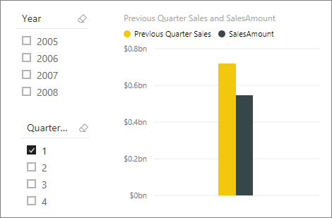

# ปรับใช้พื้นฐาน DAX ใน Power BI DesktopApply DAX basics in Power BI Desktop
บทความนี้มีไว้สำหรับผู้ใช้ที่ยังใหม่กับ Power BI DesktopThis article is for users new to Power BI Desktop. ซึ่งมีคำแนะนำที่ง่ายและรวดเร็วแก่คุณเกี่ยวกับวิธีการที่คุณสามารถใช้นิพจน์การวิเคราะห์ข้อมูล (DAX) เพื่อแก้ปัญหาการคำนวณพื้นฐานและการวิเคราะห์ข้อมูลต่าง ๆIt gives you a quick and easy introduction on how you can use Data Analysis Expressions (DAX) to solve a number of basic calculation and data analysis problems. เราจะไปดูกันที่ข้อมูลแนวคิดบางอย่าง ชุดงานที่คุณสามารถได้ และการตรวจสอบความรู้เพื่อทดสอบสิ่งที่คุณได้เรียนรู้ไปWe’ll go over some conceptual information, a series of tasks you can complete, and a knowledge check to test what you’ve learned. หลังจากจบบทความนี้ คุณควรมีความเข้าใจที่ดีเกี่ยวกับแนวคิดพื้นฐานสำคัญที่สุดของ DAXAfter completing this article, you should have a good understanding of the most important fundamental concepts in DAX.

## DAX คืออะไรWhat is DAX?
DAX คือ คอลเลกชันของฟังก์ชัน ตัวดำเนินการ และค่าคงที่ที่สามารถใช้ในสูตรหรือนิพจน์เพื่อคำนวณและส่งคืนค่าอย่างน้อยหนึ่งค่าDAX is a collection of functions, operators, and constants that can be used in a formula, or expression, to calculate and return one or more values. กล่าวให้ง่ายขึ้นก็คือ DAX จะช่วยให้คุณสร้างข้อมูลใหม่จากข้อมูลที่มีอยู่แล้วในแบบจำลองของคุณStated more simply, DAX helps you create new information from data already in your model.

## ทำไม DAX จึงสำคัญมากWhy is DAX so important?
การสร้างไฟล์ Power BI Desktop ใหม่และการนำเข้าข้อมูลบางอย่างเข้าไปในไฟล์สามารถทำได้ง่ายIt’s easy to create a new Power BI Desktop file and import some data into it. คุณยังสามารถสร้างรายงานที่แสดงข้อมูลเชิงลึกอันมีค่าได้โดยไม่ต้องใช้สูตร DAX ใด ๆ เลยYou can even create reports that show valuable insights without using any DAX formulas at all. แต่จะเกิดอะไรขึ้นถ้าคุณจำเป็นต้องวิเคราะห์เปอร์เซ็นต์การเติบโตในแต่ละประเภทผลิตภัณฑ์และสำหรับช่วงวันที่ที่แตกต่างกันBut, what if you need to analyze growth percentage across product categories and for different date ranges? หรือคุณจำเป็นต้องคำนวณการเติบโตแบบปีต่อปีเมื่อเปรียบเทียบกับแนวโน้มของตลาดOr, you need to calculate year-over-year growth compared to market trends? สูตร DAX ทำให้มีความสามารถนี้รวมถึงความสามารถอื่นๆ อีกหลายอย่างที่สำคัญด้วยDAX formulas provide this capability and many other important capabilities as well. การเรียนรู้วิธีการสร้างสูตร DAX อย่างมีประสิทธิภาพจะช่วยให้คุณได้รับประโยชน์สูงสุดจากข้อมูลของคุณLearning how to create effective DAX formulas will help you get the most out of your data. เมื่อได้ข้อมูลที่ต้องการ คุณก็สามารถเริ่มแก้ปัญหาทางธุรกิจที่แท้จริงซึ่งส่งผลกระทบต่อผลลัพธ์ทางธุรกิจของคุณWhen you get the information you need, you can begin to solve real business problems that affect your bottom line. นี่คือประสิทธิภาพของ Power BI และ DAX จะช่วยให้คุณสามารถเข้าถึงสิ่งนั้นThis is the power of Power BI, and DAX will help you get there.

## ข้อกำหนดเบื้องต้นPrerequisites
คุณอาจคุ้นเคยกับการสร้างสูตรใน Microsoft Excel อยู่แล้วYou might already be familiar with creating formulas in Microsoft Excel. ความรู้นั้นจะเป็นประโยชน์ในการทำความเข้าใจ DAX แต่ถึงแม้ว่าคุณจะไม่มีประสบการณ์เกี่ยวกับสูตร Excel มาก่อน แนวคิดที่อธิบายไว้ที่นี้สามารถช่วยให้คุณเริ่มต้นการสร้างสูตร DAX และแก้ไขปัญหา BI ในความเป็นจริงได้ทันทีThat knowledge will be helpful in understanding DAX, but even if you have no experience with Excel formulas, the concepts described here will help you get started creating DAX formulas and solving real-world BI problems right away.

เราจะมุ่งเน้นไปที่การทำความเข้าใจสูตร DAX ที่ใช้ในการคำนวณต่างๆ โดยเฉพาะอย่างยิ่งในหน่วยวัดและคอลัมน์จากการคำนวณWe’ll focus on understanding DAX formulas used in calculations, more specifically, in measures and calculated columns. คุณควรจะมีความคุ้นเคยอยู่แล้วกับการใช้ Power BI Desktop เพื่อนำเข้าข้อมูล และเพิ่มเขตข้อมูลในรายงาน และควรมีความคุ้นเคยกับแนวคิดพื้นฐานของ[หน่วยวัด](desktop-measures.md)และ[คอลัมน์จากคำนวณ](desktop-calculated-columns.md)ด้วยYou should already be familiar with using Power BI Desktop to import data and add fields to a report, and you should also be familiar with fundamental concepts of [Measures](desktop-measures.md) and [Calculated columns](desktop-calculated-columns.md).

### เวิร์กบุ๊กตัวอย่างExample workbook

วิธีที่ดีที่สุดในการเรียนรู้ DAX ก็คือสร้างสูตรพื้นฐานบางสูตร ใช้สูตรนั้นกับข้อมูลจริง และดูผลลัพธ์ด้วยตัวคุณเองThe best way to learn DAX is to create some basic formulas, use them with actual data, and see the results for yourself. ตัวอย่างและงานในที่นี่ใช้ [ตัวอย่างยอดขาย Contoso สำหรับไฟล์ Power BI Desktop](https://download.microsoft.com/download/4/6/A/46AB5E74-50F6-4761-8EDB-5AE077FD603C/Contoso%20Sales%20for%20Power%20BI%20Designer.zip)The examples and tasks here use the [Contoso Sales Sample for Power BI Desktop file](https://download.microsoft.com/download/4/6/A/46AB5E74-50F6-4761-8EDB-5AE077FD603C/Contoso%20Sales%20for%20Power%20BI%20Designer.zip). ไฟล์ตัวอย่างนี้เป็นไฟล์เดียวกับที่ใช้ในบทช่วยสอน [: สร้างหน่วยวัดของคุณเองในบทความ](desktop-tutorial-create-measures.md) Power BI DesktopThis sample file is the same one used in the [Tutorial: Create your own measures in Power BI Desktop](desktop-tutorial-create-measures.md) article. 

## มาเริ่มกันเลย!Let's begin!
เราจะกำหนดกรอบการทำความเข้าใจเรื่อง DAX โดยเกี่ยวข้องกับแนวคิดพื้นฐานสามข้อ: *ไวยากรณ์* *ฟังก์ชัน* และ *บริบท*We'll frame our understanding of DAX around three fundamental concepts: *Syntax*, *Functions*, and *Context*. มีแนวคิดที่สำคัญอื่น ๆ เกี่ยวกับ DAX อีก แต่การทำความเข้าใจแนวคิดสามข้อเหล่านี้จะช่วยให้คุณมีข้อมูลพื้นฐานที่ดีที่สุดเกี่ยวกับสร้างทักษะ DAXThere are other important concepts in DAX, but understanding these three concepts will provide the best foundation on which to build your DAX skills.

### ไวยากรณ์Syntax
ก่อนที่คุณจะสร้างสูตรของคุณเอง ลองมาดูที่ไวยากรณ์ของสูตร DAX กันก่อนBefore you create your own formulas, let’s take a look at DAX formula syntax. ไวยากรณ์ประกอบด้วยองค์ประกอบต่าง ๆ ที่ทำให้เกิดสูตรหรือกล่าวให้ง่ายยิ่งขึ้นก็คือ วิธีเขียนสูตรSyntax includes the various elements that make up a formula, or more simply, how the formula is written. ตัวอย่างเช่น ตัวอย่างต่อไปนี้เป็นสูตร DAX อย่างง่ายสำหรับหน่วยวัดFor example, here's a simple DAX formula for a measure:

สูตรนี้ประกอบด้วยองค์ประกอบไวยากรณ์ดังต่อไปนี้:This formula includes the following syntax elements:

**A.****A.** ชื่อหน่วยวัด **Total Sales**The measure name, **Total Sales**.

**B.****B.** ตัวดำเนินการเครื่องหมายเท่ากับ ( **=** ) ซึ่งระบุจุดเริ่มต้นของสูตรThe equals sign operator (**=**), which indicates the beginning of the formula. เมื่อคำนวณแล้ว ก็จะส่งคืนผลลัพธ์When calculated, it will return a result.

**C.****C.** ฟังก์ชัน DAX **SUM** ซึ่งรวมยอดทั้งหมดในคอลัมน์ **Sales[SalesAmount]**The DAX function **SUM**, which adds up all of the numbers in the **Sales[SalesAmount]** column. คุณจะได้เรียนรู้เพิ่มเติมเกี่ยวกับฟังก์ชันต่างๆ ในภายหลังYou’ll learn more about functions later.

**D.****D.** วงเล็บ **()** ที่ล้อมรอบนิพจน์ที่ประกอบด้วยอย่างน้อยหนึ่งอาร์กิวเมนต์Parenthesis **()**, which surround an expression that contains one or more arguments. ฟังก์ชันทั้งหมดจำเป็นต้องมีอย่างน้อยหนึ่งอาร์กิวเมนต์All functions require at least one argument. อาร์กิวเมนต์จะส่งผ่านค่าไปยังฟังก์ชันAn argument passes a value to a function.

**E.****E.** ตารางอ้างอิง **ยอดขาย**The referenced table, **Sales**.

**F.****F.** คอลัมน์อ้างอิง **[SalesAmount]** ในตารางยอดขายThe referenced column, **[SalesAmount]**, in the Sales table. ด้วยอาร์กิวเมนต์นี้ ฟังก์ชัน SUM จะทราบได้ว่าจะรวมผล SUM ในคอลัมน์ใดบ้างWith this argument, the SUM function knows on which column to aggregate a SUM.

เมื่อคุณพยายามทำความเข้าใจสูตร DAX การแบ่งย่อยแต่ละองค์ประกอบให้เป็นภาษาที่คุณคิดและพูดทุกวันมักจะเป็นประโยชน์When trying to understand a DAX formula, it's often helpful to break down each of the elements into a language you think and speak every day. ตัวอย่างเช่น คุณสามารถอ่านสูตรนี้ได้เป็น:For example, you can read this formula as:

> *สำหรับหน่วยวัดชื่อ ยอดขายรวม ให้คำนวณ (=) SUM ของค่าในคอลัมน์ [SalesAmount] ในตารางยอดขาย**For the measure named Total Sales, calculate (=) the SUM of values in the [SalesAmount ] column in the Sales table.*
> 
> 

เมื่อเพิ่มเข้าไปในรายงานแล้ว หน่วยวัดนี้จะคำนวณและส่งคืนค่าโดยการหาผลรวมยอดขายสำหรับแต่ละเขตข้อมูลอื่น ๆ ที่รวมอยู่ด้วย เช่น โทรศัพท์มือถือในสหรัฐอเมริกาWhen added to a report, this measure calculates and returns values by summing up sales amounts for each of the other fields we include, for example, Cell Phones in the USA.

คุณอาจกำลังคิดว่า "หน่วยวัดนี้ก็ทำอย่างเดียวกันกับที่ฉันทำเพียงแค่เพิ่มเขตข้อมูล SalesAmount ลงในรายงานของฉันไม่ใช่หรือ"You might be thinking, "Isn’t this measure doing the same thing as if I were to just add the SalesAmount field to my report?" ก็ใช่Well, yes. แต่มีเหตุผลที่ดีในการสร้างหน่วยวัดของเราเองขึ้นมาซึ่งจะหาผลรวมของค่าจากเขตข้อมูล SalesAmount: เราสามารถใช้สิ่งนี้เป็นอาร์กิวเมนต์ในสูตรอื่น ๆ ได้But, there’s a good reason to create our own measure that sums up values from the SalesAmount field: We can use it as an argument in other formulas. ซึ่งอาจดูสับสนเล็กน้อยในตอนนี้ แต่เมื่อคุณเพิ่มพูนทักษะเกี่ยวกับสูตร DAX ความเข้าใจเกี่ยวกับหน่วยวัดนี้จะทำให้สูตรและแบบจำลองของคุณมีประสิทธิภาพมากยิ่งขึ้นThis may seem a little confusing now, but as your DAX formula skills grow, knowing this measure will make your formulas and your model more efficient. อันที่จริงแล้ว คุณจะเห็นหน่วยวัดยอดขายรวมปรากฏขึ้นเป็นอาร์กิวเมนต์ในสูตรอื่นในภายหลังIn fact, you’ll see the Total Sales measure showing up as an argument in other formulas later on.

ลองมาดูบางอย่างเพิ่มเติมเกี่ยวกับสูตรนี้กันLet’s go over a few more things about this formula. โดยเฉพาะอย่างยิ่ง เราได้แนะนำฟังก์ชัน [SUM](/dax/sum-function-dax) ไปแล้วIn particular, we introduced a function, [SUM](/dax/sum-function-dax). ฟังก์ชันเป็นสูตรที่เขียนไว้ล่วงหน้าซึ่งทำให้สามารถทำการคำนวณที่ซับซ้อนและจัดการกับตัวเลข วันที่ เวลา ข้อความและอื่น ๆ ได้ง่ายยิ่งขึ้นFunctions are pre-written formulas that make it easier to do complex calculations and manipulations with numbers, dates, time, text, and more. คุณจะได้เรียนรู้เพิ่มเติมเกี่ยวกับฟังก์ชันต่าง ๆ ในภายหลังYou'll learn more about functions later.

นอกจากนี้ คุณยังเห็นว่าคอลัมน์ [SalesAmount] ถูกนำหน้าด้วยตารางยอดขายซึ่งมีคอลัมน์ดังกล่าวอยู่ในนั้นYou also see that the column name [SalesAmount] was preceded by the Sales table in which the column belongs. ชื่อนี้เรียกว่าชื่อคอลัมน์ที่ผ่านการรับรองโดยสมบูรณ์ ซึ่งรวมชื่อคอลัมน์ที่นำหน้าด้วยชื่อตารางThis name is known as a fully qualified column name in that it includes the column name preceded by the table name. คอลัมน์ที่อ้างอิงในตารางเดียวกันไม่จำเป็นต้องมีชื่อตารางในสูตร ซึ่งสามารถสร้างสูตรแบบยาวที่อ้างอิงหลายคอลัมน์ได้ และทำให้สูตรดังกล่าวสั้นลงและง่ายต่อการอ่านมากกว่าด้วยColumns referenced in the same table don't require the table name be included in the formula, which can make long formulas that reference many columns shorter and easier to read. อย่างไรก็ตาม เป็นการดีที่จะรวมชื่อตารางไว้ในสูตรหน่วยวัดของคุณด้วยแม้จะอยู่ในตารางเดียวกันHowever, it's a good practice to  include the table name in your measure formulas, even when in the same table.

> [!NOTE]
> ถ้าชื่อตารางประกอบด้วยช่องว่าง คำสำคัญที่สงวนไว้ หรืออักขระที่ไม่ได้รับอนุญาต คุณต้องใส่ชื่อตารางไว้ในเครื่องหมายอัญประกาศเดี่ยวIf a table name contains spaces, reserved keywords, or disallowed characters, you must enclose the table name in single quotation marks. นอกจากนี้ คุณยังจำเป็นต้องใส่ชื่อตารางในเครื่องหมายอัญประกาศถ้าชื่อประกอบด้วยอักขระใด ๆ ที่อยู่นอกช่วงอักขระพยัญชนะผสมตัวเลข ANSI โดยไม่ต้องคำนึงถึงว่าตำแหน่งที่ตั้งของคุณสนับสนุนชุดอักขระหรือไม่You’ll also need to enclose table names in quotation marks if the name contains any characters outside the ANSI alphanumeric character range, regardless of whether your locale supports the character set or not.
> 
> 

เป็นเรื่องสำคัญที่ว่า สูตรของคุณมีไวยากรณ์ที่ถูกต้องIt’s important your formulas have the correct syntax. ในกรณีส่วนใหญ่ ถ้าไวยากรณ์ไม่ถูกต้อง ข้อผิดพลาดทางไวยากรณ์จะถูกส่งกลับมาIn most cases, if the syntax isn't correct, a syntax error is returned. ในกรณีอื่น ๆ ไวยากรณ์อาจถูกต้อง แต่ค่าที่ส่งคืนอาจไม่ใช่สิ่งที่คุณคาดคิดIn other cases, the syntax may be correct, but the values returned might not be what you're expecting. ตัวแก้ไข DAX ใน Power BI Desktop มีคุณลักษณะคำแนะนำซึ่งใช้เพื่อสร้างสูตรที่ถูกต้องทางไวยากรณ์โดยช่วยให้คุณสามารถเลือกองค์ประกอบที่ถูกต้องได้The DAX editor in Power BI Desktop includes a suggestions feature, used to create syntactically correct formulas by helping you select the correct elements.

มาสร้างสูตรอย่างง่ายกันLet’s create a simple formula. งานนี้จะช่วยให้คุณเข้าใจมากยิ่งขึ้นเกี่ยวกับไวยากรณ์ของสูตรและวิธีที่คุณลักษณะคำแนะนำในแถบสูตรสามารถช่วยคุณได้This task will help you further understand formula syntax and how the suggestions feature in the formula bar can help you.

### งาน: สร้างสูตรหน่วยวัดTask: Create a measure formula

1. [ดาวน์โหลด](https://download.microsoft.com/download/4/6/A/46AB5E74-50F6-4761-8EDB-5AE077FD603C/Contoso%20Sales%20for%20Power%20BI%20Designer.zip) และเปิดไฟล์ Power BI Desktop สำหรับตัวอย่างยอดขาย Contoso[Download](https://download.microsoft.com/download/4/6/A/46AB5E74-50F6-4761-8EDB-5AE077FD603C/Contoso%20Sales%20for%20Power%20BI%20Designer.zip) and open the Contoso Sales Sample Power BI Desktop file. 
    
2. ในมุมมองรายงาน ในรายการเขตข้อมูล คลิกขวาบนตาราง **ยอดขาย** และจากนั้นเลือก **หน่วยวัดใหม่**In Report view, in the field list, right-click the **Sales** table, and then select **New Measure**.
    
3. ในแถบสูตร แทนที่ **หน่วยวัด** ด้วยการป้อนชื่อหน่วยวัดใหม่ *Previous Quarter Sales*In the formula bar, replace **Measure** by entering a new measure name, *Previous Quarter Sales*.
    
4. หลังจากเครื่องหมายเท่ากับ พิมพ์ตัวอักษรแรก 2-3 *CAL* แล้ว คลิกสองครั้งที่ฟังก์ชันที่คุณต้องการใช้After the equals sign, type the first few letters *CAL*, and then double-click the function you want to use. ในสูตรนี้ คุณต้องการใช้ฟังก์ชัน **CALCULATE**In this formula, you want to use the **CALCULATE** function.

   คุณจะใช้ฟังก์ชัน CALCULATE เพื่อกรองจำนวนที่เราต้องการหาผลรวมโดยอาร์กิวเมนต์ที่ส่งผ่านไปยังฟังก์ชัน CALCULATEYou’ll use the CALCULATE function to filter the amounts we want to sum by an argument we pass to the CALCULATE function. ฟังก์ชันนี้เรียกว่าฟังก์ชันการซ้อนThis is referred to as nesting functions. ฟังก์ชัน CALCULATE มีอย่างน้อยสองอาร์กิวเมนต์The CALCULATE function has at least two arguments. อาร์กิวเมนต์แรกเป็นนิพจน์ที่จะประเมิน และอาร์กิวเมนต์ที่สองเป็นตัวกรองThe first is the expression to be evaluated, and the second is a filter.
   
5. หลังจากวงเล็บเปิด *(* สำหรับฟังก์ชัน **CALCULATE** พิมพ์ *SUM* ตามด้วยวงเล็บเปิดอื่น *(*After the opening parenthesis *(* for the **CALCULATE** function, type *SUM* followed by another opening parenthesis *(*. 

   ถัดไป เราจะส่งผ่านอาร์กิวเมนต์ไปยังฟังก์ชัน SUMNext, we'll pass an argument to the SUM function.

6. เริ่มพิมพ์ *Sal* แล้วเลือก **ขาย [SalesAmount]** ตาม ด้วยวงเล็บปิด *)*Begin typing *Sal*, and then select **Sales[SalesAmount]**, followed by a closing parenthesis *)*. 

   นี่เป็นอาร์กิวเมนต์นิพจน์แรกสำหรับฟังก์ชัน CALCULATE ของเราThis is the first expression argument for our CALCULATE function.
    
7. พิมพ์เครื่องหมายจุลภาค ( *,* ) ตามด้วยช่องว่างเพื่อระบุตัวกรองแรก จากนั้นพิมพ์ *PREVIOUSQUARTER*Type a comma (*,*) followed by a space to specify the first filter, and then type *PREVIOUSQUARTER*. 
    
   คุณจะใช้ฟังก์ชันตัวแสดงเวลา PREVIOUSQUARTER เพื่อกรองผลลัพธ์ SUM ของเราตามไตรมาสก่อนหน้าYou’ll use the PREVIOUSQUARTER time intelligence function to filter SUM results by the previous quarter.
    
8. หลังวงเล็บเปิด *(* สำหรับฟังก์ชัน PREVIOUSQUARTER พิมพ์ *Calendar[DateKey]*After the opening parenthesis *(* for the PREVIOUSQUARTER function, type *Calendar[DateKey]*.
    
   ฟังก์ชัน PREVIOUSQUARTER มีหนึ่งอาร์กิวเมนต์ซึ่งเป็นคอลัมน์ที่ประกอบด้วยช่วงวันต่อเนื่องกันThe PREVIOUSQUARTER function has one argument, a column containing a contiguous range of dates. ในกรณีของเรา นั่นคือคอลัมน์ DateKey ในตารางปฏิทินIn our case, that's the DateKey column in the Calendar table.
    
9. ปิดทั้งสองอาร์กิวเมนต์ที่ถูกส่งผ่านไปยังฟังก์ชัน PREVIOUSQUARTER และฟังก์ชัน CALCULATE โดยพิมพ์วงเล็บปิดสองตัว *))*Close both the arguments being passed to the PREVIOUSQUARTER function and the CALCULATE function by typing two closing parenthesis *))*.
    
   ในตอนนี้สูตรของคุณควรมีลักษณะดังนี้:Your formula should now look like this:
    
   **ยอดขายไตรมาสก่อนหน้า = CALCULATE(SUM(Sales[SalesAmount]), PREVIOUSQUARTER(Calendar[DateKey]))****Previous Quarter Sales = CALCULATE(SUM(Sales[SalesAmount]), PREVIOUSQUARTER(Calendar[DateKey]))**
    
10. เลือกเครื่องหมายถูกSelect the checkmark  ในแถบสูตรหรือกด Enter เพื่อตรวจสอบสูตร และเพิ่มไปยังแบบจำลองin the formula bar or press Enter to validate the formula and add it to the model.

คุณทำสำเร็จแล้ว!You did it! คุณเพิ่งสร้างหน่วยวัดที่ซับซ้อนโดยใช้ DAX และไม่ใช่เรื่องง่ายๆ เลยYou just created a complex measure by using DAX, and not an easy one at that. สูตรนี้จะทำงานเพื่อคำนวณยอดขายรวมสำหรับไตรมาสก่อนหน้าโดยขึ้นอยู่กับตัวกรองที่ใช้ในรายงานWhat this formula will do is calculate the total sales for the previous quarter, depending on the filters applied in a report. ตัวอย่างเช่น ถ้าเราใส่ SalesAmount และหน่วยวัด Previous Quarter Sales ใหม่ของเราในแผนภูมิ แล้วเพิ่ม Year และ QuarterOfYear เป็นตัวแบ่งส่วนข้อมูล เราจะได้รับข้อมูลบางอย่างดังนี้:For example, if we put SalesAmount and our new Previous Quarter Sales measure in a chart, and then add Year and QuarterOfYear as Slicers, we’d get something like this:

คุณเพิ่งได้รับคำแนะนำเกี่ยวกับแง่มุมที่สำคัญต่าง ๆ ของสูตร DAX:You were just introduced to several important aspects of DAX formulas: 

- สูตรนี้ประกอบด้วยสองฟังก์ชันThis formula included two functions. [PREVIOUSQUARTER](/dax/previousquarter-function-dax) ซึ่งเป็นฟังก์ชันตัวแสดงเวลาจะซ้อนกันเป็นอาร์กิวเมนต์ที่ส่งผ่านไปยังฟังก์ชันตัวกรอง [CALCULATE](/dax/calculate-function-dax)[PREVIOUSQUARTER](/dax/previousquarter-function-dax), a time intelligence function, is nested as an argument passed to [CALCULATE](/dax/calculate-function-dax), a filter function. 

   สูตร DAX สามารถมีได้จนถึง 64 ฟังก์ชันซ้อนกันDAX formulas can contain up to 64 nested functions. ไม่น่าเคยมีสูตรที่ประกอบด้วยฟังก์ชันที่ซ้อนกันมากเช่นนี้มาก่อนIt’s unlikely a formula would ever contain so many nested functions. อันที่จริงแล้ว สูตรดังกล่าวอาจสร้างและแก้ไขจุดบกพร่องได้ยาก และอาจทำได้ไม่รวดเร็วนักIn fact, such a formula would be difficult to create and debug, and it probably wouldn’t be very fast either.

- ในสูตรนี้ คุณยังใช้ตัวกรองด้วยIn this formula, you also used filters. ตัวกรองจะช่วยทำให้สิ่งที่จะคำนวณแคบลงFilters narrow down what will be calculated. ในกรณีนี้ คุณเลือกตัวกรองหนึ่งตัวเป็นอาร์กิวเมนต์ซึ่งแท้จริงแล้วเป็นผลลัพธ์ของฟังก์ชันอื่นIn this case, you selected one filter as an argument, which is actually the result of another function. คุณจะได้เรียนรู้เพิ่มเติมเกี่ยวกับตัวกรองต่างๆ ในภายหลังYou will learn more about filters later.

- คุณสามารถใช้ฟังก์ชัน CALCULATE ได้You used the CALCULATE function. ฟังก์ชันนี้เป็นหนึ่งในฟังก์ชันที่มีประสิทธิภาพที่สุดใน DAXThis function is one of the most powerful functions in DAX. เมื่อคุณเขียนแบบจำลองและสร้างสูตรที่ซับซ้อนมากยิ่งขึ้น ก็มีแนวโน้มว่าคุณจะต้องใช้ฟังก์ชันนี้บ่อยครั้งAs you author models and create more complex formulas, you'll likely use this function many times. แม้ว่าการอภิปรายเพิ่มเติมเกี่ยวกับฟังก์ชัน CALCULATE จะอยู่นอกขอบเขตของบทความนี้ แต่เมื่อใดที่คุณต้องการศึกษาเพิ่มเติมเกี่ยวกับ DAX คุณควรสนใจฟังก์ชันนี้เป็นพิเศษAlthough further discussion about the CALCULATE function is outside the scope of this article, as your knowledge of DAX grows, pay special attention to it.

### แบบทดสอบอย่างเร็วเรื่องไวยากรณ์Syntax QuickQuiz
1. ปุ่มนี้บนแถบสูตรทำอะไรได้บ้างWhat does this button on the formula bar do?
   
   > 
   > 
   > 
2. อะไรที่ต้องล้อมรอบชื่อคอลัมน์ในสูตร DAX อยู่เสมอWhat always surrounds a column name in a DAX formula?

คำตอบมีให้ไว้ในตอนท้ายของบทความนี้Answers are provided at the end of this article.

### ฟังก์ชันFunctions
ฟังก์ชัน คือ สูตรที่กำหนดไว้ล่วงหน้าซึ่งดำเนินการคำนวณโดยใช้ค่าที่ระบุซึ่งเรียกว่าอาร์กิวเมนต์ตามลำดับหรือโครงสร้างเฉพาะFunctions are predefined formulas that perform calculations by using specific values, called arguments, in a particular order or structure. อาร์กิวเมนตอาจจะเป็นฟังก์ชันอื่น ๆ สูตร นิพจน์ ส่วนอ้างอิงคอลัมน์ ตัวเลข ข้อความ ค่าตรรกะ เช่น TRUE หรือ FALSE หรือค่าคงที่อื่นก็ได้Arguments can be other functions, another formula, expression, column references, numbers, text, logical values such as TRUE or FALSE, or constants.

DAX มีประเภทของฟังก์ชันดังต่อไปนี้: [วันที่และเวลา](/dax/date-and-time-functions-dax)[ตัวแสดงเวลา](/dax/time-intelligence-functions-dax)[ข้อมูล](/dax/information-functions-dax) ฟังก์ชัน[เชิงตรรกะ](/dax/logical-functions-dax)[ คณิตศาสตร์](/dax/math-and-trig-functions-dax)[สถิติ](/dax/statistical-functions-dax)[ข้อความ](/dax/text-functions-dax)[หลัก/รอง](/dax/parent-and-child-functions-dax) และ[อื่น ๆ](/dax/other-functions-dax)DAX includes the following categories of functions: [Date and Time](/dax/date-and-time-functions-dax), [Time Intelligence](/dax/time-intelligence-functions-dax), [Information](/dax/information-functions-dax), [Logical](/dax/logical-functions-dax), [Mathematical](/dax/math-and-trig-functions-dax), [Statistical](/dax/statistical-functions-dax), [Text](/dax/text-functions-dax), [Parent/Child](/dax/parent-and-child-functions-dax), and [Other](/dax/other-functions-dax) functions. ถ้าคุณคุ้นเคยกับฟังก์ชันในสูตร Excel ฟังก์ชันหลายฟังก์ชันใน DAX อาจจะดูคล้ายคลึงกัน อย่างไรก็ตาม ฟังก์ชัน DAX จะไม่ซ้ำกันในลักษณะดังต่อไปนี้:If you’re familiar with functions in Excel formulas, many of the functions in DAX will appear similar to you; however, DAX functions are unique in the following ways:

* ฟังก์ชัน DAX จะอ้างอิงถึงคอลัมน์หรือตารางทั้งหมดเสมอA DAX function always references a complete column or a table. ถ้าคุณต้องการใช้ค่าเฉพาะจากตารางหรือคอลัมน์เท่านั้น คุณสามารถเพิ่มตัวกรองลงในสูตรได้If you want to use only particular values from a table or column, you can add filters to the formula.
* ถ้าคุณต้องการกำหนดการคำนวณเองแบบทีละแถว DAX มีฟังก์ชันที่ช่วยให้คุณใช้ค่าแถวปัจจุบันหรือค่าเกี่ยวข้อง เช่น ชนิดของอาร์กิวเมนต์เพื่อทำการคำนวณที่แตกต่างกันไปตามบริบทIf you need to customize calculations on a row-by-row basis, DAX provides functions that let you use the current row value or a related value as a kind of argument, to perform calculations that vary by context. คุณจะได้เรียนรู้เพิ่มเติมเกี่ยวกับบริบทในภายหลังYou'll learn more about context later.
* DAX มีฟังก์ชันต่าง ๆ ที่ส่งคืนตารางแทนที่จะเป็นค่าDAX includes many functions that return a table rather than a value. ตารางจะไม่แสดงไว้ แต่จะใช้เพื่อป้อนข้อมูลเข้าไปยังฟังก์ชันอื่น ๆThe table isn't displayed, but is used to provide input to other functions. ตัวอย่างเช่น คุณสามารถเรียกใช้ตารางแล้วนับค่าที่แยกชัดในนั้นหรือคำนวณผลรวมแบบไดนามิกผ่านตารางหรือคอลัมน์ที่กรองแล้วFor example, you can retrieve a table and then count the distinct values in it, or calculate dynamic sums across filtered tables or columns.
* DAX มีฟังก์ชันตัวแสดงเวลาต่าง ๆDAX includes a variety of time intelligence functions. ฟังก์ชันเหล่านี้ช่วยให้คุณสามารถกำหนดหรือเลือกช่วงวันที่ และดำเนินการคำนวณแบบไดนามิกตามสิ่งเหล่านั้นได้These functions let you define or select date ranges, and perform dynamic calculations based on them. ตัวอย่างเช่น คุณสามารถเปรียบเทียบผลรวมตลอดระยะเวลาแบบขนานFor example, you can compare sums across parallel periods.
* Excel มีฟังก์ชันที่ได้รับความนิยม ได้แก่ VLOOKUPExcel has a popular function, VLOOKUP. ฟังก์ชัน DAX ไม่ได้ใช้เซลล์หรือช่วงเซลล์ในการอ้างอิงเหมือนกับ VLOOKUP ใน ExcelDAX functions don’t take a cell or cell range as a reference like VLOOKUP does in Excel. ฟังก์ชัน DAX จะใช้คอลัมน์หรือตารางในการอ้างอิงDAX functions take a column or a table as a reference. โปรดทราบว่า ใน Power BI Desktop คุณกำลังทำงานโดยใช้แบบจำลองข้อมูลเชิงสัมพันธ์Keep in mind, in Power BI Desktop you’re working with a relational data model. การค้นหาค่าในตารางอื่นทำได้ง่าย และในกรณีส่วนใหญ่ คุณไม่จำเป็นต้องสร้างสูตรใด ๆ เลยLooking up values in another table is easy, and in most cases you don’t need to create any formulas at all.
  
  ตามที่คุณเห็น ฟังก์ชันต่าง ๆ ใน DAX ช่วยให้คุณสามารถสร้างสูตรที่มีประสิทธิภาพAs you can see, functions in DAX can help you create powerful formulas. เราเพียงแค่กล่าวถึงพื้นฐานของฟังก์ชันคร่าวๆ เท่านั้นWe really only touched on the basics of functions. เมื่อคุณเพิ่มพูนทักษะเกี่ยวกับ DAX คุณก็จะสามารถสร้างสูตรโดยใช้ฟังก์ชันที่แตกต่างกันได้มากมายAs your DAX skills grow, you'll create formulas by using many different functions. หนึ่งในแหล่งที่ดีที่สุดสำหรับเรียนรู้รายละเอียดเกี่ยวกับฟังก์ชัน DAX แต่ละฟังก์ชันจะอยู่ใน [การอ้างอิงฟังก์ชัน DAX](/dax/)One of the best places to learn details about each of the DAX functions is in the [DAX Function Reference](/dax/).

### แบบทดสอบอย่างเร็วเรื่องฟังก์ชันFunctions QuickQuiz
1. ฟังก์ชันอ้างอิงถึงสิ่งใดเสมอWhat does a function always reference?
2. สูตรสูตรหนึ่งสามารถประกอบด้วยฟังก์ชันมากกว่าหนึ่งได้หรือไม่Can a formula contain more than one function?
3. คุณจะใช้ฟังก์ชันประเภทใดเพื่อเชื่อมสองสตริงข้อความเข้าด้วยกันเป็นสตริงเดียวWhat category of functions would you use to concatenate two text strings into one string?

คำตอบมีให้ไว้ในตอนท้ายของบทความนี้Answers are provided at the end of this article.

### บริบทContext
บริบทเป็นแนวคิดเกี่ยวกับ DAX ที่สำคัญที่สุดข้อหนึ่งที่ต้องทำความเข้าใจContext is one of the most important DAX concepts to understand. มีบริบทอยู่สองชนิดใน DAX ได้แก่ บริบทแถวและบริบทตัวกรองThere are two types of context in DAX: row context and filter context. ก่อนอื่น เราจะมาดูที่บริบทแถวWe’ll first look at row context.

**บริบทแถว****Row context**

บริบทแถวที่นึกถึงได้ง่ายที่สุดก็คือ แถวปัจจุบันRow context is most easily thought of as the current row. ซึ่งสามารถนำไปใช้ได้เมื่อใดก็ตามที่สูตรมีฟังก์ชันซึ่งใช้ตัวกรองเพื่อระบุแถวเดี่ยวในตารางIt applies whenever a formula has a function that applies filters to identify a single row in a table. ฟังก์ชันดังกล่าวจะใช้บริบทแถวสำหรับแต่ละแถวของตารางซึ่งทำการกรองทั่วทั้งหมดอยู่แล้วThe function will inherently apply a row context for each row of the table over which it is filtering. บริบทแถวชนิดนี้ใช้บ่อยที่สุดกับหน่วยวัดThis type of row context most often applies to measures.

**บริบทตัวกรอง****Filter context**

บริบทตัวกรองจะเข้าใจได้ยากกว่าบริบทแถวเล็กน้อยFilter context is a little more difficult to understand than row context. คุณสามารถนึกภาพบริบทของตัวกรองเป็นอะไรง่ายๆ: ตัวกรองอย่างน้อยหนึ่งตัวสามารถใช้ในการคำนวณที่กำหนดเป็นผลหรือค่าเดียวYou can most easily think of filter context as: One or more filters applied in a calculation that determines a result or value.

บริบทตัวกรองจะไม่ได้มีอยู่แทนที่บริบทแถว แต่จะใช้เพิ่มเติมจากบริบทแถวแทนFilter context doesn’t exist in place of row context; rather, it applies in addition to row context. ตัวอย่างเช่น หากต้องการทำให้ค่าแคบลงเพื่อรวมอยู่ในการคำนวณ คุณสามารถใช้บริบทตัวกรองซึ่งไม่เพียงแค่ระบุบริบทแถว แต่ว่ายังระบุเพียงค่าเฉพาะ (ตัวกรอง) ในบริบทแถวด้วยFor example, to further narrow down the values to include in a calculation, you can apply a filter context, which not only specifies the row context, but also specifies a particular value (filter) in that row context.

บริบทตัวกรองจะพบเห็นได้ง่ายในรายงานของคุณFilter context is easily seen in your reports. ตัวอย่างเช่น เมื่อคุณเพิ่ม TotalCost ในการจัดรูปแบบแสดงข้อมูล แล้วเพิ่ม Year และ Region คุณกำลังกำหนดบริบทตัวกรองที่เลือกเซตย่อยของข้อมูลที่ยึดตามปีและภูมิภาคที่ระบุFor example, when you add TotalCost to a visualization, and then add Year and Region, you are defining a filter context that selects a subset of data based on a given year and region.

ทำไมบริบทตัวกรองจึงมีความสำคัญต่อ DAX อย่างมากWhy is filter context so important to DAX? เนื่องจากในขณะที่บริบทตัวกรองจะสามารถใช้ได้ง่ายที่สุดโดยการเพิ่มเขตข้อมูลในการจัดรูปแบบแสดงข้อมูล บริบทตัวกรองก็ยังสามารถใช้ในสูตร DAX โดยการกำหนดตัวกรองโดยใช้ฟังก์ชัน เช่น ALL, RELATED, FILTER, CALCULATE ได้โดยความสัมพันธ์ต่างๆ และหน่วยวัดและคอลัมน์อื่น ๆBecause while filter context can most easily be applied by adding fields to a visualization, filter context can also be applied in a DAX formula by defining a filter using functions such as ALL, RELATED, FILTER, CALCULATE, by relationships, and by other measures  and columns. ตัวอย่างเช่น มาดูสูตรดังต่อไปนี้ในหน่วยวัดที่ชื่อ Store Sales:For example, let’s look at the following formula in a measure named Store Sales:

เพื่อให้เข้าใจสูตรนี้ได้ดียิ่งขึ้น เราสามารถแยกย่อยลงมาได้เช่นเดียวกับสูตรอื่นๆTo better understand this formula, we can break it down, much like with other formulas.

สูตรนี้ประกอบด้วยองค์ประกอบไวยากรณ์ดังต่อไปนี้:This formula includes the following syntax elements:

**A.****A.** ชื่อหน่วยวัด **Store Sales**The measure name, **Store Sales**.

**B.****B.** ตัวดำเนินการเครื่องหมายเท่ากับ ( **=** ) ซึ่งระบุจุดเริ่มต้นของสูตรThe equals sign operator (**=**), which indicates the beginning of the formula.

**C.****C.** ฟังก์ชัน **CALCULATE** ซึ่งจะประเมินนิพจน์เป็นอาร์กิวเมนต์ในบริบทที่ปรับเปลี่ยนตามตัวกรองที่ระบุThe **CALCULATE** function, which evaluates an expression, as an argument, in a context that is modified by the specified filters.

**D.****D.** วงเล็บ **()** ซึ่งจะล้อมรอบนิพจน์ที่ประกอบด้วยอย่างน้อยหนึ่งอาร์กิวเมนต์Parenthesis **()**, which surround an expression containing one or more arguments.

**E.****E.** หน่วยวัด **[Total Sales]** ในตารางเดียวกันเป็นนิพจน์A measure **[Total Sales]** in the same table as an expression. หน่วยวัด Total Sales มีสูตรดังนี้: = SUM(Sales[SalesAmount])The Total Sales measure has the formula: =SUM(Sales[SalesAmount]).

**F.****F.** เครื่องหมายจุลภาค ( **,** ) ซึ่งแยกอาร์กิวเมนต์นิพจน์แรกออกจากอาร์กิวเมนต์ตัวกรองA comma (**,**), which separates the first expression argument from the filter argument.

**G.****G.** คอลัมน์อ้างอิงแบบเต็ม **Channel[ChannelName]**The fully qualified referenced column, **Channel[ChannelName]**. นี่คือบริบทแถวของเราThis is our row context. แต่ละแถวในคอลัมน์นี้จะระบุช่องทาง เช่น Store หรือ OnlineEach row in this column specifies a channel, such as Store or Online.

**H.****H.** ค่าเฉพาะ **Store** เป็นตัวกรองThe particular value, **Store**, as a filter. นี่คือบริบทตัวกรองของเราThis is our filter context.

สูตรนี้ช่วยให้มั่นใจว่าเฉพาะค่ายอดขายที่กำหนดโดยหน่วยวัด Total Sales เท่านั้นที่จะถูกคำนวณเฉพาะสำหรับแถวในคอลัมน์ Channel[ChannelName] โดยใช้ค่า *Store* เป็นตัวกรองเท่านั้นThis formula ensures only sales values defined by the Total Sales measure are calculated only for rows in the Channel[ChannelName] column, with the value *Store* used as a filter.

ตามที่คุณสามารถลองนึกภาพได้ การที่เราสามารถกำหนดบริบทตัวกรองภายในสูตรได้นั้นเป็นขีดความสามารถที่ดีเยี่ยมและมีประสิทธิภาพมากAs you can imagine, being able to define filter context within a formula has immense and powerful capabilities. ความสามารถในการอ้างอิงเฉพาะค่าใดค่าหนึ่งในตารางที่เกี่ยวข้องนั้นเป็นเพียงแค่ตัวอย่างเดียวThe ability to reference only a particular value in a related table is just one such example. ไม่ต้องกังวลถ้าคุณยังไม่เข้าใจบริบทได้ทั้งหมดในทันทีDon’t worry if you do not completely understand context right away. เมื่อคุณสร้างสูตรของคุณเอง คุณจะเข้าใจบริบทและเหตุผลที่บริบทมีความสำคัญมากต่อ DAX ได้ดียิ่งขึ้นเองAs you create your own formulas, you will better understand context and why it’s so important in DAX.

### แบบทดสอบอย่างเร็วเรื่องบริบทContext QuickQuiz
1. บริบทสองชนิดมีอะไรบ้างWhat are the two types of context?
2. บริบทตัวกรองคืออะไรWhat is filter context?
3. บริบทแถวคืออะไรWhat is row context?

คำตอบมีให้ไว้ในตอนท้ายของบทความนี้Answers are provided at the end of this article.

## สรุปSummary
หลังจากที่คุณมีความเข้าใจพื้นฐานเกี่ยวกับแนวคิดที่สำคัญที่สุดเรื่อง DAX คุณจะสามารถเริ่มสร้างสูตร DAX สำหรับหน่วยวัดได้ด้วยตนเองNow that you have a basic understanding of the most important concepts in DAX, you can begin creating DAX formulas for measures on your own. จริงอยู่ที่ว่า DAX อาจจะเรียนรู้ได้ยากสักหน่อย แต่ก็ยังมีทรัพยากรมากมายพร้อมให้คุณใช้งานDAX can indeed be a little tricky to learn, but there are many resources available to you. หลังจากอ่านบทความนี้และได้ลองใช้สูตรบางสูตรของคุณเอง คุณก็จะสามารถเรียนรู้เพิ่มเติมเกี่ยวกับแนวคิด DAX อื่น ๆ และสูตรที่สามารถช่วยให้คุณแก้ปัญหาทางธุรกิจของคุณเองได้After reading through this article and experimenting with a few of your own formulas, you can learn more about other DAX concepts and formulas that can help you solve your own business problems. มีทรัพยากร DAX หลายแหล่งพร้อมให้คุณใช้งาน ที่สำคัญที่สุดก็คือ [การอ้างอิงนิพจน์การวิเคราะห์ข้อมูล (DAX)](/dax/)There are many DAX resources available to you; most important is the [Data Analysis Expressions (DAX) Reference](/dax/).

เนื่องจาก DAX มีการใช้งานมานานหลายปีแล้วในเครื่องมือ Microsoft BI อื่น ๆ เช่น แบบจำลอง Power Pivot และแบบจำลอง Analysis Services Tabular จึงมีข้อมูลที่ดีมากมายBecause DAX has been around for several years in other Microsoft BI tools such as Power Pivot and Analysis Services Tabular models, there’s a lot of great information out there. คุณสามารถค้นหาข้อมูลเพิ่มเติมได้ในหนังสือ เอกสารทางเทคนิค และบล็อกจากทั้ง Microsoft และผู้เชี่ยวชาญด้าน BI ชั้นนำYou can find more information in books, whitepapers, and blogs from both Microsoft and leading BI professionals. [Wiki ศูนย์ทรัพยากร DAX บน TechNet](https://social.technet.microsoft.com/wiki/contents/articles/dax-resource-center.aspx) เป็นแหล่งที่ยอดเยี่ยมในการเริ่มต้นเช่นกันThe [DAX Resource Center Wiki on TechNet](https://social.technet.microsoft.com/wiki/contents/articles/dax-resource-center.aspx) is also a great place to start.

### คำตอบของแบบทดสอบอย่างเร็วQuickQuiz answers
ไวยากรณ์:Syntax:

1. ตรวจสอบและใส่หน่วยวัดลงในแบบจำลองValidates and enters the measure into the model.
2. วงเล็บเหลี่ยม []Brackets [].

ฟังก์ชัน:Functions:

1. ตารางและคอลัมน์A table and a column.
2. ใช่Yes. สูตรสูตรหนึ่งสามารถมีได้จนถึง 64 ฟังก์ชันซ้อนกันA formula can contain up to 64 nested functions.
3. [ฟังก์ชันข้อความ](/dax/text-functions-dax)[Text functions](/dax/text-functions-dax).

บริบท:Context:

1. บริบทแถวและบริบทตัวกรองRow context and filter context.
2. ตัวกรองอย่างน้อยหนึ่งตัวในการคำนวณที่กำหนดเป็นค่าเดียวOne or more filters in a calculation that determines a single value.
3. แถวปัจจุบันThe current row.
