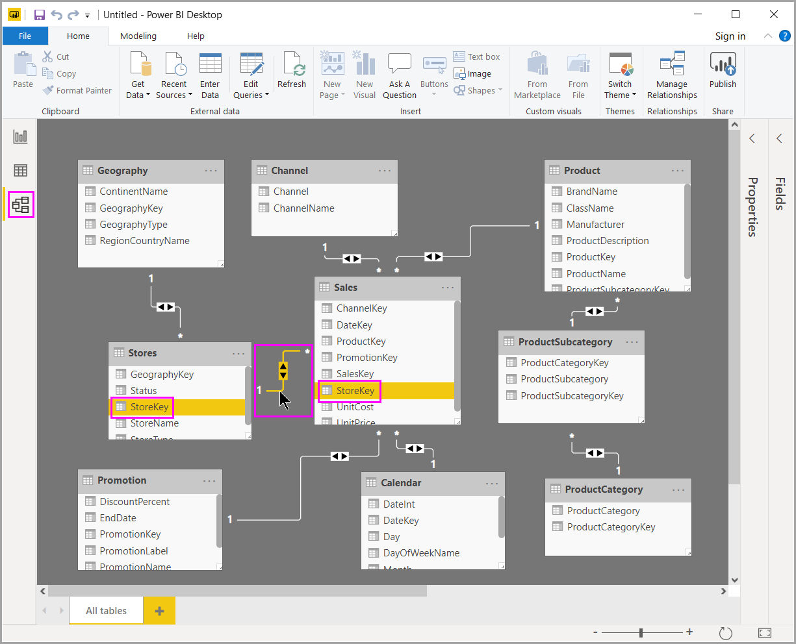

# ทำงานร่วมกับมุมมองแบบจำลองใน Power BI DesktopWork with Model view in Power BI Desktop

*มุมมองแบบจำลอง* แสดงตาราง คอลัมน์ และความสัมพันธ์ทั้งหมดในรูปแบบข้อมูลของคุณ*Model view* shows all of the tables, columns, and relationships in your model. ซึ่งจะเป็นประโยชน์โดยเฉพาะเมื่อรูปแบบของคุณมีความสัมพันธ์ระหว่างตารางต่าง ๆ ที่ซับซ้อนThis view can be especially helpful when your model has complex relationships between many tables.

เลือกไอคอน **แบบจำลอง** ที่อยู่ใกล้กับด้านข้างของหน้าต่างเพื่อดูมุมมองของแบบจำลองที่มีอยู่Select the **Model** icon near the side of the window to see a view of the existing model. วางเมาส์เคอร์เซอร์ของคุณเหนือเส้นความสัมพันธ์เพื่อแสดงคอลัมน์ที่ใช้Hover your cursor over a relationship line to show the columns that are used.

ในรูป คุณสามารถเห็นว่าตาราง *ร้านค้า* มีคอลัมน์ *StoreKey* ที่เกี่ยวข้องกับตาราง *ยอดขาย* ซึ่งมีคอลัมน์ *StoreKey* เช่นเดียวกันIn the figure, the *Stores* table has a *StoreKey* column that’s related to the *Sales* table, which also has a *StoreKey* column. ตารางทั้งสองมีความสัมพันธ์แบบ *กลุ่มต่อหนึ่ง* (\*: 1)The two tables have a *Many to One* (\*:1) relationship. ลูกศรที่กึ่งกลางเส้นแสดงทิศทางโฟลว์ของบริบทตัวกรองAn arrow in the middle of the line shows the direction of the filter context flow. ลูกศรคู่หมายความว่า ทิศทางตัวกรองแบบไขว้ ถูกตั้งค่าเป็น *ทั้งสอง*The double arrows mean the cross-filter direction is set to *Both*.

คุณสามารถดับเบิลคลิกที่ความสัมพันธ์เพื่อเปิดรายการในกล่องโต้ตอบ **แก้ไขความสัมพันธ์**You can double-click a relationship to open it in the **Edit Relationship** dialog box. เมื่อต้องการเรียนรู้เพิ่มเติมเกี่ยวกับความสัมพันธ์ ดู[สร้าง และจัดการความสัมพันธ์ใน Power BI Desktop](desktop-create-and-manage-relationships.md)To learn more about relationships, see [Create and manage relationships in Power BI Desktop](desktop-create-and-manage-relationships.md).
