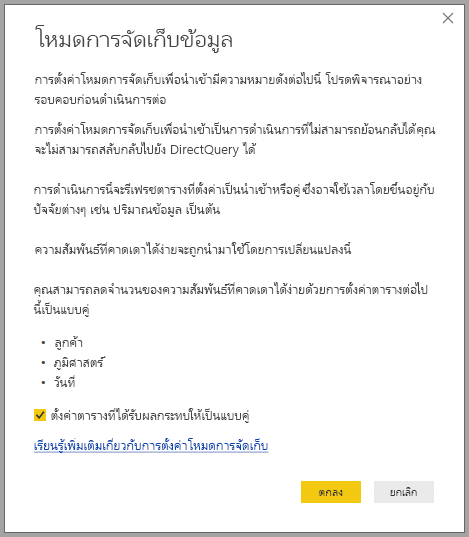

# จัดการโหมดที่เก็บข้อมูลใน Power BI DesktopManage storage mode in Power BI Desktop

ใน Microsoft Power BI Desktop คุณสามารถระบุโหมดที่เก็บข้อมูลของตารางได้In Microsoft Power BI Desktop, you can specify the storage mode of a table. โหมดเก็บข้อมูลจะทำให้คุณสามารถควบคุมว่า Power BI Desktop แคชข้อมูลตารางในหน่วยความจำสำหรับรายงานหรือไม่The storage mode lets you control whether Power BI Desktop caches table data in-memory for reports. 

การตั้งค่าโหมดที่เก็บข้อมูลเอื้อประโยชน์หลายอย่างSetting the storage mode provides many advantages. คุณสามารถตั้งค่าโหมดเก็บข้อมูลสำหรับตารางแต่ละรายการแยกต่างหากในโมเดลของคุณYou can set the storage mode for each table individually in your model. การดำเนินการนี้จะเปิดใช้งานชุดข้อมูลเดียวซึ่งมีประโยชน์ดังนี้:This action enables a single dataset, which provides the following benefits:

* **ประสิทธิภาพคิวรี**: เมื่อผู้ใช้โต้ตอบกับภาพในรายงาน Power BI คิวรี Data Analysis Expressions (DAX) จะถูกส่งไปยังชุดข้อมูล**Query performance**: As users interact with visuals in Power BI reports, Data Analysis Expressions (DAX) queries are submitted to the dataset. การแคชข้อมูลลงในหน่วยความจำด้วยการตั้งค่าโหมดที่เก็บข้อมูลอย่างเหมาะสมสามารถเพิ่มประสิทธิภาพคิวรีและการโต้ตอบของรายงานได้Caching data into memory by properly setting the storage mode can boost the query performance and interactivity of your reports.

* **ชุดข้อมูลขนาดใหญ่**: ตารางที่ไม่ได้ถูกแคชจะไม่ใช้หน่วยความจำสำหรับการแคช**Large datasets**: Tables that aren't cached don't consume memory for caching purposes. คุณสามารถเปิดใช้งานการวิเคราะห์แบบโต้ตอบผ่านชุดข้อมูลขนาดใหญ่ที่มีขนาดใหญ่หรือแพงเกินไปที่จะแคชลงในหน่วยความจำโดยสมบูรณ์You can enable interactive analysis over large datasets that are too large or expensive to completely cache into memory. คุณสามารถเลือกว่าตารางใดที่ควรแคชและตารางใดที่ไม่ควรYou can choose which tables are worth caching, and which aren't.

* **การปรับการรีเฟรชข้อมูลให้เหมาะสม**: คุณไม่จำเป็นต้องรีเฟรชตารางที่ไม่มีการแคช**Data refresh optimization**: You don't need to refresh tables that aren't cached. คุณสามารถลดระยะเวลาที่ใช้รีเฟรชได้โดยการแคชเฉพาะข้อมูลที่จำเป็นต่อการทำตามข้อกำหนดทางธุรกิจและข้อตกลงการบริการYou can reduce refresh times by caching only the data that's necessary to meet your service level agreements and your business requirements.

* **ข้อกำหนดแบบ Near Real Time**: ตารางที่มีข้อกำหนดแบบ Near Real Time อาจได้รับประโยชน์จากการไม่ถูกแคช เพื่อลดเวลาแฝงของข้อมูล**Near-real time requirements**: Tables with near-real time requirements might benefit from not being cached, to reduce data latency.

* **การเขียนกลับ**: การเขียนกลับ ช่วยให้ผู้ใช้ธุรกิจสามารถสำรวจสถานการณ์แบบ What-If ด้วยการเปลี่ยนแปลงค่าเซลล์**Writeback**: Writeback enables business users to explore what-if scenarios by changing cell values. แอปพลิเคชันแบบกำหนดเองสามารถทำการเปลี่ยนแปลงไปยังแหล่งข้อมูลได้Custom applications can apply changes to the data source. ตารางที่ไม่ได้ถูกแคชสามารถแสดงการเปลี่ยนแปลงได้ทันที ซึ่งช่วยให้ทำการวิเคราะห์ผลกระทบได้โดยฉับพลันTables that aren't cached can display changes immediately, which allows instant analysis of the effects.

การตั้งค่าโหมดที่เก็บข้อมูลใน Power BI Desktop คือหนึ่งในสามคุณลักษณะที่เกี่ยวข้อง:The storage mode setting in Power BI Desktop is one of three related features:

* **โมเดลแบบรวม**: อนุญาตให้รายงานมีการเชื่อมต่อข้อมูลตั้งแต่สองแบบขึ้นไป รวมถึงการเชื่อมต่อ DirectQuery หรือการนำเข้า ในรูปแบบใดๆ ก็ตาม**Composite models**: Allows a report to have two or more data connections, including DirectQuery connections or Import, in any combination. สำหรับข้อมูลเพิ่มเติม โปรดดูการ[ใช้โมเดลแบบรวมใน Power BI Desktop](desktop-composite-models.md)For more information, see [Use composite models in Power BI Desktop](desktop-composite-models.md).

* **ความสัมพันธ์แบบกลุ่มต่อกลุ่ม**: ด้วยโมเดลแบบรวม คุณสามารถตั้ง *ความสัมพันธ์ มาก-ไป-มาก* ระหว่างตาราง**Many-to-many relationships**: With composite models, you can establish *many-to-many relationships* between tables. ในความสัมพันธ์บบกลุ่มต่อกลุ่ม จะมีการลบคำขอสำหรับค่าที่ไม่ซ้ำกันในตารางIn a many-to-many relationship, requirements are removed for unique values in tables. นอกจากนี้ยังเอาการแก้ปัญหาชั่วคราวก่อนหน้าออกด้วย เช่น การเริ่มตารางใหม่เพื่อสร้างความสัมพันธ์เท่านั้นIt also removes prior workarounds, such as introducing new tables only to establish relationships. สำหรับข้อมูลเพิ่มเติม โปรดดู [ความสัมพันธ์แบบกลุ่ม-ต่อ-กลุ่มใน Power BI Desktop (ตัวอย่าง)](desktop-many-to-many-relationships.md)For more information, see [Many-to-many relationships in Power BI Desktop](desktop-many-to-many-relationships.md).

* **โหมดการจัดเก็บข้อมูล**: ด้วยโหมดการจัดเก็บข้อมูล ขณะนี้ คุณสามารถระบุวิชวลที่จำเป็นต้องมีคิวรีไปยังแหล่งข้อมูลส่วนหลัง**Storage mode**: With storage mode, you can now specify which visuals require a query to back-end data sources. วิชวลที่ไม่ต้องใช้คิวรีจะถูกนำเข้าแม้ว่าจะมาจาก DirectQueryVisuals that don't require a query are imported even if they're based on DirectQuery. คุณลักษณะนี้จะช่วยปรับปรุงประสิทธิภาพ และลดการโหลดระบบ Back-endThis feature helps improve performance and reduce back-end load. ก่อนหน้านี้ แม้กระทั่งวิชวลพื้นฐานอย่างตัวแบ่งส่วนข้อมูล ก็นำคิวรีที่ถูกส่งไปยังแหล่งระบบ Back-endPreviously, even simple visuals, such as slicers, initiated queries that were sent to back-end sources. 

## ใช้คุณสมบัติโหมดที่เก็บข้อมูลUse the Storage mode property

คุณสมบัติ **โหมดที่เก็บข้อมูล** เป็นคุณสมบัติที่คุณสามารถตั้งค่าบนแต่ละตารางในแบบจำลองของคุณและควบคุมวิธีที่ Power BI แคชข้อมูลตารางThe **Storage mode** property is a property that you can set on each table in your model and controls how Power BI caches the table data.

หากต้องการตั้งค่าคุณสมบัติ **โหมดที่เก็บข้อมูล** หรือดูการตั้งค่าปัจจุบัน:To set the **Storage mode** property, or view its current setting: 

1. ในมุมมอง **แบบจำลอง** เลือกตารางที่มีคุณสมบัติที่คุณต้องการดูหรือตั้งค่าin **Model** view, select the table whose properties you want to view or set. 
2. ในบานหน้าต่าง **คุณสมบัติ** ขยายส่วน **ขั้นสูง** และขยายรายการแบบหล่นลง **โหมดที่เก็บข้อมูล**In the **Properties** pane, expand the **Advanced** section, and expand the **Storage mode** drop-down.

   

คุณตั้งค่าคุณสมบัติ **โหมดที่เก็บข้อมูล** เป็นหนึ่งในค่าสามค่าต่อไปนี้:You set the **Storage mode** property to one of these three values:

* **นำเข้า**: ตารางนำเข้าที่มีการตั้งค่านี้ จะถูกแคช**Import**: Imported tables with this setting are cached. คิวรีที่ส่งไปยังชุดข้อมูล Power BI ที่ส่งกลับข้อมูลจากตารางนำเข้าสามารถเติมเต็มได้จากข้อมูลแคชเท่านั้นQueries submitted to the Power BI dataset that return data from Import tables can be fulfilled only from cached data.

* **DirectQuery**: ตารางที่มีการตั้งค่านี้ จะไม่ถูกแคช**DirectQuery**: Tables with this setting aren't cached. คิวรีที่ส่งไปยังชุดข้อมูล Power BI&mdash; เช่น คิวรี DAX&mdash; และที่แสดงข้อมูลจากตาราง DirectQuery สามารถเติมเต็มได้โดยการดำเนินการคิวรีตามคำขอไปยังแหล่งข้อมูลเท่านั้นQueries that you submit to the Power BI dataset&mdash;for example, DAX queries&mdash;and that return data from DirectQuery tables can be fulfilled only by executing on-demand queries to the data source. คิวรีที่ส่งไปยังแหล่งข้อมูลจะใช้ภาษาคิวรีสำหรับแหล่งข้อมูลนั้นๆ เช่น SQLQueries that you submit to the data source use the query language for that data source, for example, SQL.

* **คู่**: ตารางที่มีการตั้งค่านี้สามารถแคชหรือไม่แคชก็ได้ ขึ้นอยู่กับบริบทของคิวรีที่ส่งไปยังชุดข้อมูล Power BI**Dual**: Tables with this setting can act as either cached or not cached, depending on the context of the query that's submitted to the Power BI dataset. ในบางกรณี คุณเติมเต็มคิวรีจากข้อมูลที่ถูกแคชIn some cases, you fulfill queries from cached data. ในอีกกรณี คุณเติมเต็มคิวรีโดยการดำเนินการคิวรีตามคำขอไปยังแหล่งข้อมูลIn other cases, you fulfill queries by executing an on-demand query to the data source.

การเปลี่ยน **โหมดที่เก็บข้อมูล** ของตารางเป็น **นำเข้า** เป็นการดำเนินการ *ที่เรียกกลับไม่ได้*Changing the **Storage mode** of a table to **Import** is an *irreversible* operation. หลังจากตั้งค่าแล้ว คุณสมบัตินี้จะไม่สามารถเปลี่ยนกลับไปยังทั้ง **DirectQuery** หรือ **Dual** ได้Once set, this property can't later be changed to either **DirectQuery** or **Dual**.

> [!NOTE]
> คุณสามารถใช้โหมดที่เก็บข้อมูลแบบ **Dual** ในทั้ง Power BI Desktop และบริการของ Power BI ได้You can use **Dual** storage mode in both Power BI Desktop and the Power BI service.

## ข้อจำกัดใน DirectQuery และ ตารางคู่Constraints on DirectQuery and Dual tables

ตารางคู่มีข้อจำกัดเช่นเดียวกับตาราง DirectQueryDual tables have the same functional constraints as DirectQuery tables. ข้อจำกัดเหล่านี้ประกอบด้วย การจำกัดการเปลี่ยน M และการจำกัดฟังก์ชัน DAX ในคอลัมน์ที่มีการคำนวณThese constraints include limited M transformations and restricted DAX functions in calculated columns. สำหรับข้อมูลเพิ่มเติม โปรดดู [ส่วนเกี่ยวข้องของการใช้ DirectQuery](../connect-data/desktop-directquery-about.md#implications-of-using-directquery)For more information, see [Implications of using DirectQuery](../connect-data/desktop-directquery-about.md#implications-of-using-directquery).

## การเผยแพร่การตั้งค่าแบบ DualPropagation of the Dual setting
ลองพิจารณาโมเดลง่าย ๆ ต่อไปนี้ ซึ่งตารางทั้งหมดมาจากแหล่งที่มาเดียวที่รองรับ นำเข้า และ DirectQueryConsider the following simple model, where all the tables are from a single source that supports Import and DirectQuery.

สมมติว่าตารางทั้งหมดในโมเดลนี้ได้รับการตั้งค่าเป็น **DirectQuery**Let’s say all tables in this model are initially set to **DirectQuery**. หากแก้ไข **โหมดที่เก็บข้อมูล** ของตาราง **SurveyResponse** เป็น **นำเข้า** หน้าต่างคำเตือนต่อไปนี้จะแสดงขึ้นมา:If you then change the **Storage mode** of the **SurveyResponse** table to **Import**, the following warning window is displayed:

คุณสามารถตั้งค่าตารางมิติ (**ลูกค้า**, **ภูมิศาสตร์** และ **วันที่**) เป็น **Dual** เพื่อลดจำนวนความสัมพันธ์ที่จำกัดในชุดข้อมูล และปรับปรุงประสิทธิภาพการทำงานYou can set the dimension tables (**Customer**, **Geography**, and **Date**) to **Dual** to reduce the number of limited relationships in the dataset, and improve performance. โดยปกติแล้วความสัมพันธ์ที่จำกัดเกี่ยวข้องกับ DirectQuery อย่างน้อยหนึ่งตารางที่ตรรกะการเข้าร่วมไม่สามารถพุชไปยังระบบต้นทางได้Limited relationships normally involve at least one DirectQuery table where join logic can't be pushed to the source systems. เนื่องจากตารางแบบ Dual สามารถทำหน้าที่เป็น DirectQuery หรือตารางที่นำเข้าก็ได้ สถานการณ์นี้จะถูกหลีกเลี่ยงBecause Dual tables can act as either DirectQuery or Import tables, this situation is avoided.

ตรรกะการกระจายได้รับการออกแบบมาเพื่อช่วยเหลือในโมเดลที่มีหลายตารางThe propagation logic is designed to help with models that contain many tables. สมมติว่าคุณมีแบบจำลองที่มีตาราง 50 ตาราง และมีเพียงตารางข้อเท็จจริงบางอย่าง (เชิงทรานแซคชัน) ที่จำเป็นต้องแคชSuppose you have a model with 50 tables and only certain fact (transactional) tables need to be cached. ตรรกะใน Power BI Desktop จะคำนวณชุดมิติตารางอย่างน้อยที่สุดที่ต้องตั้งค่าเป็น **คู่** ให้ คุณจึงไม่ต้องตั้งค่าเองThe logic in Power BI Desktop calculates the minimum set of dimension tables that must be set to **Dual**, so you don’t have to.

ตรรกะการกระจายจะทำการสำรวจไปยังด้านเดียวของความสัมพันธ์แบบหนึ่งต่อกลุ่มเท่านั้นThe propagation logic traverses only to the one side of one-to-many relationships.

## ตัวอย่างการใช้งานโหมดที่เก็บข้อมูลStorage mode usage example
มาต่อกันที่ตัวอย่างจากส่วนก่อนหน้านี้ และสมมติว่าคุณใช้การตั้งค่าคุณสมบัติโหมดที่เก็บข้อมูล:Let's continue with the example from the previous section, and imagine applying the following storage mode property settings:

| ตารางTable                   | โหมดการจัดเก็บข้อมูลStorage mode         |
| ----------------------- |----------------------| 
| ยอดขายSales                 | DirectQueryDirectQuery          | 
| SurveyResponseSurveyResponse        | นำเข้าImport               | 
| วันที่Date                  | คู่Dual                 | 
| ลูกค้าCustomer              | คู่Dual                 | 
| ภูมิศาสตร์Geography             | คู่Dual                 | 

การตั้งค่าคุณสมบัติโหมดที่เก็บข้อมูลเหล่านี้ส่งผลต่อการทำงานต่อไปนี้ โดยสมมติว่าตาราง **การขาย** มีขนาดข้อมูลที่ใหญ่พอสมควร:Setting these storage mode properties results in the following behaviors, assuming that the **Sales** table has significant data volume:
* เนื่องจาก Power BI Desktop แคชตารางมิติ - **วันที่**, **ลูกค้า** และ **ภูมิศาสตร์** ดังนั้นเวลาโหลดของรายการแรกควรเร็วเมื่อเรียกแสดงค่า SlicerPower BI Desktop caches dimension tables, **Date**, **Customer**, and **Geography**, so load times of initial reports are fast when they retrieve slicer values to display.
* Power BI Desktop ไม่แคชตาราง **การขาย**Power BI Desktop doesn't cache the **Sales** table. เมื่อไม่แคชตารางนี้ Power BI Desktop จะแสดงผลลัพธ์ดังต่อไปนี้:By not caching this table, Power BI Desktop provides the following results:
    * จำนวนครั้งการรีเฟรชข้อมูลดีขึ้น และการใช้พื้นที่หน่วยความจำลดลงData-refresh times are improved, and memory consumption is reduced.
    * คิวรีรายงานที่ยึดตามตาราง **การขาย** ทำงานในโหมด **DirectQuery**Report queries that are based on the **Sales** table run in **DirectQuery** mode. คิวรีเหล่านี้อาจใช้เวลานานกว่า แต่ก็ใกล้เคียงกับเวลาจริงมากกว่าเนื่องจากไม่มีการเพิ่มความล่าช้าของข้อมูลThese queries might take longer but are closer to real time because no caching latency is introduced.

* คิวรีรายงานที่ยึดตามตาราง **SurveyResponse** ถูกส่งกลับจากแคชหน่วยความจำ ดังนั้นจึงค่อนข้างเร็วReport queries that are based on the **SurveyResponse** table are returned from the in-memory cache, and are therefore relatively fast.

## คิวรีที่ได้พบหรือไม่ได้พบแคชQueries that hit or miss the cache

หากคุณเชื่อมต่อ SQL Profiler กับช่องวินิจฉัยสำหรับ Power BI Desktop คุณจะสามารถเห็นคิวรีที่พบหรือไม่พบแคชหน่วยความจำโดยการแสดงร่องรอยตามเหตุการณ์ต่อไปนี้:If you connect SQL Profiler to the diagnostics port for Power BI Desktop, you can see which queries hit or miss the in-memory cache by performing a trace that's based on the following events:

* เหตุการณ์คิวรี\เริ่มต้นคิวรีQueries Events\Query Begin
* การประมวลผลคิวรี\เริ่มต้นคิวรี Vertipaq SEQuery Processing\Vertipaq SE Query Begin
* การประมวลผลคิวรี\เริ่มต้น DirectQueryQuery Processing\DirectQuery Begin

สำหรับแต่ละเหตุการณ์ *เริ่มต้นคิวรี* ให้ตรวจสอบเหตุการณ์อื่น ๆ ที่มี *ActivityID* เดียวกันFor each *Query Begin* event, check other events with the same *ActivityID*. ตัวอย่างเช่น หากไม่มีเหตุการณ์ *DirectQuery Begin* แต่มีเหตุการณ์ *Vertipaq SE Query Begin* คิวรีจะถูกตอบจากแคชFor example, if there isn't a *DirectQuery Begin* event, but there's a *Vertipaq SE Query Begin* event, the query is answered from the cache.

คิวรีที่อ้างอิงถึงตาราง Dual จะแสดงข้อมูลจากแคช หากเป็นไปได้ หรืออาจจะเปลี่ยนกลับไปยัง DirectQueryQueries that refer to Dual tables return data from the cache, if possible; otherwise, they revert to DirectQuery.

จากตัวอย่างก่อนหน้านี้ คิวรีต่อไปนี้อิงคอลัมน์จากตาราง **วันที่** ซึ่งอยู่ในโหมด **คู่** เท่านั้นContinuing the previous example, the following query refers only to a column from the **Date** table, which is in **Dual** mode. ดังนั้น คิวรีควรได้พบแคช:Therefore, the query should hit the cache:

คิวรีต่อไปนี้อ้างอิงเฉพาะคอลัมน์จากตาราง **การขาย** เท่านั้น ซึ่งอยู่ในโหมด **DirectQuery**The following query refers only to a column from the **Sales** table, which is in **DirectQuery** mode. ดังนั้น จึง *ไม่* ควรพบแคช:Therefore, it should *not* hit the cache:

คิวรีต่อไปนี้น่าสนใจเพราะรวมสองคอลัมน์ไว้ด้วยกันThe following query is interesting because it combines both columns. คิวนี้รีไม่ได้พบแคชThis query doesn't hit the cache. ในตอนแรกคุณอาจคาดหวังเรียกดูค่า **CalendarYear** จากแคชและค่า **SalesAmount** จากแหล่งที่มา และรวมผลลัพธ์ แต่วิธีการนี้มีประสิทธิภาพน้อยกว่าการส่งการดำเนินการ SUM/GROUP BY ไปยังระบบแหล่งที่มาYou might initially expect it to retrieve **CalendarYear** values from the cache and **SalesAmount** values from the source and then combine the results, but this approach is less efficient than submitting the SUM/GROUP BY operation to the source system. หากการดำเนินการถูกผลักลงไปที่แหล่งที่มา จำนวนแถวที่ส่งกลับมาจะน้อยกว่านี้มากIf the operation is pushed down to the source, the number of rows returned will likely be far less: 

> [!NOTE]
> การทำงานนี้ต่างจาก[ความสัมพันธ์แบบกลุ่ม-ต่อ-กลุ่ม](desktop-many-to-many-relationships.md)ใน Power BI Desktop เมื่อทำการรวมตารางที่ถูกแคชและไม่ได้ถูกแคชเข้าด้วยกันThis behavior is different from [many-to-many relationships](desktop-many-to-many-relationships.md) in Power BI Desktop when cached and non-cached tables are combined.

## แคชควรจะซิงค์อยู่เสมอCaches should be kept in sync

คิวรีที่แสดงในส่วนก่อนหน้า จะแสดงตาราง Dual ที่ในบางครั้งจะพบแคชและในบางครั้ง ไม่พบThe queries displayed in the previous section show that Dual tables sometimes hit the cache and sometimes don't. ดังนั้น หากแคชหมดอายุ ค่าที่แตกต่างออกไปสามารถถูกส่งกลับได้As a result, if the cache is out of date, different values can be returned. การดำเนินการคิวรีจะไม่ซ่อนปัญหาของข้อมูลโดยวิธีอย่างเช่นการกรองผลลัพธ์ DirectQuery ให้ตรงกับค่าที่ถูกแคชQuery execution won't attempt to mask data issues by, for example, filtering DirectQuery results to match cached values. เป็นหน้าที่ของคุณที่จะทราบทิศทางของข้อมูล และคุณควรออกแบบให้สอดคล้องกันIt's your responsibility to know your data flows, and you should design accordingly. มีเทคนิคที่ใช้กันในการจัดการกับกรณีเช่นนั้นที่แหล่งที่มา หากจำเป็นThere are established techniques to handle such cases at the source, if necessary.

โหมดที่เก็บข้อมูล **คู่** เป็นการปรับประสิทธิภาพให้เหมาะสมThe **Dual** storage mode is a performance optimization. จึงควรใช้ในทางที่จะไม่เกิดอันตรายต่อความสามารถตามคำขอเชิงธุรกิจเท่านั้นIt should be used only in ways that don't compromise the ability to meet business requirements. สำหรับการทำงานทางเลือก ลองพิจารณาใช้เทคนิคที่อธิบายใน [ความสัมพันธ์แบบกลุ่ม-ต่อ-กลุ่มใน Power BI Desktop](desktop-many-to-many-relationships.md)For alternative behavior, consider using the techniques described in the [Many-to-many relationships in Power BI Desktop](desktop-many-to-many-relationships.md).

## มุมมองข้อมูลData view
หากตารางอย่างน้อยหนึ่งตารางในชุดข้อมูลมีโหมดที่เก็บข้อมูลตั้งค่าเป็น **นำเข้า** หรือ **คู่** แท็บมุมมอง **ข้อมูล** จะแสดงขึ้นมาIf at least one table in the dataset has its storage mode set to either **Import** or **Dual**, the **Data** view tab is displayable.

เมื่อคุณเลือกตารางแบบคู่และนำเข้าในมุมมอง **ข้อมูล** ตารางจะแสดงข้อมูลที่แคชWhen you select Dual and Import tables in **Data** view, they show cached data. ตาราง DirectQuery จะไม่แสดงข้อมูล และข้อความจะแสดงขึ้นว่า ไม่สามารถแสดงตาราง DirectQuery ได้DirectQuery tables don't show data, and a message is displayed that states that DirectQuery tables can't be shown.

## ข้อจำกัดและข้อควรพิจารณาLimitations and considerations

มีข้อจำกัดเล็กน้อยสำหรับการเผยแพร่โหมดที่เก็บข้อมูลและสหสัมพันธ์กับโมเดลแบบรวมThere are a few limitations for this release of storage mode and its correlation with composite models.

แหล่งการเชื่อมต่อของ Live Connect ดังต่อไปนี้ (ขนาดที่หลากหลาย) ไม่สามารถใช้กับโมเดลแบบรวม:The following live connection (multi-dimensional) sources can't be used with composite models:

* SAP HANASAP HANA
* SAP Business WarehouseSAP Business Warehouse
* SQL Server Analysis ServicesSQL Server Analysis Services
* ชุดข้อมูล Power BIPower BI datasets
* Azure Analysis ServicesAzure Analysis Services

เมื่อทำการเชื่อมต่อกับแหล่งที่มาหลายขนาดเหล่านี้โดยใช้ DirectQuery คุณจะไม่สามารถเชื่อมต่อกับแหล่งที่มา DirectQuery อีกแห่งหรือรวมเข้ากับข้อมูลที่นำเข้าได้When you connect to those multi-dimensional sources by using DirectQuery, you can't connect to another DirectQuery source or combine it with imported data.

ข้อจำกัดของการใช้ DirectQuery ที่มีจะยังคงมีผลเมื่อคุณใช้โมเดลแบบรวมThe existing limitations of using DirectQuery still apply when you use composite models. โดยข้อจำกัดมากมายมีผลขึ้นอยู่กับแต่ละตาราง ซึ่งขึ้นอยู่กับโหมดที่เก็บข้อมูลของตารางนั้นๆMany of those limitations are now per table, depending upon the storage mode of the table. ตัวอย่างเช่น คอลัมน์ที่ได้รับการคำนวณบนตารางที่นำเข้าสามารถอ้างอิงไปยังตารางอื่น แต่ตารางที่ได้รับการคำนวณบนตาราง DirectQuery จะยังคงถูกจำกัดให้อ้างอิงไปยังคอลัมน์บนตารางเดียวกันเท่านั้นFor example, a calculated column on an imported table can refer to other tables, but a calculated column on a DirectQuery table is still restricted to refer only to columns on the same table. ข้อจำกัดอื่น ๆ มีผลกับโมเดลทั้งหมด หากมีตารางใดภายในโมเดลที่เป็น DirectQueryOther limitations apply to the model as a whole, if any of the tables within the model are DirectQuery. ตัวอย่างเช่น คุณลักษณะ QuickInsights และ Q&A จะไม่สามารถใช้งานได้บนโมเดลหากมีตารางใดภายในโมเดลมีโหมดที่เก็บข้อมูลของ DirectQueryFor example, the QuickInsights and Q&A features aren't available on a model if any of the tables within it has a storage mode of DirectQuery. 

## ขั้นตอนถัดไปNext steps

สำหรับข้อมูลเพิ่มเติมเกี่ยวกับโมเดลแบบรวมและ DirectQuery โปรดดูบทความต่อไปนี้:For more information about composite models and DirectQuery, see the following articles:
* [โมเดลแบบรวมใน Power BI DesktopComposite models in Power BI Desktop](desktop-composite-models.md)
* [ความสัมพันธ์แบบกลุ่มต่อกลุ่มใน Power BI DesktopMany-to-many relationships in Power BI Desktop](desktop-many-to-many-relationships.md)
* [ใช้ DirectQuery ใน Power BIUse DirectQuery in Power BI](../connect-data/desktop-directquery-about.md)
* [แหล่งข้อมูลที่ได้รับการรองรับโดย DirectQuery ใน Power BIData sources supported by DirectQuery in Power BI](../connect-data/power-bi-data-sources.md)
