# บทช่วยสอน: สร้างคอลัมน์จากการคำนวณใน Power BI DesktopTutorial: Create calculated columns in Power BI Desktop

ในบางครั้ง ข้อมูลที่คุณกำลังวิเคราะห์อยู่นั้นไม่มีเขตข้อมูลที่จำเป็นเพื่อให้ได้ผลลัพธ์ที่คุณต้องการSometimes the data you’re analyzing doesn’t contain a particular field you need to get the results you’re after. นี่คือที่มาของ *คอลัมน์จากการคำนวณ*This is where *calculated columns* come in. คอลัมน์จากการคำนวณใช้สูตร Data Analysis Expressions (DAX) เพื่อกำหนดค่าของคอลัมน์ ตั้งแต่การรวมค่าข้อความจากสองคอลัมน์เข้าด้วยกัน จนถึงการคำนวณค่าตัวเลขจากค่าอื่น ๆCalculated columns use Data Analysis Expressions (DAX) formulas to define a column’s values, anything from putting together text values from a couple of different columns to calculating a numeric value from other values. ตัวอย่างเช่น สมมติว่า ข้อมูลของคุณมีเขตข้อมูล **เมือง** และ **รัฐ** แต่คุณต้องการเขตข้อมูล **ตำแหน่งที่ตั้ง** เดียวที่มีทั้งสองอย่าง เช่น "Miami, FL" (เมืองไมอามี รัฐฟลอริดา)For example, let’s say your data has **City** and **State** fields, but you want a single **Location** field that has both, like "Miami, FL". นี่คือสิ่งที่เราใช้คอลัมน์จากการคำนวณThis is precisely what calculated columns are for.

คอลัมน์จากการคำนวณจะคล้ายกับ[หน่วยวัด](desktop-tutorial-create-measures.md) ที่ทั้งสองมาจากสูตร DAX แต่แตกต่างกันตรงที่วิธีใช้Calculated columns are similar to [measures](desktop-tutorial-create-measures.md) in that both are based on DAX formulas, but they differ in how they are used. คุณมักจะใช้หน่วยวัดเป็น **ค่า** ในการแสดงภาพ เพื่อคำนวณผลลัพธ์ตามเขตข้อมูลอื่น ๆYou often use measures in a visualization's **Values** area, to calculate results based on other fields. คุณใช้คอลัมน์จากการคำนวณเป็น **เขตข้อมูล** ใหม่ในแถว, แกน, คำอธิบายแผนภูมิ และการจัดกลุ่มของการแสดงภาพYou use calculated columns as new **Fields** in the rows, axes, legends, and group areas of visualizations.

บทช่วยสอนนี้จะแนะนำให้คุณทำความเข้าใจและสร้างคอลัมน์จากการคำนวณ และใช้ในการแสดงภาพรายงานใน Power BI DesktopThis tutorial will guide you through understanding and creating some calculated columns and using them in report visualizations in Power BI Desktop.

## ข้อกำหนดเบื้องต้นPrerequisites

- บทเรียนนี้มีไว้สำหรับผู้ใช้ Power BI ที่คุณคุ้นเคยกับการใช้ Power BI Desktop เพื่อสร้างแบบจำลองที่ขั้นสูงขึ้นThis tutorial is intended for Power BI users already familiar with using Power BI Desktop to create more advanced models. คุณควรจะทราบวิธีใช้การรับข้อมูล และตัวแก้ไข Power Query เพื่อนำเข้าข้อมูล ทำงานกับตารางที่เกี่ยวข้องหลายตาราง และเพิ่มเขตข้อมูลไปยังพื้นที่ของรายงานแล้วYou should already know how to use Get Data and the Power Query Editor to import data, work with multiple related tables, and add fields to the Report canvas. ถ้าคุณยังไม่คุ้นเคยกับ Power BI Desktop ให้ตรวจดู[เริ่มต้นใช้งาน Power BI Desktop](../fundamentals/desktop-getting-started.md)If you’re new to Power BI Desktop, be sure to check out [Getting Started with Power BI Desktop](../fundamentals/desktop-getting-started.md).
  
- บทช่วยสอนนี้ใช้[ตัวอย่างการขาย Contoso สำหรับ Power BI Desktop](https://download.microsoft.com/download/4/6/A/46AB5E74-50F6-4761-8EDB-5AE077FD603C/Contoso%20Sales%20Sample%20for%20Power%20BI%20Desktop.zip) ซึ่งเป็นตัวอย่างเดียวกับที่ใช้ในบทช่วยสอน[สร้างหน่วยวัดของคุณเองใน Power BI Desktop](desktop-tutorial-create-measures.md)The tutorial uses the [Contoso Sales Sample for Power BI Desktop](https://download.microsoft.com/download/4/6/A/46AB5E74-50F6-4761-8EDB-5AE077FD603C/Contoso%20Sales%20Sample%20for%20Power%20BI%20Desktop.zip), the same sample used for the [Create your own measures in Power BI Desktop](desktop-tutorial-create-measures.md) tutorial. ข้อมูลยอดขายจากบริษัทที่สมมุติขึ้นที่ชื่อ Contoso, Inc. ถูกนำเข้าจากฐานข้อมูล ดังนั้นคุณจะไม่สามารถเชื่อมต่อกับแหล่งข้อมูล หรือดูในตัวแก้ไข Power Query ได้This sales data from the fictitious company Contoso, Inc. was imported from a database, so you won’t be able to connect to the data source or view it in the Power Query Editor. ดาวน์โหลด และแยกไฟล์บนคอมพิวเตอร์ของคุณ จากนั้นเปิดใน Power BI DesktopDownload and extract the file on your own computer, and then open it in Power BI Desktop.

## สร้างคอลัมน์จากการคำนวณ ด้วยค่าจากตารางที่เกี่ยวข้องCreate a calculated column with values from related tables

ในรายงานการขายของคุณ คุณต้องการแสดงประเภทและประเภทย่อยของผลิตภัณฑ์เป็นค่าเดียว เช่น "Cell phones – Accessories", "Cell phones – Smartphones & PDAs" เป็นต้นIn your Sales Report, you want to display product categories and subcategories as single values, like "Cell phones – Accessories", "Cell phones – Smartphones & PDAs", and so on. ไม่มีเขตข้อมูลในรายการ **เขตข้อมูล** ที่ให้ข้อมูลนั้นแก่คุณ แต่มีเขตข้อมูล **ProductCategory** และ **ProductSubcategory** ในตารางของตัวเองThere's no field in the **Fields** list that gives you that data, but there is a **ProductCategory** field and a **ProductSubcategory** field, each in its own table. คุณสามารถสร้างคอลัมน์จากการคำนวณที่รวมค่าจากสองคอลัมน์นี้You can create a calculated column that combines values from these two columns. สูตร DAX สามารถใช้ประโยชน์จากรูปแบบที่คุณมี รวมถึงความสัมพันธ์ระหว่างตารางต่าง ๆ ที่มีอยู่แล้วอย่างเต็มที่DAX formulas can leverage the full power of the model you already have, including relationships between different tables that already exist.

 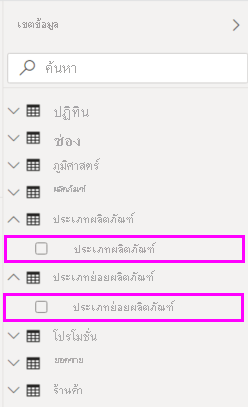

1. เพื่อสร้างคอลัมน์ใหม่ของคุณในตาราง **ProductSubcategory** คลิกขวาหรือเลือกจุดไข่ปลา **...** ที่อยู่ถัดจาก **ProductSubcategory** ในบานหน้าต่าง **เขตข้อมูล** และเลือก **คอลัมน์ใหม่** จากเมนูTo create your new column in the **ProductSubcategory** table, right-click or select the ellipsis **...** next to **ProductSubcategory** in the **Fields** pane, and select **New column** from the menu.

   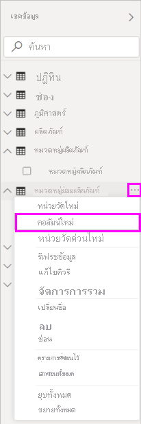

   เมื่อคุณเลือก **คอลัมน์ใหม่** **แถบสูตร** จะปรากฏที่ด้านบนของพื้นที่ทำงาน รายงาน ซึ่งพร้อมจะให้คุณตั้งชื่อคอลัมน์ของคุณ และป้อนสูตร DAXWhen you select **New column**, the **Formula bar** appears along the top of the Report canvas, ready for you to name your column and enter a DAX formula.

   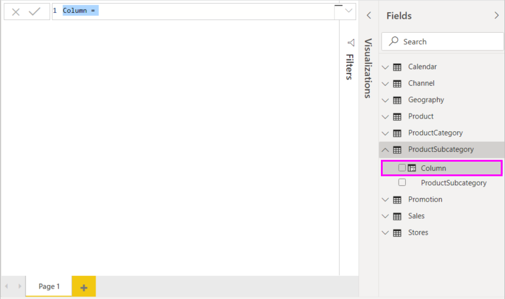

2. โดยค่าเริ่มต้น คอลัมน์ที่คำนวณใหม่จะมีชื่อว่า **คอลัมน์**By default, a new calculated column is named **Column**. หากคุณไม่เปลี่ยนชื่อ คอลัมน์ใหม่เพิ่มเติมจะชื่อว่า **คอลัมน์ 2**, **คอลัมน์ 3** และอื่น ๆIf you don’t rename it, additional new columns will be named **Column 2**, **Column 3**, and so on. คุณต้องการให้คอลัมน์ของคุณสื่อความหมายมากขึ้น ดังนั้น ในเมื่อชื่อ **คอลัมน์** ถูกไฮไลต์อยู่แล้วในแถบสูตร ให้เปลี่ยนชื่อโดยพิมพ์ **ProductFullCategory** จากนั้น พิมพ์เครื่องหมายเท่ากับ ( **=** )You want your column to be more identifiable, so while the **Column** name is already highlighted in the formula bar, rename it by typing **ProductFullCategory**, and then type an equals (**=**) sign.

3. คุณต้องการให้ค่าต่าง ๆ ในคอลัมน์ใหม่ของคุณเริ่มด้วยชื่อในเขตข้อมูล **ProductCategory**You want the values in your new column to start with the name in the **ProductCategory** field. เนื่องจากคอลัมน์นี้อยู่ในคนละตารางแต่เกี่ยวข้องกัน คุณสามารถใช้ฟังก์ชัน [RELATED](/dax/related-function-dax) เพื่อช่วยให้คุณรับคอลัมน์มาBecause this column is in a different but related table, you can use the [RELATED](/dax/related-function-dax) function to help you get it.

   หลังจากเครื่องหมายเท่ากับ พิมพ์ **r**After the equals sign, type **r**. รายการคำแนะนำแบบดรอปดาวน์แสดงทุกฟังก์ชัน DAX ที่ขึ้นต้น ด้วยตัวอักษร R การเลือกแต่ละฟังก์ชันจะแสดงคำอธิบายผลของฟังก์ชันนั้นA dropdown suggestion list shows all of the DAX functions beginning with the letter R. Selecting each function shows a description of its effect. เมื่อคุณพิมพ์ รายการคำแนะนำจะขยับเข้าใกล้ฟังก์ชันคุณที่ต้องการมากขึ้นAs you type, the suggestion list scales closer to the function you need. เลือก **RELATED** แล้วกด **Enter**Select **RELATED**, and then press **Enter**.

   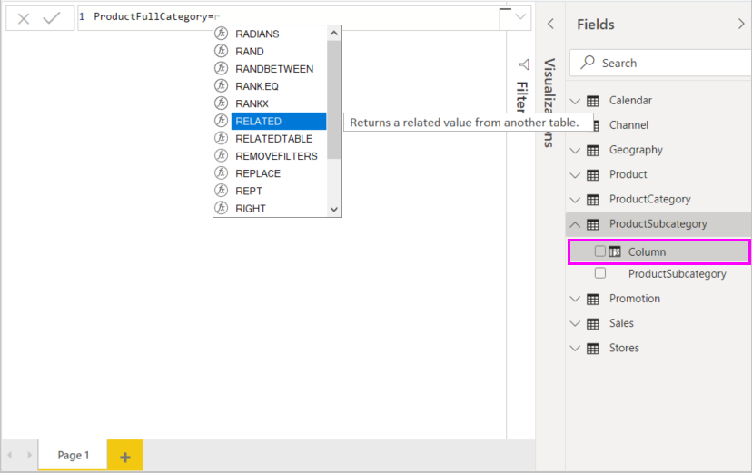

   วงเล็บเปิดจะปรากฏขึ้น พร้อมกับรายการแนะนำคอลัมน์ที่เกี่ยวข้อง ที่คุณสามารถส่งต่อไปยังฟังก์ชัน RELATED พร้อมคำอธิบาย และรายละเอียดของพารามิเตอร์ที่ต้องการAn opening parenthesis appears, along with another suggestion list of the related columns you can pass to the RELATED function, with descriptions and details of expected parameters.

   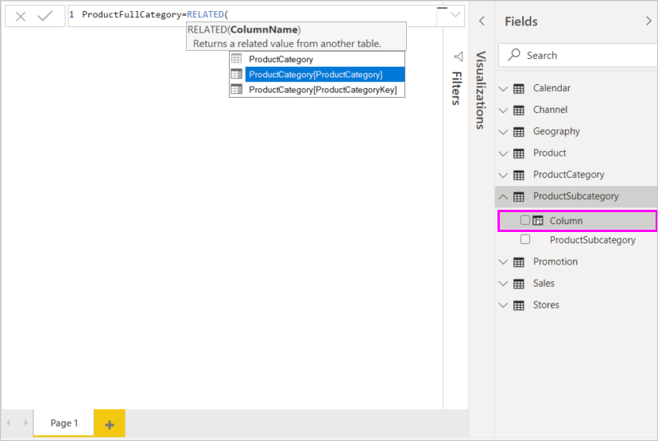

4. คุณต้องการคอลัมน์ **ProductCategory** จากตาราง **ProductCategory**You want the **ProductCategory** column from the **ProductCategory** table. เลือก **ProductCategory[ProductCategory]** กด **Enter** แล้วพิมพ์วงเล็บปิดSelect **ProductCategory[ProductCategory]**, press **Enter**, and then type a closing parenthesis.

    > [!TIP]
    > ข้อผิดพลาดทางไวยากรณ์ มักเกิดจากวงเล็บปิดหายไป หรือวางผิดตำแหน่ง แม้ว่าบางครั้ง Power BI Desktop จะเพิ่มวงเล็บปิดให้คุณSyntax errors are most often caused by a missing or misplaced closing parenthesis, although sometimes Power BI Desktop will add it for you.

5. คุณต้องเป็นเส้นประและช่องว่าง เพื่อแยก **ProductCategories** และ **ProductSubcategories** ในค่าใหม่ ดังนั้น หลังจากวงเล็บปิดของนิพจน์แรก พิมพ์ช่องว่าง, เครื่องหมายและ ( **&** ), อัญประกาศ ( **"** ), ช่องว่าง, เส้นประ ( **-** ), ช่องว่างอีกช่อง, อัญประกาศอีกตัว และเครื่องหมายและอีกตัวYou want dashes and spaces to separate the **ProductCategories** and **ProductSubcategories** in the new values, so after the closing parenthesis of the first expression, type a space, ampersand (**&**), double-quote (**"**), space, dash (**-**), another space, another double-quote, and another ampersand. ในตอนนี้สูตรของคุณควรมีลักษณะดังนี้:Your formula should now look like this:

    `ProductFullCategory = RELATED(ProductCategory[ProductCategory]) & " - " &`

    > [!TIP]
    > ถ้าคุณต้องการพื้นที่เพิ่มเติม เลือกเครื่องลูกศรลงทางด้านขวาของแถบสูตรเพื่อขยายตัวแก้ไขสูตรIf you need more room, select the down chevron on the right side of the formula bar to expand the formula editor. ในตัวแก้ไข กด **Alt + Enter** เพื่อย้ายลงหนึ่งบรรทัด และ **แท็บ** เพื่อเคลื่อนย้ายออกไปIn the editor, press **Alt + Enter** to move down a line, and **Tab** to move things over.

6. ใส่วงเล็บก้ามปูเปิด ( **[** ) แล้วเลือกคอลัมน์ **[ProductSubcategory]** เพื่อจบสูตรEnter an opening bracket (**[**), and then select the **[ProductSubcategory]** column to finish the formula. 

    

    คุณไม่จำเป็นต้องใช้ฟังก์ชัน RELATED เพื่อเรียกใช้ตาราง **ProductSubcategory** ในนิพจน์ที่สอง เนื่องจากคุณกำลังสร้างคอลัมน์จากการคำนวณในตารางนี้You didn’t need to use another RELATED function to call the **ProductSubcategory** table in the second expression, because you are creating the calculated column in this table. คุณสามารถใสj **[ProductSubcategory]** โดยมีคำนำหน้าเป็นชื่อตาราง (ชื่อแบบเต็ม) หรือไม่มี (แบบย่อ) ได้You can enter **[ProductSubcategory]** with the table name prefix (fully-qualified) or without (non-qualified).

7. จบการใส่สูตร โดยการกด **Enter** หรือเลือกเครื่องหมายถูกในแถบสูตรComplete the formula by pressing **Enter** or selecting the checkmark in the formula bar. สูตรจะถูกตรวจสอบ และชื่อคอลัมน์ **ProductFullCategory** จะปรากฏในตาราง **ProductSubcategory** ในบานหน้าต่าง **เขตข้อมูล**The formula validates, and the **ProductFullCategory** column name appears in the **ProductSubcategory** table in the **Fields** pane.

   

    >[!NOTE]
    >ใน Power BI Desktop คอลัมน์จากการคำนวณได้ไอคอนพิเศษในบานหน้าต่าง **เขตข้อมูล** แสดงว่าคอลัมน์ดังกล่าวประกอบด้วยสูตรIn Power BI Desktop, calculated columns have a special icon in the **Fields** pane, showing that they contain formulas. ในบริการของ Power BI (ไซต์ Power BI ของคุณ) ไม่มีวิธีเปลี่ยนแปลงสูตร ดังนั้นคอลัมน์จากการคำนวณจะไม่มีไอคอนIn the Power BI service (your Power BI site), there’s no way to change formulas, so calculated columns don't have icons.

## ใช้คอลัมน์ใหม่ของคุณในรายงานUse your new column in a report

ตอนนี้ คุณสามารถใช้คอลัมน์ **ProductFullCategory** ใหม่ของคุณเพื่อดู **SalesAmount** ตาม **ProductFullCategory**Now you can use your new **ProductFullCategory** column to look at **SalesAmount** by **ProductFullCategory**.

1. เลือกหรือลากคอลัมน์ **ProductFullCategory** จากตาราง **ProductSubcategory** ลงบนพื้นที่ทำงาน รายงาน เพื่อสร้างตารางที่แสดงชื่อ **ProductFullCategory** ทั้งหมดSelect or drag the **ProductFullCategory** column from the **ProductSubcategory** table onto the Report canvas to create a table showing all of the **ProductFullCategory** names.

   

2. เลือกหรือลากเขตข้อมูล **SalesAmount** จากตาราง **ยอดขาย** ลงในตารางเพื่อแสดง **SalesAmount** สำหรับแต่ละ **ProductFullCategory**Select or drag the **SalesAmount** field from the **Sales** table into the table to show the **SalesAmount** for each **ProductFullCategory**.

   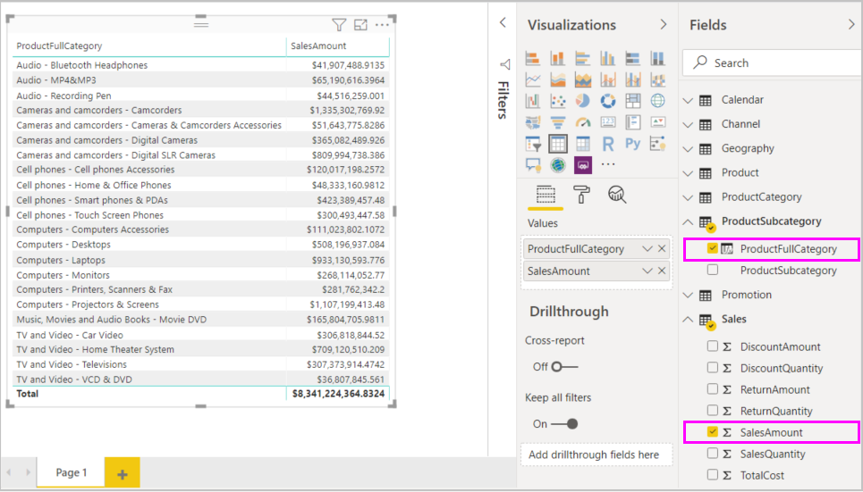

## สร้างคอลัมน์จากการคำนวณที่ใช้ฟังก์ชัน IFCreate a calculated column that uses an IF function

ตัวอย่างการขายของ Contoso ประกอบด้วยข้อมูลยอดขายสำหรับร้านค้าที่ยังเปิดดำเนินงานอยู่ และที่ปิดไปแล้วThe Contoso Sales Sample contains sales data for both active and inactive stores. คุณต้องการให้แน่ใจว่า ยอดขายของร้านค้าที่ยังเปิดอยู่ แยกจากยอดขายของรัานที่ปิดไปแล้วอย่างชัดเจนในรายงานของคุณ โดยการสร้างเขตข้อมูลที่ชื่อ **Active StoreName**You want to ensure that active store sales are clearly separated from inactive store sales in your report by creating an **Active StoreName** field. ในคอลัมน์ที่คำนวณ **StoreName ที่เปิด** ใหม่ ร้านค้าที่เปิดอยู่จะปรากฏเป็นชื่อเต็มของร้าน ในขณะที่ยอดขายสำหรับร้านที่ปิดแล้วจะถูกจัดกลุ่มเข้าด้วยกันในหนึ่งหน่วยข้อมูลบรรทัดที่ชื่อว่า **ปิดแล้ว**In the new **Active StoreName** calculated column, each active store will appear with the store's full name, while the sales for inactive stores will be grouped together in one line item called **Inactive**.

โชคดีที่ตาราง **ร้านค้า** มีคอลัมน์ที่ชื่อว่า **สถานะ** ที่มีค่า "On" สำหรับร้านค้าที่ยังเปิดอยู่และ "Off" สำหรับร้านค้าที่ปิดไปแล้ว ซึ่งเราสามารถใช้เพื่อสร้างค่าสำหรับคอลัมน์ **StoreName ที่เปิด** ใหม่ของเราFortunately, the **Stores** table has a column named **Status**, with values of "On" for active stores and "Off" for inactive stores, which we can use to create values for our new **Active StoreName** column. สูตร DAX ของคุณจะใช้ฟังก์ชันตรรกะ [IF](/dax/if-function-dax) เพื่อทดสอบ **สถานะ** ของแต่ละร้านค้า และแสดงค่าใดค่าหนึ่งขึ้นอยู่กับผลลัพธ์Your DAX formula will use the logical [IF](/dax/if-function-dax) function to test each store's **Status** and return a particular value depending on the result. ถ้า **สถานะ** ของร้านค้าคือ "On" สูตรจะแสดงผลลัพธ์เป็นชื่อของร้านค้าIf a store's **Status** is "On", the formula will return the store's name. แต่ถ้าเป็น "Off" สูตรจะกำหนดค่า **StoreName ที่เปิดอยู่** เป็น "Inactive"If it’s "Off", the formula will assign an **Active StoreName** of "Inactive".

1. สร้างคอลัมน์จากการคำนวณใหม่ในตาราง **Stores** และตั้งชื่อเป็น **Active StoreName** ในแถบสูตรCreate a new calculated column in the **Stores** table and name it **Active StoreName** in the formula bar.

2. หลังจากเครื่องหมาย **=** เริ่มพิมพ์ **IF**After the **=** sign, begin typing **IF**. รายการคำแนะนำจะแสดงสิ่งที่คุณสามารถเพิ่มThe suggestion list will show what you can add. เลือก **IF**Select **IF**.

    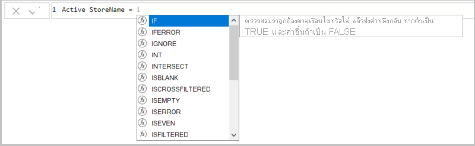

3. อาร์กิวเมนต์แรกสำหรับ **IF** เป็นการทดสอบตรรกะว่า **สถานะ** ของร้านค้าเป็น "On" หรือไม่The first argument for **IF** is a logical test of whether a store's **Status** is "On". พิมพ์วงเล็บก้ามปูเปิด **[** ซึ่งจะแสดงรายการคอลัมน์จากตาราง **ร้านค้า** และเลือก **[Status]**Type an opening bracket **[**, which lists columns from the **Stores** table, and select **[Status]**.

    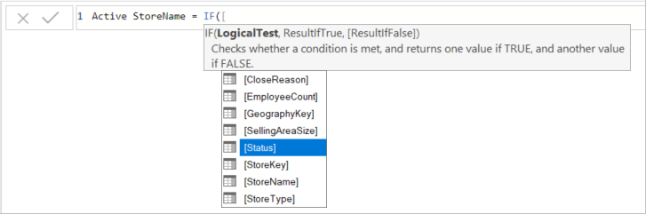

4. ต่อท้ายทันทีหลังจาก **[Status]** พิมพ์ **="On"** แล้วพิมพ์เครื่องหมายจุลภาค ( **,** ) เพื่อจบอาร์กิวเมนต์Right after **[Status]**, type **="On"**, and then type a comma (**,**) to end the argument. คำแนะนำเครื่องมือแนะนำว่า คุณต้องเพิ่มค่าที่จะส่งกลับเมื่อผลลัพธ์เป็น TRUEThe tooltip suggests that you now need to add a value to return when the result is TRUE.

    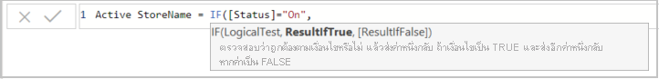

5. ถ้าสถานะของร้านค้าคือ "On" คุณต้องการแสดงชื่อของร้านค้าIf the store's status is "On", you want to show the store’s name. พิมพ์วงเล็บก้ามปูเปิด ( **[** ) และเลือกคอลัมน์ **[StoreName]** แล้วพิมพ์เครื่องหมายจุลภาคอีกตัวType an opening bracket (**[**) and select the **[StoreName]** column, and then type another comma. คำแนะนำในขณะนี้บอกว่า คุณต้องเพิ่มค่าที่จะส่งกลับเมื่อผลลัพธ์จะเป็น FALSEThe tooltip now indicates that you need to add a value to return when the result is FALSE.

    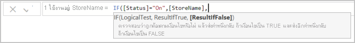

6. คุณต้องการให้ค่าเป็น "Inactive" ดังนั้น ให้พิมพ์ **“Inactive”** แล้วจบสูตรโดยการกด **Enter** หรือเลือกเครื่องหมายถูกในแถบสูตรYou want the value to be "Inactive", so type **"Inactive"**, and then complete the formula by pressing **Enter** or selecting the checkmark in the formula bar. สูตรจะถูกตรวจสอบ และชื่อของคอลัมน์ใหม่จะปรากฏขึ้นในตาราง **ร้านค้า** ในบานหน้าต่าง **เขตข้อมูล**The formula validates, and the new column's name appears in the **Stores** table in the **Fields** pane.

    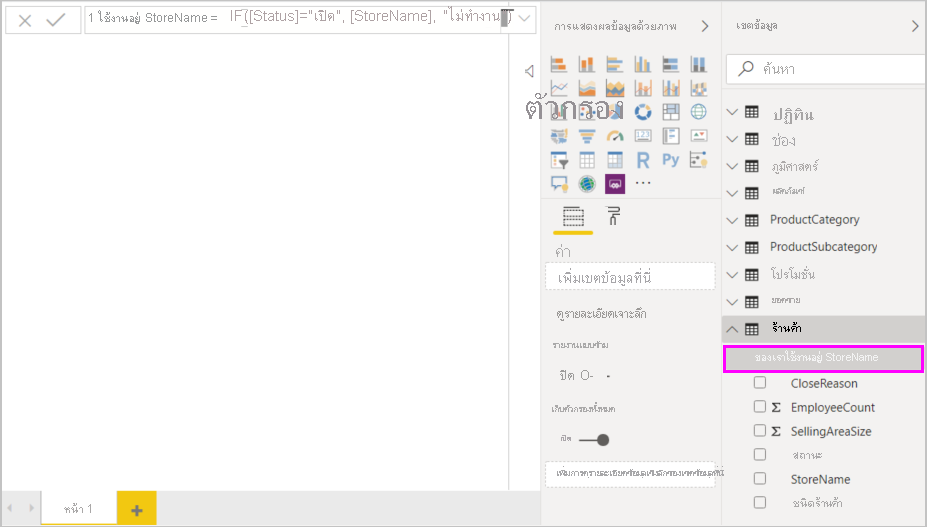

7. คุณสามารถใช้คอลัมน์ **StoreName ที่เปิดอยู่** ในการแสดงผลด้วยภาพ เช่นเดียวกันเขตข้อมูลอื่นใดYou can use your new **Active StoreName** column in visualizations just like any other field. เมื่อต้องการแสดง **SalesAmounts** ตาม **Active StoreName** เลือกเขตข้อมูล **StoreName ที่เปิดอยู่** หรือลากไปยังพื้นที่ทำงาน รายงาน จากนั้นเลือกเขตข้อมูล **SalesAmount** หรือลากไปยังตารางTo show **SalesAmounts** by **Active StoreName**, select the **Active StoreName** field or drag it onto the Report canvas, and then select the **SalesAmount** field or drag it into the table. ในตารางนี้ ร้านค้าที่ยังเปิดอยู่ปรากฏขึ้นทีละร้านตามชื่อ แต่ร้านค้าที่ไม่ได้เปิดแล้วจะถูกจัดกลุ่มเข้าด้วยกันที่ส่วนท้าย เป็นชื่อ **Inactive**In this table, active stores appear individually by name, but inactive stores are grouped together at the end as **Inactive**.

    

## สิ่งที่คุณได้เรียนรู้What you've learned

คอลัมน์จากการคำนวณสามารถเสริมข้อมูลให้กับคุณ และให้ข้อมูลเชิงลึกได้ง่ายขึ้นCalculated columns can enrich your data and provide easier insights. คุณได้เรียนรู้วิธีการสร้างคอลัมน์จากการคำนวณในบานหน้าต่าง **เขตข้อมูล** และแถบสูตร ใช้รายการคำแนะนำ และคำแนะนำเครื่องมือเพื่อช่วยในการสร้างสูตรของคุณ เรียกใช้ฟังก์ชัน DAX เช่น RELATED และ IF ด้วยอาร์กิวเมนต์ที่เหมาะสม และใช้คอลัมน์จากการคำนวณของคุณในการแสดงภาพในรายงานYou've learned how to create calculated columns in the **Fields** pane and formula bar, use suggestion lists and tooltips to help construct your formulas, call DAX functions like RELATED and IF with the appropriate arguments, and use your calculated columns in report visualizations.

## ขั้นตอนถัดไปNext steps

ถ้าคุณต้องการใช้การเจาะลึกลงในสูตร DAX และสร้างคอลัมน์จากการคำนวณด้วยสูตรขั้นสูงขึ้น ดู[พื้นฐาน DAX ใน Power BI Desktop](desktop-quickstart-learn-dax-basics.md)If you want to take a deeper dive into DAX formulas and create calculated columns with more advanced formulas, see [DAX Basics in Power BI Desktop](desktop-quickstart-learn-dax-basics.md). บทความนี้มุ่งเน้นแนวคิดพื้นฐานใน DAX เช่น ไวยากรณ์ ฟังก์ชัน และการทำความเข้าใจบริบทโดยละเอียดThis article focuses on fundamental concepts in DAX, such as syntax, functions, and a more thorough understanding of context.

โปรดให้แน่ใจว่าได้เพิ่ม[ข้ออ้างอิง Data Analysis Expressions (DAX)](/dax/)ไปยังรายการโปรดของคุณBe sure to add the [Data Analysis Expressions (DAX) Reference](/dax/) to your favorites. นี่คือที่ที่คุณจะพบข้อมูลเกี่ยวกับ ไวยากรณ์ ตัวดำเนินการ และฟังก์ชัน DAX มากกว่า 200 ฟังก์ชันโดยละเอียดThis is where you'll find detailed info on DAX syntax, operators, and over 200 DAX functions.
