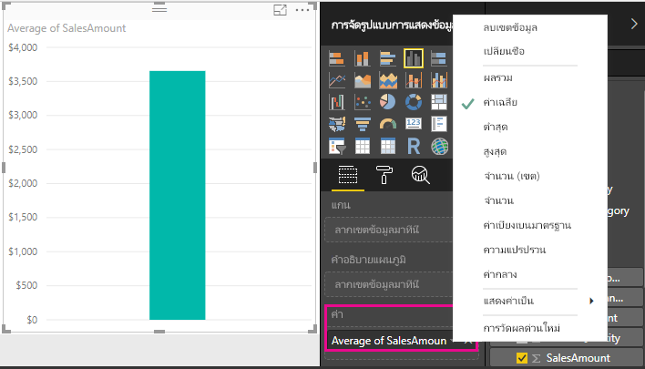
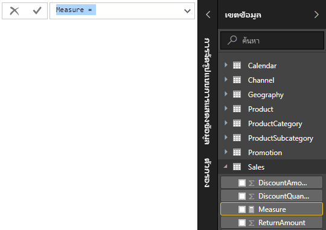
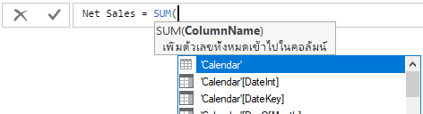
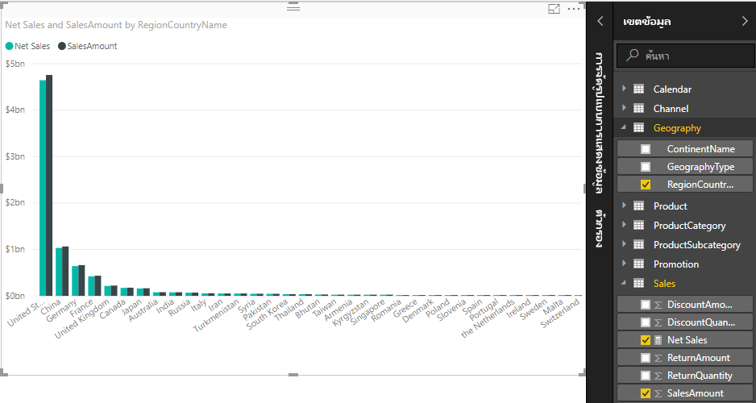
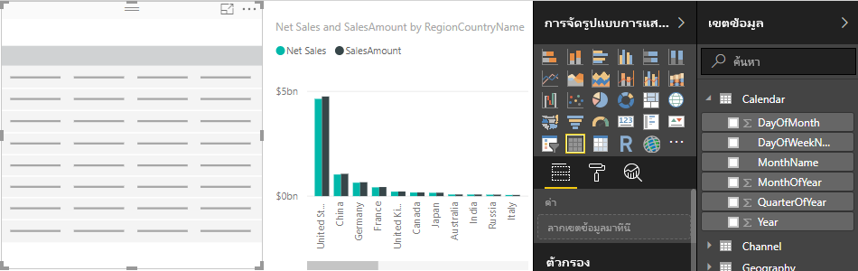
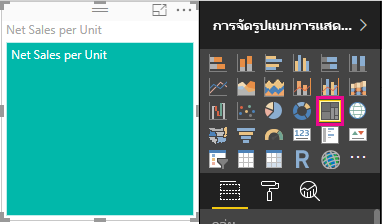
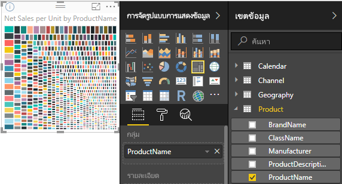

# บทช่วยสอน: สร้างหน่วยวัดของคุณเองใน Power BI DesktopTutorial: Create your own measures in Power BI Desktop
คุณสามารถสร้างโซลูชันของการวิเคราะห์ข้อมูลมีประสิทธิภาพที่สุดบางอย่างใน Power BI Desktop โดยใช้หน่วยวัดBy using measures, you can create some of the most powerful data analysis solutions in Power BI Desktop. หน่วยวัดที่ช่วยคุณด้วยการคำนวนบนข้อมูลของคุณ ตามที่คุณโต้ตอบกับรายงานของคุณMeasures help you by performing calculations on your data as you interact with your reports. บทเรียนนี้จะแนะนำคุณโดยผ่านการทำความเข้าใจเกี่ยวกับหน่วยวัด และสร้างหน่วยวัดพื้นฐานของคุณเองใน Power BI DesktopThis tutorial will guide you through understanding measures and creating your own basic measures in Power BI Desktop.

## ข้อกำหนดเบื้องต้นPrerequisites

- บทเรียนนี้มีไว้สำหรับผู้ใช้ Power BI ที่คุณคุ้นเคยกับการใช้ Power BI Desktop เพื่อสร้างแบบจำลองที่ขั้นสูงขึ้นThis tutorial is intended for Power BI users already familiar with using Power BI Desktop to create more advanced models. คุณควรจะคุ้นเคยกับการใช้ Get Data และตัวแก้ไขคิวรีเพื่อนำเข้าข้อมูล ทำงานกับหลายตารางที่เกี่ยวข้อง และเพิ่มเขตข้อมูลไปยังพื้นที่รายงานYou should already be familiar with using Get Data and Query Editor to import data, work with multiple related tables, and add fields to the report canvas. ถ้าคุณยังไม่คุ้นเคยกับ Power BI Desktop ให้ตรวจดู[เริ่มต้นใช้งาน Power BI Desktop](../fundamentals/desktop-getting-started.md)If you’re new to Power BI Desktop, be sure to check out [Getting Started with Power BI Desktop](../fundamentals/desktop-getting-started.md).
  
- บทช่วยสอนนี้ใช้ไฟล์[ตัวอย่างยอดขายของ Contoso สำหรับ Power BI Desktop](https://download.microsoft.com/download/4/6/A/46AB5E74-50F6-4761-8EDB-5AE077FD603C/Contoso%20Sales%20Sample%20for%20Power%20BI%20Desktop.zip) ซึ่งรวมถึงข้อมูลยอดขายออนไลน์จากบริษัทจำลอง ContosoThis tutorial uses the [Contoso Sales Sample for Power BI Desktop](https://download.microsoft.com/download/4/6/A/46AB5E74-50F6-4761-8EDB-5AE077FD603C/Contoso%20Sales%20Sample%20for%20Power%20BI%20Desktop.zip) file, which includes online sales data from the fictitious company, Contoso. เนื่องจากข้อมูลนี้นำเข้ามาจากฐานข้อมูล ดังนั้นคุณจึงไม่สามารถเชื่อมต่อกับแหล่งข้อมูลหรือดูในตัวแก้ไขคิวรีได้Because this data is imported from a database, you can't connect to the datasource or view it in Query Editor. ดาวน์โหลดและแยกไฟล์บนคอมพิวเตอร์ของคุณDownload and extract the file on your computer.

## หน่วยวัดอัตโนมัติAutomatic measures

เมื่อ Power BI Desktop สร้างหน่วยวัด หน่วยวัดมักจะถูกสร้างขึ้นสำหรับคุณโดยอัตโนมัติWhen Power BI Desktop creates a measure, it's most often created for you automatically. เมื่อต้องการดูวิธีการที่ Power BI Desktop สร้างหน่วยวัด ให้ทำตามขั้นตอนเหล่านี้:To see how Power BI Desktop creates a measure, follow these steps:

1. ในPower BI Desktop ให้เลือก **ไฟล์** > **เปิด**, เรียกดูไฟล์ *ตัวอย่างยอดขายของ Contoso สำหรับ Power BI Desktop.pbix* จากนั้นเลือก **เปิด**In Power BI Desktop, select **File** > **Open**, browse to the *Contoso Sales Sample for Power BI Desktop.pbix* file, and then select **Open**.

2. ในบานหน้าต่าง **เขตข้อมูล** ขยายตาราง **ยอดขาย**In the **Fields** pane, expand the **Sales** table. จากนั้นเลือกกล่องกาเครื่องหมายที่อยู่ถัดจากเขตข้อมูล **SalesAmount** หรือลาก **SalesAmount** ลงบนพื้นที่รายงานThen, either select the check box next to the **SalesAmount** field or drag **SalesAmount** onto the report canvas.

    การสร้างภาพแผนภูมิคอลัมน์ใหม่จะปรากฏขึ้นโดยแสดงผลรวมของค่าทั้งหมดในคอลัมน์ **SalesAmount** ของตาราง **ยอดขาย**A new column chart visualization appears, showing the sum total of all values in the **SalesAmount** column of the **Sales** table.

    

เขตข้อมูล (คอลัมน์) ใน **เขตข้อมูล** บานหน้าต่างที่มีไอคอน sigma  และสามารถรวมค่าได้Any field (column) in the **Fields** pane with a sigma icon  is numeric, and its values can be aggregated. Power BI Desktop จะสร้างและคำนวณหน่วยวัดเพื่อรวมข้อมูลโดยอัตโนมัติหากตรวจพบชนิดข้อมูลที่เป็นตัวเลข แทนการแสดงตารางที่มีค่าจำนวนมาก (สองล้านแถวสำหรับ **SalesAmount**)Rather than display a table with many values (two million rows for **SalesAmount**), Power BI Desktop automatically creates and calculates a measure to aggregate the data if it detects a numeric datatype. ผลรวมคือ การรวมค่าแบบเริ่มต้นสำหรับชนิดข้อมูลที่เป็นตัวเลข แต่คุณสามารถใช้การรวมข้อมูลอื่นๆเช่นหาค่าเฉลี่ยหรือการนับค่าได้อย่างง่ายดายSum is the default aggregation for a numeric datatype, but you can easily apply different aggregations like average or count. การทำความเข้าใจเกี่ยวกับรวมข้อมูลเป็นพื้นฐานเพื่อทำความเข้าใจเกี่ยวกับมาตรการวัด เนื่องจากหน่วยวัดทุกตัวมีการทำการรวมข้อมูลชนิดใดชนิดหนึ่งUnderstanding aggregations is fundamental to understanding measures, because every measure performs some type of aggregation. 

เมื่อต้องการเปลี่ยนการรวมแผนภูมิ ให้ทำตามขั้นตอนเหล่านี้:To change the chart aggregation, follow these steps:

1. เลือกการแสดงภาพ **SalesAmount** ในพื้นที่รายงานSelect the **SalesAmount** visualization in the report canvas.  

1. ในพื้นที่ **ค่า** ของบานหน้าต่าง **การสร้างภาพ** เลือกลูกศรลงทางด้านขวาของ **SalesAmount**In the **Value** area of the **Visualizations** pane, select the down arrow to the right of **SalesAmount**. 

1. จากเมนูที่ปรากฏขึ้น เลือก **ค่าเฉลี่ย**From the menu that appears, select **Average**. 

    การแสดงภาพจะเปลี่ยนเป็นค่าเฉลี่ยของยอดขายทั้งหมดในเขตข้อมูล **SalesAmount**The visualization changes to an average of all sales values in the **SalesAmount** field.

    

คุณสามารถเปลี่ยนชนิดของการรวมได้โดยขึ้นอยู่กับผลลัพธ์ที่คุณต้องการDepending on the result you want, you can change the type of aggregation. อย่างไรก็ตาม การรวมไม่ได้มีผลกับประเภทข้อมูลที่เป็นตัวเลขทุกประเภทHowever, not all types of aggregation apply to every numeric datatype. ตัวอย่างเช่น สำหรับเขตข้อมูล **SalesAmount** ผลรวม และค่าเฉลี่ยจะมีประโยชน์ รวมถึงค่าต่ำสุดและสูงสุดจะมีตำแหน่งของตนเช่นกันFor example, for the **SalesAmount** field, Sum and Average are useful, and Minimum and Maximum have their place as well. อย่างไรก็ตาม การนับไม่เหมาะสมกับเขตข้อมูล **SalesAmount** เนื่องจากในขณะที่ค่าเป็นตัวเลข แต่ที่จริงมันเป็นสกุลเงินHowever, Count doesn't make sense for the **SalesAmount** field, because while its values are numeric, they’re really currency.

ค่าที่คำนวณจากการเปลี่ยนแปลงตัววัดได้ตอบสนองต่อการโต้ตอบกับรายงานของคุณValues calculated from measures change in response to your interactions with your report. ตัวอย่างเช่น ถ้าคุณลากเขตข้อมูล **RegionCountryName** จากตาราง **ภูมิศาสตร์** ไปยังแผนภูมิ **SalesAmount** ของคุณที่มีอยู่ การดำเนินการนี้จะมีการเปลี่ยนแปลงเพื่อแสดงยอดขายเฉลี่ยสำหรับแต่ละประเทศFor example, if you drag the **RegionCountryName** field from the **Geography** table onto your existing **SalesAmount** chart, it changes to show the average sales amounts for each country.

เมื่อผลลัพธ์ของหน่วยวัดมีการเปลี่ยนแปลงเนื่องจากการโต้ตอบกับรายงานของคุณ *บริบท* ของหน่วยวัดจะได้รับผลกระทบWhen the result of a measure changes because of an interaction with your report, you've affected your measure’s *context*. ทุกครั้งที่คุณโต้ตอบกับด้วยการแสดงภาพของคุณรายงาน คุณกำลังเปลี่ยนแปลงบริบท ซึ่งหน่วยวัดถูกคำนวณและแสดงผลลัพธ์Every time you interact with your report visualizations, you're changing the context in which a measure calculates and displays its results.

## สร้าง และใช้หน่วยวัดของคุณเองCreate and use your own measures

ในกรณีส่วนใหญ่ Power BI Desktop จะคำนวณและแสดงค่าโดยอัตโนมัติตามชนิดของเขตข้อมูลและการรวมที่คุณเลือกIn most cases, Power BI Desktop automatically calculates and returns values according to the types of fields and aggregations you choose. อย่างไรก็ตาม ในบางกรณีคุณอาจต้องการสร้างหน่วยวัดของคุณเองเพื่อทำการคำนวณที่ซับซ้อนและไม่ซ้ำกันHowever, in some cases you might want to create your own measures to perform more complex, unique calculations. กับ คุณสามารถสร้างหน่วยวัดของคุณด้วยภาษาสูตร Data Analysis Expressions (DAX) ด้วย Power BI DesktopWith Power BI Desktop, you can create your own measures with the Data Analysis Expressions (DAX) formula language. 

สูตร DAX ใช้ฟังก์ชัน ตัวดำเนินการ และไวยากรณ์เดียวกับสูตร Excel เป็นจำนวนมากDAX formulas use many of the same functions, operators, and syntax as Excel formulas. อย่างไรก็ตาม ฟังก์ชัน DAX ถูกออกแบบมาให้ทำงานกับข้อมูลแบบสัมพันธ์ และทำการคำนวณแบบไดนามิกมากกว่าที่คุณโต้ตอบกับรายงานHowever, DAX functions are designed to work with relational data and perform more dynamic calculations as you interact with your reports. มีฟังก์ชัน DAX มากกว่า 200 ตัว ที่ทำทุกอย่างตั้งแต่การรวมข้อมูลอย่างง่าย เช่น ผลรวมและค่าเฉลี่ย ไปยังฟังก์ชันทางสถิติ และการกรองที่ซับซ้อนมากขึ้นThere are over 200 DAX functions that do everything from simple aggregations like sum and average to more complex statistical and filtering functions. มีแหล่งข้อมูลมากมายเพื่อช่วยให้คุณเรียนรู้เพิ่มเติมเกี่ยวกับ DAXThere are many resources to help you learn more about DAX. หลังจากที่คุณเสร็จสิ้นบทช่วยสอนนี้ ดู[พื้นฐาน DAX ใน Power BI Desktop](desktop-quickstart-learn-dax-basics.md)After you've finished this tutorial, see [DAX basics in Power BI Desktop](desktop-quickstart-learn-dax-basics.md).

เมื่อคุณสร้างหน่วยวัดของคุณเอง การดำเนินการนี้จะเรียกว่าหน่วยวัดของ *แบบจำลอง* และจะถูกเพิ่มลงในรายการ **เขตข้อมูล** สำหรับตารางที่คุณเลือกWhen you create your own measure, it's called a *model* measure, and it's added to the **Fields** list for the table you select. ข้อดีบางประการของหน่วยวัดแบบจำลอง ซึ่งจะให้คุณสามารถตั้งชื่อตามที่คุณต้องการได้ ทำให้สามารถระบุตัวได้ง่ายขึ้น คุณสามารถใช้เป็นอาร์กิวเมนต์ในนิพจน์ DAX อื่น ๆ และคุณสามารถดำเนินการคำนวณที่ซับซ้อนได้อย่างรวดเร็วSome advantages of model measures are that you can name them whatever you want, making them more identifiable; you can use them as arguments in other DAX expressions; and you can make them perform complex calculations quickly.

### การวัดผลด่วนQuick measures

นับตั้งแต่ Power BI Desktop รุ่นเดือนกุมภาพันธ์ 2018 คุณสามารถใช้การคำนวณทั่วไปหลายแบบเช่น *ตัววัดแบบด่วน* ซึ่งเขียนสูตร DAX ให้คุณ โดยยึดตามข้อมูลที่คุณป้อนเข้าในหน้าต่างStarting with the February 2018 release of Power BI Desktop, many common calculations are available as *quick measures*, which write the DAX formulas for you based on your inputs in a window. คำนวณที่รวดเร็วและมีประสิทธิภาพเหล่านี้เหมาะสำหรับการเรียนรู้ DAX หรือเริ่มหน่วยวัดแบบกำหนดเองของคุณเองThese quick, powerful calculations are also great for learning DAX or seeding your own customized measures. 

สร้างการวัดผลด่วนโดยใช้วิธีใดวิธีหนึ่งต่อไปนี้:Create a quick measure using one of these methods: 
 - จากตารางในบานหน้าต่าง **เขตข้อมูล** ให้คลิกขวาหรือเลือกตัวเลือก **เพิ่มเติม** ( **...** ), จากนั้นเลือก **การวัดผลด่วนใหม่** จากรายการFrom a table in the **Fields** pane, right-click or select **More options** (**...**), and then select **New quick measure** from the list.

 - ภายใต้ **การคำนวณ** ในแท็บ **Home** ของริบบอน Power BI Desktop ให้เลือก **การวัดผลด่วนใหม่**Under **Calculations** in the **Home** tab of the Power BI Desktop ribbon, select **New Quick Measure**.

สำหรับข้อมูลเพิ่มเติมเกี่ยวกับการสร้างและการใช้การวัดผลด่วน ให้ดู [ใช้การวัดผลด่วน](desktop-quick-measures.md)For more information about creating and using quick measures, see [Use quick measures](desktop-quick-measures.md).

### สร้างการวัดCreate a measure

สมมติว่าคุณต้องการวิเคราะห์ยอดขายสุทธิของคุณโดยลบส่วนลดและผลลัพธ์จากยอดขายรวมSuppose you want to analyze your net sales by subtracting discounts and returns from total sales amounts. สำหรับบริบทที่มีอยู่ในการแสดงภาพของคุณ คุณจำเป็นต้องมีหน่วยวัดที่ลบผลรวมของ DiscountAmount และ ReturnAmount จากผลรวมของ SalesAmountFor the context that exists in your visualization, you need a measure that subtracts the sum of DiscountAmount and ReturnAmount from the sum of SalesAmount. ไม่มีเขตข้อมูลสำหรับยอดขายสุทธิในรายการ **เขตข้อมูล** แต่คุณต้องมีบล็อกการสร้างเพื่อสร้างหน่วยวัดของคุณเองในการคำนวณยอดขายสุทธิThere's no field for Net Sales in the **Fields** list, but you have the building blocks to create your own measure to calculate net sales. 

แล้วทำตามขั้นตอนเหล่านี้เพื่อสร้างหน่วยวัด:To create a measure, follow these steps:

1. ในบานหน้าต่าง **เขตข้อมูล** ให้คลิกขวาที่ตาราง **ยอดขาย** หรือวางเมาส์เหนือตารางและเลือก **ตัวเลือกเพิ่มเติม** ( **...** )In the **Fields** pane, right-click the **Sales** table, or hover over the table and select **More options** (**...**). 

1. จากเมนูที่ปรากฏขึ้น เลือก **หน่วยวัดใหม่**From the menu that appears, select **New measure**. 

    การดำเนินการนี้จะเป็นการบันทึกหน่วยวัดใหม่ของคุณในตาราง **ยอดขาย** ซึ่งเป็นเรื่องง่ายที่จะค้นหาThis action saves your new measure in the **Sales** table, where it's easy to find.
    
    
    
    คุณยังสามารถสร้างหน่วยวัดใหม่ได้โดยการเลือก **หน่วยวัดใหม่** ในกลุ่ม **การคำนวณ** บนแท็บ **Home** ของริบบอน Power BI DesktopYou can also create a new measure by selecting **New Measure** in the **Calculations** group on the **Home** tab of the Power BI Desktop ribbon.
    
    
    
    >[!TIP]
    >เมื่อคุณสร้างหน่วยวัดจากริบบอน คุณสามารถสร้างขึ้นในตารางใดก็ได้ แต่จะง่ายต่อการค้นหาถ้าคุณสร้างในที่ที่คุณวางแผนจะใช้When you create a measure from the ribbon, you can create it in any of your tables, but it's easier to find if you create it where you plan to use it. ในกรณีนี้ เลือกตาราง **ยอดขาย** ก่อนเพื่อเปิดใช้งาน จากนั้นเลือก **หน่วยวัดใหม่**In this case, select the **Sales** table first to make it active, and then select **New measure**. 
    
    แถบสูตรจะปรากฏขึ้นตามแนวด้านบนของพื้นที่รายงาน ตำแหน่งที่คุณสามารถเปลี่ยนชื่อหน่วยวัดของคุณ และใส่สูตร DAXThe formula bar appears along the top of the report canvas, where you can rename your measure and enter a DAX formula.
    
    
    
1. ตามค่าเริ่มต้น หน่วยวัดใหม่แต่ละหน่วยจะมีชื่อว่า *Measure*By default, each new measure is named *Measure*. ถ้าคุณไม่ได้เปลี่ยนชื่อ หน่วยวัดใหม่เพิ่มเติมจะมีชื่อว่า *Measure 2*, *Measure 3* และอื่นๆIf you don’t rename it, additional new measures are named *Measure 2*, *Measure 3*, and so on. เนื่องจากเราต้องการให้หน่วยวัดนี้สามารถระบุได้มากขึ้น ให้ไฮไลท์ *Measure* ในแถบสูตรแล้วเปลี่ยนเป็น *ยอดขายสุทธิ*Because we want this measure to be more identifiable, highlight *Measure* in the formula bar, and then change it to *Net Sales*.
    
1. เริ่มต้นการใส่สูตรของคุณBegin entering your formula. หลังจากเครื่องหมายเท่ากัน เริ่มพิมพ์ *Sum*After the equals sign, start to type *Sum*. ขณะที่คุณพิมพ์ รายการคำแนะนำแบบดรอปดาวน์จะปรากฏขึ้น ซึ่งแสดงฟังก์ชัน DAX ทั้งหมดที่ขึ้นต้นด้วยตัวอักษรที่คุณพิมพ์As you type, a drop-down suggestion list appears, showing all the DAX functions, beginning with the letters you type. เลื่อนลง ถ้าจำเป็น หากต้องการเลือก **SUM** จากรายการ จากนั้นกด **Enter**Scroll down, if necessary, to select **SUM** from the list, and then press **Enter**.
    
    
    
    วงเล็บเปิดจะปรากฏขึ้น พร้อมกับรายการแนะนำแบบดรอปดาวน์สำหรับคอลัมน์พร้อมใช้งานที่คุณสามารถส่งไปยังฟังก์ชัน SUMAn opening parenthesis appears, along with a drop-down suggestion list of the available columns you can pass to the SUM function.
    
    
    
1. นิพจน์ปรากฏตลอดเวลาระหว่างวงเล็บปิดและวงเล็บปิดExpressions always appear between opening and closing parentheses. ตัวอย่างเช่น นิพจน์ของคุณจะประกอบด้วยอาร์กิวเมนต์เดียว เพื่อส่งผ่านไปยังฟังก์ชัน SUM ของคอลัมน์ **SalesAmount**For this example, your expression contains a single argument to pass to the SUM function: the **SalesAmount** column. เริ่มพิมพ์ *SalesAmount* จนกว่า **Sales(SalesAmount)** จะเป็นค่าเดียวที่เหลืออยู่ในรายการBegin typing *SalesAmount* until **Sales(SalesAmount)** is the only value left in the list. 

    ชื่อคอลัมน์ที่นำหน้าด้วยชื่อตารางจะถือว่าเป็นชื่อที่ตรงตามหลักเกณฑ์ของคอลัมน์The column name preceded by the table name is called the fully qualified name of the column. ชื่อคอลัมน์ที่ตรงตามหลักเกณฑ์ทำให้สูตรของคุณอ่านง่ายขึ้นFully qualified column names make your formulas easier to read.
    
    
    
1. เลือก **Sales[SalesAmount]** จากรายการ จากนั้นใส่วงเล็บปิดSelect **Sales[SalesAmount]** from the list, and then enter a closing parenthesis.
    
    > [!TIP]
    > ข้อผิดพลาดทางไวยากรณ์มักเกิดขึ้นจากวงเล็บปิดที่วางผิดตำแหน่ง หรือขาดหายไปSyntax errors are most often caused by a missing or misplaced closing parenthesis.
    
    
    
1. ลบสองคอลัมน์อื่นภายในสูตร:Subtract the other two columns inside the formula:

    a.a. หลังจากวงเล็บปิดในนิพจน์แรก พิมพ์ช่องว่าง ตัวดำเนินการลบ (-) และช่องว่างอีกช่องAfter the closing parenthesis for the first expression, type a space, a minus operator (-), and then another space. 

    b.b. ใส่ฟังก์ชัน SUM อีกอัน และเริ่มพิมพ์ *DiscountAmount* จนกว่าคุณสามารถเลือกคอลัมน์ **Sales[DiscountAmount]** เป็นอาร์กิวเมนต์Enter another SUM function, and start typing *DiscountAmount* until you can choose the **Sales[DiscountAmount]** column as the argument. เพิ่มวงเล็บปิดAdd a closing parenthesis. 

    c.c. พิมพ์ช่องว่าง ตัวดำเนินการลบ ช่องว่าง ฟังก์ชัน SUM อีกฟังก์ชัน พร้อมกับ **Sales[ReturnAmount]** เป็นอาร์กิวเมนต์ และวงเล็บปิดType a space, a minus operator, a space, another SUM function with **Sales[ReturnAmount]** as the argument, and then a closing parenthesis.
    
    
    
1. กด **Enter** หรือเลือก **ยืนยัน** (ไอคอนเครื่องหมายถูก) ในแถบสูตรเพื่อทำให้เสร็จสมบูรณ์และตรวจสอบความถูกต้องสูตรPress **Enter** or select **Commit** (checkmark icon) in the formula bar to complete and validate the formula. 

    ขณะนี้หน่วยวัด **ยอดขายสุทธิ** ที่ตรวจสอบความถูกต้องแล้วพร้อมใช้งานในตาราง **ยอดขาย** ในบานหน้าต่าง **เขตข้อมูล**The validated **Net Sales** measure is now ready to use in the **Sales** table in the **Fields** pane.
    
    
    
1. ถ้าคุณมีพื้นที่ไม่พอสำหรับการใส่สูตรหรือต้องการในบรรทัดที่แยกต่างหาก ให้เลือกลูกศรลงทางด้านขวาของแถบสูตรเพื่อให้มีช่องว่างมากขึ้นIf you run out of room for entering a formula or want it on separate lines, select the down arrow on the right side of the formula bar to provide more space. 

    ลูกศรลงจะเปลี่ยนเป็นลูกศรขึ้นและกล่องขนาดใหญ่จะปรากฏขึ้นThe down arrow turns into an up arrow and a large box appears.

    

1. แยกส่วนต่าง ๆ ของสูตรของคุณโดยการกด **Alt** + **Enter** สำหรับบรรทัดที่แยกต่างหาก หรือกด **Tab** เพื่อเพิ่มระยะห่างของแท็บSeparate parts of your formula by pressing **Alt** + **Enter** for separate lines, or pressing **Tab** to add tab spacing.

   

### ใช้หน่วยวัดของคุณในรายงานUse your measure in the report
เพิ่มหน่วยวัด **ยอดขายสุทธิ** ของคุณไปยังพื้นที่รายงาน และคำนวณยอดขายสุทธิสำหรับเขตข้อมูลอื่นใดก็ตามที่คุณเพิ่มลงในรายงานAdd your new **Net Sales** measure to the report canvas, and calculate net sales for whatever other fields you add to the report. 

เมื่อต้องดูยอดขายสุทธิตามประเทศTo look at net sales by country:

1. เลือก **ยอดขายสุทธิ** วัดจากการตาราง **Sales** หรือลากไปที่พื้นที่รายงานSelect the **Net Sales** measure from the **Sales** table, or drag it onto the report canvas.
    
1. เลือกเขตข้อมูล **RegionCountryName** จากตาราง **ภูมิศาสตร์** หรือลากไปยังแผนภูมิ **ยอดขายสุทธิ**Select the **RegionCountryName** field from the **Geography** table, or drag it onto the **Net Sales** chart.
    
    
    
1. เมื่อต้องการดูความแตกต่างระหว่างยอดขายสุทธิและยอดขายรวมตามประเทศ เลือกเขตข้อมูล **SalesAmount** หรือลากไปยังแผนภูมิTo see the difference between net sales and total sales by country, select the **SalesAmount** field or drag it onto the chart. 

    

    แผนภูมิตอนนี้ใช้หน่วยวัดสองตัวคือ: **SalesAmount** ซึ่ง Power BI จะรวมโดยอัตโนมัติและหน่วยวัด **ยอดขายสุทธิ** ที่คุณสร้างด้วยตนเองThe chart now uses two measures: **SalesAmount**, which Power BI summed automatically, and the **Net Sales** measure, which you manually created. หน่วยวัดแต่ละหน่วยจะได้รับการคำนวณในบริบทของเขตข้อมูลอื่น **RegionCountryName**Each measure was calculated in the context of another field, **RegionCountryName**.
    
### ใช้หน่วยวัดของคุณกับตัวแบ่งส่วนข้อมูลUse your measure with a slicer

เพิ่มตัวแบ่งส่วนข้อมูลเพื่อกรองยอดขายสุทธิและยอดขายตามปีปฏิทินเพิ่มเติม:Add a slicer to further filter net sales and sales amounts by calendar year:
    
1. เลือกพื้นที่ว่างที่อยู่ถัดจากแผนภูมิSelect a blank area next to the chart. ในบานหน้าต่าง **การแสดงภาพ** ให้เลือกการแสดงภาพ **ตาราง**In the **Visualizations** pane, select the **Table** visualization. 

    การดำเนินการนี้จะเป็นการสร้างการแสดงภาพตารางที่ว่างเปล่าบนพื้นที่รายงานThis action creates a blank table visualization on the report canvas.
    
    
    
1. ลากเขตข้อมูล **ปี** จากตาราง **ปฏิทิน** ไปยังการแสดงภาพตารางที่ว่างเปล่าใหม่Drag the **Year** field from the **Calendar** table onto the new blank table visualization. 
    
    เนื่องจาก **ปี** เป็นเขตข้อมูลตัวเลข Power BI Desktop จะสรุปค่าBecause **Year** is a numeric field, Power BI Desktop sums up its values. การสรุปนี้ใช้งานไม่ได้เช่นเดียวกับการรวม เราจะจัดการเรื่องนั้นในขั้นตอนต่อไปThis summation doesn’t work well as an aggregation; we'll address that in the next step.

    
    
3. ในกล่อง **ค่า** ในบานหน้าต่าง **การแสดงภาพ** เลือกลูกศรลงถัดจาก **ปี** จากนั้นเลือก **ไม่สรุป** จากรายการIn the **Values** box in the **Visualizations** pane, select the down arrow next to **Year**, and then select **Don't summarize** from the list. ตารางแสดงรายการของแต่ละปีThe table now lists individual years.
    
    
    
4.  เลือกไอคอน **ตัวแบ่งส่วนข้อมูล** ในบานหน้าต่าง **การแสดงภาพ** เพื่อเปลี่ยนตารางเป็นตัวแบ่งส่วนข้อมูลSelect the **Slicer** icon in the **Visualizations** pane to convert the table to a slicer. ถ้าการแสดงภาพแสดงแถบเลื่อนแทนที่จะเป็นรายการ ให้เลือก **รายการ** จากลูกศรลงในแถบเลื่อนIf the visualization displays a slider instead of a list, select **List** from the down arrow in the slider.

    
    
5.  เลือกค่าใด ๆ ในตัวแบ่งส่วนข้อมูลของ **ปี** เพื่อกรอง **ยอดขายสุทธิและจำนวนยอดขายตามแผนภูมิ RegionCountryName** ตามลำดับSelect any value in the **Year** slicer to filter the **Net Sales and Sales Amount by RegionCountryName** chart accordingly. หน่วยวัด **ยอดขายสุทธิ** และ **SalesAmount** ทำการคำนวณอีกครั้งและแสดงผลลัพธ์ในบริบทของเขตข้อมูล **ปี** ที่เลือกThe **Net Sales** and **SalesAmount** measures recalculate and display results in the context of the selected **Year** field. 
    
    

### ใช้การวัดในหน่วยวัดอื่นUse your measure in another measure

สมมติว่าคุณต้องการค้นหาผลิตภัณฑ์ที่มียอดขายสุทธิสูงสุดต่อหน่วยที่ขายSuppose you want to find out which products have the highest net sales amount per unit sold. คุณจะต้องมีหน่วยวัดที่หารยอดขายสุทธิตามปริมาณของหน่วยที่ขายYou'll need a measure that divides net sales by the quantity of units sold. สร้างหน่วยวัดใหม่ที่หารผลลัพธ์ของหน่วยวัด **ยอดขายสุทธิ** ของคุณ ด้วยผลรวมของ **Sales[SalesQuantity]**Create a new measure that divides the result of your **Net Sales** measure by the sum of **Sales[SalesQuantity]**.

1.  ในบานหน้าต่าง **เขตข้อมูล** สร้างหน่วยวัดใหม่ที่ชื่อว่า **ยอดขายสุทธิต่อหน่วย** ในตาราง **ยอดขาย**In the **Fields** pane, create a new measure named **Net Sales per Unit** in the **Sales** table.
    
1. ในแถบสูตร เริ่มพิมพ์ *Net Sales*In the formula bar, begin typing *Net Sales*. รายการคำแนะนำจะแสดงสิ่งที่คุณสามารถเพิ่มได้The suggestion list shows what you can add. เลือก **[ยอดขายสุทธิ]**Select **[Net Sales]**.
    
    
    
1. คุณยังสามารถอ้างอิงหน่วยวัด โดยเพียงแค่พิมพ์วงเล็บเปิด ( **[** ) ได้You can also reference measures by just typing an opening bracket (**[**). รายการคำแนะนำจะแสดงเฉพาะหน่วยวัดที่จะเพิ่มลงในสูตรของคุณเท่านั้นThe suggestion list shows only measures to add to your formula.
    
    
    
1. ใส่ช่องว่าง ตัวดำเนินการหาร (/) ช่องว่างอีกอัน ฟังก์ชัน SUM จากนั้นพิมพ์ *Quantity*Enter a space, a divide operator (/), another space, a SUM function, and then type *Quantity*. รายการคำแนะนำแสดงคอลัมน์ทั้งหมดทีมี *Quantity* อยู่ในชื่อThe suggestion list shows all the columns with *Quantity* in the name. เลือก **Sales[SalesQuantity]** พิมพ์วงเล็บปิดและกด **ENTER** หรือเลือก **ยืนยัน** (ไอคอนเครื่องหมายถูก) เพื่อตรวจสอบความถูกต้องสูตรของคุณSelect **Sales[SalesQuantity]**, type the closing parenthesis, and press **ENTER** or select **Commit** (checkmark icon) to validate your formula. 

    สูตรผลลัพธ์ควรปรากฏเป็น:The resulting formula should appear as:
    
    `Net Sales per Unit = [Net Sales] / SUM(Sales[SalesQuantity])`
    
1. เลือกหน่วยวัด **ยอดขายสุทธิต่อหน่วย** จากตาราง **ยอดขาย** หรือลากไปยังพื้นที่ว่างในพื้นที่รายงานSelect the **Net Sales per Unit** measure from the **Sales** table, or drag it onto a blank area in the report canvas. 

    แผนภูมิแสดงยอดขายสุทธิต่อหน่วยในผลิตภัณฑ์ทั้งหมดที่ขายThe chart shows the net sales amount per unit over all products sold. แผนภูมินี้ไม่มีข้อมูลมากนัก เราจะจัดการเรื่องนั้นในขั้นตอนต่อไปThis chart isn't very informative; we'll   address it in the next step.
    
    
    
1. เพื่อให้มีลักษณะแตกต่างกัน เปลี่ยนชนิดของการแสดงภาพแผนภูมิสำหรับ **ทรีแมป**For a different look, change the chart visualization type to **Treemap**.
    
    
    
1. เลือกเขตข้อมูล **ประเภทผลิตภัณฑ์** หรือลากไปยังเขตข้อมูลแผนที่ต้นไม้ หรือ **กลุ่ม** ของบานหน้าต่าง **การแสดงภาพ**Select the **Product Category** field, or drag it onto the treemap or the **Group** field of the **Visualizations** pane. ขณะนี้ คุณมีข้อมูลดีบางอย่างNow you have some good info!
    
    
    
7. ให้พยายามลบเขตข้อมูล **ProductCategory** และลากเขตข้อมูล **ProductName** ไปยังแผนภูมิแทนTry removing the **ProductCategory** field, and dragging the **ProductName** field onto the chart instead. 
    
    
    
   ตกลง ขณะนี้เรากำลังเล่นอยู่เท่านั้น แต่คุณจำเป็นต้องยอมรับว่ามันยอดเยี่ยมOk, now we're just playing, but you have to admit that's cool! ทดลองใช้วิธีอื่นๆ ในการกรองและจัดรูปแบบการแสดงภาพExperiment with other ways to filter and format the visualization.

## สิ่งที่คุณได้เรียนรู้What you've learned
หน่วยวัดจะช่วยให้คุณสามารถรับข้อมูลเชิงลึกที่คุณต้องการจากข้อมูลของคุณMeasures give you the power to get the insights you want from your data. คุณได้เรียนรู้วิธีการสร้างหน่วยวัดโดยใช้แถบสูตร ตั้งชือให้เหมาะสมที่สุด และค้นหาและเลือกองค์ประกอบของสูตรที่ใช่ โดยใช้รายการคำแนะนำของ DAXYou've learned how to create measures by using the formula bar, name them whatever makes most sense, and find and select the right formula elements by using the DAX suggestion lists. คุณถูกแนะนำให้รู้จักกับบริบท ซึ่งเป็นผลลัพธ์ของการคำนวณ ที่หน่วยวัดได้เปลี่ยนตามเขตข้อมูลอื่นๆ หรือนิพจน์อื่นๆในสูตรของคุณYou've also been introduced to context, where the results of calculations in measures change according to other fields or other expressions in your formula.

## ขั้นตอนถัดไปNext steps
- เมื่อต้องการเรียนรู้เพิ่มเติมเกี่ยวกับตัววัดแบบด่วนของ Power BI Desktop ที่มีการคำนวณหน่วยวัดทั่วไปมากมายให้คุณ ให้ดู[ใช้ตัววัดแบบด่วนเพื่อดำเนินการการคำนวณทั่วไปและแบบมีประสิทธิภาพได้อย่างง่ายดาย](desktop-quick-measures.md)To learn more about Power BI Desktop quick measures, which provide many common measure calculations for you, see [Use quick measures to easily perform common and powerful calculations](desktop-quick-measures.md).
  
- ถ้าคุณต้องการเจาะลึกลงในสูตร DAX และสร้างหน่วยวัดขั้นสูงเพิ่มเติม ให้ดู[พื้นฐาน DAX ใน Power BI Desktop](desktop-quickstart-learn-dax-basics.md)If you want to take a deeper dive into DAX formulas and create some more advanced measures, see [DAX basics in Power BI Desktop](desktop-quickstart-learn-dax-basics.md). บทความนี้มุ่งเน้นแนวคิดพื้นฐานใน DAX เช่นไวยากรณ์ ฟังก์ชัน และทำความเข้าใจบริบทโดยละเอียดThis article focuses on fundamental concepts in DAX, such as syntax, functions, and a more thorough understanding of context.
  
- โปรดให้แน่ใจว่าได้เพิ่ม[ข้ออ้างอิง Data Analysis Expressions (DAX)](/dax/index)ไปยังรายการโปรดของคุณBe sure to add the [Data Analysis Expressions (DAX) Reference](/dax/index) to your favorites. การอ้างอิงนี้คือที่ที่คุณสามารถค้นหาข้อมูลโดยละเอียดเกี่ยวกับไวยากรณ์ DAX ตัวดำเนินการ และฟังก์ชัน DAX มากกว่า 200 ฟังก์ชันโดยละเอียดThis reference is where you'll find detailed info on DAX syntax, operators, and over 200 DAX functions.