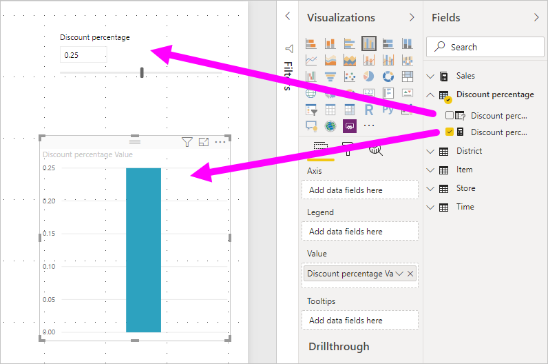
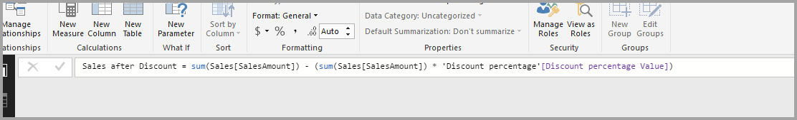

# สร้างและใช้พารามิเตอร์ what-if เพื่อแสดงตัวแปรวิชวลใน Power BI DesktopCreate and use what-if parameters to visualize variables in Power BI Desktop

เริ่มต้นด้วย *Power BI Desktop* รุ่นเผยแพร่เดือนสิงหาคม 2018 คุณสามารถสร้างตัวแปร *เกิดอะไรขึ้นถ้า* สำหรับรายงานของคุณ โต้ตอบกับตัวแปรในฐานะเป็นตัวแบ่งส่วนข้อมูล และแสดงภาพ และกำหนดปริมาณค่าที่สำคัญต่าง ๆ ในรายงานของคุณStarting with the August 2018 release of *Power BI Desktop*, you can create *what-if* variables for your reports, interact with the variable as a slicer, and visualize and quantify different key values in your reports.

สร้างพารามิเตอร์ *What-if* อยู่บนแท็บ **การวางรูปแบบ** ใน Power BI DesktopCreate a *what-if* parameter on the **Modeling** tab in Power BI Desktop. เมื่อคุณเลือก กล่องโต้ตอบจะปรากฏขึ้น ซึ่งคุณสามารถกำหนดค่าพารามิเตอร์ได้When you select it, a dialog box appears where you can configure the parameter.

## การสร้างพารามิเตอร์ What-ifCreating a what-if parameter

เมื่อต้องสร้างพารามิเตอร์ What-if (เกิดอะไรขึ้นถ้า) ให้เลือก **พารามิเตอร์ใหม่** จากแท็บ **การสร้างแบบจำลอง** ใน Power BI DesktopTo create a what-if parameter, select **New Parameter** from the **Modeling** tab in Power BI Desktop. ในรูปต่อไปนี้ เราได้สร้างพารามิเตอร์ที่เรียกว่า *เปอร์เซ็นต์ส่วนลด* และตั้งค่าชนิดข้อมูลเป็น **เลขทศนิยม**In the following image, we've created a parameter called *Discount percentage* and set its data type to **Decimal number**. ค่า **ต่ำสุด** คือศูนย์The **Minimum** value is zero. ค่า **สูงสุด** คือ 0.50 (50 เปอร์เซ็นต์)The **Maximum** is 0.50 (50 percent). นอกจากนี้ เรายังได้ตั้งค่า **ส่วนเพิ่ม** เป็น 0.05 หรือห้าเปอร์เซ็นต์We've also set the **Increment** to 0.05, or five percent. นั่นคือจำนวนที่พารามิเตอร์จะปรับเปลี่ยนเมื่อมีการโต้ตอบในรายงานThat's how much the parameter will adjust when interacted with in a report.

> [!NOTE]
> สำหรับตัวเลขทศนิยม ตรวจสอบให้แน่ใจว่าคุณเติมข้างหน้าด้วยศูนย์ เป็น 0.50 แทนที่จะเป็น .50For decimal numbers, make sure you precede the value with a zero, as in 0.50 versus just .50. มิฉะนั้น ตัวเลขดังกล่าวจะไม่ผ่านการตรวจสอบ และจะไม่สามารถเลือกปุ่ม **ตกลง** ได้Otherwise, the number won't validate and the **OK** button won't be selectable.
> 
> 

เพื่อความสะดวกของคุณ กล่อง **เพิ่มตัวแบ่งส่วนข้อมูลไปยังหน้านี้** จะวางตัวแบ่งส่วนข้อมูลและพารามิเตอร์ What-if (เกิดอะไรขึ้นถ้า) ลงบนหน้ารายงานปัจจุบันโดยอัตโนมัติFor your convenience, the **Add slicer to this page** checkbox automatically puts a slicer with your what-if parameter onto the current report page.

นอกจากการสร้างพารามิเตอร์แล้ว การสร้างพารามิเตอร์ What-if (เกิดอะไรขึ้นถ้า) จะสร้างหน่วยวัดด้วย ซึ่งคุณสามารถใช้เพื่อแสดงค่าปัจจุบันของ พารามิเตอร์ What-if ได้In addition to creating the parameter, creating a what-if parameter also creates a measure, which you can use to visualize the current value of the what-if parameter.

การทราบว่าเมื่อคุณสร้างพารามิเตอร์ What-if ขึ้น ทั้งพารามิเตอร์และหน่วยวัดจะกลายเป็นส่วนหนึ่งของแบบจำลองของคุณนั้นเป็นสิ่งสำคัญและเป็นประโยชน์It's important and useful to note that once you create a what-if parameter, both the parameter and the measure become part of your model. พารามิเตอร์จะพร้อมใช้งานตลอดทั้งรายงาน และสามารถใช้ได้บนหน้ารายงานอื่น ๆ ด้วยSo, they're available throughout the report and can be used on other report pages. และเนื่องจากเป็นส่วนหนึ่งของแบบจำลอง คุณสามารถลบตัวแบ่งข้อมูลออกจากหน้ารายงานได้And, since they're part of the model, you can delete the slicer from the report page. ถ้าคุณต้องการย้อนกลับ เพียงเลือกพารามิเตอร์ What-if จากรายการ **เขตข้อมูล** แล้วลากไปยังพื้นที่ทำงาน จากนั้น เปลี่ยนวิชวลเป็นตัวแบ่งส่วนข้อมูลIf you want it back, just grab the what-if parameter from the **Fields** list and drag it onto the canvas, then change the visual to a slicer.

## การใช้พารามิเตอร์ What-IfUsing a what-if parameter

เรามาสร้างตัวอย่างง่าย ๆ ของการใช้พารามิเตอร์ What-if กันLet's create a simple example of using a what-if parameter. เราได้สร้างพารามิเตอร์ What-if ในส่วนก่อนหน้าWe created the what-if parameter in the previous section. ในตอนนี้ เราจะนำไปใช้โดยการสร้างหน่วยวัดใหม่ที่มีการปรับค่าด้วยแถบเลื่อนNow we'll put it to use by creating a new measure whose value adjusts with the slider.

หน่วยวัดใหม่ดังกล่าวจะเป็นยอดขายรวมที่มีการนำอัตราส่วนลดมาใช้The new measure is simply going to be the total sales amount, with the discount rate applied. คุณสามารถสร้างหน่วยวัดที่มีความซับซ้อนและน่าสนใจได้ แน่นอนว่านั่นช่วยให้ผู้ใช้รายงานของคุณสร้างภาพตัวแปรของพารามิเตอร์ What-if ของคุณได้You can create complex and interesting measures that let the consumers of your reports visualize the variable of your what-if parameter. ตัวอย่างเช่น คุณสามารถสร้างรายงานที่ทำให้ผู้ขายเห็นค่าตอบแทนของตนถ้าสามารถขายได้ตรงตามเป้าหมายหรือเปอร์เซ็นต์ยอดขายที่ตั้งไว้ หรือดูผลกระทบต่อการขายที่เพิ่มขึ้นเมื่อส่วนลดเพิ่มมากขึ้นFor example, you could create a report that lets sales people see their compensation if they meet certain sales goals or percentages, or see the effect of increased sales to deeper discounts.

ป้อนสูตรหน่วยวัดลงในแถบสูตร และตั้งชื่อเป็น *ยอดขายหลังจากส่วนลด*Enter the measure formula into the formula bar, and name the formula *Sales after Discount*.

จากนั้น เราสร้างวิชวลคอลัมน์ที่มี **OrderDate** บนแกน และทั้ง **SalesAmount** และหน่วยวัดที่เพิ่งสร้างขึ้นนั่นคือ **ยอดขายหลังจากส่วนลด** เป็นค่าThen, we create a column visual with **OrderDate** on the axis, and both **SalesAmount** and the just-created measure, **Sales after Discount** as the values.

จากนั้น เมื่อเราเลื่อนแถบเลื่อน เราจะเห็นว่าคอลัมน์ **ยอดขายหลังจากส่วนลด** แสดงปริมาณยอดขายหลังหักส่วนลดThen, as we move the slider, we see that the **Sales after Discount** column reflects the discounted sales amount.

และทั้งหมดก็มีแค่นั้นจริง ๆAnd, that's all there is to it. คุณสามารถใช้พารามิเตอร์ What-if ได้ในสถานการณ์ทุกประเภทYou can use what-if parameters in all sorts of situations. พารามิเตอร์เหล่านี้จะทำให้ผู้ใช้รายงานสามารถโต้ตอบกับสถานการณ์สมมติต่างๆ ที่คุณได้สร้างไว้ในรายงานของคุณThese parameters enable the consumers of reports to interact with different scenarios that you create in your reports.
