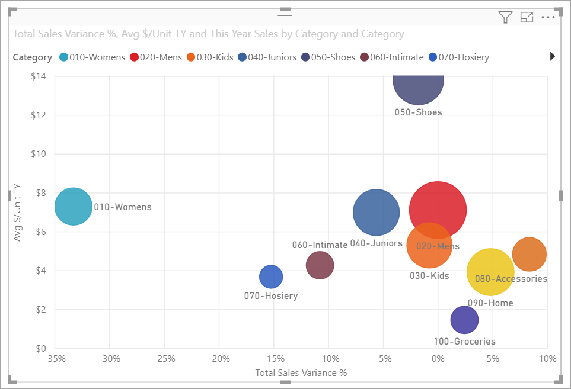
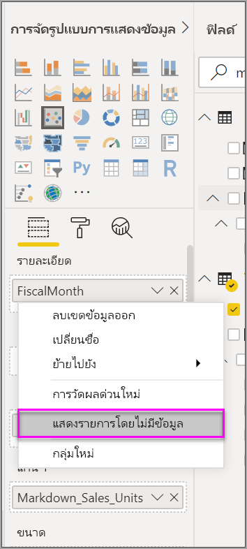
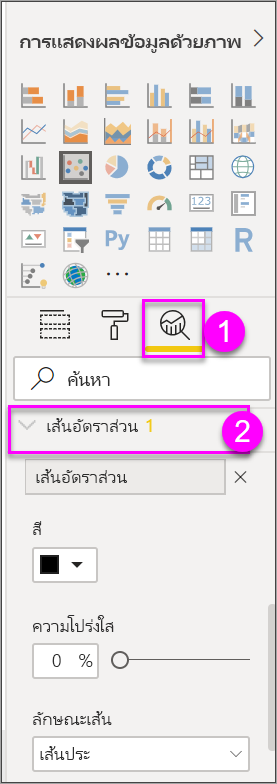
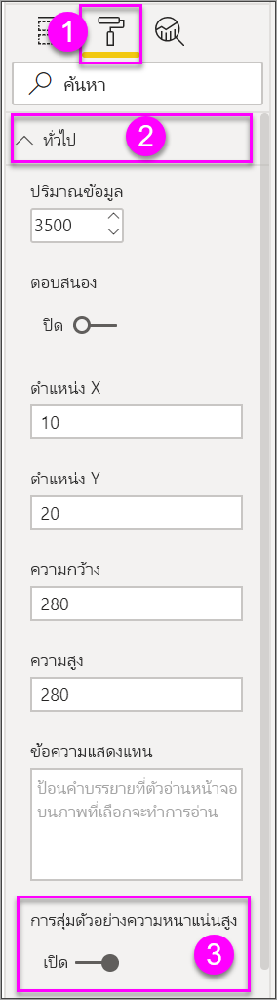

# การสุ่มตัวอย่างความหนาแน่นสูงในแผนภูมิกระจาย Power BIHigh-density sampling in Power BI scatter charts

[!INCLUDE [power-bi-visuals-desktop-banner](../includes/power-bi-visuals-desktop-banner.md)]

เริ่มตั้งแต่การเผยแพร่เดือนกันยายน 2017 ของ **Power BI Desktop** อัลกอริทึมการสุ่มตัวอย่างใหม่ มีให้ใช้งานซึ่งช่วยปรับปรุงวิธีที่แผนภูมิกระจายแสดงข้อมูลที่มีความหนาแน่นสูงBeginning with the September 2017 release of the **Power BI Desktop**, a new sampling algorithm is available that improves how scatter charts represent high-density data.

ตัวอย่างเช่น คุณอาจสร้างแผนภูมิกราฟจุดจากกิจกรรมการขายขององค์กรของคุณ ร้านค้าแต่ละรายการจะมีหลายหมื่นรายจุดข้อมูลในแต่ละปีFor example, you might create a scatter chart from your organization's sales activity, each store having tens of thousands of data points each year. แผนภูมิกระจายของข้อมูลดังกล่าวจะสุ่มตัวอย่างข้อมูล (เลือกตัวแทนของข้อมูลที่สื่อความหมาย ให้เห็นว่าการขายเกิดขึ้นตามเวลาอย่างไร) จากข้อมูลทั้งหมด และสร้างแผนภูมิกระจายที่แทนข้อมูลเบื้องต้นA scatter chart of such information would sample data (select a meaningful representation of that data to illustrate how sales occurred over time) from the available data, and create a scatter chart that represents the underlying data. นี่คือแนวทางปฏิบัติทั่วไปในแผนภูมิกระจายความหนาแน่นสูงThis is common practice in high-density scatter charts. Power BI ได้ปรับปรุงการสุ่มตัวอย่างของข้อมูลที่หนาแน่นสูง รายละเอียดนั้นจะอธิบายไว้ในบทความนี้Power BI has improved its sampling of high-density data, the details of which are described in this article.

## วิธีการทำงานของแผนภูมิกราฟจุดที่มีความหนาแน่นสูงHow high-density scatter charts work
ก่อนหน้านี้ **Power BI** เลือกคอลเลกชันของจุดของข้อมูลตัวอย่างในช่วงทั้งหมดของข้อมูลเบื้องต้น ตามแบบจำลองที่กำหนดขึ้นเพื่อสร้างแผนภูมิกราฟจุดPreviously, **Power BI** selected a collection of sample data points in the full range of underlying data in a deterministic fashion to create a scatter chart. โดยเฉพาะ Power BI จะเลือกแถวแรกและแถวสุดท้ายของข้อมูลในชุดข้อมูลแผนภูมกราฟจุด จากนั้นจะแบ่งแถวที่เหลือเท่าๆ กันเพื่อให้จุดข้อมูลทั้งหมด 3,500 จุดสามารถจดลงบนแผนภูมิกราฟจุดได้Specifically, Power BI would select the first and last rows of data in the scatter chart series, then would divide the remaining rows evenly so that 3,500 data points total would be plotted on the scatter chart. ตัวอย่างเช่น ถ้าตัวอย่างที่มีแถวทั้งหมด 35,000 แถว แถวแรกและแถวสุดท้ายถูกเลือกสำหรับการลงจุด จากนั้นทุก ๆ แถวที่สิบจะมีการลงจุดด้วย (35,000 / 10 = ทุกแถวที่สิบ = 3,500 จุดข้อมูล)For example, if the sample had 35,000 rows, the first and last rows would be selected for plotting, then every tenth row would also be plotted (35,000 / 10 = every tenth row = 3,500 data points). และเหมือนกับก่อนหน้านี้ ค่า null หรือจุดที่ไม่สามารถลงจุดได้ (เช่นเป็นข้อความ) ในชุดข้อมูลจะไม่ถูกแสดง ดังนั้นจะไม่ถูกพิจารณาตอนสร้างวิชวลAlso previously, null values or points that could not be plotted (such as text values) in data series weren't shown, and thus, were not considered when generating the visual. และด้วยการสุ่มตัวอย่างนั้น ความหนาแน่นที่มองเห็นของแผนภูมิกระจายจะขึ้นกับตัวแทนของจุดข้อมูล ดังนั้นความหนาแน่นของวิชวลขึ้นกับจุดที่เลือกมาเป็นตัวอย่าง ไม่ใช่คอลเลกชันเต็มของข้อมูลเบื้องต้นWith such sampling, the perceived density of the scatter chart was also based on the representative data points, so the implied visual density was a circumstance of the sampled points, not the full collection of the underlying data.

เมื่อคุณเปิดใช้งาน **การสุ่มตัวอย่างความหนาแน่นสูง** Power BI ประมวลผลอัลกอริทึมที่ลบจุดที่ซ้อนกัน และตรวจสอบว่าจุดบนภาพสามารถเข้าถึงได้เมื่อมีการโต้ตอบการแสดงผลด้วยภาพWhen you enable **High-density Sampling**, Power BI implements an algorithm that eliminates overlapping points, and ensures that the points on the visual can be reached when interacting with the visual. อัลอกริทึมยังทำให้แน่ใจอีกว่า จุดทั้งหมดในชุดข้อมูลถูกแสดงในวิชวล และให้บริบทที่เป็นความหมายของจุดที่เลือก แทนที่จะลงจุดตัวอย่างที่เป็นตัวแทนThe algorithm also ensures that all points in the data set are represented in the visual, providing context to the meaning of selected points, rather than just plotting a representative sample.

จากคำนิยาม ข้อมูลความหนาแน่นสูง จะถูกสุ่มตัวอย่างเพื่อสร้างการแสดงภาพได้อย่างรวดเร็วพอ ที่ตอบสนองต่อการโต้ตอบได้By definition, high-density data is sampled to create visualizations reasonably quickly that are responsive to interactivity. จุดข้อมูลที่มากเกินไปบนวิชวลทำให้รกตา และขัดขวางไม่ให้เห็นแนวโน้มToo many data points on a visual can bog it down, and can detract from the visibility of trends. ดังนั้น วิธีที่ใช้สุ่มข้อมูลคือสิ่งที่มาผลักดันการสร้างอัลกอริทึมการสุ่มตัวอย่าง เพื่อสร้างประสบการณ์การแสดงภาพที่ดีที่สุด และมั่นใจได้ว่าข้อมูลทั้งหมดถูกแสดงSo, how the data is sampled is what drives the creation of the sampling algorithm to provide the best visualization experience and ensure that all data is represented. ใน Power BI อัลกอริทึมได้รับการปรับปรุงเพื่อให้ได้การผสมผสานที่ดีที่สุด ระหว่างการตอบสนอง, ตัวแทนข้อมูล และการคงจุดข้อมูลที่สำคัญในชุดข้อมูลโดยรวมIn Power BI, the algorithm is now improved to provide the best combination of responsiveness, representation, and clear preservation of important points in the overall data set.

> [!NOTE]
> แผนภูมิกระจายใช้อัลกอริทึม **การสุ่มตัวอย่างความหนาแน่นสูง** เหมาะที่สุดที่จะลงจุดบนวิชวลสี่เหลี่ยมจตุรัส เช่นแผนภูมิกระจายทั้งหลายScatter charts using the **High-density Sampling** algorithm are best plotted on square visuals, as with all scatter charts.
> 
> 

## วิธีการทำงานของอัลกอริธึมการสุ่มตัวอย่างของแผนภูมิกราฟจุดHow the new scatter chart sampling algorithm works
อัลกอริทึมใหม่สำหรับ **การสุ่มตัวอย่างความหนาแน่นสูง** สำหรับแผนภูมิกระจาย ใช้วิธีที่จับภาพและแทนข้อมูลเบื้องต้นได้อย่างมีประสิทธิภาพขึ้น และกำจัดจุดที่ซ้อนทับกันThe new algorithm for **High-density Sampling** for scatter charts employs methods that capture and represent the underlying data more effectively and eliminates overlapping points. ทำโดยเริ่มต้นด้วยรัศมีขนาดเล็กสำหรับแต่ละจุดข้อมูล (ขนาดภาพวงกลมสำหรับจุดุบนการแสดงภาพ)It does this by starting with a small radius for each data point (the visual circle size for a given point on the visualization). แล้วเพิ่มรัศมีของจุดข้อมูลทั้งหมด เมื่อมีการทับซ้อนของจุดข้อมูลสองจุด(หรือมากกว่า) วงกลมเดียว (ของขนาดรัศมีที่เพิ่มขึ้น) แสดงจุดข้อมูลที่ซ้อนเหล่านั้นIt then increases the radius of all data points; when two (or more) data points overlap, a single circle (of the increased radius size) represents those overlapped data points. อัลกอริทึมยังเพิ่มรัศมีของจุดข้อมูลเรื่อยๆ จนกว่าค่ารัศมีมีจำนวนจุดข้อมูลอย่างสมเหตุสมผล 3,500 โดยแสดงในแผนภูมิกราฟจุดThe algorithm continues to increase the radius of data points, until that radius value results in a reasonable number of data points - 3,500 - being displayed in the scatter chart.

วิธีการในอัลกอริทึมนี้ทำให้แน่ใจว่าค่าผิดปกติจะถูกแสดงในภาพผลลัพธ์The methods in this algorithm ensure that outliers are represented in the resulting visual. อัลกอริทึมเคารพมาตราส่วนเมื่อกำหนดการซ้อน เช่นเดียวกับระดับโพเนนเชียลที่ถูกแสดงภาพ ด้วยความเที่ยงตรงเหมือนกับจุดต้นแบบThe algorithm respects scale when determining overlap, too, such that exponential scales are visualized with fidelity to the underlying visualized points.

อัลกอริทึมยังรักษารูปร่างโดยรวมของแผนภูมิกราฟจุดThe algorithm also preserves the overall shape of the scatter chart.

> [!NOTE]
> เมื่อใช้อัลกอริทึม **การสุ่มตัวอย่างความหนาแน่นสูง** สำหรับแผนภูมิกราฟจุด *การแจกจ่ายที่แม่นยำ* ของข้อมูลเป็นเป้าหมาย และความหนาแน่นของภาพโดยนัย *ไม่ใช่* เป้าหมายWhen using the **High-density Sampling** algorithm for scatter charts, *accurate distribution* of the data is the goal, and implied visual density is *not* the goal. ตัวอย่างเช่น คุณอาจเห็นแผนภูมิกระจาย มีมากมายวงกลมที่ซ้อนกัน (ความหนาแน่น) ในบางพื้นที่ และลองนึกถึงจุดข้อมูลจำนวนมากที่ต้องทำการคลัสเตอร์ที่นี่ เนื่องจากการ **การสุ่มตัวอย่างความหนาแน่นสูง** อัลกอริทึมสามารถใช้วงกลมหนึ่งเพื่อแสดงจุดข้อมูลจำนวนมาก ดังกล่าวโดยนัยความหนาแน่นที่ภาพ (หรือ "ทำการคลัสเตอร์") จะไม่แสดงออกมาFor example, you might see a scatter chart with lots of circles that overlap (density) in a certain area, and imagine many data points must be clustered there; since the **High-density Sampling** algorithm can use one circle to represent many data points, such implied visual density (or "clustering") will not show up. เมื่อต้องรับรายละเอียดเพิ่มเติมในพื้นที่ที่กำหนด คุณสามารถใช้ตัวแบ่งส่วนข้อมูลเพื่อขยายได้To get more detail in a given area, you can use slicers to zoom in.
> 
> 

ยิ่งกว่านี้ จุดข้อมูลที่ไม่สามารถลงจุดได้(เช่นค่า null หรือค่าข้อความ)จะถูกละเว้น ดังนั้นค่าอื่นที่สามารถลงจุดนั้นถูกเลือก การตรวจรูปร่างจริงของแผนภูมิครั้งต่อไปนั้นถูกจัดการIn addition, data points that cannot be plotted (such as nulls or text values) are ignored, so another value that can be plotted is selected, further ensuring the true shape of the scatter chart is maintained.

### เมื่อใช้อัลกอริทึมมาตรฐานแผนภูมิกราฟจุดWhen the standard algorithm for scatter charts is used
อาจมีกรณีซึ่ง **การสุ่มตัวอย่างความหนาแน่นสูง** ไม่สามารถนำไปใช้ได้กับแผนภูมิกระจาย และอัลกอริทึมเดิมถูกใช้แทนThere are circumstances under which **High-density Sampling** cannot be applied to a scatter chart and the original algorithm is used. สถานการณ์เหล่านั้นมีดังนี้Those circumstances are the following:

* ถ้าคุณคลิกขวาบนค่าภายใต้ **รายละเอียด** แล้วเลือก **แสดงรายการที่ไม่มีข้อมูล** จากเมนู แผนภูมิกระจายจะกลับไปใช้อัลกอริทึมเดิมIf you right-click a value under **Details** and set it to **Show items with no data** from the menu, the scatter chart will revert to the original algorithm.
  
  
* ค่าใด ๆ ในแกน **Play** จะทำใหแผนภูมิกราฟจุดแปลงกลับเป็นอัลกอริทึมต้นฉบับAny values in the **Play** axis will result in the scatter chart reverting to the original algorithm.
* ถ้าทั้งแกน X และ Y หายไปจากแผนภูมิกราฟจุด แผนภูมิแปลงกลับไปเป็นอัลกอริทึมต้นฉบับIf both X and Y axes are missing on a scatter chart, the chart reverts to the original algorithm.
* การใช้ **เส้นอัตรา** ในบานหน้าต่าง **การวิเคราะห์** มีผลให้แผนภูมิแปลงกลับเป็นอัลกอริทึมต้นฉบับUsing a **Ratio line** in the **Analytics** pane results in the chart reverting to the original algorithm.
  
  

## วิธีการเปิดใช้งานการสุ่มตัวอย่างแบบความหนาแน่นสูงสำหรับแผนกราฟจุดHow to turn on high-density sampling for a scatter chart
เพื่อเปิดใช้งาน **การสุ่มตัวอย่างความหนาแน่นสูง** เลือกแผนภูมิกระจาย ไปที่บานหน้าต่าง **จัดรูปแบบ** ขยายการ์ด **ทั่วไป** และใกล้กับด้านล่างของการ์ด เลื่อนตัวเลื่อน **การสุ่มตัวอย่างความหนาแน่นสูง** ให้เป็น **เปิด**To turn on **High-density Sampling**, select a scatter chart, go to the **Formatting** pane, expand the **General** card, and near the bottom of that card, slide the **High-density Sampling** toggle slider to **On**.

> [!NOTE]
> เมื่อแถบเลื่อนที่เปิดอยู่ Power BI จะพยายามใช้อัลกอริทึม **การสุ่มตัวอย่างความหนาแน่นสูง** เมื่อใดก็ตามที่เป็นได้Once the slider is turned on, Power BI will attempt to use the **High-density Sampling** algorithm whenever possible. เมื่อไม่สามารถใช้อัลกอริทึม (ตัวอย่างเช่น คุณใส่ค่าในการ *เล่น* แกน), แถบเลื่อนยังคงอยู่ในการ **บน** จัดตำแหน่งแม้ว่าแผนภูมิมีแปลงกลับเป็นอัลกอริทึมมาตรฐานได้When the algorithm cannot be used (for example, you place a value in the *Play* axis), the slider stays in the **On** position even though the chart has reverted to the standard algorithm. ถ้าคุณลบค่าจากแกน *เคลื่อนไหว* (หรือเปลี่ยนแปลงเงื่อนไขเพื่อให้สามารถใช้อัลกอริทึมการสุ่มตัวอย่างความหนาแน่นสูงได้) แผนภูมิจะใช้การสุ่มตัวอย่างความหนาแน่นสูงโดยอัตโนมัติสำหรับแผนภูมินั้น เนื่องจากคุณลักษณะเปิดใช้งานอยู่If you then remove a value from the *Play* axis (or conditions change to enable use of the high-density sampling algorithm), the chart will automatically use high-density sampling for that chart because the feature is active.
> 

> 
> [!NOTE]
> จุดข้อมูลจะถูกจัดกลุ่ม หรือเลือกโดยดัชนีData points are grouped or selected by the index. การมีคำอธิบายแผนภูมิไม่มีผลต่อการสุ่มตัวอย่างสำหรับอัลกอริทึม ซึ่งจะส่งผลต่อลำดับของภาพHaving a legend does not affect sampling for the algorithm, it only affects the ordering of the visual.
> 
> 

## ข้อควรพิจารณาและข้อจำกัดConsiderations and limitations
อัลกอริทึมการสุ่มตัวอย่างความหนาแน่นสูง เป็นการพัฒนาที่สำคัญสำหรับ Power BI แต่ยังมีข้อควรพิจารณาที่ต้องทราบ เมื่อทำงานกับค่าความหนาแน่สูงและแผนภูมิกระจายThe high-density sampling algorithm is an important improvement to Power BI, but there are a few considerations to know when working with high-density values and scatter charts.

* อัลกอริทึมการ **สุ่มตัวอย่างความหนาแน่นสูง** ทำงานกับการเชื่อมต่อสดไปยังแบบจำลอง Power BI แบบจำลองที่นำเข้าหรือ DirectQueryThe **High-density Sampling** algorithm only works with live connections to Power BI service-based models, imported models, or DirectQuery.

## ขั้นตอนถัดไปNext steps
สำหรับข้อมูลเพิ่มเติมเกี่ยวกับการสุ่มตัวอย่างความหนาแน่นสูงในแผนภูมิอื่นๆ ให้ดูบทความต่อไปนี้For more information about high-density sampling in other charts, see the following article.

* [การสุ่มตัวอย่างเส้นแบบความหนาแน่นสูงใน Power BIHigh-density line sampling in Power BI](../create-reports/desktop-high-density-sampling.md)

