# สร้างการแสดงข้อมูลเมทริกซ์ใน Power BICreate matrix visualizations in Power BI

[!INCLUDE[consumer-appliesto-nyyn](../includes/consumer-appliesto-nyyn.md)]

[!INCLUDE [power-bi-visuals-desktop-banner](../includes/power-bi-visuals-desktop-banner.md)]

เมทริกซ์วิชวลจะคล้ายกับตารางThe matrix visual is similar to a table.  ตารางสนับสนุนสองมิติและข้อมูลที่อยู่แบบแฟลตหมายความว่าการคัดลอกวิธีแสดงค่าจะไม่รวมกันA table supports two dimensions and the data is flat, meaning duplicate values are displayed and not aggregated. เมทริกซ์ทำให้การแสดงข้อมูลง่ายและมีความหมายในทั้งหลายมิติและเมทริกซ์สนับสนุนการจัดวางอย่างเป็นขั้นเป็นตอนA matrix makes it easier to display data meaningfully across multiple dimensions -- it supports a stepped layout. เมทริกซ์จะรวมข้อมูลโดยอัตโนมัติและสามารถเจาะลึกลงไปThe matrix automatically aggregates the data and enables drill down. 

คุณสามารถสร้างวิชวลเมทริกซ์ในรายงาน **Power BI Desktop** และทำไฮไลต์เชื่อมโยงองค์ประกอบภายในเมทริกซ์กับวิชวลอื่น ๆ ที่อยู่ในหน้ารายงานนั้นYou can create matrix visuals in **Power BI Desktop** reports and cross-highlight elements within the matrix with other visuals on that report page. ยกตัวอย่างเช่นคุณยังสามารถเลือกแถว คอลัมน์ และแม้แต่ละเซลล์ และทำไฮไลต์เชื่อมโยงFor example, you can select rows, columns, and even individual cells and cross-highlight. และยังสามารถคัดลอกเซลล์เดียวและหลายเซลล์ และวางลงในแอปพลิเคชันอื่นได้Also, individual cells and multiple cell selections can be copied and pasted into other applications. 

มีคุณลักษณะมากมายที่เกี่ยวข้องกับเมทริกซ์ และเราจะไปศึกษาในส่วนต่อ ๆ ไปของบทความนี้There are many features associated with the matrix, and we'll go through them in the following sections of this article.

> [!NOTE]
> การแชร์รายงานของคุณกับผู้ร่วมงาน Power BI กำหนดให้คุณต้องมีสิทธิ์การใช้งาน Power BI Pro แต่ละรายการ หรือรายงานจะถูกบันทึกในความจุแบบพรีเมียมSharing your report with a Power BI colleague requires that you both have individual Power BI Pro licenses or that the report is saved in Premium capacity.

## ทำความเข้าใจวิธีที่ Power BI คำนวณผลรวมUnderstanding how Power BI calculates totals

ก่อนที่จะเข้าสู่เรื่องวิธีใช้วิชวลเมทริกซ์ คุณจำเป็นต้องเรียนรู้วิธีที่ Power BI คำนวณค่าผลรวมและผลรวมย่อยในตารางและเมทริกซ์Before jumping into how to use the matrix visual, it's important to learn how Power BI calculates total and subtotal values in tables and matrices. สำหรับแถวผลรวมและผลรวมย่อย Power Bi จะประเมิน หน่วยวัดจากแถวทั้งหมดในข้อมูลเบื้องต้น - ซึ่งไม่เพียงแค่การบวกค่าในแถวมองเห็นได้ หรือแถวที่แสดงตรง ๆFor total and subtotal rows, Power BI evaluates the measure over all rows in the underlying data – it isn't just a simple addition of the values in the visible or displayed rows. นี่หมายความว่า คุณอาจได้ค่าผลรวมที่ต่างจากที่คุณคาดหวังThis means you can end up with different values in the total row than you might expect.

ลองดูวิชวลเมทริกซ์ต่อไปนี้Take a look at the following matrix visuals. 

ในตัวอย่างนี้ แต่ละแถวในของวิชวลเมทริกซ์ที่อยู่ทางด้านขวาสุดแสดง *ยอดรวม* สำหรับแต่ละคู่ของ พนักงานขาย/วันที่In this example, each row in the matrix visual farthest to the right is showing the *Amount* for each salesperson/date combination. แต่เนื่องจากพนักงานขายปรากฏในวันที่หลาย ๆ วัน ตัวเลขอาจปรากฏขึ้นมากกว่าหนึ่งครั้งHowever, since a salesperson shows up against multiple dates, the numbers can appear more than once. ดังนั้น ผลรวมที่ถูกต้องจากข้อมูลต้นแบบ กับการบวกง่าย ๆ ของค่าที่มองเห็น จะไม่เท่ากันThus, the accurate total from the underlying data, and a simple addition of the visible values, do not equate. นี่คือรูปแบบที่พบบ่อย เมื่อค่าที่คุณกำลังรวมอยู่บนด้าน 'หนึ่ง' ของความสัมพันธ์แบบหนึ่งต่อกลุ่มThis is a common pattern when the value you’re summing is on the ‘one’ side of a one-to-many relationship.

เมื่อคุณดูผลรวมและผลรวมย่อย จำไว้ว่าค่าเหล่านั้นจะยึดตามข้อมูลเบื้องต้นWhen you look at totals and subtotals, remember that those values are based on the underlying data. ค่าเหล่านั้นไม่ได้ยึดตามตัวเลขที่มองเห็นเพียงอย่างเดียวThey aren't solely based on the visible values.

## การขยายและการยุบส่วนหัวของแถวExpanding and collapsing row headers
มีสองวิธีที่คุณสามารถขยายส่วนหัวของแถวได้There are two ways you can expand row headers. ขั้นตอนแรกคือการคลิกขวาที่เมนูThe first is through the right-click menu. คุณจะเห็นตัวเลือกเพื่อขยายส่วนหัวของแถวนั้นๆ ที่คุณเลือก ระดับทั้งหมด หรือทุกอย่างไปจนถึงระดับสุดท้ายของลำดับชั้นYou’ll see options to expand the specific row header you selected, the entire level, or everything down to the very last level of the hierarchy. คุณมีตัวเลือกที่คล้ายกันสำหรับการยุบส่วนหัวของแถวเช่นกันYou have similar options for collapsing row headers as well.

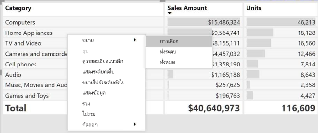

คุณยังสามารถเพิ่มปุ่ม +/- ไปยังส่วนหัวของแถวผ่านบานหน้าต่างการจัดรูปแบบภายใต้การ์ด **ส่วนหัวของแถว** ได้You can also add +/- buttons to the row headers through the formatting pane under the **Row headers** card. ตามค่าเริ่มต้น ไอคอนจะตรงกับการจัดรูปแบบของส่วนหัวของแถว แต่คุณสามารถกำหนดสีและขนาดของไอคอนแยกต่างหากได้ถ้าคุณต้องการBy default, the icons will match the formatting of the row header, but you can customize the icons’ colors and sizes separately if you want.

เมื่อเปิดไอคอนแล้ว จะทำงานคล้ายกับไอคอน PivotTable ใน ExcelOnce the icons are turned on, they work similar to PivotTable icons in Excel.

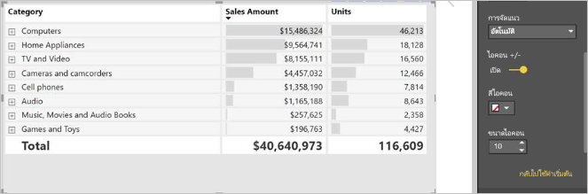

สถานะการขยายของเมทริกซ์จะบันทึกกับรายงานของคุณThe expansion state of the matrix will save with your report. คุณสามารถปักหมุดเมทริกซ์ไปยังแดชบอร์ดที่ขยายหรือยุบได้A matrix can be pinned to a dashboard expanded or collapsed. เมื่อเลือกไทล์แดชบอร์ดและรายงานเปิดอยู่ ยังสามารถเปลี่ยนแปลงสถานะการขยายในรายงานได้When that dashboard tile is selected, and the report opens, the expansion state can still be changed in the report. 

> [!NOTE]
> ถ้าคุณกำลังสร้างรายงานเพิ่มเติมจากโมเดล Analysis Services หลายมิติ จะมีข้อควรพิจารณาพิเศษบางอย่างสำหรับการขยาย/ยุบ ในกรณีที่แบบจำลองนั้นใช้คุณลักษณะสมาชิกเริ่มต้นIf you're building a report on top of an Analysis Services multidimensional model, there are some special considerations for expand/collapse if the model uses the Default Member feature. สำหรับข้อมูลเพิ่มเติม โปรดอ่านที่[ทำงานกับแบบจำลองหลายมิติใน Power BI](../connect-data/desktop-default-member-multidimensional-models.md)For more information see [Work with multidimensional models in Power BI](../connect-data/desktop-default-member-multidimensional-models.md)

## การดูรายละเอียดแนวลึกในภาพเมทริกซ์Using drill down with the matrix visual
ด้วยการแสดงผลด้วยภาพเมทริกซ์คุณสามารถทำการดูรายละเอียดแนวลึกที่น่าสนใจทุกประเภทที่ไม่เคยมีมาก่อนWith the matrix visual, you can do all sorts of interesting drill-down activities that weren't available before. ซึ่งรวมถึงความสามารถในการดูรายละเอียดแนวลึกที่ระดับแถว คอลัมน์ และแม้แต่ส่วนและเซลล์This includes the ability to drill down using rows, columns, and even into individual sections and cells. ลองมาดูวิธีการดูรายละเอียดแนวลึกLet's take a look at how each of these works.

### การดูรายละเอียดแนวลึกที่ส่วนหัวของแถวDrill down on row headers

ในบานหน้าต่างการแสดงภาพเมื่อคุณเพิ่มหลายเขตข้อมูลให้กับส่วน **แถว** ของ **เขตข้อมูล** คุณจะสามารถดูรายละเอียดแนวลึกที่ระดับแถวของภาพเมทริกซ์ได้In the Visualizations pane, when you add multiple fields to the **Rows** section of the **Fields** well, you enable drill down on the rows of the matrix visual. ซึ่งจะคล้ายกับการสร้างลำดับชั้นซึ่งจะช่วยให้คุณสามารถดูรายละเอียดแนวลึก (และย้อนกลับ) ตามลำดับชั้นดังกล่าว และวิเคราะห์ข้อมูลในแต่ละระดับได้This is similar to creating a hierarchy, which then allows you to drill down (and then back up) through that hierarchy, and analyze the data at each level.

ในรูปภาพต่อไปนี้ส่วน **แถว** ประกอบด้วย *ระยะการขาย* และ *ขนาดโอกาส* ซึ่งสร้างการจัดกลุ่ม (หรือลำดับชั้น) ในแถวที่เราสามารถเจาะลึกเพื่อดูรายละเอียดIn the following image, the **Rows** section contains *Sales stage* and *Opportunity size*, creating a grouping (or hierarchy) in the rows that we can drill to see details.

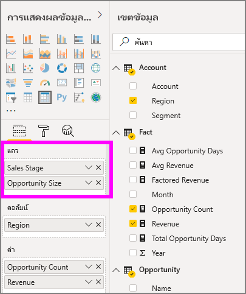

เมื่อวิชวลนี้มีการจัดกลุ่มที่สร้างขึ้นในส่วน **แถว** วิชวลจะแสดงไอคอน *ดูรายละเอียด* และ *ขยาย* ที่มุมบนซ้ายของวิชวลWhen the visual has grouping created in the **Rows** section, the visual itself displays the *drill* and *expand* icons in the top-left corner of the visual.

คล้ายกับการดูรายละเอียดและขยายดูข้อมูลในภาพอื่น ๆ การเลือกปุ่มเหล่านี้ช่วยให้เราสามารถดูรายละเอียดแนวลึก (หรือย้อนกลับ) ตามลำดับชั้นSimilar to the drill and expand behavior in other visuals, selecting those buttons lets us drill down (or back up) through the hierarchy. ในกรณีนี้เราสามารถเจาะลึกตั้งแต่ *ขั้นตอนการขาย* จนถึง *ขนาดโอกาส* ดังที่แสดงในภาพต่อไปนี้โดยที่ไอคอน **เจาะลึกระดับหนึ่ง** (รูปแฉก ) ที่ถูกเลือกแล้วIn this case, we can drill down from *Sales stage* to *Opportunity size*, as shown in the following image, where the **drill down one level** icon (the pitchfork) has been selected.

นอกจากการใช้ไอคอนเหล่านั้น คุณสามารถเลือกส่วนหัวของแถวใด ๆ และดูรายละเอียดแนวลึกโดยเลือกจากเมนูที่ปรากฏขึ้นIn addition to using those icons, you can select any of those row headers and drill down by choosing from the menu that appears.

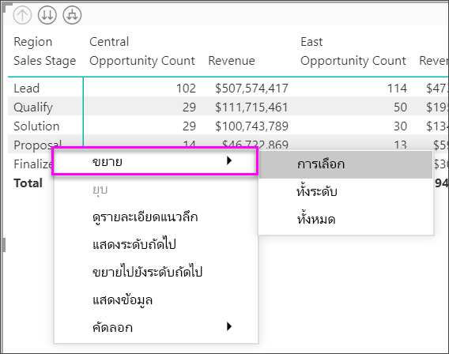

โปรดสังเกตว่า มีหลายตัวเลือกบนเมนูที่ปรากฏ ซึ่งสร้างผลลัพธ์ที่แตกต่างกัน:Notice there are a few options from the menu that appears, which generate different results:

เลือก **ดูรายละเอียดแนวลึก** ขยายเมทริกซ์สำหรับแถวระดับ *นั้น* *ยกเว้น* หัวแถวอื่น ๆ ทั้งหมดที่ไม่ใช้หัวแถวที่ถูกเลือกSelecting **Drill Down** expands the matrix for *that* row level, *excluding* all other row headings except the row header that was selected. ในรูปต่อไปนี้ **ข้อเสนอ** > **ที่เป็นรายละเอียดแนวลึก** จะถูกเลือกIn the following image, **Proposal** > **Drill Down** was selected. โปรดสังเกตว่า แถวอื่น ๆ ในระดับบนสุดจะไม่ปรากฏในเมทริกซ์Notice that other top-level rows no longer appear in the matrix. วิธีการดูรายละเอียดนี้เป็นคุณลักษณะที่มีประโยชน์ และกลายเป็นสิ่งที่น่าสนใจโดยเฉพาะอย่างยิ่งเมื่อเราไปยังส่วนการไฮไลต์แบบเชื่อมโยงThis way to drill is a useful feature, and becomes especially cool when we get to the cross-highlighting section.

เลือกไอคอน **ดูรายละเอียดแบบเจาะลึก** เพื่อกลับไปที่มุมมองระดับบนสุดก่อนหน้านี้Select the **Drill-up** icon to get back to the previous top-level view. ถ้าคุณเลือก **ข้อเสนอ** > **แสดงระดับถัดไป** คุณจะได้รายการตามลำดับของรายการในระดับถัดไปทั้งหมด (ในกรณีนี้ คือเขตข้อมูล *ขนาดของโอกาส*) โดยไม่มีลำดับชั้นสูงกว่าของการจัดประเภทIf you then select **Proposal** > **Show Next Level**, you get an ascending listing of all the next-level items (in this case, the *Opportunity size* field), without the higher-level hierarchy categorization.

เลือกไอคอน **ดูรายละเอียดเลื่อนขึ้น** ที่มุมบนซ้ายเพื่อให้เมทริกซ์แสดงประเภทระดับบนสุดทั้งหมด แล้วเลือก **ข้อเสนอ** > **ขยายไปยังระดับถัดไป** เพื่อดูค่าทั้งหมดสำหรับทั้งสองระดับของลำดับชั้น - *ขั้นตอนการขาย* และ *ขนาดของโอกาส*Select the **Drill up** icon in the upper-left corner to have the matrix show all top-level categories, then select **Proposal** > **Expand to next level**, to see all the values for both levels of the hierarchy - *Sales stage* and *Opportunity size*.

คุณยังสามารถใช้รายการเมนู **ขยาย** เพื่อควบคุมการแสดงเพิ่มเติมได้You can also use the **Expand** menu item to control the display further.  ตัวอย่าง เลือก **ข้อเสนอ** > **การขยาย** > **การเลือก**For example, select  **Proposal** > **Expand** > **Selection**. Power BI แสดงผลรวมหนึ่งแถวสำหรับแต่ละ *ขั้นตอนการขาย* และตัวเลือก *ขนาดของโอกาส* สำหรับ *ข้อเสนอ* ทั้งหมดPower BI displays one total row for each *Sales stage* and all the *Opportunity size* options for *Proposal*.

### ดูรายละเอียดแนวลึกที่ส่วนหัวของคอลัมน์Drill down on column headers
คล้ายกับความสามารถในการเจาะดูรายละเอียดแนวลึกที่ระดับแถว คุณสามารถยังเจาะรายละเอียดแนวลึกที่ระดับคอลัมน์ได้ด้วยSimilar to the ability to drill down on rows, you can also drill down on columns. ในรูปต่อไปนี้ มีสองเขตข้อมูลใน **คอลัมน์** ที่สร้างเป็นลำดับชั้นแบบเดียวกับที่เราใช้กับแถว ก่อนหน้านี้ในบทความIn the following image, there are two fields in the **Columns** field well, creating a hierarchy similar to what we used for the rows earlier in this article. ในเขตข้อมูล **คอลัมน์** เรามี *ภูมิภาค* และ *เซกเมนต์*In the **Columns** field well, we have *Region* and *Segment*. ทันทีที่เขตข้อมูลที่สองถูกเพิ่มไปยัง **คอลัมน์** เมนูดรอปดาวน์ใหม่จะแสดงบนวิชวล ขณะนี้กำลังแสดงข้อมูล **แถว** ให้ได้ชมAs soon as the second field was added to **Columns**, a new dropdown menu displayed on the visual, it currently shows **Rows**.

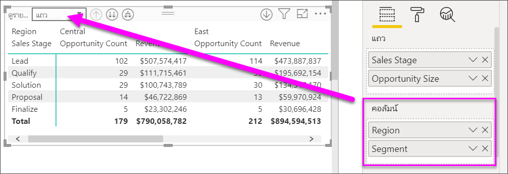

เมื่อต้องดูรายละเอียดแนวลึกบนคอลัมน์ เลือก **คอลัมน์** จากการเมนู *ดูรายละเอียดเลื่อนขึ้น* ที่อยู่มุมบนซ้ายของเมทริกซ์To drill down on columns, select **Columns** from the *Drill on* menu that can be found in the upper left corner of the matrix. เลือกภูมิภาค *ตะวันออก* และเลือก **รายละเอียดแนวลึก**Select the *East* region and choose **Drill Down**.

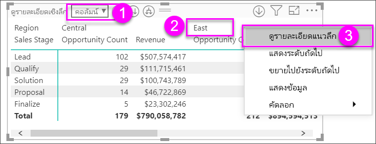

เมื่อคุณเลือก **ดูรายละเอียดแนวลึก** ลำดับชั้นคอลัมน์ถัดไปของ *ภูมิภาค>ตะวันออก* จะแสดง ซึ่งในกรณีนี้คือ *จำนวนโอกาส*When you select **Drill Down**, the next level of the column hierarchy for *Region > East* displays, which in this case is *Opportunity count*. ภูมิภาคอื่น ๆ ถูกซ่อนไว้The other region is hidden.

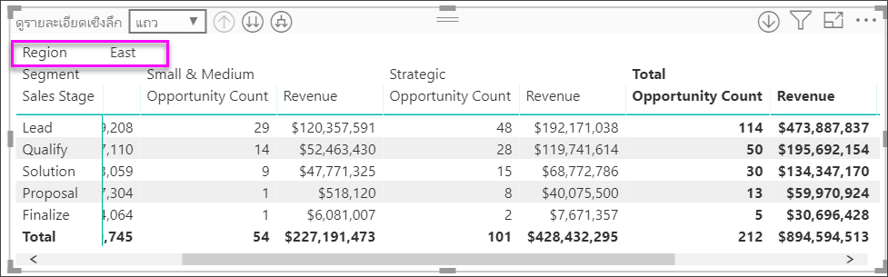

ส่วนที่เหลือของหน่วยข้อมูลของเมนูใช้งานกับคอลัมน์ในลักษณะเดียวกับที่ใช้กับแถว (ดูส่วนก่อนหน้า **ดูรายละเอียดแนวลึกที่ส่วนหัวของแถว**)The rest of the menu items work on columns in the same way they do for rows (see the previous section, **Drill down on row headers**). คุณสามารถ **แสดงระดับถัดไป**, **ขยายไประดับถัดไป** ด้วยคอลัมน์ของคุณเหมือนกับที่คุณสามารถทำได้กับแถวได้You can **Show Next Level** and **Expand to next level** with columns just as you can with rows.

> [!NOTE]
> ไอคอนดูรายละเอียดแนวลึก และดูข้อมูลสรุป ที่มุมบนซ้ายของวิชวลเมทริกซ์ ใช้กับแถวเท่านั้นThe drill-down and drill-up icons in the upper-left of the matrix visual only apply to rows. เมื่อต้องดูรายละเอียดแนวลึกที่ระดับคอลัมน์ คุณต้องใช้เมนูคลิกขวาIn order to drill down on columns, you must use the right-click menu.

## รูปแบบขั้น กับวิชวลเมทริกซ์Stepped layout with matrix visuals

วิชวลเมทริกซ์ทำการเยื้องประเภทย่อยในลำดับชั้นใต้แต่ละประเภทใหญ่ เรียกว่ารูปแบบขั้นThe matrix visual automatically indents subcategories in a hierarchy beneath each parent, called a stepped layout.

ในวิชวลเมทริกซ์ เวอร์ชันเดิมประเภทย่อยจะถูกแสดงในคอลัมน์ต่างหาก และใช้พื้นที่วิชวลมากขึ้นIn the original version of the matrix visual, subcategories were shown in an entirely different column, taking up much more space in the visual. รูปต่อไปนี้แสดงตารางในวิชวลเมทริกซ์ต้นฉบับ โปรดสังเกตว่าประเภทย่อยอยู่ในคอลัมน์แยกต่างหากThe following image shows the table in original matrix visual; notice the subcategories in a separate column.

ในรูปต่อไปนี้ คุณจะเห็นวิชวลเมทริกซ์ที่แสดงในรูปแบบขั้นIn the following image, you see a matrix visual, with stepped layout in action. โปรดสังเกตว่า ประเภท *คอมพิวเตอร์* มีประเภทย่อย (อุปกรณ์คอมพิวเตอร์ เดสก์ท็อป แล็ปท็อป จอ ฯลฯ) แสดงเยื้องเล็กน้อย ให้วิชวลดูสะอาดตา และดูแน่นขึ้นNotice the category *Computers* has its subcategories (Computers Accessories, Desktops, Laptops, Monitors, and so on) slightly indented, providing a cleaner and much more condensed visual.

คุณสามารถปรับเปลี่ยนการตั้งค่ารูปแบบขั้นได้อย่างง่ายดายYou can easily adjust the stepped layout settings. เมื่อเลือกวิชวลเมทริกซ์ ในส่วน **รูปแบบ** (ไอคอนลูกกลิ้งสี) ของบานหน้าต่าง **การจัดรูปแบบการแสดงข้อมูล** ขยายส่วนส่วนหัวของแถวWith the matrix visual selected, in the **Format** section (the paint roller icon) of the **Visualizations** pane, expand the row headers section. คุณมีสองตัวเลือก: การสลับรูปแบบขั้น (ให้เปิดหรือปิด) และการเยื้องเค้าโครงแบบขั้น (ระบุระยะของการเยื้องเป็นพิกเซล)You have two options: the stepped layout toggle (which turns it on or off), and the stepped layout indentation (specifies the indentation amount, in pixels).

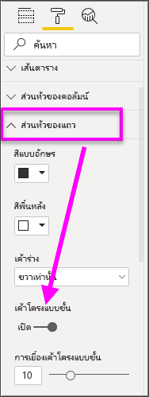

ถ้าคุณปิดรูปแบบขั้น Power BI จะแสดงประเภทย่อยในอีกคอลัมน์ แทนที่จะเยื้องภายใต้ประเภทหลักIf you turn off stepped layout, Power BI shows the subcategories in another column rather than indented beneath the parent category.

## ผลรวมย่อยและทั้งหมด ด้วยวิชวลเมทริกซ์Subtotals and grand totals with matrix visuals

คุณสามารถเปิดปิดผลรวมย่อย ในวิชวลเมทริกซ์ สำหรับทั้งแถวและคอลัมน์You can turn subtotals on or off in matrix visuals, for both rows and columns. ในรูปต่อไปนี้ คุณเห็นการตั้งค่าผลรวมย่อยของแถว เป็น **เปิด** และตั้งค่าให้แสดงผลที่ด้านล่างIn the following image, you can see that the row subtotals are set to **On** and set to display at the bottom.

เมื่อคุณเปิด **ผลรวมย่อย** และเพิ่มป้ายกำกับ Power BI ยังสามารถเพิ่มแถว และป้ายกำกับเดียวกัน สำหรับมูลค่าผลรวมทั้งหมดWhen you turn on **Subtotals** and add a label, Power BI also adds a row, and the same label, for the grand total value. เมื่อต้องการจัดรูปแบบผลรวมทั้งหมดของคุณ ให้เลือกตัวเลือกรูปแบบสำหรับ **ผลรวมทั้งหมด**To format your grand total, select the format option for **Grand total**. 

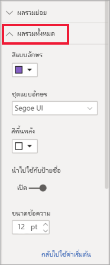

หากคุณต้องการปิดผลรวมย่อยและผลรวมทั้งหมด ในส่วนจัดรูปแบบของบานหน้าต่างการจัดรูปแบบการแสดงข้อมูล ขยายการ์ด **ผลรวมย่อย**If you want to turn subtotals and grand total off, in the format section of the visualizations pane, expand the **Subtotals** card. เปลี่ยนแถบเลื่อนแถวผลรวมย่อยเป็น **ปิด**Turn the row subtotals slider to **Off**. เมื่อคุณทำเช่นนั้น จะไม่มีแสดงผลรวมย่อยWhen you do so, the subtotals aren't shown.

กระบวนการเดียวกัน ใช้ได้กับผลรวมย่อยของคอลัมน์The same process applies for column subtotals.

## เพิ่มไอคอนที่แสดงเงื่อนไขAdd conditional icons
เพิ่มการแสดงภาพลงในตารางหรือเมทริกซ์ของคุณด้วย *ไอคอนแบบมีเงื่อนไข*Add visual cues to your table or matrix with *conditional icons*. 

ในส่วนรูปแบบของบานหน้าต่างการแสดงภาพ ให้ขยายการ์ด **การจัดรูปแบบตามเงื่อนไข**In the format section of the Visualizations pane, expand the **Conditional formatting** card. เลื่อนแถบเลื่อน **ไอคอน** ไปยัง **เปิด** และเลือก **ตัวควบคุมขั้นสูง**Turn the **Icons** slider to **On** and select **Advanced controls**.

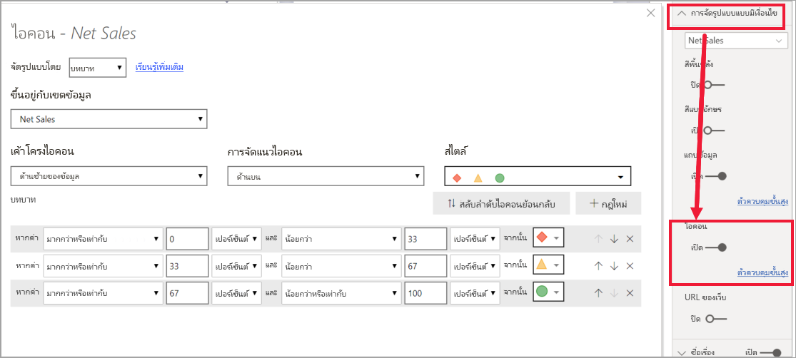

ปรับเงื่อนไข ไอคอนและสีสำหรับเมทริกซ์ของคุณและเลือก **ตกลง**Adjust the conditions, icons, and colors for your matrix and select **OK**. ในตัวอย่างนี้ เราใช้ธงสีแดงสำหรับรายการที่มีมูลค่าน้อย วงกลมสีม่วงสำหรับรายการที่มีมูลค่าสูง และสามเหลี่ยมสีเหลืองสำหรับรายการอื่นๆIn this example, we used a red flag for low values, purple circle for high values, and yellow triangle for everything in between. 

## การไฮไลต์เชื่อมโยง ด้วยวิชวลเมทริกซ์Cross-highlighting with matrix visuals

ด้วยวิชวลเมทริกซ์ คุณสามารถเลือกองค์ประกอบใด ๆ ในเมทริกซ์ให้เป็นพื้นฐานสำหรับการไฮไลต์เชื่อมโยงได้With the matrix visual, you can select any elements in the matrix as the basis for cross-highlighting. เลือกคอลัมน์ในเมทริกซ์และคอลัมน์นั้นจะถูกไฮไลต์โดย Power BI เช่นเดียวกับวิชวลอื่น ๆ ในหน้ารายงานSelect a column in a matrix and Power BI highlights the column, as does any other visuals on the report page. ไฮไลต์เชื่อมโยงชนิดนี้เป็นคุณลักษณะทั่วไปของภาพและการเลือกจุดข้อมูลอื่น ๆ ดังนั้นวิชวลเมทริกซ์จะให้ฟังก์ชันเดียวกันThis type of cross-highlighting has been a common feature of other visuals and data point selections, so now the matrix visual offers the same function.

นอกจากนี้ การใช้ Ctrl+คลิก ยังใช้ได้กับการไฮไลต์เชื่อมโยงIn addition, using Ctrl+Click also works for cross-highlighting. ตัวอย่างเช่น ในรูปต่อไปนี้ คอลเลกชันของประเภทย่อยถูกเลือกในวิชวลเมทริกซ์For example, in the following image a collection of subcategories were selected from the matrix visual. สังเกตได้ว่า รายการที่ไม่ได้เลือกในวิชวลจะเป็นสีเทา และวิชวลอื่น ๆ บนหน้าสะท้อนการเลือกในวิชวลเมทริกซ์Notice how items that weren't selected from the visual are grayed out, and how the other visuals on the page reflect the selections made in the matrix visual.

## คัดลอกค่าจาก Power BI เพื่อนำไปใช้ในแอปพลิเคชันอื่นCopying values from Power BI for use in other applications

ตารางหรือเมทริกซ์ของคุณอาจมีเนื้อหาที่คุณต้องการใช้ในแอปพลิเคชันอื่น ๆ: Dynamics CRM, Excel และรายงาน Power BI อื่นๆYour matrix or table may have content that you'd like to use in other applications: Dynamics CRM, Excel, and other Power BI reports. คุณสามารถคัดลอกเซลล์เดียวหรือหลายเซลล์ลงบนคลิปบอร์ดได้ด้วยการคลิกขวาที่ Power BIWith the Power BI right-click, you can copy a single cell or a selection of cells onto your clipboard. จากนั้นวางลงในแอปพลิเคชันอื่นThen, paste them into the other application.

* เมื่อต้องการคัดลอกเซลล์เดียว ให้เลือกเซลล์นั้น คลิกขวา แล้วเลือก **คัดลอกค่า**To copy the value of a single cell, select the cell,  right-click, and choose **Copy value**. ในตอนนี้คุณก็สามารถวางค่าที่คัดลอกลงในแอปพลิเคชันอื่นได้ โดยจะได้ค่าเซลล์ที่ไม่ได้จัดรูปแบบในคลิปบอร์ดWith the unformatted cell value on your clipboard, you can now paste it into another application.

    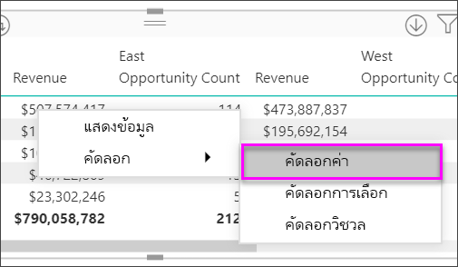

* เมื่อต้องการคัดลอกหลายเซลล์ ให้เลือกช่วงเซลล์ หรือใช้ปุ่ม CTRL เพื่อเลือกเซลล์อย่างน้อยหนึ่งเซลล์To copy more than a single cell, select a range of cells or use CTRL to select one or more cells. 

    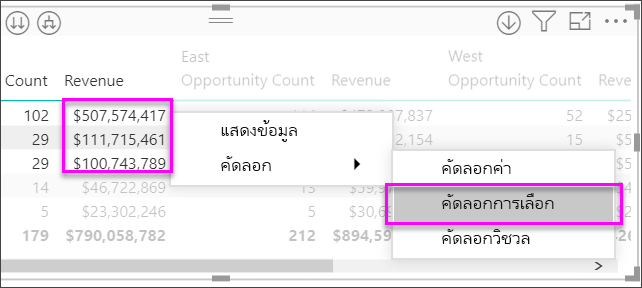

* ส่วนคัดลอกจะมีส่วนหัวของคอลัมน์และแถวThe copy will include the column and row headers.

    

* ในการทำสำเนาของวิชวลที่มีเฉพาะเซลล์ที่คุณเลือกเท่านั้น ให้เลือกอย่างน้อยหนึ่งเซลล์โดยใช้ CTRL, คลิกขวา และเลือก **คัดลอกวิชวล**To make a copy  of the visual itself containing only your selected cells, select one or more cells using CTRL, right-click, and choose **Copy visual**

    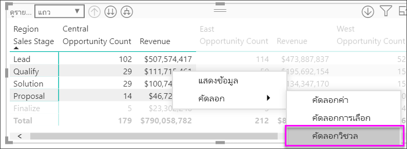

* สำเนาจะเป็นการจัดรูปแบบการแสดงข้อมูลเมทริกซ์อื่น แต่มีเพียงข้อมูลที่เป็นสำเนาของคุณเท่านั้นThe copy will be another matrix visualization, but contain only your copied data.

    

## ตั้งค่าเมทริกซ์เป็น URL ที่กำหนดเองSetting a matrix value as a custom URL

หากคุณมีคอลัมน์หรือหน่วยวัดที่ประกอบด้วย URL เว็บไซต์ คุณสามารถใช้การจัดรูปแบบตามเงื่อนไขเพื่อใช้ URL เหล่านั้นกับเขตข้อมูลเป็นลิงก์ที่ใช้งานอยู่ได้If you have a column or measure that contains website URLs, you can use conditional formatting to apply those URLs to fields as active links. คุณจะพบตัวเลือกนี้ภายใต้การ์ด **การจัดรูปแบบตามเงื่อนไข** ในแถบการจัดรูปแบบYou’ll find this option under the **Conditional formatting** card in the formatting pane.

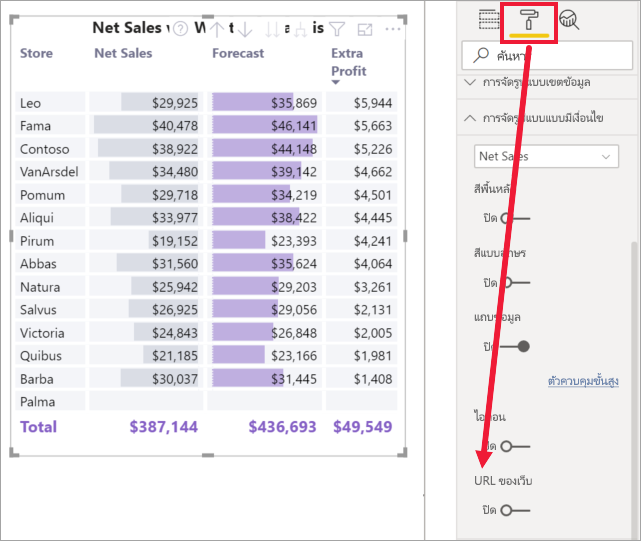

เปิด  **URL ของเว็บ** และเลือกเขตข้อมูลที่จะใช้เป็น URL สำหรับคอลัมน์Turn **Web URL** On, and select a field to use as the URL for the column. เมื่อนำไปใช้แล้ว ค่าในเขตข้อมูลนั้น (คอลัมน์) จะกลายเป็นลิงก์ที่ใช้งานอยู่Once applied, the values in that field (column) become active links. เลื่อนวางเม้าส์เพื่อดูลิงก์และเลือกเพื่อข้ามไปยังหน้านั้นHover to see the link, and select to jump to that page. 

สำหรับข้อมูลเพิ่มเติม ดูที่ [การจัดรูปแบบตารางแบบมีเงื่อนไข](../create-reports/desktop-conditional-table-formatting.md)For more information, see [Conditional table formatting](../create-reports/desktop-conditional-table-formatting.md)

## การแรเงาและสีแบบอักษร กับวิชวลเมทริกซ์Shading and font colors with matrix visuals
ด้วยวิชวลเมทริกซ์ คุณสามารถใช้การจัดรูปแบบตามเงื่อนไข (สี แรเงา และแถบข้อมูล) ในพื้นหลังของเซลล์ภายในเมทริกซ์ และคุณสามารถใช้การจัดรูปแบบตามเงื่อนไขกับข้อความและค่าWith the matrix visual, you can apply conditional formatting (colors and shading and data bars) to the background of cells within the matrix, and you can apply conditional formatting to the text and values themselves.

ในการใช้การจัดรูปแบบตามเงื่อนไข เลือกเมทริกซ์วิชวลและเปิดใน **รูปแบบ** บานหน้าต่างTo apply conditional formatting, select the matrix visual and open the **Format** pane. ขยายการ์ด **การจัดรูปแบบตามเงื่อนไข** และสำหรับ **สีพื้นหลัง** **สีฟอนต์** หรือ **แถบข้อมูล** เลื่อนแถบเลื่อนเพื่อ **เปิด**Expand the **Conditional formatting** card and for **Background color**, **Font color**, or **Data bars**, turn the slider to **On**. การเปิดใช้งานตัวเลือกตัวใดตัวหนึ่งจะแสดงลิงก์ของ *ตัวควบคุมขั้นสูง* ที่ให้คุณกำหนดสีและค่าสำหรับการจัดรูปแบบสีTurning on one of these options displays a link for *Advanced controls*, which lets you customize the colors and values for the color formatting.
  
  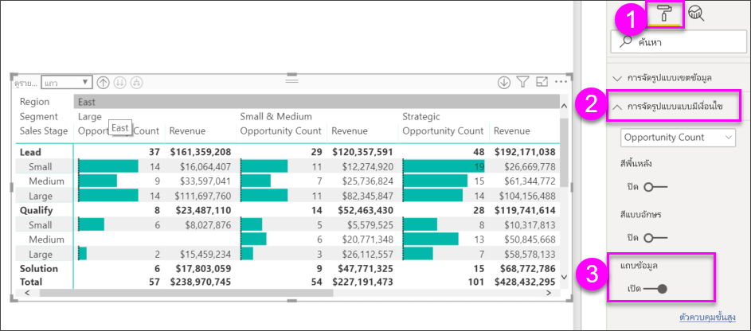

การเลือก *การควบคุมขั้นสูง* จะแสดงกล่องโต้ตอบที่สามารถให้คุณทำการปรับปรุงSelect *Advanced controls* to display a dialog, which lets you make adjustments. ตัวอย่างนี้แสดงกล่องโต้ตอบสำหรับ **แถบข้อมูล**This example shows the dialog for **Data bars**.

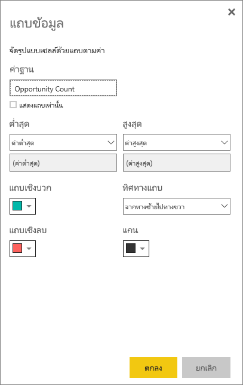

## ข้อควรพิจารณาและการแก้ไขปัญหาConsiderations and troubleshooting

* หากข้อมูลข้อความในเซลล์หรือส่วนหัวของตารางของคุณมีอักขระบรรทัดใหม่ อักขระเหล่านั้นจะถูกละเว้นถ้าคุณสลับตัวเลือก 'การตัดคำ' ในการ์ดบานหน้าต่างการจัดรูปแบบที่เกี่ยวข้องขององค์ประกอบIf the text data in your matrix's cells or headers contain new line characters, those characters will be ignored unless you toggle on the 'Word Wrap' option in the element's associated formatting pane card. 

## ขั้นตอนถัดไปNext steps

[วิชวล Power Apps สำหรับ Power BIPower Apps visual for Power BI](power-bi-visualization-powerapp.md)

[ชนิดการแสดงภาพใน Power BIVisualization types in Power BI](power-bi-visualization-types-for-reports-and-q-and-a.md)

