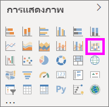
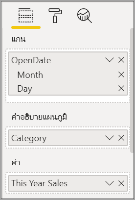
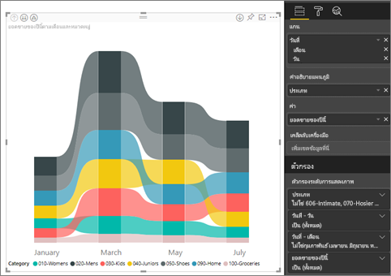
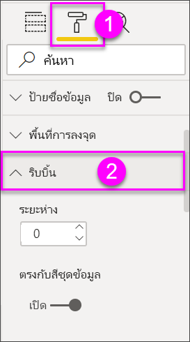
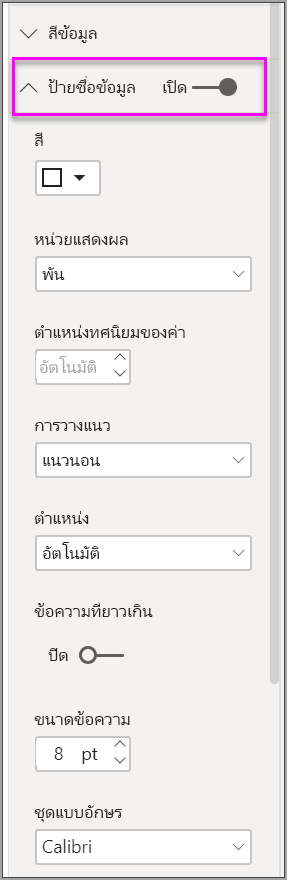
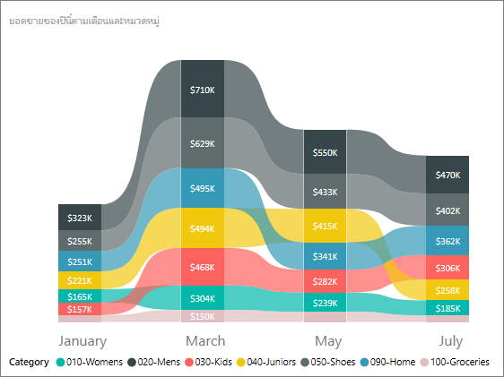

# ใช้แผนภูมิแถบริบบอนใน Power BICreate ribbon charts in Power BI

[!INCLUDE[consumer-appliesto-nyyn](../includes/consumer-appliesto-nyyn.md)]    

[!INCLUDE [power-bi-visuals-desktop-banner](../includes/power-bi-visuals-desktop-banner.md)]

คุณสามารถสร้างแผนภูมิแถบริบบอนเพื่อแสดงภาพข้อมูล และค้นหาได้อย่างรวดเร็วว่าข้อมูลประเภทใดมีอันดับสูงสุด (มีค่ามากที่สุด) ได้You can create ribbon charts to visualize data, and quickly discover which data category has the highest rank (largest value). แผนภูมิ Ribbon เหมาะกับการแสดงการเปลี่ยนแปลงอันดับ โดยที่ค่าอันดับสูงสุดจะแสดงอยู่ด้านบนสุดของแต่ละช่วงเวลาเสมอRibbon charts are effective at showing rank change, with the highest range (value) always displayed on top for each time period. 

> [!NOTE]
> การแชร์รายงานของคุณกับผู้ร่วมงาน Power BI กำหนดให้คุณต้องมีสิทธิ์การใช้งาน Power BI Pro แต่ละรายการ หรือรายงานจะถูกบันทึกในความจุแบบพรีเมียมSharing your report with a Power BI colleague requires that you both have individual Power BI Pro licenses or that the report is saved in Premium capacity. ดู [การแชร์รายงาน](../collaborate-share/service-share-reports.md)See [sharing reports](../collaborate-share/service-share-reports.md).

## ข้อกำหนดเบื้องต้นPrerequisites

บทช่วยสอนนี้ใช้[ไฟล์ PBIX ตัวอย่างการวิเคราะห์การค้าปลีก](https://download.microsoft.com/download/9/6/D/96DDC2FF-2568-491D-AAFA-AFDD6F763AE3/Retail%20Analysis%20Sample%20PBIX.pbix)This tutorial uses the [Retail Analysis sample PBIX file](https://download.microsoft.com/download/9/6/D/96DDC2FF-2568-491D-AAFA-AFDD6F763AE3/Retail%20Analysis%20Sample%20PBIX.pbix).

1. จากด้านบนซ้ายของแถบเมนู เลือก **ไฟล์** > **เปิด**From the upper left section of the menubar, select **File** > **Open**
   
2. ค้นหาสำเนา **ไฟล์ PBIX ตัวอย่างการวิเคราะห์การค้าปลีก**Find your copy of the **Retail Analysis sample PBIX file**

1. เปิด **ไฟล์ PBIX ตัวอย่างการวิเคราะห์การค้าปลีก** ในมุมมองรายงาน Open the **Retail Analysis sample PBIX file** in report view .

1. เลือกSelect  หากต้องการเพิ่มหน้าใหม่to add a new page.

## สร้างแผนภูมิ ribbonCreate a ribbon chart

1. เพื่อสร้างแผนภูมิ Ribbon เลือก **แผนภูมิ Ribbon** จากแผง **การแสดงภาพ**To create a ribbon chart, select **Ribbon chart** from the **Visualizations** panel.

    

    แผนภูมิ Ribbon เชื่อมต่อประเภทของข้อมูลผ่านช่วงเวลาที่แสดงภาพอย่างต่อเนื่องโดยใช้ Ribbon ให้คุณมองเห็นว่าแต่ละประเภทถูกจัดอันดับอย่างไรตลอดช่วงของแกน X ของแผนภูมิ (ซึ่งมักจะเป็นแกนเวลา)Ribbon charts connect a category of data over the visualized time continuum using ribbons, enabling you to see how a given category ranks throughout the span of the chart's x-axis (usually the timeline).

2. เลือกเขตข้อมูลสำหรับ **แกน**, **คำอธิบายแผนภูมิ** และ **ค่า**Select fields for **Axis**, **Legend**, and **Value**.  ในตัวอย่างนี้ เราได้เลือก: **จัดเก็บ** > **OpenDate**, **หมวดหมู่** > **รายการ** และ **ยอดขาย** > **ยอดขายปีนี้** > **มูลค่า**In this example, we've selected: **Store** > **OpenDate**, **Item** > **Category**, and **Sales** > **This year sales** > **Value**.  

    

    เนื่องจากชุดข้อมูลประกอบด้วยข้อมูลเพียงหนึ่งปีเท่านั้น เราจึงลบเขตข้อมูล **ปี** และ **ไตรมาส** ออกจาก **แกน**Since the dataset contains data for only one year, we removed the **Year** and **Quarter** field from the **Axis** well.

3. แผนภูมิริบบอนแสดงอันดับสำหรับทุกเดือนThe ribbon chart shows rank for every month. สังเกตว่าอันดับมีการเปลี่ยนแปลงอย่างไรตลอดเวลาNotice how rank changes across time. ตัวอย่างเช่น ประเภทหน้าแรกย้ายจากลำดับที่สองไปยังที่ห้า จากเดือนกุมภาพันธ์ไปยังมีนาคมFor example, the Home category moves from second to fifth from February to March.

    

## จัดรูปแบบแผนภูมิ ribbonFormat a ribbon chart
เมื่อคุณสร้างแผนภูมิ ribbon คุณมีตัวเลือกจัดรูปแบบในส่วน **รูปแบบ** ของบานหน้าต่าง **แสดงภาพ**When you create a ribbon chart, you have formatting options available in the **Format** section of the **Visualizations** pane. ตัวเลือกจัดรูปแบบสำหรับแผนภูมิ ribbon จะคล้ายกับตัวเลือกสำหรับแผนภูมิคอลัมน์แบบเรียงซ้อน และมีตัวเลือกจัดรูปแบบเพิ่มเติมที่ใช้กับเฉพาะ ribbonThe formatting options for ribbon charts are similar to those for a stacked column chart, with additional formatting options that are specific to the ribbons.

ตัวเลือกการจัดรูปแบบสำหรับแผนภูมิ Ribbon เหล่านี้ ให้คุณปรับรูปแบบเหล่านี้ได้These formatting options for ribbon charts let you make adjustments.

* **ระยะห่าง** ช่วยให้คุณปรับช่องว่างที่จะแสดงระหว่าง ribbon**Spacing** lets you adjust how much space appears between ribbons. ตัวเลขเป็นเปอร์เซ็นต์ของความสูงมากสุดของคอลัมน์The number is the percentage of the column's maximum height.
* **ตรงกับสีชุดข้อมูล** ช่วยให้คุณสามารถจับคู่สีของ ribbon ให้มีสีเดียวกับของชุดข้อมูล**Match series color** allows you to match the color of the ribbons with the series color. เมื่อตั้งค่าเป็น **ปิด** Ribbon จะกลายเป็นสีเทาWhen set to **off**, ribbons are gray.
* **โปร่งใส** กำหนดว่า ribbon ต่าง ๆ จะมีความโปร่งใสแค่ไหน ค่าเริ่มต้นคือ 30**Transparency** specifies how transparent the ribbons are, with the default set to 30.
* **ขอบ** ให้คุณวางขอบสีเข้มบนด้านบนและด้านล่างของ ribbon ต่าง ๆ**Border** lets you place a dark border on the top and bottom of the ribbons. ตามค่าเริ่มต้น จะไม่แสดงขอบBy default, borders are off.

เนื่องจากแผนภูมิริบบอนไม่มีป้ายกำกับแกน y คุณอาจต้องการเพิ่มป้ายชื่อข้อมูลSince the ribbon chart does not have y-axis labels, you may want to add data labels. จากบานหน้าต่างจัดรูปแบบ เลือก **ป้ายชื่อข้อมูล**From the Formatting pane, select **Data labels**. 

ตั้งค่าตัวเลือกการจัดรูปแบบสำหรับป้ายชื่อข้อมูลของคุณSet formatting options for your data labels. ในตัวอย่างนี้ เราได้ตั้งค่าสีของตัวอักษรเป็นสีขาวและแสดงหน่วยเป็นพันIn this example, we've set the text color to white and display units to thousands.

## ขั้นตอนถัดไปNext steps

[แผนภูมิกระจายและแผนภูมิฟองใน Power BIScatter charts and bubble charts in Power BI](power-bi-visualization-scatter.md)

[ชนิดการแสดงภาพใน Power BIVisualization types in Power BI](power-bi-visualization-types-for-reports-and-q-and-a.md)
