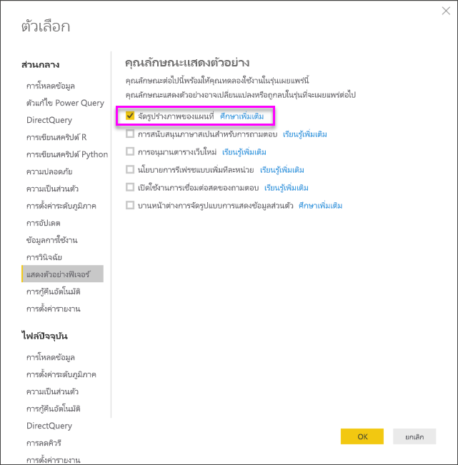
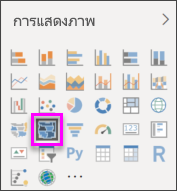
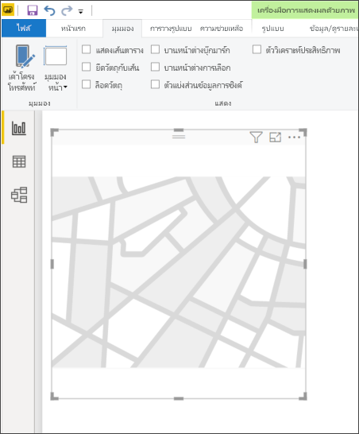
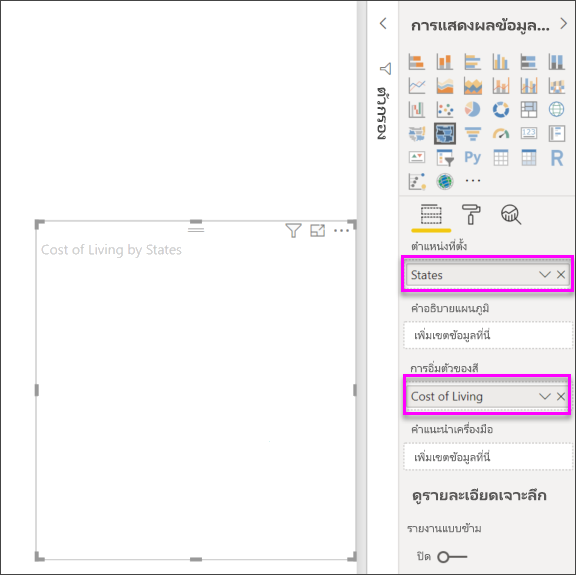
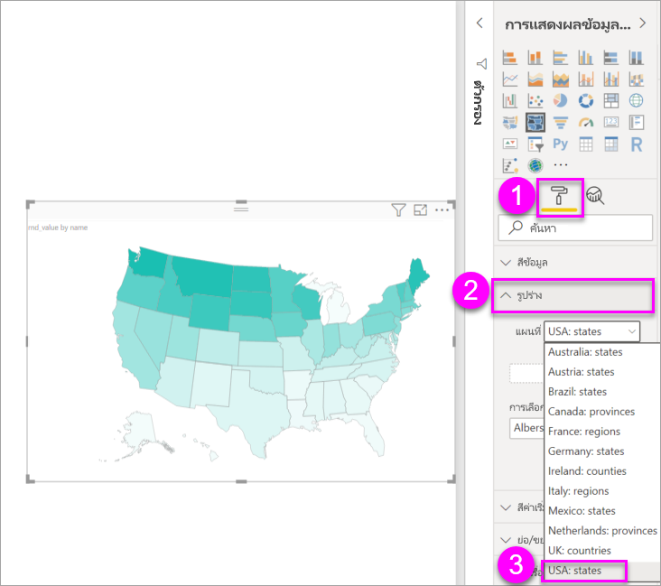
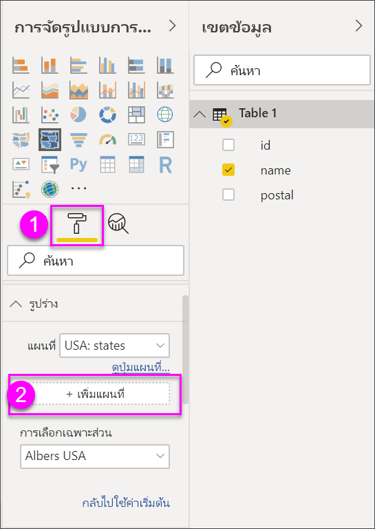
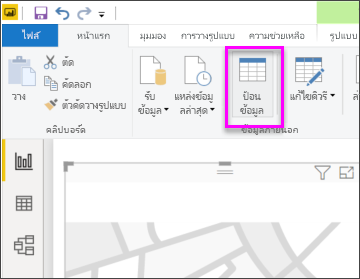
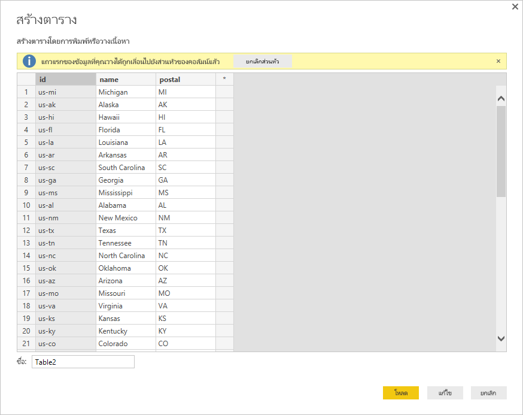

# สร้างการแสดงผลข้อมูลด้วยภาพแบบแผนที่รูปร่างใน Power BI Desktop (ตัวอย่าง)Create Shape Map visualizations in Power BI Desktop (preview)

[!INCLUDE[consumer-appliesto-nyyn](../includes/consumer-appliesto-nyyn.md)]

[!INCLUDE [power-bi-visuals-desktop-banner](../includes/power-bi-visuals-desktop-banner.md)]

สร้างภาพ **แผนที่รูปร่าง** เพื่อเปรียบเทียบภูมิภาคบนแผนที่โดยใช้สีCreate a **Shape Map** visual to compare regions on a map using color. ไม่เหมือนกับภาพ **แผนที่** **แผนที่รูปร่าง** ไม่สามารถแสดงตำแหน่งที่ตั้งทางภูมิศาสตร์อย่างแม่นยำของจุดข้อมูลบนแผนที่ได้Unlike the **Map** visual, **Shape Map** can't show precise geographical locations of data points on a map. แต่วัตถุประสงค์หลักคือการเปรียบเทียบภูมิภาคบนแผนที่โดยการใช้สีแตกต่างกันInstead,  its main purpose is to show relative comparisons of regions on a map by coloring them differently.

การแสดงภาพ **แผนที่รูปร่าง** อ้างอิงตามแผนที่ TopoJSON ซึ่งมีความสามารถที่น่าสนใจในการใช้แผนที่แบบกำหนดเองซึ่งคุณสามารถสร้างได้**Shape Map** visuals are based on TopoJSON maps, which have the compelling ability to use custom maps that you can create. ตัวอย่างของแผนที่แบบกำหนดเองคือ: แผนที่ทางภูมิศาสตร์ แผนที่เก้าอี้นั่ง แผนที่การจัดเรียง แผนผังชั้น และอื่น ๆExamples of custom maps are: geographical, seating arrangements, floor plans, and others. ความสามารถในการใช้แผนที่แบบกำหนดเองของ **แผนที่รูปร่าง** จะยังไม่มีในรุ่นตัวอย่างนี้The ability to use custom maps is not available in this Preview release of **Shape Map**.

> [!NOTE]
> การแชร์รายงานของคุณกับผู้ร่วมงาน Power BI กำหนดให้คุณต้องมีสิทธิ์การใช้งาน Power BI Pro แต่ละรายการ หรือรายงานจะถูกบันทึกในความจุแบบพรีเมียมSharing your report with a Power BI colleague requires that you both have individual Power BI Pro licenses or that the report is saved in Premium capacity.

## การสร้างแผนที่รูปร่างCreating Shape Maps
คุณสามารถทดลองตัวควบคุม **แผนที่รูปร่าง** ด้วยแผนที่ที่มาพร้อมรุ่นตัวอย่างนี้ หรือคุณสามารถใช้แผนที่แบบกำหนดเองของคุณเองได้ถ้าเป็นไปตามข้อกำหนดที่ระบุไว้ในส่วน **ใช้แผนที่แบบกำหนดเอง** .You can test the **Shape Map** control with the maps that are shipping with this Preview release, or you can use your own custom map as long as it meets the requirements outlined in the following section called **Use Custom Maps**.

วิชวล **แผนที่รูปร่าง** ยังเป็นคุณลักษณะตัวอย่าง และต้องเปิดใช้งานใน Power BI DesktopThe **Shape Map** visual is in Preview, and must be enabled in Power BI Desktop. เพื่อเปิดใช้งาน **แผนที่รูปร่าง** เลือก **ไฟล์ > ตัวเลือกและการตั้งค่า > ตัวเลือก > คุณลักษณะตัวอย่าง** จากนั้นเลือกกล่องกาเครื่องหมาย **จัดรูปทรงวิชวลแผนที่**To enable **Shape Map**, select **File > Options and Settings > Options > Preview Features**, then select the **Shape Map Visual** checkbox. คุณจะต้องรีสตาร์ท Power BI Desktop หลังจากที่คุณทำการเลือกแล้วYou'll need to restart Power BI Desktop after you make the selection.

เมื่อเปิดใช้งาน **แผนที่รูปร่าง** แล้ว เลือก **แผนที่รูปร่าง** จากบานหน้าต่าง **การจัดรูปแบบการแสดงข้อมูล**Once **Shape Map** is enabled, select the **Shape Map** icon from the **Visualizations** pane.

Power BI Desktop จะสร้างวิชวล **แผนที่รูปร่าง** ที่ว่างเปล่าบนพื้นที่ทำงานPower BI Desktop creates an empty **Shape Map** visual design canvas.

ทำตามขั้นตอนต่อไปนี้เพื่อสร้าง **แผนที่รูปร่าง**:Take the following steps to create a **Shape Map**:

1. ในบานหน้าต่าง **เขตข้อมูล** ลากเขตข้อมูลที่มีชื่อภูมิภาค (หรือตัวย่อ) ไปยังบักเก็ต **สถานที่ตั้ง** และเขตข้อมูลหน่วยวัดลงในบักเก็ต **การอิ่มตัวสี** (คุณจะยังไม่เห็นแผนที่ในตอนนี้)In the **Fields** pane, drag a data field that has the region names (or abbreviations) onto the **Location** bucket, and a data measure field into the **Color saturation** bucket (you won't see a map yet).

   > [!NOTE]
   > ดูส่วนที่ชื่อ **การรับข้อมูลแผนที่** ด้านล่าง สำหรับวิธีการรับข้อมูลแผนที่สำหรับทดลองกับ **แผนที่รูปร่าง** อย่างรวดเร็วSee the section titled **Getting Map Data**, below, for information on how to quickly get map data to test **Shape Map**.
   > 
   > 

   
2. ในบานหน้าต่างการตั้งค่า **รูปแบบ** ขยาย **รูปร่าง** แล้วเลือกจากรายการดรอปดาวน์ **แผนที่มาตรฐาน** เพื่อแสดงข้อมูลของคุณIn the **Format** settings pane, expand **Shape**, and select from the **Standard Maps** drop-down to show your data. ในตอนนี้ การแสดงภาพปรากฎขึ้น ดังที่แสดงในรูปต่อไปนี้At this point, the rendering appears, as shown in the following image.

   

   > [!NOTE]
   > ในส่วน **คีย์ภูมิภาค** ตอนท้ายของบทความนี้ เป็นคอลเลกชันของตารางที่มีคีย์ภูมิภาค ที่คุณสามารถใช้ทดลองวิชวล **แผนที่รูปร่าง**In the **Region Keys** section at the end of this article is a collection of tables that have map regions keys you can use to test the **Shape Map** visual.
   > 
   > 
3. คุณสามารถปรับเปลี่ยนแผนที่โดยใช้ตัวเลือกการจัดรูปแบบ เช่น **สีเริ่มต้น**, **ย่อ/ขยาย** และอื่น ๆ อีกมากมายYou can then modify the map using the Formatting options such as **Default color**, **Zoom**, and more. และคุณยังสามารถเพิ่มคอลัมน์ข้อมูลประเภท ไปยังบักเก็ต **คำอธิบายแผนภูมิ** และจัดกลุ่มภูมิภาคตามประเภทได้And, you can also add a category data column to the **Legend** bucket, and classify the map regions based on categories.

## ใช้แผนที่แบบกำหนดเองUse custom maps
คุณสามารถใช้แผนที่แบบกำหนดเองกับ **แผนที่รูปร่าง** ตราบใดที่แผนที่อยู่ในรูปแบบ **TopoJSON** ได้You can use custom maps with **Shape Map** as long as they are in the **TopoJSON** format. ถ้าแผนของคุณอยู่ในรูปแบบอื่น คุณสามารถใช้เครื่องมือออนไลน์เช่น [**Map Shaper**](https://mapshaper.org/) เพื่อแปลงแผนที่ *shapefiles* หรือ *GeoJSON* ของคุณ ไปเป็นรูปแบบ **TopoJSON**If your map is in another format, you can use online tools such as [**Map Shaper**](https://mapshaper.org/) to convert your *shapefiles* or your *GeoJSON* maps into the **TopoJSON** format.

เพื่อใช้ไฟล์แผนที่ **TopoJSON** ของคุณ เพิ่มวิชวลแผนที่รูปร่างลงในรายงานคุณ และเพิ่มข้อมูลลงในบักเก็ต *สถานที่ตั้ง* และ *การอิ่มตัวสี*To use your **TopoJSON** map file, add a ShapeMap visual to your report and add some data to the *Location* and *Color saturation* buckets. จากนั้น ในบานหน้าต่าง **การจัดรูปแบบการแสดงข้อมูล** ที่มีการเลือกส่วน **รูปแบบ** ไว้แล้ว (แสดงเป็น (1) ในรูปต่อไปนี้) ขยายส่วน **รูปร่าง** และเลือก **+ เพิ่มแผนที**Then, in the **Visualizations** pane with the **Format** section selected (shown as (1) in the following image), expand the **Shape** section and select **+ Add Map**.

## ตัวอย่างแผนที่แบบกำหนดเองSample custom map
*สำนักงานอัยการสหรัฐอเมริกา* เผยแพร่รายงานประจำปีงบประมาณในเรื่องคดีและข้อมูลภาระคดีThe *Offices of the United States Attorneys* release an annual fiscal report on their litigation and caseload data.  รายงานของพวกเขาทั้งหมด สามารถพบได้ในลิงก์ด้านล่างAll of their reports can be found in the link below,

https://www.justice.gov/usao/resources/annual-statistical-reports

เนื่องจากรัฐสามารถแบ่งออกเป็นหลายเขต เราจำเป็นต้องใช้แผนที่รูปร่างแบบกำหนดเองSince states can be divided into multiple districts, we have to use a custom shape map.  โดยการนำเข้าแผนที่ **TopoJSON** ของเขตทางศาลของสหรัฐอเมริกาลงใน **Power BI Desktop** จากนั้นเราสามารถแสดงภาพงบประมาณรายปี ของข้อมูลอัยการเขตได้By importing the **TopoJSON** map of the U.S. judicial districts into **Power BI Desktop**, we can then visualize the annual fiscal district attorney data.  รูปด้านล่างแสดงตัวอย่างของแผนที่นี้The image below shows an example of this map.

คุณสามารถทำสิ่งที่น่าสนใจ กับแผนที่แต่ละรัฐเช่นเดียวกัน และแสดงรายละเอียดเพิ่มเติมตามเขตซึ่งประกอบขึ้นเป็นรัฐYou can do interesting things with the individual state maps as well, and show more detail based on the districts it contains. 

ถ้าคุณต้องการทดลองกับชุดข้อมูลและการแสดงภาพนี้ คุณสามารถดาวน์โหลดไฟล์ PBIX ต้นฉบับที่ใช้สร้างรายงานนี้ได้ จากลิงก์ต่อไปนี้If you'd like to experiment with this dataset and visualization, you can download the original PBIX file that was used to generate this report using the following link.

* [ไฟล์ PBIX สาธิตแผนที่รูปร่างแบบกำหนดเองCustom shape map demo .PBIX file](https://download.microsoft.com/download/1/2/8/128943FB-9231-42BD-8A5D-5E2362C9D589/DistrictAttorneyFiscalReport.pbix)

## การรับข้อมูลแผนที่Getting map data
เพื่อให้ได้ข้อมูลใส่ลงในรูปแบบได้อย่างรวดเร็ว สำหรับการทดสอบ **แผนที่รูปร่าง** คุณสามารถคัดลอกตารางที่ส่วนท้ายของบทความนี้ จากนั้นเลือก **ป้อนข้อมูล** จาก ribbon **หน้าแรก** ได้To quickly get data into a model so you can test **Shape Map**, you can copy one of the tables at the end of this article, then select **Enter Data** from the **Home** ribbon.

ถ้าข้อมูลของคุณมีหลายคอลัมน์ คุณจะต้องใช้ตัวแก้ไขเช่น Excel เพื่อวางข้อมูล จากนั้นคัดลอกข้อมูลทีละคอลัมน์แยกจากกันIf your data has multiple columns, you will need to use an editor like Excel to paste the data, then copy each data column separately. จากนั้นคุณสามารถวางข้อมูลลงใน Power BI DesktopYou can then paste the data into Power BI Desktop. แถวบนสุดจะถูกกำหนดให้เป็นส่วนหัวโดยอัตโนมัติThe top row is automatically identified as a header.

คุณสามารถใส่คอลัมน์ใหม่ โดยการพิมพ์ชื่อคอลัมน์ใหม่ (ในคอลัมน์ว่างทางด้านขวา) จากนั้นเพิ่มค่าในเซลล์แต่ละเซลล์ เหมือนกับที่คุณทำใน ExcelYou can enter a new column simply by typing a new column name (in the blank column to the right), then add values in each cell, just like you can do in Excel. เมื่อเสร็จแล้ว เลือก **โหลด** และตารางจะถูกเพิ่มลงในรูปแบบข้อมูลสำหรับ Power BI DesktopWhen finished, select **Load** and the table is added to the data model for Power BI Desktop.

> [!NOTE]
> เมื่อทำงานกับประเทศหรือภูมิภาค ใช้ตัวย่อสามตัวอักษรเพื่อให้แน่ใจว่า การกำหนดพิกัดทางภูมิศาสตร์ทำงานได้อย่างถูกต้องในการแสดงภาพแผนที่When working with countries or regions, use the three-letter abbreviation to ensure that geocoding works properly in map visualizations. *อย่า* ใช้ตัวย่อสองตัวอักษร เนื่องจากอาจไม่รู้จักบางประเทศหรือบางภูมิภาคDo *not* use two-letter abbreviations, as some countries or regions may not be properly recognized.
> 
> ถ้าคุณมีเพียงตัวย่อสองตัวอักษร ดู[บล็อกโพสต์ภายนอกนี้](https://blog.ailon.org/how-to-display-2-letter-country-data-on-a-power-bi-map-85fc738497d6#.yudauacxp)สำหรับขั้นตอนการเชื่อมโยงตัวย่อประเทศ/ภูมิภาคแบบสองตัวอักษรของคุณ เข้ากับตัวย่อประเทศ/ภูมิภาคแบบสามตัวอักษรIf you only have two-letter abbreviations, check out [this external blog post](https://blog.ailon.org/how-to-display-2-letter-country-data-on-a-power-bi-map-85fc738497d6#.yudauacxp) for steps on how to associate your two-letter country/region abbreviations with three-letter country/region abbreviations.
> 
> 

## ลักษณะการทำงานและข้อกำหนดPreview behavior and requirements
มีข้อพิจารณาและข้อกำหนดสองสามข้อ สำหรับ **แผนที่รูปร่าง** ในการเผยแพร่ตัวอย่างนี้:There are a few considerations and requirements for this Preview release of **Shape Map**:

* วิชวล **แผนที่รูปร่าง** ยังเป็นคุณลักษณะตัวอย่าง และต้องเปิดใช้งานใน Power BI DesktopThe **Shape Map** visual is in Preview, and must be enabled in Power BI Desktop. เพื่อเปิดใช้งาน **แผนที่รูปร่าง** เลือก **ไฟล์ > ตัวเลือกและการตั้งค่า > ตัวเลือก > คุณลักษณะตัวอย่าง** จากนั้นเลือกกล่องกาเครื่องหมาย **จัดรูปทรงวิชวลแผนที่**To enable **Shape Map**, select **File > Options and Settings > Options > Preview Features**, then select the **Shape Map Visual** checkbox.
* ในปัจจุบัน คุณต้องตั้งค่าบักเก็ต **การอิ่มตัวสี** เพื่อให้การจัดกลุ่ม **คำอธิบายแผนภูมิ** ทำงานได้ถูกต้องCurrently, you must also have the **Color saturation** bucket set in order for the **Legend** classification to work properly.
* สำหรับ **แผนที่รูปร่าง** รุ่นเผยแพร่จริง จะมีส่วนติดต่อผู้ใช้ที่แสดงคีย์สำหรับแผนที่ที่เลือกในปัจจุบัน (**แผนที่รูปร่าง** ยังเป็นตัวอย่าง และยังไม่กำหนดวันเผยแพร่จริง)The final release version of **Shape Map** will have a user interface that shows the map keys of the currently selected map (there is no date set for final release, and **Shape Map** is still in Preview). ในรุ่นตัวอย่างนี้ คุณสามารถอ้างอิงคีย์ภูมิภาค ตามตารางที่พบในส่วน **คีย์ภูมิภาค** ของบทความนี้In this Preview release, you can reference the map region keys in the tables found in the following **Region Keys** section of this article.
* วิชวล **แผนที่รูปร่าง** จะลงจุดข้อมูลได้สูงสุด 1,500 จุดThe **Shape Map** visual will plot up to a maximum of 1,500 data points.

## คีย์ภูมิภาคRegion keys

ใช้ **คีย์ภูมิภาค** ต่อไปนี้ ในรุ่นตัวอย่างเพื่อทดสอบ **แผนที่รูปร่าง**Use the following **Region keys** in this Preview release to test **Shape map**.

### ออสเตรเลีย: รัฐAustralia: States

| IDID | abbrabbr | isoiso | namename | postalpostal |
| --- | --- | --- | --- | --- |
| au-waau-wa |WAWA |AU-WAAU-WA |Western AustraliaWestern Australia |WAWA |
| au-vicau-vic |VicVic |AU-VICAU-VIC |VictoriaVictoria |VICVIC |
| au-tasau-tas |TasTas |AU-TASAU-TAS |TasmaniaTasmania |TASTAS |
| au-saau-sa |SASA |AU-SAAU-SA |South AustraliaSouth Australia |SASA |
| au-qldau-qld |QldQld |AU-QLDAU-QLD |QueenslandQueensland |QLDQLD |
| au-ntau-nt |NTNT |AU-NTAU-NT |Northern TerritoryNorthern Territory |NTNT |
| au-nswau-nsw |NSWNSW |AU-NSWAU-NSW |New South WalesNew South Wales |NSWNSW |
| au-actau-act |ACTACT |AU-ACTAU-ACT |Australian Capital TerritoryAustralian Capital Territory |ACTACT |

### ออสเตรีย: รัฐAustria: States

| IDID | isoiso | namename | name-enname-en | postalpostal |
| --- | --- | --- | --- | --- |
| at-wiat-wi |AT-9AT-9 |WienWien |ViennaVienna |WIWI |
| at-voat-vo |AT-8AT-8 |VorarlbergVorarlberg |VorarlbergVorarlberg |VOVO |
| at-trat-tr |AT-7AT-7 |TirolTirol |TyrolTyrol |TRTR |
| at-stat-st |AT-6AT-6 |SteiermarkSteiermark |StyriaStyria |STST |
| at-szat-sz |AT-5AT-5 |SalzburgSalzburg |SalzburgSalzburg |SZSZ |
| at-ooat-oo |AT-4AT-4 |OberösterreichOberösterreich |Upper AustriaUpper Austria |OOOO |
| at-noat-no |AT-3AT-3 |NiederösterreichNiederösterreich |Lower AustriaLower Austria |NONO |
| at-kaat-ka |AT-2AT-2 |KärntenKärnten |CarinthiaCarinthia |KAKA |
| at-buat-bu |AT-1AT-1 |BurgenlandBurgenland |BurgenlandBurgenland |BUBU |

### บราซิล: รัฐBrazil: States

| IDID |
| --- |
| TocantinsTocantins |
| PernambucoPernambuco |
| GoiasGoias |
| SergipeSergipe |
| Sao PauloSao Paulo |
| Santa CatarinaSanta Catarina |
| RoraimaRoraima |
| RondoniaRondonia |
| Rio Grande do SulRio Grande do Sul |
| Rio Grande do NorteRio Grande do Norte |
| Rio de JaneiroRio de Janeiro |
| PiauiPiaui |
| ParanaParana |
| ParaibaParaiba |
| ParaPara |
| Minas GeraisMinas Gerais |
| Mato GrossoMato Grosso |
| MaranhaoMaranhao |
| Mato Grosso do SulMato Grosso do Sul |
| Distrito FederalDistrito Federal |
| CearaCeara |
| Espirito SantoEspirito Santo |
| BahiaBahia |
| AmazonasAmazonas |
| AmapaAmapa |
| AlagoasAlagoas |
| AcreAcre |
| Litigated Zone 1Litigated Zone 1 |
| Litigated Zone 2Litigated Zone 2 |
| Litigated Zone 3Litigated Zone 3 |
| Litigated Zone 4Litigated Zone 4 |

### แคนาดา: เขตCanada: Provinces

| IDID | isoiso | namename | postalpostal |
| --- | --- | --- | --- |
| ca-nuca-nu |CA-NUCA-NU |NunavutNunavut |NUNU |
| ca-ntca-nt |CA-NTCA-NT |Northwest TerritoriesNorthwest Territories |NTNT |
| ca-ytca-yt |CA-YTCA-YT |YukonYukon |YTYT |
| ca-skca-sk |CA-SKCA-SK |SaskatchewanSaskatchewan |SKSK |
| ca-qcca-qc |CA-QCCA-QC |QuebecQuebec |QCQC |
| ca-peca-pe |CA-PECA-PE |Prince Edward IslandPrince Edward Island |PEPE |
| ca-onca-on |CA-ONCA-ON |OntarioOntario |ONON |
| ca-nsca-ns |CA-NSCA-NS |Nova ScotiaNova Scotia |NSNS |
| ca-nlca-nl |CA-NLCA-NL |Newfoundland and LabradorNewfoundland and Labrador |NLNL |
| ca-nbca-nb |CA-NBCA-NB |New BrunswickNew Brunswick |NBNB |
| ca-mbca-mb |CA-MBCA-MB |ManitobaManitoba |MBMB |
| ca-bcca-bc |CA-BCCA-BC |British ColumbiaBritish Columbia |BCBC |
| ca-abca-ab |CA-ABCA-AB |AlbertaAlberta |ABAB |

### ฝรั่งเศส: ภูมิภาคFrance: Regions

| IDID | namename | name-enname-en |
| --- | --- | --- |
| Auvergne-Rhone-AlpesAuvergne-Rhone-Alpes |  |  |
| Bourgogne-Franche-ComteBourgogne-Franche-Comte |  |  |
| BretagneBretagne |BretagneBretagne |BrittanyBrittany |
| Centre-Val de LoireCentre-Val de Loire |Centre-Val de LoireCentre-Val de Loire |Centre-Val de LoireCentre-Val de Loire |
| CorseCorse |CorseCorse |CorsicaCorsica |
| Grand EstGrand Est |  |  |
| GuadeloupeGuadeloupe | |   |
| Hauts-de-FranceHauts-de-France |  |  |
| Ile-de-FranceIle-de-France |Île-de-FranceÎle-de-France |Ile-de-FranceIle-de-France |
| La ReunionLa Reunion |  |  |
| MayotteMayotte  |  |  |
| NormandieNormandie |NormandieNormandie |  |
| Nouvelle-AquitaineNouvelle-Aquitaine |  |  |
| OccitanieOccitanie  |  |  |
| Pays de la LoirePays de la Loire |Pays de la LoirePays de la Loire |Pays de la LoirePays de la Loire |
| Provence-Alpes-Cote d'AzurProvence-Alpes-Cote d'Azur |Provence-Alpes-Côte d'AzurProvence-Alpes-Côte d'Azur |Provence-Alpes-Cote d'AzurProvence-Alpes-Cote d'Azur |
|  |  |  |

### เยอรมนี: รัฐGermany: States

| IDID | isoiso | namename | name-enname-en | postalpostal |
| --- | --- | --- | --- | --- |
| de-bede-be |DE-BEDE-BE |BerlinBerlin |BerlinBerlin |BEBE |
| de-thde-th |DE-THDE-TH |ThüringenThüringen |ThuringiaThuringia |THTH |
| de-stde-st |DE-STDE-ST |Sachsen-AnhaltSachsen-Anhalt |Saxony-AnhaltSaxony-Anhalt |STST |
| de-snde-sn |DE-SNDE-SN |SachsenSachsen |SaxonySaxony |SNSN |
| de-mvde-mv |DE-MVDE-MV |Mecklenburg-VorpommernMecklenburg-Vorpommern |Mecklenburg-VorpommernMecklenburg-Vorpommern |MVMV |
| de-bbde-bb |DE-BBDE-BB |BrandenburgBrandenburg |BrandenburgBrandenburg |BBBB |
| de-shde-sh |DE-SHDE-SH |Schleswig-HolsteinSchleswig-Holstein |Schleswig-HolsteinSchleswig-Holstein |SHSH |
| de-slde-sl |DE-SLDE-SL |SaarlandSaarland |SaarlandSaarland |SLSL |
| de-rpde-rp |DE-RPDE-RP |Rheinland-PfalzRheinland-Pfalz |Rhineland-PalatinateRhineland-Palatinate |RPRP |
| de-nwde-nw |DE-NWDE-NW |Nordrhein-WestfalenNordrhein-Westfalen |North Rhine-WestphaliaNorth Rhine-Westphalia |NWNW |
| de-nide-ni |DE-NIDE-NI |NiedersachsenNiedersachsen |Lower SaxonyLower Saxony |NINI |
| de-hede-he |DE-HEDE-HE |HessenHessen |HesseHesse |HEHE |
| de-hhde-hh |DE-HHDE-HH |HamburgHamburg |HamburgHamburg |HHHH |
| de-hbde-hb |DE-HBDE-HB |BremenBremen |BremenBremen |HBHB |
| de-byde-by |DE-BYDE-BY |BayernBayern |BavariaBavaria |BYBY |
| de-bwde-bw |DE-BWDE-BW |Baden-WürttembergBaden-Württemberg |Baden-WurttembergBaden-Wurttemberg |BWBW |

### ไอร์แลนด์: เขตIreland: Counties

| IDID |
| --- |
| WicklowWicklow |
| WexfordWexford |
| WestmeathWestmeath |
| WaterfordWaterford |
| SligoSligo |
| TipperaryTipperary |
| RoscommonRoscommon |
| OffalyOffaly |
| MonaghanMonaghan |
| MeathMeath |
| MayoMayo |
| LouthLouth |
| LongfordLongford |
| LimerickLimerick |
| LeitrimLeitrim |
| LaoighisLaoighis |
| KilkennyKilkenny |
| KildareKildare |
| KerryKerry |
| GalwayGalway |
| DublinDublin |
| DonegalDonegal |
| CorkCork |
| ClareClare |
| CavanCavan |
| CarlowCarlow |

### อิตาลี: ภูมิภาคItaly: Regions

| IDID | isoiso | namename | name-enname-en | postalpostal |
| --- | --- | --- | --- | --- |
| it-vnit-vn |IT-34IT-34 |VenetoVeneto |VenetoVeneto |VNVN |
| it-vdit-vd |IT-23IT-23 |Valle d'AostaValle d'Aosta |Aosta ValleyAosta Valley |VDVD |
| it-umit-um |IT-55IT-55 |UmbriaUmbria |UmbriaUmbria |UMUM |
| it-ttit-tt |IT-32IT-32 |Trentino-Alto AdigeTrentino-Alto Adige |Trentino-South TyrolTrentino-South Tyrol |TTTT |
| it-tcit-tc |IT-52IT-52 |ToscanaToscana |TuscanyTuscany |TCTC |
| it-scit-sc |IT-82IT-82 |SiciliaSicilia |SicilySicily |SCSC |
| it-sdit-sd |IT-88IT-88 |SardegnaSardegna |SardiniaSardinia |SDSD |
| it-pmit-pm |IT-21IT-21 |PiemontePiemonte |PiedmontPiedmont |PMPM |
| it-mlit-ml |IT-67IT-67 |MoliseMolise |MoliseMolise |MLML |
| it-mhit-mh |IT-57IT-57 |MarcheMarche |MarcheMarche |MHMH |
| it-lmit-lm |IT-25IT-25 |LombardiaLombardia |LombardyLombardy |LMLM |
| it-lgit-lg |IT-42IT-42 |LiguriaLiguria |LiguriaLiguria |LGLG |
| it-lzit-lz |IT-62IT-62 |LazioLazio |LazioLazio |LZLZ |
| it-fvit-fv |IT-36IT-36 |Friuli-Venezia GiuliaFriuli-Venezia Giulia |Friuli-Venezia GiuliaFriuli-Venezia Giulia |FVFV |
| it-erit-er |IT-45IT-45 |Emilia-RomagnaEmilia-Romagna |Emilia-RomagnaEmilia-Romagna |ERER |
| it-cmit-cm |IT-72IT-72 |CampaniaCampania |CampaniaCampania |CMCM |
| it-lbit-lb |IT-78IT-78 |CalabriaCalabria |CalabriaCalabria |LBLB |
| it-bcit-bc |IT-77IT-77 |BasilicataBasilicata |BasilicataBasilicata |BCBC |
| it-puit-pu |IT-75IT-75 |ApuliaApulia |PugliaPuglia |PUPU |
| it-abit-ab |IT-65IT-65 |AbruzzoAbruzzo |AbruzzoAbruzzo |ABAB |

### เม็กซิโก: รัฐMexico: States

| IDID | abreviaturaabreviatura | isoiso | namename | name-enname-en | postalpostal |
| --- | --- | --- | --- | --- | --- |
| mx-zacmx-zac |Zac.Zac. |MX-ZACMX-ZAC |ZacatecasZacatecas |ZacatecasZacatecas |ZAZA |
| mx-yucmx-yuc |Yuc.Yuc. |MX-YUCMX-YUC |YucatánYucatán |YucatanYucatan |YUYU |
| mx-vermx-ver |Ver.Ver. |MX-VERMX-VER |VeracruzVeracruz |VeracruzVeracruz |VEVE |
| mx-tlamx-tla |TlaxTlax. |MX-TLAMX-TLA |TlaxcalaTlaxcala |TlaxcalaTlaxcala |TLTL |
| mx-tammx-tam |TampsTamps. |MX-TAMMX-TAM |TamaulipasTamaulipas |TamaulipasTamaulipas |TMTM |
| mx-tabmx-tab |Tab.Tab. |MX-TABMX-TAB |TabascoTabasco |TabascoTabasco |TBTB |
| mx-sonmx-son |Son.Son. |MX-SONMX-SON |SonoraSonora |SonoraSonora |SOSO |
| mx-sinmx-sin |Sin.Sin. |MX-SINMX-SIN |SinaloaSinaloa |SinaloaSinaloa |SISI |
| mx-slpmx-slp |S.L.P.S.L.P. |MX-SLPMX-SLP |San Luis PotosíSan Luis Potosí |San Luis PotosiSan Luis Potosi |SLSL |
| mx-roomx-roo |Q.R.Q.R. |MX-ROOMX-ROO |Quintana RooQuintana Roo |Quintana RooQuintana Roo |QRQR |
| mx-quemx-que |Qro.Qro. |MX-QUEMX-QUE |QuerétaroQuerétaro |QueretaroQueretaro |QEQE |
| mx-puemx-pue |Pue.Pue. |MX-PUEMX-PUE |PueblaPuebla |PueblaPuebla |PUPU |
| mx-oaxmx-oax |Oax.Oax. |MX-OAXMX-OAX |OaxacaOaxaca |OaxacaOaxaca |OAOA |
| mx-nlemx-nle |N.L.N.L. |MX-NLEMX-NLE |Nuevo LeónNuevo León |Nuevo LeonNuevo Leon |NLNL |
| mx-naymx-nay |Nay.Nay. |MX-NAYMX-NAY |NayaritNayarit |NayaritNayarit |NANA |
| mx-mormx-mor |Mor.Mor. |MX-MORMX-MOR |MorelosMorelos |MorelosMorelos |MRMR |
| mx-micmx-mic |Mich.Mich. |MX-MICMX-MIC |MichoacánMichoacán |MichoacanMichoacan |MCMC |
| mx-mexmx-mex |Méx.Méx. |MX-MEXMX-MEX |Estado de MéxicoEstado de México |Mexico StateMexico State |MXMX |
| mx-jalmx-jal |Jal.Jal. |MX-JALMX-JAL |JaliscoJalisco |JaliscoJalisco |JAJA |
| mx-hidmx-hid |Hgo.Hgo. |MX-HIDMX-HID |HidalgoHidalgo |HidalgoHidalgo |HIHI |
| mx-gromx-gro |Gro.Gro. |MX-GROMX-GRO |GuerreroGuerrero |GuerreroGuerrero |GRGR |
| mx-guamx-gua |Gto.Gto. |MX-GUAMX-GUA |GuanajuatoGuanajuato |GuanajuatoGuanajuato |GTGT |
| mx-durmx-dur |Dgo.Dgo. |MX-DURMX-DUR |DurangoDurango |DurangoDurango |DUDU |
| mx-difmx-dif |CDMX.CDMX. |MX-DIFMX-DIF |Ciudad de MéxicoCiudad de México |Mexico CityMexico City |DFDF |
| mx-colmx-col |Col.Col. |MX-COLMX-COL |ColimaColima |ColimaColima |CLCL |
| mx-coamx-coa |CoahCoah. |MX-COAMX-COA |CoahuilaCoahuila |CoahuilaCoahuila |CACA |
| mx-chhmx-chh |Chih.Chih. |MX-CHHMX-CHH |ChihuahuaChihuahua |ChihuahuaChihuahua |CHCH |
| mx-chpmx-chp |Chis.Chis. |MX-CHPMX-CHP |ChiapasChiapas |ChiapasChiapas |CPCP |
| mx-cammx-cam |Camp.Camp. |MX-CAMMX-CAM |CampecheCampeche |CampecheCampeche |CMCM |
| mx-bcsmx-bcs |B.C.S.B.C.S. |MX-BCSMX-BCS |Baja California SurBaja California Sur |Baja California SurBaja California Sur |BSBS |
| mx-bcnmx-bcn |B.C.B.C. |MX-BCNMX-BCN |Baja CaliforniaBaja California |Baja CaliforniaBaja California |BNBN |
| mx-agumx-agu |Ags.Ags. |MX-AGUMX-AGU |AguascalientesAguascalientes |AguascalientesAguascalientes |AGAG |

### เนเธอร์แลนด์: เขตNetherlands: Provinces

| IDID | isoiso | namename | name-enname-en |
| --- | --- | --- | --- |
| nl-zhnl-zh |NL-ZHNL-ZH |Zuid-HollandZuid-Holland |South HollandSouth Holland |
| nl-zenl-ze |NL-ZENL-ZE |ZeelandZeeland |ZeelandZeeland |
| nl-utnl-ut |NL-UTNL-UT |UtrechtUtrecht |UtrechtUtrecht |
| nl-ovnl-ov |NL-OVNL-OV |OverijsselOverijssel |OverijsselOverijssel |
| nl-nhnl-nh |NL-NHNL-NH |Noord-HollandNoord-Holland |North HollandNorth Holland |
| nl-nbnl-nb |NL-NBNL-NB |Noord-BrabantNoord-Brabant |North BrabantNorth Brabant |
| nl-linl-li |NL-LINL-LI |LimburgLimburg |LimburgLimburg |
| nl-grnl-gr |NL-GRNL-GR |GroningenGroningen |GroningenGroningen |
| nl-genl-ge |NL -GENL-GE |GelderlandGelderland |GelderlandGelderland |
| nl-frnl-fr |NL-FRNL-FR |FryslânFryslân |FrieslandFriesland |
| nl-flnl-fl |NL-FLNL-FL |FlevolandFlevoland |FlevolandFlevoland |
| nl-drnl-dr |NL-DRNL-DR |DrentheDrenthe |DrentheDrenthe |

### สหราชอาณาจักร: ประเทศUK: Countries

| IDID | isoiso | namename |
| --- | --- | --- |
| gb-wlsgb-wls |GB-WLSGB-WLS |WalesWales |
| gb-sctgb-sct |GB-SCTGB-SCT |ScotlandScotland |
| gb-nirgb-nir |GB-NIRGB-NIR |Northern IrelandNorthern Ireland |
| gb-enggb-eng |GB-ENGGB-ENG |EnglandEngland |

### สหรัฐอเมริกา: รัฐUSA: States

| IDID | namename | postalpostal |
| --- | --- | --- |
| us-mius-mi |MichiganMichigan |MIMI |
| us-akus-ak |AlaskaAlaska |AKAK |
| us-hius-hi |HawaiiHawaii |HIHI |
| us-flus-fl |FloridaFlorida |FLFL |
| us-laus-la |LouisianaLouisiana |LALA |
| us-arus-ar |ArkansasArkansas |ARAR |
| us-scus-sc |South CarolinaSouth Carolina |SCSC |
| us-gaus-ga |GeorgiaGeorgia |GAGA |
| us-msus-ms |MississippiMississippi |MSMS |
| us-alus-al |AlabamaAlabama |ALAL |
| us-nmus-nm |New MexicoNew Mexico |NMNM |
| us-txus-tx |TexasTexas |TXTX |
| us-tnus-tn |TennesseeTennessee |TNTN |
| us-ncus-nc |North CarolinaNorth Carolina |NCNC |
| us-okus-ok |OklahomaOklahoma |ตกลงOK |
| us-azus-az |ArizonaArizona |AZAZ |
| us-mous-mo |MissouriMissouri |MOMO |
| us-vaus-va |VirginiaVirginia |VAVA |
| us-ksus-ks |KansasKansas |KSKS |
| us-kyus-ky |KentuckyKentucky |KYKY |
| us-cous-co |ColoradoColorado |COCO |
| us-mdus-md |MarylandMaryland |MDMD |
| us-wvus-wv |West VirginiaWest Virginia |WVWV |
| us-deus-de |DelawareDelaware |DEDE |
| us-dcus-dc |District of ColumbiaDistrict of Columbia |DCDC |
| us-ilus-il |IllinoisIllinois |ILIL |
| us-ohus-oh |OhioOhio |OHOH |
| us-caus-ca |CaliforniaCalifornia |CACA |
| us-utus-ut |UtahUtah |UTUT |
| us-nvus-nv |NevadaNevada |NVNV |
| us-inus-in |IndianaIndiana |ININ |
| us-njus-nj |New JerseyNew Jersey |NJNJ |
| us-rius-ri |Rhode IslandRhode Island |RIRI |
| us-ctus-ct |ConnecticutConnecticut |CTCT |
| us-paus-pa |PennsylvaniaPennsylvania |PAPA |
| us-nyus-ny |New YorkNew York |NYNY |
| us-neus-ne |NebraskaNebraska |NENE |
| us-maus-ma |MassachusettsMassachusetts |MAMA |
| us-iaus-ia |IowaIowa |IAIA |
| us-nhus-nh |New HampshireNew Hampshire |NHNH |
| us-orus-or |OregonOregon |OROR |
| us-mnus-mn |MinnesotaMinnesota |MNMN |
| us-vtus-vt |VermontVermont |VTVT |
| us-idus-id |IdahoIdaho |IDID |
| us-wius-wi |WisconsinWisconsin |WIWI |
| us-wyus-wy |WyomingWyoming |WYWY |
| us-sdus-sd |South DakotaSouth Dakota |SDSD |
| us-ndus-nd |North DakotaNorth Dakota |NDND |
| us-meus-me |MaineMaine |MEME |
| us-mtus-mt |MontanaMontana |MTMT |
| us-waus-wa |WashingtonWashington |WAWA |

## ขั้นตอนถัดไปNext steps

* [วิชวลเมทริกซ์ใน Power BIMatrix visual in Power BI](desktop-matrix-visual.md)

* [ชนิดการแสดงภาพใน Power BIVisualization types in Power BI](power-bi-visualization-types-for-reports-and-q-and-a.md)
