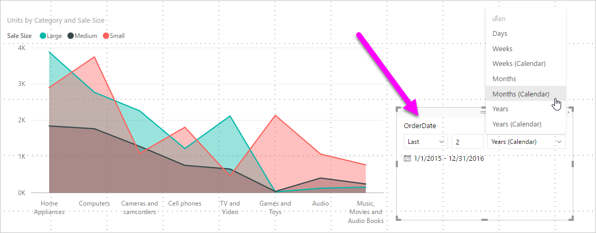
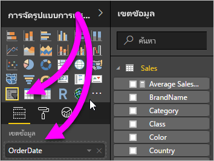
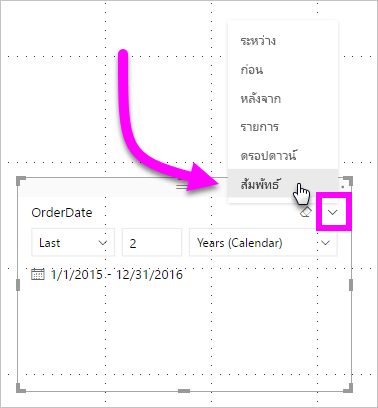
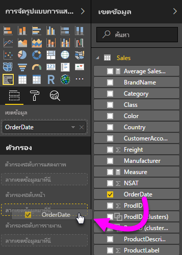
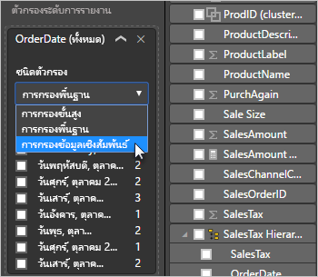
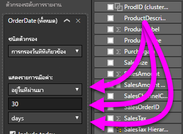

# การสร้างตัวแบ่งส่วนและตัวกรองวันที่แบบสัมพัทธ์ใน Power BICreating a relative date slicer and filter in Power BI

[!INCLUDE[consumer-appliesto-nyyn](../includes/consumer-appliesto-nyyn.md)]

ด้วย **ตัวแบ่งส่วนข้อมูลวันที่ที่สัมพันธ์** หรือ **ตัวกรองวันที่ี่ที่สัมพันธ์** คุณสามารถใช้ตัวกรองที่ยึดตามเวลากับคอลัมน์วันที่ใดก็ตามในแบบจำลองข้อมูลของคุณได้With the **relative date slicer** or **relative date filter**, you can apply time-based filters to any date column in your data model. ตัวอย่างเช่น คุณสามารถใช้ **ตัวแบ่งส่วนข้อมูลวันที่ที่เกี่ยวข้อง** เพื่อแสดงข้อมูลยอดขายเฉพาะที่เกิดขึ้นภายใน 30 วันที่ผ่านมา (หรือ เดือน, เดือนตามปฏิทิน ฯลฯ) ได้For example, you can use the **relative date slicer** to show only sales data that's happened within the last 30 days (or month, calendar months, and so on). เมื่อคุณรีเฟรชข้อมูล ช่วงเวลาสัมพัทธ์จะถูกปรับให้ใช้วันที่ที่เหมาะสมโดยอัตโนมัติWhen you refresh the data, the relative time period automatically applies the appropriate relative date constraint.

หากต้องการแชร์รายงานของคุณกับผู้ร่วมงาน Power BI คุณจะต้องมีสิทธิ์การใช้งาน Power BI Pro แต่ละรายการ หรือรายงานจะถูกบันทึกในความจุแบบพรีเมียมTo share your report with a Power BI colleague requires that you both have individual Power BI Pro licenses or that the report is saved in Premium capacity.

## ใช้ตัวแบ่งส่วนช่วงวันที่แบบสัมพัทธ์Create the relative date range slicer

คุณสามารถใช้ตัวแบ่งส่วนข้อมูลวันที่ที่สัมพันธ์ได้เช่นเดียวกับตัวแบ่งส่วนข้อมูลอื่น ๆYou can use the relative date slicer just like any other slicer. สร้างวิชวล **ตัวแบ่งส่วนข้อมูล** สำหรับรายงานของคุณ จากนั้นเลือกค่าวันที่สำหรับค่า **เขตข้อมูล**Create a **slicer** visual for your report and then select a date value for the **Field** value. ในรูปต่อไปนี้ เราได้เลือกเขตข้อมูล *OrderDate*In the following image, we selected the *OrderDate* field.

เลือกตัวแบ่งส่วนข้อมูลบนพื้นที่ทำงานของคุณ และกะรัตที่มุมบนด้านขวาของวิชวลตัวแบ่งส่วนข้อมูลSelect the slicer on your canvas and then the carat in the upper-right corner of the slicer visual. หากวิชวลนี้มีข้อมูลวันที่ เมนูจะแสดงตัวเลือกสำหรับ **สัมพัทธ์**If the visual has date data, the menu displays the option for **Relative**.

ตัวแบ่งส่วนข้อมูลวันที่ที่สัมพันธ์ เลือก *สัมพันธ์*For the relative date slicer, select *Relative*.

จากนั้นคุณสามารถเลือกการตั้งค่าดังกล่าวได้You can then select the settings.

สำหรับการตั้งค่าครั้งแรกใน *ตัวแบ่งส่วนข้อมูลวันที่ที่สัมพัทธ์* คุณมีตัวเลือกต่อไปนี้:For the first setting in the *relative date slicer*, you have the following choices:

* สุดท้ายLast
* ถัดไปNext
* นี้This

การตั้งค่าครั้งที่สอง (ตรงกลาง) ใน *ตัวแบ่งส่วนข้อมูลวันที่ที่สัมพัทธ์* ให้คุณสามารถระบุตัวเลขเพื่อกำหนดช่วงวันที่สัมพัทธ์ได้The second (middle) setting in the *relative date slicer* lets you enter a number to define the relative date range.

การตั้งค่าที่สาม ให้คุณเลือกหน่วยวัดวันที่The third setting lets you pick the date measurement. คุณมีตัวเลือกต่อไปนี้:You have the following choices:

* วันDays
* สัปดาห์Weeks
* สัปดาห์ (ปฏิทิน)Weeks (Calendar)
* เดือนMonths
* เดือน (ปฏิทิน)Months (Calendar)
* ปีYears
* ปี (ปฏิทิน)Years (Calendar)

หากคุณเลือก **เดือน** จากรายการ และป้อนตัวเลข *2* ในการตั้งค่าตรงกลาง นี่คือสิ่งที่จะเกิดขึ้น:If you select **Months** from that list, and enter *2* in the middle setting, here's what happens:

* ถ้าวันนี้คือวันที่ 20 กรกฎาคม:If today is July 20:

    - ข้อมูลที่รวมอยู่ในวิชวลที่จำกัดโดยตัวแบ่งส่วนข้อมูลจะแสดงข้อมูลสองเดือนก่อนหน้านี้The data included in visuals constrained by the slicer will show data for the previous two months,
    - เริ่มจากวันที่ 21 พฤษภาคมและไปจนถึงวันที่ 20 กรกฎาคม (วันที่ของวันนี้)Starting on May 21 and going through July 20 (today's date).

ในการเปรียบเทียบ ถ้าคุณเลือก *เดือน (ปฏิทิน)* วิชวลที่จำกัดจะแสดงข้อมูลจากวันที่ 1 พฤษภาคมถึงวันที่ 30 มิถุนายน (สองเดือนเต็มตามเดือนในปฏิทิน)In comparison, if you selected *Months (Calendar)*, the visuals constrained would show data from May 1 through June 30 (the last two complete calendar months).

## สร้างตัวกรองข้อมูลช่วงวันที่แบบสัมพัทธ์Create the relative date range filter

คุณยังสามารถสร้างตัวกรองช่วงวันที่สัมพัทธ์สำหรับหน้ารายงานของคุณ หรือทั้งรายงานของคุณได้You can also create a relative date range filter for your report page or your entire report. ในการทำเช่นนั้น ให้่ลากเขตข้อมูลวันที่ไปยังแหล่งข้อมูล **ตัวกรองระดับหน้า** หรือแหล่งข้อมูล **ตัวกรองระดับรายงาน** ในบานหน้าต่าง **เขตข้อมูล**:To do so, drag a date field into the **Page level filters** well or the **Report level filters** well in the **Field** pane:

เมื่อมี คุณสามารถเปลี่ยนช่วงวันที่ที่สัมพัทธ์Once there, you can change the relative date range. ซึ่งคล้ายกับวิธีการที่คุณสามารถกำหนด **ตัวแบ่งส่วนข้อมูลวันที่ที่สัมพันธ์** เองIt's similar to how you can customize the **relative date slicer**. เลือก **กรองข้อมูลวันที่ที่สัมพันธ์** จากดรอปดาวน์ **ชนิดตัวกรอง**Select **Relative date filtering** from the **Filter Type** drop-down.

เมื่อคุณเลือก **การกรองข้อมูลวันที่ที่สัมพัทธ์** แล้ว คุณจะเห็นสามส่วนที่จะเปลี่ยน ซึ่งรวมถึงกล่องตัวเลขตรงกลาง เช่นเดียวกับตัวแบ่งส่วนข้อมูลOnce you've selected **Relative date filtering**, you see three sections to change, including a middle numeric box, just like the slicer.

## ข้อจำกัดและข้อควรพิจารณาLimitations and considerations

ในขณะนี้ ข้อจำกัดและข้อควรพิจารณาดังต่อไปนี้นำไปใช้กับ **ตัวแบ่งส่วนข้อมูลช่วงวันที่ที่สัมพันธ์** และตัวกรองThe following limitations and considerations currently apply to the **relative date range slicer** and filter.

* ชนิดข้อมูลสำหรับเขตข้อมูลในตัวแบ่งส่วนข้อมูลจะต้องเป็นค่าวันที่ และไม่ตั้งค่าเริ่มต้นไว้เป็นข้อความThe data type for the field in the slicer must be a date, and not the default of text. มิฉะนั้น ตัวเลือกที่เกี่ยวข้องจะไม่แสดงขึ้นมาในตัวแบ่งส่วนข้อมูลOtherwise, the relative options don't show up in the slicer.
* แบบจำลองข้อมูลใน **Power BI** จะไม่รวมข้อมูลโซนเวลาData models in **Power BI** don't include time zone info. แบบจำลองสามารถจัดเก็บเวลาต่าง ๆ ได้ แต่จะไม่มีการระบุโซนเวลาที่แบบจำลองดังกล่าวอยู่The models can store times, but there's no indication of the time zone they're in.
* ตัวแบ่งส่วนข้อมูลและตัวกรองจะยึดตามเวลาใน UTCThe slicer and filter are always based on the time in UTC. หากคุณตั้งค่าตัวกรองในรายงาน และส่งไปยังเพื่อนร่วมงานในโซนเวลาอื่น คุณทั้งสองคนจะเห็นข้อมูลเดียวกันIf you set up a filter in a report and send it to a colleague in a different time zone, you both see the same data. หากคุณไม่ได้อยู่ในโซนเวลามาตรฐานสากล คุณและเพื่อนร่วมงานของคุณต้องคำนึงถึงการเผื่อเวลาทจะเกิดขึ้นกับคุณUnless you are in the UTC time zone, you and your colleague must account for the time offset you experience.
* คุณสามารถแปลงข้อมูลที่รวบรวมไว้ในโซนเวลาท้องถิ่นเป็น UTC ได้โดยใช้ **ตัวแก้ไขการสอบถาม**You can convert data captured in a local time zone to UTC using the **Query Editor**.

## ขั้นตอนถัดไปNext steps

- [ใช้ตัวแบ่งส่วนและตัวกรองเวลาแบบสัมพัทธ์ใน Power BIUse a relative time slicer and filter in Power BI](../create-reports/slicer-filter-relative-time.md)
- [ตัวแบ่งส่วนข้อมูลใน Power BISlicers in Power BI](power-bi-visualization-slicers.md)
