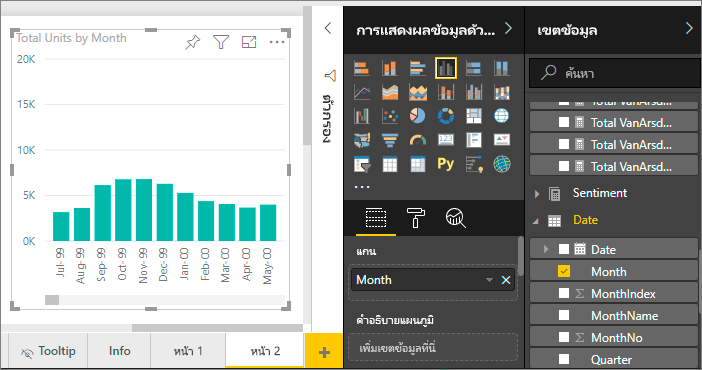
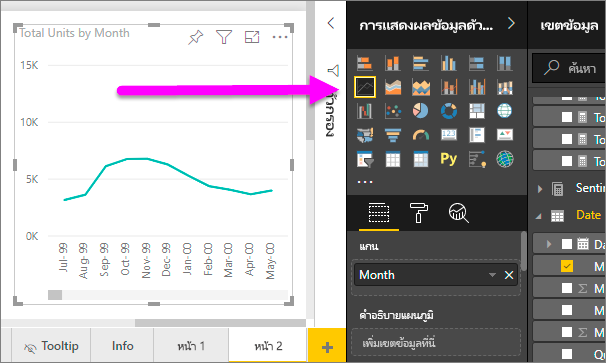
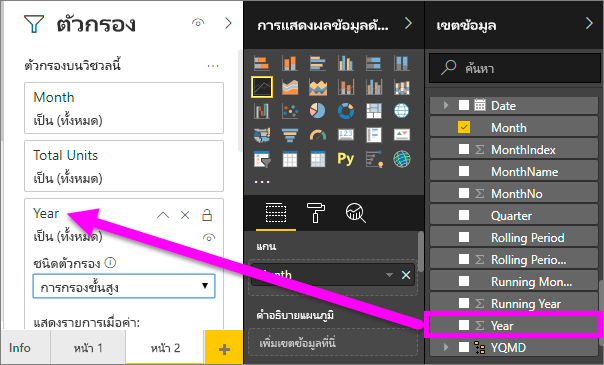
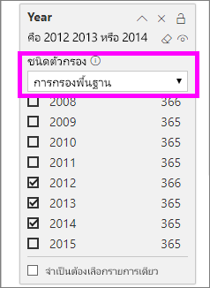
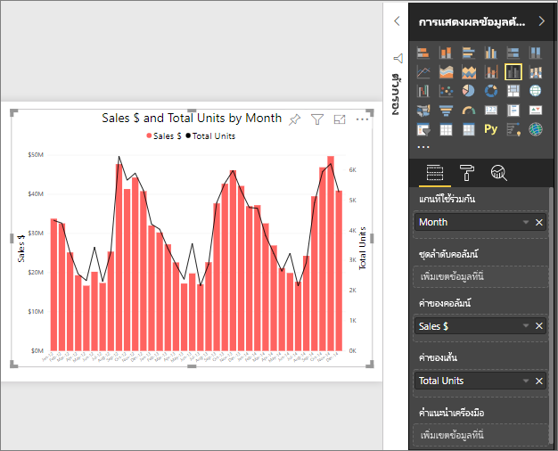
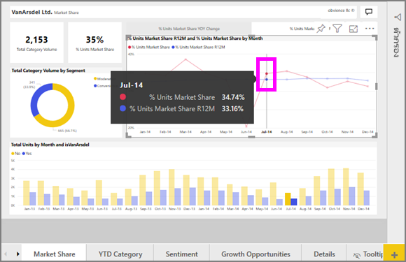

# แผนภูมิเส้นใน Power BILine charts in Power BI

[!INCLUDE[consumer-appliesto-nyyn](../includes/consumer-appliesto-nyyn.md)]

แผนภูมิเส้นคือ ชุดของจุดข้อมูลที่จะแสดงด้วยจุดและเชื่อมต่อด้วยเส้นตรงA line chart is a series of data points that are represented by dots and connected by straight lines. แผนภูมิเส้นอาจมีเส้นเดียวหรือหลายเส้นA line chart may have one or many lines. แผนภูมิเส้นมีแกน X และแกน YLine charts have an X and a Y axis. 

## สร้างแผนภูมิเส้นCreate a line chart
คำแนะนำเหล่านี้ใช้แอปตัวอย่างการขายและการตลาดเพื่อสร้างแผนภูมิเส้นที่แสดงยอดขายของปีนี้ตามประเภทThese instructions use the Sales and Marketing Sample app to create a line chart that displays this year's sales by category. หากต้องการทำตามขั้นตอน รับแอปตัวอย่างจาก appsource.comTo follow along, get the sample app from appsource.com.

> [!NOTE]
> การแชร์รายงานของคุณกับผู้ร่วมงาน Power BI กำหนดให้คุณต้องมีสิทธิ์การใช้งาน Power BI Pro แต่ละรายการ หรือรายงานจะถูกบันทึกในความจุแบบพรีเมียมSharing your report with a Power BI colleague requires that you both have individual Power BI Pro licenses or that the report is saved in Premium capacity.

1. เริ่มต้นบน หน้ารายงานเปล่าStart on a blank report page. หากคุณกำลังใช้บริการของ Power BI ตรวจสอบให้แน่ใจว่า คุณเปิดรายงานใน [มุมมองการแก้ไข](../create-reports/service-interact-with-a-report-in-editing-view.md)If you're using the Power BI service, make sure you open the report in [Editing View](../create-reports/service-interact-with-a-report-in-editing-view.md).

2. จากบานหน้าต่างเขตข้อมูล ให้เลือก **SalesFact** \> **ผลรวมหน่วย** และเลือก **วัน** > **เดือน**From the Fields pane, select **SalesFact** \> **Total units**, and select **Date** > **Month**.  Power BI สร้างแผนภูมิคอลัมน์บนพื้นที่รายงานของคุณPower BI creates a column chart on your report canvas.

    

4. แปลงเป็นแผนภูมิเส้น โดยการเลือกเทมเพลตแผนภูมิเส้นจากบานหน้าต่างการแสดงผลด้วยภาพConvert to a line chart by selecting the line chart template from the Visualizations pane. 

    
   

4. กรองแผนภูมิเส้นของคุณเพื่อแสดงข้อมูลสำหรับปี 2012-2014Filter your line chart to show data for the years 2012-2014. หากบานหน้าต่างตัวกรองของคุณยุบตัวอยู่ ให้ขยายในทันทีIf your Filters pane is collapsed, expand it now. จากบานหน้าต่างเขตข้อมูล ให้เลือก **วัน** \> **ปี** และลากไปที่บานหน้าต่างตัวกรองFrom the Fields pane, select **Date** \> **Year** and drag it onto the Filters pane. วางลงที่ใต้ **ตัวกรองส่วนหัวบนภาพนี้**Drop it under the heading **Filters on this visual**. 
     
    

    เปลี่ยนแปลง **ตัวกรองขั้นสูง** เป็น **ตัวกรองพื้นฐาน** และเลือก **2012**, **2013** และ **2014**Change **Advanced filters** to **Basic filters** and select **2012**, **2013** and **2014**.

    

6. อีกวิธีหนึ่ง คือ [ปรับขนาดและสีของข้อความในแผนภูมิ](power-bi-visualization-customize-title-background-and-legend.md)Optionally, [adjust the size and color of the chart's text](power-bi-visualization-customize-title-background-and-legend.md). 

    

## เพิ่มเส้นเพิ่มเติมลงในแผนภูมิAdd additional lines to the chart
แผนภูมิเส้นสามารถมีเส้นหลายเส้นที่แตกต่างกันLine charts can have many different lines. และ ในบางกรณี ค่าในเส้นต่างๆ อาจแตกต่างกันมากจนแสดงผลร่วมกันได้ไม่ดีAnd, in some cases, the values on the lines may be so divergent that they don't display well together. มาดูที่การเพิ่มแผนภูมิเส้นเพิ่มเติมไปยังแผนภูมิปัจจุบันของเรา และเรียนรู้วิธีการจัดรูปแบบแผนภูมิของเราเมื่อเมื่อค่าที่แสดงด้วยเส้นมีความแตกต่างกันมากLet's look at adding additional lines to our current chart and then learn how to format our chart when the values represented by the lines are very different. 

### เพิ่มเส้นเพิ่มเติมAdd additional lines
แทนที่จะดูผลรวมหน่วยสำหรับภูมิภาคทั้งหมดเป็นเส้นเดียวบนแผนภูมิ เราจะแยกหาผลรวมหน่วยตามภูมิภาคInstead of looking at total units for all regions as a single line on the chart, let's split out total units by region. เพิ่มเส้นเพิ่มเติมโดยการลาก **ภูมิศาสตร์** > **ภูมิภาค** ไปยังส่วนคำอธิบายแผนภูมิAdd additional lines by dragging **Geo** > **Region** to the Legend well.

   

### ใช้แกน Y สองแกนUse two Y axes
จะเป็นอย่างไรหากคุณต้องการดูยอดขายรวมและผลรวมหน่วยบนแผนภูมิเดียวกัน?What if you want to look at total sales and total units on the same chart? ตัวเลขยอดขายสูงกว่าจำนวนหน่วย ทำให้แผนภูมิเส้นไม่สามารถใช้งานได้Sales numbers are so much higher than unit numbers, making the line chart unusable. อันที่จริงแล้ว เส้นสีแดงสำหรับผลรวมหน่วยปรากฏเป็นศูนย์In fact, the red line for total units appears to be zero.

   

หากต้องการแสดงค่าที่แตกต่างกันมากบนแผนภูมิหนึ่งๆ ให้ใช้แผนภูมิผสมTo display highly diverging values on one chart, use a combo chart. คุณสามารถเรียนรู้เกี่ยวกับแผนภูมิผสมทั้งหมด โดยการอ่าน [แผนภูมิผสมใน Power BI](power-bi-visualization-combo-chart.md)You can learn all about combo charts by reading [Combo charts in Power BI](power-bi-visualization-combo-chart.md). ในตัวอย่างของเราด้านล่าง เราสามารถแสดงยอดขายและหน่วยทั้งหมด ร่วมกันบนแผนภูมิหนึ่งๆ โดยการเพิ่มแกน Y แกนที่สองIn our example below, we can display sales and total units together on one chart by adding a second Y axis. 

   

## การทำไฮไลท์และการกรองข้ามHighlighting and cross-filtering
สำหรับข้อมูลเกี่ยวกับการใช้บานหน้าต่างตัวกรอง โปรดดู[เพิ่มตัวกรองไปยังรายงาน](../create-reports/power-bi-report-add-filter.md)For information about using the Filters pane, see [Add a filter to a report](../create-reports/power-bi-report-add-filter.md).

การเลือกจุดข้อมูลบนแผนภูมิเส้น เป็นการไฮไลต์แบบเชื่อมโยงและกรองข้ามไปยังการแสดงภาพอื่น ๆ บนหน้ารายงาน และในทางกลับกัน การยกเลิกไฮไลต์จะเป็นการยกเลิกการกระทำดังกล่าวSelecting a data point on a line chart cross-highlights and cross-filters the other visualizations on the report page... and vice versa. หากต้องการปฏิบัติตาม ให้เปิดแท็บ **ตลาด**To follow along, open the **Market Share** tab.  

บนแผนภูมิเส้น จุดข้อมูลจุดเดียวคือจุดตัดของจุดใดจุดหนึ่งบนแกน Xและแกน YOn a line chart, a single data point is the intersection of a point on the X-axis and Y-axis. เมื่อคุณเลือกจุดข้อมูล Power BI จะเพิ่มเครื่องหมายเพื่อระบุว่าจุดใดจุดหนึ่ง (สำหรับเส้นเดียว) หรือจุดหลายจุด (ถ้ามีอย่างน้อยสองเส้น) เป็นแหล่งที่มาสำหรับการไฮไลท์ข้ามและกรองข้ามของการแสดงผลด้วยภาพฃอื่นๆ บนหน้ารายงานWhen you select a data point, Power BI adds markers indicating which point(for a single line) or points (if there are two or more lines) are the source for the cross-highlighting and cross-filtering of the other visuals on the report page. หากการแสดงผลด้วยภาพของคุณแน่นหนามาก Power BI จะเลือกจุดที่ใกล้กับจุดที่คุณคลิกภาพมากที่สุดIf your visual is very dense, Power BI will select the closest point to where you click on the visual.

ในตัวอย่างนี้ เราได้เลือกจุดข้อมูลที่ครอบคลุม: เดือนกรกฎาคม 2014 %ของส่วนแบ่งตลาดของหน่วย R12 เท่ากับ 33.16 และ %ของส่วนแบ่งตลาดของหน่วยเท่ากับ 34.74In this example, we've selected a data point that encompasses: July 2014, %Units Market Share R12 of 33.16 and %Units Market Share of 34.74.

โปรดสังเกตว่า แผนภูมิคอลัมน์จะมีการไฮไลต์ข้าม และเกจวัดมีการกรองแบบข้ามNotice how the column chart is cross-highlighted, and the gauge is cross-filtered.

เมื่อต้องการจัดการวิธีการที่แผนภูมิเน้นข้ามและกรองข้ามระหว่างกัน โปรดดู[การโต้ตอบแบบการแสดงภาพในรายงาน Power BI](../create-reports/service-reports-visual-interactions.md)To manage how charts cross-highlight and cross-filter each other, see [Visualization interactions in a Power BI report](../create-reports/service-reports-visual-interactions.md)

## ข้อควรพิจารณาและการแก้ไขปัญหาConsiderations and troubleshooting
* แผนภูมิเส้นหนึ่งไม่สามารถมีแกน Y คู่กันOne line chart cannot have dual Y axes.  คุณจะต้องใช้แผนภูมิผสมแทนYou'll need to use a combo chart instead.
* ในตัวอย่างข้างต้น แผนภูมิถูกจัดรูปแบบเพื่อเพิ่มขนาดฟอนต์ เปลี่ยนสีฟอนต์ เพิ่มชื่อแกน จัดกึ่งกลางชื่อแผนภูมิและคำอธิบายแผนภูมิ เริ่มต้นทั้งสองแกนที่ศูนย์ และอื่นๆIn the examples above, the charts were formatted to increase font size, change font color, add axis titles, center the chart title and legend, start both axes at zero, and more. บานหน้าต่างการจัดรูปแบบ (ไอคอนลูกกลิ้งทาสี) มีชุดตัวเลือกมากมายที่ใช้สำหรับการตกแต่งแผนภูมิของคุณให้เป็นแบบที่คุณต้องการThe Formatting pane (paint roller icon) has a seemingly endless set of options for making your charts look the way you want them to. วิธีดีที่สุดในการเรียนรู้คือเปิดบานหน้าต่างการจัดรูปแบบและสำรวจThe best way to learn is to open the Formatting pane and explore.

## ขั้นตอนถัดไปNext steps

[ชนิดการแสดงภาพใน Power BIVisualization types in Power BI](power-bi-visualization-types-for-reports-and-q-and-a.md)

