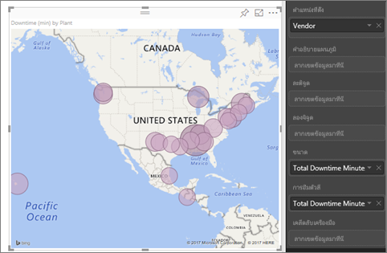
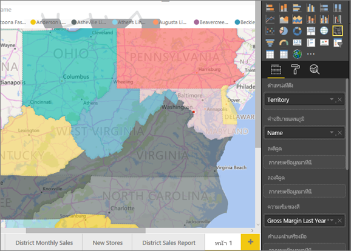
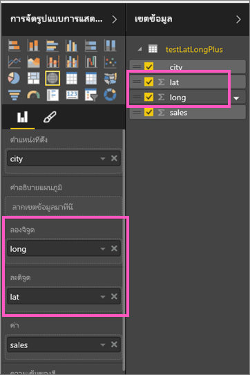
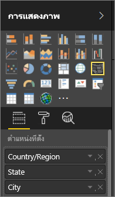
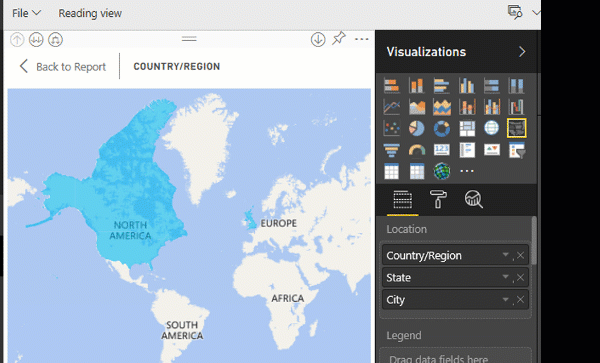

# เคล็ดลับและลูกเล่นในการแสดงข้อมูลแผนที่ Power BITips and tricks for Power BI map visualizations

[!INCLUDE[consumer-appliesto-nyyn](../includes/consumer-appliesto-nyyn.md)]    

Power BI รวมเข้ากับ Bing Maps เพื่อให้ได้ค่าเริ่มต้นพิกัดแมป (กระบวนการที่เรียกว่า การกำหนดรหัสทางภูมิศาสตร์) เพื่อให้คุณสร้างแผนที่ได้Power BI integrates with Bing Maps to provide default map coordinates (a process called geo-coding) so you can create maps. เมื่อทำงานร่วมกัน ส่วนเหล่านี้ใช้อัลกอริทึมในการระบุตำแหน่งที่ถูกต้อง แต่บางครั้งจะเป็นค่าคาดเดาที่ดีที่สุดTogether they use algorithms to identify the correct location, but sometimes it's a best guess. หาก Power BI ลองทำแล้วไม่สามารถสร้างการแสดงภาพของแผนที่ได้ด้วยตนเอง ระบบจะแสดงรายการความช่วยเหลือของ Bing MapsIf Power BI tries, but can't create the map visualization on its own, it enlists the help of Bing Maps. 

คุณหรือผู้ดูแลระบบของคุณอาจจำเป็นต้องอัปเดตไฟร์วอลล์ของคุณเพื่ออนุญาตให้เข้าถึง URL ที่ Bing ใช้สำหรับการกำหนดพิกัดทางภูมิศาสตร์You, or your administrator, may need to update your firewall to allow access to the URLs Bing uses for geocoding.  URL เหล่านั้นคือ:Those URLs are:
* https://dev.virtualearth.net/REST/V1/Locations
* https://platform.bing.com/geo/spatial/v1/public/Geodata
* https://www.bing.com/api/maps/mapcontrol

เพื่อเพิ่มแนวโน้มการกำหนดรหัสทางภูมิศาสตร์ที่ถูกต้อง ให้ใช้เคล็ดลับต่อไปนี้To increase the likelihood of correct geo-coding, use the following tips. เคล็ดลับชุดแรกเพื่อให้คุณใช้หากคุณสามารถเข้าถึงชุดข้อมูลได้The first set of tips is for you to use if you have access to the dataset itself. ชุดที่สองของเคล็ดลับนี้คือสิ่งที่คุณสามารถทำได้ใน Power BI ถ้าคุณไม่สามารถเข้าถึงชุดข้อมูลได้The second set of tips is things you can do in Power BI if you don't have access to the dataset. 

## สิ่งที่จะถูกส่งไปยัง Bing Maps aคืออะไร?What is sent to Bing Maps?
บริการ Power BI และ Power BI Desktop ส่งข้อมูลทางภูมิศาสตร์ไปยัง Bing เนื่องจากจำเป็นในการสร้างการแสดงผลข้อมูลด้วยภาพแบบแผนที่The Power BI service and Power BI Desktop send Bing the geo data it needs to create the map visualization. ซึ่งอาจรวมถึงข้อมูลในบักเก็ต **ตำแหน่ง**, **ละติจูด** และ **ลองจิจูด** ของพื้นที่เขตข้อมูลของวิชวลThis may include the data in the **Location**, **Latitude**, and **Longitude** buckets of the visual's field well. แน่นอนว่าสิ่งที่ส่งไปจะส่งแตกต่างกันตามชนิดของแผนที่Exactly what is sent varies by map type. เมื่อต้องการเรียนรู้เพิ่มเติม ดู[ความเป็นส่วนตัว Bing Maps](https://go.microsoft.com/fwlink/?LinkID=248686)To learn more, see [Bing Maps privacy](https://go.microsoft.com/fwlink/?LinkID=248686).

* สำหรับแผนที่ (แผนที่แบบฟอง กระจาย และลงจุด) ถ้ามีละติจูดและลองจิจูดให้ จะไม่มีการส่งข้อมูลไปยัง BingFor maps (bubble, scatter, and dot plot maps), if latitude and longitude are provided, then no data is sent to Bing. มิเช่นนั้นข้อมูลใดก็ตามในบักเก็ต **ตำแหน่ง** จะถูกส่งไปยัง BingOtherwise, any data in the **Location** bucket is sent to Bing.     

* แผนที่แถบสีจำเป็นต้องมีเขตข้อมูลใน **ท** ี ่ฝากข้อมูลตำแหน่งที่ตั้ง: แม้ว่ามีละติจูดและลองจิจูดให้Filled maps require a field in the **Location** bucket; even if latitude and longitude are provided. ข้อมูลใดก็ตามที่อยู่ในที่ฝากข้อมูล **ตำแหน่งที่ตั้ง** **ละจิจูด₹** หรือ **ลองจิจูด** จะถูกส่งไปยัง BingWhatever data is in the **Location**, **Latitude**, or **Longitude** bucket is sent to Bing.
  
    ในตัวอย่างด้านล่าง เขตข้อมูล **ผู้จัดจำหน่าย** กำลังถูกใช้สำหรับการกำหนดรหัสทางภูมิศาสตร์ ดังนั้นค่าในคอลัมน์ผู้จัดจำหน่ายจะถูกส่งไปยัง BingIn the example below, the field **Vendor** is being used for geo-coding, so the values in the Vendor column are sent to Bing. ข้อมูลจากบักเก็ต **ขนาด** และ **ความเข้มสี** จะถูกส่งไปยัง BingData from the **Size** and **Color saturation** buckets is not sent to Bing.
  
    
  
    ในตัวอย่างที่สองด้านล่าง เขตข้อมูล **ดินแดน** กำลังถูกใช้สำหรับการกำหนดรหัสทางภูมิศาสตร์ ดังนั้นค่าในคอลัมน์ดินแดนจะถูกส่งไปยัง BingIn this second example below, the field **Territory** is being used for geo-coding, so the values in the Territory column are sent to Bing. ข้อมูลจากบักเก็ต **คำอธิบายแผนภูมิ** และ **ความเข้มสี** จะถูกส่งไปยัง BingData from the **Legend** and **Color saturation** buckets is not sent to Bing.
  
    

## ในชุดข้อมูล: เคล็ดลับในการปรับปรุงในชุดข้อมูลเบื้องต้นIn the dataset: tips to improve the underlying dataset
ถ้าคุณสามารถเข้าถึงชุดข้อมูลที่กำลังถูกใช้เพื่อสร้างการแสดงภาพของแผนที่ได้ มีบางสิ่งที่คุณสามารถทำได้เพื่อเพิ่มแนวโน้มความถูกต้องในการกำหนดรหัสทางภูมิศาสตร์If you have access to the dataset that is being used to create the map visualization, there are a few things you can do to increase the likelihood of correct geo-coding.

**1. จัดประเภทเขตข้อมูลทางภูมิศาสตร์ใน Power BI Desktop****1. Categorize geographic fields in Power BI Desktop**

ใน Power BI Desktop คุณสามารถตรวจให้แน่ใจได้ว่าเขตข้อมูลมีการเขียนรหัสทางภูมิศาสตร์อย่างถูกต้องหรือไม่โดยการตั้งค่า *ประเภทข้อมูล* บนเขตข้อมูลได้In Power BI Desktop, you can ensure fields are correctly geo-coded by setting the *Data Category* on the data fields. ในมุมมองข้อมูล ให้เลือกคอลัมน์ที่ต้องการIn Data view, select the desired column. จากริบบอน ให้เลือกแท็บ **การสร้างแบบจำลอง** และจากนั้นตั้งค่า **หมวดหมู่ข้อมูล** ไปจนถึง **ที่อยู่** **เมือง** **ทวีป** **ประเทศ/ภูมิภาค** **เขต** **รหัสไปรษณีย์** **รัฐ** หรือ **จังหวัด**From the ribbon, select the **Modeling** tab and then set the **Data Category** to **Address**, **City**, **Continent**, **Country/Region**, **County**, **Postal Code**, **State** or **Province**. ประเภทข้อมูลเหล่านี้ช่วย Bing ให้เข้ารหัสวันที่อย่างถูกต้องThese data categories help Bing correctly encode the date. เมื่อต้องการเรียนรู้เพิ่มเติม ดู[จัดประเภทข้อมูลใน Power BI Desktop](../transform-model/desktop-data-categorization.md)To learn more, see [Data categorization in Power BI Desktop](../transform-model/desktop-data-categorization.md). ถ้าคุณกำลังเชื่อมต่อกับ SQL Server Analysis Services สด คุณจะต้องตั้งค่าการจัดประเภทข้อมูลภายนอก Power BI โดยใช้ [SQL Server Data Tools (SSDT)](/sql/ssdt/download-sql-server-data-tools-ssdt)If you are live connecting to SQL Server Analysis Services, you will need to set the data categorization outside of Power BI using [SQL Server Data Tools (SSDT)](/sql/ssdt/download-sql-server-data-tools-ssdt).

**2. ใช้มากกว่าหนึ่งคอลัมน์ตำแหน่งที่ตั้ง**  **2. Use more than one location column.**    
 บางครั้ง การตั้งค่าประเภทข้อมูลสำหรับการทำแผนที่ไม่เพียงพอสำหรับ Bing ในการคาดเดาจุดประสงค์ของคุณอย่างถูกต้องSometimes, even setting the data categories for mapping isn't enough for Bing to correctly guess your intent. บางการตั้งชื่อไม่ชัดเจนเนื่องจากตำแหน่งที่ตั้งมีอยู่ในหลายประเทศหรือภูมิภาคSome designations are ambiguous because the location exists in multiple countries or regions. ตัวอย่างเช่นมี \**_Southampton_* _ ใน England, Pennsylvania และ New YorkFor example, there's a \**_Southampton_* _ in England, Pennsylvania, and New York.

Power BI ใช้[บริการเทมเพลต URL ไม่มีโครงสร้าง](/bingmaps/rest-services/locations/find-a-location-by-address)ของ Bing ในการรับพิกัดละติจูดและลองจิจูดโดยยึดตามชุดของค่าที่อยู่สำหรับประเทศใด ๆPower BI uses Bing's [unstructured URL template service](/bingmaps/rest-services/locations/find-a-location-by-address) to get the latitude and longitude coordinates based on a set of address values for any country. ถ้าข้อมูลของคุณมีข้อมูลตำแหน่งที่ตั้งไม่เพียงพอ ให้เพิ่มคอลัมน์เหล่านั้น และจัดประเภทอย่างเหมาะสมIf your data doesn't contain enough location data, add those columns and categorize them appropriately.

 ตัวอย่างเช่น ถ้าคุณมีคอลัมน์ City, Bing อาจสามารถกำหนดรหัสทางภูมิศาสตร์ได้ยากFor example, if you only have a City column, Bing may have a hard time geo-coding. เพิ่มคอลัมน์สำหรับภูมิศาสตร์เพื่อทำให้ตำแหน่งที่ตั้งที่ชัดเจนขึ้นAdd additional geo columns to make the location unambiguous.  ในบางครั้ง สิ่งที่เราต้องทำคือเพียงแค่หนึ่งเพิ่มคอลัมน์ตำแหน่งที่ตั้งไปยังชุดข้อมูล ซึ่งในกรณีนี้เป็นรัฐ/จังหวัดSometimes all it takes is adding one more location column to the dataset - in this case state/province. และอย่าลืมจัดประเภทอย่างเหมาะสม ดู #1 ด้านบนAnd don't forget to categorize it properly, see #1 above.

ตรวจสอบให้แน่ใจว่าแต่ละเขตข้อมูลมีหมวดหมู่ตำแหน่งที่ตั้งเดียวเท่านั้นMake sure each field only has a single location category. ตัวอย่างเช่น เขตข้อมูลตำแหน่ง City ของคุณควรเป็น _*Southampton*\* ไม่ใช่ **Southampton, New York**For example, your City location field should be _\*Southampton\*\*, not **Southampton, New York**.  และเขตข้อมูลที่อยู่ตำแหน่งที่ตั้งควรเป็น **1 Microsoft Way** และไม่ใช่ **1 Microsoft Way Redmond, WA**And Address location fields should be **1 Microsoft Way** and not **1 Microsoft Way, Redmond, WA**.

**3. ใช้ละติจูดและลองจิจูดที่เฉพาะเจาะจง****3. Use specific Latitude and Longitude**

เพิ่มค่าละติจูดและลองจิจูดลงในชุดข้อมูลของคุณAdd latitude and longitude values to your dataset. ขั้นตอนนี้ลบและส่งกลับผลลัพธ์ใด ๆ ที่กำกวมได้รวดเร็วขึ้นThis removes any ambiguity and returns results more quickly. เขตข้อมูลละติจูดและลองจิจูดต้องอยู่ในรูปแบบ *เลขทศนิยม* ซึ่งคุณสามารถตั้งค่าได้ในตัวแบบข้อมูลLatitude and Longitude fields must be in *Decimal Number* format, which you can set in the data model.

<iframe width="560" height="315" src="https://www.youtube.com/embed/ajTPGNpthcg" frameborder="0" allowfullscreen></iframe>

**4. ใช้ประเภท สถานที่ สำหรับคอลัมน์ที่มีข้อมูลตำแหน่งที่ตั้งเต็ม****4. Use Place category for columns with full location information**

ขณะที่เราแนะนำให้คุณใช้ลำดับชั้นทางภูมิศาสตร์ในแผนที่ของคุณ ถ้าคุณต้องใช้คอลัมน์ตำแหน่งที่ตั้งเดียวกับข้อมูลทางภูมิศาสตร์แบบเต็มรูปแบบ คุณสามารถตั้งค่าการจัดประเภทข้อมูลเป็น **สถานที่** ได้While we encourage you to use geo-hierarchies in your maps, if you must use a single location column with full geographical information, you can set the data categorization to **Place**. ตัวอย่างเช่น ถ้าข้อมูลในคอลัมน์ของคุณเป็นที่อยู่เต็ม เช่น 1 Microsoft Way, Redmond Washington 98052 ประเภทข้อมูลแบบทั่วไปนี้จะทำงานได้ที่ดีที่สุดกับ BingFor example, if the data in your column is full addresses, such as 1 Microsoft Way, Redmond Washington 98052, this generalized data category will work best with Bing. 

## ใน Power BI: เคล็ดลับเพื่อให้ได้ผลลัพธ์ที่ดียิ่งขึ้นเมื่อใช้การแสดงภาพแผนที่In Power BI: tips to get better results when using map visualizations
**1. ใช้เขตข้อมูลละติจูดและลองจิจูด (ถ้ามี)****1. Use latitude and longitude fields (if they exist)**

ใน Power BI ถ้าคุณชุดข้อมูลที่คุณกำลังใช้อยู่มีเขตข้อมูลสำหรับลองจิจูดและละติจูด ให้ใช้ข้อมูลำหรับลองจิจูดและละติจูดนี้!In Power BI, if the dataset you are using has fields for longitude and latitude -- use them!  Power BI มีบักเก็ตพิเศษเพื่อช่วยทำให้ข้อมูลแผนที่ชัดเจนยิ่งขึ้นPower BI has special buckets to help make the map data unambiguous. เพียงแค่ลากเขตข้อมูลที่ประกอบด้วยข้อมูลละติจูดของคุณลงในพื้นที่ **การแสดงภาพ > ละติจูด**Just drag the field that contains your latitude data into the **Visualizations > Latitude** area.  และทำเช่นเดียวกันสำหรับข้อมูลลองจิจูดของคุณAnd do the same for your longitude data. เมื่อคุณทำขั้นตอนนี้ คุณยังจำเป็นต้องเติมเขตข้อมูล *ตำแหน่งที่ตั้ง* เมื่อสร้างการแสดงภาพของคุณWhen you do this, you also need to fill the *Location* field when creating your visualizations. มิฉะนั้น ข้อมูลจะถูกรวมตามค่าเริ่มต้น ตัวอย่างเช่น ละติจูดและลองจิจูดควรจะจับคู่ที่ระดับรัฐ ไม่ใช่ระดับเมืองOtherwise, the data is aggregated by default, so for example, the latitude and longitude would be paired at the state level, not the city level.

 

## ใช้ลำดับชั้นทางภูมิศาสตร์เพื่อให้คุณสามารถเข้าถึงรายละเอียด "ระดับต่าง ๆ" ของตำแหน่งที่ตั้งได้Use geo-hierarchies so you can drill down to different "levels" of location
เมื่อชุดข้อมูลของคุณมีระดับต่าง ๆ ของข้อมูลตำแหน่งที่ตั้งอยู่แล้ว คุณและเพื่อนร่วมงานของคุณสามารถใช้ Power BI เพื่อสร้าง *ลำดับชั้นทางภูมิศาสตร์* ได้When your dataset already has different levels of location data, you and your colleagues can use Power BI to create *geo-hierarchies*. เมื่อต้องการทำเช่นนั้น ลากเขตข้อมูลมากกว่าหนึ่งรายการไปยังบักเก็ต **ตำแหน่งที่ตั้ง**To do this, drag more than one field into the **Location** bucket. โดยใช้ร่วมกันด้วยวิธีนี้ จะทำให้เขตข้อมูลต่าง ๆ กลายเป็นลำดับชั้นทางภูมิศาสตร์Used together in this way, the fields become a geo-hierarchy. ในตัวอย่างด้านล่างนี้ เราได้เพิ่มเขตข้อมูลทางภูมิศาสตร์สำหรับ: ประเทศ/ภูมิภาค รัฐ และเมืองIn the example below we have added geo fields for: Country/Region, State, and City. ใน Power BI คุณและเพื่อนร่วมงานของคุณสามารถเจาะขึ้นและลงได้โดยใช้ลำดับชั้นทางภูมิศาสตร์นี้In Power BI you and your colleagues can drill up and down using this geo-hierarchy.

  

   

เมื่อเข้าถึงรายละเอียดด้วยลำดับชั้นทางภูมิศาสตร์ สิ่งสำคัญคือต้องทราบวิธีการทำงานของแต่ละปุ่มเจาะลึกรายละเอียดและสิ่งส่งไปยัง Bing MapsWhen drilling with geo-hierarchies, it is important to know how each drill button works and what gets sent to Bing Maps. 

* ปุ่มเจาะรายละเอียดทางด้านขวาสุด ที่เรียกว่าโหมดเจาะรายละเอียดThe drill button on the far right, called Drill Mode  ช่วยให้คุณสามารถแมปตำแหน่งที่ตั้ง และเจาะลึกลงในตำแหน่งที่ตั้งดังกล่าวนั้นหนึ่งระดับในแต่ละครั้ง, allows you to select a map Location and drill down into that specific location one level at a time. ตัวอย่างเช่น หากคุณเปิดใช้งานดูรายละเอียดแบบเจาะลึกและคลิกที่อเมริกาเหนือคุณจะเลื่อนลงตามลำดับชั้นไปยังระดับถัดไป -- รัฐในอเมริกาเหนือFor example, if you turn Drill down on and click North America, you move down in the hierarchy to the next level -- states in North America. สำหรับการกำหนดรหัสทางภูมิศาสตร์ Power BI ส่งข้อมูลประเทศและรัฐสำหรับอเมริกาเหนือไปยัง Bing MapsFor geo-coding, Power BI sends Bing Maps country and state data for North America only.  
* ทางด้านซ้ายมีตัวเลือกการดูรายละเอียดในแนวลึกอื่น ๆ 2 ตัวเลือกOn the left there are 2 other drill options. ตัวเลือกแรกThe first option,  เจาะรายละเอียดระดับถัดไปของลำดับชั้นสำหรับทุกตำแหน่งที่ตั้งในครั้งเดียว, drills to the next level of the hierarchy for all locations at once. ตัวอย่างเช่น ถ้าคุณกำลังดูที่ระดับประเทศ จากนั้นให้ใช้ตัวเลือกนี้ย้ายไปยังระดับถัดไปนั่นคือ รัฐ Power BI จะแสดงข้อมูลสถานะสำหรับทุกประเทศFor example, if you are currently looking at countries and then use this option to move to the next level, states, Power BI displays state data for all countries. สำหรับการกำหนดรหัสทางภูมิศาสตร์ Power BI ส่งข้อมูลรัฐ (ไม่ใช่ข้อมูลประเทศ) ไปยัง Bing Maps สำหรับตำแหน่งที่ตั้งทั้งหมดFor geo-coding, Power BI sends Bing Maps state data (no country data) for all locations. ตัวเลือกนี้จะเป็นประโยชน์ถ้าแต่ละระดับของลำดับชั้นของคุณไม่เกี่ยวข้องกับระดับที่สูงกว่าThis option is useful if each level of your hierarchy is unrelated to the level above it. 
* ตัวเลือกที่สองThe second option,  คล้ายกับการดูรายละเอียดแบบเจาะลึก ยกเว้นว่าคุณไม่จำเป็นต้องคลิกบนแผนที่, is similar to drill down, except that you don't need to click on the map.  ระบบจะขยายลงไปที่ระดับถัดไปของลำดับชั้นโดยจดจำบริบทของระดับปัจจุบันIt expands down to the next level of the hierarchy remembering the current level's context. ตัวอย่างเช่น ถ้าคุณกำลังอยู่ในระดับประเทศและเลือกไอคอนนี้ คุณเลื่อนลงในลำดับชั้นไปยังระดับถัดไป - รัฐFor example, if you are currently looking at countries and select this icon, you move down in the hierarchy to the next level -- states. สำหรับการกำหนดรหัสทางภูมิศาสตร์ Power BI ส่งข้อมูลสำหรับแต่ละรัฐและประเทศที่สอดคล้อง เพื่อช่วยให้การกำหนดรหัสทางภูมิศาสตร์ของ Bing Maps ทำได้แม่นยำมากขึ้นFor geo-coding, Power BI sends data for each state and its corresponding country to help Bing Maps geocode more accurately. ในแผนที่ส่วนใหญ่ คุณจะใช้ตัวเลือกนี้หรือตัวเลือกการดูรายละเอียดแบบเจาะลึก ทางด้านขวาสุด เพื่อให้คุณสามารถส่งข้อมูล Bing ให้มากที่สุดเพื่อรับข้อมูลตำแหน่งที่ถูกต้องIn most maps, you will use either this option or the drill down option on the far right, so you can send Bing as much information as possible to get accurate location information. 

## ขั้นตอนถัดไปNext steps
[ดูรายละเอียดแนวลึกในการแสดงภาพใน Power BIDrill down in a Power BI visualization](../consumer/end-user-drill.md)

[การแสดงผลข้อมูลด้วยภาพของ Power BIPower BI visualizations](power-bi-report-visualizations.md)

มีคำถามเพิ่มเติมหรือไม่More questions? [ลองไปที่ชุมชน Power BITry the Power BI Community](https://community.powerbi.com/)