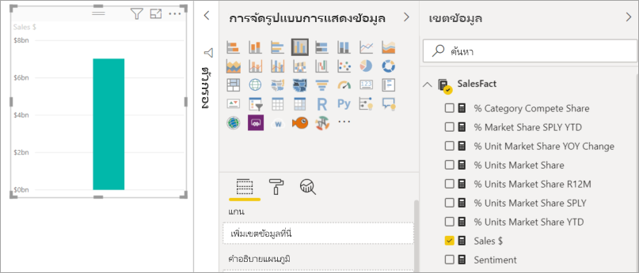
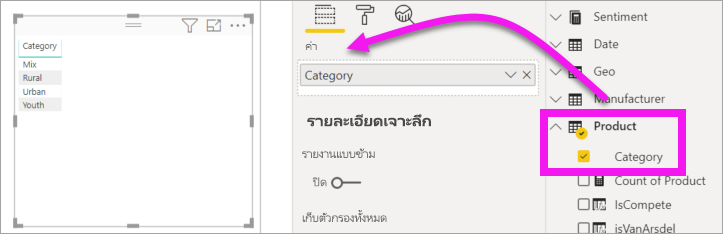
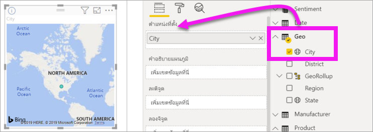
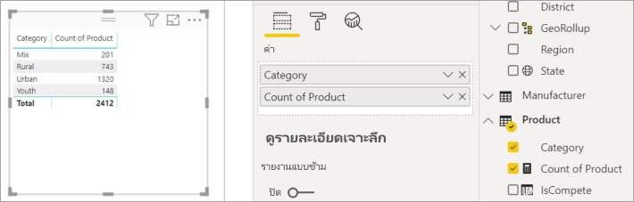
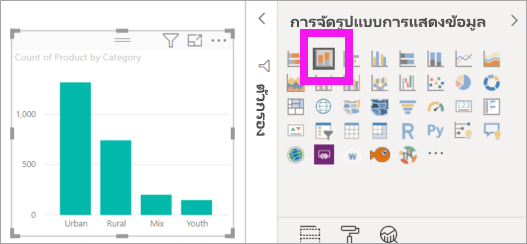
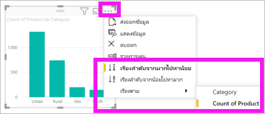

# เพิ่มวิชวลไปยังรายงาน Power BI (ตอนที่ 1)Add visuals to a Power BI report (part 1)

[!INCLUDE[consumer-appliesto-nyyn](../includes/consumer-appliesto-nyyn.md)]    

[!INCLUDE [power-bi-visuals-desktop-banner](../includes/power-bi-visuals-desktop-banner.md)]

บทความนี้ให้คำแนะนำสั้น ๆ สำหรับการสร้างวิชวลในรายงานThis article gives a quick introduction to creating a visualization in a report. รายงานสามารถใช้ได้ทั้งบริการของ Power BI และ Power BI DesktopIt applies to both the Power BI service and Power BI Desktop. สำหรับเนื้อหาขั้นสูง ให้ดูที่ [ส่วนที่ 2](power-bi-report-add-visualizations-ii.md)ของชุดข้อมูลนี้For more-advanced content, [see Part 2](power-bi-report-add-visualizations-ii.md) of this series.

## ข้อกำหนดเบื้องต้นPrerequisites

บทช่วยสอนนี้ใช้ [ไฟล์ PBIX ตัวอย่างการขายและการตลาด](https://download.microsoft.com/download/9/7/6/9767913A-29DB-40CF-8944-9AC2BC940C53/Sales%20and%20Marketing%20Sample%20PBIX.pbix)This tutorial uses the [Sales & marketing PBIX file](https://download.microsoft.com/download/9/7/6/9767913A-29DB-40CF-8944-9AC2BC940C53/Sales%20and%20Marketing%20Sample%20PBIX.pbix).

1. จากด้านบนซ้ายของแถบเมนู Power BI Desktop เลือก **ไฟล์** > **เปิด**From the upper left section of the Power BI Desktop menu bar, select **File** > **Open**
   
2. ค้นหาสำเนาของ **ไฟล์ PBIX ตัวอย่างการขายและการตลาด** ของคุณFind your copy of the **Sales and marketing sample PBIX file**

1. เปิด **ไฟล์ PBIX ตัวอย่างการขายและการตลาด** ในมุมมองรายงาน Open the **Sales and marketing sample PBIX file** in report view .

1. เลือกSelect  หากต้องการเพิ่มหน้าใหม่to add a new page.

> [!NOTE]
> การแชร์รายงานของคุณกับผู้ร่วมงาน Power BI กำหนดให้คุณต้องมีสิทธิ์การใช้งาน Power BI Pro แต่ละรายการ หรือรายงานจะถูกบันทึกในความจุแบบพรีเมียมSharing your report with a Power BI colleague requires that you both have individual Power BI Pro licenses or that the report is saved in Premium capacity. ดู [การแชร์รายงาน](../collaborate-share/service-share-reports.md)See [sharing reports](../collaborate-share/service-share-reports.md)

## เพิ่มการแสดงภาพลงในรายงานAdd visualizations to the report

1. สร้างการแสดงภาพ โดยการเลือกเขตข้อมูลจากบานหน้าต่าง **เขตข้อมูล** บานหน้าต่างCreate a visualization by selecting a field from the **Fields** pane.

    เริ่มต้นด้วยเขตข้อมูลตัวเลข เช่น **Sales** > **TotalSales**Start with a numeric field like **Sales** > **TotalSales**. Power BI จะสร้างแผนภูมิคอลัมน์ที่มีคอลัมน์เดียวPower BI creates a column chart with a single column.

    

    หรือ เริ่มต้น ด้วยประเภทของเขตข้อมูลเช่น **ชื่อ** หรือ **ผลิตภัณฑ์**Or, start with a category field, such as **Name** or **Product**. Power BI สร้างตารางและเพิ่มเขตข้อมูลนั้นไปยังส่วนที่เป็น **ค่าตัวเลข** ด้วยเช่นกันPower BI creates a table and adds that field to the **Values** well.

    

    หรือเริ่มต้น ด้วยเขตข้อมูลภูมิศาสตร์เช่น **ภูมิศาสตร์** > **เมือง**Or, start with a geography field, such as **Geo** > **City**. Power BI และ Bing Maps จะสร้างการแสดงภาพแผนที่ให้Power BI and Bing Maps create a map visualization.

    

## เปลี่ยนชนิดของการแสดงผลข้อมูลด้วยภาพChange the type of visualization

 สร้างการแสดงภาพ แล้วเปลี่ยนชนิดของการแสดงภาพนั้นCreate a visualization and then change its type. 
 
 1. เลือก **ผลิตภัณฑ์** > **ประเภท** จากนั้น **ผลิตภัณฑ์**  >  **จำนวนผลิตภัณฑ์** เพื่อเพิ่มไปยัง **ค่า**Select **Product** > **Category** and then **Product** > **Count of Product** to add them both to the **Values** well.

    

1. เปลี่ยนการแสดงภาพเป็นในแผนภูมิคอลัมน์ โดยการเลือกไอคอน **แผนภูมิคอลัมน์แบบเรียงซ้อน**Change the visualization to a column chart by selecting the **Stacked column chart** icon.

   

1. เมื่อต้องการเปลี่ยนวิธีการเรียงลำดับวิชวล ให้เลือก **การดำเนินการเพิ่มเติม** (...)  ใช้ตัวเลือกการเรียงลำดับเพื่อเปลี่ยนทิศทางของการเรียงลำดับ (จากน้อยไปหามากหรือมากไปหาน้อย) และเปลี่ยนคอลัมน์ที่ใช้ในการเรียงลำดับ (**เรียงลำดับตาม**)To change the way the visual is sorted, select **More actions** (...).  Use the sort options to change the direction of the sort (ascending or descending) and change the column being used to sort (**Sort by**).

   
  
## ขั้นตอนถัดไปNext steps

 ไปต่อยัง:Continue on to:

* [ส่วนที่ 2: เพิ่มภาพไปยังรายงาน Power BIPart 2: Add visualizations to a Power BI report](power-bi-report-add-visualizations-ii.md)

* [โต้ตอบกับการแสดงภาพ](../consumer/end-user-reading-view.md)ในรายงาน[Interact with the visualizations](../consumer/end-user-reading-view.md) in the report.
