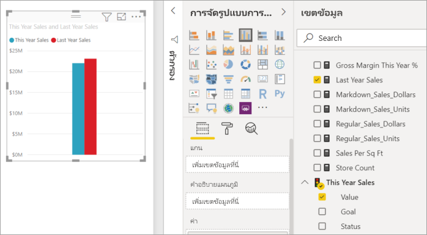
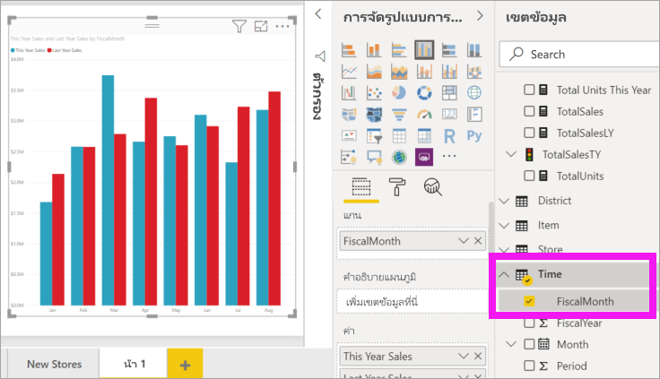
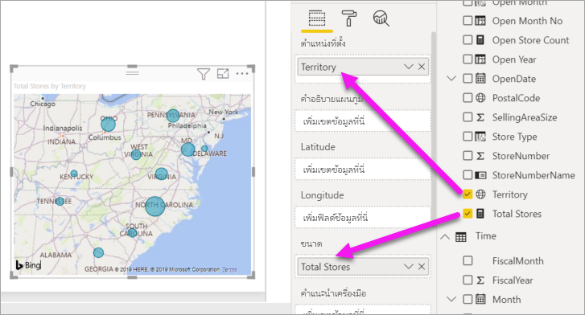
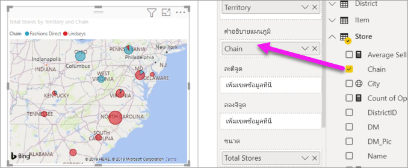

# เพิ่มวิชวลไปยังรายงาน Power BI (ตอนที่ 2)Add visuals to a Power BI report (part 2)

[!INCLUDE[consumer-appliesto-nyyn](../includes/consumer-appliesto-nyyn.md)]    

[!INCLUDE [power-bi-visuals-desktop-banner](../includes/power-bi-visuals-desktop-banner.md)]

ใน[ส่วนที่ 1](power-bi-report-add-visualizations-i.md) คุณได้สร้างภาพพื้นฐานแล้วโดยการเลือกกล่องข้อความถัดจากชื่อเขตข้อมูลIn [Part 1](power-bi-report-add-visualizations-i.md), you created a basic visualization by selecting checkboxes next to field names.  ในส่วนที่ 2 คุณจะได้เรียนรู้วิธีใช้การลากและวาง และใช้บานหน้าต่าง **เขตข้อมูล** และ **การแสดงผลข้อมูลด้วยภาพ** เต็มรูปแบบเพื่อสร้างและปรับเปลี่ยนการแสดงผลข้อมูลด้วยภาพIn Part 2, you'll learn how to use drag-and-drop and make full use of the **Fields** and **Visualizations** panes to create and modify visualizations.

## สร้างการแสดงภาพใหม่Create a new visualization
ในบทช่วยสอนนี้ เราจะเจาะลึกลงในชุดข้อมูลการวิเคราะห์ร้านค้าปลีก และสร้างการแสดงผลข้อมูลด้วยภาพที่สำคัญสองถึงสามวิชวลIn this tutorial, we'll dig into our Retail Analysis dataset and create a few key visualizations.

## ข้อกำหนดเบื้องต้นPrerequisites

บทช่วยสอนนี้ใช้ [ไฟล์ PBIX ตัวอย่างการวิเคราะห์การค้าปลีก](https://download.microsoft.com/download/9/6/D/96DDC2FF-2568-491D-AAFA-AFDD6F763AE3/Retail%20Analysis%20Sample%20PBIX.pbix)This tutorial uses the [Retail analysis sample PBIX file](https://download.microsoft.com/download/9/6/D/96DDC2FF-2568-491D-AAFA-AFDD6F763AE3/Retail%20Analysis%20Sample%20PBIX.pbix).

1. จากด้านบนซ้ายของแถบเมนู Power BI Desktop เลือก **ไฟล์** > **เปิด**From the upper left section of the Power BI Desktop menu bar, select **File** > **Open**
   
2. ค้นหาสำเนา **ไฟล์ PBIX ตัวอย่างการวิเคราะห์การค้าปลีก**Find your copy of the **Retail Analysis sample PBIX file**

1. เปิด **ไฟล์ PBIX ตัวอย่างการวิเคราะห์การค้าปลีก** ในมุมมองรายงาน Open the **Retail Analysis sample PBIX file** in report view .

1. เลือกSelect  หากต้องการเพิ่มหน้าใหม่to add a new page.

## เพิ่มการแสดงภาพลงในรายงานAdd visualizations to the report

สร้างการแสดงภาพ โดยการเลือกเขตข้อมูลจากบานหน้าต่าง **เขตข้อมูล** บานหน้าต่างCreate a visualization by selecting a field from the **Fields** pane. ชนิดของการแสดงผลข้อมูลด้วยภาพที่สร้างขึ้นจะขึ้นอยู่กับชนิดของเขตข้อมูลที่เลือกThe type of visualization created will depend on the type of field selected. Power BI ใช้ชนิดข้อมูลเพื่อระบุว่าการแสดงผลข้อมูลด้วยภาพแบบใดที่จะใช้ในการแสดงผลลัพธ์Power BI uses the data type to determine which visualization to use to display the results. คุณสามารถเปลี่ยนการแสดงผลข้อมูลด้วยภาพที่ใช้ได้โดยการเลือกไอคอนที่แตกต่างจากบานหน้าต่างการแสดงผลข้อมูลด้วยภาพYou can change the visualization used by selecting a different icon from the Visualizations pane. โปรดทราบว่าไม่ใช่การแสดงผลข้อมูลด้วยภาพทุกชนิดที่สามารถแสดงข้อมูลของคุณได้Keep in mind that not all visualizations can display your data. ตัวอย่างเช่น ข้อมูลทางภูมิศาสตร์จะไม่สามารถแสดงผลได้อย่างเหมาะสมหากคุณใช้แผนภูมิกรวยหรือแผนภูมิเส้นFor example, geographic data will not display well using a funnel chart or line chart. 

### เพิ่มแผนภูมิพื้นที่ที่ดูยอดขายของปีนี้เทียบกับปีที่แล้วAdd an area chart that looks at this year's sales compared to last year

1. จากตาราง **ยอดขาย** เลือก **ค่ายอดขายของ** > **ปีนี้** และ **ยอดขายของปีที่แล้ว**From the **Sales** table, select **This Year Sales** > **Value** and **Last Year Sales**. Power BI สร้างแผนภูมิคอลัมน์Power BI creates a column chart.  แผนภูมินี้น่าสนใจ และคุณต้องการเจาะลึกมากขึ้นThis chart is interesting, and you want to dig deeper. การขายจะมีลักษณะเป็นอย่างไรเมื่อแยกดูเป็นรายเดือน?What do the sales look like by month?  
   
   

2. จากตารางเวลา ลาก **เดือนตามรอบบัญชี** ลงในพื้นที่ **แกน**From the Time table, drag **FiscalMonth** into the **Axis** area.  
   

3. [เปลี่ยนการแสดงผลข้อมูลด้วยภาพ](power-bi-report-change-visualization-type.md)ไปเป็นแผนภูมิพื้นที่[Change the visualization](power-bi-report-change-visualization-type.md) to an area chart.  มีการแสดงผลข้อมูลด้วยภาพมากมายหลายชนิดให้คุณเลือก โปรดดู [คำอธิบายของการแสดงผลข้อมูลด้วยภาพแต่ละรายการ คำแนะนำสำหรับแนวทางปฏิบัติที่ดีที่สุด และบทช่วยสอน](power-bi-visualization-types-for-reports-and-q-and-a.md) เพื่อช่วยในการตัดสินใจว่าคุณควรใช้การแสดงผลข้อมูลด้วยภาพชนิดใดThere are many visualization types to choose from - see [descriptions of each, tips for best practices, and tutorials](power-bi-visualization-types-for-reports-and-q-and-a.md) for help with deciding which type to use. จากบานหน้าต่างการแสดงผลข้อมูลด้วยภาพ ให้เลือกไอคอนแผนภูมิพื้นที่ From the Visualizations pane, select the area chart icon .

4. เรียงลำดับการแสดงผลข้อมูลด้วยภาพโดยการเลือก **ตัวเลือกเพิ่มเติม** (...) แล้วเลือก **เรียงลำดับตาม** >  **FiscalMonth**Sort the visualization by selecting **More actions** (...) and choosing **Sort by** >  **FiscalMonth**.

5. [ปรับขนาดการแสดงภาพ](power-bi-visualization-move-and-resize.md)โดยเลือกการแสดงภาพ จับที่เค้าร่างวงกลมหนึ่งวงและลาก[Resize the visualization](power-bi-visualization-move-and-resize.md) by selecting the visualization, grabbing one of the outline circles and dragging. ทำให้กว้างพอที่จะกำจัดแถบเลื่อน และเล็กพอที่จะมีพื้นที่ให้เราเพิ่มการแสดงภาพแบบอื่นได้Make it wide enough to eliminate the scrollbar and small enough to give us enough room to add another visualization.
   
   
6. [บันทึกรายงาน](../create-reports/service-report-save.md)[Save the report](../create-reports/service-report-save.md).

### เพิ่มการแสดงภาพของแผนที่ท่ี่ดูยอดขายตามตำแหน่งที่ตั้งAdd a map visualization that looks at sales by location

1. จากตาราง **ร้านค้า** เลือก **ดินแดน**From the **Store** table, select **Territory**. ลาก **ร้านค้ารวม** ลงในพื้นที่ขนาดDrag **Total Stores** into the Size area. Power BI จดจำว่าดินแดน (Territory) เป็นตำแหน่งที่ตั้งหนึ่ง และสร้างการแสดงภาพของแผนที่หนึ่งPower BI recognizes that Territory is a location, and creates a map visualization.  
   

2. เพิ่มคำอธิบายแผนภูมิAdd a legend.  เมื่อต้องการดูข้อมูลตามชื่อร้านค้า ให้ลาก **Store** > **Chain** ไปยังพื้นที่คำอธิบายแผนภูมิTo see the data by store name, drag **Store** > **Chain** into the Legend area.  
   

> [!NOTE]
> การแชร์รายงานของคุณกับผู้ร่วมงาน Power BI กำหนดให้คุณต้องมีสิทธิ์การใช้งาน Power BI Pro แต่ละรายการ หรือรายงานจะถูกบันทึกในความจุแบบพรีเมียมSharing your report with a Power BI colleague requires that you both have individual Power BI Pro licenses or that the report is saved in Premium capacity. ดู [การแชร์รายงาน](../collaborate-share/service-share-reports.md)See [sharing reports](../collaborate-share/service-share-reports.md).

## ขั้นตอนถัดไปNext steps
* อ่านเพิ่มเติมเกี่ยวกับ[การแสดงภาพในรายงาน Power BI](power-bi-report-visualizations.md)More about [Visualizations in Power BI reports](power-bi-report-visualizations.md).  
* มีคำถามเพิ่มเติมหรือไม่More questions? [ลองไปที่ชุมชน Power BITry the Power BI Community](https://community.powerbi.com/)

