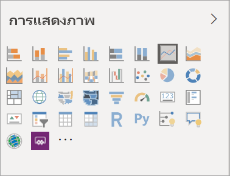
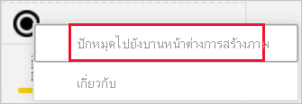
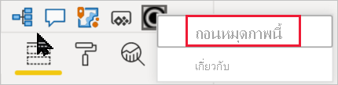

# การแสดงภาพในรายงาน Power BIVisualizations in Power BI reports

[!INCLUDE[consumer-appliesto-yyyn](../includes/consumer-appliesto-yyyn.md)]    

การแสดงภาพ (หรือเรียกสั้น ๆ ว่าวิชวล) จะแสดงข้อมูลเชิงลึกที่ค้นพบในข้อมูลVisualizations (known as visuals for short) display insights that have been discovered in the data. รายงาน Power BI อาจมีหน้าเดียวกับหนึ่งวิชวล หรืออาจมีหลายหน้าที่เต็มไปด้วยวิชวลA Power BI report might have a single page with one visual or it might have pages full of visuals. ในบริการของ Power BI คุณสามารถ[ปักหมุดวิชวลจากรายงานไปยังแดชบอร์ด](../create-reports/service-dashboard-pin-tile-from-report.md)ได้In the Power BI service, visuals can be [pinned from reports to dashboards](../create-reports/service-dashboard-pin-tile-from-report.md).

สิ่งสำคัญคือต้องสร้างความแตกต่างระหว่าง *ผู้ออกแบบ* รายงาน และ *ผู้ใช้* รายงานIt's important to make the distinction between report *designers* and report *consumers*.  ถ้าคุณเป็นผู้สร้างหรือแก้ไขรายงาน คุณจะกลายเป็นผู้ออกแบบIf you are the person building or modifying the report, then you are a designer.  ผู้ออกแบบมีสิทธิ์แก้ไขรายงานและชุดข้อมูลพื้นฐานของรายงานนั้นDesigners have edit permissions to the report and its underlying dataset. ใน Power BI Desktop นี่หมายความว่า คุณสามารถเปิดชุดข้อมูลในมุมมองข้อมูล และสร้างวิชวลในมุมมองรายงานIn Power BI Desktop, this means you can open the dataset in Data view and create visuals in Report view. ในบริการของ Power BI นี่หมายความว่าคุณสามารถเปิดชุดข้อมูลหรือรายงานในตัวแก้ไขรายงานใน [มุมมองการแก้ไข](../consumer/end-user-reading-view.md)In Power BI service, this means you can open the data set or report in the report editor in [Editing view](../consumer/end-user-reading-view.md). ถ้ารายงานหรือแดชบอร์ด [ถูกแชร์ให้กับคุณ](../consumer/end-user-shared-with-me.md) คุณกำลังเป็น *ผู้บริโภค* รายงานIf a report or dashboard has been [shared with you](../consumer/end-user-shared-with-me.md), you are a report *consumer*. คุณจะสามารถดูและโต้ตอบกับรายงานและวิชวลของรายงานได้ แต่คุณจะไม่สามารถทำการเปลี่ยนแปลงได้มากเท่าที่ *นักออกแบบ* สามารถทำได้You'll be able to view and interact with the report and its visuals but you won't be able to make as many changes as a *designer* can.

มีวิชวลชนิดต่าง ๆ มากมายให้คุณเลือกใช้งานจากบานหน้าต่างการจัดรูปแบบการแสดงข้อมูล Power BI โดยตรงThere are many different visual types available directly from the Power BI Visualizations pane.

มีวิชวล Power BI อีกจำนวนมากพร้อมใช้งานจาก [ไซต์ชุมชนของ Microsoft AppSource](https://appsource.microsoft.com)More Power BI visuals are available from the [Microsoft AppSource community site](https://appsource.microsoft.com). ใน AppSource คุณสามารถเรียกดูและ [ดาวน์โหลด](https://appsource.microsoft.com/marketplace/apps?page=1&product=power-bi-visuals) วิชวล Power BI ที่จัดทำโดย Microsoft และชุมชนได้In AppSource you can browse and [download](https://appsource.microsoft.com/marketplace/apps?page=1&product=power-bi-visuals) Power BI visuals provided by Microsoft and the community.

ถ้าคุณยังใหม่กับ Power BI หรือต้องการการทบทวน ใช้ลิงก์ด้านล่างเพื่อเรียนรู้พื้นฐานของการแสดงภาพใน Power BIIf you're new to Power BI, or need a refresher, use the links below to learn the basics of Power BI visualizations.  อีกวิธีหนึ่งคือ ใช้ตารางเนื้อหาของเรา (อยู่ตลอดด้านซ้ายของบทความนี้) เพื่อค้นหาข้อมูลอีกมากที่เป็นประโยชน์Alternately, use our Table of Contents (along the left side of this article) to find even more helpful information.

## เพิ่มการแสดงภาพใน Power BIAdd a visualization in Power BI

[สร้างการแสดงภาพ](power-bi-report-add-visualizations-i.md)ในหน้าของรายงานของคุณ[Create visualizations](power-bi-report-add-visualizations-i.md) on the pages of your reports. เรียกดู[รายการการแสดงภาพที่มี และบทช่วยสอนการแสดงภาพที่มี](power-bi-visualization-types-for-reports-and-q-and-a.md)Browse the [list of available visualizations and available visualization tutorials.](power-bi-visualization-types-for-reports-and-q-and-a.md) 

## อัปโหลดการแสดงภาพจากไฟล์หรือจาก AppSourceUpload a visualization from a file or from AppSource

เพิ่มการแสดงภาพที่คุณสร้างขึ้นด้วยตัวเอง หรือที่คุณพบใน [ไซต์ชุมชนของ  Microsoft AppSource](https://appsource.microsoft.com/marketplace/apps?product=power-bi-visuals)Add a visualization that you created yourself or that you found in the [Microsoft AppSource community site](https://appsource.microsoft.com/marketplace/apps?product=power-bi-visuals). รู้สึกมีความคิดสร้างสรรค์?Feeling creative? เจาะลึกลงในโค้ดต้นฉบับของเรา และใช้ [เครื่องมือพัฒนา](../developer/visuals/environment-setup.md) ของเราเพื่อสร้างการแสดงภาพชนิดใหม่ และ [แชร์กับชุมชน](../developer/visuals/office-store.md)Dig into our source code and use our [developing tools](../developer/visuals/environment-setup.md) to create a new visualization type and [share it with the community](../developer/visuals/office-store.md). หากต้องการเรียนรู้เพิ่มเติมเกี่ยวกับการพัฒนาวิชวล Power BI โปรดไปที่ [การพัฒนาวิชวล Power BI](../developer/visuals/develop-circle-card.md)To learn more about developing a Power BI visual, visit [Developing a Power BI visual](../developer/visuals/develop-circle-card.md).

## ปรับแต่งบานหน้าต่างการแสดงภาพของคุณด้วยตัวคุณเองPersonalize your visualization pane

คุณสามารถปรับแต่งบานหน้าต่างการแสดงภาพด้วยตนเองโดยการเพิ่มและลบวิชวล Power BI ออกจากบานหน้าต่างนั้นYou can personalize the visualization pane by adding and removing Power BI visuals from it. ถ้าคุณลบวิชวลเริ่มต้นจากบานหน้าต่างการจัดรูปแบบการแสดงภาพ คุณสามารถคืนค่าบานหน้าต่างเป็นค่าเริ่มต้นและนำวิชวลเริ่มต้นทั้งหมดกลับมาใช้ใหม่ได้If you removed default visuals from the visualization pane, you can restore the pane to default and bring back all the default visuals.

### เพิ่มวิชวลไปยังบานหน้าต่างการแสดงภาพAdd a visual to the visualization pane

หากคุณพบว่าตนเองกำลังใช้วิชวลเดิมในหลายๆ รายงานอยู่ คุณสามารถเพิ่มวิชวลนั้นไปยังบานหน้าต่างการแสดงภาพของคุณได้If you find yourself using the same visual across many reports, you can add the visual to your visualization pane. การเพิ่มวิชวลจะนำไปใช้กับวิชวล AppSource วิชวลองค์กร และวิชวลจากไฟล์Adding visuals applies to AppSource visuals, organizational visuals, and visuals from files. หากต้องการเพิ่มวิชวล ให้คลิกขวาบนวิชวลTo add a visual, right-click on the visual.

เมื่อปักหมุดวิชวลแล้ว วิชวลจะย้ายขึ้นไปอยู่ร่วมกับวิชวลเริ่มต้นรายการอื่นๆOnce a visual has been pinned, it moves up to live with the other default visuals. วิชวลนี้จะเชื่อมโยงกับบัญชีที่ลงชื่อเข้าใช้ของคุณตอนนี้ ดังนั้นรายงานใหม่ใดก็ตามที่คุณสร้างจะประกอบด้วยวิชวลนี้โดยอัตโนมัติ เสมือนว่าคุณได้ลงชื่อเข้าใช้แล้วThis visual is now tied to your signed in account, so any new reports you build will automatically have this visual included, assuming you are signed in. คุณไม่จำเป็นต้องเพิ่มวิชวลเฉพาะที่คุณใช้เป็นประจำในทุกๆ รายงานอีกต่อไปYou no longer need to add a specific visual you regularly use,  to every single report.

### ลบวิชวลออกจากบานหน้าต่างการแสดงภาพRemove a visual from the visualization pane

ถ้าคุณไม่ได้ใช้วิชวลเป็นประจำอีกต่อไป คุณสามารถคลิกขวาที่วิชวล และลบออกจากบานหน้าต่างการแสดงภาพIf you stop using a visual regularly, you can right-click it and remove it from the visualization pane. วิชวลทุกชนิดสามารถนำออกจากบานหน้าต่างการแสดงภาพได้ โดยรวมถึงวิชวลเริ่มต้น ไฟล์ วิชวลองค์กร และวิชวล AppSourceAny type of visual can be removed from the visualization pane, including default, file ,organizational and AppSource visuals.

### คืนค่าบานหน้าต่างการแสดงผลด้วยภาพRestore the visualization pane

การคืนค่าบานหน้าต่างการแสดงผลด้วยภาพใช้ได้กับวิชวลเริ่มต้นเท่านั้นRestoring the visualization pane only applies to default visuals. วิชวลที่เพิ่มไปยังบานหน้าต่างการแสดงภาพจะไม่ได้รับผลกระทบ และยังคงมีให้พร้อมใช้งานจากบานหน้าต่างการแสดงภาพVisuals that were added to the visualization pane are not affected and will remain available from the visualization pane. หากคุณต้องการลบวิชวล AppSource หรือไฟล์ ออกจากบานหน้าต่างการแสดงภาพ คุณต้องทำด้วยตัวคุณเองIf you want to remove AppSource or file visuals from the visualization pane, you'll have to do it manually.

เมื่อต้องการคืนค่าบานหน้าต่างการแสดงภาพเป็นค่าเริ่มต้น ให้คลิกตัวเลือกเพิ่มเติมแล้วเลือก **คืนค่าวิชวลเริ่มต้น**To restore the visualization pane to default, click more options and select **Restore default visuals**.

## การเปลี่ยนชนิดของการแสดงภาพChange the visualization type

ลอง[เปลี่ยนชนิดของการแสดงภาพ](power-bi-report-change-visualization-type.md) เพื่อดูว่าแบบไหนที่ดีที่สุดสำหรับข้อมูลของคุณTry [changing the type of visualization](power-bi-report-change-visualization-type.md) to see which works best with your data.

## ปักหมุดการแสดงภาพPin the visualization

ในบริการของ Power BI เมื่อคุณมีการแสดงภาพตามแบบคุณที่ต้องการแล้ว คุณสามารถ[ปักหมุดไปยังแดชบอร์ด](../create-reports/service-dashboard-pin-tile-from-report.md)ให้เป็นไทล์ได้In Power BI service, when you have the visualization the way you want it, you can [pin it to a dashboard](../create-reports/service-dashboard-pin-tile-from-report.md) as a tile. ถ้าคุณเปลี่ยนการแสดงภาพที่ใช้ในรายงานหลังจากที่คุณปักหมุด ไทล์บนแดชบอร์ดจะไม่เปลี่ยนแปลงIf you change the visualization being used in the report after you pin it, the tile on the dashboard doesn't change. ถ้าเป็นแผนภูมิเส้น จะยังแสดงเป็นแผนภูมิเส้นอยู่ถึงแม้ว่าคุณเปลี่ยนเป็นแผนภูมิโดนัทในรายงานIf it was a line chart, it stays a line chart, even if you changed it to a Doughnut chart in the report.

## ข้อจำกัดและข้อควรพิจารณาLimitations and considerations
- วิชวลอาจโหลดช้า ทั้งขึ้นอยู่กับแหล่งข้อมูลและจำนวนของเขตข้อมูล (หน่วยวัดหรือคอลัมน์)Depending on the data source and the number of fields (measures or columns), a visual may load slowly.  เราขอแนะนำให้จำกัดวิชวลให้เหลือเพียง 10-20 เขตข้อมูล ทั้งนี้เพื่อเหตุผลในการอ่านและประสิทธิภาพการทำงานWe recommend limiting visuals to 10-20 total fields, both for readability and performance reasons. 

- ขีดจำกัดสูงสุดสำหรับวิชวลอยู่ที่ 100 เขตข้อมูล (หน่วยวัดหรือคอลัมน์)The upper limit for visuals is 100 fields (measures or columns). ถ้าไม่สามารถโหลดวิชวลได้ ให้ลดจำนวนของเขตข้อมูลIf your visual fails to load, reduce the number of fields.

## ขั้นตอนถัดไปNext steps

* [ชนิดการแสดงภาพใน Power BIVisualization types in Power BI](power-bi-visualization-types-for-reports-and-q-and-a.md)
* [วิชวล Power BIPower BI visuals](../developer/visuals/power-bi-custom-visuals.md)
