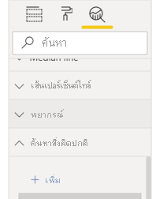
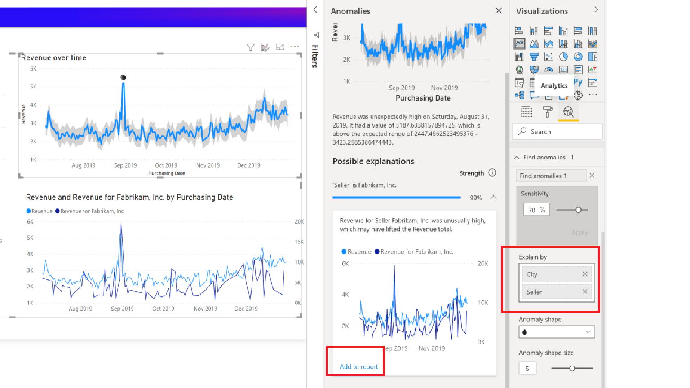

# การตรวจหาสิ่งผิดปกติ (ตัวอย่าง)Anomaly detection (preview)

[!INCLUDE[consumer-appliesto-nyyn](../includes/consumer-appliesto-nyyn.md)]    

การตรวจหาสิ่งผิดปกติช่วยคุณปรับปรุงแผนภูมิเส้นโดยการตรวจหาสิ่งผิดปกติในข้อมูลอนุกรมเวลาของคุณโดยอัตโนมัติAnomaly detection helps you enhance your line charts by automatically detecting anomalies in your time series data. นอกจากนี้ยังมีคำอธิบายสำหรับสิ่งผิดปกติเพื่อช่วยในการวิเคราะห์สาเหตุที่แท้จริงอีกด้วยIt also provides explanations for the anomalies to help with root cause analysis.  ด้วยการคลิกเพียงไม่กี่ครั้ง คุณก็สามารถค้นหาข้อมูลเชิงลึกได้อย่างง่ายดายโดยไม่ต้องแบ่งส่วนและแยกส่วนข้อมูลWith just a couple of clicks, you can easily find insights without slicing and dicing the data. คุณสามารถสร้างและดูสิ่งผิดปกติทั้งใน Power BI Desktop และบริการ Power BI ได้You can create and view anomalies in both Power BI Desktop and the Power BI service. ขั้นตอนและภาพในบทความนี้นำมาจาก Power BI DesktopThe steps and illustrations in this article are from Power BI Desktop.

คุณลักษณะนี้อยู่ในช่วงการแสดงตัวอย่าง คุณจึงต้องเปิดสวิตช์คุณลักษณะก่อนThis feature is in preview, so you first need to turn on the feature switch. ไปที่ **ไฟล์** > **ตัวเลือกและการตั้งค่า** > **ตัวเลือก** > **คุณลักษณะการแสดงตัวอย่าง** และตรวจสอบให้แน่ใจว่า **การตรวจหาสิ่งผิดปกติ** เปิดอยู่:Go to **File** > **Options and Settings** > **Options** > **Preview features**, and make sure **Anomaly detection** is turned on:

:::image type="content" source="media/power-bi-visualization-anomaly-detection//preview-feature-switch.png" alt-text="สกรีนช็อตแสดงวิธีการเปิดใช้งานสวิตช์คุณลักษณะการแสดงตัวอย่างการตรวจหาสิ่งผิดปกติ":::
 
## เริ่มใช้งานGet started
บทช่วยสอนนี้ใช้ข้อมูลการขายออนไลน์สำหรับผลิตภัณฑ์ต่าง ๆ หากต้องการทำตามบทช่วยสอนนี้ ให้ดาวน์โหลด[ไฟล์ตัวอย่าง](https://github.com/microsoft/powerbi-desktop-samples/blob/main/Monthly%20Desktop%20Blog%20Samples/2020/2020SU09%20Blog%20Demo%20-%20September.pbix)ของสถานการณ์การขายออนไลน์This tutorial uses online sales data for various products.To follow along with this tutorial, download the [sample file](https://github.com/microsoft/powerbi-desktop-samples/blob/main/Monthly%20Desktop%20Blog%20Samples/2020/2020SU09%20Blog%20Demo%20-%20September.pbix) of an online-sales scenario.

คุณสามารถเปิดใช้งานการตรวจหาสิ่งผิดปกติได้โดยการเลือกแผนภูมิและการเพิ่มตัวเลือก "ค้นหาสิ่งผิดปกติ" ในบานหน้าต่างการวิเคราะห์You can enable Anomaly detection by selecting the chart and adding "Find Anomalies" option in the analytics pane. 

 

 ตัวอย่างเช่น แผนภูมินี้แสดงรายได้เมื่อเวลาผ่านไปFor example, this chart shows Revenue over time. การเพิ่มการตรวจหาสิ่งผิดปกติจะทำให้แผนภูมิที่มีสิ่งผิดปกติ และช่วงค่าที่คาดไว้สมบูรณ์ขึ้นโดยอัตโนมัติAdding anomaly detection automatically enriches the chart with anomalies, and the expected range of values. เมื่อค่าอยู่นอกขอบเขตที่คาดไว้นี้จะมีการทำเครื่องหมายว่าผิดปกติWhen a value goes outside this expected boundary, it's marked as an anomaly. ดู[บล็อกทางเทคนิค](https://techcommunity.microsoft.com/t5/ai-customer-engineering-team/overview-of-sr-cnn-algorithm-in-azure-anomaly-detector/ba-p/982798)นี้เพื่อดูรายละเอียดเพิ่มเติมเกี่ยวกับอัลกอริทึมตัวตรวจหาสิ่งผิดปกติ (Anomaly Detector)Check out this [technical blog](https://techcommunity.microsoft.com/t5/ai-customer-engineering-team/overview-of-sr-cnn-algorithm-in-azure-anomaly-detector/ba-p/982798) for more details about the Anomaly Detector algorithm.

 
 
## จัดรูปแบบสิ่งผิดปกติFormat anomalies

ประสบการณ์การใช้งานนี้สามารถปรับแต่งได้มากมายThis experience  is highly customizable. คุณสามารถจัดรูปแบบรูปร่าง ขนาด และสีของสิ่งผิดปกติ รวมทั้งสี ลักษณะ และความโปร่งใสของช่วงที่คาดไว้ได้You can format the anomaly's shape, size, and color, and also the color, style, and transparency of expected range. คุณยังสามารถกำหนดค่าพารามิเตอร์ของอัลกอริทึมได้อีกด้วยYou can also configure the parameter of the algorithm.  หากคุณเพิ่มความไว อัลกอริทึมจะไวต่อการเปลี่ยนแปลงข้อมูลของคุณมากขึ้นIf you increase the sensitivity, the algorithm is more sensitive to changes in your data. ในกรณีดังกล่าวค่าจะถูกทำเครื่องหมายว่าเป็นสิ่งผิดปกติแม้การเบี่ยงเบนเล็กน้อยIn that case, even a slight deviation is marked as an anomaly. ถ้าคุณลดความไว อัลกอริทึมจะคัดเลือกอย่างระมัดระวังมากขึ้นว่าค่าใดเป็นค่าผิดปกติIf you decrease the sensitivity, the algorithm is more selective on what it considers an anomaly.

 
 
## คำอธิบายExplanations
นอกจากการตรวจหาสิ่งผิดปกติแล้ว คุณยังสามารถอธิบายสิ่งผิดปกติของข้อมูลได้โดยอัตโนมัติBesides detecting anomalies, you can also automatically explain the anomalies the data. เมื่อคุณเลือกสิ่งผิดปกติ Power BI จะทำการวิเคราะห์ข้ามเขตข้อมูลในแบบจำลองข้อมูลของคุณเพื่อหาคำอธิบายที่เป็นไปได้When you select the anomaly, Power BI runs an analysis across fields in your data model to figure out possible explanations. ซึ่งให้คำอธิบายเกี่ยวกับสิ่งผิดปกติด้วยภาษาที่เป็นธรรมชาติและปัจจัยที่เกี่ยวข้องกับสิ่งผิดปกตินั้นโดยเรียงลำดับตามความแข็งแรงของคำอธิบายIt gives you a natural language explanation of the anomaly, and factors associated with that anomaly, sorted by its explanatory strength. ตรงส่วนนี้ฉันเห็นว่าในวันที่ 30 สิงหาคม รายรับอยู่ที่ $5187 ซึ่งสูงกว่าช่วงที่คาดไว้ที่ $2447 ถึง $3423Here I see that on August 30, Revenue was $5187, which is above the expected range of $2447 to $3423. ฉันสามารถเปิดการ์ดในบานหน้าต่างนี้เพื่อดูรายละเอียดเพิ่มเติมของคำอธิบายได้I can open the cards in this pane to see more details of the explanation.

 
### กำหนดค่าคำอธิบายConfigure explanations
คุณยังสามารถควบคุมเขตข้อมูลที่ใช้สำหรับการวิเคราะห์ได้อีกด้วยYou can also control the fields that are used for analysis. ตัวอย่างเช่น โดยการลาก Seller และ City ลงในช่องเขตข้อมูล **อธิบายตาม** Power BI จะจำกัดการวิเคราะห์เฉพาะเขตข้อมูลเหล่านั้นFor example, by dragging Seller and City into the **Explain by** field well, Power BI restricts the analysis to just those fields. ในกรณีนี้ ดูเหมือนว่าสิ่งผิดปกติในวันที่ 31 สิงหาคมจะเกี่ยวข้องกับผู้ขายรายใดรายหนึ่งและเมืองใดเมืองหนึ่งIn this case,  the anomaly on August 31 seems to be associated with a particular seller and particular cities. ตรงนี้ ผู้ขาย "Fabrikam" มีความแข็งแกร่งถึง 99%Here, seller "Fabrikam" has a strength of 99%. Power BI คำนวณ *ความแข็งแกร่ง* เป็นอัตราส่วนของค่าเบี่ยงเบนจากค่าที่คาดไว้ เมื่อมีการกรองตามมิติต่อค่าเบี่ยงเบนในมูลค่ารวมPower BI calculates *strength* as the ratio of the deviation from expected value, when filtered by the dimension to the deviation in total value. ตัวอย่างเช่น เป็นอัตราส่วนของมูลค่าจริงลบมูลค่าที่คาดไว้ ระหว่างอนุกรมเวลาของคอมโพเนนต์ *Fabrikam* กับอนุกรมเวลารวม *รายได้โดยรวม* สำหรับจุดที่ผิดปกติFor example, it's the ratio of actual minus expected value, between the component time series *Fabrikam* and the aggregate time series *overall Revenue* for the anomaly point. การเปิดการ์ดนี้จะแสดงวิชวลที่มีรายได้ของผู้ขายรายนี้เพิ่มขึ้นอย่างรวดเร็วในวันที่ 31 สิงหาคมOpening this card shows the visual with a spike in the revenue for this seller on August 31. ใช้ตัวเลือก **เพิ่มในรายงาน** เพื่อเพิ่มวิชวลนี้ลงในหน้าUse the **Add to report** option to add this visual to the page.

## ข้อจำกัดLimitations
- รองรับการตรวจหาสิ่งผิดปกติสำหรับวิชวลแผนภูมิเส้นที่มีข้อมูลอนุกรมเวลาในเขตข้อมูลแกนเท่านั้นAnomaly detection is only supported for line chart visuals containing time series data in the Axis field.
- ไม่รองรับการตรวจหาสิ่งผิดปกติที่มีคำอธิบายแผนภูมิ ค่าหลายค่าหรือค่ารองในวิชวลแผนภูมิเส้นAnomaly detection isn't supported with legends, multiple values or secondary values in line chart visual.
- การตรวจหาสิ่งผิดปกติต้องการจุดข้อมูลอย่างน้อย 12 จุดAnomaly detection requires at least 12 data points.
- เส้นพยากรณ์/ต่ำสุด/สูงสุด/เฉลี่ย/มัธยฐาน/เปอร์เซ็นไทล์ใช้ไม่ได้กับการตรวจหาสิ่งผิดปกติForecast/Min/Max/Average/ Median/Percentile lines doesn't work with Anomaly detection.
- ไม่รองรับ Direct Query ตรงผ่านแหล่งข้อมูล SAP, เซิร์ฟเวอร์รายงาน Power BI, การเชื่อมต่อแบบสดไปยัง Azure Analysis Services และ SQL Server Analysis ServicesDirect Query over SAP data source, Power BI Report Server, Live Connection to Azure Analysis Services and SQL Server Analysis Services aren't supported.
- คำอธิบายสิ่งผิดปกติใช้ไม่ได้กับตัวเลือก "แสดงค่าเป็น"Anomaly Explanations doesn't work with 'Show Value As' options.
- ไม่รองรับการเจาะลึกเพื่อไปยังระดับถัดไปในลำดับชั้นDrilling down to go to the next level in the hierarchy isn't supported.
