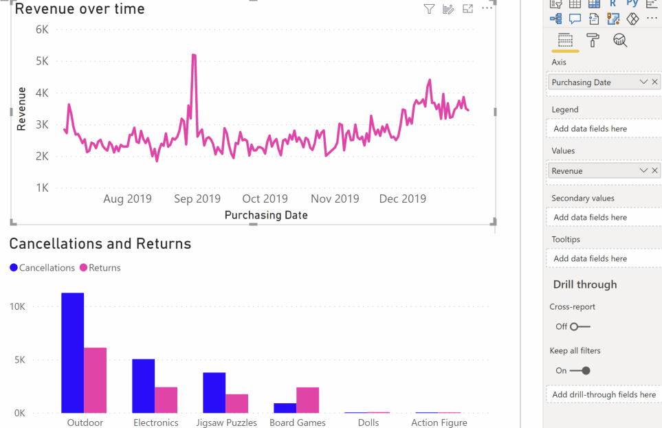

# การตรวจหาสิ่งผิดปกติ (ตัวอย่าง)

[!INCLUDE[consumer-appliesto-nyyn](../includes/consumer-appliesto-nyyn.md)]    

การตรวจหาสิ่งผิดปกติช่วยคุณปรับปรุงแผนภูมิเส้นโดยการตรวจหาสิ่งผิดปกติในข้อมูลอนุกรมเวลาของคุณโดยอัตโนมัติ นอกจากนี้ยังมีคำอธิบายสำหรับสิ่งผิดปกติเพื่อช่วยในการวิเคราะห์สาเหตุที่แท้จริงอีกด้วย  ด้วยการคลิกเพียงไม่กี่ครั้ง คุณก็สามารถค้นหาข้อมูลเชิงลึกได้อย่างง่ายดายโดยไม่ต้องแบ่งส่วนและแยกส่วนข้อมูล คุณสามารถสร้างและดูสิ่งผิดปกติทั้งใน Power BI Desktop และบริการ Power BI ได้ ขั้นตอนและภาพในบทความนี้นำมาจาก Power BI Desktop

คุณลักษณะนี้อยู่ในช่วงการแสดงตัวอย่าง คุณจึงต้องเปิดสวิตช์คุณลักษณะก่อน ไปที่ **ไฟล์** > **ตัวเลือกและการตั้งค่า** > **ตัวเลือก** > **คุณลักษณะการแสดงตัวอย่าง** และตรวจสอบให้แน่ใจว่า **การตรวจหาสิ่งผิดปกติ** เปิดอยู่:

:::image type="content" source="media/power-bi-visualization-anomaly-detection//preview-feature-switch.png" alt-text="สกรีนช็อตแสดงวิธีการเปิดใช้งานสวิตช์คุณลักษณะการแสดงตัวอย่างการตรวจหาสิ่งผิดปกติ":::
 
## เริ่มใช้งาน
บทช่วยสอนนี้ใช้ข้อมูลการขายออนไลน์สำหรับผลิตภัณฑ์ต่าง ๆ หากต้องการทำตามบทช่วยสอนนี้ ให้ดาวน์โหลด[ไฟล์ตัวอย่าง](https://github.com/microsoft/powerbi-desktop-samples/blob/main/Monthly%20Desktop%20Blog%20Samples/2020/2020SU09%20Blog%20Demo%20-%20September.pbix)ของสถานการณ์การขายออนไลน์

คุณสามารถเปิดใช้งานการตรวจหาสิ่งผิดปกติได้โดยการเลือกแผนภูมิและการเพิ่มตัวเลือก "ค้นหาสิ่งผิดปกติ" ในบานหน้าต่างการวิเคราะห์ 

 

 ตัวอย่างเช่น แผนภูมินี้แสดงรายได้เมื่อเวลาผ่านไป การเพิ่มการตรวจหาสิ่งผิดปกติจะทำให้แผนภูมิที่มีสิ่งผิดปกติ และช่วงค่าที่คาดไว้สมบูรณ์ขึ้นโดยอัตโนมัติ เมื่อค่าอยู่นอกขอบเขตที่คาดไว้นี้จะมีการทำเครื่องหมายว่าผิดปกติ ดู[บล็อกทางเทคนิค](https://techcommunity.microsoft.com/t5/ai-customer-engineering-team/overview-of-sr-cnn-algorithm-in-azure-anomaly-detector/ba-p/982798)นี้เพื่อดูรายละเอียดเพิ่มเติมเกี่ยวกับอัลกอริทึมตัวตรวจหาสิ่งผิดปกติ (Anomaly Detector)

 
 
## จัดรูปแบบสิ่งผิดปกติ

ประสบการณ์การใช้งานนี้สามารถปรับแต่งได้มากมาย คุณสามารถจัดรูปแบบรูปร่าง ขนาด และสีของสิ่งผิดปกติ รวมทั้งสี ลักษณะ และความโปร่งใสของช่วงที่คาดไว้ได้ คุณยังสามารถกำหนดค่าพารามิเตอร์ของอัลกอริทึมได้อีกด้วย  หากคุณเพิ่มความไว อัลกอริทึมจะไวต่อการเปลี่ยนแปลงข้อมูลของคุณมากขึ้น ในกรณีดังกล่าวค่าจะถูกทำเครื่องหมายว่าเป็นสิ่งผิดปกติแม้การเบี่ยงเบนเล็กน้อย ถ้าคุณลดความไว อัลกอริทึมจะคัดเลือกอย่างระมัดระวังมากขึ้นว่าค่าใดเป็นค่าผิดปกติ

 
 
## คำอธิบาย
นอกจากการตรวจหาสิ่งผิดปกติแล้ว คุณยังสามารถอธิบายสิ่งผิดปกติของข้อมูลได้โดยอัตโนมัติ เมื่อคุณเลือกสิ่งผิดปกติ Power BI จะทำการวิเคราะห์ข้ามเขตข้อมูลในแบบจำลองข้อมูลของคุณเพื่อหาคำอธิบายที่เป็นไปได้ ซึ่งให้คำอธิบายเกี่ยวกับสิ่งผิดปกติด้วยภาษาที่เป็นธรรมชาติและปัจจัยที่เกี่ยวข้องกับสิ่งผิดปกตินั้นโดยเรียงลำดับตามความแข็งแรงของคำอธิบาย ตรงส่วนนี้ฉันเห็นว่าในวันที่ 30 สิงหาคม รายรับอยู่ที่ $5187 ซึ่งสูงกว่าช่วงที่คาดไว้ที่ $2447 ถึง $3423 ฉันสามารถเปิดการ์ดในบานหน้าต่างนี้เพื่อดูรายละเอียดเพิ่มเติมของคำอธิบายได้

 
### กำหนดค่าคำอธิบาย
คุณยังสามารถควบคุมเขตข้อมูลที่ใช้สำหรับการวิเคราะห์ได้อีกด้วย ตัวอย่างเช่น โดยการลาก Seller และ City ลงในช่องเขตข้อมูล **อธิบายตาม** Power BI จะจำกัดการวิเคราะห์เฉพาะเขตข้อมูลเหล่านั้น ในกรณีนี้ ดูเหมือนว่าสิ่งผิดปกติในวันที่ 31 สิงหาคมจะเกี่ยวข้องกับผู้ขายรายใดรายหนึ่งและเมืองใดเมืองหนึ่ง ตรงนี้ ผู้ขาย "Fabrikam" มีความแข็งแกร่งถึง 99% Power BI คำนวณ *ความแข็งแกร่ง* เป็นอัตราส่วนของค่าเบี่ยงเบนจากค่าที่คาดไว้ เมื่อมีการกรองตามมิติต่อค่าเบี่ยงเบนในมูลค่ารวม ตัวอย่างเช่น เป็นอัตราส่วนของมูลค่าจริงลบมูลค่าที่คาดไว้ ระหว่างอนุกรมเวลาของคอมโพเนนต์ *Fabrikam* กับอนุกรมเวลารวม *รายได้โดยรวม* สำหรับจุดที่ผิดปกติ การเปิดการ์ดนี้จะแสดงวิชวลที่มีรายได้ของผู้ขายรายนี้เพิ่มขึ้นอย่างรวดเร็วในวันที่ 31 สิงหาคม ใช้ตัวเลือก **เพิ่มในรายงาน** เพื่อเพิ่มวิชวลนี้ลงในหน้า

## ข้อจำกัด
- รองรับการตรวจหาสิ่งผิดปกติสำหรับวิชวลแผนภูมิเส้นที่มีข้อมูลอนุกรมเวลาในเขตข้อมูลแกนเท่านั้น
- ไม่รองรับการตรวจหาสิ่งผิดปกติที่มีคำอธิบายแผนภูมิ ค่าหลายค่าหรือค่ารองในวิชวลแผนภูมิเส้น
- การตรวจหาสิ่งผิดปกติต้องการจุดข้อมูลอย่างน้อย 12 จุด
- เส้นพยากรณ์/ต่ำสุด/สูงสุด/เฉลี่ย/มัธยฐาน/เปอร์เซ็นไทล์ใช้ไม่ได้กับการตรวจหาสิ่งผิดปกติ
- ไม่รองรับ Direct Query ตรงผ่านแหล่งข้อมูล SAP, เซิร์ฟเวอร์รายงาน Power BI, การเชื่อมต่อแบบสดไปยัง Azure Analysis Services และ SQL Server Analysis Services
- คำอธิบายสิ่งผิดปกติใช้ไม่ได้กับตัวเลือก "แสดงค่าเป็น"
- ไม่รองรับการเจาะลึกเพื่อไปยังระดับถัดไปในลำดับชั้น
