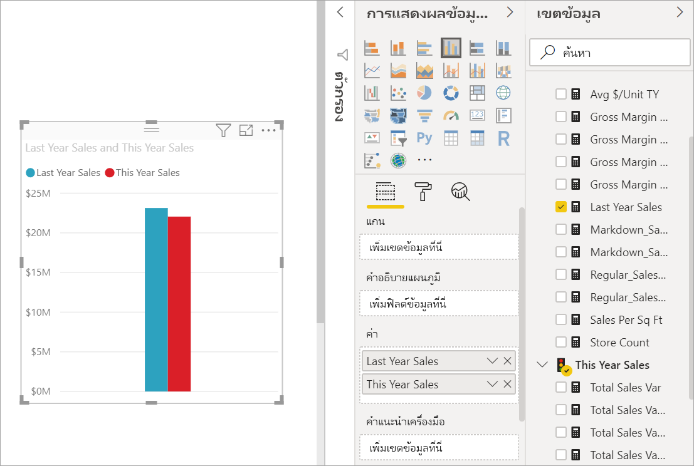
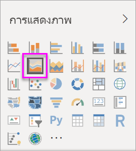
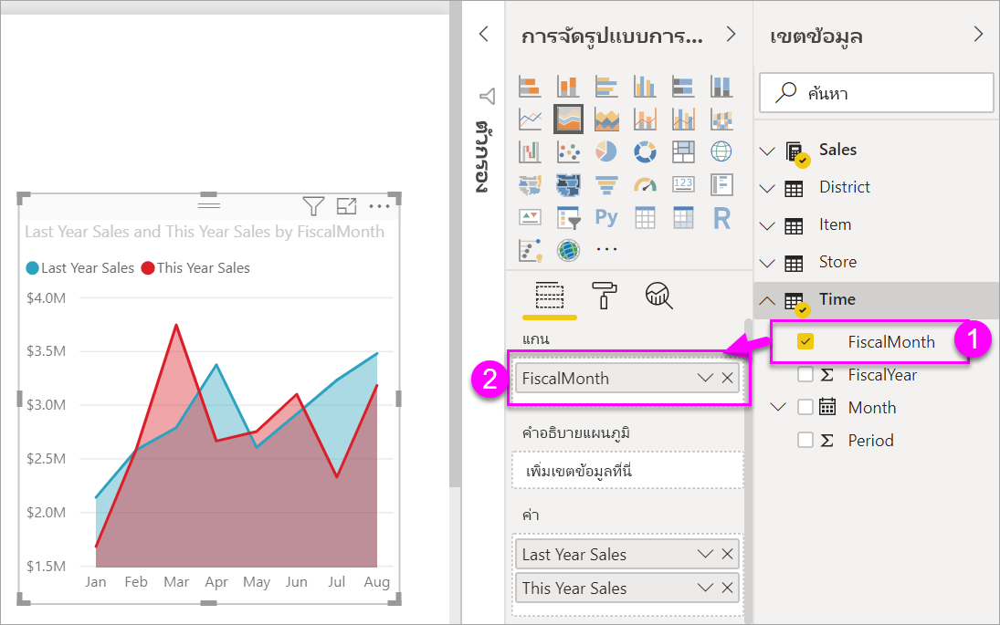

# สร้างและใช้แผนภูมิพื้นที่แบบพื้นฐานCreate and use basic area charts

[!INCLUDE[consumer-appliesto-nyyn](../includes/consumer-appliesto-nyyn.md)]

[!INCLUDE [power-bi-visuals-desktop-banner](../includes/power-bi-visuals-desktop-banner.md)]

แผนภูมิพื้นที่พื้นฐาน (หรือที่เรียกว่า แผนภูมิพื้นที่แบบชั้น) เป็นไปตามแผนภูมิเส้นThe basic area chart (also known as layered area chart.) is based on the line chart. พื้นที่ระหว่างแกนและบรรทัดจะถูกเติมด้วยสีเพื่อระบุปริมาณThe area between axis and line is filled with colors to indicate volume. 

แผนภูมิพื้นที่เน้นให้เห็นปริมาณการเปลี่ยนแปลงตามเวลา และสามารถใช้เพื่อดึงความสนใจไปยังค่าผลรวมในทั่วทั้งแนวโน้มArea charts emphasize the magnitude of change over time, and can be used to draw attention to the total value across a trend. ตัวอย่างเช่น เราสามารถลงจุดข้อมูลที่แสดงกำไรเมื่อเวลาผ่านไปในแผนภูมิพื้นที่เพื่อเน้นกำไรรวมได้For example, data that represents profit over time can be plotted in an area chart to emphasize the total profit.

> [!NOTE]
> การแชร์รายงานของคุณกับผู้ร่วมงาน Power BI กำหนดให้คุณต้องมีสิทธิ์การใช้งาน Power BI Pro แต่ละรายการ หรือรายงานจะถูกบันทึกในความจุแบบพรีเมียมSharing your report with a Power BI colleague requires that you both have individual Power BI Pro licenses or that the report is saved in Premium capacity.

## เมื่อต้องการใช้แผนภูมิพื้นที่พื้นฐานWhen to use a basic area chart
แผนภูมิพื้นที่พื้นฐานคือตัวเลือกที่ดีที่สุด:Basic area charts are a great choice:

* ในการดูและเปรียบเทียบแนวโน้มปริมาณข้อมูลทั่วชุดข้อมูลเวลาto see and compare the volume trend across time series 
* สำหรับแต่ละชุดข้อมูลที่แสดงถึงชุดข้อมูลตามจริงในจำนวนที่นับได้for individual series representing a physically countable set

### ข้อกำหนดเบื้องต้นPrerequisites
บทช่วยสอนนี้ใช้[ไฟล์ PBIX ตัวอย่างการวิเคราะห์การค้าปลีก](https://download.microsoft.com/download/9/6/D/96DDC2FF-2568-491D-AAFA-AFDD6F763AE3/Retail%20Analysis%20Sample%20PBIX.pbix)This tutorial uses the [Retail Analysis sample PBIX file](https://download.microsoft.com/download/9/6/D/96DDC2FF-2568-491D-AAFA-AFDD6F763AE3/Retail%20Analysis%20Sample%20PBIX.pbix).

1. จากด้านบนซ้ายของแถบเมนู เลือก **ไฟล์** > **เปิด**From the upper left section of the menubar, select **File** > **Open**
   
2. ค้นหาสำเนา **ไฟล์ PBIX ตัวอย่างการวิเคราะห์การค้าปลีก**Find your copy of the **Retail Analysis sample PBIX file**

1. เปิด **ไฟล์ PBIX ตัวอย่างการวิเคราะห์การค้าปลีก** ในมุมมองรายงาน Open the **Retail Analysis sample PBIX file** in report view .

1. เลือกSelect  หากต้องการเพิ่มหน้าใหม่to add a new page.

## สร้างแผนภูมิพื้นที่พื้นฐานCreate a basic area chart
 

1. ขั้นตอนเหล่านี้จะช่วยสร้างแผนภูมิพื้นที่ที่แสดงยอดขายของปีนี้และยอดขายของปีที่แล้วแยกตามเดือนThese steps will help you create an area chart that displays this year's sales and last year's sales by month.
   
   a.a. จากพื้นที่เขตข้อมูล เลือก **ยอดขาย\>ยอดขายของปีที่แล้ว** และ **ยอดขายของปีนี้ > ค่า**From the Fields pane, select **Sales \> Last Year Sales**, and **This Year Sales > Value**.

   

   b.b.  แปลงแผนภูมิเป็นแผนภูมิพื้นที่พื้นฐานโดยการเลือกไอคอนพื้นที่แผนภูมิจากพื้นที่การแสดงภาพConvert the chart to a basic area chart by selecting the Area chart icon from the Visualizations pane.

   
   
   c.c.  เลือก **เวลา\>เดือนทางบัญชี** เพื่อเพิ่มไปยัง **แกน**Select **Time \> FiscalMonth** to add it to the **Axis** well.   
   
   
   d.d.  ในการแสดงแผนภูมิตามเดือน เลือกจุดไข่ปลา (มุมบนขวาของภาพ) แล้วเลือก **เรียงลำดับตามเดือน**To display the chart by month, select the ellipses (top right corner of the visual) and choose **Sort by month**. เมื่อต้องเปลี่ยนลำดับการจัดเรียง เลือกจุดไข่ปลาอีกครั้ง แล้วคลิก **เรียงลำดับจากน้อยไปมาก** หรือ **เรียงลำดับจากมากไปน้อย**To change the sort order, select the ellipses again and select either **Sort ascending** or **Sort descending**.

## การทำไฮไลท์และการกรองข้ามHighlighting and cross-filtering
สำหรับข้อมูลเกี่ยวกับการใช้บานหน้าต่างตัวกรอง โปรดดู[เพิ่มตัวกรองไปยังรายงาน](../create-reports/power-bi-report-add-filter.md)For information about using the Filters pane, see [Add a filter to a report](../create-reports/power-bi-report-add-filter.md).

เมื่อต้องการทำไฮไลท์เฉพาะพื้นที่หนึ่งในแผนภูมิของคุณ เลือกพื้นที่นั้นหรือเส้นขอบด้านบนของพื้นที่ดังกล่าวTo highlight one particular area in your chart, select that area or its top border.  ถ้ามีการแสดงภาพอื่น ๆ บนหน้าเดียวกัน การทำไฮไลท์บนแผนภูมิพื้นที่พื้นฐานจะไม่กรองข้ามการแสดงภาพอื่น ๆ บนหน้ารายงาน ซึ่งต่างจากชนิดการแสดงภาพอื่น ๆUnlike other visualization types, if there are other visualizations on the same page, highlighting a basic area charts does not cross-filter the other visualizations on the report page. อย่างไรก็ตาม แผนภูมิพื้นที่เป็นเป้าหมายสำหรับการกรองข้ามที่เปิดใช้งานโดยการแสดงภาพอื่น ๆ บนหน้ารายงานHowever, area charts are a target for cross-filtering triggered by other visualizations on the report page. 

1. ลองใช้โดยการเลือกแผนภูมิพื้นที่ของคุณ และคัดลอกไปยัง **ตัววิเคราะห์ร้านใหม่** หน้ารายงาน (CTRL C และ CTRL V)Try it out by selecting your area chart and copying it to the **New Store Analysis** report page (CTRL-C and CTRL-V).
2. เลือกหนึ่งพื้นที่แรเงาของแผนภูมิพื้นที่และเลือกแรเงาพื้นที่อื่นๆSelect one of the shaded areas of the area chart and then select the other shaded area. คุณจะสังเกตผลที่มีต่อการแสดงภาพอื่น ๆ บนหน้าYou'll notice no impact on the other visualizations on the page.
1. และตอนนี้ให้เลือกองค์ประกอบNow select an element. สังเกตผลกระทบบนแผนภูมิพื้นที่ที่ข้ามการกรองข้อมูลNotice the impact on the area chart -- it gets cross-filtered.

     

เมื่อต้องการเรียนรู้เพิ่มเติม ดู[การโต้ตอบแบบภาพในรายงาน](../create-reports/service-reports-visual-interactions.md)To learn more, see [Visual interactions in reports](../create-reports/service-reports-visual-interactions.md)

## ข้อควรพิจารณาและการแก้ไขปัญหาConsiderations and troubleshooting   
* [ทำให้รายงานสามารถเข้าถึงได้มากขึ้นสำหรับผู้ทุพพลภาพMake the report more accessible for people with disabilities](../create-reports/desktop-accessibility-overview.md)
* แผนภูมิพื้นที่พื้นฐานจะไม่มีผลบังคับใช้สำหรับการเปรียบเทียบค่าดังกล่าวเนื่องจากมีสิ่งบดบังบนพื้นที่แบบชั้นBasic area charts are not effective for comparing the values due to the occlusion on the layered areas. Power BI ใช้ความโปร่งใสเพื่อระบุการเหลื่อมกันของพื้นที่Power BI uses transparency to indicate the overlap of areas. อย่างไรก็ตาม คุณลักษณะนี้จะทำงานได้ดีกับพื้นที่ที่แตกต่างกันสองหรือสามส่วนเท่านั้นHowever, it only works well with two or three different areas. เมื่อคุณต้องการเปรียบเทียบแนวโน้มกับค่าการวัดที่มากกว่าสามค่า ให้ลองใช้แผนภูมิเส้นWhen you need to compare trend to more than three measures, try using line charts. เมื่อคุณต้องการเปรียบเทียบปริมาณเทียบกับค่าการวัดที่มากกว่าสามค่า ลองใช้แผนภูมิต้นไม้When you need to compare volume to more than three measures, try using treemap.

## ขั้นตอนถัดไปNext step
[รายงานใน Power BIReports in Power BI](power-bi-visualization-card.md)  
