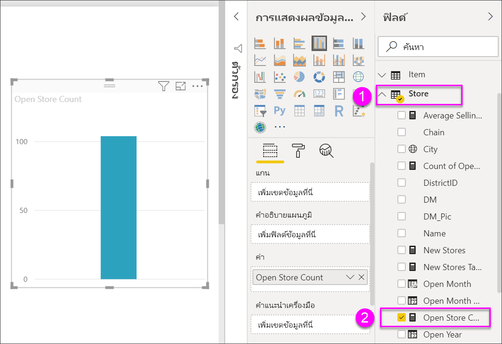
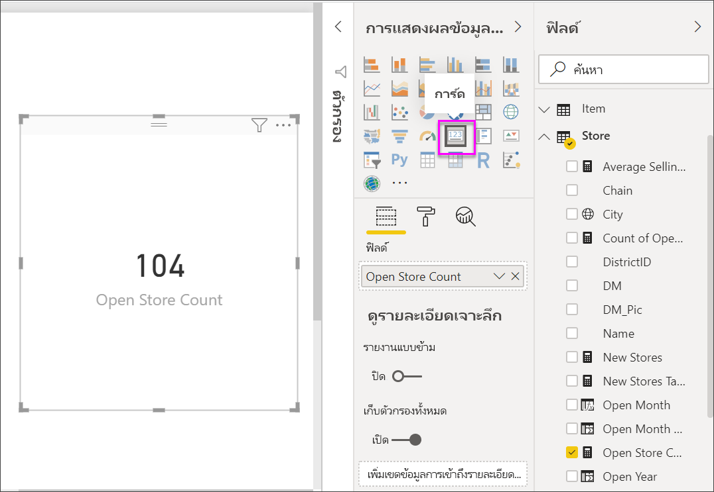
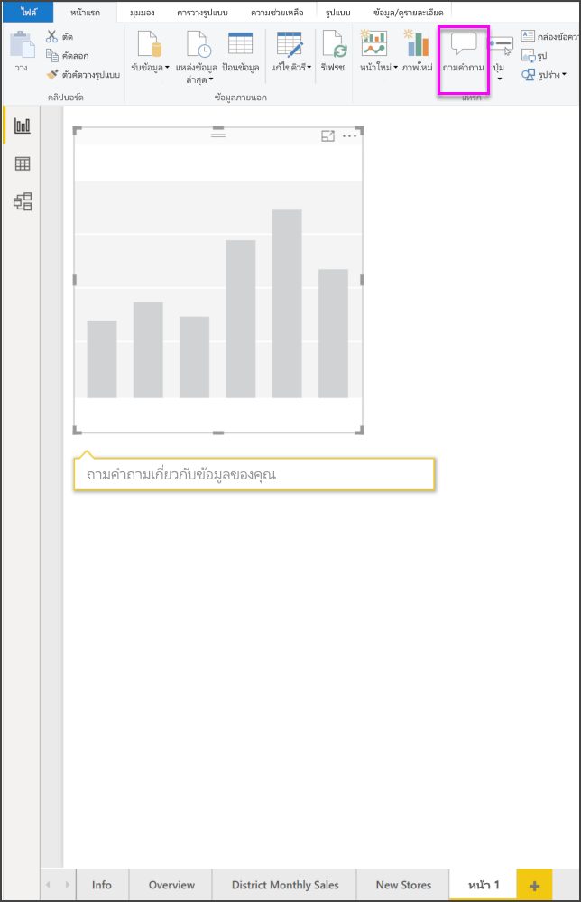
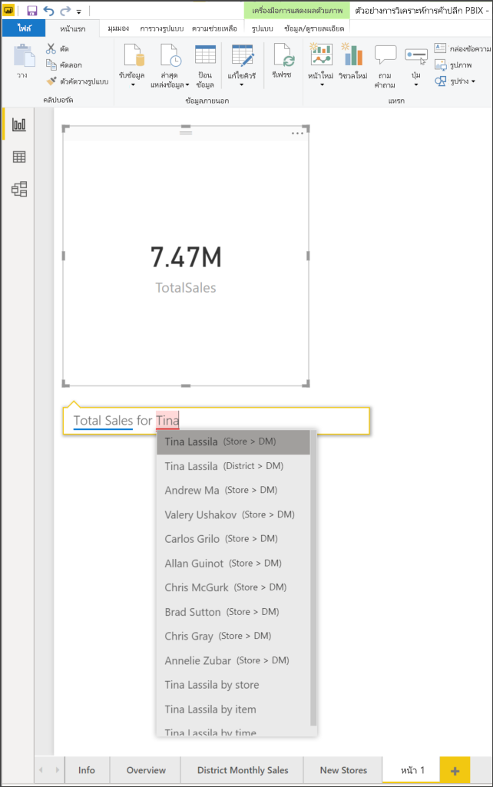
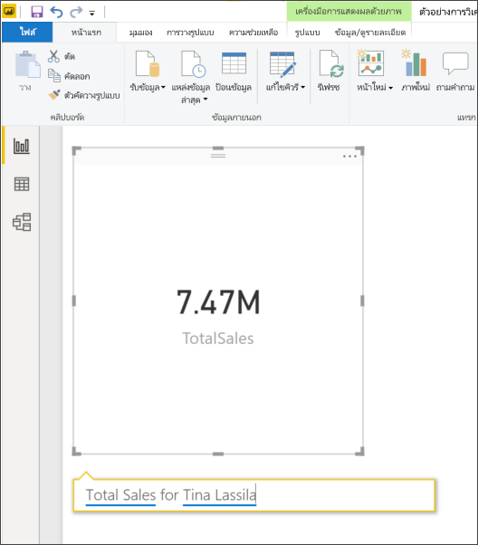
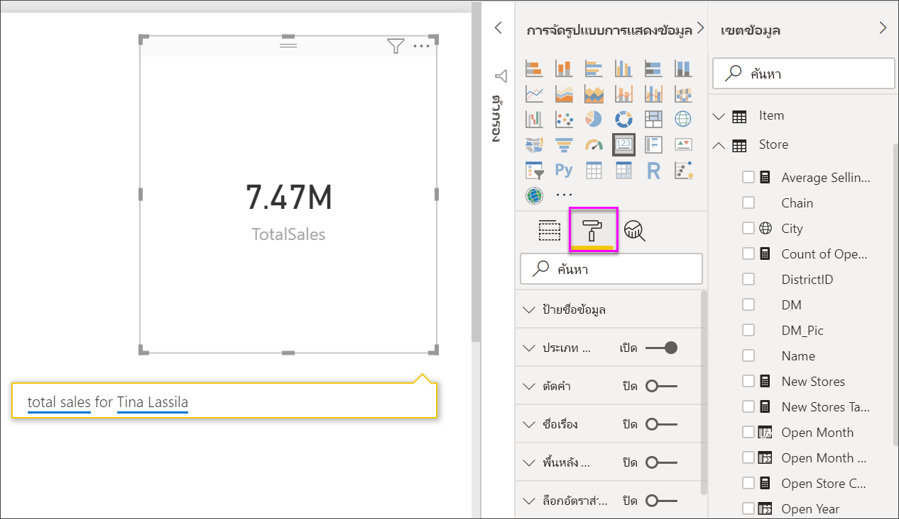
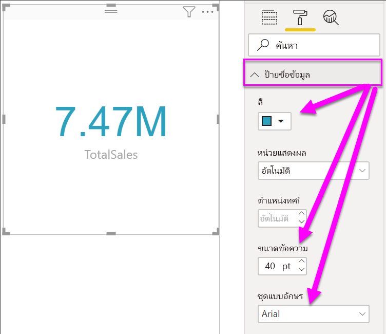
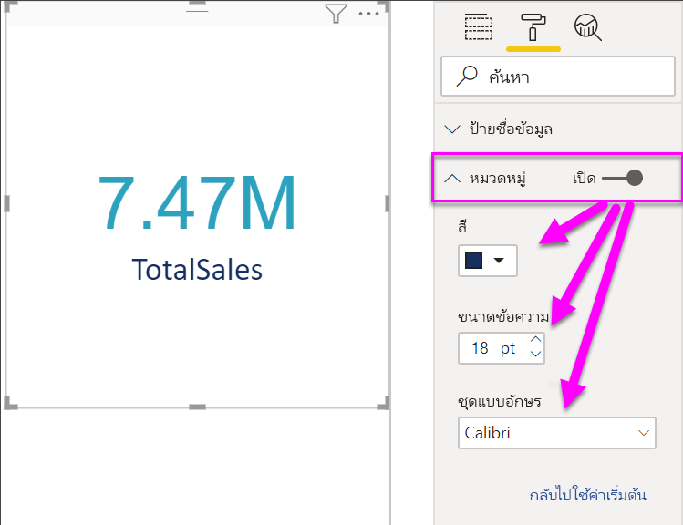
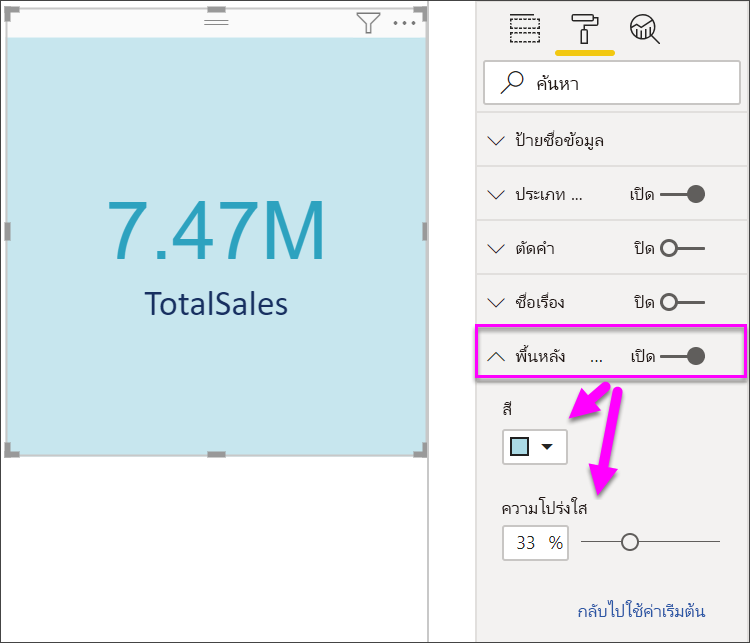

# สร้างการแสดงภาพการ์ดCreate card visualizations

[!INCLUDE[consumer-appliesto-nyyn](../includes/consumer-appliesto-nyyn.md)]

[!INCLUDE [power-bi-visuals-desktop-banner](../includes/power-bi-visuals-desktop-banner.md)]

บางครั้งตัวเลขเพียงตัวเดียวก็เป็นสิ่งสำคัญที่สุดที่คุณต้องการติดตามในแดชบอร์ด Power BI หรือรายงานของคุณ เช่น ยอดขายรวม ส่วนแบ่งตลาดแบบปีต่อปี ตลาดแชร์ปีปี หรือโอกาสทั้งหมดSometimes a single number is the most important thing you want to track in your Power BI dashboard or report, such as total sales, market share year over year, or total opportunities. แสดงภาพชนิดนี้จะเรียกว่า *การ์ด*This type of visualization is called a *Card*. เช่นเดียวกับการแสดงภาพดั้งเดิมของ Power BI แทบจะทุกชนิด คุณสามารถสร้างการ์ดขึ้นได้ โดยใช้ตัวแก้ไขรายงาน หรือการถามตอบAs with almost all of the native Power BI visualizations, Cards can be created using the report editor or Q&A.

> [!NOTE]
> การแชร์รายงานของคุณกับผู้ร่วมงาน Power BI กำหนดให้คุณต้องมีสิทธิ์การใช้งาน Power BI Pro แต่ละรายการ หรือรายงานจะถูกบันทึกในความจุแบบพรีเมียมSharing your report with a Power BI colleague requires that you both have individual Power BI Pro licenses or that the report is saved in Premium capacity.

## เงื่อนไขเบื้องต้นPrerequisite

บทช่วยสอนนี้ใช้ [ไฟล์ PBIX ตัวอย่าง การวิเคราะห์การขายปลีก](https://download.microsoft.com/download/9/6/D/96DDC2FF-2568-491D-AAFA-AFDD6F763AE3/Retail%20Analysis%20Sample%20PBIX.pbix)This tutorial uses the [Retail Analysis sample PBIX file](https://download.microsoft.com/download/9/6/D/96DDC2FF-2568-491D-AAFA-AFDD6F763AE3/Retail%20Analysis%20Sample%20PBIX.pbix)

1. จากส่วนซ้ายบนของแถบเมนู เลือก **ไฟล์** \> **เปิด**From the upper left section of the menubar, select **File** \> **Open**
   
2. ค้นหาสำเนา **ไฟล์ PBIX ตัวอย่างการวิเคราะห์การค้าปลีก**Find your copy of the **Retail Analysis sample PBIX file**

1. เปิด **ไฟล์ PBIX ตัวอย่างการวิเคราะห์การค้าปลีก** ในมุมมองรายงาน Open the **Retail Analysis sample PBIX file** in report view .

1. เลือกSelect  หากต้องการเพิ่มหน้าใหม่to add a new page.

## ตัวเลือกที่ 1: สร้างการ์ดโดยใช้ตัวแก้ไขรายงานOption 1: Create a card using the report editor

วิธีแรกในการจัดทำการ์ดคือใช้ Report Editor จาก Power BI DesktopThe first method to create a card is to use the report editor in Power BI Desktop.

1. เริ่มที่หน้ารายงานว่าง และเลือก **ร้านค้า** \> เขตข้อมูล **เปิดจำนวนร้านค้า**Start on a blank report page and select the **Store** \> **Open store count** field.

    Power BI จะสร้างแผนภูมิคอลัมน์ที่มีตัวเลขเพียงตัวเลขเดียวPower BI creates a column chart with the one number.

   

2. ในบานหน้าต่างการแสดงภาพ ให้เลือกไอคอนการ์ดIn the Visualizations pane, select the card icon.

   

คุณจัดทำการ์ดพร้อม Report Editor เสร็จสิ้นแล้วYou have now successfully created a card with the report editor. ต่อไปนี้เป็นตัวเลือกที่สองในการจัดทำการ์ดโดยใช้ช่องคำถาม ถามตอบBelow is the second option for creating a card using the Q&A question box.

## ตัวเลือกที่ 2: สร้างการ์ดจากกล่องคำถามการถามตอบOption 2: Create a card from the Q&A question box
กล่องคำถาม ถามตอบ เป็นอีกทางเลือกสำหรับคุณในการใช้ขณะจัดทำการ์ดThe Q&A question box is another option for you to use when creating a card. ช่องคำถาม ถามตอบ มีอยู่ในมุมมองรายงานของ Power BI DesktopThe Q&A question box is available in Power BI Desktop report view.

1. เริ่มต้นบน หน้ารายงานเปล่าStart on a blank report page

1. ด้านบนของหน้าต่าง ให้เลือกไอคอน **ถามคำถาม**At the top of your window, select the **Ask a Question** icon. 

    Power BI จะจัดทำการ์ดและช่องสำหรับคำถามของคุณPower BI will create a card and a box for your question. 

   

2. เช่น พิมพ์ “Total Sales for Tina” ในช่องคำถามFor example, type "Total Sales for Tina" in the question box.

    กล่องคำถามจะคอยช่วยเหลือคุณ โดยจะมีคำแนะนำรวมทั้งการกล่าวซ้ำ และสุดท้ายก็จะแสดงจำนวนรวมThe question box helps you with suggestions and restatements, and finally displays the total number.  

   

   

คุณจัดทำการ์ดพร้อมช่องคำถาม ถามตอบ เสร็จสิ้นแล้วYou have now successfully created a card with the Q&A question box. ต่อไปนี้เป็นขั้นตอนในการกำหนดรูปแบบการ์ดของคุณตามความต้องการBelow are steps for formatting your card to your specific needs.

## จัดรูปแบบการ์ดFormat a card
คุณมีตัวเลือกมากมายสำหรับการเปลี่ยนป้ายชื่อ, ข้อความ, สี และอีกมากYou have many options for changing labels, text, color and more. วิธีดีที่สุดในการเรียนรู้คือ สร้างการ์ด จากนั้นสำรวจบานหน้าต่างการจัดรูปแบบThe best way to learn is to create a card and then explore the Formatting pane. ต่อไปนี้เป็นเพียงบางตัวเลือกของการจัดรูปแบบที่มีHere are just a few of the formatting options available. 

บานหน้าต่างการจัดรูปแบบจะพร้อมใช้งานขณะโต้ตอบกับการ์ดในรายงานThe Formatting pane is available when interacting with the card in a report. 

1. เริ่มต้นด้วยการเลือกไอคอนรูปลูกกลิ้งทาสีเพื่อเปิดบานหน้าต่างการจัดรูปแบบStart by selecting the paint roller icon to open the Formatting pane. 

    

2. ด้วยการ์ดที่เลือก ขยาย **ป้ายชื่อข้อมูล** และเปลี่ยนสี ขนาด และตระกูลแบบอักษรWith the card selected, expand **Data label** and change the color, size, and font family. ถ้าคุณมีหลายพันร้านค้า คุณสามารถใช้ **แสดงหน่วย** เพื่อแสดงจำนวนของร้านค้าเป็นหลักพัน และควบคุมตำแหน่งทศนิยมได้เช่นกันIf you had thousands of stores, you could use **Display units** to show the number of stores by thousands and control the decimal places as well. ตัวอย่างเช่น แสดง 125.8K แทนที่จะเป็น 125,832.00For example, 125.8K instead of 125,832.00.

    

3.  ขยาย **ป้ายชื่อประเภท** และเปลี่ยนสีและขนาดExpand **Category label** and change the color and size.

    

4. ขยาย **พื้นหลัง** และเลื่อนแถบเลื่อนเป็นเปิดExpand **Background** and move the slider to On.  ตอนนี้คุณสามารถเปลี่ยนสีพื้นหลังและความโปร่งใสNow you can change the background color and transparency.

    

5. ลองสำรวจตัวเลือกการจัดรูปแบบต่อไป จนกว่าการ์ดของคุณเป็นแบบที่คุณต้องการContinue to explore the formatting options until your card is exactly how you'd like it. 

## ข้อควรพิจารณาและการแก้ไขปัญหาConsiderations and troubleshooting

ถ้าคุณไม่เห็นกล่องคำถามทั้งหมด โปรดติดต่อผู้ดูแลระบบ Power BI ของคุณIf you do not see a question box at all, contact your Power BI admin.

## ขั้นตอนถัดไปNext steps
[แผนภูมิผสมใน Power BICombo charts in Power BI](power-bi-visualization-combo-chart.md)

[ชนิดการแสดงภาพใน Power BIVisualization types in Power BI](power-bi-visualization-types-for-reports-and-q-and-a.md)
