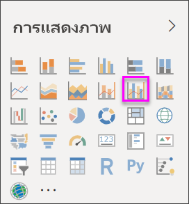
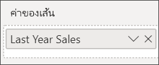
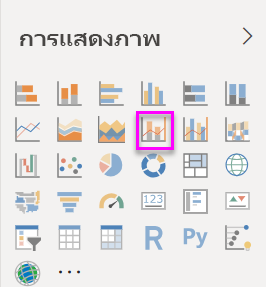
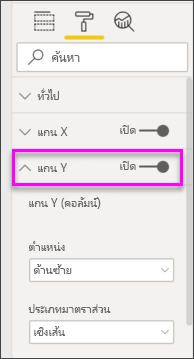
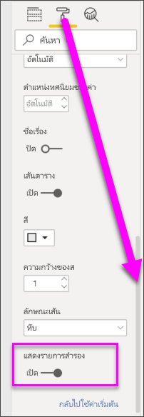

# สร้างและใช้แผนภูมิผสมใน Power BICreate and use combo charts in Power BI

[!INCLUDE[consumer-appliesto-nyyn](../includes/consumer-appliesto-nyyn.md)]

[!INCLUDE [power-bi-visuals-desktop-banner](../includes/power-bi-visuals-desktop-banner.md)]

ใน Power BI แผนภูมิผสม เป็นการแสดงผลภาพที่รวมเอาแผนภูมิเส้นและแผนภูมิคอลัมน์เข้าด้วยกันIn Power BI, a combo chart is a single visualization that combines a line chart and a column chart. การรวมแผนภูมิทั้ง 2 ให้เป็นหนึ่งเดียว ช่วยให้คุณทำการเปรียบเทียบข้อมูลได้อย่างรวดเร็วCombining the 2 charts into one lets you make a quicker comparison of the data.

แผนภูมิผสม สามารถมีแกน Y หนึ่งหรือสองแกนก็ได้Combo charts can have one or two Y axes.

## เมื่อใดที่ต้องใช้แผนภูมิผสมWhen to use a Combo chart
แผนภูมิผสม เป็นตัวเลือกที่ดี:Combo charts are a great choice:

* เมื่อคุณมีแผนภูมิเส้นและแผนภูมิคอลัมน์ ที่ใช้แกน X เดียวกันwhen you have a line chart and a column chart with the same X axis.
* เพื่อเปรียบเทียบหลายหน่วยวัด ที่มีช่วงของค่าที่แตกต่างกันto compare multiple measures with different value ranges.
* เพื่อแสดงความสัมพันธ์ระหว่างสองหน่วยวัดในการแสดงผลหนึ่งภาพto illustrate the correlation between two measures in one visualization.
* เพื่อตรวจสอบว่า หน่วยวัดหนึ่งบรรลุตามเป้าหมายที่ถูกกำหนดโดยอีกหน่วยวัดหนึ่งหรือไม่to check whether one measure meet the target which is defined by another measure
* เพื่อประหยัดพื้นที่ทำงานto conserve canvas space.

> [!NOTE]
> การแชร์รายงานของคุณกับผู้ร่วมงาน Power BI กำหนดให้คุณต้องมีสิทธิ์การใช้งาน Power BI Pro แต่ละรายการ หรือรายงานจะถูกบันทึกในความจุแบบพรีเมียมSharing your report with a Power BI colleague requires that you both have individual Power BI Pro licenses or that the report is saved in Premium capacity.

### ข้อกำหนดเบื้องต้นPrerequisites
บทช่วยสอนนี้ใช้[ไฟล์ PBIX ตัวอย่างการวิเคราะห์การค้าปลีก](https://download.microsoft.com/download/9/6/D/96DDC2FF-2568-491D-AAFA-AFDD6F763AE3/Retail%20Analysis%20Sample%20PBIX.pbix)This tutorial uses the [Retail Analysis sample PBIX file](https://download.microsoft.com/download/9/6/D/96DDC2FF-2568-491D-AAFA-AFDD6F763AE3/Retail%20Analysis%20Sample%20PBIX.pbix).

1. จากด้านบนซ้ายของแถบเมนู เลือก **ไฟล์** > **เปิด**From the upper left section of the menubar, select **File** > **Open**
   
2. ค้นหาสำเนา **ไฟล์ PBIX ตัวอย่างการวิเคราะห์การค้าปลีก**Find your copy of the **Retail Analysis sample PBIX file**

1. เปิด **ไฟล์ PBIX ตัวอย่างการวิเคราะห์การค้าปลีก** ในมุมมองรายงาน Open the **Retail Analysis sample PBIX file** in report view .

1. เลือกSelect  หากต้องการเพิ่มหน้าใหม่to add a new page.

## สร้างแผนภูมิผสมแบบพื้นฐานที่มีแกนเดียวCreate a basic, single-axis, Combo Chart
ดู Will สร้างแผนภูมิผสมโดยใช้ตัวอย่างการวิเคราะห์ด้านการขายปลีกWatch Will create a combo chart using the Sales and Marketing sample.
   > [!NOTE]
   > วิดีโอนี้ใช้ Power BI Desktop เวอร์ชันเก่าThis video uses an older version of Power BI Desktop.
   > 
   > 
<iframe width="560" height="315" src="https://www.youtube.com/embed/lnv66cTZ5ho?list=PL1N57mwBHtN0JFoKSR0n-tBkUJHeMP2cP" frameborder="0" allowfullscreen></iframe>  

1. เริ่มจากหน้ารายงานเปล่าและจัดทำแผนภูมิแท่งที่แสดงยอดขายต่อปีและกำไรเบื้องต้นต่อเดือนStart on a blank report page and create a column chart that displays this year's sales and gross margin by month.

    a.a.  จากบานหน้าต่างเขตข้อมูล เลือก **ยอดขาย**\>**ยอดขายปีนี้** > **ค่า**From the Fields pane, select **Sales** \> **This Year Sales** > **Value**.

    b.b.  ลาก **ยอดขาย** \> **กำไรขั้นต้นปีนี้** ไปยัง **ค่า**Drag **Sales** \> **Gross Margin This Year** to the **Value** well.

    c.c. เลือก **เวลา** \> **FiscalMonth** เพื่อเพิ่มไปยัง **แกน**Select **Time** \> **FiscalMonth** to add it to the **Axis** well.

    
5. เลือก **ตัวเลือกเพิ่มเติม** (...) ที่มุมบนขวาของการแสดงภาพและเลือก **เรียงลำดับตาม > FiscalMonth**Select **More options** (...) in the upper-right corner of the visualization, and select **Sort by > FiscalMonth**. เมื่อต้องเปลี่ยนลำดับการจัดเรียง เลือกจุดไข่ปลาอีกครั้ง แล้วคลิก **เรียงลำดับจากน้อยไปมาก** หรือ **เรียงลำดับจากมากไปน้อย**To change the sort order, select the ellipsis again and choose either **Sort ascending** or **Sort descending**. ในตัวอย่างนี้เราจะใช้ **เรียงลำดับจากน้อยไปมาก**For this example will use **Sort ascending**.

6. แปลงแผนภูมิคอลัมน์ให้เป็นแผนภูมิผสมConvert the column chart to a combo chart. มีแผนภูมิผสมสองแผนภูมิที่สามารถใช้งานได้: **เส้นกับคอลัมน์แบบเรียงซ้อน** และ **เส้นกับแผนภูมิคอลัมน์กลุ่ม**There are two combo charts available: **Line and stacked column** and **Line and clustered column**. เมื่อยังเลือกแผนภูมิคอลัมน์นี้อยู่ ในบานหน้าต่าง **แสดงภาพ** เลือก **แผนภูมิเส้นและแผนภูมิกลุ่มคอลัมน์**With the column chart selected, from the **Visualizations** pane select the **Line and clustered column chart**.

    
7. จากบานหน้าต่าง **เขตข้อมูล** ลาก **ยอดขาย** \> **ยอดขายปีล่าสุด** ไปยังบักเก็ต **ค่าเส้นตรง**From the **Fields** pane, drag **Sales** \> **Last Year Sales** to the **Line Values** bucket.

   

   แผนภูมิผสมของคุณควรมีลักษณะดังนี้:Your combo chart should look something like this:

   

## สร้างแผนภูมิผสมที่มีสองแกนCreate a combo chart with two axes
ในงานที่จะทำต่อนี้ เราจะเปรียบเทียบอัตรากำไรขั้นต้นกับยอดขายIn this task, we'll compare gross margin and sales.

1. จัดทำแผนภูมิเส้นใหม่ที่แสดงข้อมูล **ยอดขายเบื้องต้นปีก่อนหน้าเป็น %** ตาม **เดือนในรอบปีบัญชี**Create a new line chart that tracks **Gross Margin last year %** by **FiscalMonth**. เลือกจุดไข่ปลาการเรียงลำดับตาม **เดือน** และ **จากน้อยไปหามาก**Select the ellipsis to sort it by **Month** and **Ascending**.  
ในเดือนมกราคม %กำไรขั้นต้น อยู่ที่ 35% ไปจุดสุงสุดที่ 45% ในเดือนเมษายน ตกลงในเดือนกรกฎาคม และกลับไปสูงสุดอีกครั้งในเดือนสิงหาคมIn January GM% was 35%, peaked at 45% in April, dropped in July and peaked again in August. เราจะเห็นรูปแบบที่คล้ายกัน ในยอดขายปีที่แล้วและของปีนี้หรือไม่?Will we see a similar pattern in sales last year and this year?

   
2. เพิ่ม **ยอดขายปีนี้ > ค่า** และ **ยอดขายปีที่แล้ว** ลงในแผนภูมิเส้นAdd **This Year Sales > Value** and **Last Year Sales** to the line chart. ขนาดของ **%อัตรากำไรขั้นต้นปีที่แล้ว** น้อยกว่าขนาดของ **ยอดขาย** ซึ่งทำให้ยากต่อการเปรียบเทียบThe scale of **Gross Margin Last Year %** is much smaller than the scale of **Sales** which makes it difficult to compare.      

   
3. เพื่อให้ง่ายต่อการอ่านและตีความวิชวล แปลงแผนภูมิเส้นให้เป็น แผนภูมิเส้นและแผนภูมิคอลัมน์แบบเรียงซ้อนTo make the visual easier to read and interpret, convert the line chart to a Line and Stacked Column chart.

   

4. ลาก **%อัตรากำไรปีที่แล้ว** จาก **ค่าคอลัมน์** ลงใน **ค่าเส้นตรง**Drag **Gross Margin Last Year %** from **Column Values** into **Line Values**. Power BI จะสร้างแกนสองแกน ซึ่งช่วยให้ชุดข้อมูลมีการปรับขนาดต่างกัน หน่วยวัดด้านซ้ายเป็นยอดขายในหน่วยดอลลาร์ ส่วนด้านขวาวัดเป็นเปอร์เซ็นต์Power BI creates two axes, thus allowing the datasets to be scaled differently; the left measures sales dollars and the right measures percentage. และเราเห็นคำตอบคำถามของเรา ใช่ เราดูแบบที่คล้ายกันAnd we see the answer to our question; yes, we do see a similar pattern.

       

## เพิ่มหัวข้อให้กับแกนAdd titles to the axes
1. เลือกไอคอนลูกกลิ้งระบายสีSelect the paint roller icon  ในการเปิดพื้นที่การจัดรูปแบบto open the Formatting pane.
1. เลือกลูกศรลงเพื่อขยายตัวเลือกของ **แกน Y**Select the down arrow to expand the **Y-axis** options.
1. สำหรับ **แกน Y (คอลัมน์)** ตั้งค่า **ตำแหน่ง** ไปเป็น **ซ้าย**, ตั้งค่า **หัวข้อ** เป็น **เปิด**, **สไตล์** เป็น **แสดงเฉพาะหัวข้อ** และ **แสดง** ในหน่วย **ล้าน**For **Y-Axis (Column)**, set **Position** to **Left**, set **Title** to **On**, **Style** to  **Show title only**, and **Display units** as **Millions**.

   
4. จากr **แกน Y (คอลัมน์)** ให้เลื่อนลงจนเห็น **แสดงรายการสำรอง**Under **Y-Axis (Column)**, scroll down until you see **Show secondary**. เนื่องจากมีตัวเลือกมากมายสำหรับแกน Y คุณอาจต้องใช้แถบเลื่อนทั้งสองชุดBecause there are so many options for the Y axes, you may have to use both scrollbars. หัวข้อ แสดงรายการสำรองจะแสดงตัวเลือกสำหรับการจัดรูปแบบ ส่วนของแผนภูมิเส้นภายในแผนภูมิผสมThe Show secondary section displays options for formatting the line chart portion of the combo chart.

   
5. สำหรับ **แกน Y (เส้น)** ปล่อยให้ **ตำแหน่ง** ยังคงเป็น **ขวา** เลื่อน **หัวข้อ** ให้เป็น **เปิด** และตั้งค่า **สไตล์** เป็น **แสดงเฉพาะหัวข้อ**For **Y-Axis (Line)**, leave **Position** as **Right**, turn **Title** to **On**, and set **Style** to **Show title only**.

   แผนภูมิผสมของคุณขณะนี้ แสดงแกนทั้งสองแกน และทั้งคู่ต่างก็มีหัวข้อYour combo chart now displays dual axes, both with titles.

   

6. (ไม่บังคับ) ปรับเปลี่ยนแบบอักษรข้อความ ขนาด และสี และตั้งค่าตัวเลือกการจัดรูปแบบอื่น ๆ เพื่อปรับปรุงการแสดงผลและทำให้แผนภูมิอ่านง่ายขึ้นOptionally, modify the text font, size, and color and set other formatting options to improve the display and readability of the chart.

จากตรงนี้ คุณอาจต้องการ:From here you might want to:

* [เพิ่มแผนภูมิผสมเป็นไทล์แดชบอร์ด](../create-reports/service-dashboard-tiles.md)[Add the combo chart as a dashboard tile](../create-reports/service-dashboard-tiles.md).
* [บันทึกรายงาน](../create-reports/service-report-save.md)[Save the report](../create-reports/service-report-save.md).
* [ทำให้รายงานสามารถเข้าถึงได้มากขึ้นสำหรับผู้ทุพพลภาพ](../create-reports/desktop-accessibility-overview.md)[Make the report more accessible for people with disabilities](../create-reports/desktop-accessibility-overview.md).

## การไฮไลต์แบบเชื่อมโยง และการกรองข้ามCross-highlighting and cross-filtering

การไฮไลต์คอลัมน์หรือเส้นในแผนภูมิผสม เป็นการไฮไลต์แบบเชื่อมโยงและกรองข้ามไปยังการแสดงภาพอื่น ๆ บนหน้ารายงาน และในทางกลับกัน การยกเลิกไฮไลต์จะเป็นการยกเลิกการกระทำดังกล่าวHighlighting a column or line in a combo chart cross-highlights and cross-filters the other visualizations on the report page... and vice versa. ใช้[การปฏิสัมพันธ์กับภาพ](../create-reports/service-reports-visual-interactions.md) เพื่อเปลี่ยนคุณลักษณะเริ่มต้นนี้Use [visual interactions](../create-reports/service-reports-visual-interactions.md) to change this default behavior.

## ขั้นตอนถัดไปNext steps

[แผนภูมิโดนัทใน Power BIDoughnut charts in Power BI](power-bi-visualization-doughnut-charts.md)

[ชนิดการแสดงภาพใน Power BIVisualization types in Power BI](power-bi-visualization-types-for-reports-and-q-and-a.md)
