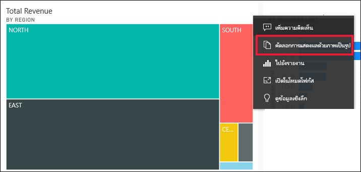
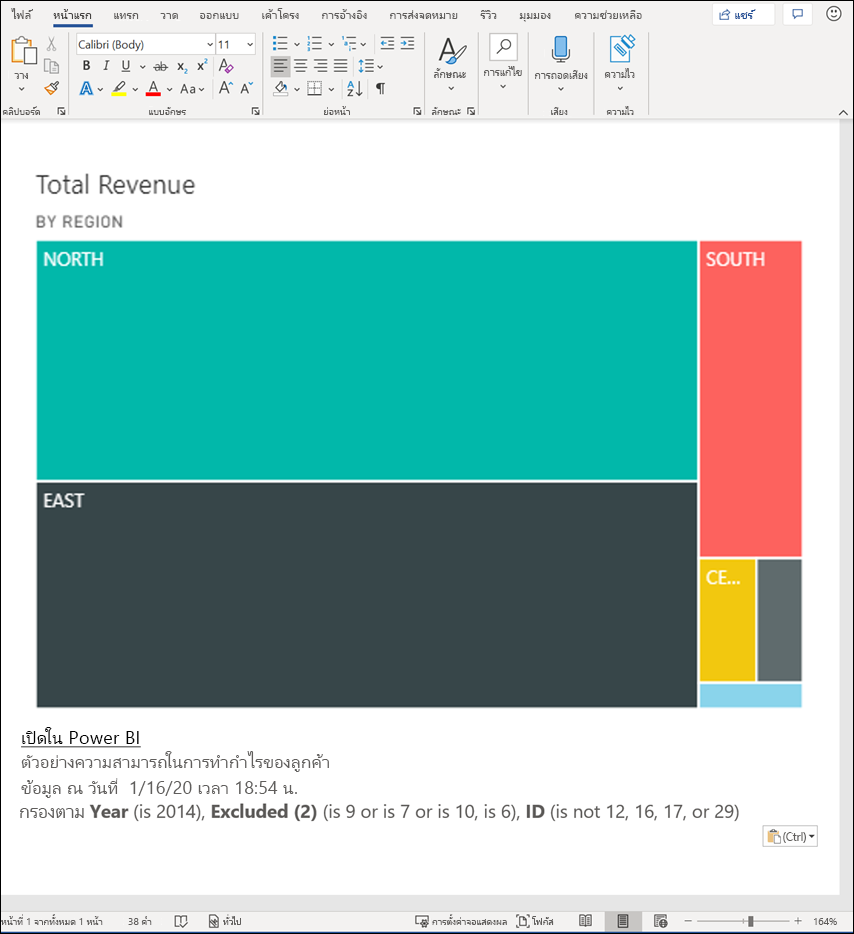
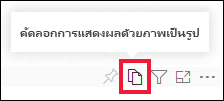
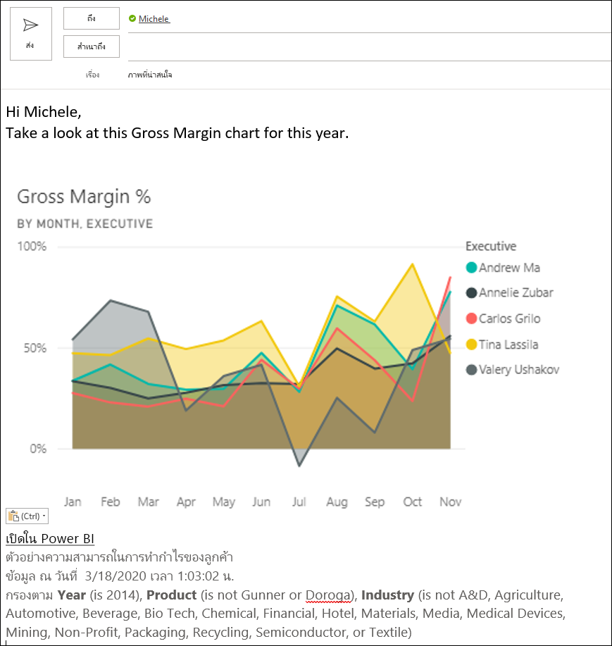
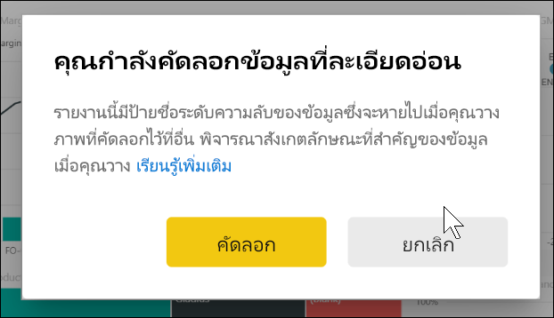
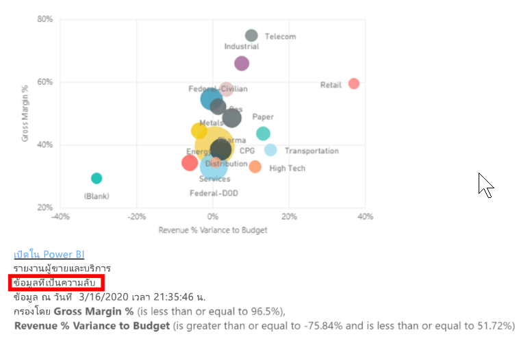
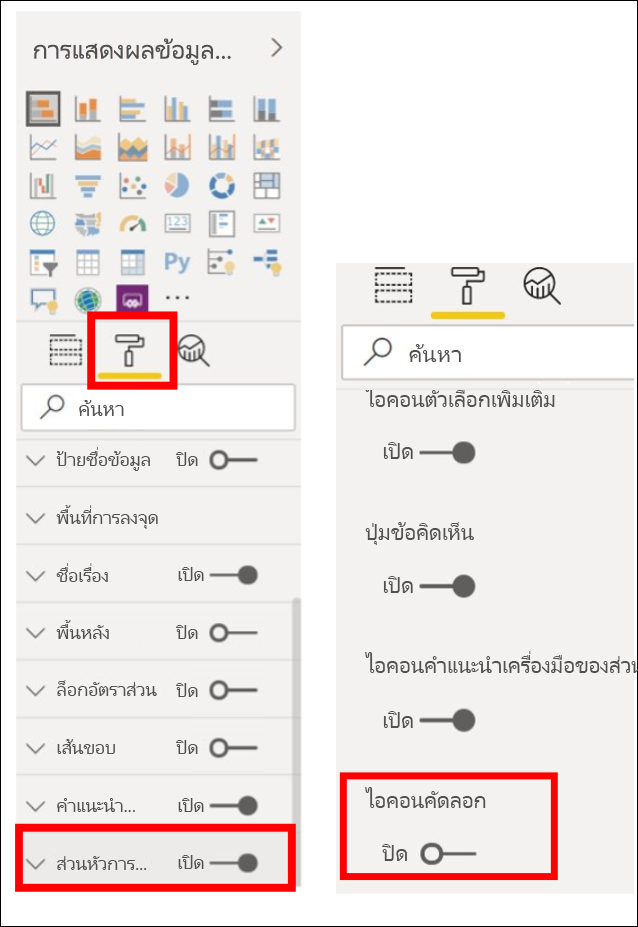
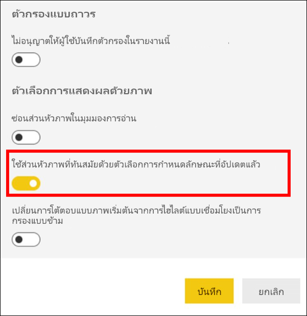
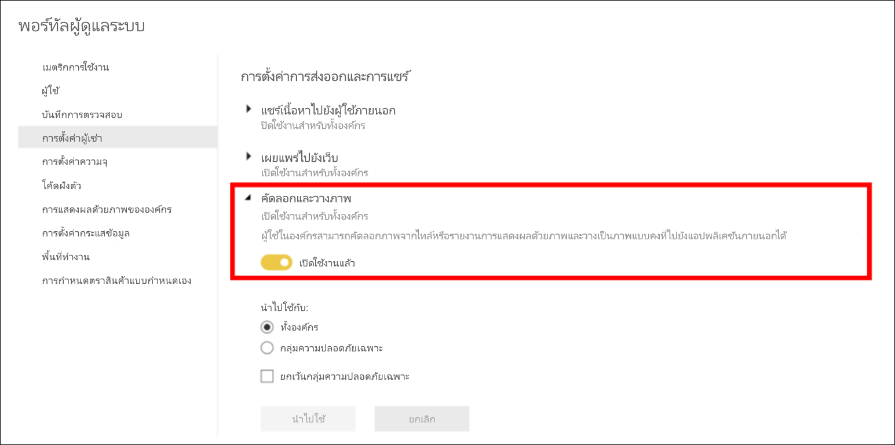
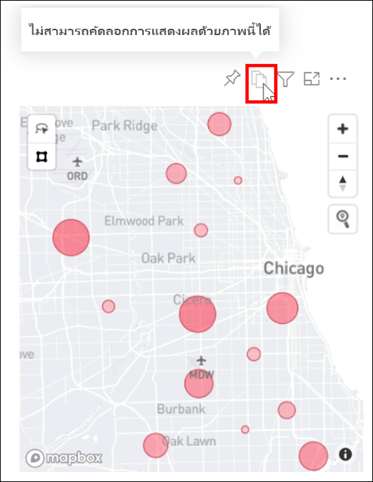

# คัดลอก และวางการแสดงภาพของรายงานCopy and paste a report visualization

[!INCLUDE[consumer-appliesto-yyyn](../includes/consumer-appliesto-yyyn.md)]

บทความนี้ครอบคลุมวิธีในการคัดลอกและวางวิชวลที่แตกต่างกันสองวิธีThis article covers two different ways to copy and paste a visual. 
* คัดลอกวิชวลในรายงานและวางลงในหน้ารายงานอื่น (จำเป็นต้องมีสิทธิในการแก้ไขสำหรับรายงาน)copy a visual in a report and paste it onto another report page (requires editing permissions for the report)

* คัดลอกรูปภาพของวิชวลจาก Power BI ไปยังคลิปบอร์ดของคุณและวางลงในแอปพลิเคชันอื่นๆ (มีให้ใช้งานใน Power BI service และ mobile ซึ่งไม่มีให้ใช้งานใน Power BI Desktop)copy an image of a visual from Power BI to your clipboard, and paste it into other applications (available in the Power BI service and mobile, unavailable in Power BI Desktop)

## คัดลอกและวางภายในรายงานเดียวกันCopy and paste within the same report
คุณสามารถคัดลอกวิชวลในรายงาน Power BI จากหน้าหนึ่งในรายงานไปยังหน้าเดียวกันหรือหน้าอื่นในรายงานเดียวกันVisuals in Power BI reports can be copied from one page in the report to the same page or different page in the same report. 

การคัดลอก และการวางการแสดงภาพจะต้องมีสิทธิ์ในการแก้ไขสำหรับรายงานCopying and pasting a visualization requires edit permissions to the report. ในบริการของ Power BI หมายถึงการเปิดรายงานใน [มุมมองการแก้ไข](../consumer/end-user-reading-view.md)In the Power BI service, this means opening the report in [Editing View](../consumer/end-user-reading-view.md). 

การแสดงผลข้อมูลด้วยภาพบน *แดชบอร์ด* ที่ไม่สามารถคัดลอกและวางลงในรายงาน Power BI หรือแดชบอร์ดอื่น ๆ ได้Visualizations on *dashboards* can't be copied and pasted into Power BI reports or other dashboards.

1. เปิดรายงานที่มีการแสดงภาพอย่างน้อยหนึ่งรายการOpen a report that has at least one visualization.  

2. เลือกการแสดงภาพ และใช้ **Ctrl + C** เมื่อต้องการคัดลอก และ **Ctrl + V** เมื่อต้องการวางSelect the visualization and use **Ctrl +C** to copy, and **Ctrl +V** to paste.      

   

## คัดลอกวิชวลเป็นรูปภาพไปยังคลิปบอร์ดของคุณCopy a visual as an image to your clipboard

คุณเคยต้องการแชร์รูปภาพจากรายงานหรือแดชบอร์ด Power BI หรือไม่Have you ever wanted to share an image from a Power BI report or dashboard? ในตอนนี้ คุณสามารถคัดลอกวิชวลจาก Power BI service และ mobile และวางลงในแอปพลิเคชันอื่น ๆ ที่สนับสนุนการวางNow you can copy the visual from the Power BI service or mobile and paste it into any other application that supports pasting. 

เมื่อคุณคัดลอกรูปภาพของวิชวลแบบสแตติก คุณจะได้รับสำเนาของวิชวลพร้อมกับเมตาดาต้าWhen you copy a static image of a visual, you get a copy of the visual along with the metadata. รวมถึง:This includes:
* ลิงก์กลับไปที่รายงานหรือแดชบอร์ด Power BIlink back to the Power BI report or dashboard
* ชื่อเรื่องของรายงานหรือแดชบอร์ดtitle of the report or dashboard
* สังเกตว่ารูปมีข้อมูลที่เป็นความลับหรือไม่notice if the image contains confidential information
* การประทับเวลาที่อัปเดตครั้งล่าสุดlast updated time stamp
* ตัวกรองที่นำไปใช้กับวิชวลfilters applied to the visual

### คัดลอกจากไทล์แดชบอร์ดCopy from a dashboard tile

1. เปิด Power BI service แล้วนำทางไปยังแดชบอร์ดที่คุณต้องการคัดลอกOpen the Power BI service and navigate to the dashboard you want to copy from.

2. จากมุมบนขวาของวิชวล ให้เลือก **ตัวเลือกเพิ่มเติม (...)** และเลือก **คัดลอกวิชวลเป็นรูปภาพ**From the upper right corner of the visual, select **More options(...)** and choose **Copy visual as image**. 

    

3. เมื่อกล่องโต้ตอบ **วิชวลของคุณพร้อมที่จะคัดลอก** ปรากฏขึ้น ให้เลือก **คัดลอกไปยังคลิปบอร์ด**When the **Your visual is ready to copy** dialog appears, select **Copy to clipboard**.

    

4. เมื่อวิชวลของคุณพร้อมแล้ว ให้วางลงในแอปพลิเคชันอื่นโดยใช้ **Ctrl + V** หรือคลิกขวา > วางWhen your visual is ready, paste it into another application using **Ctrl + V** or right-click > Paste. ในภาพหน้าจอด้านล่าง เราได้วางวิชวลลงใน Microsoft WordIn the screenshot below, we've pasted the visual into Microsoft Word. 

    

### คัดลอกจากวิชวลรายงานCopy from a report visual 

1. เปิด Power BI service แล้วนำทางไปยังรายงานที่คุณต้องการคัดลอกOpen the Power BI service and navigate to the report you want to copy from.

2. จากมุมบนขวาของวิชวล ให้เลือกไอคอนสำหรับ **คัดลอกวิชวลเป็นรูปภาพ**From the upper right corner of the visual, select the icon for **Copy visual as image**. 

    

3. เมื่อกล่องโต้ตอบ **วิชวลของคุณพร้อมที่จะคัดลอก** ปรากฏขึ้น ให้เลือก **คัดลอกไปยังคลิปบอร์ด**When the **Your visual is ready to copy** dialog appears, select **Copy to clipboard**.

    

4. เมื่อวิชวลของคุณพร้อมแล้ว ให้วางลงในแอปพลิเคชันอื่นโดยใช้ **Ctrl + V** หรือคลิกขวา > วางWhen your visual is ready, paste it into another application using **Ctrl + V** or right-click > Paste. ในภาพหน้าจอด้านล่าง เราได้วางวิชวลลงในอีเมลIn the screenshot below, we've pasted the visual into an email.

    

5. ถ้ามีการใช้ป้ายชื่อระดับความลับของข้อมูลกับรายงาน คุณจะได้รับคำเตือนเมื่อคุณเลือกไอคอนคัดลอกIf there is a data sensitivity label applied to the report, you'll receive a warning when you select the copy icon.  

    

    และป้ายชื่อระดับความลับจะถูกเพิ่มลงในเมตาดาต้าด้านล่างของวิชวลที่วางAnd, a sensitivity label will be added to the metadata below the pasted visual. 

    

### จัดการการใช้ คัดลอกวิชวลเป็นรูปภาพManage use of copying a visual as an image
ถ้าคุณเป็นเจ้าของเนื้อหาหรือเป็นผู้ดูแลระบบของผู้เช่า คุณสามารถควบคุมว่าจะสามารถคัดลอกวิชวลเป็นรูปภาพจากรายงานหรือแดชบอร์ดได้หรือไม่If you own the content or are an administrator of the tenant, you can control whether a visual can be copied as an image from a report or dashboard.

#### ปิดใช้งาน คัดลอกเป็นรูปภาพ สำหรับวิชวลที่ระบุDisable copy as an image for a specific visual
ถ้าคุณไม่ต้องการให้ผู้ใช้สามารถคัดลอกวิชวลเฉพาะได้ คุณสามารถลบไอคอนคัดลอกออกจากวิชวลใน Power BI serviceIf you don't want users to be able to copy a specific visual, you can remove the copy icon from that visual in the Power BI service.    
1. เลือกไอคอนแปรงลูกกลิ้งเพื่อเปิดบานหน้าต่างจัดรูปแบบSelect the paint roller icon to open the Formatting pane. 

1. เปิดการ์ด **การจัดรูปแบบวิชวล**Open the **Visual formatting** card.
1. เลื่อนลงไปที่ **ส่วนหัวของวิชวล** ขยายการ์ด และปิด **ไอคอนคัดลอก**Scroll down to **Visual header**, expand the card, and toggle off **Copy icon**.

    

1. ถ้าคุณไม่พบการตั้งค่า **ส่วนหัวของวิชวล** ให้เปิดใช้งานตัวเลือกส่วนหัวของวิชวลที่ทันสมัยภายใต้ **การตั้งค่ารายงาน**If you can't find the **Visual header** setting, turn on the modern visual header option under **Report settings**. 

    

1. บันทึกการเปลี่ยนแปลงSave changes. แชร์ต่อและเผยแพร่ใหม่ตามความจำเป็นReshare and republish as needed.

#### ปิดใช้งาน คัดลอกเป็นรูปภาพ สำหรับกลุ่มของผู้ใช้Disable copy as an image for a group of users

ถ้าคุณเป็นเจ้าของเนื้อหาหรือเป็นผู้ดูแลระบบของผู้เช่า คุณสามารถควบคุมว่าใครสามารถคัดลอกวิชวลได้บ้างIf you own the content or are an administrator of the tenant, you can control who can copy visuals. การตั้งค่านี้จะปิดใช้งาน *คัดลอกวิชวลเป็นรูปภาพ* สำหรับเนื้อหาทั้งหมดที่ผู้ที่เข้าถึงใน Power BIThis setting disables *copying visual as image* for all content the user accesses in the Power BI tenant.
  
1. นำทางไปยังพอร์ทัลผู้ดูแลระบบNavigate to the Admin Portal.

1. ภายใต้ **การตั้งค่าผู้เช่า** ให้เลือก **การตั้งค่าการส่งออกและการแชร์**Under **Tenant settings**, select **Export and sharing settings**. 

    

1. ปิดใช้งาน **คัดลอกและวางวิชวล** สำหรับกลุ่มผู้ใช้ที่เลือกของคุณDisable **Copy and paste visuals**, for your selected user groups. 

1. บันทึกการเปลี่ยนแปลง และกลุ่มที่ระบุจะไม่สามารถใช้ **คัดลอกวิชวลเป็นรูปภาพ** ตลอดทั่วทั้ง Power BI ได้Save changes, and the specified groups will not be able to use **Copy visual as image** throughout Power BI. 
  

## ข้อควรพิจารณาและการแก้ไขปัญหาConsiderations and troubleshooting

   

Q: ฉันไม่เห็นตัวเลือกการคัดลอกเป็นรูปQ: I don't see the Copy as image option    
A: หากคุณกำลังใช้ Power BI Desktop คุณลักษณะนี้จะยังไม่พร้อมใช้งานA: If you're using Power BI Desktop, this feature is not yet available    
Q: ทำไมไอคอนคัดลอกจึงปิดใช้งานบนวิชวล?Q: Why is the Copy icon disabled on a visual?    
A: ขณะนี้เราสนับสนุนวิชวล Power BI แบบเนทีฟและวิชวลที่รับรองA: We currently support native Power BI visuals and Certified Visuals. มีการสนับสนุนที่จำกัดสำหรับวิชวลบางอย่าง ซึ่งประกอบด้วย:There is limited support for certain visuals including: 
- ESRI และวิชวลแผนที่อื่น ๆESRI and other Map visuals 
- การแสดงผลด้วยภาพของ PythonPython visuals 
- วิชวล RR visuals 
- PowerAppsPowerApps 
- วิชวลแบบกำหนดเองที่ไม่ได้รับการรับรองสำหรับวิชวลแบบกำหนดเองของคุณ ให้เรียนรู้เพิ่มเติมเกี่ยวกับ [วิธีการรับรองวิชวลแบบกำหนดเองของคุณ](../developer/visuals/power-bi-custom-visuals-certified.md)Non-certified custom visuals For your custom visual to be supported, learn more about [how to certify your custom visual](../developer/visuals/power-bi-custom-visuals-certified.md). 

Q: เหตุใดวิชวลของฉันจึงวางไม่ถูกต้องQ: Why is my visual not pasting correctly?    
A: มีข้อจำกัดเกี่ยวกับการคัดลอกวิชวลเป็นรูปภาพ ซึ่งประกอบด้วย:A: There are limitations around copy visual as an image, including: 
- สำหรับวิชวลแบบกำหนดเองFor custom visuals 
    - วิชวลที่มีธีมและสีที่นำไปใช้Visuals with applied themes and colors 
    - การปรับมาตราส่วนไทล์เมื่อวางTile scaling when pasting 
    - วิชวลแบบกำหนดเองที่มีภาพเคลื่อนไหวCustom visuals with animations 
- การคัดลอกข้อจำกัดCopying constraints 
    - ไม่สามารถคัดลอกไทล์แดชบอร์ดที่ปักหมุดใหม่ได้Cannot copy a freshly pinned dashboard tile 
    - ไม่สามารถเปลี่ยนเส้นทางผู้ใช้ไปยังเนื้อหาด้วยตัวกรอง Odata และสถานะการตรึง เช่น บุ๊กมาร์กส่วนบุคคลCannot redirect users to content with Odata filters and sticky states such as personal bookmarks 
- แอปพลิเคชันที่มีการสนับสนุนแบบจำกัดสำหรับการวางเนื้อหา HTML ที่จัดรูปแบบจากคลิปบอร์ดอาจไม่แสดงผลทุกอย่างที่คัดลอกมาจากวิชวลApplications with limited support for pasting HTML-formatted content from the clipboard may not render everything that was copied from the visual 

## ขั้นตอนถัดไปNext steps
อ่านเพิ่มเติมเกี่ยวกับ[การแสดงภาพในรายงาน Power BI](power-bi-report-visualizations.md)More about [Visualizations in Power BI reports](power-bi-report-visualizations.md)

มีคำถามเพิ่มเติมหรือไม่More questions? [ลองไปที่ชุมชน Power BITry the Power BI Community](https://community.powerbi.com/)

