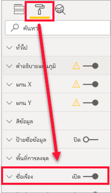
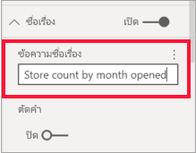
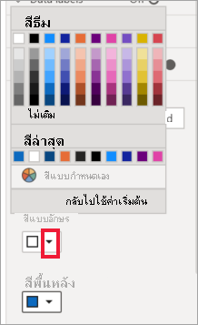
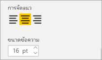
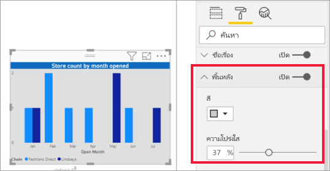
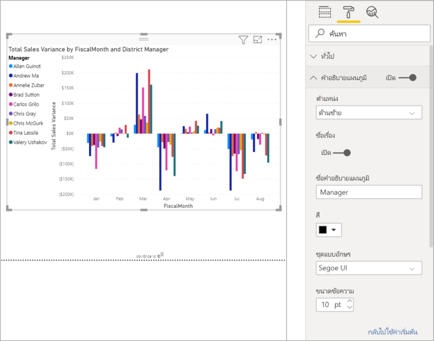
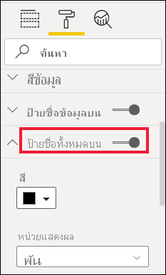
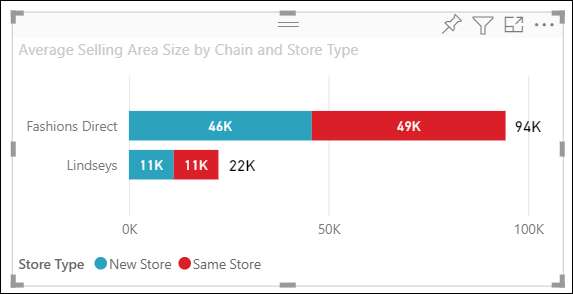

# กำหนดชื่อเรื่อง การแสดงผลด้วยภาพ พื้นหลัง ป้ายชื่อ และคำอธิบายแผนภูมิ

[!INCLUDE[consumer-appliesto-nyyn](../includes/consumer-appliesto-nyyn.md)]

ในบทช่วยสอนนี้ คุณจะได้เรียนรู้ถึงวิธีการกำหนดการแสดงภาพของคุณเองสองถึงสามวิธี มีตัวเลือกมากมายสำหรับการกำหนดการแสดงภาพของคุณ วิธีดีที่สุดในการเรียนรู้เกี่ยวกับทั้งหมดคือการสำรวจบานหน้าต่าง **รูปแบบ** (เลือกไอคอนลูกกลิ้งทาสี) เพื่อช่วยคุณเริ่มต้นใช้งาน บทความนี้จะแสดงวิธีการกำหนดชื่อเรื่องการแสดงผลด้วยภาพ คำอธิบายแผนภูมิ พื้นหลัง ป้ายชื่อ เลเยอร์ และเพิ่มธีม

คุณไม่สามารถกำหนดค่าการแสดงภาพทั้งหมด ดู [รายการทั้งหมด](#visualization-types-that-you-can-customize) ของการแสดงภาพสำหรับรายละเอียด

## ข้อกำหนดเบื้องต้น

- บริการ Power BI หรือ Power BI Desktop

- รายงานตัวอย่างการวิเคราะห์ร้านค้าปลีก

> [!NOTE]
> การแชร์รายงานของคุณกับผู้ร่วมงาน Power BI กำหนดให้คุณต้องมีสิทธิ์การใช้งาน Power BI Pro แต่ละรายการ หรือรายงานจะถูกบันทึกในความจุแบบพรีเมียม ดู [การแชร์รายงาน](../collaborate-share/service-share-reports.md)

## กำหนดชื่อเรื่องของการแสดงภาพในรายงาน

ในการทำตามขั้นตอนนี้ ลงชื่อเข้าใช้ Power BI Desktop และเปิดรายงาน [ตัวอย่างการวิเคราะห์ร้านค้าปลีก](../create-reports/sample-datasets.md)

> [!NOTE]
> เมื่อคุณปักหมุดภาพไปยังแดชบอร์ด การแสดงภาพจะกลายเป็นไทล์ของแดชบอร์ด นอกจากนี้ คุณสามารถกำหนดไทล์ด้วยตนเองให้มี[ชื่อเรื่องใหม่และคำบรรยาย ไฮเปอร์ลิงก์ และปรับขนาด](../create-reports/service-dashboard-edit-tile.md)ได้

1. ไปที่หน้า **ร้านค้าใหม่** ของรายงาน **ตัวอย่างการวิเคราะห์ร้านค้าปลีก**

1. เลือกแผนภูมิคอลัมน์คลัสเตอร์ **จำนวนร้านค้าที่เปิดตามเดือนที่เปิดและเครือร้านค้า**

1. ในพื้นที่ **การแสดงภาพ** นี้ เลือกไอคอนลูกกลิ้งทาสีเพื่อแสดงตัวเลือกการจัดรูปแบบ

1. เลือก **ชื่อเรื่อง** เพื่อขยายส่วนนั้น

   

1. เลื่อนแถบเลื่อน **ชื่อเรื่อง** ไปยัง **เปิด**

1. หากต้องการเปลี่ยนชื่อเรื่อง ให้ใส่ *จำนวนของร้านค้าแยกตามเดือนที่เปิด* ในเขตข้อมูล **ข้อความชื่อเรื่อง**

    

1. เปลี่ยน **สีแบบอักษร** เป็นสีขาว และ **สีพื้นหลัง** เป็นสีน้ำเงิน

    a. เลือกรายการแบบเลื่อนลง แล้วเลือกสีจาก **สีของธีม**, **สีล่าสุด**, หรือ **สีแบบกำหนดเอง**

    

    b. เลือกรายการแบบเลื่อนลงเพื่อปิดหน้าต่างสี

1. เพิ่มขนาดข้อความเป็น **16 pt**

1. การกำหนดค่าสุดท้ายที่คุณจะดำเนินการกับชื่อเรื่องแผนภูมิคือการจัดแนวกึ่งกลางของการแสดงภาพ

    

    ณ จุดนี้ในบทช่วยสอน ชื่อเรื่อง แผนภูมิคอลัมน์แบบกลุ่มของคุณจะมีลักษณะดังนี้:

    

บันทึกการเปลี่ยนแปลงที่คุณทำและย้ายไปยังส่วนถัดไป

เมื่อต้องการย้อนกลับการเปลี่ยนแปลงทั้งหมด ให้เลือก **ย้อนกลับไปเป็นค่าเริ่มต้น** ที่ด้านล่างของบานหน้าต่างการกำหนด **ชื่อเรื่อง** ด้วยตัวเอง

## กำหนดพื้นหลังการแสดงภาพด้วยตนเอง

ด้วยแผนภูมิคอลัมน์แบ่งคลัสเตอร์เดียวกันที่เลือก ขยายตัวเลือก **พื้นหลัง**

1. เลื่อนตัวเลื่อน **พื้นหลัง** ไปยัง **เปิด**

1. เลือกเมนูดรอปดาวน์แล้วเลือกสีเทา

1. เปลี่ยน **ความโปร่งใส** เป็น **74%**

ณ จุดนี้ในบทช่วยสอน พื้นหลังแผนภูมิคอลัมน์แบบกลุ่มของคุณจะมีลักษณะดังนี้:

บันทึกการเปลี่ยนแปลงที่คุณทำและย้ายไปยังส่วนถัดไป

เมื่อต้องการย้อนกลับการเปลี่ยนแปลงทั้งหมด ให้เลือก **ย้อนกลับไปเป็นค่าเริ่มต้น** ที่ด้านล่างของบานหน้าต่างการกำหนด **พื้นหลัง** ด้วยตัวเอง

## คำอธิบายแผนภูมิแสดงภาพที่กำหนดเอง

1. เปิดหน้ารายงาน **ภาพรวม** และเลือกแผนภูมิ **ผลต่างยอดขายรวมแยกตาม FiscalMonth และผู้จัดการเขต**

1. ในแท็บ **การแสดงผลด้วยภาพ** เลือกไอคอนลูกกลิ้งทาสีเพื่อเปิดบานหน้าต่างรูปแบบ

1. ขยายตัวเลือก **คำอธิบายแผนภูมิ**:

    

1. เลื่อนแถบเลื่อน **คำอธิบายแผนภูมิ** ไปยัง **เปิด**

1. ย้ายคำอธิบายแผนภูมิไปด้านซ้ายของการแสดงภาพ

1. เพิ่มชื่อคำอธิบายแผนภูมิโดยการสลับ **ชื่อ** ให้เป็น **เปิด**

1. ป้อน *ผู้จัดการ* ในเขตข้อมูล **ชื่อคำอธิบายแผนภูมิ**

1. เปลี่ยน **สี** เป็นสีดำ

บันทึกการเปลี่ยนแปลงที่คุณทำและย้ายไปยังส่วนถัดไป

เมื่อต้องการย้อนกลับการเปลี่ยนแปลงทั้งหมด ให้เลือก **ย้อนกลับไปเป็นค่าเริ่มต้น** ที่ด้านล่างของบานหน้าต่างการกำหนด **คำอธิบายแผนภูมิ** ด้วยตัวเอง

## กำหนดป้ายชื่อทั้งหมดสำหรับภาพแบบเรียงซ้อน

ภาพแบบเรียงซ้อนสามารถแสดงป้ายชื่อข้อมูลและป้ายชื่อทั้งหมดได้ ในแผนภูมิคอลัมน์แบบเรียงซ้อน ป้ายชื่อข้อมูลระบุค่าสำหรับแต่ละส่วนของคอลัมน์ ป้ายชื่อทั้งหมดจะแสดงค่าผลรวมสำหรับทั้งคอลัมน์ทั้งหมด 

ดู Rien เพิ่มป้ายชื่อทั้งหมดลงในแผนภูมิแบบเรียงซ้อนแล้วทำตามขั้นตอนด้านล่างเพื่อลองใช้งานด้วยตัวคุณเอง

> [!VIDEO https://www.youtube.com/embed/OgjX-pFGgfM]

1. เปิดหน้ารายงาน **ภาพรวม** และเลือก แผนภูมิแท่ง **ขนาดพื้นที่การขายโดยเฉลี่ยตามการเกียวโยงและชนิดของร้านค้า**

1. ในแท็บ **การแสดงผลด้วยภาพ** เลือก เพื่อแปลงแผนภูมิแท่งนี้เป็นแผนภูมิแท่งแบบเรียงซ้อน โปรดสังเกตว่าภาพยังคงมีป้ายชื่อข้อมูลอยู่

    

1. ในแท็บ **การแสดงผลด้วยภาพ** เลือกไอคอนลูกกลิ้งทาสีเพื่อเปิดบานหน้าต่างรูปแบบ

1. ย้ายแถบเลื่อน **ป้ายชื่อทั้งหมด** ไปเป็น **เปิด** 

    

1. อีกทางหนึ่งคือจัดรูปแบบป้ายชื่อทั้งหมด ในตัวอย่างนี้ เราได้เปลี่ยนสีเป็นสีดำ เพิ่มขนาดฟอนต์ และเลือกที่จะแสดงค่าเป็น **หลักพัน**

    

## กำหนดลำดับเลเยอร์เอง

เปลี่ยนลำดับการแบ่งเลเยอร์ของวิชวลและรูปทรงในรายงานของคุณ ลำดับเลเยอร์เป็นตัวกำหนดว่าวัตถุใดจะมาที่ด้านหน้าเมื่อเลือก เมื่อใดก็ตามที่คุณเลือกวัตถุบนพื้นที่รายงาน วัตถุนั้นจะกลายเป็นใช้งานอยู่และย้ายไปที่เลเยอร์บนสุด สำหรับวิชวล สิ่งนี้ช่วยให้โต้ตอบกับวิชวลที่เลือกได้ง่ายขึ้น แต่สำหรับรูปทรงและพื้นหลัง คุณอาจต้องการรักษาไว้ที่เลเยอร์ล่างสุดเพื่อไม่ให้คุณเลือกโดยไม่ได้ตั้งใจและปิดหรือบดบังวิชวลรายงานของคุณ 

การควบคุมการแบ่งเลเยอร์พร้อมใช้งานในบริการ Power BI, Power BI Desktop, อุปกรณ์เคลื่อนที่และเซิร์ฟเวอร์รายงาน บทความนี้แสดงวิธีการเปลี่ยนลักษณะการทำงานของลำดับเลเยอร์ในบริการ Power BI

ดู Rien เเปลี่ยนลักษณะการทำงานของลำดับเลเยอร์ แล้วทำตามขั้นตอนด้านล่างเพื่อลองใช้งานด้วยตัวคุณเอง

> [!VIDEO https://www.microsoft.com/videoplayer/embed/RE4IY3L]

1. เพิ่มหน้ารายงานใหม่โดยเลือกเครื่องหมายบวกสีเหลือง

1. เพิ่มรูปทรงไปยังพื้นที่ทำงาน ที่นี่เราได้เพิ่มสี่เหลี่ยมผืนผ้าสีน้ำเงิน

    

1. คัดลอกและวางวิชวลจากหน้าอื่นลงในรายงาน

    

    ตอนนี้คุณมี 2 เลเยอร์แล้ว ให้ลองเลือกแผนภูมิวงกลมแล้วเลือกพื้นหลัง เมื่อคุณเลือกแผนภูมิวงกลมแล้ว Power BI จะทำให้วัตถุนั้นใช้งานอยู่และแสดงเมนูส่วนหัว เมื่อคุณเลือกรูปสี่เหลี่ยมผืนผ้า Power BI จะทำให้วัตถุนั้นใช้งานอยู่และนำมาไว้ด้านหน้าที่ซึ่งบดบังแผนภูมิวงกลม คุณสามารถเปลี่ยนลักษณะการทำงานเริ่มต้นนี้ได้

1. เลือกสี่เหลี่ยมผืนผ้าและเปิดบานหน้าต่างการจัดรูปแบบ ขยาย **ทั่วไป** และค้นหาปุ่มสลับ **รักษาลำดับเลเยอร์** บันทึกการเปลี่ยนแปลงของรายงานและสลับไปยังมุมมองการอ่าน

    

1. ในมุมมองการอ่าน เมื่อคุณเลือกสี่เหลี่ยมผืนผ้าสีน้ำเงิน รูปทรงดังกล่าวจะยังคงอยู่ในเลเยอร์ด้านหลัง

## ปรับแต่งสีเองโดยใช้ธีม

ด้วยธีมรายงาน คุณสามารถใช้การเปลี่ยนแปลงการออกแบบกับรายงานทั้งหมดของคุณได้ เช่น การใช้สีสำหรับองค์กร การเปลี่ยนชุดไอคอน หรือการใช้การจัดรูปแบบภาพตามค่าเริ่มต้นใหม่ เมื่อคุณใช้ธีมรายงาน การแสดงผลด้วยภาพทั้งหมดในรายงานของคุณจะใช้สีและการจัดรูปแบบจากธีมที่คุณเลือก

เมื่อต้องการนำธีมไปใช้กับรายงานของคุณ ให้เลือก **สลับธีม** จากแถบเมนู เลือกธีม  รายงานด้านล่างใช้ธีม **Solar**

## ชนิดการแสดงผลด้วยภาพที่สามารถกำหนดเองได้

นี่คือรายการของการแสดงผลด้วยภาพและตัวเลือกที่กำหนดเองที่พร้อมใช้งานสำหรับแต่ละส่วน:

| การแสดงภาพ | ชื่อเรื่อง | พื้นหลัง | คำอธิบายแผนภูมิ | ป้ายชื่อทั้งหมด
|:--- |:--- |:--- |:--- |:--- |
| พื้นที่ | ใช่ | ใช่ |ใช่ | ใช่  |
| แผนภูมิแท่ง | ใช่ | ใช่ |ใช่ | ใช่ |
| การ์ด | ใช่ | ใช่ |n/a | n/a |
| การ์ดแบบหลายแถว | ใช่ | ใช่ | n/a | n/a |
| คอลัมน์แบบกำหนดเอง | ใช่ | ใช่ | ใช่ |  ใช่ |
| ผสม | ใช่ | ใช่ | ใช่ | ใช่ |
| แผนภูมิโดนัท | ใช่ | ใช่ | ใช่ | n/a |
| แผนที่แถบสี | ใช่ | ใช่ | ใช่ |n/a |
| แผนภูมิกรวย | ใช่ | ใช่ | n/a |n/a |
| ตัววัด | ใช่ | ใช่ | n/a |n/a |
| ผู้มีอิทธิพลหลัก | ใช่ | ใช่ | n/a |n/a |
| KPI | ใช่ | ใช่ | n/a |n/a |
| เส้น | ใช่ | ใช่ | ใช่ |n/a |
| แผนที่ | ใช่ | ใช่ | ใช่ |n/a |
| เมทริกซ์ | ใช่ | ใช่ | n/a |ใช่ |
| แผนภูมิวงกลม | ใช่ | ใช่ | ใช่ |n/a |
| ถามตอบ | ใช่ | ใช่ | n/a |n/a |
| แผนภูมิกระจาย | ใช่ | ใช่ | ใช่ |n/a |
| รูปร่าง | ใช่ | ใช่ | ใช่ |n/a |
| ตัวแบ่งส่วนข้อมูล | ใช่ | ใช่ | n/a |n/a |
| ตาราง | ใช่ | ใช่ | n/a |ใช่ |
| กล่องข้อความ | ไม่ | ใช่ | n/a |n/a |
| แผนที่ต้นไม้ | ใช่ | ใช่ | ใช่ |n/a |
| น้ำตก | ใช่ | ใช่ | ใช่ |n/a |

## ขั้นตอนถัดไป

- [คุณสมบัติแกน X และแกน Y ที่กำหนดด้วยตนเอง](power-bi-visualization-customize-x-axis-and-y-axis.md)

- [เริ่มใช้งานด้วยคุณสมบัติแกนและการจัดรูปแบบสี](service-getting-started-with-color-formatting-and-axis-properties.md)

มีคำถามเพิ่มเติมหรือไม่ [ลองไปที่ชุมชน Power BI](https://community.powerbi.com/)
