# ปรับแต่งคุณสมบัติแกน X และแกน Y ด้วยตนเองCustomize x-axis and y-axis properties

[!INCLUDE[consumer-appliesto-nyyn](../includes/consumer-appliesto-nyyn.md)]    

[!INCLUDE [power-bi-visuals-desktop-banner](../includes/power-bi-visuals-desktop-banner.md)]

ในบทช่วยสอนนี้ คุณจะได้เรียนรู้หลายวิธีในการปรับแต่งค่าแกน X และแกน Y ของการแสดงผลด้วยภาพของคุณIn this tutorial, you'll learn many different ways to customize the X-axis and Y-axis of your visuals. ไม่ใช่ภาพทั้งหมดที่มีแกนNot all visuals have axes. ตัวอย่างเช่น แผนภูมิวงกลมจะไม่มีแกนPie charts, for example, don't have axes. และตัวเลือกการกำหนดเองมีมากมายในระดับภาพต่อภาพAnd customization options vary from visual to visual. เนื่องจากมีตัวเลือกมากมายเกินกว่าที่จะกล่าวถึงในบทความเดียว ดังนั้นเราจะดูเฉพาะการปรับแต่งที่ใช้บ่อยที่สุดบางตัว เพื่อให้คุณคุ้นเคยกับการใช้บานหน้าต่าง **รูปแบบ** ของวิชวลบนพื้นที่รายงาน Power BIThere are too many options to cover in a single article, so we'll take a look at some of the most-used customizations and get comfortable using the visual **Format** pane in the Power BI report canvas.  

ดู Amanda ปรับแต่งแกน X และ Y ของเธอWatch Amanda customize her X- and Y-axes. เธอจะยังสาธิตวิธีการต่างๆ ในการควบคุมการเรียงต่อกันเมื่อใช้การดูรายละเอียดแนวลึกและการดูข้อมูลสรุปอีกด้วยShe'll also demonstrate the different ways to control concatenation when using drill down and drill up.

> [!NOTE]
> วิดีโอนี้ใช้ Power BI เวอร์ชันเก่าThis video uses an older version of Power BI.

<iframe width="560" height="315" src="https://www.youtube.com/embed/9DeAKM4SNJM" frameborder="0" allowfullscreen></iframe>

## ข้อกำหนดเบื้องต้นPrerequisites

- Power BI DesktopPower BI Desktop

- [ตัวอย่างการวิเคราะห์การค้าปลีกRetail Analysis Sample ](https://download.microsoft.com/download/9/6/D/96DDC2FF-2568-491D-AAFA-AFDD6F763AE3/Retail%20Analysis%20Sample%20PBIX.pbix)

## เพิ่มการแสดงผลข้อมูลด้วยภาพใหม่Add a new visualization

ก่อนที่คุณจะสามารถกำหนดค่าการแสดงผลด้วยภาพของคุณ คุณต้องสร้างการแสดงผลด้วยภาพก่อนBefore you can customize your visualization, you have to build it.

1. ใน Power BI Desktop ให้เปิดไฟล์ ตัวอย่างการวิเคราะห์ด้านการขายปลีกIn Power BI Desktop, open the Retail Analysis sample.  

2. ที่ด้านล่าง ให้เลือกไอคอนบวกสีเหลืองเพื่อเพิ่มหน้าใหม่At the bottom, select the yellow plus icon to add a new page. 

    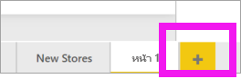

1. จากบานหน้าต่าง **การแสดงผลด้วยภาพ** เลือกไอคอนแผนภูมิคอลัมน์แบบเรียงซ้อนFrom the **Visualizations** pane, select the stacked column chart icon. สิ่งนี้จะเพิ่มเทมเพลตเปล่าไปยังพื้นที่รายงานของคุณThis adds an empty template to your report canvas.

    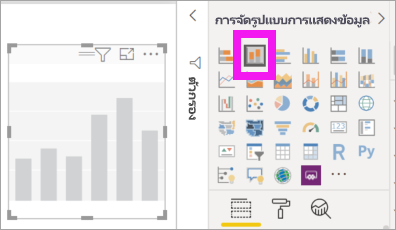

1. หากต้องการเพิ่มค่าแกน X ในบานหน้าต่าง **เขตข้อมูล** ให้เลือก **เวลา** > **เดือนทางบัญชี**To set the X-axis values, from the **Fields** pane, select **Time** > **FiscalMonth**.

1. หากต้องการตั้งค่าแกน Y จากบานหน้าต่าง **เขตข้อมูล** ให้เลือก **ยอดขาย**  >  **ยอดขายของปีที่ผ่านมา** และ **ยอดขาย** > **ยอดขายของปีนี้** > **ค่า**To set the Y-axis values, from the **Fields** pane, select **Sales** > **Last Year Sales** and **Sales** > **This Year Sales** > **Value**.

    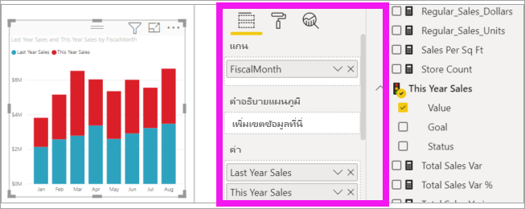

    ในตอนนี้คุณสามารถกำหนดค่าแกน X ของคุณเองNow you can customize your X-axis. Power BI ช่วยให้คุณมีตัวเลือกแบบไร้ขีดจำกัดสำหรับการจัดรูปแบบการแสดงผลข้อมูลด้วยภาพของคุณPower BI gives you almost limitless options for formatting your visualization. 

## ปรับแต่งแกน XCustomize the X-axis
มีคุณลักษณะหลายอย่างที่สามารถกำหนดเองได้สำหรับแกน XThere are many features that are customizable for the X-axis. คุณสามารถเพิ่มและปรับเปลี่ยนป้ายชื่อข้อมูลและชื่อแกน XYou can add and modify the data labels and X-axis title. สำหรับหมวดหมู่ คุณสามารถปรับเปลี่ยนความกว้าง ขนาดแ ละระยะห่างของแถบ คอลัมน์ เส้น และพื้นที่For categories, you can modify the width, size, and padding of bars, columns, lines, and areas. และสำหรับค่า คุณสามารถปรับเปลี่ยนหน่วยแสดงผล ตำแหน่งทศนิยม และเส้นตารางAnd for values, you can modify the display units, decimal places, and grid lines. ตัวอย่างต่อไปนี้แสดงการปรับแต่งสำหรับแผนภูมิคอลัมน์The following example shows customization for a column chart. เรามาเพิ่มการปรับแต่งบางอย่างเพื่อให้คุณคุ้นเคยกับตัวเลือกและจากนั้นคุณสามารถสำรวจที่เหลือได้ด้วยตัวคุณเองLet's add a few customizations to get you familiar with the options and then you can explore the rest on your own.

### ปรับแต่งป้ายชื่อแกน XCustomize the X-axis labels
ป้ายชื่อแกน X จะแสดงอยู่ด้านล่างของคอลัมน์ในแผนภูมิThe X-axis labels display below the columns in the chart. ในตอนนี้ ป้ายชื่อเหล่านั้นจะเป็นสีเทาอ่อน ขนาดเล็ก และยากต่อการอ่านRight now, they're light grey, small, and difficult to read. เรามาเปลี่ยนกันเถอะLet's change that.

1. ในบานหน้าต่าง **การแสดงผลข้อมูลด้วยภาพ** ให้เลือก **รูปแบบ** (ไอคอนรูปลูกกลิ้งทาสี )In the **Visualizations** pane, select **Format** (the paint roller icon  ) เพื่อแสดงตัวเลือกการปรับแต่ง) to reveal the customization options.

2. ขยายตัวเลือกแกน XExpand the X-axis options.

   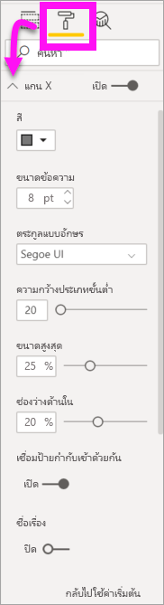

3. เลื่อนตัวเลื่อน **แกน X** ไปยัง **เปิด**Move the **X-axis** slider to **On**.

    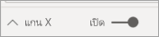

    ด้วยเหตุผลบางอย่างที่คุณอาจต้องการตั้งค่าแกน X เป็น **ปิด** คือถ้าการแสดงผลข้อมูลด้วยภาพนั้นสามารถอธิบายตนเองได้โดยไม่ต้องมีป้ายชื่อ หรือหากคุณมีหน้ารายงานที่แออัดและต้องทำให้มีพื้นที่ในการแสดงข้อมูลเพิ่มเติมมากขึ้นSome reasons you may want to set the X axis to **Off**, is if the visualization is self-explanatory without labels or if you have a crowded report page and need to make space to display more data.

4. จัดรูปแบบสีข้อความ ขนาด และแบบตัวอักษรFormat the text color, size, and font:

    - **สี**: เลือกสีดำ**Color**: Select black

    - **ขนาดของข้อความ**: ป้อน *14***Text size**: Enter *14*

    - **ชุดแบบอักษร**: เลือก **Arial Black****Font family**: Select **Arial Black**

    - **ช่องว่างด้านใน**: ป้อน *40%***Inner padding**: Enter *40%*

        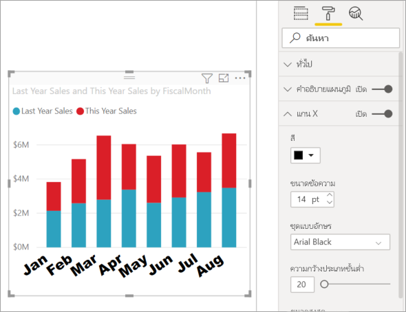
    
5. บางทีคุณอาจไม่ชอบวิธีการแสดงข้อความบนแกน X ในแนวทแยงมุมMaybe you don't like the way the X-axis text is displayed on a diagonal. คุณมีตัวเลือกหลากหลายYou have several options. 
    - เปลี่ยนขนาดตัวอักษรเป็นขนาดเล็กกว่า 14Change the text size to something smaller than 14.
    - ทำให้การแสดงผลข้อมูลด้วยภาพใหญ่ขึ้นMake the visualization larger. 
    - แสดงคอลัมน์น้อยลง และเพิ่มแถบเลื่อนโดยการเพิ่ม **ความกว้างหมวดหมู่ขั้นต่ำ**Display fewer columns and add a scrollbar by increasing **Minimum category width**. 
    
    ที่นี่ เราได้เลือกตัวเลือกที่สองและจับแถบปรับขนาดด้านใดด้านหนึ่งเพื่อทำให้การแสดงผลข้อมูลด้วยภาพกว้างขึ้นHere, we've selected the second option and grabbed one of the resize bars to make the visualization wider. ในตอนนี้ คุณปรับใช้ข้อความขนาด 14 จุดโดยไม่จำเป็นต้องแสดงข้อความบนมุมหรือด้วยแถบเลื่อนIt now accommodates the 14-point text without needing to display the text on an angle or with a scrollbar. 

   

### ปรับแต่งชื่อแกน XCustomize the X-axis title
เมื่อชื่อแกน X **เปิด** อยู่ ชื่อแกน X จะปรากฏใต้ป้ายชื่อแกน XWhen the X-axis title is **On**, the X-axis title displays below the X-axis labels. 

1. เริ่มต้นโดยการเปลี่ยนสถานะของชื่อแกน X เป็น **เปิด**Start by turning the X-axis title to **On**.  

    

    สิ่งแรกที่คุณจะสังเกตเห็นคือการแสดงผลข้อมูลด้วยภาพของคุณในขณะนี้มีชื่อแกน X เป็นค่าเริ่มต้นThe first thing you'll notice is that your visualization now has a default X-axis title.  ในกรณีนี้ เป็น **เดือนงบประมาณ**In this case, it's **FiscalMonth**.

   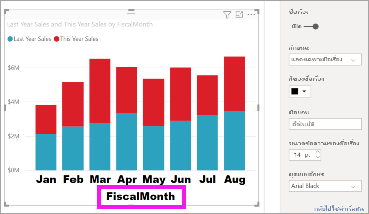

1. จัดรูปแบบสี ขนาด และแบบตัวอักษร ของชื่อเรื่อง:Format the title text color, size, and font:

    - **สีของชื่อเรื่อง**: เลือกสีส้ม**Title color**: Select orange

    - **ชื่อแกน**: พิมพ์ *เดือนทางบัญชี* (มีช่องว่างด้วย)**Axis title**: Type *Fiscal Month* (with a space)

    - **ขนาดข้อความของชื่อเรื่อง**: ป้อน *18***Title text size**: Enter *18*

    เมื่อคุณทำการปรับแต่งค่าเองเสร็จสิ้นแล้ว แผนภูมิคอลัมน์แบบเรียงซ้อนของคุณจะมีลักษณะดังนี้:After you finish the customizations, your stacked column chart looks something like this:

    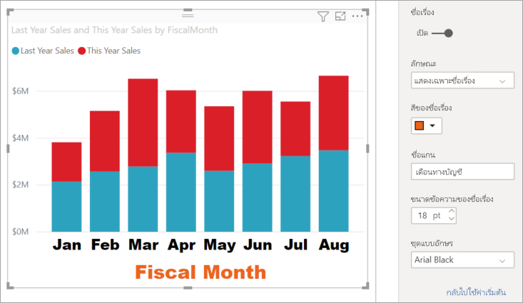

1. บันทึกการเปลี่ยนแปลงที่คุณทำและย้ายไปยังส่วนถัดไปSave the changes you've made and move to the next section. เมื่อต้องการย้อนกลับการเปลี่ยนแปลงทั้งหมด ให้เลือก **ย้อนกลับไปเป็นค่าเริ่มต้น** ที่ด้านล่างของบานหน้าต่างการกำหนด **แกน X** ด้วยตัวเองIf you ever need to revert all of the changes, select **Revert to default** at the bottom of the **X-Axis** customization pane. ถัดไป คุณจะกำหนดค่าแกน Y ของคุณเองNext, you'll customize your Y-Axis.

## ปรับแต่งแกน YCustomize the Y-axis
มีคุณลักษณะมากมายที่คุณสามารถใช้ปรับแต่งแกน Y ได้There are many features that can be customized for the Y-axis. คุณสามารถเพิ่มและปรับเปลี่ยนป้ายชื่อข้อมูล ชื่อแกน X และเส้นตารางได้You can add and modify the data labels, Y-axis title, and gridlines. สำหรับค่า คุณสามารถปรับเปลี่ยนหน่วยแสดงผล ตำแหน่งทศนิยม จุดเริ่มต้น และจุดสิ้นสุดได้For values, you can modify the display units, decimal places, starting point, and end point. และ สำหรับหมวดหมู่ คุณสามารถปรับเปลี่ยนความกว้าง ขนาดแ ละระยะห่างของแถบ คอลัมน์ เส้น และพื้นที่And, for categories, you can modify the width, size, and padding of bars, columns, lines, and areas. 

ตัวอย่างต่อไปนี้ยังคงเป็นการปรับแต่งแผนภูมิคอลัมน์ของเราThe following example continues our customization of a column chart. ลองทำการปรับแต่งเล็กน้อยเพื่อให้คุณคุ้นเคยกับตัวเลือกและจากนั้นคุณสามารถสำรวจที่เหลือได้ด้วยตัวคุณเองLet's make a few changes to get you familiar with the options, and then you can explore the rest on your own.

### ปรับแต่งป้ายชื่อแกน YCustomize the Y-axis labels
ป้ายชื่อแกน Y จะแสดงทางด้านซ้ายตามค่าเริ่มต้นThe Y-axis labels are displayed to the left by default. ในตอนนี้ ป้ายชื่อเหล่านั้นจะเป็นสีเทาอ่อน ขนาดเล็ก และยากต่อการอ่านRight now, they're light grey, small, and difficult to read. เรามาเปลี่ยนกันเถอะLet's change that.

1. ขยายตัวเลือกแกน YExpand the Y-Axis options.

   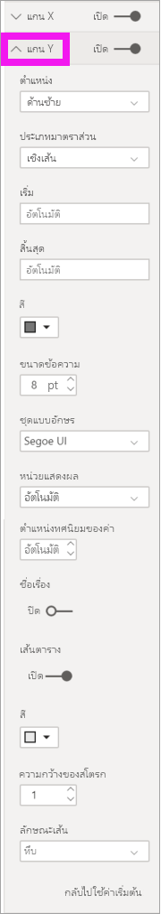

1. เลื่อนตัวเลื่อน **แกน Y** ไปยัง **เปิด**Move the **Y-Axis** slider to **On**.  

    

    เหตุผลหนึ่งที่คุณอาจต้องการปิดแกน Y คือเพื่อประหยัดพื้นที่สำหรับข้อมูลเพิ่มเติมOne reason you might want to turn off the Y-axis, is to save space for more data.

1. จัดรูปแบบสีข้อความ ขนาด และแบบตัวอักษรFormat the text color, size, and font:

    - **สี**: เลือกสีดำ**Color**: Select black

    - **ขนาดของข้อความ**: ป้อน *10***Text size**: Enter *10*

    - **หน่วยแสดงผล**: เลือก **หน่วยล้าน****Display units**: Select **Millions**

    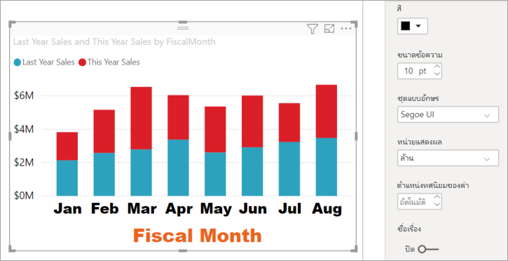

### ปรับแต่งชื่อแกน YCustomize the Y-axis title
เมื่อชื่อแกน Y **เปิด** อยู่ ชื่อแกน Y จะปรากฏถัดจากป้ายชื่อแกน YWhen the Y-axis title is **On**, the Y-axis title displays next to the Y-axis labels. สำหรับการแสดงผลภาพนี้ การมีชื่อแกน Y ไม่ได้ช่วยภาพให้ดีขึ้น ดังนั้นจึงปล่อยให้การแสดง **ชื่อเรื่อง** **ปิด**For this visualization, having a Y-Axis title doesn't improve the visual, so leave **Title** turned **Off**. เราจะเพิ่มชื่อแกน Y ไปยังวิชวลแบบสองแกนในภายหลังของบทช่วยสอนนี้We'll add Y-axis titles to a dual-axis visual later in this tutorial. 

### ปรับแต่งเส้นตารางCustomize the gridlines
เรามาทำเส้นตารางให้เด่นขึ้นมาโดยการเปลี่ยนสีและเพิ่มสโตรก:Let's make the gridlines stand out by changing the color and increasing the stroke:

- **สี**: เลือกสีส้ม**Color**: Select orange

- **สโตรก**: ป้อน *2***Stroke**: Enter *2*

หลังจากกำหนดค่าทั้งหมดเหล่านี้ แผนภูมิคอลัมน์ของคุณจะมีลักษณะดังนี้:After all these customizations, your column chart should look something like this:

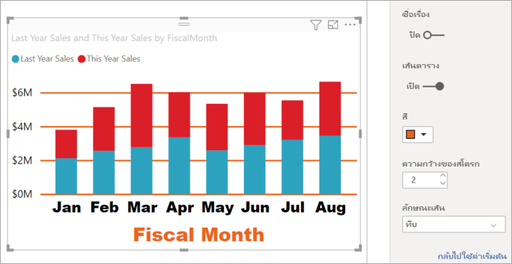

## กำหนดค่าการแสดงผลข้อมูลด้วยภาพให้มีแกน Y สองแกนCustomizing visualizations with dual Y axes

การแสดงผลข้อมูลด้วยภาพบางชนิดอาจได้รับประโยชน์จากการมีแกน Y สองแกนSome visualizations can benefit from having two Y axes. แผนภูมิผสมเป็นตัวอย่างที่ดีCombo charts are a good example. ก่อนที่เราจะสามารถจัดรูปแบบแกน Y คู่ เราจะสร้างแผนภูมิผสมที่เปรียบเทียบแนวโน้มสำหรับยอดขายและกำไรขั้นต้นBefore we can format dual Y axes, we'll create a combo chart that compares trends for sales and gross margin.  

### สร้างแผนภูมิที่มีแกน Y สองแกนCreate a chart with two Y-Axes

1. เลือกแผนภูมิคอลัมน์และเปลี่ยนเป็นแผนภูมิ *เส้นและคอลัมน์แบบเรียงซ้อน*Select the column chart, and change it to a *Line and stacked column* chart. วิชวลชนิดนี้รองรับค่าแผนภูมิเส้นเดียว และค่าคอลัมน์แบบเรียงซ้อนหลายอันThis type of visual supports a single line chart value and multiple stackable column values. 

    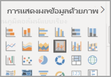
   

2. ลาก **ยอดขาย** >  **% อัตรากำไรขั้นต้นเมื่อปีที่แล้ว** จากบานหน้าต่างเขตข้อมูลของคุณไปยังบักเก็ต **ค่าบรรทัด**Drag **Sales** > **Gross Margin Last Year %** from your Fields pane into the **Line Values** bucket.

    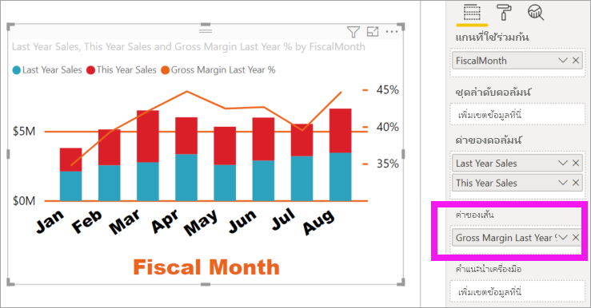

    
3. จัดรูปแบบการแสดงผลข้อมูลด้วยภาพใหม่เพื่อลบป้ายชื่อแกน X ที่อยู่ตรงมุมออกReformat the visualization to remove the angled X-axis labels. 

   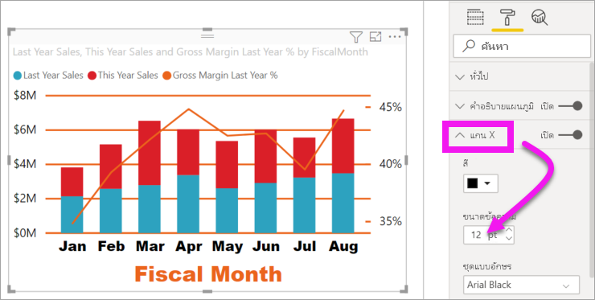

   Power BI สร้างแกน Y สองแกน ช่วยให้แต่ละแกนมีค่ามาตราส่วนที่แตกต่างกันได้Power BI creates two Y axes, allowing the values to be scaled differently. แกนซ้ายวัดยอดขายเป็นดอลลาร์ และแกนขวาวัดเปอร์เซ็นต์อัตรากำไรขั้นต้นThe left axis measures sales dollars and the right axis measures gross margin percentage.

### จัดรูปแบบแกน Y ที่สองFormat the second Y-Axis
เนื่องจากเราเริ่มต้นจากการแสดงผลข้อมูลด้วยภาพที่มีการจัดรูปแบบแกน Y หนึ่งแกนแล้ว ดังนั้น Power BI จึงได้สร้างแกน Y ที่สองโดยใช้การตั้งค่าเดียวกันBecause we started with a visualization with one formatted Y-axis, Power BI created the second Y-axis using the same settings. แต่เราสามารถเปลี่ยนแปลงได้But we can change that. 

1. ในบานหน้าต่าง **การจัดรูปแบบการแสดงข้อมูล** เลือกไอคอนลูกกลิ้งทาสี เพื่อแสดงตัวเลือการจัดรูปแบบIn the **Visualizations** pane, select the paint roller icon to display the format options.

1. ขยายตัวเลือกแกน YExpand the Y-Axis options.

1. เลื่อนลงจนกว่าคุณพบตัวเลือก **แสดงรายการสำรอง**Scroll down until you find the **Show secondary** option. ตรวจสอบว่าส่วนนี้ **เปิด**Verify that it is **On**. แกน Y ที่สองของเราแสดงแผนภูมิเส้นOur secondary Y axis represents the line chart.

   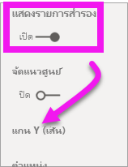

1. (ไม่บังคับ) ปรับแต่งสีฟอนต์ ขนาด และหน่วยแสดงผลสำหรับสองแกน(Optional) Customize the font color, size, and display units for the two axes. ถ้าคุณสลับ **ตำแหน่ง** สำหรับแกนคอลัมน์หรือแกนเส้นแล้ว ทั้งสองแกนจะสลับด้านกันIf you switch **Position** for either the column axis or the line axis, then the two axes switch sides.

### เพิ่มชื่อแกนให้กับทั้งสองแกนAdd titles to both axes

เนื่องจากการแสดงผลข้อมูลด้วยภาพที่ซับซ้อน สิ่งนี้จะช่วยในการเพิ่มชื่อแกนWith a visualization that's complex, it helps to add axes titles.  ชื่อแกนช่วยให้เพื่อนร่วมงานของคุณ เข้าใจเรื่องราวที่การแสดงภาพของคุณกำลังบอกTitles help your colleagues understand the story your visualization is telling.

1. สลับ **ชื่อแกน** ไปเป็น **เปิด** สำหรับ **แกน Y (คอลัมน์)** และ **แกน Y (เส้น)**Toggle **Title** to **On** for **Y-Axis (Column)** and the **Y-Axis (Line)**.

1. ตั้งค่า **สไตล์** เป็น **แสดงเฉพาะหัวข้อ** สำหรับทั้งสองSet **Style** to **Show title only** for both.

   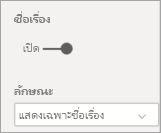

1. แผนภูมิผสมของคุณตอนนี้แสดงแกนทั้งสองแกนด้วยชื่อYour combo chart now shows dual axes, both with titles.

   

1. จัดรูปแบบชื่อแผนภูมิFormat the titles. ในตัวอย่างนี้ เราได้ย่อชื่อแกนหนึ่งแกน และลดขนาดตัวอักษรสำหรับชื่อเรื่องทั้งสองIn this example, we've shorted one of the titles and reduced the font size for both. 
    - ขนาดฟอนต์: **9**Font size: **9**
    - ย่อ **ชื่อแกน** สำหรับแกน Y แรก (แผนภูมิคอลัมน์): ยอดขายปีที่แล้วและปีนี้Shortened the **Axis title** for the first Y axis (the column chart): Sales last year & this year. 
    
     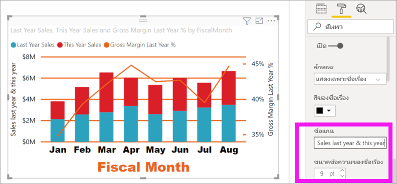

    สำหรับข้อมูลเพิ่มเติม โปรดดู [คำแนะนำและเคล็ดลับในการจัดรูปแบบสีใน Power BI](service-tips-and-tricks-for-color-formatting.md) และ [กำหนดชื่อเรื่องการแสดงผลข้อมูลด้วยภาพ คำอธิบายแผนภูมิ และพื้นหลัง](power-bi-visualization-customize-title-background-and-legend.md)For more information, see [Tips and tricks for color formatting in Power BI](service-tips-and-tricks-for-color-formatting.md) and [Customize visualization titles, legends, and backgrounds](power-bi-visualization-customize-title-background-and-legend.md). 
    

## ขั้นตอนถัดไปNext steps

- [การแสดงภาพในรายงาน Power BIVisualizations in Power BI reports](power-bi-report-visualizations.md)

มีคำถามเพิ่มเติมหรือไม่More questions? [ลองไปที่ชุมชน Power BITry the Power BI Community](https://community.powerbi.com/)
