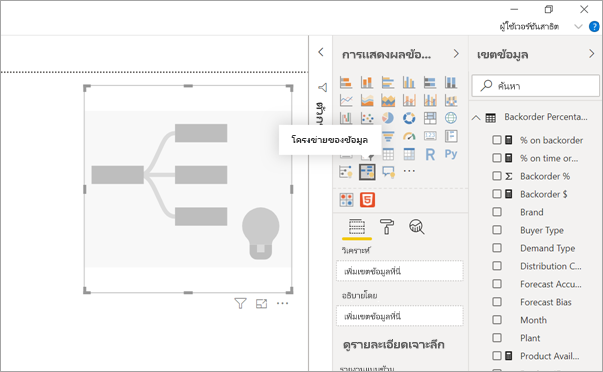
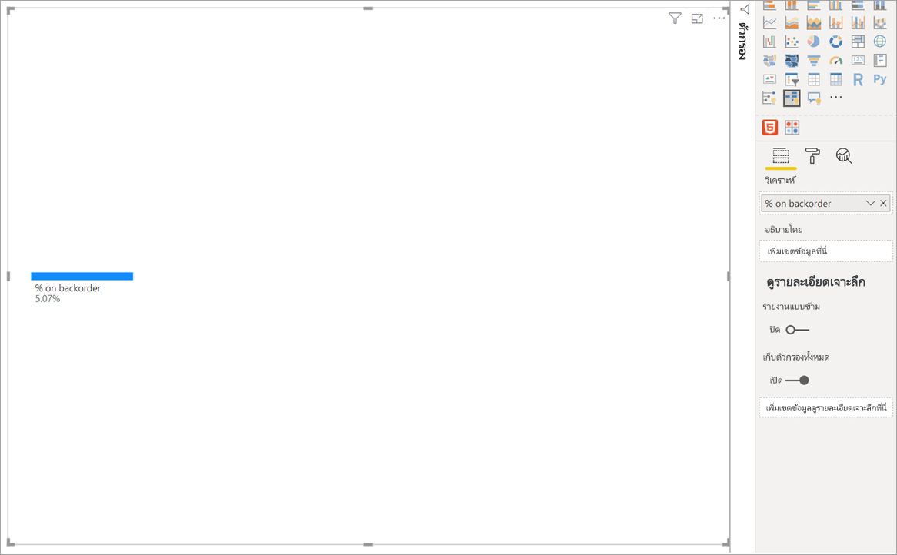
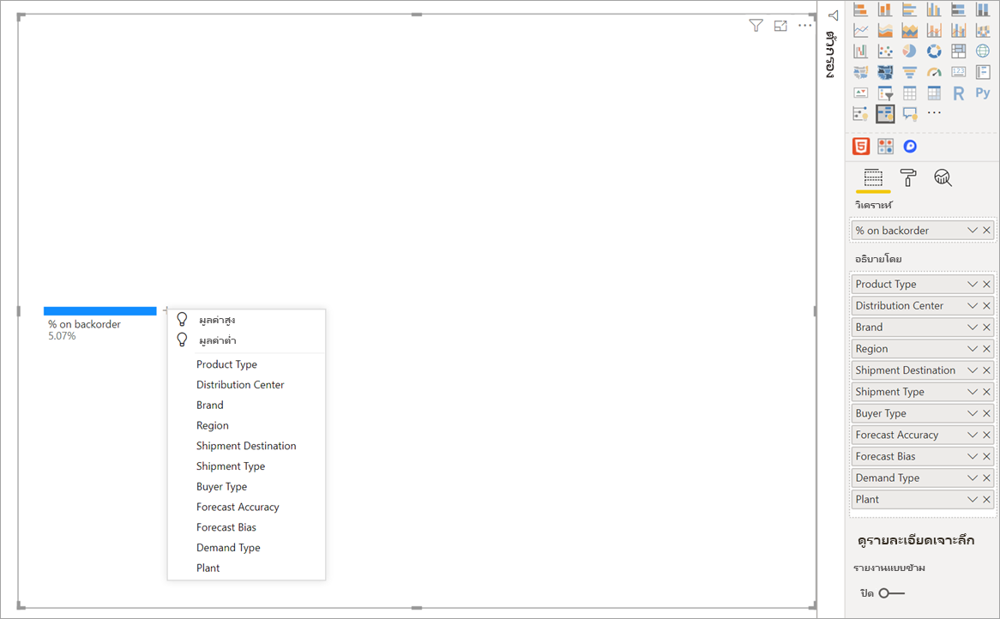
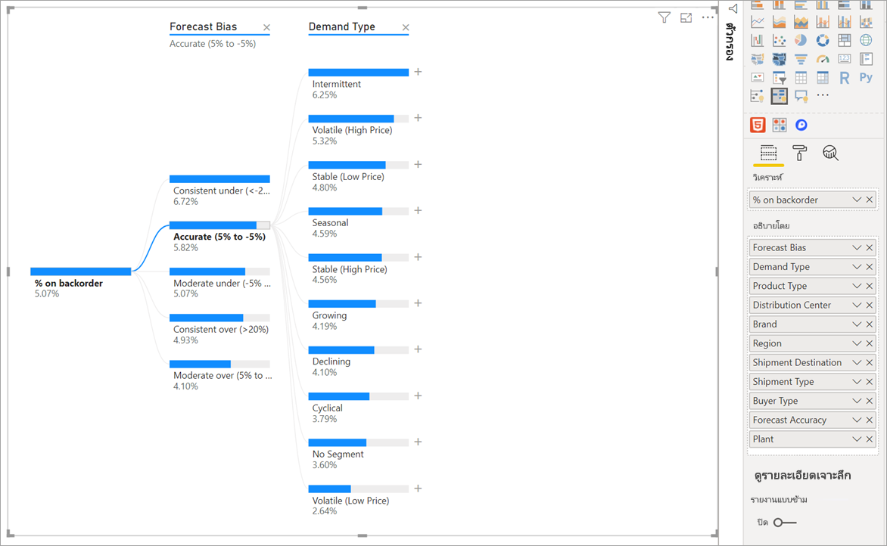
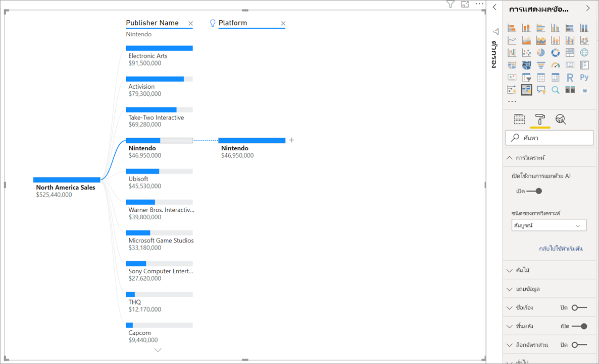
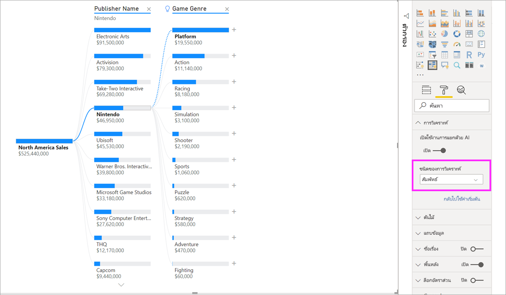
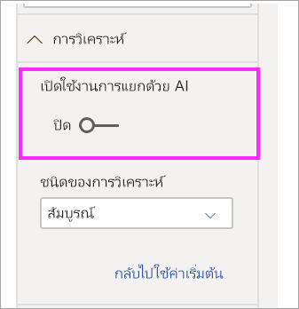

# สร้างและดูวิชวลโครงข่ายของข้อมูลใน Power BICreate and view decomposition tree visuals in Power BI

[!INCLUDE[consumer-appliesto-nyyn](../includes/consumer-appliesto-nyyn.md)]

[!INCLUDE [power-bi-visuals-desktop-banner](../includes/power-bi-visuals-desktop-banner.md)]

การแสดงผลด้วยภาพโครงข่ายของข้อมูลใน Power BI ช่วยให้คุณสามารถแสดงภาพข้อมูลข้ามหลายมิติได้The decomposition tree visual in Power BI lets you visualize data across multiple dimensions. โดยจะรวมข้อมูลและช่วยให้เจาะลึกลงในมิติของคุณในลำดับใดก็ได้It automatically aggregates data and enables drilling down into your dimensions in any order. นอกจากนี้ยังเป็นการแสดงภาพข่าวกรอง (AI) แบบเทียมเพื่อให้คุณสามารถขอให้ค้นหามิติถัดไปเพื่อดูรายละเอียดแนวลึกตามเกณฑ์บางอย่างIt is also an artificial intelligence (AI) visualization, so you can ask it to find the next dimension to drill down into based on certain criteria. ซึ่งทำให้เป็นเครื่องมือที่มีประโยชน์สำหรับการสำรวจแบบเฉพาะกิจและการดำเนินการวิเคราะห์สาเหตุหลักThis makes it a valuable tool for ad hoc exploration and conducting root cause analysis.

บทช่วยสอนนี้ใช้สองตัวอย่าง:This tutorial uses two examples:

- สถานการณ์ของห่วงโซ่อุปทานที่วิเคราะห์เปอร์เซ็นต์ของผลิตภัณฑ์ที่บริษัทมีในรายการค้างส่ง (สินค้าหมด)A supply chain scenario that analyzes the percentage of products a company has on backorder (out of stock).  
- สถานการณ์การขายที่แบ่งยอดขายของวิดีโอเกมตามปัจจัยหลายอย่างเช่น ประเภทเกมและผู้เผยแพร่A sales scenario that breaks down video game sales by numerous factors like game genre and publisher.

คุณสามารถค้นหา pbix ที่ใช้ในสถานการณ์ห่วงโซ่อุปทานได้ที่นี่: [Supply Chain Sample.pbix](
https://github.com/microsoft/powerbi-desktop-samples/blob/main/Sample%20Reports/Supply%20Chain%20Sample.pbix)You can find the pbix used in the supply chain scenario here: [Supply Chain Sample.pbix](
https://github.com/microsoft/powerbi-desktop-samples/blob/main/Sample%20Reports/Supply%20Chain%20Sample.pbix).

> [!NOTE]
> การแชร์รายงานของคุณกับผู้ร่วมงาน Power BI กำหนดให้คุณต้องมีสิทธิ์การใช้งาน Power BI Pro แต่ละรายการ หรือรายงานจะถูกบันทึกในความจุแบบพรีเมียมSharing your report with a Power BI colleague requires that you both have individual Power BI Pro licenses or that the report is saved in Premium capacity.    

## เริ่มใช้งานGet started
เลือกไอคอนแผนภูมิเส้นจากบานหน้าต่างการแสดงภาพSelect the decomposition tree icon from the Visualizations pane.

การแสดงภาพต้องใช้การป้อนข้อมูลสองชนิด:The visualization requires two types of input:

 - **วิเคราะห์** –การวัดที่คุณต้องการวิเคราะห์**Analyze** – the metric you would like to analyze. ซึ่งจะต้องเป็นหน่วยวัดหรือการรวมThis has to be a measure or an aggregate.  
 - **อธิบายโดย** –หนึ่งหรือหลายมิติตามที่คุณต้องการดูรายละเอียดแนวลึก**Explain By** – one or more dimensions you would like to drill down into.

เมื่อคุณลากหน่วยวัดของคุณลงในเขตข้อมูลแล้ว การอัปเดตการแสดงผลด้วยภาพจะแสดงหน่วยวัดรวมOnce you drag your measure into the field well, the visual updates showcasing the aggregated measure. ในตัวอย่างด้านล่างเราจะแสดง % เฉลี่ยของผลิตภัณฑ์บนรายการค้างส่ง (5.07%)In the example below, we are visualizing the average % of products on backorder (5.07%).

ขั้นตอนถัดไปคือการนำในหนึ่งหรือหลายมิติที่คุณต้องการดูรายละเอียดแนวลึกThe next step is to bring in one or more dimensions you would like to drill down into. เพิ่มเขตข้อมูลเหล่านี้ลงในบักเก็ต **อธิบายโดย**Add these fields to the **Explain by** bucket. โปรดสังเกตว่าเครื่องหมายบวกจะปรากฏถัดจากโหนดรากของคุณNotice that a plus sign appears next to your root node. การเลือก + ช่วยให้คุณสามารถเลือกเขตข้อมูลที่คุณต้องการดูรายละเอียดแนวลึกได้ (คุณสามารถดูฟิลด์ในลำดับใดก็ได้ที่คุณต้องการ)Selecting the + lets you choose which field you would like to drill into (you can drill into fields in any order that you want).

การเลือกชุดผลลัพธ์ **การคาดการณ์** ในแผนภูมิขยายและแบ่งหน่วยวัดตามค่าในคอลัมน์Selecting **Forecast bias** results in the tree expanding and breaking down the measure by the values in the column. สามารถทำซ้ำกระบวนการนี้ได้โดยการเลือกโหนดอื่นเพื่อดูรายละเอียดแนวลึกThis process can be repeated by choosing another node to drill into.

การเลือกโหนดจากตัวกรองข้ามระดับสุดท้ายของข้อมูลSelecting a node from the last level cross-filters the data. การเลือกโหนดจากระดับก่อนหน้าเปลี่ยนเส้นทางSelecting a node from an earlier level changes the path.

โต้ตอบด้วยการแสดงผลด้วยภาพอื่นๆ ผ่านตัวกรองโครงข่ายของข้อมูลInteracting with other visuals cross-filters the decomposition tree. ลำดับของโหนดภายในระดับสามารถเปลี่ยนเป็นผลลัพธ์ได้The order of the nodes within levels could change as a result.
ในตัวอย่างด้านล่าง เราได้ทำการกรองแบบผ่านตัวกรองโครงข่ายของข้อมูลด้วย UbisoftIn the example below, we've cross-filtered the tree by Ubisoft. เส้นทางจะอัปเดตและการขายของ Xbox จะย้ายจากอันดับหนึ่งไปเป็นอันดับสอง ซึ่งถูกแซงโดย PlayStationThe path updates and Xbox sales move from first to second place, surpassed by PlayStation. 

หากเรากรองจากโครงข่ายของ Nintendo ยอดขาย Xbox จะว่างเปล่าเนื่องจากไม่มีเกม Nintendo ที่พัฒนาขึ้นสำหรับ XboxIf we then cross-filter the tree by Nintendo, Xbox sales are blank as there are no Nintendo games developed for Xbox. Xbox พร้อมกับเส้นทางที่ตามมาได้รับการกรองออกจากมุมมองXbox, along with its subsequent path, gets filtered out of the view.

แม้ว่าเส้นทางจะหายไป ระดับที่มีอยู่ (ในประเภทเกมกรณีนี้) จะยังคงปักหมุดอยู่บนโครงข่ายDespite the path disappearing, the existing levels (in this case Game Genre) remain pinned on the tree. การเลือกโหนด Nintendo จะขยายแผนภูมิไปยังประเภทเกมโดยอัตโนมัติSelecting the Nintendo node therefore automatically expands the tree to Game Genre.

## การแยก AIAI splits

คุณสามารถใช้“ AI Splits” เพื่อหาว่าคุณควรดูข้อมูลต่อไปที่ใดYou can use “AI Splits” to figure out where you should look next in the data. การแยกเหล่านี้ปรากฏที่ด้านบนของรายการและมีการทำเครื่องหมายด้วยหลอดไฟThese splits appear at the top of the list and are marked with a lightbulb. การแยกจะช่วยให้คุณค้นหาค่าสูงสุดและต่ำสุดในข้อมูลได้โดยอัตโนมัติThe splits are there to help you find high and low values in the data, automatically.

การวิเคราะห์สามารถทำงานได้สองวิธีโดยขึ้นอยู่กับการกำหนดลักษณะของคุณThe analysis can work in two ways depending on your preferences. ลักษณะการทำงานเริ่มต้นจะเป็นดังนี้:The default behavior is as follows:

 - **ค่าสูง**: พิจารณาฟิลด์ทั้งหมดที่มีอยู่และกำหนดว่าจะเจาะเข้าไปที่ใดเพื่อรับค่าสูงสุดของการวัดที่กำลังวิเคราะห์**High Value**: Considers all available fields and determines which one to drill into to get the highest value of the measure being analyzed.  
 - **ค่าต่ำ**: พิจารณาฟิลด์ทั้งหมดที่มีอยู่และกำหนดว่าจะเจาะเข้าไปที่ใดเพื่อรับค่าสูงสุดของการวัดที่กำลังวิเคราะห์**Low Value**: Considers all available fields and determines which one to drill into to get the lowest value of the measure being analyzed.  

การเลือก **ค่าสูง** ในตัวอย่างสินค้าค้าง ส่งผลลัพธ์ดังต่อไปนี้:Selecting **High Value** in the backorders example, results in the following:

หลอดไฟจะปรากฏขึ้นถัดจาก **ประเภทผลิตภัณฑ์** ที่ระบุว่านี่เป็น 'AI แยก'A lightbulb appears next to **Product Type** indicating this was an ‘AI split’. แผนผังยังมีเส้นประที่แนะนำโหนด **การตรวจสอบผู้ป่วย** เนื่องจากชุดผลลัพธ์นั้นมีค่าสูงสุดของรายการค้าง (9.2%).The tree also provides a dotted line recommending the **Patient Monitoring** node as that results in the highest value of backorders (9.2%). 

วางเมาส์เหนือหลอดไฟเพื่อดูเคล็ดลับเครื่องมือHover over the lightbulb to see a tooltip. ในตัวอย่างนี้คำแนะนำเครื่องมือคือ “% ตามรายการค้างสูงสุดเมื่อประเภทผลิตภัณฑ์คือการตรวจสอบผู้ป่วย”In this example, the tooltip is “% on backorder is highest when Product Type is Patient Monitoring”.

คุณสามารถกำหนดค่าการแสดงผลด้วยภาพเพื่อค้นหาการแยก **แบบสัมพัทธ์** เมื่อเทียบกับ **แบบสัมบูรณ์**You can configure the visual to find **Relative** AI splits as opposed to **Absolute** ones. 

โหมดสัมพัทธ์จะค้นหาค่าสูงที่โดดเด่น (เปรียบเทียบกับส่วนที่เหลือของข้อมูลในคอลัมน์)Relative mode looks for high values that stand out (compared to the rest of the data in the column). เพื่อแสดงให้เห็นตัวอย่าง มาลองดูตัวอย่างต่อไปนี้:To illustrate this, let’s take a look at an example:

ในสกรีนช็อตด้านบน เรากำลังมองหายอดขายของวิดีโอเกมในอเมริกาเหนือIn the screenshot above, we are looking at North America sales of video games. ก่อนอื่นเราจะแยกโครงข่ายด้วย **ชื่อผู้เผยแพร่** จากนั้นดูรายละเอียดใน NintendoWe first split the tree by **Publisher Name** and then drill into Nintendo. การเลือก **ค่าสูง** ผลลัพธ์ในการขยายของ **แพลตฟอร์มคือ Nintendo**Selecting **High Value** results in the expansion of **Platform is Nintendo**. เนื่องจาก Nintendo (ผู้เผยแพร่) เท่านั้นที่พัฒนาสำหรับคอนโซล Nintendo มีค่าเพียงค่าเดียวเท่านั้นดังนั้นค่าสูงสุดจึงไม่น่าแปลกใจSince Nintendo (the publisher) only develops for Nintendo consoles, there is only one value present and so that is unsurprisingly the highest value.

อย่างไรก็ตามการแยกที่น่าสนใจยิ่งขึ้นคือการดูว่าค่าสูงเด่นกว่าค่าอื่นๆ ในคอลัมน์เดียวกันหรือไม่Nevertheless, a more interesting split would be to look at which high value stands out relative to other values in the same column. ถ้าเราเปลี่ยนชนิดการวิเคราะห์จาก **แบบสัมบูรณ์** เป็น **แบบสัมพัทธ์** เราได้รับผลลัพธ์ดังต่อไปนี้สำหรับ Nintendo: If we change the Analysis type from **Absolute** to **Relative**, we get the following result for Nintendo: 

เวลานี้ค่าที่แนะนำคือ **แพลตฟอร์มภายในประเภทเกม**This time, the recommended value is **Platform within Game Genre**.  แพลตฟอร์มไม่ได้ให้ค่าสัมบูรณ์สูงกว่า Nintendo ($19,950,000 เทียบกับ $46,950,000)Platform doesn’t yield a higher absolute value than Nintendo ($19,950,000 vs. $46,950,000). อย่างไรก็ตามมันเป็นคุณค่าที่โดดเด่นNevertheless it’s a value that stands out.

แม่นยำยิ่งขึ้นเนื่องจากมีค่าเกม 10 ประเภทค่าที่คาดหวังสำหรับแพลตฟอร์มจะเท่ากับ $4.6 M หากพวกเขาถูกแบ่งเท่าๆ กันMore precisely, since there are 10 Game Genre values, the expected value for Platform would be $4.6M if they were to be split evenly. เนื่องจากแพลตฟอร์มมีมูลค่าเกือบ $20M ซึ่งเป็นผลลัพธ์ที่น่าสนใจเนื่องจากสูงกว่าผลลัพธ์ที่คาดไว้ถึงสี่เท่าSince Platform has a value of almost $20M, that is an interesting result as it is four times higher than the expected result.

การคำนวณมีดังนี้:The calculation is as follows:

ยอดขายในอเมริกาเหนือสำหรับแพลตฟอร์ม/ Abs (ค่าเฉลี่ย (ยอดขายในอเมริกาเหนือสำหรับประเภทเกม))North America Sales for Platform/ Abs(Avg(North America Sales for Game Genre))  
vsvs.  
ยอดขายในอเมริกาเหนือสำหรับ Nintendo / Abs (เฉลี่ย (ยอดขายในอเมริกาเหนือสำหรับแพลตฟอร์ม))North America Sales for Nintendo / Abs(Avg(North America Sales for Platform))  

ซึ่งตีเป็น:Which translates to:

19,550,000 / (19,550,000 + 11,140,000 + ... + 470,000 + 60,000 /10) = 4.25x19,550,000 / (19,550,000 + 11,140,000 + ... + 470,000 + 60,000 /10) = 4.25x  
vsvs.  
46,950,000/ (46,950,000/1) = 1x46,950,000/ (46,950,000/1) = 1x  

หากคุณไม่ต้องการใช้การแบ่ง AI ใด ๆ ในแผนผังคุณยังมีตัวเลือกในการปิดการใช้งานเหล่านี้ภายใต้ตัวเลือก **การจัดรูปแบบการวิเคราะห์** ตัวเลือก:If you prefer not to use any AI splits in the tree, you also have the option of turning them off under the **Analysis formatting** options:  

## การโต้ตอบกับโครงข่ายของ AITree interactions with AI splits

คุณสามารถมี AI ได้หลายระดับYou can have multiple subsequent AI levels. นอกจากนี้คุณยังสามารถผสม  AI ระดับต่างๆ ได้ (จากค่าสูงไปหาค่าต่ำและกลับไปเป็นมูลค่าสูง):You can also mix up different kinds of AI levels (go from High Value to Low Value and back to High Value):

หากคุณเลือกโหนดอื่นในโครงข่าย AI แยกจะคำนวณใหม่ตั้งแต่เริ่มต้นIf you select a different node in the tree, the AI Splits recalculate from scratch. ในตัวอย่างด้านล่างเราเปลี่ยนโหนดที่เลือกในระดับ **การคาดการณ์อคติ**In the example below, we changed the selected node in the **Forecast Bias** level. ระดับที่ตามมาจะเปลี่ยนเพื่อให้ได้ค่าที่สูงและต่ำที่ถูกต้องThe subsequent levels change to yield the correct High and Low Values.

ระดับ AI จะคำนวณอีกครั้งเมื่อคุณผ่านการกรองโครงข่ายของข้อมูลด้วยภาพอื่นAI levels are also recalculated when you cross-filter the decomposition tree by another visual. ในตัวอย่างด้านล่างเราจะเห็นว่า % รายการค้าง ของเราสูงสุดสำหรับโรงงาน #0477In the example below, we can see that our backorder % is highest for Plant #0477.

แต่ถ้าเราเลือก **เดือนเมษายน** ในแผนภูมิแท่ง การเปลี่ยนแปลงสูงสุดของ **ชนิดผลิตภัณฑ์คือราคาประหยัดขั้นสูง**But if we select **April** in the bar chart, the highest changes to **Product Type is Advanced Surgical**. ในกรณีนี้ไม่ได้เป็นเพียงแค่โหนดที่เรียงลำดับใหม่ แต่เลือกคอลัมน์ที่แตกต่างอย่างสิ้นเชิงIn this case, it’s not just the nodes that got reordered, but a completely different column was chosen. 

หากเราต้องการให้ระดับ  AI ทำงานเหมือนระดับที่ไม่ใช่  AI ให้เลือกหลอดไฟเพื่อเปลี่ยนพฤติกรรมกลับเป็นค่าเริ่มต้นIf we want AI levels to behave like non-AI levels, select the lightbulb to revert the behavior to default. 

ในขณะที่หลายระดับ  AI สามารถผูกมัดด้วยกัน แต่ระดับที่ไม่ใช่  AI ไม่สามารถติดตามระดับ  AI ได้While multiple AI levels can be chained together, a non-AI level cannot follow an AI level. หากเราทำการแยกแบบแมนนวลหลังจากการแยกแบบ  AI หลอดไฟจากระดับ  AI จะหายไปและระดับจะเปลี่ยนเป็นระดับปกติIf we do a manual split following an AI split, the lightbulb from the AI level disappears and the level transforms into a normal level. 

## การล็อกLocking

ผู้สร้างเนื้อหาสามารถล็อคระดับสำหรับผู้ใช้บริโภคA content creator can lock levels for report consumers. เมื่อระดับถูกล็อคจะไม่สามารถลบหรือเปลี่ยนแปลงได้When a level is locked, it cannot be removed or changed. ผู้บริโภคสามารถสำรวจเส้นทางที่แตกต่างภายในระดับล็อค แต่พวกเขาไม่สามารถเปลี่ยนระดับเองได้A consumer can explore different paths within the locked level but they cannot change the level itself. ในฐานะผู้สร้าง คุณสามารถวางเมาส์เหนือระดับที่มีอยู่เพื่อดูไอคอนล็อคได้As a creator you can hover over existing levels to see the lock icon. คุณสามารถล็อคได้หลายระดับตามที่คุณต้องการ แต่คุณไม่สามารถปลดล็อคระดับก่อนหน้าระดับล็อคได้You can lock as many levels as you want, but you cannot have unlocked levels preceding locked levels.

ในตัวอย่างด้านล่าง มีสองระดับแรกถูกล็อคIn the example below, the first two levels are locked. ซึ่งหมายความว่าผู้บริโภคดังกล่าวสามารถเปลี่ยนเป็นระดับ 3 และ 4 และเพิ่มระดับใหม่ในภายหลังได้This means that report consumers can change level 3 and 4, and even add new levels afterwards. อย่างไรก็ตาม จะไม่สามารถเปลี่ยนแปลงสองระดับแรกได้:The first two levels however cannot be changed:

## ข้อจำกัดที่ทราบKnown limitations

จำนวนสูงสุดของระดับสำหรับทรีคือ 50The maximum number of levels for the tree is 50. จำนวนสูงสุดของจุดข้อมูลที่สามารถแสดงภาพได้ในหนึ่งครั้งบนทรีคือ 5,000Maximum number of data points that can be visualized at one time on the tree is 5000. เราตัดทอนระดับเพื่อแสดง Top nWe truncate levels to show top n. ในปัจจุบัน Top n ต่อระดับจะถูกตั้งค่าเป็น 10Currently the top n per level is set to 10. 

โครงข่ายของข้อมูลไม่สนับสนุนสถานการณ์ต่อไปนี้:The decomposition tree is not supported in the following scenarios:  
-   ไม่สามารถเข้าถึงบริการการวิเคราะห์ภายในองค์กรได้On-premises Analysis Services

การแยก AI ไม่ได้รับการสนับสนุนในสถานการณ์ต่อไปนี้:AI splits are not supported in the following scenarios:  
-   Azure Analysis ServicesAzure Analysis Services
-   เซิร์ฟเวอร์รายงาน Power BIPower BI Report Server
-   เผยแพร่บนเว็บPublish to Web
-   หน่วยวัดที่ซับซ้อนและหน่วยวัดจากส่วนขยาย schema ใน ' วิเคราะห์ 'Complex measures and measures from extensions schemas in 'Analyze'

ข้อจำกัดด้านอื่น:Other limitations:
- การสนับสนุนภายในถามตอบSupport inside Q&A

## ขั้นตอนถัดไปNext steps

[สร้างแผนภูมิโดนัท Power BIPower BI doughnut chart](power-bi-visualization-doughnut-charts.md)

[การแสดงผลข้อมูลด้วยภาพของ Power BIPower BI visualizations](power-bi-report-visualizations.md)

